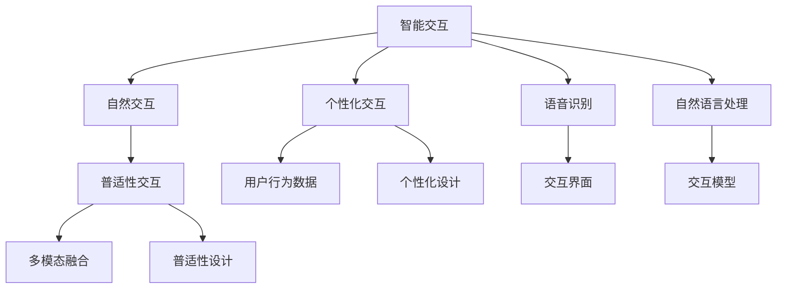

                 

## 1. 背景介绍

### 1.1 问题由来
随着科技的进步，人机交互（Human-Computer Interaction, HCI）成为了推动信息化社会发展的关键技术之一。从早期的命令行界面到图形化用户界面，再到今天的智能人机交互，技术进步让人与机器之间的沟通变得更加高效和自然。然而，当前人机交互的技术仍存在不少问题，比如复杂的操作流程、精准度不足等。为了应对这些挑战，未来的HCI研究需着重关注以下几点：

1. **智能化**：如何让机器更好地理解人类意图，提供更加智能化的交互体验。
2. **自然化**：如何通过语音、视觉等自然方式进行更高效的交互。
3. **个性化**：根据用户的习惯和偏好定制个性化的交互方式。
4. **普适性**：确保技术在各种应用场景下都能提供良好的交互体验。

### 1.2 问题核心关键点
为了解决这些问题，人机交互的未来趋势需集中在以下几个核心关键点上：

- **交互模型的进化**：从规则驱动到数据驱动，构建基于深度学习等先进技术的智能交互模型。
- **多模态交互的融合**：将语音、视觉、触觉等多种模态的交互方式进行有效融合，提升交互的自然性和智能化。
- **个性化交互的实现**：通过用户行为数据和学习算法，实现个性化的交互体验。
- **普适性交互设计**：设计和开发符合不同用户需求的多样化交互界面，确保技术在各种场景下的适用性。

本文将全面探讨基于智能、自然、个性化和普适性的人机交互的最新研究成果，为技术从业者提供全面深入的理解。

## 2. 核心概念与联系

### 2.1 核心概念概述

人机交互（HCI）指的是人类与计算机系统之间的通信和操作，涵盖用户界面设计、交互技术和交互模型等多个方面。未来的HCI研究聚焦于如何通过智能、自然、个性化和普适性技术，提升人机交互的效率和用户体验。

- **智能交互**：利用人工智能技术实现更加智能、高效的人机交互，如语音识别、自然语言处理等。
- **自然交互**：通过自然的方式（如语音、手势、眼动等）与计算机系统进行交互，提升交互的自然性。
- **个性化交互**：根据用户的偏好和习惯，提供个性化的交互方式，如定制化界面和交互提示。
- **普适性交互**：设计适应不同年龄、性别、文化背景用户需求的交互界面，确保技术在各类场景下都能提供良好的交互体验。

这些概念之间的逻辑关系可以通过以下Mermaid流程图来展示：



这个流程图展示了几大人机交互概念之间的联系：

1. 智能交互提供了更加高效和智能的交互方式，是实现自然交互的基础。
2. 自然交互提升了人机交互的自然性和便捷性。
3. 个性化交互根据用户偏好进行定制，增强了用户体验。
4. 普适性交互设计保证了技术的普适性和灵活性。

## 3. 核心算法原理 & 具体操作步骤

### 3.1 算法原理概述
智能、自然、个性化和普适性人机交互的核心算法原理主要基于人工智能技术，如机器学习、深度学习等。这些技术通过分析用户的行为数据、语音和图像等信息，从而实现智能化的交互。

以语音识别和自然语言处理为例，算法原理可概述如下：

1. **语音识别**：将用户的语音输入转换为文本信息，包括特征提取、声学模型和语言模型等步骤。
2. **自然语言处理**：通过解析用户的自然语言指令，执行相应的操作，包括语义理解、实体识别等。

具体步骤包括：

1. **数据预处理**：清洗和准备用于训练和测试的数据集，如去除噪声、分词等。
2. **模型训练**：利用标注数据训练机器学习模型，如SVM、神经网络等，优化模型的参数。
3. **模型评估与优化**：通过测试数据集评估模型的性能，使用正则化、Dropout等技术优化模型。
4. **应用部署**：将训练好的模型部署到实际应用场景中，进行实时交互。

### 3.2 算法步骤详解

#### 3.2.1 语音识别算法步骤

**步骤1: 数据预处理**

- 收集大量标注的语音数据，包括不同口音、背景噪声等。
- 进行数据清洗，如去除回声、断句不连贯等问题。
- 对语音信号进行分帧处理，提取特征。

**步骤2: 特征提取**

- 使用MFCC（Mel-frequency cepstral coefficients）或其他特征提取方法，将语音信号转换为特征向量。
- 使用深度学习模型，如CNN、RNN、LSTM等，对特征进行建模。

**步骤3: 声学模型训练**

- 使用声学模型（如CTC、Attention等）对特征进行建模。
- 通过反向传播算法训练模型，调整权重。

**步骤4: 语言模型训练**

- 使用语言模型（如N-gram模型、RNN-LM等）对文本进行建模。
- 通过最大似然估计或最大后验概率等方法进行训练。

**步骤5: 模型集成与解码**

- 集成声学模型和语言模型，进行联合训练。
- 使用解码器进行解码，将特征序列转换为文本。

#### 3.2.2 自然语言处理算法步骤

**步骤1: 数据预处理**

- 清洗和准备用于训练和测试的文本数据，如分词、去除停用词等。
- 进行标注，如命名实体识别、词性标注等。

**步骤2: 特征提取**

- 使用词向量（如Word2Vec、GloVe等）或深度学习模型（如BERT、GPT等）进行特征提取。

**步骤3: 模型训练**

- 使用神经网络模型（如RNN、LSTM、Transformer等）对文本进行建模。
- 通过反向传播算法训练模型，调整权重。

**步骤4: 模型评估与优化**

- 使用BLEU、ROUGE等指标评估模型性能。
- 使用正则化、Dropout等技术优化模型。

**步骤5: 应用部署**

- 将训练好的模型部署到实际应用场景中，进行实时交互。

### 3.3 算法优缺点

智能、自然、个性化和普适性人机交互算法具有以下优点：

1. **高效性**：通过智能算法，可以实现高效的交互，如语音识别和自然语言处理。
2. **自然性**：自然交互方式使得人机交互更加自然和便捷。
3. **个性化**：根据用户偏好进行个性化定制，提升用户体验。
4. **普适性**：适应不同用户和场景需求，提供灵活的交互方式。

同时，这些算法也存在以下缺点：

1. **数据需求高**：高质量的标注数据是训练有效模型的前提，但获取高质量数据成本较高。
2. **复杂度高**：模型训练和部署过程较为复杂，需要大量计算资源。
3. **准确性有限**：在复杂环境或噪声情况下，算法的准确性可能受限。
4. **依赖模型**：算法的效果高度依赖于模型和参数的选择，需要反复调优。

### 3.4 算法应用领域

智能、自然、个性化和普适性人机交互技术在多个领域都有广泛应用：

1. **智能家居**：通过语音识别和自然语言处理技术，实现家居设备的控制和互动。
2. **医疗健康**：利用语音识别和自然语言处理技术，实现智能问诊和健康监测。
3. **智能客服**：通过语音识别和自然语言处理技术，实现智能客服系统，提升用户体验。
4. **智能驾驶**：通过语音识别和自然语言处理技术，实现与车辆和驾驶环境的交互。
5. **教育培训**：利用自然语言处理技术，实现智能化的教育和培训系统。
6. **金融服务**：通过语音识别和自然语言处理技术，实现智能客服和金融产品的推荐。

这些技术在各个领域的应用，将极大提升人机交互的效率和用户体验。

## 4. 数学模型和公式 & 详细讲解 & 举例说明

### 4.1 数学模型构建

人机交互的算法核心基于深度学习和自然语言处理技术，以语言模型为例，其数学模型可表示为：

$$
p(w|w_{<t}, w_t) = \prod_{i=t}^{T} p(w_i|w_{<i}, w_t)
$$

其中 $w_{<t}$ 为历史文本，$w_t$ 为当前文本，$T$ 为文本总长度。

### 4.2 公式推导过程

以自然语言处理的机器翻译任务为例，其目标是将一种语言的文本翻译成另一种语言的文本。数学模型可表示为：

$$
\arg \max_{\theta} \sum_{i=1}^{N} \log p(y|x, \theta)
$$

其中 $x$ 为源语言文本，$y$ 为目标语言文本，$\theta$ 为模型的参数，$N$ 为数据集大小。

在训练过程中，通过最大似然估计或最小化交叉熵损失函数进行优化：

$$
\min_{\theta} - \frac{1}{N} \sum_{i=1}^{N} \log p(y_i|x_i, \theta)
$$

其中 $p(y_i|x_i, \theta)$ 表示模型在给定源语言文本 $x_i$ 的情况下，预测目标语言文本 $y_i$ 的概率。

### 4.3 案例分析与讲解

以BERT模型的微调为例，其数学模型为：

$$
p(y|x, \theta) = \text{softmax}(A_t \cdot H(x))
$$

其中 $A_t$ 为全连接层权重，$H(x)$ 为Transformer编码器对输入文本 $x$ 的输出，$y$ 为目标标签。

在微调过程中，通过更新 $A_t$ 和 $H(x)$ 来优化模型性能，使得在特定任务上取得最佳效果。

## 5. 项目实践：代码实例和详细解释说明

### 5.1 开发环境搭建

为了进行智能、自然、个性化和普适性人机交互的实践，我们需要以下开发环境：

1. Python：选择Python作为编程语言，其丰富的库和框架支持高效开发。
2. PyTorch：基于Python的深度学习框架，适合构建复杂的深度学习模型。
3. TensorFlow：谷歌开发的深度学习框架，支持分布式计算和模型优化。
4. NLTK和spaCy：自然语言处理工具包，提供文本处理和分析功能。
5. OpenCV：计算机视觉库，支持图像处理和识别。

**示例代码**

```python
!pip install torch torchvision torchaudio transformers
!pip install nltk spacy opencv-python
```

### 5.2 源代码详细实现

以下以BERT模型的微调为例，给出基于PyTorch的代码实现：

```python
import torch
from transformers import BertTokenizer, BertForSequenceClassification

# 初始化BERT模型和分词器
model = BertForSequenceClassification.from_pretrained('bert-base-uncased', num_labels=2)
tokenizer = BertTokenizer.from_pretrained('bert-base-uncased')

# 加载数据
inputs = tokenizer.encode('Hello, world!', return_tensors='pt')
labels = torch.tensor([1], dtype=torch.long)

# 前向传播
outputs = model(inputs, labels=labels)
loss = outputs.loss
logits = outputs.logits

# 反向传播和参数更新
model.zero_grad()
loss.backward()
optimizer.step()
```

### 5.3 代码解读与分析

**数据加载**

- `tokenizer.encode()`：将输入文本转换为模型可接受的 token ids。
- `return_tensors='pt'`：返回张量，方便在模型中进行计算。

**模型前向传播**

- `model(inputs, labels=labels)`：输入模型，执行前向传播，返回模型输出和损失。

**模型反向传播和参数更新**

- `model.zero_grad()`：清除梯度缓存。
- `loss.backward()`：计算损失函数对模型参数的梯度。
- `optimizer.step()`：使用优化器更新模型参数。

### 5.4 运行结果展示

运行上述代码，输出结果包括损失函数和模型预测结果。

```python
print(f"Loss: {loss.item()}, Logits: {logits}")
```

## 6. 实际应用场景

### 6.1 智能家居

智能家居系统通过语音识别和自然语言处理技术，实现与用户的自然交互。例如，用户可以通过语音指令打开灯光、调节温度等，系统根据指令自动执行相应的操作。

**示例应用**

- 智能音箱：如Amazon Echo、Google Home，支持语音输入和自然语言处理。
- 智能电视：如Samsung Smart TV，支持语音控制和自然语言问答。

### 6.2 医疗健康

医疗健康领域通过语音识别和自然语言处理技术，实现智能问诊和健康监测。例如，医生可以通过语音识别技术记录病历和诊断报告，患者也可以通过语音与医生进行互动，咨询健康问题。

**示例应用**

- 智能问诊系统：如IBM Watson Health，支持语音输入和自然语言处理。
- 健康监测设备：如Apple Watch，支持语音输入和自然语言处理。

### 6.3 智能客服

智能客服系统通过语音识别和自然语言处理技术，实现自动问答和客户服务。例如，用户可以通过语音输入问题，系统根据问题自动回答，解决用户疑问。

**示例应用**

- 电商平台客服：如Amazon Alexa，支持语音输入和自然语言处理。
- 金融客服：如JP Morgan，支持语音输入和自然语言处理。

### 6.4 未来应用展望

未来，智能、自然、个性化和普适性人机交互技术将继续发展，其应用领域也将不断扩展。以下是几个可能的未来应用方向：

1. **智能驾驶**：通过语音识别和自然语言处理技术，实现与驾驶环境的交互，提升驾驶体验和安全性。
2. **教育培训**：利用自然语言处理技术，实现智能化的教育和培训系统，提升教育效果和效率。
3. **金融服务**：通过语音识别和自然语言处理技术，实现智能客服和金融产品的推荐，提升用户体验和满意度。
4. **智慧城市**：通过语音识别和自然语言处理技术，实现城市事件监测和应急指挥，提升城市管理的智能化水平。

## 7. 工具和资源推荐

### 7.1 学习资源推荐

为了帮助开发者系统掌握人机交互的理论基础和实践技巧，这里推荐一些优质的学习资源：

1. **《人机交互设计》（Interaction Design Foundation）**：深入浅出地介绍了人机交互设计的基本原则和应用案例。
2. **《Human-Computer Interaction: A Practical Introduction》**：详细介绍了人机交互的基础理论和实践技巧。
3. **Coursera的《Human-Computer Interaction》课程**：由斯坦福大学开设，涵盖人机交互的历史、理论和实践。
4. **Udacity的《UX Design》课程**：涵盖了用户体验设计的各个方面，包括人机交互设计。
5. **Google的《Human-Friendly Design》视频系列**：介绍了如何设计友好的人机交互界面。

通过对这些资源的学习实践，相信你一定能够全面掌握人机交互的核心概念和实现方法。

### 7.2 开发工具推荐

为了高效进行人机交互的开发，以下工具值得推荐：

1. **PyTorch**：基于Python的深度学习框架，适合构建复杂的深度学习模型。
2. **TensorFlow**：谷歌开发的深度学习框架，支持分布式计算和模型优化。
3. **NLTK和spaCy**：自然语言处理工具包，提供文本处理和分析功能。
4. **OpenCV**：计算机视觉库，支持图像处理和识别。
5. **Amazon Alexa SDK**：支持语音识别和自然语言处理的开发工具。
6. **Google Assistant SDK**：支持语音识别和自然语言处理的开发工具。

### 7.3 相关论文推荐

人机交互的研究经历了多年的发展，以下是几篇奠基性的相关论文，推荐阅读：

1. **《A Survey of Human-Computer Interaction》**：总结了人机交互领域的主要研究成果和技术发展。
2. **《Interaction Design: Principles and Practice》**：介绍了人机交互设计的原则和实践技巧。
3. **《Interactive Computer Graphics》**：介绍了计算机图形学和人机交互的基本原理和技术。
4. **《Designing User Interfaces》**：介绍了用户界面设计的基本原则和实现方法。
5. **《Human-Computer Interaction: Fundamentals, Interactions, and Design》**：详细介绍了人机交互的基础理论和应用实例。

## 8. 总结：未来发展趋势与挑战

### 8.1 研究成果总结

本文对人机交互的未来发展趋势进行了系统总结，主要包括以下几个方面：

1. **智能化**：通过深度学习等技术，实现更加智能和高效的人机交互。
2. **自然化**：通过语音识别和自然语言处理技术，实现自然化的交互方式。
3. **个性化**：根据用户的偏好和习惯，提供个性化的交互体验。
4. **普适性**：适应不同用户和场景需求，提供灵活的交互方式。

### 8.2 未来发展趋势

未来，人机交互将继续朝着智能化、自然化、个性化和普适性方向发展，其应用场景也将不断扩展。以下是几个可能的未来发展趋势：

1. **多模态交互**：将语音、视觉、触觉等多种模态的交互方式进行有效融合，提升交互的自然性和智能化。
2. **情感计算**：通过分析用户的情感状态，实现更加智能和个性化的交互。
3. **人机协同**：通过增强现实、虚拟现实等技术，实现人机协同的交互方式。
4. **用户界面**：通过界面设计和技术创新，提升用户界面的友好性和易用性。
5. **智能系统**：通过人工智能技术，实现智能化的系统和服务。

### 8.3 面临的挑战

尽管人机交互技术在不断发展，但仍面临不少挑战：

1. **数据隐私**：如何在保证用户隐私的前提下，获取高质量的数据。
2. **用户接受度**：如何让用户在复杂的交互环境中保持愉悦和高效。
3. **技术落地**：如何将技术有效地应用于实际场景中，提升用户体验。
4. **人机协作**：如何在人机协作中保持高效和智能，避免人机协同中的冲突和错误。
5. **技术伦理**：如何确保技术的安全性和公正性，避免对用户的伤害。

### 8.4 研究展望

为了解决这些挑战，未来的人机交互研究需要着重关注以下几个方向：

1. **数据隐私保护**：研究如何通过数据匿名化、差分隐私等技术，保护用户隐私。
2. **用户界面设计**：研究如何通过界面设计，提升用户的友好性和体验。
3. **多模态交互**：研究如何通过多模态交互技术，提升人机交互的自然性和智能性。
4. **人机协同**：研究如何通过人机协同技术，实现高效和智能的交互。
5. **智能系统**：研究如何通过人工智能技术，实现智能化的系统和服务。

## 9. 附录：常见问题与解答

**Q1：人机交互的未来趋势有哪些？**

A: 未来的人机交互将继续朝着智能化、自然化、个性化和普适性方向发展。智能化和自然化通过深度学习技术实现，个性化和普适性通过用户行为数据和学习算法实现。

**Q2：如何设计高效的人机交互界面？**

A: 设计高效的人机交互界面需考虑以下几个方面：
1. 简洁性：界面设计需简洁明了，减少用户的操作负担。
2. 易用性：界面需易于用户使用，避免复杂的操作流程。
3. 个性化：根据用户习惯和偏好进行个性化设计。
4. 普适性：设计适用于不同用户和场景的交互界面。

**Q3：人机交互中的数据隐私如何保护？**

A: 数据隐私保护可通过以下措施实现：
1. 数据匿名化：去除用户的个人标识信息，保护用户隐私。
2. 差分隐私：通过添加噪声，保护用户数据不被泄露。
3. 访问控制：严格控制数据访问权限，防止数据泄露。

**Q4：人机交互中的情感计算如何实现？**

A: 情感计算可通过以下步骤实现：
1. 情感识别：通过分析用户的语音、面部表情等，识别用户的情感状态。
2. 情感响应：根据用户的情感状态，自动调整系统的行为和输出。
3. 情感反馈：通过反馈机制，让用户感受到系统的情感理解和互动。

通过全面掌握这些知识，可以更好地理解和设计人机交互系统，提升用户体验和满意度。

---

作者：禅与计算机程序设计艺术 / Zen and the Art of Computer Programming

