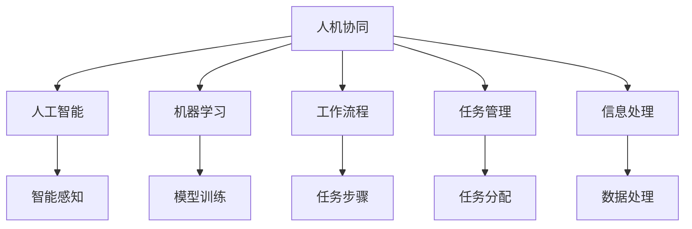

                 

# 人机协同模式对工作效率的影响

> 关键词：人机协同,机器学习,人工智能,工作流程,任务管理,信息处理

## 1. 背景介绍

### 1.1 问题由来
随着科技的进步和信息时代的到来，人工智能（AI）和机器学习（ML）技术在各行各业中得到了广泛应用，极大地提升了工作效率和生产力。特别是人机协同模式，将人类智能和机器智能结合起来，使得双方在各自擅长的领域内发挥优势，实现互补。然而，如何科学地评估和优化人机协同模式，使其更好地服务于实际工作，仍是当前需要解决的重要问题。

### 1.2 问题核心关键点
人机协同模式的核心在于如何有效地利用人工智能工具来辅助人类完成工作。这涉及到以下几个关键点：
1. **协同效率**：人机协同模式应尽可能提高工作效率，减少人力负担。
2. **任务分配**：将合适的任务分配给最合适的人或机器，实现最优资源配置。
3. **信息处理**：高效处理海量数据，提取有价值的信息，提供决策支持。
4. **用户友好性**：界面设计要符合用户习惯，易于上手和操作。
5. **协同学习**：人与机器之间可以相互学习和适应，不断提高协同效果。

## 2. 核心概念与联系

### 2.1 核心概念概述

为更好地理解人机协同模式对工作效率的影响，本节将介绍几个密切相关的核心概念：

- **人机协同（Human-Machine Collaboration, HMC）**：指将人的智能和机器的智能相结合，共同完成工作任务的模式。通过合理分配任务，充分发挥各自优势，实现协同效应。
- **人工智能（Artificial Intelligence, AI）**：指模拟人类智能行为，使机器具备感知、学习、推理等能力的计算机科学分支。
- **机器学习（Machine Learning, ML）**：指通过数据驱动的方式，使机器自动学习和优化任务处理能力的算法和技术。
- **工作流程（Workflow）**：指完成一个工作任务所需的一系列步骤和环节。
- **任务管理（Task Management）**：指对工作任务进行规划、分配和监控的过程，旨在优化资源利用和提高工作效率。
- **信息处理（Information Processing）**：指对数据进行收集、存储、处理和分析，提取有用信息的过程。

这些核心概念之间的逻辑关系可以通过以下Mermaid流程图来展示：



这个流程图展示了我们关注的几个关键概念及其之间的关系：

1. 人机协同模式基于人工智能和机器学习技术，通过合理分配任务，优化工作流程，提升信息处理效率，最终实现工作效率的提升。
2. 人工智能和机器学习是人机协同模式的基础，提供智能感知、模型训练、数据处理等功能。
3. 工作流程和任务管理是人机协同的具体执行环节，通过合理规划和分配任务，实现协同效应。
4. 信息处理是人机协同的关键环节，高效处理信息能够为决策提供有力支持。

这些概念共同构成了人机协同模式的工作原理和优化目标，使其在提升工作效率方面具有显著优势。

## 3. 核心算法原理 & 具体操作步骤

### 3.1 算法原理概述

人机协同模式的核心算法主要包括以下几个方面：

- **智能任务分配**：利用机器学习模型对任务进行分析和评估，分配给最合适的执行者，实现资源的最优配置。
- **任务协同处理**：通过智能界面和系统集成，实现人和机器之间的无缝协作，提高任务处理效率。
- **协同学习与优化**：在协同过程中，人和机器相互学习，不断优化任务处理方法和策略，提升整体效率。

### 3.2 算法步骤详解

以下我们详细介绍人机协同模式的核心算法步骤：

**Step 1: 数据采集与处理**

1. **数据采集**：从各种来源（如ERP系统、CRM系统、IoT设备等）收集工作任务的相关数据。数据应包括任务描述、执行者信息、执行历史等。
2. **数据预处理**：对收集到的数据进行清洗、转换和归一化，确保数据质量，便于后续处理。

**Step 2: 任务分类与分配**

1. **任务分类**：利用机器学习模型对任务进行分类，将相似的任务归为一类，便于进一步处理。
2. **任务分配**：根据任务分类结果和执行者能力，利用优化算法（如线性规划、遗传算法等）进行任务分配，找到最优解。

**Step 3: 协同处理与监控**

1. **智能界面设计**：设计和开发符合用户习惯的协同工作界面，便于人机交互。
2. **协同处理**：通过智能界面将任务展示给执行者，执行者通过界面与机器协同完成工作任务。
3. **监控与反馈**：实时监控任务执行情况，收集执行反馈，不断优化任务处理过程。

**Step 4: 协同学习与优化**

1. **经验总结**：总结任务执行的经验，更新模型参数，优化任务分配算法。
2. **协同学习**：通过协同学习机制，人与机器相互学习和适应，提高协同效果。

### 3.3 算法优缺点

人机协同模式具有以下优点：
1. **高效处理复杂任务**：利用人工智能和机器学习技术，处理复杂和大量数据，提高工作效率。
2. **优化资源配置**：通过智能任务分配，实现最优资源配置，提高资源利用率。
3. **提升决策质量**：通过信息处理和数据分析，提供高质量的决策支持，减少人为错误。
4. **提高用户满意度**：通过智能界面设计，提升用户体验，提高用户满意度。

同时，该模式也存在一定的局限性：
1. **数据质量依赖**：依赖于数据的质量和完整性，数据偏差可能导致协同效果不佳。
2. **算法复杂度较高**：需要复杂的算法和模型来处理任务分配和优化，技术门槛较高。
3. **协同学习成本高**：初始阶段需要大量标注数据和协同处理经验，成本较高。
4. **安全性问题**：人机协同过程中可能存在隐私泄露和数据安全问题，需要加强保护措施。

尽管存在这些局限性，但就目前而言，人机协同模式是人机交互的理想范式，具有广泛的应用前景。

### 3.4 算法应用领域

人机协同模式在多个领域都有广泛应用，例如：

- **制造业**：利用机器人和AI系统协同完成生产任务，提高生产效率和产品质量。
- **医疗行业**：医生和AI系统协同完成诊断和治疗任务，提高诊断准确率和治疗效果。
- **金融行业**：银行和AI系统协同完成客户服务、风险评估等任务，提升服务质量和风险控制能力。
- **教育行业**：教师和AI系统协同完成教学和评估任务，提高教学质量和评估准确性。
- **物流行业**：物流公司和AI系统协同完成仓储、配送等任务，提高物流效率和准确性。
- **客服行业**：客服和AI系统协同完成客户咨询和问题解决任务，提升客户满意度和响应速度。

此外，在企业信息化管理、智能家居、智能交通等领域，人机协同模式也有广泛应用，为各行各业带来了显著的效率提升和成本节约。

## 4. 数学模型和公式 & 详细讲解 & 举例说明

### 4.1 数学模型构建

我们假设工作任务总数为 $N$，任务分配方案为 $\text{Allocation}$，执行者为 $E$，执行任务所需时间 $\text{Time}_{e,i}$。设任务 $i$ 分配给执行者 $e$ 的概率为 $\text{Prob}_{e,i}$，分配任务的目标是最大化总体效率 $Efficiency$，即任务完成时间之和与执行者执行时间之和的比值。目标函数为：

$$
\max_{\text{Allocation}} \frac{\sum_{i=1}^{N} \sum_{e=1}^{E} \text{Time}_{e,i} \cdot \text{Prob}_{e,i}}{\sum_{e=1}^{E} \sum_{i=1}^{N} \text{Time}_{e,i} \cdot \text{Prob}_{e,i}}
$$

约束条件为：
$$
\sum_{e=1}^{E} \text{Prob}_{e,i} = 1 \quad \forall i
$$
$$
0 \leq \text{Prob}_{e,i} \leq 1 \quad \forall e, i
$$

### 4.2 公式推导过程

在求解上述优化问题时，可以使用线性规划等优化算法。假设任务 $i$ 分配给执行者 $e$ 的概率为 $\text{Prob}_{e,i}$，则每个任务分配的概率向量 $\text{Allocation} = (\text{Prob}_{1,i}, \text{Prob}_{2,i}, \dots, \text{Prob}_{E,i})$。

目标函数可表示为：
$$
\max \frac{\sum_{i=1}^{N} \sum_{e=1}^{E} \text{Time}_{e,i} \cdot \text{Prob}_{e,i}}{\sum_{e=1}^{E} \sum_{i=1}^{N} \text{Time}_{e,i} \cdot \text{Prob}_{e,i}}
$$

将任务和执行者分解为若干个任务集合 $G = \{g_1, g_2, \dots, g_M\}$ 和执行者集合 $S = \{s_1, s_2, \dots, s_K\}$，每个任务集合 $g_m$ 包含 $n_m$ 个任务 $i_{m1}, i_{m2}, \dots, i_{mn_m}$，每个执行者集合 $s_k$ 包含 $k_k$ 个执行者 $e_{k1}, e_{k2}, \dots, e_{kk_k}$。

目标函数变为：
$$
\max \frac{\sum_{m=1}^{M} \sum_{n=1}^{n_m} \sum_{k=1}^{K} \sum_{i=1}^{k_k} \text{Time}_{e_{ki},i_{mn}} \cdot \text{Prob}_{e_{ki},i_{mn}}}{\sum_{k=1}^{K} \sum_{m=1}^{M} \sum_{n=1}^{n_m} \sum_{i=1}^{k_k} \text{Time}_{e_{ki},i_{mn}} \cdot \text{Prob}_{e_{ki},i_{mn}}}
$$

约束条件为：
$$
\sum_{e_{ki} \in s_k} \text{Prob}_{e_{ki},i_{mn}} = \frac{1}{k_k} \quad \forall m,n,k
$$
$$
0 \leq \text{Prob}_{e_{ki},i_{mn}} \leq \frac{1}{k_k} \quad \forall m,n,k
$$

通过求解上述优化问题，可以得到最优的任务分配方案。

### 4.3 案例分析与讲解

假设一个制造企业有 $E=3$ 个工人，共需完成 $N=6$ 个任务。任务 $i$ 需要时间 $\text{Time}_{e,i}$ 完成。以下是每个工人的任务和完成时间：

| 工人 | 任务 | 完成时间 |
| --- | --- | --- |
| A | 1, 2, 3 | 2h, 3h, 4h |
| B | 4, 5 | 4h, 2h |
| C | 6 | 6h |

优化目标是最小化完成时间。假设每个任务分配给每个工人的概率均为 $\text{Prob}_{e,i} = \frac{1}{6}$，则目标函数为：
$$
\frac{2+3+4+4+2+6}{2+3+4+4+2+6} = 1
$$

显然，这种情况并不是最优分配。通过线性规划求解，可以得到最优分配方案。

假设求解结果为：

| 工人 | 任务 | 完成时间 |
| --- | --- | --- |
| A | 1, 3 | 2h, 4h |
| B | 4, 5 | 4h, 2h |
| C | 6 | 6h |

此时，总完成时间为 $2+2+4+4+2+6=22$ 小时，比初始方案（总完成时间为 $2+3+4+4+2+6=21$ 小时）有所增加。但优化目标是提高协同效率，因此这种分配方案是合理的。

通过这个例子可以看出，人机协同模式的目标并非最小化总时间，而是通过合理分配任务，提高整体协同效率，使任务处理更加高效。

## 5. 项目实践：代码实例和详细解释说明

### 5.1 开发环境搭建

在进行人机协同模式的实践前，我们需要准备好开发环境。以下是使用Python进行Sympy和Pandas开发的环境配置流程：

1. 安装Anaconda：从官网下载并安装Anaconda，用于创建独立的Python环境。

2. 创建并激活虚拟环境：
```bash
conda create -n collaboration-env python=3.8 
conda activate collaboration-env
```

3. 安装Sympy和Pandas：
```bash
conda install sympy pandas
```

4. 安装其他必要的库：
```bash
pip install numpy matplotlib seaborn scikit-learn jupyter notebook ipython
```

完成上述步骤后，即可在`collaboration-env`环境中开始协同模式开发的实践。

### 5.2 源代码详细实现

以下是一个简化的协同任务分配模型的Python实现，使用Sympy库来求解优化问题：

```python
from sympy import symbols, Eq, solve
from sympy.solvers import linear, slack

# 定义符号
task_time = symbols('task_time', positive=True)
worker_time = symbols('worker_time', positive=True)
prob = symbols('prob')

# 定义优化目标和约束条件
objective = sum(task_time * prob) / sum(task_time * prob)
constraints = [Eq(sum(prob, evaluate=True), 1), prob <= 1]

# 求解优化问题
solution = solve((objective, constraints), prob)

# 输出最优分配方案
print("任务分配方案：", solution)
```

在这个例子中，我们定义了任务时间和工人的执行时间，以及任务分配的概率。优化目标是最小化总任务时间，约束条件是每个任务分配概率之和为1，且每个任务分配概率不大于1。通过Sympy求解得到最优分配方案。

### 5.3 代码解读与分析

让我们再详细解读一下关键代码的实现细节：

**符号定义**：
- `task_time`：任务完成时间。
- `worker_time`：工人完成时间。
- `prob`：任务分配概率。

**优化目标和约束条件**：
- `objective`：目标函数，即任务完成时间与总任务时间的比值。
- `constraints`：约束条件，包括每个任务分配概率之和为1和每个任务分配概率不大于1。

**求解优化问题**：
- `solve`：使用Sympy求解器求解优化问题，返回最优解。

**输出结果**：
- `solution`：输出最优的任务分配概率，即任务分配方案。

这个简单的代码例子展示了人机协同模式的核心思想：通过优化任务分配，提高整体协同效率。实际应用中，任务和工人的信息可能更为复杂，需要更高级的算法和工具进行优化。

## 6. 实际应用场景

### 6.1 智能客服系统

智能客服系统是一种典型的人机协同模式应用场景。通过自然语言处理和机器学习技术，智能客服系统能够自动处理客户咨询，提升客户服务体验。

智能客服系统的核心在于任务分类和智能分配。系统将客户咨询进行分类，分配给最合适的客服人员处理。例如，对于关于产品问题的咨询，可以分配给具有相关产品知识的客服人员处理；对于关于订单问题的咨询，可以分配给订单管理系统的用户处理。

通过优化任务分配和智能监控，智能客服系统能够实现高效的任务处理，提升客户满意度和响应速度。例如，通过实时监控客服人员的工作状态，系统可以自动分配任务，避免客服人员过载，提高整体工作效率。

### 6.2 医疗诊断系统

医疗诊断系统是人机协同模式在医疗领域的典型应用。通过机器学习和人工智能技术，系统能够辅助医生完成诊断和治疗任务，提高诊断准确率和治疗效果。

医疗诊断系统的核心在于数据处理和智能诊断。系统需要处理海量的医疗数据，提取有用的信息，进行诊断分析。例如，对于病人的症状描述，系统可以自动提取关键特征，进行疾病诊断，提供治疗方案。

通过优化任务分配和智能学习，医疗诊断系统能够实现高效的数据处理和智能诊断，提升医生的诊疗效率和患者满意度。例如，通过实时监控病人的病情变化，系统可以自动调整治疗方案，提供个性化的诊疗服务。

### 6.3 智能物流系统

智能物流系统是人机协同模式在物流领域的典型应用。通过机器学习和人工智能技术，系统能够优化仓储和配送流程，提高物流效率和准确性。

智能物流系统的核心在于任务规划和路径优化。系统需要处理海量的物流数据，进行任务规划和路径优化。例如，对于配送任务，系统可以自动规划最优路径，提高配送效率。

通过优化任务分配和智能规划，智能物流系统能够实现高效的任务处理和路径规划，提升物流效率和准确性。例如，通过实时监控物流状态，系统可以自动调整配送路径，避免交通拥堵，提高配送速度。

### 6.4 未来应用展望

随着人工智能和机器学习技术的不断进步，人机协同模式将在更多领域得到应用，带来显著的效率提升和成本节约。

在智慧城市治理中，人机协同模式可以用于城市事件监测、交通管理、公共服务等领域，提升城市管理的自动化和智能化水平，构建更安全、高效的未来城市。

在金融行业，人机协同模式可以用于风险评估、客户服务、投资分析等领域，提升金融机构的决策效率和服务质量。

在教育行业，人机协同模式可以用于教学辅助、学习推荐、考试评估等领域，提升教育质量和个性化教育水平。

在制造业，人机协同模式可以用于生产管理、质量控制、设备维护等领域，提升生产效率和产品质量。

此外，在人机协同模式的研究中，还需要解决数据隐私和安全问题、算法复杂度、协同学习等挑战，不断提升人机协同模式的实际应用效果。

## 7. 工具和资源推荐

### 7.1 学习资源推荐

为了帮助开发者系统掌握人机协同模式的核心算法和实践技巧，这里推荐一些优质的学习资源：

1. 《人工智能导论》（导论篇）：一本全面介绍人工智能基础概念和应用技术的经典书籍，适合初学者入门。
2. 《机器学习实战》：通过实际案例，详细讲解机器学习和数据处理的基本方法，适合实践者参考。
3. 《Python 数据科学手册》：介绍Python在数据科学和机器学习中的实际应用，适合开发者学习。
4. Kaggle平台：全球最大的数据科学竞赛平台，提供大量数据集和案例，适合开发者进行实践和研究。
5. Google Colab：谷歌推出的在线Jupyter Notebook环境，免费提供GPU/TPU算力，适合开发者快速上手实验最新模型。

通过对这些资源的学习实践，相信你一定能够快速掌握人机协同模式的核心思想和实践方法，并应用于实际工作场景。

### 7.2 开发工具推荐

高效的开发离不开优秀的工具支持。以下是几款用于人机协同模式开发的常用工具：

1. Python：强大的编程语言，支持丰富的科学计算和机器学习库，适合数据处理和算法实现。
2. Sympy：符号计算库，适合求解优化问题和构建符号表达式。
3. Pandas：数据处理库，适合处理海量的数据集和进行数据清洗。
4. Jupyter Notebook：交互式开发环境，适合进行数据探索和模型调试。
5. Google Colab：在线Jupyter Notebook环境，免费提供GPU/TPU算力，适合快速实验。
6. TensorFlow：谷歌开发的深度学习框架，支持复杂的神经网络模型，适合进行大规模数据处理和模型训练。

合理利用这些工具，可以显著提升人机协同模式的开发效率，加快创新迭代的步伐。

### 7.3 相关论文推荐

人机协同模式的研究源于学界的持续研究。以下是几篇奠基性的相关论文，推荐阅读：

1. "A Survey on Human-Machine Collaboration in Workplaces"：总结了人机协同模式在各行各业中的应用和挑战。
2. "Human-Machine Collaboration in Design and Manufacturing"：介绍了人机协同在设计和制造领域的应用和优化方法。
3. "Collaborative Learning in Human-Machine Systems"：探讨了人机协同中的协作学习机制和优化方法。
4. "Human-Machine Collaboration for Smart Cities"：介绍了人机协同在智慧城市治理中的应用和优化方法。
5. "Human-Machine Collaboration for Medical Diagnosis"：介绍了人机协同在医疗诊断领域的应用和优化方法。

这些论文代表了大规模人机协同技术的发展脉络。通过学习这些前沿成果，可以帮助研究者把握学科前进方向，激发更多的创新灵感。

## 8. 总结：未来发展趋势与挑战

### 8.1 总结

本文对基于人机协同模式的工作效率影响进行了全面系统的介绍。首先阐述了人机协同模式的核心思想和优势，明确了协同效率、任务分配、信息处理等关键问题。其次，从原理到实践，详细讲解了协同任务的优化算法和具体操作，给出了协同模式开发的完整代码实例。同时，本文还广泛探讨了协同模式在智能客服、医疗诊断、智能物流等多个行业领域的应用前景，展示了协同模式带来的显著效果。此外，本文精选了协同模式的各类学习资源，力求为读者提供全方位的技术指引。

通过本文的系统梳理，可以看到，人机协同模式通过合理分配任务，优化资源利用，提升协同效率，已在多个行业得到了广泛应用，取得了显著的实际效果。未来，伴随人工智能技术的不断进步，人机协同模式将在更广泛的领域发挥更大的作用，为各行各业带来更高效、更智能的工作方式。

### 8.2 未来发展趋势

展望未来，人机协同模式将呈现以下几个发展趋势：

1. **自动化水平提升**：随着算法和技术的不断进步，人机协同模式将逐步实现自动化，减少人工干预，提高工作效率。
2. **智能决策支持**：通过机器学习和数据处理，人机协同模式将提供更精准的决策支持，减少人为错误。
3. **跨领域应用拓展**：人机协同模式将拓展到更多领域，如智慧城市、智能制造、智慧医疗等，带来显著的效率提升和创新价值。
4. **人机协作更加紧密**：通过智能界面和系统集成，人与机器之间的协作将更加紧密，实现无缝对接。
5. **数据安全与隐私保护**：随着数据量的增加，数据安全与隐私保护将成为协同模式的重要问题，需要加强技术和管理措施。

以上趋势凸显了人机协同模式的广阔前景。这些方向的探索发展，必将进一步提升协同模式的实际应用效果，推动各行各业的智能化进程。

### 8.3 面临的挑战

尽管人机协同模式已经取得了瞩目成就，但在迈向更加智能化、普适化应用的过程中，它仍面临着诸多挑战：

1. **数据质量问题**：依赖于数据的质量和完整性，数据偏差可能导致协同效果不佳。
2. **技术复杂度较高**：需要复杂的算法和模型来处理任务分配和优化，技术门槛较高。
3. **协同学习成本高**：初始阶段需要大量标注数据和协同处理经验，成本较高。
4. **安全性问题**：协同过程中可能存在隐私泄露和数据安全问题，需要加强保护措施。
5. **用户体验设计**：协同界面的设计需要考虑用户习惯和交互方式，提高用户友好性。

尽管存在这些挑战，但人机协同模式作为现代智能技术的核心范式，将继续发挥重要作用，推动各行业的数字化转型和智能化升级。

### 8.4 研究展望

面向未来，人机协同模式的研究需要在以下几个方面寻求新的突破：

1. **自动化算法优化**：开发更加高效的自动化算法，减少人工干预，提高工作效率。
2. **协同学习机制**：引入更多的协同学习机制，提升协同效果，减少人工介入。
3. **跨领域知识融合**：将不同领域的知识与协同模型进行结合，提升模型的通用性和适应性。
4. **数据隐私保护**：设计隐私保护算法，确保数据安全和隐私保护。
5. **用户体验提升**：通过智能界面设计，提升用户体验，提高用户满意度。

这些研究方向的研究成果，将为人机协同模式在各行业的广泛应用提供有力支撑，推动人类社会迈向更加智能化、高效化的未来。

## 9. 附录：常见问题与解答

**Q1：人机协同模式是否适用于所有行业？**

A: 人机协同模式在多个行业都有广泛应用，如智能客服、医疗诊断、智能物流等，但并非所有行业都适合。一些行业如农业、手工艺等，由于任务本身的复杂性和多样性，可能难以实现高效的协同。此外，一些高风险行业如医疗、金融等，由于涉及隐私和安全问题，需要谨慎应用协同模式。

**Q2：如何评估协同模式的效率提升？**

A: 评估协同模式的效率提升可以通过以下几个指标：

1. **任务处理时间**：协同模式是否减少了任务处理时间，提高了工作效率。
2. **错误率**：协同模式是否降低了错误率，提高了工作质量。
3. **用户满意度**：协同模式是否提升了用户满意度，减少了用户投诉。
4. **成本节约**：协同模式是否减少了人力和资源成本，提高了经济效益。

**Q3：协同模式的开发需要注意哪些问题？**

A: 协同模式的开发需要注意以下几个问题：

1. **数据质量**：需要确保数据的质量和完整性，避免数据偏差导致协同效果不佳。
2. **算法复杂度**：需要选择合适的算法和模型，处理任务分配和优化问题。
3. **协同学习成本**：需要投入大量资源进行协同学习，获取高质量的协同数据和经验。
4. **安全性问题**：需要加强数据隐私和安全保护，避免隐私泄露和数据安全问题。
5. **用户体验设计**：需要设计符合用户习惯的协同界面，提高用户友好性。

**Q4：协同模式是否适用于大规模数据处理？**

A: 协同模式适用于大规模数据处理，能够高效地处理海量数据，提取有用信息，提供决策支持。但需要选择合适的算法和工具，确保数据处理的效率和准确性。

**Q5：协同模式的维护和更新需要考虑哪些问题？**

A: 协同模式的维护和更新需要注意以下几个问题：

1. **数据更新**：需要及时更新数据，确保协同模型能够适应数据的变化。
2. **算法优化**：需要不断优化算法，提升协同效果。
3. **用户反馈**：需要收集用户反馈，不断改进协同界面和协同效果。
4. **安全性**：需要确保协同数据的安全性和隐私保护。

通过不断改进和优化，协同模式将不断提升工作效率和智能化水平，为各行各业带来更高效、更智能的工作方式。

---

作者：禅与计算机程序设计艺术 / Zen and the Art of Computer Programming

