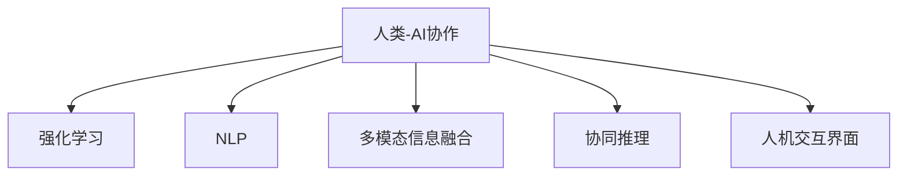

                 

# 人类-AI协：合作解决复杂问题

> 关键词：人类-AI协作, 复杂问题解决, 强化学习, 人工智能, 机器学习, 智能系统, 自动推理, 人机交互

## 1. 背景介绍

### 1.1 问题由来
当今社会，复杂问题的解决越发依赖于高度专业化且知识广泛的团队。然而，人类在处理信息、进行决策等方面仍有许多局限性。而人工智能（AI）在处理大量数据、计算复杂模型、自动化重复性工作等方面具有天然优势。如何有效整合人类与AI的力量，实现1+1>2的效果，成为了一个亟待解决的挑战。

### 1.2 问题核心关键点
解决复杂问题的关键是找到合理的人类与AI协作方式。具体包括：
- 确定人类与AI在协作过程中的角色与分工。
- 设计高效的协同框架和算法，使人类与AI无缝配合。
- 开发有效的交互界面，便于用户理解和控制AI。

### 1.3 问题研究意义
人类-AI协作有助于提升问题解决的效率与质量，具有重要意义：
- 降低人力成本。AI可以处理大量数据和重复性工作，减少人工劳动。
- 提升决策准确性。AI在处理信息、推理等方面具有天然优势，能减少人为失误。
- 加速创新进程。AI可以快速验证假设，探索可能方案，加速新知识的发现。
- 推动社会进步。AI能够解决一些人类无法解决的复杂问题，如气候变化、疾病治疗等，对社会进步贡献巨大。

## 2. 核心概念与联系

### 2.1 核心概念概述

为更好地理解人类-AI协作在复杂问题解决中的应用，本节将介绍几个核心概念：

- 人类-AI协作（Human-AI Collaboration）：指将人类的知识、判断力与AI的数据处理、算法能力相结合，共同解决复杂问题的过程。
- 强化学习（Reinforcement Learning, RL）：通过奖励机制指导AI的行为选择，使其在特定环境中学习最优策略。
- 自然语言处理（Natural Language Processing, NLP）：使AI能够理解和生成自然语言，便于与人类进行交流。
- 多模态信息融合（Multi-modal Information Fusion）：将来自不同模态（如视觉、听觉、文本等）的数据进行整合，提升AI的感知能力。
- 协同推理（Collaborative Reasoning）：多智能体间相互配合，共同推理出最优解决方案。
- 人机交互界面（Human-Computer Interaction, HCI）：设计友好、直观的界面，促进人机互动。

这些核心概念之间的关系可以用以下Mermaid流程图来展示：



这个流程图展示了几大核心概念及其相互关系：

1. 人类-AI协作是整个过程的基础，通过整合人类智慧与AI能力，实现复杂问题的解决。
2. 强化学习使AI能够在特定环境中学习最优策略，增强其自主性。
3. 自然语言处理使AI能够理解和生成自然语言，提升人机互动的便捷性。
4. 多模态信息融合将不同模态的数据整合，提升AI的感知能力。
5. 协同推理使多智能体间相互配合，共同推理出最优解决方案。
6. 人机交互界面设计友好的界面，便于用户理解和控制AI。

## 3. 核心算法原理 & 具体操作步骤
### 3.1 算法原理概述

人类-AI协作解决复杂问题的关键在于设计高效、合理的算法和框架，使人类与AI能够无缝合作。常用的算法包括强化学习、多智能体协同推理等。这些算法通过智能体与环境间的互动，不断优化行为策略，最终实现复杂问题的解决。

以强化学习为例，其核心思想是通过奖励机制指导AI的行为选择，使其在特定环境中学习最优策略。具体流程包括：
1. 定义问题环境，建立状态-动作-奖励（S-A-R）模型。
2. 设计评估指标，如成功完成任务的概率、时间等。
3. 使用RL算法，如Q-learning、DQN等，训练AI模型，使其在特定环境中最大化奖励。
4. 在训练过程中，引入人类监督，不断调整策略和模型参数，直至达到最优。

### 3.2 算法步骤详解

以强化学习为例，下面详细介绍其核心算法步骤：

1. **环境定义**：定义问题环境，建立状态-动作-奖励（S-A-R）模型。例如，机器人协作任务中，状态为机器人的位置、角度等，动作为机器人的移动方向和力度，奖励为任务完成度或成功率。

2. **算法选择**：选择合适的强化学习算法，如Q-learning、DQN、PPO等。这些算法通过迭代优化策略，使AI在特定环境中不断提升表现。

3. **训练过程**：
   - **策略学习**：AI从随机策略开始，通过不断尝试、反馈、更新策略，逐步学习到最优策略。
   - **参数调整**：在训练过程中，使用人类监督不断调整策略参数，确保AI行为符合预期。
   - **性能评估**：通过评估指标，如成功率、执行时间等，判断AI行为的表现。

4. **模型评估**：在训练结束后，评估AI模型的性能，验证其是否能够在特定环境中达到最优策略。

5. **部署应用**：将训练好的AI模型部署到实际问题场景中，进行大规模测试和验证。

### 3.3 算法优缺点

强化学习在解决复杂问题上有以下优点：
1. 自主性高。AI能够在特定环境中自主学习最优策略，减少对人类监督的依赖。
2. 泛化能力强。通过大量样本训练，AI能够较好地泛化到新环境中。
3. 适应性强。AI能够根据反馈不断调整策略，适应不同复杂度的问题。

但强化学习也存在一些缺点：
1. 训练时间长。需要大量样本和计算资源，训练过程较为耗时。
2. 策略优化困难。复杂环境中的策略优化较为困难，需要较多人类干预。
3. 鲁棒性不足。在某些特殊情况下，AI可能无法稳定执行策略，出现失败。

### 3.4 算法应用领域

强化学习在人类-AI协作中具有广泛应用，涵盖多个领域，例如：

- 机器人协作：例如协作组装、自动驾驶等，使机器人能够在复杂环境中自主完成任务。
- 医疗决策：如手术机器人、医疗诊断等，使AI能够辅助医生进行精准决策。
- 金融预测：如股票交易、风险管理等，使AI能够预测市场趋势，提供投资建议。
- 交通控制：如智能交通系统、自动调度等，使AI能够优化交通流量，提升交通效率。
- 物流管理：如仓库管理、配送路径规划等，使AI能够优化物流流程，提高效率。

## 4. 数学模型和公式 & 详细讲解 & 举例说明
### 4.1 数学模型构建

强化学习的数学模型基于马尔可夫决策过程（Markov Decision Process, MDP），可以表示为：

$$
\mathcal{M} = (\mathcal{S}, \mathcal{A}, P, R)
$$

其中：
- $\mathcal{S}$ 为状态空间。
- $\mathcal{A}$ 为动作空间。
- $P$ 为状态转移概率。
- $R$ 为奖励函数。

强化学习的目标是最大化长期奖励，即期望总奖励最大：

$$
\max_{\pi} \mathbb{E}\left[\sum_{t=0}^{\infty} \gamma^t R(s_t, a_t)\right]
$$

其中 $\pi$ 为策略函数，$\gamma$ 为折扣因子。

### 4.2 公式推导过程

以Q-learning算法为例，其核心思想是通过经验回溯（on-policy），使AI通过不断尝试，逐步学习到最优策略。Q-learning算法的基本推导如下：

$$
Q_{\theta}(s_t, a_t) \leftarrow Q_{\theta}(s_t, a_t) + \alpha \left[ r_t + \gamma \max_{a_{t+1}} Q_{\theta}(s_{t+1}, a_{t+1}) - Q_{\theta}(s_t, a_t) \right]
$$

其中 $Q_{\theta}(s_t, a_t)$ 表示在状态 $s_t$ 下采取动作 $a_t$ 的Q值，$\alpha$ 为学习率。

具体推导过程如下：
1. 在状态 $s_t$ 下，采取动作 $a_t$ 的即时奖励为 $r_t$。
2. 在状态 $s_{t+1}$ 下，采取动作 $a_{t+1}$ 的期望长期奖励为 $\gamma \max_{a_{t+1}} Q_{\theta}(s_{t+1}, a_{t+1})$。
3. 将即时奖励和期望长期奖励结合起来，更新Q值。

### 4.3 案例分析与讲解

以机器人协作任务为例，具体分析强化学习的应用：

1. **问题定义**：机器人协作任务中，状态为机器人的位置、角度等，动作为机器人的移动方向和力度，奖励为任务完成度或成功率。
2. **算法选择**：使用DQN算法，将机器人状态和动作编码为数值，将奖励函数定义为任务完成度。
3. **训练过程**：AI通过不断尝试、反馈、更新策略，逐步学习到最优策略。
4. **模型评估**：在训练结束后，评估AI模型的性能，验证其是否能够在特定环境中达到最优策略。
5. **部署应用**：将训练好的AI模型部署到实际问题场景中，进行大规模测试和验证。

## 5. 项目实践：代码实例和详细解释说明
### 5.1 开发环境搭建

在进行人类-AI协作项目的开发前，我们需要准备好开发环境。以下是使用Python进行强化学习项目开发的常见环境配置流程：

1. 安装Anaconda：从官网下载并安装Anaconda，用于创建独立的Python环境。

2. 创建并激活虚拟环境：
```bash
conda create -n rl-env python=3.8 
conda activate rl-env
```

3. 安装必要的Python包：
```bash
pip install gym gymnasium numpy matplotlib
```

4. 安装相关强化学习库：
```bash
pip install tensorboardx
```

5. 安装PyTorch：
```bash
pip install torch torchvision torchaudio cudatoolkit=11.1 -c pytorch -c conda-forge
```

完成上述步骤后，即可在`rl-env`环境中开始开发项目。

### 5.2 源代码详细实现

以下是一个使用PyTorch和OpenAI Gym环境进行强化学习开发的简单代码示例，用于训练一个简单的机器人协作任务。

```python
import gym
import torch
import torch.nn as nn
import torch.optim as optim
import numpy as np
import matplotlib.pyplot as plt
from tensorboardX import SummaryWriter

class Policy(nn.Module):
    def __init__(self, state_dim, action_dim):
        super(Policy, self).__init__()
        self.fc1 = nn.Linear(state_dim, 64)
        self.fc2 = nn.Linear(64, action_dim)

    def forward(self, x):
        x = torch.relu(self.fc1(x))
        x = torch.softmax(self.fc2(x), dim=1)
        return x

def act(Q, state, epsilon):
    if np.random.rand() < epsilon:
        return np.random.choice(np.arange(state_dim), p=Q.numpy()[state])
    else:
        return np.argmax(Q.numpy()[state])

def train(env, model, Q, optimizer, n_episodes=500, epsilon=0.1, gamma=0.9):
    writer = SummaryWriter()
    state_dim = env.observation_space.shape[0]
    action_dim = env.action_space.n
    
    for episode in range(n_episodes):
        state = env.reset()
        done = False
        total_reward = 0
        
        while not done:
            action = act(Q, state, epsilon)
            next_state, reward, done, _ = env.step(action)
            Q.zero_grad()
            Q[(state, action)].backward(torch.tensor([reward + gamma * max(Q[(next_state, env.action_space.sample())].mean(1)[0])), retain_graph=True)
            optimizer.step()
            total_reward += reward
            state = next_state
        
        writer.add_scalar('Total Reward', total_reward, episode)
        print(f"Episode {episode+1} total reward: {total_reward}")
    
    writer.close()
    plt.plot(writer.get_summary()[0]['Total Reward'])
    plt.show()

if __name__ == '__main__':
    env = gym.make('CartPole-v0')
    state_dim = env.observation_space.shape[0]
    action_dim = env.action_space.n
    
    model = Policy(state_dim, action_dim)
    optimizer = optim.Adam(model.parameters(), lr=0.01)
    Q = nn.Parameter(torch.randn(state_dim, action_dim))
    
    train(env, model, Q, optimizer)
```

### 5.3 代码解读与分析

让我们再详细解读一下关键代码的实现细节：

**Policy类**：
- `__init__`方法：定义政策网络的层结构。
- `forward`方法：实现前向传播，将输入状态映射到动作概率。

**act函数**：
- 实现动作选择策略。在训练阶段采用epsilon-greedy策略，随机选择动作。

**train函数**：
- 在OpenAI Gym环境中训练政策网络，使用Q-learning算法。
- 记录每轮的总奖励，并可视化总奖励的趋势。

**训练流程**：
- 定义环境、模型、优化器和Q值表。
- 在每轮中，随机选择动作，并根据奖励和状态转移更新Q值表。
- 记录每轮的总奖励，并在训练结束后可视化总奖励的趋势。

## 6. 实际应用场景
### 6.1 医疗诊断

人类-AI协作在医疗诊断中的应用非常广泛。AI可以通过分析患者的症状、历史数据、实验室检查结果等，辅助医生进行精准诊断。例如，AI可以通过强化学习算法，不断优化诊断策略，提高诊断准确率。

具体实现如下：
- **数据准备**：收集患者的症状、历史数据、实验室检查结果等，构建数据集。
- **环境定义**：定义问题环境，建立状态-动作-奖励（S-A-R）模型，状态为症状和历史数据，动作为诊断方案，奖励为诊断准确率。
- **算法选择**：选择强化学习算法，如Q-learning、DQN等。
- **训练过程**：AI通过不断尝试、反馈、更新策略，逐步学习到最优诊断策略。
- **模型评估**：在训练结束后，评估AI模型的性能，验证其是否能够在特定环境中达到最优诊断策略。
- **部署应用**：将训练好的AI模型部署到实际医疗环境中，辅助医生进行诊断。

### 6.2 智能制造

智能制造是未来工业发展的方向之一，AI在制造过程中的协作也非常重要。通过强化学习算法，AI可以优化生产流程、预测设备故障、提高生产效率。

具体实现如下：
- **数据准备**：收集生产数据、设备状态、环境数据等，构建数据集。
- **环境定义**：定义问题环境，建立状态-动作-奖励（S-A-R）模型，状态为设备状态和生产数据，动作为设备维护、生产调整等，奖励为生产效率和设备稳定性。
- **算法选择**：选择强化学习算法，如PPO、A3C等。
- **训练过程**：AI通过不断尝试、反馈、更新策略，逐步学习到最优生产策略。
- **模型评估**：在训练结束后，评估AI模型的性能，验证其是否能够在特定环境中达到最优生产策略。
- **部署应用**：将训练好的AI模型部署到实际生产环境中，优化生产流程、预测设备故障、提高生产效率。

### 6.3 金融风控

金融风控是金融行业的重要环节，AI可以通过强化学习算法，进行风险预测和投资决策。例如，AI可以通过分析市场数据、企业财务报表等，辅助投资者进行精准决策。

具体实现如下：
- **数据准备**：收集市场数据、企业财务报表、历史交易数据等，构建数据集。
- **环境定义**：定义问题环境，建立状态-动作-奖励（S-A-R）模型，状态为市场数据和企业财务报表，动作为投资策略，奖励为投资回报率。
- **算法选择**：选择强化学习算法，如DQN、Q-learning等。
- **训练过程**：AI通过不断尝试、反馈、更新策略，逐步学习到最优投资策略。
- **模型评估**：在训练结束后，评估AI模型的性能，验证其是否能够在特定环境中达到最优投资策略。
- **部署应用**：将训练好的AI模型部署到实际金融环境中，辅助投资者进行精准决策。

### 6.4 未来应用展望

随着人类-AI协作的不断发展，未来将有更多应用场景：

- 无人驾驶：AI可以通过与人类司机的协作，学习最优驾驶策略，提高行车安全性。
- 自动驾驶：AI可以通过与人类司机的协作，学习最优驾驶策略，提高行车安全性。
- 智能家居：AI可以通过与人类用户的协作，学习最优家居管理策略，提高生活质量。
- 自动客服：AI可以通过与人类客服的协作，学习最优客户服务策略，提高客户满意度。

## 7. 工具和资源推荐
### 7.1 学习资源推荐

为了帮助开发者系统掌握人类-AI协作的理论基础和实践技巧，这里推荐一些优质的学习资源：

1. 《强化学习》系列书籍：由DeepMind和Berkeley教授共同编写，全面介绍了强化学习的理论和应用。
2. 《深度学习》系列课程：斯坦福大学开设的深度学习课程，涵盖强化学习、神经网络等前沿技术。
3. 《人类-AI协作》书籍：由MIT教授编写，探讨了人类-AI协作在各种领域中的应用。
4. 《TensorFlow官方文档》：TensorFlow的官方文档，提供了详细的强化学习算法实现和案例。
5. 《OpenAI Gym》教程：OpenAI Gym的官方教程，提供了丰富的强化学习环境及算法实现。

通过对这些资源的学习实践，相信你一定能够快速掌握人类-AI协作的精髓，并用于解决实际的复杂问题。
### 7.2 开发工具推荐

高效的开发离不开优秀的工具支持。以下是几款用于人类-AI协作开发的常用工具：

1. PyTorch：基于Python的开源深度学习框架，灵活动态的计算图，适合快速迭代研究。
2. TensorFlow：由Google主导开发的开源深度学习框架，生产部署方便，适合大规模工程应用。
3. OpenAI Gym：提供了丰富的环境库和算法库，便于进行强化学习实验。
4. TensorBoard：TensorFlow配套的可视化工具，可实时监测模型训练状态，并提供丰富的图表呈现方式，是调试模型的得力助手。
5. Scikit-learn：提供了丰富的机器学习算法和工具，便于数据预处理和模型评估。

合理利用这些工具，可以显著提升人类-AI协作的开发效率，加快创新迭代的步伐。

### 7.3 相关论文推荐

人类-AI协作的发展源于学界的持续研究。以下是几篇奠基性的相关论文，推荐阅读：

1. AlphaGo（DeepMind, 2016）：展示了AI在复杂棋类游戏中的自我学习和协作能力。
2. AlphaStar（DeepMind, 2019）：展示了AI在实时策略游戏中的自我学习和协作能力。
3. OpenAI Five（OpenAI, 2019）：展示了AI在多人协作游戏中的自我学习和协作能力。
4. Human-AI Collaboration in Video Games（Jarvis & company, 2021）：探讨了人类-AI协作在视频游戏中的应用。
5. RoboCup Rescue（International Federation of Robotics, 2004）：展示了AI在救援任务中的自我学习和协作能力。

这些论文代表了人类-AI协作的发展脉络，展示了AI在不同复杂环境中的协作能力，具有重要的参考价值。

## 8. 总结：未来发展趋势与挑战
### 8.1 总结

本文对人类-AI协作在复杂问题解决中的应用进行了全面系统的介绍。首先阐述了人类-AI协作在解决复杂问题中的重要性，明确了协作在提升问题解决效率和质量方面的独特价值。其次，从原理到实践，详细讲解了强化学习算法在协作中的具体应用。同时，本文还探讨了人类-AI协作在多个行业领域的应用前景，展示了协作范式的广泛潜力。此外，本文精选了协作技术的各类学习资源，力求为读者提供全方位的技术指引。

通过本文的系统梳理，可以看到，人类-AI协作在解决复杂问题中具有重要价值，能够显著提升问题解决的效率和质量。未来，随着技术的不断进步，协作方法将更加高效、智能，必将为复杂问题的解决带来革命性突破。

### 8.2 未来发展趋势

展望未来，人类-AI协作将呈现以下几个发展趋势：

1. 深度融合。人类-AI协作将进一步融合AI的感知、决策和执行能力，形成更加全面、智能的解决方案。
2. 高度自动化。AI将逐步具备高度自主性，能够在复杂环境中独立决策和执行，减少对人类监督的依赖。
3. 跨领域应用。人类-AI协作将扩展到更多领域，如智能制造、自动驾驶、智能家居等，推动各行业的智能化升级。
4. 增强智能。通过多智能体协同推理和融合，人类-AI协作将具备更强的适应性和泛化能力，应对更多复杂问题。
5. 多样化交互。将自然语言处理、多模态信息融合等技术引入协作系统，提升人机交互的自然性和便捷性。
6. 可信与安全。通过增强系统的透明度、可解释性和安全性，确保协作系统的可靠性和安全性。

这些趋势凸显了人类-AI协作技术的广阔前景。这些方向的探索发展，必将进一步提升协作系统的性能和应用范围，为复杂问题的解决带来革命性突破。

### 8.3 面临的挑战

尽管人类-AI协作技术已经取得了瞩目成就，但在迈向更加智能化、普适化应用的过程中，它仍面临着诸多挑战：

1. 数据依赖。AI需要通过大量数据进行训练和优化，但在某些领域获取高质量数据较难。如何提升数据获取和处理效率，是未来需要解决的重要问题。
2. 鲁棒性不足。AI在面对复杂环境和噪声数据时，鲁棒性不足，容易发生错误。如何提高AI的鲁棒性，是未来需要解决的重要问题。
3. 可解释性不足。AI的决策过程通常缺乏可解释性，难以解释其内部工作机制和决策逻辑。如何增强AI的可解释性，是未来需要解决的重要问题。
4. 伦理与安全。AI的决策可能带来伦理和安全问题，如偏见、隐私泄露等。如何保障AI的伦理与安全，是未来需要解决的重要问题。
5. 人机交互界面。AI的复杂性和多样性使得人机交互界面的设计成为一大难题。如何设计友好、直观的界面，提升用户体验，是未来需要解决的重要问题。

正视协作面临的这些挑战，积极应对并寻求突破，将是人机协作技术走向成熟的必由之路。相信随着学界和产业界的共同努力，这些挑战终将一一被克服，人类-AI协作必将在构建智能化的社会中扮演越来越重要的角色。

### 8.4 研究展望

面对人类-AI协作所面临的种种挑战，未来的研究需要在以下几个方面寻求新的突破：

1. 探索无监督和半监督协作方法。摆脱对大量标注数据的依赖，利用自监督学习、主动学习等无监督和半监督范式，最大限度利用非结构化数据，实现更加灵活高效的协作。
2. 研究参数高效和计算高效的协作范式。开发更加参数高效的协作方法，在固定大部分预训练参数的同时，只更新极少量的任务相关参数。同时优化协作模型的计算图，减少前向传播和反向传播的资源消耗，实现更加轻量级、实时性的部署。
3. 引入更多先验知识。将符号化的先验知识，如知识图谱、逻辑规则等，与神经网络模型进行巧妙融合，引导协作过程学习更准确、合理的语言模型。同时加强不同模态数据的整合，实现视觉、语音等多模态信息与文本信息的协同建模。
4. 结合因果分析和博弈论工具。将因果分析方法引入协作模型，识别出模型决策的关键特征，增强输出解释的因果性和逻辑性。借助博弈论工具刻画人机交互过程，主动探索并规避模型的脆弱点，提高系统稳定性。
5. 纳入伦理道德约束。在协作目标中引入伦理导向的评估指标，过滤和惩罚有偏见、有害的输出倾向。同时加强人工干预和审核，建立协作行为的监管机制，确保输出符合人类价值观和伦理道德。

这些研究方向的探索，必将引领人类-AI协作技术迈向更高的台阶，为构建安全、可靠、可解释、可控的协作系统铺平道路。面向未来，人类-AI协作技术还需要与其他人工智能技术进行更深入的融合，如知识表示、因果推理、强化学习等，多路径协同发力，共同推动复杂问题解决系统的进步。只有勇于创新、敢于突破，才能不断拓展协作系统的边界，让智能技术更好地造福人类社会。

## 9. 附录：常见问题与解答
**Q1：人类-AI协作是否适用于所有复杂问题？**

A: 人类-AI协作在解决复杂问题上有广泛应用，但也存在一些限制。例如，涉及情感、道德等人类特有领域的问题，AI目前仍难以胜任。因此，需要根据具体问题的特点，选择适合的人机协作方式。

**Q2：如何确保AI决策的透明性和可解释性？**

A: 确保AI决策的透明性和可解释性，可以通过以下方法：
1. 使用可解释模型，如决策树、规则模型等，便于理解和解释。
2. 引入先验知识，如知识图谱、逻辑规则等，增强模型的可解释性。
3. 设计友好的交互界面，便于用户理解AI的决策过程。
4. 采用可视化工具，如TensorBoard，记录和展示模型的推理过程。

**Q3：AI在协作中如何保证伦理与安全？**

A: AI在协作中保证伦理与安全，可以通过以下方法：
1. 设计伦理导向的目标函数，过滤和惩罚有偏见、有害的输出倾向。
2. 引入人工监督和审核，确保AI的行为符合伦理要求。
3. 建立系统的监管机制，定期检查和评估AI的行为。
4. 加强数据的隐私保护，确保AI的行为不会泄露用户隐私。

**Q4：如何优化人机交互界面？**

A: 优化人机交互界面，可以通过以下方法：
1. 设计友好的用户界面，便于用户理解和使用。
2. 采用自然语言处理技术，使AI能够理解和生成自然语言，提升人机交互的自然性。
3. 引入多模态信息融合，通过视觉、听觉、文本等多种方式，提升人机交互的便捷性。
4. 使用可视化工具，展示AI的决策过程和结果，增强用户对AI的理解和信任。

总之，优化人机交互界面是实现高效协作的重要环节。需要不断探索和尝试，找到最适合的交互方式，提升用户满意度。

---

作者：禅与计算机程序设计艺术 / Zen and the Art of Computer Programming

