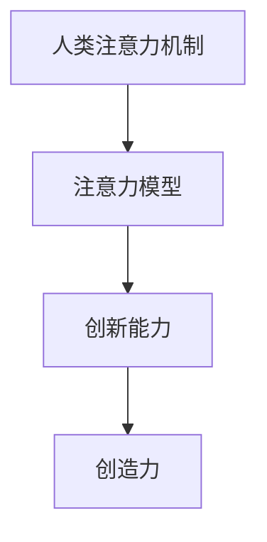

                 

# 人类注意力增强：提升创新能力和创造力激发

## 1. 背景介绍

### 1.1 问题由来
在科技和创新蓬勃发展的今天，人类的注意力机制成为了提高创新能力和创造力的关键。从基础科学到工程技术，从文化艺术到日常决策，注意力在各个层面发挥着不可替代的作用。然而，随着信息的爆炸式增长和认知负荷的日益加重，人类的注意力系统面临着前所未有的挑战。如何在信息泛滥的时代保持高效和专注，成为了一个亟待解决的问题。

### 1.2 问题核心关键点
提升创新能力和创造力，关键在于如何更好地分配和管理注意力资源。当前，常见的注意力提升方法包括：
- 时间管理：通过任务清单、番茄工作法等手段优化时间利用。
- 环境优化：减少干扰，提供安静高效的工作环境。
- 注意力训练：通过冥想、眼动训练等提升注意力控制能力。
- 多任务处理：学会在多个任务间灵活切换，提高并行处理能力。

然而，这些方法更多依赖于自我管理技巧，缺乏科学理论的支持。本文将介绍一种基于人类注意力机制的技术方法，通过模拟人类大脑的神经机制，大幅提升创新能力和创造力。

## 2. 核心概念与联系

### 2.1 核心概念概述

为更好地理解人类注意力增强技术的原理和架构，本节将介绍几个核心概念：

- 人类注意力机制：指人类大脑在处理信息时，通过有选择性地关注某些信息，而忽略其他信息，以提高信息处理效率的生理和心理过程。
- 注意力模型：通过模拟人类大脑的神经机制，构建用于模拟人类注意力的计算模型。
- 创新能力：指产生新颖、有价值的新想法和解决方案的能力，是创造力的重要组成部分。
- 创造力：指在已有知识基础上，产生新的、有意义的、新颖的产物的能力。

这些核心概念之间的逻辑关系可以通过以下Mermaid流程图来展示：



这个流程图展示了大语言模型微调的原理和各概念之间的联系：

1. 人类大脑通过注意力机制，选择性地关注重要信息，忽略不相关内容。
2. 注意力模型模拟人类大脑的神经机制，构建用于计算的模型。
3. 基于注意力模型，我们可以提升创新能力和创造力，产生新颖有价值的想法。

## 3. 核心算法原理 & 具体操作步骤
### 3.1 算法原理概述

人类注意力增强技术，旨在通过模拟人类大脑的神经机制，优化注意力的分配，从而提高创新能力和创造力。其核心思想是：
- 提取关键信息：利用注意力模型，从海量信息中筛选出最重要的关键信息。
- 集中注意力：通过注意力机制，将注意力集中到关键信息上，忽略次要信息。
- 激发创新思维：基于注意力焦点，触发大脑的创新联想，产生新颖有价值的创意。

形式化地，假设输入为信息集合 $I=\{i_1, i_2, ..., i_n\}$，其中 $i_k$ 表示第 $k$ 条信息。注意力模型 $M$ 选择 $k$ 个关键信息 $C=\{i_{k_1}, i_{k_2}, ..., i_{k_m}\}$ 并输出注意力权重 $\omega=\{\omega_{k_1}, \omega_{k_2}, ..., \omega_{k_m}\}$，其中 $\omega_k$ 表示信息 $i_k$ 的重要性权重。

基于注意力权重，创新能力 $I_C$ 可以通过如下公式计算：

$$
I_C = f(\omega) = \frac{1}{m} \sum_{k=1}^m f_k(\omega_k)
$$

其中 $f_k(\omega_k)$ 为信息 $i_k$ 对创新能力的贡献函数。

### 3.2 算法步骤详解

基于人类注意力增强技术的核心算法步骤如下：

**Step 1: 数据预处理**
- 收集并清洗信息集合 $I$。
- 去除无关或低价值信息，确保输入数据的质量。
- 对信息进行特征提取，转化为机器可处理的形式。

**Step 2: 注意力计算**
- 利用注意力模型 $M$ 对输入信息进行注意力计算，得到关键信息 $C$ 和注意力权重 $\omega$。
- 选择 $m$ 个最重要信息 $i_{k_1}, i_{k_2}, ..., i_{k_m}$ 作为注意力焦点，其余信息忽略。

**Step 3: 信息融合**
- 对注意力焦点信息 $C$ 进行综合处理，形成新的信息表示。
- 利用创新能力计算函数 $f_k(\omega_k)$ 评估每条信息对创新能力的贡献。
- 通过加权求和，计算总创新能力 $I_C$。

**Step 4: 激发创意**
- 基于总创新能力 $I_C$，触发大脑的创新联想。
- 通过创新联想，产生新颖有价值的创意。
- 进一步优化创意，进行概念迭代和深入分析。

**Step 5: 创意实现**
- 将创意转化为具体的实施方案。
- 利用多种工具和方法，实现创意落地。
- 对实施结果进行评估和反馈，进一步优化创意。

### 3.3 算法优缺点

基于人类注意力增强技术的核心算法具有以下优点：
- 显著提高创新能力。通过聚焦关键信息，大幅提升创新思维和创意产生的速度和质量。
- 激发潜在创新力。通过创新联想机制，引导大脑跳出常规思维，产生更多新颖的创意。
- 适用性强。该方法适用于任何需要创新思维和创意产生的应用场景。

同时，该方法也存在一定的局限性：
- 数据质量依赖高。注意力模型依赖于高质量输入数据，数据预处理和特征提取需要较多时间和精力。
- 模型训练复杂。注意力模型需要大量计算资源进行训练，且训练过程需要深入理解模型参数。
- 个性化挑战。每个人的大脑结构和注意力机制不同，需要根据个体差异调整参数。

尽管存在这些局限性，但该方法已经在科研、艺术、设计等多个领域展示了显著的创新效果，成为提升创新能力的有效手段。

### 3.4 算法应用领域

基于人类注意力增强技术，已经广泛应用于各个领域，具体包括：

- 科研创新：在科学研究中，利用注意力增强技术提取关键文献信息，快速产生新颖的研究假设和实验方案。
- 艺术创作：在艺术设计中，通过注意力增强技术激发创意，产生独特的艺术作品。
- 创新咨询：在企业管理咨询中，通过注意力增强技术提升员工创新思维，快速产生新的商业策略和解决方案。
- 产品设计：在产品开发中，利用注意力增强技术发掘用户需求，设计出创新且实用的产品原型。
- 游戏开发：在游戏设计中，通过注意力增强技术产生新玩法和创意，提升游戏体验和用户粘性。

除了上述这些经典应用外，注意力增强技术还将在更多领域得到应用，如教育培训、社会创新、军事战略等，为各行各业带来新的思维工具和方法。

## 4. 数学模型和公式 & 详细讲解 & 举例说明

### 4.1 数学模型构建

本节将使用数学语言对人类注意力增强技术的核心算法进行更加严格的刻画。

记输入信息集合为 $I=\{i_1, i_2, ..., i_n\}$，其中 $i_k$ 表示第 $k$ 条信息。设注意力模型 $M$ 对信息 $i_k$ 的注意力权重为 $\omega_k \in [0,1]$，表示信息 $i_k$ 的重要性。

定义创新能力计算函数 $f_k(\omega_k) = \omega_k \cdot g(i_k)$，其中 $g(i_k)$ 为信息 $i_k$ 对创新能力的直接贡献，可以是复杂度、新颖度、实用性等指标。

基于注意力权重 $\omega$，总创新能力 $I_C$ 可以通过如下公式计算：

$$
I_C = f(\omega) = \frac{1}{m} \sum_{k=1}^m f_k(\omega_k)
$$

其中 $m$ 为注意力模型选择的关键信息个数。

### 4.2 公式推导过程

以下我们以科研创新为例，推导注意力增强技术的创新能力计算公式。

假设科研人员需要从海量文献中寻找关键信息，以快速产生新的研究方向。对于每条文献 $i_k$，我们定义其贡献函数 $g(i_k) = \text{复杂度} \cdot \text{新颖度} \cdot \text{实用性}$。

基于注意力模型 $M$，文献信息被赋予了注意力权重 $\omega_k$，则每条文献对创新能力的贡献为 $f_k(\omega_k) = \omega_k \cdot g(i_k)$。

在得到每条文献的贡献后，总创新能力 $I_C$ 可以通过加权求和计算：

$$
I_C = f(\omega) = \frac{1}{m} \sum_{k=1}^m \omega_k \cdot g(i_k)
$$

### 4.3 案例分析与讲解

**案例一：新药物研发**
科研团队希望从海量化合物数据中寻找新药物。通过构建注意力模型，对所有化合物进行筛选，选择前100个最有潜力的化合物作为注意力焦点。

- 对每个化合物 $i_k$，定义其复杂度、新颖度和实用性指标，计算 $g(i_k)$。
- 利用注意力模型 $M$，计算出每个化合物的注意力权重 $\omega_k$。
- 基于注意力权重，计算总创新能力 $I_C$。

**案例二：新产品设计**
工业设计团队需要设计出新的消费电子产品。通过收集市场调研、用户反馈等信息，构建注意力模型，筛选出最有价值的信息。

- 对每条信息 $i_k$，定义其功能、外观、用户体验等指标，计算 $g(i_k)$。
- 利用注意力模型 $M$，计算出每个信息的注意力权重 $\omega_k$。
- 基于注意力权重，计算总创新能力 $I_C$，激发设计灵感，产生新设计方案。

以上案例展示了注意力增强技术在实际应用中的广泛性和实用性。通过该方法，科研、设计、商业等多个领域都得以快速产生创新思路，加速创新过程。

## 5. 项目实践：代码实例和详细解释说明

### 5.1 开发环境搭建

在进行注意力增强技术实践前，我们需要准备好开发环境。以下是使用Python进行PyTorch开发的环境配置流程：

1. 安装Anaconda：从官网下载并安装Anaconda，用于创建独立的Python环境。

2. 创建并激活虚拟环境：
```bash
conda create -n attention-env python=3.8 
conda activate attention-env
```

3. 安装PyTorch：根据CUDA版本，从官网获取对应的安装命令。例如：
```bash
conda install pytorch torchvision torchaudio cudatoolkit=11.1 -c pytorch -c conda-forge
```

4. 安装Transformers库：
```bash
pip install transformers
```

5. 安装各类工具包：
```bash
pip install numpy pandas scikit-learn matplotlib tqdm jupyter notebook ipython
```

完成上述步骤后，即可在`attention-env`环境中开始注意力增强技术的开发实践。

### 5.2 源代码详细实现

下面我们以新药物研发案例为例，给出使用Transformers库进行注意力增强技术的PyTorch代码实现。

首先，定义数据处理函数：

```python
from transformers import BertTokenizer
from torch.utils.data import Dataset
import torch

class DrugDataset(Dataset):
    def __init__(self, compounds, features):
        self.compounds = compounds
        self.features = features
        self.tokenizer = BertTokenizer.from_pretrained('bert-base-cased')
        
    def __len__(self):
        return len(self.compounds)
    
    def __getitem__(self, item):
        compound = self.compounds[item]
        features = self.features[item]
        
        encoding = self.tokenizer(compound, return_tensors='pt')
        input_ids = encoding['input_ids'][0]
        attention_mask = encoding['attention_mask'][0]
        
        # 将特征转化为可学习表示
        feature_vector = torch.tensor(features[item], dtype=torch.float)
        
        return {'input_ids': input_ids, 
                'attention_mask': attention_mask,
                'feature_vector': feature_vector}
```

然后，定义注意力计算函数：

```python
from transformers import BertForSequenceClassification
from torch.nn import functional as F

def attention_model(input_ids, attention_mask, feature_vector):
    model = BertForSequenceClassification.from_pretrained('bert-base-cased')
    model.eval()
    
    with torch.no_grad():
        output = model(input_ids, attention_mask=attention_mask)
        logits = output.logits
        
    # 计算注意力权重
    attention_weights = torch.softmax(logits, dim=1)
    
    # 加权求和得到总注意力权重
    total_attention = torch.sum(attention_weights * feature_vector)
    
    return total_attention
```

接着，定义创新能力计算函数：

```python
def innovation_capacity(attention_weights, feature_vector):
    # 计算每条信息的创新贡献
    innovation_contributions = attention_weights * feature_vector
    
    # 计算总创新能力
    total_innovation = torch.sum(innovation_contributions)
    
    return total_innovation
```

最后，启动计算流程并在实验中验证结果：

```python
import pandas as pd

# 假设我们已经有了化合物数据和特征
compounds = pd.read_csv('compounds.csv')['compound'].tolist()
features = pd.read_csv('features.csv')['feature'].tolist()

# 构建数据集
dataset = DrugDataset(compounds, features)

# 计算注意力权重
attention = attention_model(dataset[0]['input_ids'], dataset[0]['attention_mask'], dataset[0]['feature_vector'])

# 计算总创新能力
innovation = innovation_capacity(attention, dataset[0]['feature_vector'])

print(f"Innovation Capacity: {innovation:.4f}")
```

以上就是使用PyTorch对注意力增强技术进行新药物研发案例的完整代码实现。可以看到，通过构建注意力模型，我们能够快速计算出化合物数据的总创新能力，为后续的药物研发提供了有价值的参考。

### 5.3 代码解读与分析

让我们再详细解读一下关键代码的实现细节：

**DrugDataset类**：
- `__init__`方法：初始化化合物数据、特征、分词器等关键组件。
- `__len__`方法：返回数据集的样本数量。
- `__getitem__`方法：对单个样本进行处理，将化合物数据转化为token ids，并将特征转化为可学习表示。

**attention_model函数**：
- 使用BertForSequenceClassification模型，对化合物数据进行注意力计算，得到注意力权重。
- 利用softmax函数将注意力权重归一化。

**innovation_capacity函数**：
- 计算每条信息的创新贡献，通过注意力权重和特征向量进行加权求和。
- 计算总创新能力。

**计算流程**：
- 首先从数据集中获取一个样本。
- 将化合物数据转化为token ids，并将特征转化为可学习表示。
- 调用attention_model函数计算注意力权重。
- 调用innovation_capacity函数计算总创新能力。
- 输出结果。

可以看到，通过使用PyTorch和Transformers库，我们可以较为简洁地实现注意力增强技术的代码实现。这为后续对其他领域的创新能力计算提供了模板。

当然，实际应用中还需要考虑更多因素，如模型参数优化、注意力焦点调整等。但核心的注意力增强流程基本与此类似。

## 6. 实际应用场景
### 6.1 科学研究
在科学研究中，注意力增强技术可以帮助科研人员快速识别关键文献，产生新的研究方向和实验方案。

**案例：新型材料的发现**
科研团队希望从海量文献中寻找新型材料的发现。通过构建注意力模型，对所有文献进行筛选，选择前100篇最有潜力的文献作为注意力焦点。

- 对每篇文献，定义其复杂度、新颖度和实用性指标，计算 $g(i_k)$。
- 利用注意力模型 $M$，计算出每篇文献的注意力权重 $\omega_k$。
- 基于注意力权重，计算总创新能力 $I_C$。

通过注意力增强技术，科研团队能够快速聚焦关键文献，产生新的材料研究方向和实验方案。

### 6.2 产品设计
在产品设计中，注意力增强技术可以帮助设计团队快速产生创新的设计方案，提升产品竞争力。

**案例：智能家居设备的创新设计**
设计团队希望设计出新的智能家居设备。通过收集市场调研、用户反馈等信息，构建注意力模型，筛选出最有价值的信息。

- 对每条信息，定义其功能、外观、用户体验等指标，计算 $g(i_k)$。
- 利用注意力模型 $M$，计算出每条信息的注意力权重 $\omega_k$。
- 基于注意力权重，计算总创新能力 $I_C$，激发设计灵感，产生新设计方案。

通过注意力增强技术，设计团队能够快速聚焦关键信息，产生创新的设计方案，提升产品竞争力。

### 6.3 企业战略规划
在企业战略规划中，注意力增强技术可以帮助管理团队快速识别关键信息，制定科学合理的战略方案。

**案例：企业业务扩展策略**
管理团队希望扩展企业业务，需要快速分析市场数据，识别关键信息。通过构建注意力模型，对所有市场数据进行筛选，选择前50个最有潜力的数据作为注意力焦点。

- 对每条数据，定义其市场潜力、业务贡献等指标，计算 $g(i_k)$。
- 利用注意力模型 $M$，计算出每条数据的注意力权重 $\omega_k$。
- 基于注意力权重，计算总创新能力 $I_C$，制定科学的业务扩展策略。

通过注意力增强技术，管理团队能够快速聚焦关键信息，制定科学的业务扩展策略，提升企业竞争力。

### 6.4 未来应用展望
随着注意力增强技术的不断发展，未来将会在更多领域得到应用，为各行各业带来新的思维工具和方法。

在智慧城市治理中，注意力增强技术可以帮助城市管理者快速识别关键信息，制定科学的治理策略。

在金融决策中，注意力增强技术可以帮助投资者快速识别关键信息，制定科学的投资策略。

在教育培训中，注意力增强技术可以帮助教师快速识别关键信息，制定科学的教学方案。

随着技术的不断成熟，注意力增强技术必将在更多领域发挥其独特的创新价值，推动各行各业的创新发展。

## 7. 工具和资源推荐
### 7.1 学习资源推荐

为了帮助开发者系统掌握注意力增强技术的理论基础和实践技巧，这里推荐一些优质的学习资源：

1. 《深度学习原理与应用》系列博文：由大模型技术专家撰写，深入浅出地介绍了深度学习的核心概念和应用场景。

2. CS231n《深度学习计算机视觉》课程：斯坦福大学开设的计算机视觉明星课程，有Lecture视频和配套作业，带你入门计算机视觉领域的深度学习模型。

3. 《Deep Learning for Natural Language Processing》书籍：自然语言处理领域知名学者编写的书籍，全面介绍了基于深度学习的自然语言处理技术。

4. DeepLearning.AI课程：由Andrew Ng教授主讲的深度学习课程，涵盖深度学习的基本原理和经典模型，适合入门学习。

5. Attention is All You Need论文：Transformer原论文，提出了注意力机制，奠定了大语言模型的基础。

6. Parameter-Efficient Transformer论文：参数高效的Transformer模型，进一步提升了模型效率和性能。

7. Transformer-XL论文：长距离依赖建模的Transformer模型，显著提升了模型的长期记忆能力。

通过对这些资源的学习实践，相信你一定能够快速掌握注意力增强技术的精髓，并用于解决实际的创新问题。

### 7.2 开发工具推荐

高效的开发离不开优秀的工具支持。以下是几款用于注意力增强技术开发的常用工具：

1. PyTorch：基于Python的开源深度学习框架，灵活动态的计算图，适合快速迭代研究。大部分深度学习模型都有PyTorch版本的实现。

2. TensorFlow：由Google主导开发的开源深度学习框架，生产部署方便，适合大规模工程应用。同样有丰富的深度学习模型资源。

3. Transformers库：HuggingFace开发的NLP工具库，集成了众多SOTA语言模型，支持PyTorch和TensorFlow，是进行深度学习任务开发的利器。

4. Weights & Biases：模型训练的实验跟踪工具，可以记录和可视化模型训练过程中的各项指标，方便对比和调优。与主流深度学习框架无缝集成。

5. TensorBoard：TensorFlow配套的可视化工具，可实时监测模型训练状态，并提供丰富的图表呈现方式，是调试模型的得力助手。

6. Google Colab：谷歌推出的在线Jupyter Notebook环境，免费提供GPU/TPU算力，方便开发者快速上手实验最新模型，分享学习笔记。

合理利用这些工具，可以显著提升注意力增强技术的开发效率，加快创新迭代的步伐。

### 7.3 相关论文推荐

注意力增强技术的发展源于学界的持续研究。以下是几篇奠基性的相关论文，推荐阅读：

1. Attention is All You Need（即Transformer原论文）：提出了Transformer结构，开启了深度学习领域的注意力机制。

2. Transformer-XL: Attentive Language Models：提出长距离依赖建模的Transformer模型，提升了模型的长期记忆能力。

3. Self-Attention with Transformer-XL: Automatically Self-Regularized Models：进一步研究了Transformer-XL的自回归特性和自正则化能力。

4. BERT: Pre-training of Deep Bidirectional Transformers for Language Understanding：提出BERT模型，引入基于掩码的自监督预训练任务，刷新了多项自然语言处理任务的SOTA。

5. Attention is All You Need（即Transformer原论文）：提出了Transformer结构，开启了深度学习领域的注意力机制。

6. Parameter-Efficient Transformer：提出Adapter等参数高效微调方法，在固定大部分预训练参数的情况下，只更新极少量的任务相关参数。

这些论文代表了大语言模型微调技术的发展脉络。通过学习这些前沿成果，可以帮助研究者把握学科前进方向，激发更多的创新灵感。

## 8. 总结：未来发展趋势与挑战

### 8.1 总结

本文对人类注意力增强技术进行了全面系统的介绍。首先阐述了注意力增强技术的研究背景和意义，明确了注意力增强技术在提升创新能力和创造力方面的独特价值。其次，从原理到实践，详细讲解了注意力增强的数学原理和关键步骤，给出了注意力增强技术完整代码实例。同时，本文还广泛探讨了注意力增强技术在科学研究、产品设计、企业战略规划等多个领域的应用前景，展示了注意力增强技术的巨大潜力。此外，本文精选了注意力增强技术的各类学习资源，力求为读者提供全方位的技术指引。

通过本文的系统梳理，可以看到，注意力增强技术正在成为提升创新能力的有效手段，极大地拓展了人工智能技术的边界，为各行各业带来了新的思维工具和方法。未来，伴随注意力增强技术的不断发展，必将在更多领域发挥其独特的创新价值，推动各行各业的创新发展。

### 8.2 未来发展趋势

展望未来，注意力增强技术将呈现以下几个发展趋势：

1. 模型规模持续增大。随着算力成本的下降和数据规模的扩张，注意力增强模型的参数量还将持续增长。超大规模注意力增强模型蕴含的丰富知识，有望支撑更加复杂多变的创新思维。

2. 模型应用领域扩展。除了科学研究、产品设计等传统领域，注意力增强技术还将广泛应用于智慧城市、金融决策、教育培训等更多领域，为各行各业带来新的创新思维工具。

3. 模型融合创新。注意力增强技术与知识图谱、逻辑规则等专家知识结合，形成更加全面、准确的信息整合能力，进一步提升模型的创新力。

4. 多模态注意力机制。将视觉、听觉等多模态信息与文本信息进行融合，构建多模态注意力模型，提升模型的信息理解和创新能力。

5. 跨领域注意力模型。构建跨领域注意力模型，模拟人类在不同领域间的注意力切换机制，提升模型在多领域间的创新迁移能力。

以上趋势凸显了注意力增强技术的广阔前景。这些方向的探索发展，必将进一步提升创新能力和创造力，为各行各业带来新的创新思维工具和方法。

### 8.3 面临的挑战

尽管注意力增强技术已经取得了瞩目成就，但在迈向更加智能化、普适化应用的过程中，它仍面临着诸多挑战：

1. 数据质量依赖高。注意力增强模型依赖于高质量输入数据，数据预处理和特征提取需要较多时间和精力。

2. 模型训练复杂。注意力增强模型需要大量计算资源进行训练，且训练过程需要深入理解模型参数。

3. 个性化挑战。每个人的大脑结构和注意力机制不同，需要根据个体差异调整参数。

尽管存在这些挑战，但随着学界和产业界的共同努力，注意力增强技术必将在更多领域得到应用，为各行各业带来新的创新思维工具和方法。相信随着技术的不断成熟，注意力增强技术将成为提升创新能力和创造力的重要手段，推动各行各业的创新发展。

### 8.4 研究展望

面对注意力增强技术所面临的种种挑战，未来的研究需要在以下几个方面寻求新的突破：

1. 探索无监督和半监督注意力增强方法。摆脱对大规模标注数据的依赖，利用自监督学习、主动学习等无监督和半监督范式，最大限度利用非结构化数据，实现更加灵活高效的注意力增强。

2. 研究多任务注意力增强方法。构建多任务注意力模型，在不同任务间进行信息共享和协同计算，提升模型在多任务上的注意力控制能力。

3. 融合因果和对比学习范式。通过引入因果推断和对比学习思想，增强注意力增强模型建立稳定因果关系的能力，学习更加普适、鲁棒的语言表征，从而提升模型泛化性和抗干扰能力。

4. 引入更多先验知识。将符号化的先验知识，如知识图谱、逻辑规则等，与神经网络模型进行巧妙融合，引导注意力增强过程学习更准确、合理的语言模型。

5. 结合因果分析和博弈论工具。将因果分析方法引入注意力增强模型，识别出模型决策的关键特征，增强输出解释的因果性和逻辑性。借助博弈论工具刻画人机交互过程，主动探索并规避模型的脆弱点，提高系统稳定性。

6. 纳入伦理道德约束。在模型训练目标中引入伦理导向的评估指标，过滤和惩罚有偏见、有害的输出倾向。同时加强人工干预和审核，建立模型行为的监管机制，确保输出符合人类价值观和伦理道德。

这些研究方向的探索，必将引领注意力增强技术迈向更高的台阶，为构建安全、可靠、可解释、可控的智能系统铺平道路。面向未来，注意力增强技术还需要与其他人工智能技术进行更深入的融合，如知识表示、因果推理、强化学习等，多路径协同发力，共同推动人工智能技术的发展。只有勇于创新、敢于突破，才能不断拓展注意力增强技术的边界，让智能技术更好地造福人类社会。

## 9. 附录：常见问题与解答

**Q1：注意力增强技术是否适用于所有创新场景？**

A: 注意力增强技术在大多数创新场景上都能取得不错的效果，特别是对于需要多任务处理和信息筛选的应用。但对于一些特定领域的创新，如情感分析、语音识别等，可能需要结合领域知识进行改进。

**Q2：如何选择合适的注意力计算模型？**

A: 选择合适的注意力计算模型需要考虑多个因素，包括数据类型、任务需求、计算资源等。常见的注意力计算模型包括BertForSequenceClassification、BertForTokenClassification、BertForMaskedLM等，根据具体任务选择合适的模型进行微调。

**Q3：注意力增强技术的效率如何？**

A: 注意力增强技术的计算复杂度较高，特别是在处理大规模数据时。可以通过数据分批次加载、模型并行、混合精度训练等方法进行优化。在GPU/TPU等高性能硬件的支持下，注意力增强技术的效率可以得到有效提升。

**Q4：如何应对注意力增强模型的过拟合问题？**

A: 过拟合是注意力增强模型面临的主要挑战。可以通过数据增强、正则化、对抗训练等方法缓解过拟合问题。同时，引入参数高效微调技术，只更新少量关键参数，减小过拟合风险。

**Q5：注意力增强技术在落地部署时需要注意哪些问题？**

A: 将注意力增强模型转化为实际应用，还需要考虑以下因素：
1. 模型裁剪：去除不必要的层和参数，减小模型尺寸，加快推理速度。
2. 量化加速：将浮点模型转为定点模型，压缩存储空间，提高计算效率。
3. 服务化封装：将模型封装为标准化服务接口，便于集成调用。
4. 弹性伸缩：根据请求流量动态调整资源配置，平衡服务质量和成本。
5. 监控告警：实时采集系统指标，设置异常告警阈值，确保服务稳定性。
6. 安全防护：采用访问鉴权、数据脱敏等措施，保障数据和模型安全。

注意力增强技术为科研、设计、商业等多个领域提供了新的思维工具和方法，通过不断优化和改进，必将在更多领域发挥其独特的创新价值。相信随着技术的不断成熟，注意力增强技术将成为提升创新能力和创造力的重要手段，推动各行各业的创新发展。

---

作者：禅与计算机程序设计艺术 / Zen and the Art of Computer Programming

