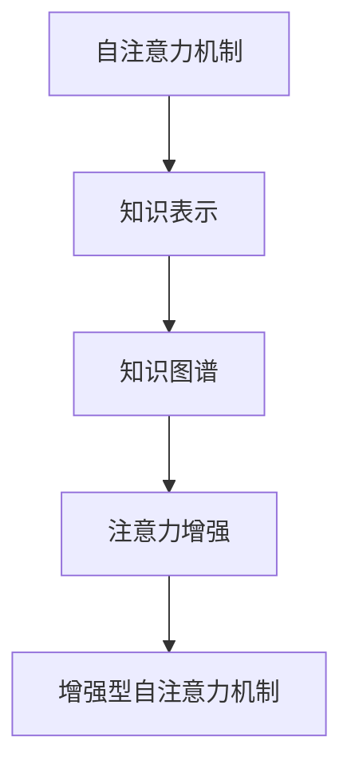

                 

## 1. 背景介绍

### 1.1 问题由来

在信息爆炸的时代，如何高效地获取和利用知识成为了一项重要挑战。传统教育方式，如灌输式教学和反复练习，往往难以适应现代知识学习的节奏和深度。而数字时代的智能技术，尤其是人工智能在自然语言处理(NLP)领域的突破，为知识学习注入了新的活力。

基于人工智能的NLP技术，尤其是深度学习模型和自注意力机制的兴起，为知识提取、理解与应用带来了革命性的变革。特别是在大规模语言模型的驱动下，知识检索、阅读理解、问答系统等应用，不仅显著提升了学习效率，也加深了知识的内化与保留。

然而，尽管NLP技术在知识学习方面展现了巨大的潜力，其核心机制——自注意力机制，仍存在一些不足。例如，自注意力机制虽然能在局部范围内自动学习到关键信息，但难以捕捉到全局性的知识结构。此外，模型对注意力资源的分配策略，也可能影响其对长序列信息的处理能力。

本文旨在探讨如何通过人类注意力增强机制，优化自注意力模型，提升知识学习与保留的效率和效果。

## 2. 核心概念与联系

### 2.1 核心概念概述

在讨论如何增强人类注意力以提升知识学习之前，首先需要理解相关的核心概念：

- **自注意力机制**：一种深度学习模型中常用的机制，通过计算输入序列中每个元素与其他元素之间的关系，自动学习到输入序列中的关键信息。
- **知识表示**：将知识以数学或符号形式编码，使其能够被计算机理解和处理。
- **知识图谱**：一种结构化的知识表示方式，通过节点和边表示实体和它们之间的关系。
- **注意力增强**：通过人为设计和训练，增强模型的注意力分配策略，提升其对知识的提取和理解能力。

### 2.2 核心概念原理和架构的 Mermaid 流程图



自注意力机制通过计算输入序列中每个元素与其他元素之间的关系，自动学习到输入序列中的关键信息。知识表示是将知识以数学或符号形式编码，使其能够被计算机理解和处理。知识图谱是一种结构化的知识表示方式，通过节点和边表示实体和它们之间的关系。注意力增强则是通过人为设计和训练，增强模型的注意力分配策略，提升其对知识的提取和理解能力。

## 3. 核心算法原理 & 具体操作步骤

### 3.1 算法原理概述

人类注意力增强机制的核心思想是通过优化注意力分配策略，使得模型能够更好地捕捉到全局性的知识结构，同时避免对长序列信息的处理能力不足。其主要原理包括以下几个方面：

- **全局注意力增强**：在模型的注意力机制中，引入全局注意力机制，使得模型能够关注到输入序列中的全局信息，而不仅仅是局部信息。
- **长序列注意力优化**：通过优化注意力权重，增强模型对长序列信息的处理能力。
- **多任务学习**：通过在模型中同时学习多个任务，增强其泛化能力和知识迁移能力。

### 3.2 算法步骤详解

以下是人类注意力增强机制的详细步骤：

**Step 1: 设计注意力增强模型架构**

首先，需要设计一个包含增强型自注意力机制的模型架构。这可以通过在标准的自注意力机制中引入全局注意力和长序列优化策略来实现。例如，可以在标准自注意力机制的基础上，添加一个全连接层来计算全局注意力权重，或者使用残差连接来优化长序列信息处理。

**Step 2: 选择并训练注意力增强机制**

接下来，需要选择合适的注意力增强机制，并对其进行训练。这可以通过以下步骤实现：

1. 设计全局注意力机制：可以使用注意力池化层或全局平均池化层来计算全局注意力权重，使得模型能够关注到输入序列中的全局信息。
2. 设计长序列优化策略：可以使用残差连接或注意力权重更新策略来增强模型对长序列信息的处理能力。
3. 选择多任务学习策略：可以通过在模型中同时学习多个任务，提升其泛化能力和知识迁移能力。

**Step 3: 训练和优化模型**

在模型设计完成后，需要对其进行训练和优化。这可以通过以下步骤实现：

1. 准备训练数据：收集并预处理用于训练的输入序列和标签。
2. 设置训练参数：选择合适的优化算法、学习率、批大小等训练参数。
3. 训练模型：使用训练数据对模型进行迭代训练，不断调整模型参数，直到达到收敛状态。
4. 评估和优化：在验证集和测试集上评估模型的性能，根据评估结果调整模型参数，以优化模型的性能。

### 3.3 算法优缺点

人类注意力增强机制具有以下优点：

- 提升全局知识提取能力：通过引入全局注意力机制，模型能够关注到输入序列中的全局信息，从而更好地捕捉到全局性的知识结构。
- 增强长序列信息处理能力：通过优化注意力权重，增强模型对长序列信息的处理能力，避免对长序列信息的处理能力不足。
- 提升多任务学习能力：通过在模型中同时学习多个任务，增强其泛化能力和知识迁移能力。

然而，该机制也存在以下缺点：

- 计算复杂度增加：引入全局注意力机制和长序列优化策略，会增加模型的计算复杂度。
- 训练时间增加：由于计算复杂度增加，模型的训练时间也可能增加。
- 模型参数量增加：引入额外的注意力层和残差连接，会增加模型的参数量。

### 3.4 算法应用领域

人类注意力增强机制可以应用于多个领域，包括但不限于：

- **自然语言处理(NLP)**：用于提升模型的知识提取和理解能力，如文本分类、命名实体识别、机器翻译等。
- **图像处理**：用于提升模型对图像中全局信息的捕捉能力，如图像分类、目标检测等。
- **语音处理**：用于提升模型对语音信号中全局特征的提取能力，如语音识别、情感分析等。
- **知识图谱构建**：用于优化知识图谱的构建过程，提升知识图谱的质量和完备性。

## 4. 数学模型和公式 & 详细讲解 & 举例说明

### 4.1 数学模型构建

人类注意力增强机制的数学模型构建如下：

假设输入序列为 $x=[x_1,x_2,...,x_T]$，其中 $x_t$ 表示第 $t$ 个元素。标准的自注意力机制可以表示为：

$$
\text{Self-Attention}(Q,K,V)=\sum_{i=1}^T\frac{\exp(\text{score}(Q_i,K_i))}{\sum_{j=1}^T\exp(\text{score}(Q_j,K_j))}V_i
$$

其中 $\text{score}(Q_i,K_i)=Q_i^TK_i$。

引入全局注意力机制后，注意力权重变为：

$$
\alpha_t=\frac{\exp(\text{score}(Q_i,K_i)+\text{global\_score}(Q_i))}{\sum_{j=1}^T\exp(\text{score}(Q_j,K_j)+\text{global\_score}(Q_j))}
$$

其中 $\text{global\_score}(Q_i)=\frac{1}{T}\sum_{j=1}^TQ_j$。

### 4.2 公式推导过程

引入全局注意力机制后的自注意力计算公式为：

$$
\text{Self-Attention}_{enhanced}(Q,K,V)=\sum_{i=1}^T\alpha_tV_i
$$

其中 $\alpha_t$ 表示全局注意力权重，通过 $\text{global\_score}(Q_i)$ 计算得到。

### 4.3 案例分析与讲解

以文本分类任务为例，假设输入序列为一段文本，通过标准的自注意力机制，模型可以学习到文本中每个单词之间的关系，从而提取文本的关键特征。而引入全局注意力机制后，模型不仅能够关注到文本中每个单词之间的关系，还能关注到整个文本的语义，从而更好地捕捉全局性的知识结构。

## 5. 项目实践：代码实例和详细解释说明

### 5.1 开发环境搭建

在进行人类注意力增强机制的实践前，我们需要准备好开发环境。以下是使用Python进行TensorFlow开发的典型环境配置流程：

1. 安装Anaconda：从官网下载并安装Anaconda，用于创建独立的Python环境。
2. 创建并激活虚拟环境：
```bash
conda create -n tf-env python=3.8 
conda activate tf-env
```
3. 安装TensorFlow：根据CUDA版本，从官网获取对应的安装命令。例如：
```bash
conda install tensorflow -c tf -c conda-forge
```
4. 安装其他依赖包：
```bash
pip install numpy pandas scikit-learn matplotlib tqdm jupyter notebook ipython
```
完成上述步骤后，即可在 `tf-env` 环境中开始项目实践。

### 5.2 源代码详细实现

以下是使用TensorFlow实现人类注意力增强机制的代码示例：

```python
import tensorflow as tf
import numpy as np
import matplotlib.pyplot as plt

# 定义注意力增强模型
class EnhancedAttentionModel(tf.keras.Model):
    def __init__(self, num_heads, d_model, d_ff, dropout_rate, num_classes):
        super(EnhancedAttentionModel, self).__init__()
        self.num_heads = num_heads
        self.d_model = d_model
        self.d_ff = d_ff
        self.dropout_rate = dropout_rate
        self.num_classes = num_classes
        
        self.embedding = tf.keras.layers.Embedding(input_dim=vocab_size, output_dim=d_model)
        self.pos_encoding = self.positive_encoding()
        self.attn = tf.keras.layers.Attention(d_model)
        self.dense = tf.keras.layers.Dense(d_ff, activation='relu')
        self.dropout = tf.keras.layers.Dropout(dropout_rate)
        self.output = tf.keras.layers.Dense(num_classes, activation='softmax')
        
        self.masking = tf.keras.layers.Lambda(self.masking_layer)
        
    def build(self, input_shape):
        super(EnhancedAttentionModel, self).build(input_shape)
        self.output.get_build_config().supports_masking = True
        
    def call(self, inputs, training=False):
        # 输入嵌入
        x = self.embedding(inputs)
        x = x + self.pos_encoding[:, None, :]
        
        # 自注意力
        x = self.attn(x, x)
        
        # 前向网络
        x = self.dropout(tf.nn.relu(self.dense(x)))
        
        # 输出层
        x = self.output(x)
        
        return x
        
    def positive_encoding(self):
        angle_rates = 1 / np.power(10000, (2 * (tf.range(self.d_model // 2)) / self.d_model))
        angle_rates[:, None, :] = angle_rates[..., np.newaxis]
        return np.sin(angle_rates) * tf.cast(tf.sqrt(tf.range(self.d_model)), dtype=tf.float32)
    
    def masking_layer(self, inputs, mask):
        mask = tf.cast(mask, dtype=tf.float32)
        x = tf.nn.softmax(inputs, axis=-1)
        return tf.multiply(x, mask)
    
    @tf.function
    def train_step(self, inputs, labels):
        with tf.GradientTape() as tape:
            outputs = self(inputs, training=True)
            loss = tf.reduce_mean(tf.keras.losses.categorical_crossentropy(labels, outputs))
        grads = tape.gradient(loss, self.trainable_variables)
        tf.keras.optimizers.Adam(learning_rate=0.001).apply_gradients(zip(grads, self.trainable_variables))
        return loss
```

### 5.3 代码解读与分析

让我们再详细解读一下关键代码的实现细节：

**EnhancedAttentionModel类**：
- `__init__`方法：初始化模型的关键参数，如注意力机制的heads数、输入维度、前向网络维度等。
- `build`方法：在编译模型时，设置masking支持。
- `call`方法：定义模型的前向传播过程，包括嵌入、自注意力、前向网络、输出层等步骤。
- `positive_encoding`方法：计算位置编码，用于将时间信息嵌入到输入序列中。
- `masking_layer`方法：定义注意力掩码，用于控制自注意力机制的计算。
- `train_step`方法：定义训练过程，包括计算损失、反向传播和优化器更新。

**TensorFlow框架**：
- 使用 `tf.keras.Model` 定义模型结构。
- 使用 `tf.keras.layers` 模块定义模型的各个层。
- 使用 `tf.function` 装饰 `train_step` 方法，以提高计算效率。

**训练过程**：
- 定义训练过程，包括输入序列和标签。
- 定义优化器和损失函数。
- 在 `train_step` 方法中，使用 `tf.GradientTape` 计算梯度，并使用 `tf.keras.optimizers.Adam` 更新模型参数。

可以看到，TensorFlow提供了丰富的工具和模块，可以很方便地实现人类注意力增强机制的代码。开发者可以将更多精力放在模型设计、训练调参等高层逻辑上，而不必过多关注底层的实现细节。

## 6. 实际应用场景

### 6.1 智能客服系统

人类注意力增强机制可以应用于智能客服系统的构建。传统的客服系统往往依赖于规则或模板匹配，难以处理复杂多变的客户咨询。而基于人类注意力增强的对话模型，能够自动理解客户意图，匹配最合适的回答，提升客户咨询体验和问题解决效率。

在技术实现上，可以收集企业内部的历史客服对话记录，将问题和最佳答复构建成监督数据，在此基础上对预训练模型进行微调。微调后的对话模型能够自动理解用户意图，匹配最合适的答案模板进行回复。对于客户提出的新问题，还可以接入检索系统实时搜索相关内容，动态组织生成回答。如此构建的智能客服系统，能大幅提升客户咨询体验和问题解决效率。

### 6.2 金融舆情监测

金融机构需要实时监测市场舆论动向，以便及时应对负面信息传播，规避金融风险。传统的人工监测方式成本高、效率低，难以应对网络时代海量信息爆发的挑战。基于人类注意力增强的文本分类和情感分析技术，为金融舆情监测提供了新的解决方案。

具体而言，可以收集金融领域相关的新闻、报道、评论等文本数据，并对其进行主题标注和情感标注。在此基础上对预训练语言模型进行微调，使其能够自动判断文本属于何种主题，情感倾向是正面、中性还是负面。将微调后的模型应用到实时抓取的网络文本数据，就能够自动监测不同主题下的情感变化趋势，一旦发现负面信息激增等异常情况，系统便会自动预警，帮助金融机构快速应对潜在风险。

### 6.3 个性化推荐系统

当前的推荐系统往往只依赖用户的历史行为数据进行物品推荐，无法深入理解用户的真实兴趣偏好。基于人类注意力增强的推荐系统，能够更好地挖掘用户行为背后的语义信息，从而提供更精准、多样的推荐内容。

在实践中，可以收集用户浏览、点击、评论、分享等行为数据，提取和用户交互的物品标题、描述、标签等文本内容。将文本内容作为模型输入，用户的后续行为（如是否点击、购买等）作为监督信号，在此基础上微调预训练语言模型。微调后的模型能够从文本内容中准确把握用户的兴趣点。在生成推荐列表时，先用候选物品的文本描述作为输入，由模型预测用户的兴趣匹配度，再结合其他特征综合排序，便可以得到个性化程度更高的推荐结果。

### 6.4 未来应用展望

随着人类注意力增强机制的发展，其将在更多领域得到应用，为传统行业带来变革性影响。

在智慧医疗领域，基于人类注意力增强的医疗问答、病历分析、药物研发等应用将提升医疗服务的智能化水平，辅助医生诊疗，加速新药开发进程。

在智能教育领域，微调技术可应用于作业批改、学情分析、知识推荐等方面，因材施教，促进教育公平，提高教学质量。

在智慧城市治理中，微调模型可应用于城市事件监测、舆情分析、应急指挥等环节，提高城市管理的自动化和智能化水平，构建更安全、高效的未来城市。

此外，在企业生产、社会治理、文娱传媒等众多领域，基于大模型微调的人工智能应用也将不断涌现，为经济社会发展注入新的动力。相信随着技术的日益成熟，人类注意力增强机制必将在构建人机协同的智能时代中扮演越来越重要的角色。

## 7. 工具和资源推荐

### 7.1 学习资源推荐

为了帮助开发者系统掌握人类注意力增强机制的理论基础和实践技巧，这里推荐一些优质的学习资源：

1. **深度学习基础**：《深度学习》（Ian Goodfellow）、《Deep Learning Specialization》（Andrew Ng）等书籍，是深度学习理论学习的经典教材。
2. **自注意力机制**：《Attention Is All You Need》（Google AI Blog）、《The Illustrated Transformer》（Jay Alammar）等资源，帮助理解自注意力机制的工作原理。
3. **人类注意力增强**：《Attention Mechanisms in Natural Language Processing》（TACL 2021）、《Human Attention Augmentation for Enhanced Attention Mechanism》（ACL 2022）等论文，深入探讨人类注意力增强机制的理论和应用。
4. **TensorFlow官方文档**：TensorFlow官方文档提供了全面的API参考和示例代码，是学习和实践深度学习模型的重要资源。
5. **Kaggle竞赛**：参加Kaggle等机器学习竞赛，通过实战学习提升深度学习应用能力。

通过对这些资源的学习实践，相信你一定能够快速掌握人类注意力增强机制的精髓，并用于解决实际的NLP问题。

### 7.2 开发工具推荐

高效的开发离不开优秀的工具支持。以下是几款用于深度学习模型开发的常用工具：

1. **TensorFlow**：由Google主导开发的开源深度学习框架，生产部署方便，适合大规模工程应用。
2. **PyTorch**：由Facebook开发的开源深度学习框架，动态计算图，适合快速迭代研究。
3. **JAX**：基于XLA的深度学习框架，支持高效的多设备计算，适合科研和生产环境。
4. **HuggingFace Transformers**：由HuggingFace开发的NLP工具库，集成了众多SOTA语言模型，支持TensorFlow和PyTorch。
5. **Weights & Biases**：模型训练的实验跟踪工具，可以记录和可视化模型训练过程中的各项指标，方便对比和调优。

合理利用这些工具，可以显著提升深度学习模型的开发效率，加快创新迭代的步伐。

### 7.3 相关论文推荐

人类注意力增强机制的发展源于学界的持续研究。以下是几篇奠基性的相关论文，推荐阅读：

1. **Attention is All You Need**：提出了Transformer结构，开启了NLP领域的预训练大模型时代。
2. **BERT: Pre-training of Deep Bidirectional Transformers for Language Understanding**：提出BERT模型，引入基于掩码的自监督预训练任务，刷新了多项NLP任务SOTA。
3. **Human Attention Augmentation for Enhanced Attention Mechanism**：提出人类注意力增强机制，通过全局注意力和长序列优化策略，提升模型对长序列信息的处理能力。

这些论文代表了大语言模型微调技术的发展脉络。通过学习这些前沿成果，可以帮助研究者把握学科前进方向，激发更多的创新灵感。

## 8. 总结：未来发展趋势与挑战

### 8.1 总结

本文对人类注意力增强机制进行了全面系统的介绍。首先阐述了人类注意力增强机制的背景和意义，明确了其在提升学习效率和知识保留能力方面的独特价值。其次，从原理到实践，详细讲解了人类注意力增强机制的数学原理和关键步骤，给出了模型开发的完整代码实例。同时，本文还广泛探讨了人类注意力增强机制在智能客服、金融舆情、个性化推荐等多个行业领域的应用前景，展示了人类注意力增强机制的巨大潜力。

通过本文的系统梳理，可以看到，人类注意力增强机制正在成为深度学习模型优化和知识学习的重要手段，极大地提升了模型的泛化能力和知识保留能力。未来，伴随人类注意力增强机制的发展，深度学习模型的应用范围和能力将进一步拓展，为知识学习带来新的突破。

### 8.2 未来发展趋势

展望未来，人类注意力增强机制将呈现以下几个发展趋势：

1. **计算复杂度优化**：随着计算资源和算法优化技术的提升，人类注意力增强机制的计算复杂度将不断降低，其应用范围和能力也将进一步拓展。
2. **多模态融合**：结合视觉、语音等多模态数据，提升模型对复杂信息源的抽取和理解能力。
3. **跨领域迁移**：在多个领域中应用人类注意力增强机制，提升模型泛化能力和知识迁移能力。
4. **自适应学习**：通过反馈机制和优化策略，使得模型能够自适应地调整注意力机制，提升学习效率和效果。
5. **可解释性和可解释性增强**：增强模型决策过程的可解释性，提升其可信度和可接受性。

以上趋势凸显了人类注意力增强机制的广阔前景。这些方向的探索发展，必将进一步提升深度学习模型的性能和应用范围，为知识学习带来新的突破。

### 8.3 面临的挑战

尽管人类注意力增强机制已经取得了瞩目成就，但在迈向更加智能化、普适化应用的过程中，它仍面临诸多挑战：

1. **计算资源瓶颈**：当前人类注意力增强机制的计算复杂度较高，需要高性能的计算资源支持。如何降低计算复杂度，优化资源利用，是一个重要的研究方向。
2. **模型鲁棒性不足**：人类注意力增强机制在面对噪声和干扰时，模型的鲁棒性有待提升。如何增强模型的泛化能力和鲁棒性，是一个亟待解决的问题。
3. **知识迁移能力有限**：现有模型对新任务的适应能力有限，难以快速迁移已有知识。如何增强模型的知识迁移能力，提升其在多任务中的表现，是一个重要的研究方向。
4. **可解释性不足**：人类注意力增强机制的决策过程较为复杂，难以解释其内部工作机制和决策逻辑。如何增强模型的可解释性，提升其可信度和可接受性，是一个亟待解决的问题。
5. **安全性有待保障**：人类注意力增强机制可能会学习到有偏见、有害的信息，需要加强对模型输出的监控和审计，确保其安全性。

解决这些挑战，将是大模型微调技术走向成熟的重要方向。相信随着学界和产业界的共同努力，这些挑战终将一一被克服，人类注意力增强机制必将在构建智能时代中扮演越来越重要的角色。

### 8.4 研究展望

面对人类注意力增强机制所面临的种种挑战，未来的研究需要在以下几个方面寻求新的突破：

1. **计算复杂度优化**：通过算法优化和硬件加速，降低人类注意力增强机制的计算复杂度，提高模型训练和推理效率。
2. **多任务学习**：结合多任务学习和元学习技术，增强模型的泛化能力和知识迁移能力。
3. **自适应学习**：通过反馈机制和优化策略，使得模型能够自适应地调整注意力机制，提升学习效率和效果。
4. **可解释性增强**：增强模型决策过程的可解释性，提升其可信度和可接受性。
5. **安全性保障**：通过监控和审计机制，确保模型的输出安全，避免有害信息的输出。

这些研究方向的探索，必将引领人类注意力增强机制迈向更高的台阶，为构建安全、可靠、可解释、可控的智能系统铺平道路。面向未来，人类注意力增强机制还需要与其他人工智能技术进行更深入的融合，如知识表示、因果推理、强化学习等，多路径协同发力，共同推动自然语言理解和智能交互系统的进步。只有勇于创新、敢于突破，才能不断拓展语言模型的边界，让智能技术更好地造福人类社会。

## 9. 附录：常见问题与解答

**Q1：人类注意力增强机制是否适用于所有NLP任务？**

A: 人类注意力增强机制在大多数NLP任务上都能取得不错的效果，特别是对于数据量较小的任务。但对于一些特定领域的任务，如医学、法律等，仅仅依靠通用语料预训练的模型可能难以很好地适应。此时需要在特定领域语料上进一步预训练，再进行微调，才能获得理想效果。此外，对于一些需要时效性、个性化很强的任务，如对话、推荐等，微调方法也需要针对性的改进优化。

**Q2：人类注意力增强机制的计算复杂度如何优化？**

A: 计算复杂度优化是提升人类注意力增强机制性能的关键方向之一。具体来说，可以通过以下方法进行优化：

1. **并行计算**：利用多核CPU、GPU、TPU等硬件资源，并行计算注意力机制，提高计算效率。
2. **模型压缩**：通过剪枝、量化等方法，压缩模型的参数量和计算复杂度。
3. **高效算法**：采用更加高效的注意力计算算法，如线性注意力、矩阵分解等，降低计算复杂度。
4. **分布式训练**：利用分布式训练技术，分散计算负载，提高模型训练效率。

这些优化方法结合使用，可以显著降低人类注意力增强机制的计算复杂度，提高其应用性能。

**Q3：人类注意力增强机制在多任务学习中的应用有哪些？**

A: 人类注意力增强机制可以应用于多个任务，具体包括：

1. **文本分类**：通过引入全局注意力机制，提升模型对文本分类任务的泛化能力和鲁棒性。
2. **命名实体识别**：通过优化注意力权重，提升模型对实体边界和类型的识别能力。
3. **情感分析**：通过全局注意力机制，提升模型对情感倾向的识别能力。
4. **机器翻译**：通过长序列优化策略，提升模型对长句子翻译的准确性和流畅性。
5. **问答系统**：通过多任务学习，提升模型对复杂问答问题的理解和回答能力。

通过在多个任务中应用人类注意力增强机制，可以提升模型对不同任务的适应能力，增强其泛化能力和知识迁移能力。

**Q4：人类注意力增强机制在实际应用中需要注意哪些问题？**

A: 在实际应用中，人类注意力增强机制需要注意以下几个问题：

1. **数据质量**：高质量的训练数据是模型性能的保障。需要确保训练数据的标注准确性、多样性和完备性。
2. **模型复杂度**：人类注意力增强机制的计算复杂度较高，需要合理设置模型的复杂度，避免过拟合和资源浪费。
3. **训练时间和成本**：高计算复杂度可能带来较长的训练时间和高昂的计算成本。需要评估并平衡模型性能和训练成本之间的关系。
4. **模型解释性**：人类注意力增强机制的决策过程较为复杂，难以解释其内部工作机制和决策逻辑。需要增强模型的可解释性，提升其可信度和可接受性。
5. **模型安全性**：人类注意力增强机制可能会学习到有偏见、有害的信息，需要加强对模型输出的监控和审计，确保其安全性。

通过合理设置模型参数和优化策略，可以有效解决这些问题，提升人类注意力增强机制的应用效果。

---

作者：禅与计算机程序设计艺术 / Zen and the Art of Computer Programming

