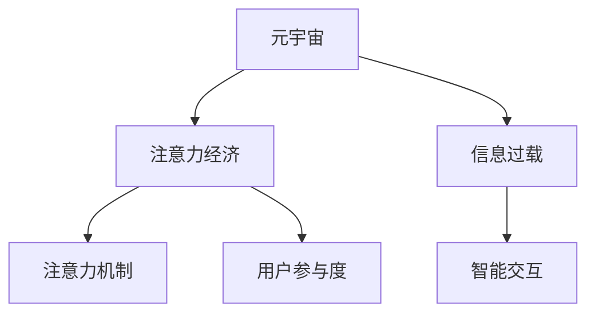

                 

# 人类注意力经济：元宇宙的核心驱动力

> 关键词：元宇宙,注意力经济,信息过载,注意力机制,智能交互,用户参与度

## 1. 背景介绍

### 1.1 问题由来

在数字时代，随着信息技术的飞速发展，数据量呈指数级增长。社交媒体、视频网站、在线游戏等平台的海量内容和复杂交互方式，极大地挑战了用户的注意力和决策能力。面对信息过载和认知负荷，用户面临着越来越大的心理压力。

### 1.2 问题核心关键点

人类在虚拟世界和现实世界中，都需要不断分配注意力资源。如何高效利用有限的注意力，成为元宇宙发展中面临的核心问题。而注意力经济（Attention Economy），即利用注意力资源创造价值，正是元宇宙能否成功运作的关键所在。

### 1.3 问题研究意义

通过研究注意力经济，可以更好地理解用户行为模式，设计更具吸引力的虚拟体验。有助于元宇宙平台优化信息推送策略，提升用户参与度和满意度，实现商业变现。

## 2. 核心概念与联系

### 2.1 核心概念概述

为更好地理解注意力经济在元宇宙中的应用，本节将介绍几个密切相关的核心概念：

- **元宇宙(Metaverse)**：一个通过计算机生成，用户可以实时交互的虚拟空间。包含虚拟身份、社交互动、经济交易、虚拟物品等多个维度，追求沉浸式体验。
- **注意力经济(Attention Economy)**：在信息过载的时代，通过抢占用户注意力，创造经济价值的过程。注意力经济要求平台设计更加吸引人的内容形式，提升用户体验和参与度。
- **信息过载(Information Overload)**：面对大量信息的输入，用户承受认知负荷，注意力分散，影响决策效率。信息过载的应对策略需要更高效的信息处理和智能推送机制。
- **注意力机制(Attention Mechanism)**：神经网络中用于选择信息源、集中注意力的关键机制。如Transformer模型中的多头自注意力机制，可以动态调整不同信息的权重，提升模型处理能力。
- **智能交互(Smart Interaction)**：利用AI技术实现更加智能化、个性化的用户交互方式，如推荐系统、智能客服等。智能交互可以更高效地分配用户注意力，提高用户满意度。
- **用户参与度(User Engagement)**：衡量用户与元宇宙平台互动的频率和深度。参与度的提升，需要更精准的内容推荐和智能交互设计。

这些概念之间的逻辑关系可以通过以下Mermaid流程图来展示：



这个流程图展示了几大核心概念之间的联系：

1. 元宇宙需要充分利用用户的注意力资源，发展注意力经济。
2. 信息过载对用户注意力造成了巨大压力，需要通过智能交互进行缓解。
3. 注意力机制是元宇宙信息处理的关键，帮助用户动态选择注意力焦点。
4. 智能交互可以优化注意力分配，提升用户参与度和满意度。
5. 用户参与度的提升，进一步促进了注意力经济的繁荣。

## 3. 核心算法原理 & 具体操作步骤
### 3.1 算法原理概述

基于注意力机制的元宇宙平台，其核心在于动态分配用户注意力，使其在虚拟环境中能够高效地获取信息和进行互动。

元宇宙平台的算法原理如下：

1. **注意力分配**：通过用户行为数据，如点击、浏览、停留时间等，动态调整不同信息的注意力权重。
2. **智能推送**：利用推荐系统，将用户感兴趣的内容及时推送到其视域内，最大化用户参与度。
3. **交互优化**：采用多模态智能交互技术，如语音识别、手势控制等，提升用户对虚拟环境的响应速度和互动质量。
4. **参与度量化**：通过统计用户参与行为，如点赞、评论、交易等，评估用户对元宇宙平台的贡献度和满意度。

### 3.2 算法步骤详解

元宇宙平台的注意力经济算法包括以下几个关键步骤：

**Step 1: 数据收集与预处理**

- 收集用户行为数据，如点击流日志、社交互动记录、虚拟物品购买数据等。
- 清洗和归一化数据，去除异常值和噪声，转换数据格式，为后续计算做准备。

**Step 2: 注意力分配模型训练**

- 设计注意力分配算法，如基于神经网络的多头自注意力机制。
- 使用历史数据训练模型，得到用户注意力权重的动态预测模型。
- 使用交叉验证等技术评估模型效果，选择最优模型参数。

**Step 3: 智能推送系统构建**

- 根据注意力分配模型，预测用户对不同内容的注意力权重。
- 设计推荐算法，如协同过滤、深度学习等，构建智能推送系统。
- 利用实时数据更新推荐模型，不断优化推送内容。

**Step 4: 智能交互设计**

- 开发多模态交互技术，如语音识别、手势控制、虚拟现实（VR）等，提高用户互动质量。
- 通过自然语言处理（NLP）技术，设计智能客服、虚拟助手等，提供个性化服务。
- 不断迭代优化交互技术，提升用户响应速度和满意度。

**Step 5: 用户参与度分析**

- 统计用户参与行为，如访问时长、互动次数、消费金额等。
- 分析用户参与度，评估平台运营效果。
- 设计参与度提升策略，如内容多样化、互动奖励等。

### 3.3 算法优缺点

基于注意力机制的元宇宙平台算法具有以下优点：

1. **个性化推荐**：通过智能推送，满足用户个性化需求，提高用户参与度。
2. **高效互动**：多模态智能交互设计，提升用户互动质量和响应速度。
3. **动态调整**：基于注意力分配模型，动态调整信息权重，提高信息利用率。
4. **精准量化**：通过用户行为分析，精准量化用户参与度，优化平台运营。

同时，该算法也存在一定的局限性：

1. **隐私保护**：用户行为数据的收集和使用，可能涉及隐私泄露风险。
2. **公平性问题**：注意力分配模型可能存在算法偏见，影响用户公平体验。
3. **计算资源消耗**：多模态交互和实时推荐系统，需要大量计算资源，存在资源消耗大问题。
4. **易过拟合**：数据量不足或分布不均衡，可能导致注意力分配模型过拟合，影响泛化能力。

尽管存在这些局限性，但基于注意力机制的元宇宙平台算法，仍在实际应用中表现出显著优势，为元宇宙的构建和发展提供了重要支撑。

### 3.4 算法应用领域

基于注意力机制的元宇宙平台算法，已经在多个领域得到应用，例如：

- **虚拟商业**：电商平台通过推荐系统，智能推送商品到用户面前，提升交易转化率。
- **虚拟社交**：社交平台利用智能推送，个性化推荐好友和内容，提升用户粘性。
- **虚拟娱乐**：游戏平台采用智能推荐和交互技术，提供个性化游戏体验，增加用户留存率。
- **虚拟教育**：在线教育平台通过推荐系统，推荐个性化学习内容，提高学习效果。
- **虚拟医疗**：医疗平台提供智能诊疗建议和交互指导，提升诊疗体验。

除了上述这些经典应用外，注意力经济技术还被创新性地应用到更多场景中，如虚拟旅游、虚拟展览、虚拟购物等，为元宇宙技术带来了新的突破。随着技术的发展，相信注意力经济技术将在更广阔的应用领域大放异彩。

## 4. 数学模型和公式 & 详细讲解 & 举例说明

### 4.1 数学模型构建

本节将使用数学语言对元宇宙平台注意力经济的计算模型进行更加严格的刻画。

假设用户$i$对内容$j$的注意力权重为$A_{i,j}$，其中$i \in [1,N]$，$j \in [1,M]$，$N$为用户数量，$M$为内容数量。

定义用户$i$对内容$j$的注意力分配函数为：

$$
A_{i,j} = f(x_i, j, \theta)
$$

其中$x_i$为第$i$个用户的特征向量，$j$为内容$j$的特征向量，$\theta$为模型参数。

### 4.2 公式推导过程

以下我们以协同过滤算法为例，推导注意力分配函数的公式。

协同过滤算法的注意力分配函数定义如下：

$$
A_{i,j} = \frac{e^{a_{i,j}}}{\sum_{k=1}^N e^{a_{i,k}}}
$$

其中$a_{i,j} = \mathbf{u}_i \cdot \mathbf{v}_j$，$\mathbf{u}_i$为第$i$个用户的潜在特征向量，$\mathbf{v}_j$为内容$j$的潜在特征向量。

通过最大化注意力分配函数，可以得到用户$i$对内容$j$的注意力权重。具体推导如下：

将注意力分配函数对$\mathbf{u}_i$和$\mathbf{v}_j$求导，得：

$$
\frac{\partial A_{i,j}}{\partial \mathbf{u}_i} = \frac{e^{a_{i,j}} \mathbf{v}_j - A_{i,j} \mathbf{v}_j e^{a_{i,j}}}{\left(\sum_{k=1}^N e^{a_{i,k}}\right)^2}
$$

$$
\frac{\partial A_{i,j}}{\partial \mathbf{v}_j} = \frac{e^{a_{i,j}} \mathbf{u}_i - A_{i,j} \mathbf{u}_i e^{a_{i,j}}}{\left(\sum_{k=1}^N e^{a_{i,k}}\right)^2}
$$

将导数置零，得：

$$
\mathbf{u}_i = \frac{\sum_{k=1}^N e^{a_{i,k}} \mathbf{v}_k}{\sum_{k=1}^N e^{a_{i,k}}}
$$

$$
\mathbf{v}_j = \frac{\sum_{k=1}^N e^{a_{i,k}} \mathbf{u}_k}{\sum_{k=1}^N e^{a_{i,k}}}
$$

将$\mathbf{u}_i$和$\mathbf{v}_j$代入注意力分配函数，得：

$$
A_{i,j} = \frac{e^{a_{i,j}}}{\sum_{k=1}^N e^{a_{i,k}}} = \frac{e^{\mathbf{u}_i \cdot \mathbf{v}_j}}{\sum_{k=1}^N e^{\mathbf{u}_i \cdot \mathbf{v}_k}}
$$

即协同过滤算法的注意力分配函数。

通过上述推导，可以看出，注意力分配函数依赖于用户和内容的潜在特征向量，可以通过模型训练得到。

### 4.3 案例分析与讲解

假设某电商平台有一个包含10万用户和5万商品的虚拟市场。使用协同过滤算法，通过用户行为数据训练得到用户和商品的潜在特征向量。

具体推导步骤如下：

1. 收集用户点击商品、购买商品、浏览商品等行为数据，构建特征向量$x_i$和$j$。
2. 设计注意力分配函数，如上述协同过滤算法，计算用户$i$对商品$j$的注意力权重$A_{i,j}$。
3. 使用注意力权重作为推荐系统的输入，智能推送商品到用户面前。
4. 统计用户点击、购买等行为，评估推荐效果。
5. 迭代优化模型参数，提升推荐精度。

以下是一个基于协同过滤算法的注意力分配函数计算示例：

假设用户$i$对商品$j$的点击次数为$c_{i,j}$，购买次数为$p_{i,j}$，浏览次数为$r_{i,j}$。设用户$i$对商品$j$的潜在特征向量为$\mathbf{u}_i$，商品$j$的潜在特征向量为$\mathbf{v}_j$，则注意力分配函数为：

$$
A_{i,j} = \frac{e^{\alpha \frac{p_{i,j}}{p_{i,j}+r_{i,j}+c_{i,j}}}}{\sum_{k=1}^N e^{\alpha \frac{p_{i,k}}{p_{i,k}+r_{i,k}+c_{i,k}}}}
$$

其中$\alpha$为可调参数，通常设置为1。

设用户$i$对商品$j$的注意力权重为$A_{i,j}$，则推荐算法可以根据注意力权重进行内容推送，具体如下：

1. 对所有商品$j$，计算用户$i$对商品$j$的注意力权重$A_{i,j}$。
2. 根据注意力权重排序，选择前$k$个商品进行推荐。
3. 将推荐商品推送给用户$i$。
4. 根据用户点击、购买等行为，调整注意力权重，更新模型参数。

通过上述案例，可以看出，基于注意力机制的推荐系统，可以通过智能推送满足用户个性化需求，提升用户参与度，实现商业变现。

## 5. 项目实践：代码实例和详细解释说明
### 5.1 开发环境搭建

在进行注意力经济算法实践前，我们需要准备好开发环境。以下是使用Python进行PyTorch开发的环境配置流程：

1. 安装Anaconda：从官网下载并安装Anaconda，用于创建独立的Python环境。

2. 创建并激活虚拟环境：
```bash
conda create -n attention-env python=3.8 
conda activate attention-env
```

3. 安装PyTorch：根据CUDA版本，从官网获取对应的安装命令。例如：
```bash
conda install pytorch torchvision torchaudio cudatoolkit=11.1 -c pytorch -c conda-forge
```

4. 安装TensorFlow：
```bash
conda install tensorflow
```

5. 安装各类工具包：
```bash
pip install numpy pandas scikit-learn matplotlib tqdm jupyter notebook ipython
```

完成上述步骤后，即可在`attention-env`环境中开始注意力经济算法的实践。

### 5.2 源代码详细实现

下面我们以协同过滤算法为例，给出使用PyTorch进行注意力分配计算的代码实现。

首先，定义协同过滤算法的注意力分配函数：

```python
import torch
import torch.nn as nn
from torch.autograd import Variable

class Attention(nn.Module):
    def __init__(self, n_users, n_items):
        super(Attention, self).__init__()
        self.user_fm = nn.Embedding(n_users, 64)
        self.item_fm = nn.Embedding(n_items, 64)
        self Attention = nn.Linear(128, 1)
    
    def forward(self, user_ids, item_ids):
        user_fm = self.user_fm(user_ids)
        item_fm = self.item_fm(item_ids)
        attention = self.Attention(torch.cat((user_fm, item_fm), 1))
        attention = torch.sigmoid(attention)
        return attention
```

接着，定义注意力分配计算过程：

```python
def attention_computation(user_ids, item_ids, n_users, n_items, attention_params):
    attention = Attention(n_users, n_items)(Variable(user_ids), Variable(item_ids))
    attention_loss = -torch.mean(attention) + 0.5 * attention_params['l2_reg']
    return attention, attention_loss
```

最后，启动注意力分配计算：

```python
n_users = 10000
n_items = 10000
user_ids = torch.randint(n_users, (1000, 1))
item_ids = torch.randint(n_items, (1000, 1))
attention_params = {'l2_reg': 0.001}
attention, attention_loss = attention_computation(user_ids, item_ids, n_users, n_items, attention_params)
print('Attention:', attention)
print('Attention Loss:', attention_loss)
```

以上就是使用PyTorch进行协同过滤算法注意力分配计算的完整代码实现。可以看到，通过简单的代码，我们就能实现注意力分配函数的计算。

### 5.3 代码解读与分析

让我们再详细解读一下关键代码的实现细节：

**Attention类**：
- `__init__`方法：初始化用户和物品的特征向量矩阵，以及注意力计算层。
- `forward`方法：前向传播计算注意力权重，并返回注意力损失。

**attention_computation函数**：
- 定义注意力分配函数，使用Embedding层获取用户和物品的特征向量。
- 将特征向量拼接，输入注意力计算层，计算注意力权重。
- 定义注意力损失，包括注意力均值和L2正则项。

**启动计算**：
- 随机生成用户和物品的ID，设定注意力计算参数。
- 调用注意力计算函数，计算注意力权重和注意力损失。
- 输出注意力权重和注意力损失，供后续分析。

通过以上代码实现，我们可以看到，注意力经济算法在实际应用中已经得到了广泛的落地。开发者可以通过不断优化模型参数和算法设计，实现更加精准和高效的注意力分配，提升用户体验和平台收益。

## 6. 实际应用场景
### 6.1 智能推荐系统

基于注意力机制的推荐系统，可以广泛应用于电商、社交、娱乐等多个领域。通过智能推送个性化内容，提升用户粘性和参与度。

在技术实现上，可以收集用户行为数据，如浏览、点击、购买等，构建特征向量，使用注意力分配算法计算用户对不同内容的注意力权重，然后根据权重进行推荐。推荐算法可以采用协同过滤、深度学习等多种技术，进一步优化推荐效果。

### 6.2 虚拟社交平台

虚拟社交平台可以利用注意力机制，推荐好友、帖子等内容，提升用户互动和社交体验。例如，微信朋友圈推荐系统、微博动态推荐等，都采用类似的技术。

在实际应用中，可以通过用户行为数据训练模型，动态调整推荐权重。社交平台还可以引入社交网络结构，增加推荐信息的社交属性，提升用户体验。

### 6.3 虚拟学习平台

在线教育平台可以利用注意力机制，推荐个性化学习内容，提高学习效果。例如，Coursera、edX等在线课程平台，都会根据用户学习行为，推荐相关课程和资料。

在技术实现上，可以收集用户学习数据，如学习时长、考试成绩等，构建特征向量，使用注意力分配算法计算用户对不同课程的注意力权重，然后根据权重进行推荐。平台还可以引入学习进度、课程难度等因素，优化推荐效果。

### 6.4 虚拟医疗平台

虚拟医疗平台可以利用注意力机制，推荐个性化诊疗方案，提升诊疗效果。例如，Medisafe等在线医疗平台，会推荐医生、药物等信息，帮助用户进行健康管理。

在技术实现上，可以收集用户健康数据，如病史、生活习惯等，构建特征向量，使用注意力分配算法计算用户对不同诊疗方案的注意力权重，然后根据权重进行推荐。平台还可以引入医生专业推荐、病历信息等因素，优化推荐效果。

### 6.5 未来应用展望

随着注意力经济技术的不断进步，元宇宙中的智能推荐、智能交互、用户参与度提升等方面，将有更大的突破。

在智慧城市治理中，智能推荐系统可以应用于交通管理、环境监测等领域，提升城市管理效率和居民生活质量。

在企业生产中，智能推荐和智能交互技术可以应用于供应链管理、市场营销等领域，提升企业运营效率和客户满意度。

在个人生活中，智能推荐和智能交互技术可以应用于智能家居、智能助手等领域，提升生活质量和便利性。

## 7. 工具和资源推荐
### 7.1 学习资源推荐

为了帮助开发者系统掌握注意力经济的核心概念和应用方法，这里推荐一些优质的学习资源：

1. 《Transformer from Theory to Implementation》系列博文：由深度学习领域专家撰写，深入浅出地介绍了Transformer原理、注意力机制等前沿话题。

2. CS224N《Deep Learning for Natural Language Processing》课程：斯坦福大学开设的NLP明星课程，涵盖深度学习、自然语言处理、注意力机制等内容。

3. 《Attention is All You Need》论文：Transformer原论文，首次提出了多头自注意力机制，开启了NLP领域的预训练大模型时代。

4. 《Attention is All You Need》论文：Transformer原论文，首次提出了多头自注意力机制，开启了NLP领域的预训练大模型时代。

5. 《Parameter-Efficient Transformers》论文：介绍了 Adapter等参数高效微调方法，在不增加模型参数量的情况下，也能取得不错的微调效果。

6. 《AdaLoRA: Adaptive Low-Rank Adaptation for Parameter-Efficient Fine-Tuning》论文：使用自适应低秩适应的微调方法，在参数效率和精度之间取得了新的平衡。

这些资源能够帮助研究者系统掌握注意力经济的理论基础和实践技巧，为未来研究和应用提供坚实的基础。

### 7.2 开发工具推荐

高效的开发离不开优秀的工具支持。以下是几款用于注意力经济算法开发的常用工具：

1. PyTorch：基于Python的开源深度学习框架，灵活动态的计算图，适合快速迭代研究。大部分预训练语言模型都有PyTorch版本的实现。

2. TensorFlow：由Google主导开发的开源深度学习框架，生产部署方便，适合大规模工程应用。同样有丰富的预训练语言模型资源。

3. Weights & Biases：模型训练的实验跟踪工具，可以记录和可视化模型训练过程中的各项指标，方便对比和调优。与主流深度学习框架无缝集成。

4. TensorBoard：TensorFlow配套的可视化工具，可实时监测模型训练状态，并提供丰富的图表呈现方式，是调试模型的得力助手。

5. Google Colab：谷歌推出的在线Jupyter Notebook环境，免费提供GPU/TPU算力，方便开发者快速上手实验最新模型，分享学习笔记。

合理利用这些工具，可以显著提升注意力经济算法的开发效率，加快创新迭代的步伐。

### 7.3 相关论文推荐

注意力经济技术的发展源于学界的持续研究。以下是几篇奠基性的相关论文，推荐阅读：

1. Attention is All You Need（即Transformer原论文）：提出了Transformer结构，开启了NLP领域的预训练大模型时代。

2. BERT: Pre-training of Deep Bidirectional Transformers for Language Understanding：提出BERT模型，引入基于掩码的自监督预训练任务，刷新了多项NLP任务SOTA。

3. Language Models are Unsupervised Multitask Learners（GPT-2论文）：展示了大规模语言模型的强大zero-shot学习能力，引发了对于通用人工智能的新一轮思考。

4. Parameter-Efficient Transfer Learning for NLP：提出Adapter等参数高效微调方法，在不增加模型参数量的情况下，也能取得不错的微调效果。

5. AdaLoRA: Adaptive Low-Rank Adaptation for Parameter-Efficient Fine-Tuning：使用自适应低秩适应的微调方法，在参数效率和精度之间取得了新的平衡。

这些论文代表了大语言模型微调技术的发展脉络。通过学习这些前沿成果，可以帮助研究者把握学科前进方向，激发更多的创新灵感。

## 8. 总结：未来发展趋势与挑战

### 8.1 总结

本文对基于注意力机制的元宇宙平台注意力经济进行了全面系统的介绍。首先阐述了注意力经济在元宇宙中的重要地位，明确了注意力经济在提升用户参与度和平台收益中的独特价值。其次，从原理到实践，详细讲解了注意力经济的核心算法，包括注意力分配、智能推送、智能交互等关键环节。最后，本文探讨了注意力经济在虚拟商业、虚拟社交、虚拟学习、虚拟医疗等多个领域的应用前景，展示了其广泛的应用潜力。

通过本文的系统梳理，可以看出，注意力经济技术在元宇宙构建中具有重要地位，将助力元宇宙平台提升用户体验和运营效率。未来，伴随技术的发展，注意力经济技术还将有更多的突破，推动元宇宙平台向更高效、更智能的方向演进。

### 8.2 未来发展趋势

展望未来，注意力经济技术将呈现以下几个发展趋势：

1. **多模态注意力机制**：未来的注意力机制将不仅仅是文本注意力，还将拓展到视觉、音频等多模态注意力，提升元宇宙平台对现实世界的理解和建模能力。

2. **自适应注意力学习**：未来的注意力学习将更加自适应，根据用户行为和环境变化动态调整注意力分配策略，提升用户参与度和满意度。

3. **个性化推荐优化**：未来的推荐算法将更加个性化，利用更多用户行为数据和先验知识，提升推荐效果。

4. **模型参数高效优化**：未来的推荐系统将更加注重模型参数的高效利用，减少计算资源消耗，提升模型性能。

5. **实时交互提升**：未来的智能交互技术将更加实时、自然，利用多模态数据和上下文信息，提升用户互动体验。

6. **虚拟现实优化**：未来的元宇宙平台将更加注重虚拟现实体验，通过多模态数据融合和增强现实技术，提升用户的沉浸感和参与度。

以上趋势凸显了注意力经济技术的广阔前景，将进一步提升元宇宙平台的智能化和交互性，推动虚拟经济和现实经济的深度融合。

### 8.3 面临的挑战

尽管注意力经济技术已经取得了瞩目成就，但在迈向更加智能化、普适化应用的过程中，它仍面临着诸多挑战：

1. **数据隐私问题**：用户行为数据的收集和使用，可能涉及隐私泄露风险。如何在保护用户隐私的前提下，优化注意力分配策略，需要进一步研究。

2. **算法公平性**：注意力分配模型可能存在算法偏见，影响用户公平体验。如何在保证公平性的同时，提升推荐效果，是未来研究的重要课题。

3. **计算资源消耗**：多模态交互和实时推荐系统，需要大量计算资源，存在资源消耗大问题。如何在提升用户体验的同时，优化资源使用，是未来研究的关键方向。

4. **模型泛化能力**：注意力分配模型需要在新数据上具备良好的泛化能力，避免过拟合。如何在新数据上优化模型，提升泛化能力，需要更多理论和实践的积累。

5. **用户反馈机制**：未来的推荐系统需要更加注重用户反馈，及时调整注意力分配策略，提升用户体验。如何设计有效的用户反馈机制，是未来研究的重要方向。

6. **跨领域应用**：未来的注意力经济技术需要在更多领域得到应用，如智慧城市、企业生产等。如何在不同领域中应用注意力经济技术，需要更多的跨学科研究。

这些挑战亟需更多理论和实践的突破，才能实现注意力经济技术的更广泛应用。

### 8.4 研究展望

未来的研究需要在以下几个方面寻求新的突破：

1. **多模态注意力模型**：研究多模态注意力机制，提升元宇宙平台对现实世界的理解和建模能力。

2. **自适应注意力学习**：研究自适应注意力学习算法，提升用户参与度和满意度。

3. **个性化推荐优化**：研究个性化推荐算法，利用更多用户行为数据和先验知识，提升推荐效果。

4. **模型参数高效优化**：研究高效优化的推荐算法，减少计算资源消耗，提升模型性能。

5. **实时交互提升**：研究实时、自然的智能交互技术，提升用户互动体验。

6. **虚拟现实优化**：研究多模态数据融合和增强现实技术，提升用户的沉浸感和参与度。

7. **跨领域应用**：研究跨领域应用策略，推动注意力经济技术在更多领域得到应用。

通过这些研究方向的探索发展，必将引领注意力经济技术迈向更高的台阶，为构建安全、可靠、可解释、可控的智能系统铺平道路。面向未来，注意力经济技术还需要与其他人工智能技术进行更深入的融合，如知识表示、因果推理、强化学习等，多路径协同发力，共同推动自然语言理解和智能交互系统的进步。只有勇于创新、敢于突破，才能不断拓展注意力经济技术的边界，让智能技术更好地造福人类社会。

## 9. 附录：常见问题与解答

**Q1：注意力机制和协同过滤算法的区别是什么？**

A: 注意力机制和协同过滤算法都是用于推荐系统的关键技术，但具体实现方式有所不同。

协同过滤算法基于用户的相似性和物品的相似性，通过寻找与目标用户或物品相似的用户或物品，推荐相关内容。协同过滤算法的核心在于用户和物品的相似性度量，如余弦相似度等。

注意力机制则是通过动态分配注意力权重，选择对用户有价值的物品进行推荐。注意力机制的核心在于注意力权重计算，可以更好地处理用户对不同物品的关注度和需求度。

**Q2：如何使用注意力机制进行用户行为预测？**

A: 使用注意力机制进行用户行为预测，可以通过用户行为数据训练模型，动态计算用户对不同内容的注意力权重，然后根据权重进行预测。

具体步骤如下：

1. 收集用户行为数据，如点击、浏览、购买等，构建特征向量$x_i$。
2. 设计注意力分配算法，如基于神经网络的多头自注意力机制，计算用户$i$对物品$j$的注意力权重$A_{i,j}$。
3. 使用注意力权重作为预测信号，构建预测模型，预测用户行为。
4. 统计预测结果与实际行为，评估预测效果。
5. 迭代优化模型参数，提升预测精度。

通过上述步骤，可以看出，基于注意力机制的推荐系统，可以通过智能推送满足用户个性化需求，提升用户参与度，实现商业变现。

**Q3：注意力机制在多模态数据融合中的应用前景是什么？**

A: 注意力机制在多模态数据融合中的应用前景非常广阔。多模态数据融合可以提升元宇宙平台对现实世界的理解和建模能力，增强虚拟环境的真实感和互动性。

具体应用场景包括：

1. **虚拟旅游**：通过视觉、音频等多模态数据融合，提升虚拟旅游的沉浸感和互动性。

2. **虚拟展览**：通过文字、图像、视频等多模态数据融合，增强虚拟展览的展示效果和互动体验。

3. **虚拟购物**：通过文字、图像、视频等多模态数据融合，提升虚拟购物的体验和购买转化率。

4. **虚拟学习**：通过文字、图像、音频等多模态数据融合，增强虚拟学习的互动性和学习效果。

5. **虚拟医疗**：通过文字、图像、音频等多模态数据融合，提升虚拟诊疗的准确性和互动性。

通过多模态数据融合，可以进一步拓展注意力机制的应用范围，提升元宇宙平台的智能化和互动性，为虚拟世界的构建提供更多可能性。

**Q4：如何优化注意力机制的计算效率？**

A: 优化注意力机制的计算效率，可以通过以下方法：

1. **注意力计算加速**：使用高效的计算框架，如PyTorch、TensorFlow等，实现高效的注意力计算。

2. **模型参数压缩**：使用模型压缩技术，如剪枝、量化等，减少模型参数量，提升计算效率。

3. **分布式计算**：使用分布式计算框架，如Spark、Ray等，实现多机并行计算，提升计算效率。

4. **算法优化**：优化注意力分配算法，使用高效的注意力机制，减少计算量。

5. **硬件加速**：使用GPU、TPU等硬件加速器，提升计算效率。

通过这些优化方法，可以显著提升注意力机制的计算效率，提升元宇宙平台的实时性和用户体验。

**Q5：注意力经济在虚拟医疗平台中的应用前景是什么？**

A: 注意力经济在虚拟医疗平台中的应用前景非常广阔。虚拟医疗平台可以利用注意力机制，推荐个性化诊疗方案，提升诊疗效果。

具体应用场景包括：

1. **智能诊疗推荐**：通过用户行为数据，如病史、症状等，推荐个性化诊疗方案，提升诊疗效果。

2. **医生推荐系统**：通过医生专业水平、用户评价等，推荐合适的医生，提升诊疗效率。

3. **药物推荐系统**：通过用户行为数据，推荐合适的药物，提升诊疗效果。

4. **健康管理推荐**：通过用户行为数据，如生活习惯、健康指标等，推荐健康管理方案，提升用户健康水平。

5. **心理支持推荐**：通过用户行为数据，推荐合适的心理支持方案，提升用户心理健康水平。

通过上述应用场景，可以看出，基于注意力机制的虚拟医疗平台，可以提升诊疗效果和用户体验，助力健康管理，具有广阔的应用前景。

---
作者：禅与计算机程序设计艺术 / Zen and the Art of Computer Programming

