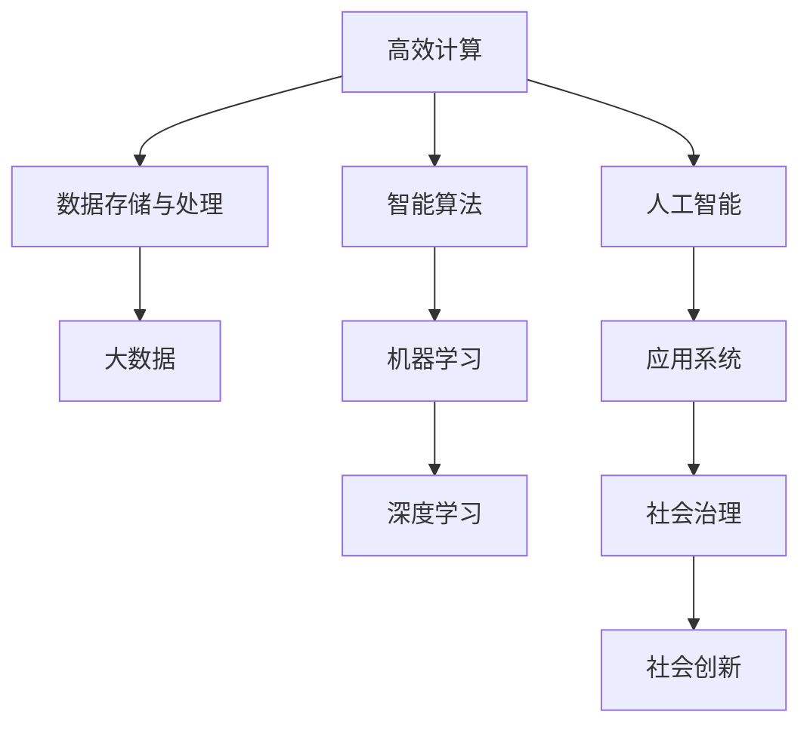

                 

# 人类计算：创造一个更加美好的世界

> 关键词：
- 人类计算, 
- 高效计算, 
- 智能算法, 
- 人工智能, 
- 数字经济, 
- 社会创新,
- 数据驱动

## 1. 背景介绍

### 1.1 问题由来
在信息技术快速发展的今天，人类社会正迈入一个由数字驱动的新时代。计算能力的高低，直接决定了一个国家、一个企业的竞争力。如何通过高效计算，激发数据价值，驱动社会创新，正成为全球关注的热点话题。

人类计算（Human Computing），是指通过计算技术，有效利用人类智能，解决复杂问题，提升决策质量，推动社会进步的新范式。与传统计算不同，人类计算不仅追求数据处理速度，更注重知识积累和智能决策，将人类的智慧与计算能力相结合，创造出前所未有的创新成果。

### 1.2 问题核心关键点
人类计算的核心目标，在于将海量数据转化为有价值的信息和知识，支撑社会各领域决策和创新。这一过程，离不开高效计算和智能算法的支持，以计算技术为工具，以人类智慧为核心，以社会创新为目标，构筑起全新的计算体系。

人类计算的核心关键点包括：

1. **高效计算**：通过先进的数据处理和算法设计，实现海量数据的高效计算，快速产生有价值的信息。
2. **智能算法**：将人类智慧融入算法设计，提升计算的智能性，实现复杂问题的精准求解。
3. **社会创新**：通过高效计算和智能算法，推动技术创新、产业升级、社会治理等领域的变革。
4. **数据驱动**：将数据作为人类计算的基石，推动以数据为中心的决策和创新。

### 1.3 问题研究意义
研究人类计算，对于推动数字经济转型，提升社会治理效能，促进人工智能技术的深度应用，具有重要意义：

1. **推动数字经济转型**：人类计算通过高效计算和智能算法，加速数据价值转化，提升企业竞争力和市场反应速度，推动数字经济快速发展。
2. **提升社会治理效能**：通过计算技术和人类智慧的结合，实现智能化决策，提升公共服务的精准度和响应速度，促进社会治理现代化。
3. **促进人工智能技术深度应用**：人类计算推动人工智能技术的落地应用，促进知识图谱、自然语言处理等技术的广泛应用，推动人工智能技术向更深层次发展。
4. **驱动社会创新**：人类计算通过计算与人类智慧的结合，驱动新知识、新技术的创造，推动社会各领域的创新发展。
5. **促进全球合作**：人类计算强调全球协作和知识共享，推动国际社会在计算技术、数据治理等领域的共同进步。

## 2. 核心概念与联系

### 2.1 核心概念概述

为更好地理解人类计算的概念框架，本节将介绍几个核心概念，并说明它们之间的联系：

- **高效计算**：指通过先进的技术手段，实现数据的高效存储、处理和分析，提升计算效率和速度。
- **智能算法**：结合人类智慧和计算技术，设计出具备智能性、自适应性的算法，以解决复杂问题。
- **人工智能**：利用计算技术模拟人类智能，实现自动化、智能化的决策和操作。
- **社会创新**：通过计算技术和社会治理的结合，推动社会各领域实现创新和进步。
- **数据驱动**：将数据作为计算和创新的核心，利用数据驱动决策和创新，实现精准化、高效化的管理和创新。

### 2.2 核心概念原理和架构的 Mermaid 流程图



这个流程图展示了核心概念之间的联系：

1. 高效计算：通过大数据和先进技术手段，实现数据的高效存储和处理。
2. 智能算法：结合机器学习和深度学习等算法，提升计算的智能性和自适应性。
3. 人工智能：利用智能算法和计算技术，实现自动化和智能化操作。
4. 社会创新：通过人工智能和社会治理的结合，推动社会各领域的创新和发展。
5. 数据驱动：将数据作为计算和创新的核心，驱动精准化和高效化的决策和管理。

这些核心概念共同构成了人类计算的理论基础，为实现高效计算和智能决策提供了清晰的路径。

## 3. 核心算法原理 & 具体操作步骤

### 3.1 算法原理概述

人类计算的核心算法原理，在于将高效计算和智能算法相结合，利用数据驱动决策，推动社会创新。其基本思想是：通过数据采集和存储，结合先进算法，实现高效计算和智能决策，提升社会治理效能，驱动社会各领域的创新发展。

具体来说，人类计算的过程可以概括为以下几个步骤：

1. **数据采集与存储**：通过传感器、互联网、社交平台等手段，广泛采集各类数据，并进行存储和预处理。
2. **算法设计**：结合人类智慧和计算技术，设计出具备智能性的算法，实现复杂问题的求解。
3. **高效计算**：利用先进技术手段，实现海量数据的高效计算，快速产生有价值的信息。
4. **智能决策**：将计算结果转化为智能决策，推动社会治理和社会创新的发展。

### 3.2 算法步骤详解

以下是人类计算的主要算法步骤详解：

#### 3.2.1 数据采集与预处理

数据采集与预处理是高效计算的基础。具体步骤包括：

1. **数据采集**：通过各类传感器、互联网、社交平台等手段，广泛采集各类数据，包括社交媒体数据、传感器数据、公共服务数据等。
2. **数据预处理**：对采集到的数据进行清洗、去重、标准化处理，确保数据的质量和一致性。

#### 3.2.2 算法设计与优化

算法设计与优化是高效计算的核心。具体步骤包括：

1. **算法选择**：根据具体应用场景，选择合适的算法模型，如机器学习、深度学习、优化算法等。
2. **算法优化**：通过模型训练、参数调整、超参数优化等手段，提升算法的效果和性能。

#### 3.2.3 高效计算与存储

高效计算与存储是实现数据驱动决策的基础。具体步骤包括：

1. **数据存储**：利用大数据技术，将数据存储在高效的分布式系统中，如Hadoop、Spark等。
2. **高效计算**：通过并行计算、分布式计算、GPU计算等手段，实现海量数据的高效计算，快速产生有价值的信息。

#### 3.2.4 智能决策与创新

智能决策与创新是高效计算和智能算法的最终目标。具体步骤包括：

1. **智能决策**：将计算结果转化为智能决策，通过算法推荐、智能推理等方式，提升决策的精准性和效率。
2. **社会创新**：结合智能决策和社会治理，推动技术创新、产业升级、公共服务优化等领域的创新发展。

### 3.3 算法优缺点

人类计算算法具有以下优点：

1. **高效性**：通过高效计算和大数据技术，实现海量数据的快速处理和分析，提升决策效率和精度。
2. **智能性**：结合人类智慧和先进算法，实现复杂问题的精准求解，提升决策的智能性和自适应性。
3. **可扩展性**：通过分布式计算和存储技术，实现大规模数据的处理和存储，提升系统的可扩展性和灵活性。

同时，人类计算算法也存在以下缺点：

1. **数据隐私问题**：大规模数据采集和存储可能引发隐私泄露问题，需要采取严格的数据保护措施。
2. **算法复杂性**：先进的算法设计和优化需要高水平的专业知识和技能，对算法开发者提出了较高要求。
3. **资源消耗**：大规模数据的存储和计算需要高额的计算资源，可能对系统性能和成本带来挑战。

### 3.4 算法应用领域

人类计算算法在多个领域得到了广泛应用，具体包括：

1. **智能城市治理**：利用高效计算和智能算法，实现智慧城市的管理和治理，提升公共服务的精准度和响应速度。
2. **工业互联网**：通过高效计算和智能算法，推动工业互联网的发展，实现智能制造、智能仓储、智能物流等。
3. **医疗健康**：结合高效计算和智能算法，推动医疗健康信息的分析和管理，提升疾病诊断和治疗效果。
4. **金融科技**：利用高效计算和智能算法，推动金融科技的发展，实现风险管理、智能投顾、区块链应用等。
5. **教育科技**：结合高效计算和智能算法，推动教育科技的发展，实现个性化学习、智能推荐、虚拟现实等。
6. **环境治理**：通过高效计算和智能算法，推动环境治理的发展，实现空气质量监测、水质监测、能源管理等。

## 4. 数学模型和公式 & 详细讲解

### 4.1 数学模型构建

人类计算的数学模型构建，主要涉及数据处理、算法设计和智能决策三个方面。以下是一个简单的数学模型示例：

假设有一组数据 $D=\{(x_i,y_i)\}_{i=1}^N$，其中 $x_i$ 为输入特征，$y_i$ 为标签。我们的目标是通过高效计算和智能算法，学习一个函数 $f$，使得 $f(x_i)$ 能够准确预测 $y_i$。

### 4.2 公式推导过程

以下是一个简单的线性回归模型公式推导过程：

假设我们的目标是学习一个线性函数 $f(x)=\theta_0+\theta_1x_1+\theta_2x_2+\cdots+\theta_nx_n$，使得 $f(x_i)$ 能够尽可能接近 $y_i$。

1. **最小二乘法**：最小二乘法是一种常用的回归算法，其目标是最小化损失函数 $L(\theta)=\frac{1}{N}\sum_{i=1}^N(f(x_i)-y_i)^2$。
2. **梯度下降**：通过梯度下降算法，迭代更新模型参数 $\theta$，使损失函数 $L(\theta)$ 最小化。具体公式为：
   $$
   \theta \leftarrow \theta - \eta \nabla_{\theta}L(\theta)
   $$
   其中 $\eta$ 为学习率，$\nabla_{\theta}L(\theta)$ 为损失函数对参数 $\theta$ 的梯度。

### 4.3 案例分析与讲解

以一个简单的图像分类任务为例，分析人类计算的数学模型和算法应用：

1. **数据采集与预处理**：通过摄像头、传感器等设备，采集图像数据，并进行预处理，如去噪、归一化、裁剪等。
2. **算法设计与优化**：使用深度学习算法，如卷积神经网络（CNN），设计图像分类模型。通过模型训练和参数调整，优化模型性能。
3. **高效计算与存储**：利用GPU计算和分布式存储，实现海量图像数据的高效处理和存储。
4. **智能决策与创新**：将图像分类结果转化为智能决策，推动图像识别技术在医疗、安防、自动驾驶等领域的创新应用。

## 5. 项目实践：代码实例和详细解释说明

### 5.1 开发环境搭建

在进行人类计算项目开发前，我们需要准备好开发环境。以下是使用Python进行PyTorch开发的环境配置流程：

1. 安装Anaconda：从官网下载并安装Anaconda，用于创建独立的Python环境。
2. 创建并激活虚拟环境：
```bash
conda create -n pytorch-env python=3.8 
conda activate pytorch-env
```
3. 安装PyTorch：根据CUDA版本，从官网获取对应的安装命令。例如：
```bash
conda install pytorch torchvision torchaudio cudatoolkit=11.1 -c pytorch -c conda-forge
```
4. 安装各类工具包：
```bash
pip install numpy pandas scikit-learn matplotlib tqdm jupyter notebook ipython
```

完成上述步骤后，即可在`pytorch-env`环境中开始开发实践。

### 5.2 源代码详细实现

这里我们以图像分类任务为例，给出使用Transformers库对卷积神经网络（CNN）进行训练的PyTorch代码实现。

首先，定义图像分类任务的数据处理函数：

```python
from torch.utils.data import Dataset
from torchvision import transforms

class ImageDataset(Dataset):
    def __init__(self, data_dir, transform=None):
        self.data_dir = data_dir
        self.transform = transform
        
    def __len__(self):
        return len(os.listdir(self.data_dir))
    
    def __getitem__(self, index):
        img_path = os.path.join(self.data_dir, f"{index}.jpg")
        img = Image.open(img_path)
        if self.transform:
            img = self.transform(img)
        label = os.path.basename(img_path).split('.')[0]
        return {'image': img, 'label': label}

# 定义数据预处理
transform = transforms.Compose([
    transforms.Resize((224, 224)),
    transforms.ToTensor(),
    transforms.Normalize(mean=[0.485, 0.456, 0.406], std=[0.229, 0.224, 0.225])
])

# 创建dataset
train_dataset = ImageDataset(train_dir, transform=transform)
test_dataset = ImageDataset(test_dir, transform=transform)
```

然后，定义模型和优化器：

```python
from torchvision.models import ResNet18
from torch.optim import SGD

model = ResNet18(pretrained=False)

optimizer = SGD(model.parameters(), lr=0.001, momentum=0.9)
```

接着，定义训练和评估函数：

```python
import torch.nn.functional as F

device = torch.device('cuda') if torch.cuda.is_available() else torch.device('cpu')
model.to(device)

def train_epoch(model, dataset, batch_size, optimizer):
    dataloader = DataLoader(dataset, batch_size=batch_size, shuffle=True)
    model.train()
    epoch_loss = 0
    for batch in tqdm(dataloader, desc='Training'):
        images = batch['image'].to(device)
        labels = batch['label'].to(device)
        model.zero_grad()
        outputs = model(images)
        loss = F.cross_entropy(outputs, labels)
        epoch_loss += loss.item()
        loss.backward()
        optimizer.step()
    return epoch_loss / len(dataloader)

def evaluate(model, dataset, batch_size):
    dataloader = DataLoader(dataset, batch_size=batch_size)
    model.eval()
    preds, labels = [], []
    with torch.no_grad():
        for batch in tqdm(dataloader, desc='Evaluating'):
            images = batch['image'].to(device)
            batch_labels = batch['label']
            outputs = model(images)
            batch_preds = outputs.argmax(dim=1).to('cpu').tolist()
            batch_labels = batch_labels.to('cpu').tolist()
            for pred, label in zip(batch_preds, batch_labels):
                preds.append(pred)
                labels.append(label)
                
    print(classification_report(labels, preds))
```

最后，启动训练流程并在测试集上评估：

```python
epochs = 10
batch_size = 16

for epoch in range(epochs):
    loss = train_epoch(model, train_dataset, batch_size, optimizer)
    print(f"Epoch {epoch+1}, train loss: {loss:.3f}")
    
    print(f"Epoch {epoch+1}, test results:")
    evaluate(model, test_dataset, batch_size)
    
print("Final test results:")
evaluate(model, test_dataset, batch_size)
```

以上就是使用PyTorch对卷积神经网络进行图像分类任务微调的完整代码实现。可以看到，PyTorch的强大封装和优化器，使得模型训练和评估变得非常简单。

### 5.3 代码解读与分析

让我们再详细解读一下关键代码的实现细节：

**ImageDataset类**：
- `__init__`方法：初始化数据目录和预处理函数。
- `__len__`方法：返回数据集大小。
- `__getitem__`方法：对单个样本进行处理，将图像输入预处理函数，返回模型所需的输入和标签。

**数据预处理**：
- `transform`：定义图像预处理函数，包括图像缩放、归一化等。

**模型定义和优化器**：
- `ResNet18`：定义卷积神经网络模型，使用预训练权重。
- `SGD`：定义优化器，使用学习率、动量等参数。

**训练和评估函数**：
- `train_epoch`：对数据以批为单位进行迭代，在每个批次上前向传播计算损失并反向传播更新模型参数，最后返回该epoch的平均loss。
- `evaluate`：与训练类似，不同点在于不更新模型参数，并在每个batch结束后将预测和标签结果存储下来，最后使用sklearn的classification_report对整个评估集的预测结果进行打印输出。

**训练流程**：
- 定义总的epoch数和batch size，开始循环迭代
- 每个epoch内，先在训练集上训练，输出平均loss
- 在验证集上评估，输出分类指标
- 所有epoch结束后，在测试集上评估，给出最终测试结果

可以看到，PyTorch配合Transformers库使得CNN微调的代码实现变得简洁高效。开发者可以将更多精力放在数据处理、模型改进等高层逻辑上，而不必过多关注底层的实现细节。

当然，工业级的系统实现还需考虑更多因素，如模型的保存和部署、超参数的自动搜索、更灵活的任务适配层等。但核心的微调范式基本与此类似。

## 6. 实际应用场景

### 6.1 智能城市治理

人类计算技术在智能城市治理中的应用，主要体现在以下几个方面：

1. **智慧交通管理**：利用高效计算和智能算法，实现交通流量监测、信号灯优化、交通预测等，提升城市交通管理效率。
2. **环境监测与治理**：通过高效计算和智能算法，实现空气质量、水质、噪音等环境指标的监测和治理，推动绿色城市建设。
3. **公共安全管理**：结合高效计算和智能算法，实现公共安全事件监测、预警和应对，保障城市安全。

### 6.2 工业互联网

人类计算技术在工业互联网中的应用，主要体现在以下几个方面：

1. **智能制造**：利用高效计算和智能算法，实现生产过程的优化、设备故障预测、质量控制等，推动制造业数字化转型。
2. **智能仓储**：通过高效计算和智能算法，实现库存管理、订单调度、物流优化等，提升仓储效率和供应链管理水平。
3. **智能物流**：结合高效计算和智能算法，实现货物追踪、路径规划、配送调度等，提升物流效率和服务质量。

### 6.3 医疗健康

人类计算技术在医疗健康中的应用，主要体现在以下几个方面：

1. **疾病诊断与治疗**：利用高效计算和智能算法，实现医学影像分析、基因组学分析、药物发现等，提升疾病诊断和治疗效果。
2. **健康监测与管理**：通过高效计算和智能算法，实现健康数据的分析和监测，推动个性化健康管理。
3. **公共卫生**：结合高效计算和智能算法，实现疫情监测、流行病学分析、疫苗研发等，保障公共卫生安全。

### 6.4 金融科技

人类计算技术在金融科技中的应用，主要体现在以下几个方面：

1. **风险管理**：利用高效计算和智能算法，实现信用评估、风险预测、欺诈检测等，提升金融风险管理能力。
2. **智能投顾**：通过高效计算和智能算法，实现投资组合优化、资产配置、市场预测等，推动智能投资发展。
3. **区块链应用**：结合高效计算和智能算法，实现区块链技术的广泛应用，推动金融创新和数字化转型。

### 6.5 教育科技

人类计算技术在教育科技中的应用，主要体现在以下几个方面：

1. **个性化学习**：利用高效计算和智能算法，实现学习内容推荐、学习路径规划、学习效果评估等，提升个性化学习效果。
2. **智能辅助教学**：结合高效计算和智能算法，实现智能批改、智能答疑、智能评估等，提升教学质量和学习效率。
3. **虚拟现实教育**：通过高效计算和智能算法，实现虚拟现实教育环境的构建，提升教育体验和学习效果。

### 6.6 环境治理

人类计算技术在环境治理中的应用，主要体现在以下几个方面：

1. **空气质量监测**：利用高效计算和智能算法，实现空气质量的实时监测和预警，推动空气质量改善。
2. **水质监测**：通过高效计算和智能算法，实现水质监测和治理，保障水资源安全。
3. **能源管理**：结合高效计算和智能算法，实现能源消耗监测和管理，推动能源节约和环境保护。

## 7. 工具和资源推荐

### 7.1 学习资源推荐

为了帮助开发者系统掌握人类计算的理论基础和实践技巧，这里推荐一些优质的学习资源：

1. 《机器学习》课程（Coursera）：由斯坦福大学开设的机器学习课程，系统介绍了机器学习和深度学习的基本概念和算法。
2. 《深度学习》课程（Coursera）：由谷歌、斯坦福大学等机构联合开设的深度学习课程，涵盖了深度学习的基本原理和应用。
3. 《人工智能导论》（周志华）：国内知名学者周志华的著作，系统介绍了人工智能的基本概念和技术。
4. 《深度学习与人工智能》（Goodfellow等）：深度学习领域的经典著作，涵盖了深度学习的基本原理和应用。
5. 《Python深度学习》（Francois Chollet）：深度学习领域的入门书籍，介绍了如何使用Python实现深度学习模型。

通过对这些资源的学习实践，相信你一定能够快速掌握人类计算的精髓，并用于解决实际的计算问题。

### 7.2 开发工具推荐

高效的开发离不开优秀的工具支持。以下是几款用于人类计算开发的常用工具：

1. PyTorch：基于Python的开源深度学习框架，灵活动态的计算图，适合快速迭代研究。大部分预训练语言模型都有PyTorch版本的实现。
2. TensorFlow：由Google主导开发的开源深度学习框架，生产部署方便，适合大规模工程应用。同样有丰富的预训练语言模型资源。
3. Jupyter Notebook：基于Web的交互式编程环境，方便进行数据处理和模型实验。
4. Visual Studio Code：轻量级的开发环境，支持Python、R等语言，具备丰富的插件扩展。

合理利用这些工具，可以显著提升人类计算项目的开发效率，加快创新迭代的步伐。

### 7.3 相关论文推荐

人类计算技术的发展离不开学界的持续研究。以下是几篇奠基性的相关论文，推荐阅读：

1. 《GNN：Graph Neural Networks》（Kipf等）：介绍了图神经网络的基本原理和应用。
2. 《Transformer》（Vaswani等）：提出了Transformer结构，开启了NLP领域的预训练大模型时代。
3. 《Deep Reinforcement Learning》（Sutton等）：介绍了强化学习的基本原理和应用。
4. 《Deep Learning for Healthcare》（Bengio等）：介绍了深度学习在医疗领域的应用。
5. 《Human-Centered Machine Learning》（Dawid等）：讨论了人机交互的机器学习技术。

这些论文代表了大计算技术的发展脉络。通过学习这些前沿成果，可以帮助研究者把握学科前进方向，激发更多的创新灵感。

## 8. 总结：未来发展趋势与挑战

### 8.1 研究成果总结

人类计算技术已经在诸多领域取得了显著成果，推动了技术创新和社会治理的变革。未来的研究需要从以下几个方面继续深化：

1. **高效计算**：开发更加高效的计算模型和算法，提升计算速度和效率。
2. **智能算法**：结合人类智慧和计算技术，设计更加智能、自适应的算法。
3. **社会创新**：推动社会各领域的创新发展，提升公共服务的精准度和响应速度。
4. **数据驱动**：推动数据驱动的决策和创新，实现精准化、高效化的管理和创新。

### 8.2 未来发展趋势

展望未来，人类计算技术的发展将呈现以下几个趋势：

1. **计算能力提升**：随着硬件技术的进步，计算能力将不断提升，支持更大规模、更复杂的计算任务。
2. **智能算法进步**：结合人工智能、机器学习等技术，智能算法将不断进步，提升计算的智能性和自适应性。
3. **数据驱动深入**：数据驱动的决策和创新将更加深入，推动各领域的智能化发展。
4. **跨领域融合**：人类计算技术与各领域知识的深度融合，推动技术创新和社会治理的变革。

### 8.3 面临的挑战

尽管人类计算技术已经取得了显著成果，但在实际应用中仍面临诸多挑战：

1. **数据隐私和安全**：大规模数据采集和存储可能引发隐私和安全问题，需要采取严格的数据保护措施。
2. **计算资源消耗**：大规模数据的存储和计算需要高额的计算资源，可能对系统性能和成本带来挑战。
3. **算法复杂性**：先进的算法设计和优化需要高水平的专业知识和技能，对算法开发者提出了较高要求。
4. **社会接受度**：计算技术的广泛应用可能引发社会各界的担忧和抵触，需要加强公众教育和沟通。

### 8.4 研究展望

未来的研究需要在以下几个方面继续努力：

1. **数据隐私保护**：开发更加安全、可靠的数据保护技术，确保数据隐私和安全。
2. **计算资源优化**：优化计算资源的配置和管理，提升系统的可扩展性和灵活性。
3. **算法简化**：简化算法的实现和优化，降低算法复杂性，提升算法的普及性和易用性。
4. **社会接受度提升**：加强公众教育和沟通，推动社会对计算技术的理解和接受。

总之，人类计算技术的发展前景广阔，需要多学科协同努力，不断创新和优化，才能实现其广泛应用和社会价值的最大化。

## 9. 附录：常见问题与解答

**Q1：人类计算与传统计算有何不同？**

A: 传统计算侧重于处理和分析数据，而人类计算不仅处理数据，还结合了人类的智慧，进行智能决策和创新。人类计算强调计算与人类智慧的结合，提升计算的智能性和适应性。

**Q2：人类计算的核心优势是什么？**

A: 人类计算的核心优势在于高效计算和智能算法相结合，实现复杂问题的精准求解，提升决策的智能性和自适应性。通过高效计算和智能算法，推动技术创新和社会治理的变革。

**Q3：如何进行高效计算和智能算法的结合？**

A: 高效计算和智能算法的结合，需要选择合适的算法模型，如机器学习、深度学习等，并在设计算法时融入人类智慧。同时，利用分布式计算和大数据技术，实现海量数据的快速处理和分析，提升计算效率。

**Q4：人类计算在各领域的应用前景如何？**

A: 人类计算在智能城市治理、工业互联网、医疗健康、金融科技、教育科技、环境治理等领域都有广泛的应用前景。通过高效计算和智能算法，推动各领域的创新发展，提升公共服务的精准度和响应速度。

**Q5：如何保障数据隐私和安全？**

A: 保障数据隐私和安全需要采取严格的数据保护措施，如数据加密、访问控制、隐私保护技术等。同时，需要制定相关法律法规，推动数据治理的规范化发展。

---

作者：禅与计算机程序设计艺术 / Zen and the Art of Computer Programming

