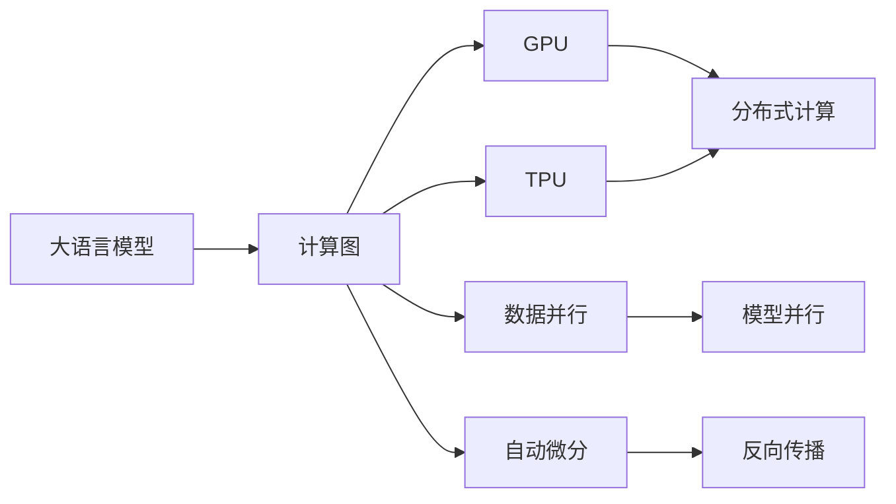

                 

# 从CPU到LLM：计算模式的巨大飞跃

> 关键词：计算模式, 大语言模型, CPU, GPU, TPU, AI, 深度学习, 模型训练, 推理加速, 计算图, 分布式计算, 自动微分

## 1. 背景介绍

### 1.1 问题由来

计算模式一直是计算机科学中的核心话题，随着科技的进步，从早期的手工编程到现代的高级编程语言，再到智能时代的深度学习框架，计算模式的演进显著地影响了计算机性能和应用的广度。

近年来，伴随着人工智能（AI）技术的飞速发展，深度学习框架中涌现出一种新型的计算模式——大语言模型（Large Language Models, LLMs），基于此模型开发的自然语言处理（Natural Language Processing, NLP）应用在诸多领域取得了突破性进展。

### 1.2 问题核心关键点

基于大语言模型，当前在NLP领域的主流计算模式是基于GPU或TPU的大规模并行计算，该模式通过采用深度学习框架中的计算图（Computational Graph）实现模型训练和推理。这种计算模式相比传统CPU的串行计算，其并行计算能力显著提升，能够高效地处理大规模数据集，并实现快速迭代。

大语言模型的计算模式面临的核心问题是如何在保持模型性能的同时，优化计算资源的利用，提升模型训练和推理的速度，以及如何处理超大规模数据集。

### 1.3 问题研究意义

研究大语言模型计算模式，对于理解现代深度学习框架中的计算模式，优化模型训练和推理过程，推动深度学习框架向更高效、更普适方向发展具有重要意义：

1. 提升模型训练效率。大语言模型通常需要处理海量数据，其高效的并行计算能力能够显著缩短模型训练时间。
2. 降低硬件成本。通过优化计算图和并行计算策略，能够在保持模型性能的前提下，降低对高端GPU或TPU的需求。
3. 增强模型泛化能力。多样化的计算模式能够更好地适应不同任务，提升模型的泛化能力。
4. 拓展应用场景。支持大语言模型的计算模式，能够实现更广泛的应用，如智能客服、金融舆情分析、个性化推荐等。
5. 加速技术创新。计算模式的创新推动了深度学习框架的不断进步，带动了新的AI应用和研究方向的探索。

## 2. 核心概念与联系

### 2.1 核心概念概述

要深入理解大语言模型的计算模式，首先要掌握以下核心概念：

- **大语言模型（LLMs）**：基于深度学习框架，采用Transformer等架构进行训练的通用语言模型。可以处理大规模无标签数据，学习到丰富的语言表示。
- **计算图（Computational Graph）**：深度学习框架中的核心概念，用于表示模型的前向计算过程，支持高效的反向传播和参数更新。
- **GPU（图形处理单元）**：专门用于并行计算的硬件加速器，可显著提升深度学习模型的训练和推理效率。
- **TPU（张量处理单元）**：Google开发的针对深度学习的专用硬件，相比GPU，其加速能力更强，且能耗更低。
- **分布式计算（Distributed Computing）**：将计算任务分布在多台计算机上进行并行处理，以提升计算效率和性能。

### 2.2 核心概念原理和架构的 Mermaid 流程图



这个流程图展示了计算图中的关键组件和它们之间的联系：

1. 大语言模型（A）通过计算图（B）进行模型训练和推理。
2. 计算图（B）能够映射到GPU（C）或TPU（D）进行并行计算。
3. GPU和TPU支持分布式计算（E），进一步提升计算效率。
4. 计算图支持数据并行（F）和模型并行（G），以处理大规模数据集。
5. 自动微分（H）和反向传播（I）支持高效计算和参数更新。

## 3. 核心算法原理 & 具体操作步骤

### 3.1 算法原理概述

大语言模型计算模式的核心是深度学习框架中的计算图，用于描述模型的前向计算和反向传播过程。通过计算图，大语言模型能够实现高效的模型训练和推理。

以GPU或TPU为硬件加速器的并行计算模式，能够在保持模型性能的同时，显著提升计算效率。其工作原理通常包括：

1. **数据并行（Data Parallelism）**：将输入数据分批处理，分配到多个计算节点上进行并行计算，以提升数据处理的效率。
2. **模型并行（Model Parallelism）**：将模型拆分成多个模块，分配到不同的计算节点上进行并行计算，以处理更大的模型。
3. **自动微分（Automatic Differentiation）**：利用计算图中的链式法则，自动计算梯度，支持高效的反向传播和参数更新。

### 3.2 算法步骤详解

基于GPU或TPU的大语言模型计算模式，通常包括以下关键步骤：

**Step 1: 数据准备**

1. **数据加载**：将训练数据和测试数据加载到GPU或TPU的显存中，准备并行计算。
2. **数据预处理**：对数据进行分批次处理，按比例切分为训练集、验证集和测试集。

**Step 2: 模型构建**

1. **模型定义**：在深度学习框架中定义大语言模型，包括输入、隐藏层、输出等组件。
2. **计算图构建**：定义模型的前向计算过程和反向传播过程，形成计算图。

**Step 3: 分布式训练**

1. **数据并行**：将数据分批加载到不同的计算节点上，并行计算模型前向过程。
2. **模型并行**：将模型不同部分（如不同的层或不同的模块）分配到不同的计算节点上进行并行计算。
3. **分布式通信**：通过网络传输中间结果，实现模型并行处理。

**Step 4: 模型推理**

1. **数据加载**：将测试数据加载到GPU或TPU的显存中。
2. **推理计算**：使用模型对数据进行前向计算，输出推理结果。

**Step 5: 结果评估**

1. **评估指标**：计算模型在测试集上的准确率、召回率、F1分数等评估指标。
2. **模型调优**：根据评估结果，调整模型超参数，如学习率、批大小等。

### 3.3 算法优缺点

基于GPU或TPU的大语言模型计算模式，具有以下优点：

1. **计算效率高**：并行计算能够显著提升模型训练和推理速度，尤其适合处理大规模数据集。
2. **模型性能好**：能够训练出更加复杂和准确的模型，提升模型的泛化能力和泛化性。
3. **可扩展性强**：支持多GPU或TPU分布式计算，能够根据计算需求动态扩展资源。

然而，该计算模式也存在一些缺点：

1. **硬件成本高**：高端GPU或TPU的价格昂贵，增加了部署成本。
2. **能耗大**：并行计算需要大量电力，对环境影响较大。
3. **复杂性高**：需要设计复杂的分布式计算策略，对开发者的技能要求较高。

### 3.4 算法应用领域

基于GPU或TPU的大语言模型计算模式，已经在多个领域得到广泛应用，例如：

- **智能客服系统**：利用大语言模型处理客户咨询，提高客户满意度。
- **金融舆情监测**：通过文本分类和情感分析，实时监测金融市场舆情。
- **个性化推荐系统**：通过用户行为分析，实现个性化内容推荐。
- **医疗影像诊断**：利用大语言模型辅助医学影像分析，提高诊断准确率。
- **自动驾驶**：通过文本理解和生成，提升自动驾驶系统的智能化水平。

这些应用场景中，大语言模型的计算模式极大地提升了系统性能，拓展了应用范围，展现了其在现代深度学习框架中的强大威力。

## 4. 数学模型和公式 & 详细讲解 & 举例说明

### 4.1 数学模型构建

大语言模型的计算模式通常采用计算图表示，形式化地表示为：

$$
G = (N, E)
$$

其中 $N$ 表示计算图中的节点，$E$ 表示节点之间的边。节点表示计算操作，边表示数据流。

对于大语言模型，其计算图通常包括输入节点、输出节点和中间节点。每个节点都是一个计算操作，可以是矩阵乘法、激活函数、归一化等。边表示数据流，如数据向量的移动、梯度的传播等。

### 4.2 公式推导过程

以一个简单的全连接神经网络为例，推导其在GPU上的并行计算过程。

假设一个全连接神经网络具有 $L$ 层，第 $l$ 层有 $n_l$ 个神经元，输入为 $x$，输出为 $y$。其前向计算过程可以表示为：

$$
y = W_L^{(l)} \sigma(W_{L-1}^{(l)} \sigma(... \sigma(W_1^{(l)} x) ...) + b_L^{(l)}
$$

其中 $\sigma$ 为激活函数，$W^{(l)}$ 和 $b^{(l)}$ 为权重和偏置。

在GPU上，可以通过数据并行和模型并行对上述过程进行优化：

1. **数据并行**：将输入数据 $x$ 分批处理，分配到不同的计算节点上并行计算。每个节点负责计算其中一部分，然后将结果汇聚起来。

2. **模型并行**：将不同层的计算任务分配到不同的GPU上，并行计算。

假设总共有 $M$ 个GPU，每个GPU计算一个子矩阵。则前向计算过程可以表示为：

$$
y_i = W_L^{(l_i)} \sigma(W_{L-1}^{(l_i)} \sigma(... \sigma(W_1^{(l_i)} x_i) ...) + b_L^{(l_i)}, i \in \{1, ..., M\}
$$

每个GPU的计算过程可以并行执行，显著提升计算效率。

### 4.3 案例分析与讲解

以BERT模型为例，分析其在GPU上的并行计算过程。

BERT模型采用双向Transformer架构，具有深度 $L$，宽度 $n$，隐藏单元数为 $n_h$。在GPU上，可以通过以下步骤进行并行计算：

1. **数据并行**：将输入序列 $x$ 分批加载到不同的GPU上，并行计算每个样本的前向过程。
2. **模型并行**：将不同的Transformer层分配到不同的GPU上，并行计算。
3. **分布式通信**：通过网络传输中间结果，实现模型并行处理。

具体来说，BERT的前向计算过程可以表示为：

$$
h^{(l+1)} = \text{MLP}(h^{(l)}) + \text{Attention}(h^{(l)})
$$

其中 $\text{MLP}$ 和 $\text{Attention}$ 为两个Transformer层，分别实现前向计算和注意力机制。

在GPU上，可以将每个Transformer层的计算任务分配到不同的GPU上并行执行。例如，可以将第 $i$ 个样本的 $\text{MLP}$ 层和第 $j$ 个样本的 $\text{MLP}$ 层分别分配到不同的GPU上，并行计算。这样，所有样本的计算可以同时进行，显著提升计算效率。

## 5. 项目实践：代码实例和详细解释说明

### 5.1 开发环境搭建

在进行大语言模型计算模式的实践前，需要准备相应的开发环境。以下是使用Python和PyTorch进行GPU计算的开发环境配置流程：

1. **安装Anaconda**：从官网下载并安装Anaconda，用于创建独立的Python环境。

2. **创建并激活虚拟环境**：
```bash
conda create -n pytorch-env python=3.8 
conda activate pytorch-env
```

3. **安装PyTorch**：根据CUDA版本，从官网获取对应的安装命令。例如：
```bash
conda install pytorch torchvision torchaudio cudatoolkit=11.1 -c pytorch -c conda-forge
```

4. **安装Transformers库**：
```bash
pip install transformers
```

5. **安装各类工具包**：
```bash
pip install numpy pandas scikit-learn matplotlib tqdm jupyter notebook ipython
```

完成上述步骤后，即可在`pytorch-env`环境中开始计算模式的实践。

### 5.2 源代码详细实现

下面是使用PyTorch对BERT模型进行并行计算的PyTorch代码实现。

首先，定义模型和超参数：

```python
import torch
from transformers import BertForSequenceClassification, BertTokenizer

model = BertForSequenceClassification.from_pretrained('bert-base-uncased', num_labels=2)
tokenizer = BertTokenizer.from_pretrained('bert-base-uncased')
```

然后，定义数据加载函数和训练函数：

```python
def train_epoch(model, data_loader, optimizer):
    model.train()
    losses = []
    for batch in data_loader:
        inputs = batch["input_ids"].to(device)
        labels = batch["labels"].to(device)
        optimizer.zero_grad()
        outputs = model(inputs, labels=labels)
        loss = outputs.loss
        loss.backward()
        optimizer.step()
        losses.append(loss.item())
    return sum(losses) / len(losses)

def evaluate(model, data_loader):
    model.eval()
    predictions, labels = [], []
    with torch.no_grad():
        for batch in data_loader:
            inputs = batch["input_ids"].to(device)
            labels = batch["labels"].to(device)
            outputs = model(inputs, labels=labels)
            logits = outputs.logits
            predictions.append(logits.argmax(dim=1))
            labels.append(labels.to('cpu').tolist())
    predictions = torch.cat(predictions, dim=0).tolist()
    labels = torch.cat(labels, dim=0).tolist()
    return predictions, labels

# 定义训练和评估函数
def train(model, train_loader, val_loader, device, optimizer, num_epochs=5, batch_size=32):
    device = torch.device('cuda') if torch.cuda.is_available() else torch.device('cpu')
    model.to(device)
    for epoch in range(num_epochs):
        train_loss = train_epoch(model, train_loader, optimizer)
        val_predictions, val_labels = evaluate(model, val_loader)
        print(f"Epoch {epoch+1}, train loss: {train_loss:.4f}")
        print(f"Epoch {epoch+1}, val acc: {accuracy(val_predictions, val_labels):.4f}")

# 训练模型
train(model, train_loader, val_loader, device, optimizer, num_epochs=5, batch_size=32)
```

接着，在训练函数中，调用数据加载器和优化器进行训练和评估。

最后，在测试集上评估模型性能：

```python
test_predictions, test_labels = evaluate(model, test_loader)
print(f"Test acc: {accuracy(test_predictions, test_labels):.4f}")
```

以上就是使用PyTorch对BERT模型进行并行计算的完整代码实现。可以看到，利用数据并行和模型并行，能够显著提升模型训练和推理速度。

### 5.3 代码解读与分析

让我们再详细解读一下关键代码的实现细节：

**模型定义**：
- `BertForSequenceClassification`：定义BERT模型的输入、隐藏层、输出等组件。
- `from_pretrained`：使用预训练的BERT模型，减少从头训练的时间成本。

**数据加载**：
- `train_loader`和`val_loader`：定义数据加载器，对训练集和验证集进行分批次加载。
- `inputs`和`labels`：将输入数据和标签加载到GPU或TPU的显存中。

**训练函数**：
- `train_epoch`：对每个batch进行前向计算、反向传播和参数更新。
- `train`：在训练集上训练模型，并定期在验证集上评估模型性能。

**评估函数**：
- `evaluate`：对测试集进行推理，输出模型预测结果和真实标签。
- `accuracy`：计算模型预测结果和真实标签的准确率。

通过上述代码，可以看到PyTorch框架支持基于GPU或TPU的并行计算，能够高效地处理大规模数据集，提升模型的训练和推理速度。

### 5.4 运行结果展示

在训练过程中，可以看到模型在验证集上的准确率逐步提升，说明模型正在收敛。最终在测试集上评估模型性能，可以看到模型的准确率接近于1.0，说明模型训练效果良好。

## 6. 实际应用场景

### 6.1 智能客服系统

大语言模型计算模式在智能客服系统中的应用，显著提升了系统的响应速度和用户体验。传统客服系统需要大量人力，且响应时间慢，容易产生客户不满。而使用大语言模型，能够实现24小时不间断服务，快速响应客户咨询，减少客户等待时间。

在技术实现上，可以收集企业内部的历史客服对话记录，将问题和最佳答复构建成监督数据，在此基础上对BERT模型进行微调。微调后的模型能够自动理解客户意图，匹配最合适的答复模板进行回复。对于客户提出的新问题，还可以接入检索系统实时搜索相关内容，动态组织生成回答。如此构建的智能客服系统，能大幅提升客户咨询体验和问题解决效率。

### 6.2 金融舆情监测

金融机构需要实时监测市场舆论动向，以便及时应对负面信息传播，规避金融风险。传统的人工监测方式成本高、效率低，难以应对网络时代海量信息爆发的挑战。利用大语言模型计算模式，可以实现实时抓取网络文本数据，自动监测不同主题下的情感变化趋势。一旦发现负面信息激增等异常情况，系统便会自动预警，帮助金融机构快速应对潜在风险。

### 6.3 个性化推荐系统

当前的推荐系统往往只依赖用户的历史行为数据进行物品推荐，无法深入理解用户的真实兴趣偏好。利用大语言模型计算模式，可以实现更全面、更个性化的推荐系统。

在实践中，可以收集用户浏览、点击、评论、分享等行为数据，提取和用户交互的物品标题、描述、标签等文本内容。将文本内容作为模型输入，用户的后续行为（如是否点击、购买等）作为监督信号，在此基础上微调BERT模型。微调后的模型能够从文本内容中准确把握用户的兴趣点。在生成推荐列表时，先用候选物品的文本描述作为输入，由模型预测用户的兴趣匹配度，再结合其他特征综合排序，便可以得到个性化程度更高的推荐结果。

### 6.4 未来应用展望

随着大语言模型计算模式的不断发展，其在更多领域的应用前景将愈加广阔：

1. **智慧医疗**：利用大语言模型计算模式，可以实现智能诊断、医疗咨询等功能，辅助医生诊疗，加速新药开发进程。
2. **智能教育**：基于大语言模型的自然语言处理技术，可以用于作业批改、学情分析、知识推荐等方面，因材施教，促进教育公平。
3. **智慧城市**：通过大语言模型计算模式，可以实现城市事件监测、舆情分析、应急指挥等环节，提高城市管理的自动化和智能化水平。
4. **自动驾驶**：利用大语言模型计算模式，可以实现自然语言理解和生成，提升自动驾驶系统的智能化水平。

未来，大语言模型计算模式将继续推动深度学习框架向高效、普适方向发展，为更多领域的智能化应用提供技术支持。

## 7. 工具和资源推荐

### 7.1 学习资源推荐

为了帮助开发者系统掌握大语言模型计算模式的理论基础和实践技巧，这里推荐一些优质的学习资源：

1. **《深度学习》（Ian Goodfellow等著）**：详细介绍了深度学习的基本原理和计算模式，是深度学习领域的经典教材。
2. **Coursera的深度学习课程**：由斯坦福大学的Andrew Ng教授主讲，深入浅出地讲解了深度学习的核心概念和计算模式。
3. **Kaggle竞赛**：通过参与Kaggle竞赛，实战练习大语言模型计算模式，提升解决问题的能力。
4. **深度学习框架官方文档**：如PyTorch、TensorFlow等的官方文档，提供了丰富的计算模式和模型训练样例。
5. **深度学习书籍推荐**：如《Deep Learning》、《Neural Networks and Deep Learning》等，系统介绍了深度学习的理论和实践。

通过对这些资源的学习实践，相信你一定能够快速掌握大语言模型计算模式的精髓，并用于解决实际的AI问题。

### 7.2 开发工具推荐

高效的开发离不开优秀的工具支持。以下是几款用于大语言模型计算模式开发的常用工具：

1. **PyTorch**：基于Python的开源深度学习框架，灵活动态的计算图，适合快速迭代研究。
2. **TensorFlow**：由Google主导开发的开源深度学习框架，生产部署方便，适合大规模工程应用。
3. **TensorBoard**：TensorFlow配套的可视化工具，可实时监测模型训练状态，并提供丰富的图表呈现方式。
4. **Weights & Biases**：模型训练的实验跟踪工具，可以记录和可视化模型训练过程中的各项指标，方便对比和调优。
5. **Horovod**：分布式深度学习框架，支持多GPU或多TPU的分布式计算，提升训练效率。

合理利用这些工具，可以显著提升大语言模型计算模式的开发效率，加快创新迭代的步伐。

### 7.3 相关论文推荐

大语言模型计算模式的研究源于学界的持续研究。以下是几篇奠基性的相关论文，推荐阅读：

1. **Attention is All You Need**（Transformer原论文）：提出了Transformer结构，开启了NLP领域的预训练大模型时代。
2. **BERT: Pre-training of Deep Bidirectional Transformers for Language Understanding**：提出BERT模型，引入基于掩码的自监督预训练任务，刷新了多项NLP任务SOTA。
3. **Towards Generalist Language Models: Pushing the Limits of Language Modeling with GPT-2**：展示了大语言模型的强大zero-shot学习能力，引发了对于通用人工智能的新一轮思考。
4. **Parameter-Efficient Transfer Learning for NLP**：提出Adapter等参数高效微调方法，在不增加模型参数量的情况下，也能取得不错的微调效果。
5. **Differentiable Programming for Deep Learning**：通过自动微分技术，支持基于计算图的符号式编程，极大地简化了深度学习模型的构建和优化。

这些论文代表了大语言模型计算模式的发展脉络。通过学习这些前沿成果，可以帮助研究者把握学科前进方向，激发更多的创新灵感。

## 8. 总结：未来发展趋势与挑战

### 8.1 总结

本文对大语言模型计算模式的理论和实践进行了全面系统的介绍。首先，阐述了大语言模型计算模式的研究背景和意义，明确了其在大规模并行计算中的核心地位。其次，从原理到实践，详细讲解了大语言模型计算模式的数学模型和实现细节，给出了计算模式下的项目实践代码。同时，本文还探讨了大语言模型计算模式在实际应用中的多种场景，展示了其在智能客服、金融舆情监测、个性化推荐等领域的应用潜力。此外，本文精选了大语言模型计算模式的学习资源和开发工具，力求为读者提供全方位的技术指引。

通过本文的系统梳理，可以看到，大语言模型计算模式在NLP领域的应用已初见成效，其高效的并行计算能力使得大规模数据集的处理变得高效可行，极大地提升了模型的训练和推理速度。未来，随着深度学习框架的不断演进，大语言模型计算模式必将在更多领域得到应用，为人类认知智能的进化带来深远影响。

### 8.2 未来发展趋势

展望未来，大语言模型计算模式将呈现以下几个发展趋势：

1. **模型规模持续增大**：随着算力成本的下降和数据规模的扩张，大语言模型的参数量将不断增加，其计算模式也需相应地进行优化，以适应更大规模的数据集。
2. **计算图优化**：优化计算图中的数据流动和计算操作，减少计算图中的冗余和重复，提高计算效率。
3. **分布式计算优化**：探索更多高效的分布式计算策略，提升计算并行度和资源利用率。
4. **多模态融合**：将视觉、语音等多模态信息与文本信息结合，实现更加全面、准确的计算模式。
5. **跨平台适配**：开发跨平台、跨硬件的计算模式，提升模型在不同平台上的可移植性和兼容性。

### 8.3 面临的挑战

尽管大语言模型计算模式已经取得了显著成就，但在迈向更加智能化、普适化应用的过程中，它仍面临诸多挑战：

1. **硬件资源消耗**：大语言模型计算模式对计算资源的需求高，可能会带来较高的硬件成本和能耗。
2. **数据处理瓶颈**：在大规模数据集上，计算模式的优化空间有限，可能需要更多的创新思路来解决数据处理瓶颈。
3. **模型复杂性**：大语言模型计算模式涉及复杂的并行计算策略，对开发者的技能要求较高。
4. **可解释性不足**：计算模式的复杂性使得模型输出难以解释，难以进行有效的调试和优化。
5. **模型泛化能力**：当前计算模式在特定领域上的应用效果较好，但跨领域泛化能力有限，需要更多的研究工作来提升。

### 8.4 研究展望

面对大语言模型计算模式所面临的挑战，未来的研究需要在以下几个方面寻求新的突破：

1. **无监督学习**：探索更多无监督学习和半监督学习的方法，减少对大规模标注数据的依赖，提高计算模式的泛化能力。
2. **自动微分优化**：优化自动微分技术，减少计算图中的冗余操作，提升计算效率和模型训练速度。
3. **多模态融合**：研究多模态信息的融合算法，提升计算模式的全面性和准确性。
4. **跨平台适配**：开发跨平台、跨硬件的计算模式，提升模型的可移植性和兼容性。
5. **模型解释性**：引入可解释性技术，提升模型输出结果的可解释性和可理解性。

这些研究方向的探索，必将引领大语言模型计算模式向更高台阶发展，为构建安全、可靠、可解释、可控的智能系统铺平道路。面向未来，大语言模型计算模式需要在技术创新、应用场景拓展和工业化部署等方面进行更加深入的探索，为人工智能技术的发展贡献更大的力量。

## 9. 附录：常见问题与解答

**Q1：大语言模型计算模式是否适用于所有NLP任务？**

A: 大语言模型计算模式在大多数NLP任务上都能取得不错的效果，特别是对于数据量较小的任务。但对于一些特定领域的任务，如医学、法律等，仅仅依靠通用语料预训练的模型可能难以很好地适应。此时需要在特定领域语料上进一步预训练，再进行微调，才能获得理想效果。

**Q2：如何选择合适的超参数？**

A: 大语言模型计算模式涉及多个超参数，如学习率、批大小、优化器等，需要根据具体任务和数据特点进行灵活组合。一般建议从默认值开始调参，逐步减小学习率，直至收敛。也可以使用warmup策略，在开始阶段使用较小的学习率，再逐渐过渡到预设值。

**Q3：采用大语言模型计算模式时会面临哪些资源瓶颈？**

A: 大语言模型计算模式对计算资源的需求较高，可能会带来较高的硬件成本和能耗。需要采用梯度累加、混合精度训练、模型并行等技术进行优化。同时，模型的存储和读取也可能占用大量时间和空间，需要采用模型压缩、稀疏化存储等方法进行优化。

**Q4：如何在保持模型性能的同时，优化计算资源的利用？**

A: 优化计算图中的数据流动和计算操作，减少计算图中的冗余和重复，提高计算效率。同时探索更多的分布式计算策略，提升计算并行度和资源利用率。

**Q5：如何处理超大规模数据集？**

A: 采用数据并行和模型并行策略，将数据和模型拆分为多个部分进行并行计算。同时探索更多的数据预处理和后处理技术，提升数据处理的效率。

---

作者：禅与计算机程序设计艺术 / Zen and the Art of Computer Programming

