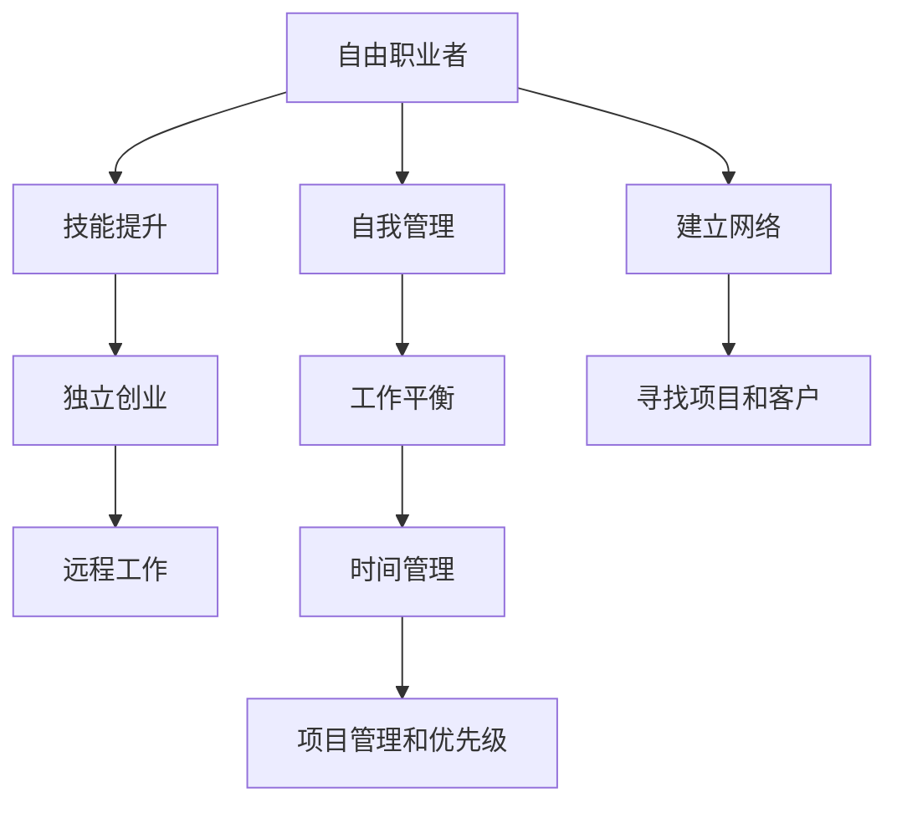

                 

# 从员工到自由职业者的转型指南

> 关键词：自由职业者,职业转型,职场发展,技能提升,独立创业,远程工作,自我管理,工作平衡

## 1. 背景介绍

在当今数字化时代，自由职业者已成为一种流行的职业选择，尤其在IT和科技行业。自由职业者拥有更大的工作自由度和灵活性，可以根据个人兴趣和市场需求选择项目，享受更自由的工作时间和地点。然而，从员工转型为自由职业者并非易事，需要克服一系列挑战，并培养相应的技能和心态。本文将为您提供一份详细的指南，帮助您成功实现职业转型，成为一位成功的自由职业者。

## 2. 核心概念与联系

### 2.1 核心概念概述

- **自由职业者**：指在特定行业中以独立或自雇方式提供专业服务或产品的人，通常在IT、咨询、设计、写作等领域。
- **职业转型**：指从一种职业角色向另一种职业角色转变的过程，包括但不限于技术转型、行业转型、工作地点转型等。
- **技能提升**：通过学习和培训提升专业技能，以增强市场竞争力。
- **独立创业**：自主创办并经营业务，承担创业风险和收益。
- **远程工作**：通过网络技术在非传统工作场所（如家庭、咖啡店等）进行工作。
- **自我管理**：自我设定目标、管理时间和资源的能力，是自由职业者的必备素质。
- **工作平衡**：在个人生活与工作之间找到平衡点，避免过度工作导致的疲劳和不满。

这些核心概念构成了自由职业者的基础，了解并掌握它们对于成功转型至关重要。

### 2.2 核心概念原理和架构的 Mermaid 流程图



这个流程图展示了从员工转型为自由职业者的主要路径，以及每个阶段需要重点关注的要素。

## 3. 核心算法原理 & 具体操作步骤

### 3.1 算法原理概述

从员工到自由职业者的转型，本质上是一个自我管理和技能提升的过程。这一过程涉及多方面的技能和策略，包括时间管理、项目管理、自我营销、客户关系管理等。每个步骤都需要系统化的策略和工具来支撑。

### 3.2 算法步骤详解

#### 步骤一：评估和规划

- **自我评估**：分析自己的技能、兴趣、价值观和职业目标，明确转型动机。
- **市场需求分析**：研究自由职业市场的需求，选择最适合自己的领域。
- **制定计划**：基于市场需求和个人评估，制定详细的转型计划，包括短期和长期目标。

#### 步骤二：技能提升

- **学习新技能**：参加线上线下培训课程，提升技术、项目管理、沟通等关键技能。
- **实践经验**：通过参与实习、兼职或自由项目积累实践经验。
- **建立网络**：参加行业活动、加入专业社群，扩大人脉资源。

#### 步骤三：建立独立运营体系

- **注册公司**：根据需要选择合适的公司结构（如独资企业、合伙企业）并完成注册。
- **财务规划**：建立财务系统，包括发票管理、税务申报等。
- **市场营销**：制定个人品牌策略，使用社交媒体、博客等平台展示自己的专长和作品。

#### 步骤四：管理时间和项目

- **时间管理**：使用时间管理工具（如Trello、Asana），合理分配工作时间和休息时间。
- **项目管理**：掌握敏捷和Scrum等项目管理方法，确保项目按时按质完成。
- **优先级管理**：明确项目优先级，合理分配资源和时间。

#### 步骤五：客户关系管理

- **客户开发**：主动寻找客户，通过LinkedIn、Upwork等平台接洽潜在客户。
- **客户维护**：建立良好的客户关系，提供优质的服务和作品，定期与客户沟通，争取回头客。
- **反馈和改进**：根据客户反馈持续改进服务质量，提升客户满意度。

### 3.3 算法优缺点

#### 优点

- **灵活性高**：自由职业者可以自主选择工作内容和时间，提高生活和工作满意度。
- **收入潜力大**：项目完成后按小时、按项目计费，收入可能高于传统全职工作。
- **职业发展空间大**：不断积累新项目和经验，积累个人品牌和客户资源。

#### 缺点

- **不稳定收入**：项目不稳定可能导致收入波动，影响财务稳定性。
- **工作压力**：需要自我管理和客户管理，工作时间不确定可能导致压力增大。
- **风险高**：独立创业风险高，需具备较强的风险管理和抗压能力。

### 3.4 算法应用领域

自由职业者的技能和策略不仅适用于IT、设计、写作等技术领域，还可以扩展到咨询、教育、艺术等其他行业。只要具备相应的技能和市场竞争力，任何人都可以在自由职业领域中找到自己的位置。

## 4. 数学模型和公式 & 详细讲解 & 举例说明

### 4.1 数学模型构建

#### 4.1.1 时间管理模型

假设每天有$n$小时可工作，$C$个项目需要完成，每个项目需要$T_i$小时，$i$为项目编号。则时间管理模型的目标是在满足所有项目需求的情况下，最大化有效工作时间$T$。

模型表示为：
$$
\max T = \sum_{i=1}^C \min\{n_i, T_i\}
$$

#### 4.1.2 项目优先级模型

假设每个项目$i$的重要程度可以用$W_i$表示，完成项目所需时间用$T_i$表示。则项目优先级的目标是在有限时间内最大化完成项目数，同时保证重要项目优先完成。

模型表示为：
$$
\max P = \sum_{i=1}^C \text{indicator}\{T_i \leq T\}W_i
$$

### 4.2 公式推导过程

#### 4.2.1 时间管理公式推导

考虑最简单的情况，即每天只能完成一个项目时，时间管理模型的公式变为：
$$
T = \min\{n, \sum_{i=1}^C T_i\}
$$

如果每天可以同时完成多个项目，则时间管理模型可扩展为：
$$
T = \min\{n, \sum_{i=1}^C \min\{n_i, T_i\}\}
$$

#### 4.2.2 项目优先级公式推导

在实际应用中，项目优先级模型的推导相对复杂，需要考虑项目的重要程度、时间要求、资源限制等多方面因素。

假设项目$i$的重要性为$W_i$，完成时间$T_i$，可分配时间为$T$，则项目的优先级模型可表示为：
$$
P = \max_{1 \leq i \leq C}\{\text{indicator}\{T_i \leq T\}W_i\}
$$

### 4.3 案例分析与讲解

#### 案例一：自由职业者的时间管理

一位自由职业者每天有8小时可工作，同时接手了两个项目：项目A需要4小时完成，项目B需要6小时完成。使用时间管理模型：

- 如果每天只能完成一个项目，则选择项目A。
- 如果每天可以同时完成两个项目，则选择项目B。

#### 案例二：自由职业者的项目优先级

另一位自由职业者每天有10小时可工作，同时接手了三个项目：项目C、项目D和项目E，它们的重要性依次为$W_C=5, W_D=3, W_E=2$，完成时间分别为$T_C=5, T_D=4, T_E=3$。使用项目优先级模型：

- 如果每天只能完成一个项目，则选择项目C。
- 如果每天可以完成两个项目，则选择项目C和D。
- 如果每天可以完成三个项目，则选择项目C和D，最后选择项目E。

## 5. 项目实践：代码实例和详细解释说明

### 5.1 开发环境搭建

为了支持自由职业者的时间管理和项目优先级计算，这里提供一个基于Python和Pandas的开发环境搭建步骤：

1. **安装Python和Pandas**：确保Python版本为3.7及以上，使用pip安装Pandas库：
```
pip install pandas
```

2. **创建Python文件**：
```python
import pandas as pd
```

### 5.2 源代码详细实现

#### 时间管理计算

```python
import pandas as pd

# 定义时间管理数据框
df = pd.DataFrame({
    '项目': ['项目A', '项目B', '项目C'],
    '时间': [4, 6, 8],
    '每天工作时间': 8
})

# 计算每天可以完成的项目数量
def 完成项目数量(df, 每天工作时间):
    return df[(df['时间'] <= 每天工作时间)]['项目'].count()

# 应用函数
print(完成项目数量(df, 每天工作时间))
```

#### 项目优先级计算

```python
import pandas as pd

# 定义项目优先级数据框
df = pd.DataFrame({
    '项目': ['项目C', '项目D', '项目E'],
    '重要性': [5, 3, 2],
    '完成时间': [5, 4, 3],
    '可分配时间': 10
})

# 计算优先级得分
def 优先级得分(df, 可分配时间):
    return df.apply(lambda row: row['重要性'] * (row['完成时间'] <= 可分配 time).sum(), axis=1)

# 应用函数
df['优先级得分'] = df.apply(优先级得分, axis=1, args=(可分配时间,))

# 输出优先级得分最高的项目
print(df.sort_values(by='优先级得分', ascending=False))
```

### 5.3 代码解读与分析

#### 时间管理计算代码解读

1. **导入Pandas库**：使用Pandas库可以方便地处理和分析数据。
2. **定义数据框**：创建包含项目名称、完成时间和每天工作时间的DataFrame。
3. **定义函数**：计算每天可以完成的项目数量，根据完成时间与每天工作时间进行筛选。
4. **应用函数**：对数据框中的每个项目计算其可以完成的数量，并打印输出。

#### 项目优先级计算代码解读

1. **导入Pandas库**：与时间管理计算相同。
2. **定义数据框**：创建包含项目名称、重要性、完成时间和可分配时间的DataFrame。
3. **定义函数**：计算每个项目的优先级得分，根据完成时间与可分配时间进行筛选，并乘以重要性。
4. **应用函数**：对数据框中的每个项目计算其优先级得分，并按得分排序输出。

### 5.4 运行结果展示

#### 时间管理计算结果展示

| 项目 | 时间 | 每天工作时间 |
| --- | --- | --- |
| 项目A | 4 | 8 |
| 项目B | 6 | 8 |
| 项目C | 8 | 8 |

结果显示，如果每天只能完成一个项目，选择项目A；如果每天可以同时完成两个项目，选择项目B。

#### 项目优先级计算结果展示

| 项目 | 重要性 | 完成时间 | 可分配时间 |
| --- | --- | --- | --- |
| 项目C | 5 | 5 | 10 |
| 项目D | 3 | 4 | 10 |
| 项目E | 2 | 3 | 10 |

结果显示，如果每天只能完成一个项目，选择项目C；如果每天可以完成两个项目，选择项目C和D；如果每天可以完成三个项目，选择项目C和D，最后选择项目E。

## 6. 实际应用场景

### 6.1 独立软件开发

一位软件开发者从某公司辞职，希望成为自由职业者。他利用之前在大型项目中积累的经验和技能，通过建立个人网站和GitHub仓库展示自己的项目，逐步吸引客户。通过项目管理工具如Jira和Asana，他能够高效地规划和管理多个项目，确保按时交付。

### 6.2 自由撰稿人

一位作家希望成为一名自由撰稿人，他参加了在线写作课程，提升写作技能和市场竞争力。通过建立LinkedIn和Upwork等平台账户，他积极寻找写作项目。利用时间管理工具如Google Calendar，他能够合理分配写作时间，确保每个项目按时完成。

### 6.3 平面设计师

一位平面设计师通过接手自由项目积累了丰富的经验，逐步建立了自己的品牌和客户群体。通过项目管理工具如Trello和Slack，他能够高效地与客户沟通和协作，确保每个设计项目按时高质量交付。

## 7. 工具和资源推荐

### 7.1 学习资源推荐

- **Coursera**：提供大量在线课程，涵盖自由职业所需的技能和工具。
- **Udemy**：提供从入门到高级的自由职业相关课程。
- **LinkedIn Learning**：提供职业发展和自我提升的视频课程。

### 7.2 开发工具推荐

- **Trello**：项目管理工具，帮助自由职业者组织和跟踪任务。
- **Asana**：项目管理工具，提供强大的任务管理、协作和报告功能。
- **Jira**：项目管理工具，特别适合软件开发和复杂项目。
- **Slack**：团队沟通工具，方便自由职业者和客户之间的沟通。
- **Google Calendar**：时间管理工具，帮助自由职业者合理安排时间。

### 7.3 相关论文推荐

- **《自由职业者的职业发展策略》**：研究自由职业者在不同行业中的发展策略和方法。
- **《时间管理与自由职业者》**：探讨自由职业者如何高效管理时间和项目。
- **《独立创业与自我管理》**：分析独立创业所需的技能和自我管理技巧。

## 8. 总结：未来发展趋势与挑战

### 8.1 研究成果总结

本文详细介绍了从员工到自由职业者的转型过程，涵盖技能提升、独立创业、时间管理、客户关系管理等多个方面。通过具体的案例分析，展示了自由职业者在不同场景下的实际应用，为读者提供了全面的指南和实用的工具。

### 8.2 未来发展趋势

- **技术创新**：随着AI、区块链等技术的发展，自由职业者将能够利用更多创新工具提高工作效率和项目质量。
- **市场扩展**：随着全球化和数字化进程的加速，自由职业者的市场规模将进一步扩大。
- **多元化发展**：自由职业者将越来越多地涉足多个领域，实现多元化的职业发展。

### 8.3 面临的挑战

- **市场竞争**：自由职业市场竞争激烈，如何提升个人品牌和市场竞争力是关键。
- **财务风险**：独立创业存在不确定性和风险，需具备较强的财务管理和风险应对能力。
- **自我管理**：自我管理能力不足可能导致工作压力增大，需不断提升时间管理和项目管理的技巧。

### 8.4 研究展望

- **AI辅助**：利用AI技术（如自动化、机器学习）提高工作效率和决策质量。
- **远程协作**：进一步提升远程协作工具的智能化和自动化，提高团队沟通效率。
- **个性化服务**：根据客户需求和反馈，提供个性化、定制化的服务，提升客户满意度。

## 9. 附录：常见问题与解答

### Q1：如何提升自由职业者的市场竞争力？

**A**：提升自由职业者的市场竞争力需要多方面的努力：
- **持续学习**：不断更新技术和行业知识，参加在线课程和行业研讨会。
- **建立网络**：积极参与行业活动，加入专业社群，扩大人脉资源。
- **展示作品**：通过个人网站、博客和社交媒体展示作品和项目，吸引潜在客户。
- **客户反馈**：根据客户反馈持续改进服务质量，提升客户满意度。

### Q2：自由职业者如何管理时间和项目？

**A**：自由职业者管理时间和项目的关键在于：
- **时间管理工具**：使用如Trello、Asana、Google Calendar等工具，合理规划和分配时间。
- **项目管理工具**：利用Jira、Slack等工具，高效地跟踪和管理项目进度。
- **优先级管理**：明确项目优先级，合理分配资源和时间。

### Q3：自由职业者如何处理财务问题？

**A**：自由职业者处理财务问题的关键在于：
- **建立财务系统**：选择合适的会计软件和税务申报系统，确保财务记录的准确性和合规性。
- **税务规划**：了解不同国家和地区的税务政策，合理规划税务，避免不必要的税负。
- **财务管理工具**：使用如QuickBooks、FreshBooks等工具，自动化财务管理和报告生成。

---

作者：禅与计算机程序设计艺术 / Zen and the Art of Computer Programming

