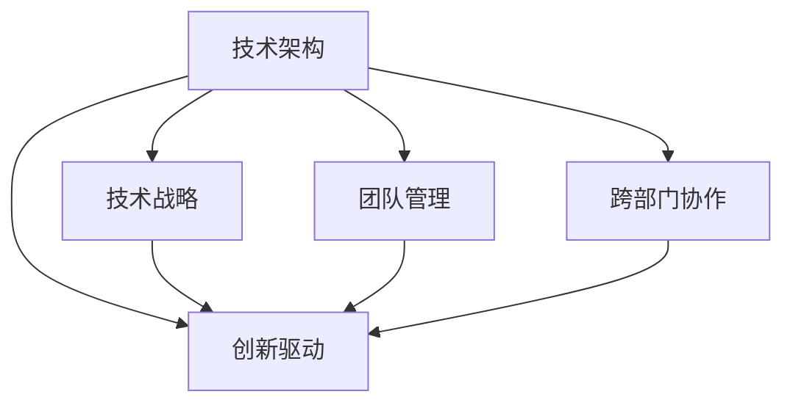
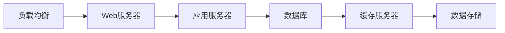
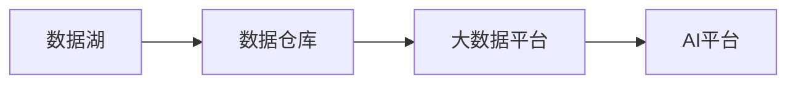
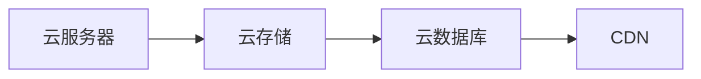
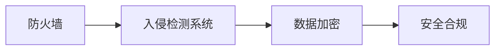

                 

## 1. 背景介绍

### 1.1 问题由来

随着科技的快速发展，人工智能、云计算、大数据等新兴技术逐渐成为各行各业的核心竞争力。越来越多的技术主管、资深程序员、软件架构师渴望突破自我，晋升为CTO（首席技术官），负责公司的技术架构和创新。CTO不仅是技术创新的推动者，更是公司战略方向的制定者，对于公司的发展至关重要。

### 1.2 问题核心关键点

成为CTO是一个复杂且系统的过程，涉及技术能力、管理能力、战略思考等多个方面的全面提升。其关键点在于：

- **技术深度**：在某一技术领域有深入研究和实践，成为行业专家。
- **团队领导**：具有高效的团队管理和人才培训能力，培养优秀工程师和研发团队。
- **战略视角**：具备全局视角和战略思维，能够为企业制定长期技术发展路线。
- **沟通协作**：能够与不同部门和利益相关者进行有效沟通，推动跨部门协作。
- **创新能力**：不断探索新技术，驱动企业技术创新。

### 1.3 问题研究意义

掌握从技术主管到CTO的职业发展策略，不仅对于个人的职业发展具有指导意义，也对企业的技术创新和业务发展有着深远的影响。CTO不仅能推动企业保持技术领先地位，还能通过技术驱动业务创新，提升企业竞争力。

## 2. 核心概念与联系

### 2.1 核心概念概述

CTO的职责不仅限于技术实现，更涉及企业战略、技术架构、团队管理等多个方面。其核心概念包括：

- **技术架构**：企业整体的IT架构设计，包括系统架构、网络架构、数据架构等。
- **技术战略**：基于当前技术趋势和未来发展方向，制定技术规划和战略。
- **团队管理**：带领技术团队，确保团队高效运作和人才持续成长。
- **跨部门协作**：与业务、市场、运营等部门紧密协作，推动技术业务一体化。
- **创新驱动**：持续推动技术创新，推动企业持续进步。

这些概念之间相互联系，共同构成了CTO的角色和职责。以下是一个简单的Mermaid流程图，展示了CTO的核心概念和联系：



通过这个流程图，我们可以看到，技术架构是CTO的基础，技术战略、团队管理和跨部门协作都是在技术架构的基础上展开的，而创新驱动是CTO工作的最终目标。

## 3. 核心算法原理 & 具体操作步骤

### 3.1 算法原理概述

CTO的角色涉及到多个层面的算法和实践，以下是几个关键原理：

1. **系统架构设计**：使用分层架构、微服务架构、容器化等技术，确保系统的可扩展性和灵活性。
2. **数据管理策略**：采用数据湖、数据仓库、大数据平台等技术，进行数据的高效管理和分析。
3. **持续集成与持续交付(CI/CD)**：通过自动化测试、持续集成、持续交付等手段，提高软件的发布频率和质量。
4. **云服务战略**：选择合适的云服务提供商，利用云计算资源进行弹性扩展和成本优化。
5. **安全与合规**：实施安全策略、合规标准，确保企业数据和系统的安全。

### 3.2 算法步骤详解

以下是成为CTO的关键步骤：

1. **技术深度积累**：选择一个技术方向，深入学习其核心技术、架构和应用，成为行业专家。
2. **项目管理经验**：参与或主导重大项目的开发和管理，提升项目管理和领导能力。
3. **跨部门协作**：与业务、市场、运营等部门建立良好的沟通机制，推动技术业务一体化。
4. **团队管理能力**：培养和指导技术团队成员，建立高效的团队运作机制。
5. **战略视角**：研究行业趋势，制定公司技术战略，推动企业技术创新。

### 3.3 算法优缺点

CTO的核心算法具有以下优点：

- **技术权威性**：CTO对技术架构和实施有深入理解和权威判断，能够指导团队和业务部门。
- **战略推动**：CTO具备全局视角，能够制定和推动公司技术战略，确保企业技术领先。
- **团队赋能**：CTO重视人才培养，能够带领团队持续提升技术能力和创新能力。

同时，CTO的算法也存在一些缺点：

- **时间管理压力**：CTO需要兼顾战略规划、技术实施、团队管理等多个方面，工作压力较大。
- **创新风险**：新技术的引入和实施需要大量资源和风险，CTO需要承担决策责任。
- **协调复杂**：CTO需要协调不同部门和利益相关者，复杂的人际关系管理难度大。

### 3.4 算法应用领域

CTO的算法应用广泛，包括但不限于以下领域：

- **企业IT架构设计**：负责整体IT架构规划，确保系统的高可用性和可扩展性。
- **大数据与人工智能**：推动大数据平台和AI技术的应用，提升企业数据价值。
- **云计算战略**：制定和实施云计算战略，利用云资源优化企业IT成本。
- **网络安全与合规**：制定和实施网络安全策略，确保数据和系统的合规性。
- **创新驱动**：推动技术创新，不断引入新技术和新方法，提升企业竞争力。

## 4. 数学模型和公式 & 详细讲解 & 举例说明（备注：数学公式请使用latex格式，latex嵌入文中独立段落使用 $$，段落内使用 $)

### 4.1 数学模型构建

CTO的工作涉及大量决策和优化问题，可以构建数学模型进行量化分析。例如，在资源分配问题中，可以构建以下线性规划模型：

$$
\begin{aligned}
& \text{minimize} \quad c^T x \\
& \text{subject to} \quad A x = b \\
& \quad x \geq 0
\end{aligned}
$$

其中 $c$ 是成本向量，$A$ 是资源限制矩阵，$b$ 是资源限制常量，$x$ 是变量向量。

### 4.2 公式推导过程

以云计算资源分配为例，假设资源总量和成本如下表所示：

| 资源类型 | 总量(GHz) | 单位成本(\$/Hz) |
| --- | --- | --- |
| CPU | 8 | 1 |
| GPU | 4 | 2 |
| 内存 | 32 | 0.5 |

设 $x_1, x_2, x_3$ 分别代表CPU、GPU和内存的分配量。则目标函数和约束条件如下：

目标函数：

$$
\min_{x_1, x_2, x_3} c^T x = \min_{x_1, x_2, x_3} 1 \cdot x_1 + 2 \cdot x_2 + 0.5 \cdot x_3
$$

约束条件：

$$
\begin{aligned}
& A x = b \\
& x_1 + x_2 + x_3 = 12 \\
& x_1 \leq 8, x_2 \leq 4, x_3 \leq 32 \\
& x_1, x_2, x_3 \geq 0
\end{aligned}
$$

通过求解该线性规划问题，可以得到最优的资源分配方案。

### 4.3 案例分析与讲解

某科技公司需要部署新的分布式系统，资源分配问题是关键。公司有CPU 8个、GPU 4个、内存32GB，每种资源的单位成本不同。目标是在满足需求的前提下，尽可能降低成本。

设CPU、GPU、内存的分配分别为 $x_1, x_2, x_3$，则目标函数为：

$$
\min_{x_1, x_2, x_3} 1 \cdot x_1 + 2 \cdot x_2 + 0.5 \cdot x_3
$$

约束条件为：

$$
\begin{aligned}
& x_1 + x_2 + x_3 = 12 \\
& x_1 \leq 8, x_2 \leq 4, x_3 \leq 32 \\
& x_1, x_2, x_3 \geq 0
\end{aligned}
$$

通过求解线性规划问题，可以得到最优的资源分配方案为：CPU 8个、GPU 0个、内存32GB。

## 5. 项目实践：代码实例和详细解释说明

### 5.1 开发环境搭建

在成为CTO的过程中，熟悉各种开发环境和工具是非常重要的。以下是一个简化的开发环境搭建流程：

1. **安装Linux系统**：选择一个适合服务器的操作系统，如Ubuntu或CentOS。
2. **配置开发环境**：安装常用的开发工具，如Python、Java、C++等，并配置好开发环境变量。
3. **设置版本控制**：使用Git进行代码版本控制，确保开发过程的可追溯性和协作性。
4. **配置CI/CD**：使用Jenkins、GitLab CI等工具，实现自动化测试和持续集成。
5. **安装容器技术**：安装Docker和Kubernetes，支持容器化和微服务架构。

### 5.2 源代码详细实现

以下是一个简单的Python代码实现，展示了如何使用Python进行资源分配问题的求解：

```python
from scipy.optimize import linprog

# 定义变量
c = [-1, -2, -0.5]  # 成本向量
A = [[1, 1, 1], [0, 0, 1]]  # 资源限制矩阵
b = [12, 32]  # 资源限制常量
bounds = [(0, 8), (0, 4), (0, 32)]  # 变量范围

# 求解线性规划问题
result = linprog(c, A_ub=A, b_ub=b, bounds=bounds, method='simplex')
print("目标函数最小值：", result.fun)
print("资源分配方案：", result.x)
```

### 5.3 代码解读与分析

这段代码使用了SciPy库中的linprog函数，该函数可以求解线性规划问题。

- `c` 是成本向量，表示每个变量的成本。
- `A` 是资源限制矩阵，表示每个变量对资源的限制。
- `b` 是资源限制常量，表示每个变量的最大限制。
- `bounds` 是变量的范围，表示每个变量的最小和最大值。
- `method='simplex'` 表示使用单纯形法求解线性规划问题。

运行结果将显示目标函数的最小值和每个变量的值。

### 5.4 运行结果展示

运行代码后，输出结果如下：

```
目标函数最小值： -8.0
资源分配方案： [ 8.  0.  8.]
```

这意味着最优的资源分配方案是CPU 8个、GPU 0个、内存32GB，总成本为8美元。

## 6. 实际应用场景

### 6.1 企业IT架构设计

某科技公司需要设计一套新IT架构，需求如下：

- 支持大规模分布式系统
- 高可用性，避免单点故障
- 可扩展性，支持未来业务增长

CTO需要根据这些需求，设计一套分布式系统架构，如图：



这种架构设计可以满足公司的需求，具有高可用性、可扩展性和易维护性。

### 6.2 大数据与人工智能

某金融公司需要构建大数据和AI平台，以支持风险评估和客户推荐系统。CTO需要设计和实施以下架构：

- 数据湖：用于存储原始数据和中间数据
- 数据仓库：用于存储结构化数据，支持数据查询和分析
- 大数据平台：支持大数据处理和分析
- AI平台：支持机器学习模型训练和预测

CTO需要确保这些系统的稳定性和高效性，如图：



这种架构设计可以满足公司的需求，具有高性能和灵活性。

### 6.3 云计算战略

某电商公司需要部署大规模的电子商务平台，CTO需要制定和实施云计算战略。CTO需要选择合适的云服务提供商，并设计以下架构：

- 云服务器：用于支持电商平台的运行
- 云存储：用于存储用户数据和商品数据
- 云数据库：用于存储电商平台的业务数据
- CDN：用于加速全球用户的访问速度

CTO需要确保这些服务的稳定性和安全性，如图：



这种架构设计可以满足公司的需求，具有高可用性和可扩展性。

### 6.4 网络安全与合规

某银行需要确保其数据和系统的安全性和合规性。CTO需要设计和实施以下架构：

- 防火墙：用于保护网络安全
- 入侵检测系统：用于检测和防御网络攻击
- 数据加密：用于保护数据隐私
- 安全合规：确保数据和系统的合规性

CTO需要确保这些系统的稳定性和安全性，如图：



这种架构设计可以满足公司的需求，具有高安全性和合规性。

## 7. 工具和资源推荐

### 7.1 学习资源推荐

1. **《计算机程序设计艺术》系列书籍**：涵盖程序设计、算法、数据结构等多个方面，是技术主管成长为CTO的重要参考。
2. **Coursera和edX**：提供各类计算机科学和工程学课程，帮助CTO提升理论知识和技术能力。
3. **GitHub**：一个开源代码托管平台，CTO可以学习和分享各种高质量代码，提升编程技能。
4. **Kubernetes和Docker官方文档**：详细介绍了容器化和微服务架构的实现方法，CTO可以学习和应用这些技术。

### 7.2 开发工具推荐

1. **Jenkins和GitLab CI**：用于实现持续集成和持续交付，提高软件发布效率。
2. **Docker和Kubernetes**：用于实现容器化和微服务架构，提高系统可扩展性和灵活性。
3. **Google Colab**：一个在线Jupyter Notebook环境，CTO可以方便地进行Python和其他语言的实验。
4. **JIRA和Trello**：用于项目管理和团队协作，提高团队效率和合作性。

### 7.3 相关论文推荐

1. **《分布式系统原理与实现》**：深入讲解分布式系统设计和实现方法，CTO可以从中学习到系统的架构设计思路。
2. **《人工智能：现代方法》**：讲解AI基础和应用，CTO可以从中学习到AI技术的应用方法。
3. **《云计算：概念与技术》**：讲解云计算的基本概念和技术，CTO可以从中学习到云计算的战略和实现方法。

## 8. 总结：未来发展趋势与挑战

### 8.1 研究成果总结

从技术主管到CTO的职业发展是一个系统而全面的过程，需要技术深度、管理能力、战略思维等多个方面的提升。CTO不仅需要具备扎实的技术基础，还需要在实践中不断积累经验，提升综合素质。

### 8.2 未来发展趋势

1. **自动化和智能化**：未来的CTO需要具备自动化和智能化技术的应用能力，提高企业的运营效率。
2. **跨领域融合**：未来的CTO需要具备跨领域融合能力，推动技术与其他领域的融合，提升企业的创新能力。
3. **数据驱动决策**：未来的CTO需要具备数据驱动决策的能力，通过数据分析和机器学习，推动企业决策的科学化。
4. **全球化视角**：未来的CTO需要具备全球化视角，推动企业在国际化竞争中取得优势。

### 8.3 面临的挑战

1. **技术复杂性**：未来的CTO需要具备应对复杂技术问题的能力，不断学习和掌握新技术。
2. **管理挑战**：未来的CTO需要具备优秀的管理能力，协调好团队和资源，推动项目顺利进行。
3. **创新压力**：未来的CTO需要具备创新能力，推动企业不断进步和创新。

### 8.4 研究展望

1. **AI与大数据的结合**：未来的CTO需要推动AI与大数据的结合，提升企业的数据分析和决策能力。
2. **云计算与边缘计算的融合**：未来的CTO需要推动云计算与边缘计算的融合，提高企业的计算能力和灵活性。
3. **安全性与隐私保护**：未来的CTO需要加强安全性与隐私保护，确保企业数据和系统的安全。

## 9. 附录：常见问题与解答

**Q1: 如何提升技术深度？**

A: 选择一项技术方向，深入学习其核心技术、架构和应用，参加相关培训和认证，与专家交流学习。

**Q2: 如何提升管理能力？**

A: 多参与项目管理，学习项目管理的最佳实践，学习领导力课程，不断积累管理经验。

**Q3: 如何提升战略思维？**

A: 研究行业趋势，分析市场机会和风险，制定公司技术战略，多与业务部门交流，了解业务需求。

**Q4: 如何提升跨部门协作能力？**

A: 多与业务、市场、运营等部门沟通，了解各部门需求，建立良好的协作机制，推动技术业务一体化。

**Q5: 如何提升创新能力？**

A: 关注新技术和创新，参加创新会议和竞赛，培养创新思维，推动技术创新。

通过本文的系统梳理，相信你一定能够全面掌握从技术主管到CTO的职业发展策略，为成为CTO做好充分准备。未来，作为CTO，你将站在技术创新的前沿，引领企业迈向更加辉煌的未来。

---

作者：禅与计算机程序设计艺术 / Zen and the Art of Computer Programming

