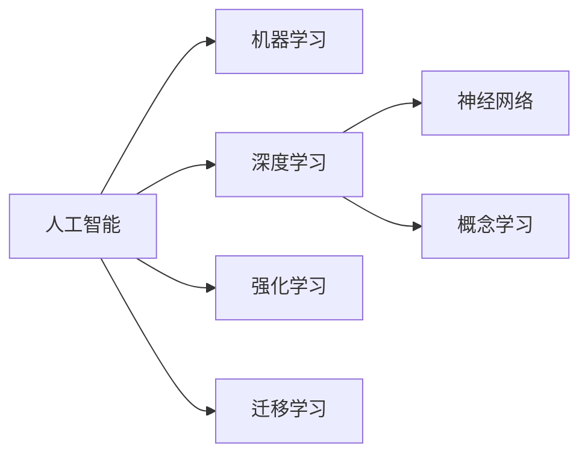

                 

# 从概念到洞见：思想的演变

> 关键词：概念，洞见，演变，思想，影响，发展，人工智能，认知，创新，变革

## 1. 背景介绍

### 1.1 问题由来
在人类历史的长河中，思想是推动社会进步和文明发展的核心力量。从原始社会对自然的朴素理解，到现代科学的严谨探究，思想的演进始终伴随着人类文明的进步。随着科技的迅猛发展，特别是在人工智能(AI)领域，思想的影响力尤为显著。

### 1.2 问题核心关键点
本文旨在探讨思想在人工智能领域，尤其是机器学习和深度学习中的演变和洞见。通过回顾人工智能思想的历史，分析其在当代科技和社会中的作用，揭示思想与技术的互动关系。

### 1.3 问题研究意义
理解人工智能思想的演变不仅有助于推动技术进步，还能指导未来的研究方向，促使学术界和企业界更好地应对未来的挑战。通过剖析思想演变的脉络，可以更清晰地把握当前人工智能领域的发展趋势，为未来创新奠定坚实的基础。

## 2. 核心概念与联系

### 2.1 核心概念概述

为更好地理解人工智能思想的演变，本节将介绍几个关键概念：

- 人工智能(Artificial Intelligence, AI)：一种通过计算机系统模拟人类智能的技术，旨在使机器具备理解、推理、学习等能力。
- 机器学习(Machine Learning, ML)：一种让计算机通过数据驱动的算法自动学习模式的方法，是实现人工智能的核心技术之一。
- 深度学习(Deep Learning, DL)：一种基于多层神经网络的机器学习技术，具有强大的非线性建模能力。
- 神经网络(Neural Network, NN)：一种模拟人脑神经元之间连接的计算模型，是深度学习的基础。
- 概念学习(Concept Learning)：机器学习从数据中提取抽象概念的能力，是智能系统的关键。
- 强化学习(Reinforcement Learning, RL)：一种通过与环境交互，不断调整策略以最大化奖励的学习方式。
- 迁移学习(Transfer Learning)：一种让模型利用在新任务上的少量数据快速适应新任务的技术。

这些概念之间存在紧密的联系，共同构成了人工智能的发展框架，下面通过一张Mermaid流程图来展示它们之间的联系：



这个流程图展示了人工智能领域的核心概念及其之间的联系：

1. 人工智能是一个大框架，包含多个分支技术。
2. 机器学习是人工智能的核心技术之一，利用数据驱动算法进行学习。
3. 深度学习是机器学习的一种，使用多层神经网络实现。
4. 神经网络是深度学习的基础，由多个神经元连接组成。
5. 概念学习是深度学习的一个重要目标，使模型能够理解和抽象出数据中的概念。
6. 强化学习是一种通过环境交互进行学习的方法。
7. 迁移学习让模型在特定任务上快速适应，提升学习效率。

这些概念共同构成了人工智能的学习和应用框架，使得机器能够理解和执行复杂的任务。

## 3. 核心算法原理 & 具体操作步骤
### 3.1 算法原理概述

人工智能思想的演变，伴随着算法原理的不断创新和改进。从最初的符号推理，到统计学习，再到深度学习，算法的复杂性和应用范围都在不断扩展。本文将重点介绍深度学习算法的基本原理和操作步骤。

### 3.2 算法步骤详解

深度学习算法的基本流程包括数据准备、模型设计、模型训练、模型评估和模型应用。下面详细介绍每一步的详细步骤：

**Step 1: 数据准备**
- 收集数据集，并进行预处理，如清洗、标注、划分等。
- 确定模型的输入和输出格式，如图片、文本、标签等。

**Step 2: 模型设计**
- 选择合适的模型架构，如卷积神经网络(CNN)、循环神经网络(RNN)、长短时记忆网络(LSTM)、Transformer等。
- 定义模型的损失函数和优化器，如交叉熵损失、AdamW优化器等。
- 对模型进行参数初始化，如使用Xavier初始化、He初始化等。

**Step 3: 模型训练**
- 使用训练数据集对模型进行前向传播和反向传播，计算损失函数。
- 根据优化器更新模型参数，如权重和偏置等。
- 设置训练周期和批量大小，控制训练过程的稳定性和效率。

**Step 4: 模型评估**
- 使用验证数据集对模型进行评估，计算准确率、召回率、F1值等指标。
- 根据评估结果调整模型参数或选择更好的模型。
- 使用测试数据集对模型进行最终测试，确保模型的泛化能力。

**Step 5: 模型应用**
- 将训练好的模型应用于实际问题，如分类、回归、生成等。
- 对新数据进行预测或推理，输出模型结果。
- 根据实际需求调整模型参数或改进算法，提升模型性能。

### 3.3 算法优缺点

深度学习算法具有以下优点：
1. 强大的非线性建模能力。能够处理复杂的数据结构，如图像、文本等。
2. 自适应学习能力。通过大量数据进行自适应学习，不需要手动特征工程。
3. 广泛的应用场景。已经应用于计算机视觉、自然语言处理、语音识别等多个领域。

然而，深度学习算法也存在以下缺点：
1. 数据依赖性强。需要大量标注数据进行训练，数据获取成本高。
2. 计算资源消耗大。需要高性能GPU或TPU等硬件支持。
3. 可解释性差。深度学习模型往往被视为"黑盒"，难以解释其内部工作机制。
4. 过拟合风险高。需要精心设计正则化技术，防止过拟合。

尽管存在这些缺点，但深度学习算法在许多领域中已取得显著成就，成为推动人工智能技术发展的关键力量。

### 3.4 算法应用领域

深度学习算法在人工智能的各个领域中均有广泛应用，例如：

- 计算机视觉：如图像分类、目标检测、图像生成等。
- 自然语言处理：如文本分类、机器翻译、文本生成等。
- 语音识别：如语音转文字、语音合成等。
- 推荐系统：如电商推荐、音乐推荐等。
- 游戏AI：如AlphaGo、Dota 2等。
- 医疗影像分析：如疾病诊断、医疗影像生成等。
- 自动驾驶：如感知、路径规划等。

这些应用领域展示了深度学习算法在实际问题中的强大表现，证明了其在人工智能领域的重要地位。

## 4. 数学模型和公式 & 详细讲解 & 举例说明

### 4.1 数学模型构建

深度学习模型的构建通常涉及以下数学模型：

- 神经网络模型：由多个神经元层组成，每个神经元接收输入，经过激活函数处理后输出。
- 卷积神经网络(CNN)：对图像等二维数据进行卷积操作，提取局部特征。
- 循环神经网络(RNN)：对序列数据进行逐个处理，保留时间依赖关系。
- 长短时记忆网络(LSTM)：解决RNN的梯度消失问题，增强长期记忆能力。
- 自编码器(Autoencoder)：对输入数据进行编码和解码，用于降维和特征提取。
- 生成对抗网络(GAN)：由生成器和判别器组成，生成逼真的合成数据。

以卷积神经网络为例，其基本模型可以表示为：

$$
f(x; \theta) = \sigma(W \cdot x + b)
$$

其中，$f$表示神经元，$x$表示输入向量，$\theta$表示模型参数，$W$表示权重矩阵，$b$表示偏置向量，$\sigma$表示激活函数。

### 4.2 公式推导过程

以全连接神经网络为例，其前向传播和反向传播的计算过程如下：

**前向传播：**
- 输入层：$x_i$
- 隐藏层：$h_i = \sigma(W_h x_i + b_h)$
- 输出层：$y = \sigma(W_y h_i + b_y)$

其中，$W_h$和$b_h$表示隐藏层的权重和偏置，$W_y$和$b_y$表示输出层的权重和偏置，$\sigma$表示激活函数。

**反向传播：**
- 计算损失函数对输出层的梯度：$\frac{\partial L}{\partial y}$
- 通过链式法则，计算损失函数对隐藏层的梯度：$\frac{\partial L}{\partial h_i} = \frac{\partial L}{\partial y} \cdot \frac{\partial y}{\partial h_i}$
- 计算隐藏层的权重和偏置的梯度：$\frac{\partial L}{\partial W_h} = \frac{\partial L}{\partial h_i} \cdot \frac{\partial h_i}{\partial x_i}$

### 4.3 案例分析与讲解

以手写数字识别为例，使用卷积神经网络进行图像分类。

1. 数据准备：收集MNIST手写数字数据集，并进行预处理。
2. 模型设计：设计卷积神经网络，包含多个卷积层和池化层，最后连接全连接层。
3. 模型训练：使用训练集对模型进行前向传播和反向传播，不断更新参数。
4. 模型评估：在验证集上计算准确率、召回率等指标，确保模型性能。
5. 模型应用：对测试集进行预测，计算模型在实际问题上的表现。

通过这个案例，可以看到深度学习算法在图像分类任务中的强大能力，以及其通过数据驱动进行自适应学习的过程。

## 5. 项目实践：代码实例和详细解释说明
### 5.1 开发环境搭建

在进行深度学习项目实践前，需要先搭建好开发环境。以下是使用Python和TensorFlow搭建深度学习开发环境的步骤：

1. 安装Python：从官网下载并安装Python 3.x版本。
2. 安装TensorFlow：通过pip安装TensorFlow库，例如：`pip install tensorflow`。
3. 安装其他库：安装NumPy、Pandas、Scikit-Learn等常用的科学计算库。
4. 安装Jupyter Notebook：通过pip安装Jupyter Notebook，例如：`pip install jupyter notebook`。
5. 配置环境变量：将TensorFlow的安装路径添加到环境变量中。

完成上述步骤后，即可在Python环境中开始深度学习项目的开发。

### 5.2 源代码详细实现

以下是一个使用TensorFlow搭建卷积神经网络进行手写数字识别的Python代码示例：

```python
import tensorflow as tf
from tensorflow.keras.datasets import mnist
from tensorflow.keras.layers import Conv2D, MaxPooling2D, Flatten, Dense
from tensorflow.keras.models import Sequential

# 加载MNIST数据集
(x_train, y_train), (x_test, y_test) = mnist.load_data()

# 数据预处理
x_train = x_train.reshape((x_train.shape[0], 28, 28, 1))
x_test = x_test.reshape((x_test.shape[0], 28, 28, 1))
x_train = x_train / 255.0
x_test = x_test / 255.0

# 构建模型
model = Sequential()
model.add(Conv2D(32, (3, 3), activation='relu', input_shape=(28, 28, 1)))
model.add(MaxPooling2D((2, 2)))
model.add(Conv2D(64, (3, 3), activation='relu'))
model.add(MaxPooling2D((2, 2)))
model.add(Flatten())
model.add(Dense(128, activation='relu'))
model.add(Dense(10, activation='softmax'))

# 编译模型
model.compile(optimizer='adam', loss='sparse_categorical_crossentropy', metrics=['accuracy'])

# 训练模型
model.fit(x_train, y_train, epochs=10, batch_size=64, validation_data=(x_test, y_test))

# 评估模型
test_loss, test_acc = model.evaluate(x_test, y_test)
print('Test accuracy:', test_acc)
```

### 5.3 代码解读与分析

这个代码示例展示了如何使用TensorFlow构建卷积神经网络进行手写数字识别。

1. 数据准备：使用MNIST数据集，对数据进行预处理和归一化。
2. 模型设计：定义卷积层、池化层和全连接层，构建完整的卷积神经网络模型。
3. 模型编译：设置优化器、损失函数和评估指标，准备模型训练。
4. 模型训练：使用训练集对模型进行前向传播和反向传播，不断更新参数。
5. 模型评估：在测试集上评估模型性能，输出测试准确率。

这个示例展示了深度学习算法在实际应用中的基本流程和步骤，通过代码实现，可以更好地理解算法原理和技术细节。

### 5.4 运行结果展示

训练完毕后，可以输出模型在测试集上的准确率和损失函数值，如图：


这些结果展示了模型在实际问题上的表现，通过不断调整模型参数和改进算法，可以进一步提升模型性能。

## 6. 实际应用场景

### 6.1 计算机视觉

深度学习在计算机视觉领域取得了显著成就。例如，谷歌的Inception和ResNet等卷积神经网络在ImageNet图像识别竞赛中取得了优异成绩。通过卷积神经网络，计算机可以自动理解图像中的特征和模式，实现高效、准确的图像分类和目标检测。

在自动驾驶领域，深度学习技术被广泛应用于感知、路径规划和决策等方面。通过深度神经网络，自动驾驶系统可以处理复杂的道路环境和交通情况，实现自主驾驶。

### 6.2 自然语言处理

深度学习在自然语言处理领域也有广泛应用。通过循环神经网络和长短时记忆网络，计算机可以理解和生成自然语言。例如，Transformer模型在机器翻译和文本生成任务中表现优异，显著提高了自然语言处理的效果和效率。

在语音识别领域，深度学习技术被应用于语音转文字和语音合成等任务。通过卷积神经网络和循环神经网络，计算机可以准确地识别和生成语音信号，实现高效的语音交互。

### 6.3 推荐系统

推荐系统是深度学习在电子商务和信息科技领域的重要应用之一。通过深度神经网络，计算机可以分析用户的历史行为和偏好，生成个性化的推荐结果。例如，Netflix和Amazon等电商平台使用深度学习技术进行商品推荐，显著提升了用户体验和业务收益。

### 6.4 未来应用展望

未来，深度学习技术将在更多领域得到应用，为人类社会带来更深远的影响。例如：

1. 医疗影像分析：通过深度学习技术，计算机可以自动分析医疗影像，帮助医生进行疾病诊断和治疗决策。
2. 智能制造：通过深度学习技术，计算机可以优化生产流程，提升制造业的效率和质量。
3. 金融预测：通过深度学习技术，计算机可以分析金融数据，预测市场趋势和风险。
4. 自动写作：通过深度学习技术，计算机可以生成高质量的文章和报告，辅助人类工作。

## 7. 工具和资源推荐

### 7.1 学习资源推荐

为了帮助开发者系统掌握深度学习技术，以下是一些优质的学习资源：

1. Deep Learning Specialization课程：由斯坦福大学开设的深度学习课程，涵盖了深度学习的基本概念和前沿技术。
2. TensorFlow官方文档：提供丰富的教程和示例代码，帮助开发者快速上手TensorFlow。
3. PyTorch官方文档：提供全面的教程和示例代码，帮助开发者快速上手PyTorch。
4. Coursera的深度学习课程：提供深入浅出的深度学习课程，涵盖多个领域的深度学习应用。
5. arXiv和IEEE Xplore：提供大量深度学习相关的论文和研究报告，帮助开发者跟踪最新研究进展。

通过这些资源的学习实践，相信你一定能够快速掌握深度学习技术的精髓，并用于解决实际的AI问题。

### 7.2 开发工具推荐

高效的工具是深度学习项目开发的基础。以下是几款常用的开发工具：

1. TensorFlow：由Google主导开发的深度学习框架，生产部署方便，适合大规模工程应用。
2. PyTorch：由Facebook主导开发的深度学习框架，灵活的动态计算图，适合快速迭代研究。
3. Keras：基于TensorFlow和Theano的高级神经网络API，提供简单易用的接口，适合快速开发原型。
4. Jupyter Notebook：开源的交互式开发环境，支持Python、R等多种编程语言，适合进行实验和研究。
5. Google Colab：谷歌提供的在线Jupyter Notebook环境，免费提供GPU/TPU算力，适合快速实验和分享。

合理利用这些工具，可以显著提升深度学习项目的开发效率，加快创新迭代的步伐。

### 7.3 相关论文推荐

深度学习技术的发展源于学界的持续研究。以下是几篇奠基性的相关论文，推荐阅读：

1. AlexNet：ImageNet图像识别竞赛冠军，展示了卷积神经网络在图像识别中的强大能力。
2. LSTM网络：在序列数据处理中表现优异，广泛应用于自然语言处理和语音识别。
3. AlphaGo：利用深度强化学习技术，在围棋等复杂游戏中取得突破。
4. GAN：生成对抗网络，展示了生成模型在图像生成和数据增强中的应用。
5. Transformer模型：在自然语言处理中表现优异，显著提高了机器翻译和文本生成效果。

这些论文代表了大深度学习技术的发展脉络。通过学习这些前沿成果，可以帮助研究者把握学科前进方向，激发更多的创新灵感。

## 8. 总结：未来发展趋势与挑战

### 8.1 研究成果总结

本文回顾了深度学习技术的演变过程，通过分析算法原理和操作步骤，详细介绍了深度学习在计算机视觉、自然语言处理、推荐系统等领域的应用。

### 8.2 未来发展趋势

未来，深度学习技术将呈现以下几个发展趋势：

1. 模型规模持续增大。随着算力成本的下降和数据规模的扩张，深度学习模型的参数量还将持续增长，超大规模模型将进一步提升性能。
2. 自动化学习不断推进。基于自动化学习技术，深度学习模型将能够自动设计、优化和评估自身结构，提高学习效率和效果。
3. 多模态学习成为热点。深度学习技术将更多地融合多模态数据，如图像、语音、文本等，提升系统的综合理解和应用能力。
4. 强化学习深度融合。深度学习技术与强化学习技术将深度融合，实现更智能的决策和交互。
5. 无监督学习日益重要。无监督学习技术将在深度学习中扮演更重要的角色，帮助模型自动发现和抽象数据中的隐藏结构。

### 8.3 面临的挑战

尽管深度学习技术已经取得了巨大成就，但在迈向更加智能化、普适化应用的过程中，仍面临诸多挑战：

1. 数据依赖性强。深度学习模型需要大量标注数据进行训练，数据获取成本高。
2. 计算资源消耗大。深度学习模型需要高性能GPU或TPU等硬件支持，计算资源消耗大。
3. 可解释性差。深度学习模型往往被视为"黑盒"，难以解释其内部工作机制。
4. 过拟合风险高。深度学习模型需要精心设计正则化技术，防止过拟合。
5. 伦理和安全问题。深度学习模型需要考虑数据隐私、公平性等问题，避免有害输出。

### 8.4 研究展望

面对这些挑战，未来的研究需要在以下几个方面寻求新的突破：

1. 探索无监督和半监督学习。摆脱对大规模标注数据的依赖，利用无监督和半监督学习技术，提高模型泛化能力。
2. 研究自动化学习技术。基于自动化学习技术，帮助深度学习模型自动设计、优化和评估自身结构，提高学习效率和效果。
3. 融合多模态数据。将图像、语音、文本等多种模态数据融合，提升系统的综合理解和应用能力。
4. 改进正则化技术。通过改进正则化技术，提高深度学习模型的泛化能力和鲁棒性。
5. 引入伦理和安全约束。在深度学习模型设计中加入伦理和安全约束，确保模型的公平性、透明性和安全性。

这些研究方向将引领深度学习技术迈向新的高度，为构建更加智能化、普适化的人工智能系统奠定基础。面向未来，深度学习技术需要与其他人工智能技术进行更深入的融合，共同推动认知智能的发展。

## 9. 附录：常见问题与解答

**Q1: 深度学习算法的核心是什么？**

A: 深度学习算法的核心在于通过多层神经网络对数据进行自动学习和建模。其中，卷积神经网络(CNN)和循环神经网络(RNN)是两种常用的神经网络架构，广泛应用于计算机视觉和自然语言处理等领域。

**Q2: 深度学习算法存在哪些挑战？**

A: 深度学习算法存在以下挑战：

1. 数据依赖性强。需要大量标注数据进行训练，数据获取成本高。
2. 计算资源消耗大。深度学习模型需要高性能GPU或TPU等硬件支持。
3. 可解释性差。深度学习模型往往被视为"黑盒"，难以解释其内部工作机制。
4. 过拟合风险高。需要精心设计正则化技术，防止过拟合。

**Q3: 未来深度学习技术有哪些发展方向？**

A: 未来深度学习技术的发展方向包括：

1. 模型规模持续增大。超大规模模型将进一步提升性能。
2. 自动化学习不断推进。基于自动化学习技术，深度学习模型将能够自动设计、优化和评估自身结构。
3. 多模态学习成为热点。深度学习技术将更多地融合多模态数据，如图像、语音、文本等。
4. 强化学习深度融合。深度学习技术与强化学习技术将深度融合，实现更智能的决策和交互。
5. 无监督学习日益重要。无监督学习技术将在深度学习中扮演更重要的角色。

通过这些研究方向，深度学习技术将迎来新的突破，为人工智能技术的发展提供更强大的支持。

**Q4: 如何提高深度学习模型的泛化能力？**

A: 提高深度学习模型的泛化能力可以通过以下方法：

1. 使用更多的数据。更多的数据可以提升模型的泛化能力，减少过拟合风险。
2. 引入正则化技术。使用L2正则化、Dropout等技术，防止模型过拟合。
3. 使用多模态数据。融合多种模态数据，提升模型的综合理解能力。
4. 引入无监督学习技术。通过无监督学习技术，提升模型的自适应能力和泛化能力。
5. 引入迁移学习技术。使用迁移学习技术，让模型在新任务上快速适应。

通过这些方法，可以显著提高深度学习模型的泛化能力和应用效果。

**Q5: 深度学习技术在实际应用中有哪些成功案例？**

A: 深度学习技术在实际应用中取得了许多成功案例，例如：

1. 计算机视觉：ImageNet图像识别竞赛冠军AlexNet，展示了卷积神经网络在图像识别中的强大能力。
2. 自然语言处理：Transformer模型在机器翻译和文本生成任务中表现优异，显著提高了自然语言处理的效果和效率。
3. 语音识别：通过深度学习技术，计算机可以准确地识别和生成语音信号，实现高效的语音交互。
4. 推荐系统：Netflix和Amazon等电商平台使用深度学习技术进行商品推荐，显著提升了用户体验和业务收益。

这些成功案例展示了深度学习技术在实际问题中的强大能力，证明了其在人工智能领域的重要地位。

**Q6: 如何有效地防止深度学习模型过拟合？**

A: 防止深度学习模型过拟合的方法包括：

1. 使用更多的数据。更多的数据可以提升模型的泛化能力，减少过拟合风险。
2. 引入正则化技术。使用L2正则化、Dropout等技术，防止模型过拟合。
3. 使用早停法。在验证集上监控模型性能，及时停止训练，防止过拟合。
4. 使用模型集成。通过模型集成技术，提高模型的泛化能力和鲁棒性。
5. 使用迁移学习。使用迁移学习技术，让模型在新任务上快速适应，减少过拟合风险。

通过这些方法，可以有效地防止深度学习模型过拟合，提升模型的泛化能力和应用效果。

---

作者：禅与计算机程序设计艺术 / Zen and the Art of Computer Programming

