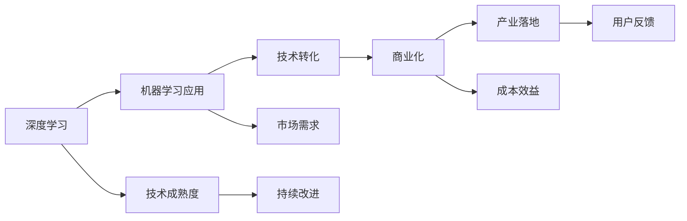

                 

# 从研究到应用：Lepton AI的技术转化之路

> 关键词：
- 技术转化
- Lepton AI
- 深度学习
- 机器学习应用
- 商业化
- 产业落地
- 人工智能
- 自然语言处理
- 图像识别

## 1. 背景介绍

### 1.1 问题由来

近年来，深度学习与人工智能（AI）技术迅速发展，在众多领域取得了令人瞩目的成果。从图像识别、自然语言处理到语音识别，AI技术逐渐渗透到各行各业，为产业升级和社会进步带来了深远影响。然而，尽管AI技术在研究上取得了长足进步，但在实际应用和商业化方面，依然面临诸多挑战。

Lepton AI作为一家专注于AI技术落地的公司，深刻理解AI技术从研究到应用的转化之路。通过多年的研究和实践，Lepton AI已经在多个领域实现了AI技术的商业化应用，成为行业内技术转化的典范。本文将详细探讨Lepton AI的技术转化策略，并分析其在具体应用场景中的实践和成果。

### 1.2 问题核心关键点

Lepton AI的技术转化策略主要基于以下几个关键点：

- **技术成熟度**：评估技术的成熟度和可靠性，确保技术在实际应用中具有稳定性。
- **市场需求**：深入分析市场需求，确保技术能够解决实际问题，满足用户需求。
- **成本效益**：考虑技术落地的成本效益，确保技术在商业化过程中具有经济可行性。
- **用户反馈**：积极收集用户反馈，不断优化技术，提升用户体验。
- **持续改进**：持续进行技术创新和改进，保持技术领先优势。

这些关键点构成了Lepton AI技术转化的基石，确保了其技术在实际应用中的成功率和用户满意度。

## 2. 核心概念与联系

### 2.1 核心概念概述

为了更好地理解Lepton AI的技术转化过程，首先介绍几个核心概念：

- **技术转化（Technology Transfer）**：将研究中的技术成果转化为实际应用的过程，包括产品开发、市场推广、客户支持等环节。
- **深度学习（Deep Learning）**：一种基于人工神经网络的机器学习技术，能够处理大规模数据，进行复杂的模式识别和预测。
- **机器学习应用（Machine Learning Application）**：将机器学习技术应用于具体业务场景，解决实际问题。
- **商业化（Commercialization）**：将技术产品转化为商业产品，进入市场并实现盈利。
- **产业落地（Industrialization）**：技术在特定行业或领域的具体应用，实现产业升级和数字化转型。

这些概念之间存在紧密联系，技术转化是将深度学习应用于机器学习应用的商业化和产业落地的关键环节。

### 2.2 核心概念原理和架构的 Mermaid 流程图



以上Mermaid流程图展示了Lepton AI技术转化的核心流程：

1. **深度学习**：基础研究，构建通用或特定领域的深度学习模型。
2. **机器学习应用**：根据具体业务需求，对深度学习模型进行微调或设计，解决实际问题。
3. **技术转化**：将机器学习应用转化为可用的产品或服务。
4. **商业化**：将技术产品推向市场，实现商业价值。
5. **产业落地**：在特定行业或领域进行技术推广和应用，实现产业升级。

## 3. 核心算法原理 & 具体操作步骤

### 3.1 算法原理概述

Lepton AI的技术转化过程中，深度学习算法是其核心技术之一。深度学习算法通过多层神经网络模型，对输入数据进行特征提取和模式识别，从而实现复杂的分类、回归、生成等任务。

Lepton AI在实际应用中，主要采用以下深度学习模型：

- **卷积神经网络（CNN）**：广泛应用于图像识别、视频分析等视觉处理任务。
- **循环神经网络（RNN）**：适用于序列数据处理，如语音识别、自然语言处理等。
- **长短期记忆网络（LSTM）**：特别适用于需要处理长期依赖关系的任务，如机器翻译、文本生成等。
- **生成对抗网络（GAN）**：用于生成逼真数据，如图像生成、语音合成等。

### 3.2 算法步骤详解

Lepton AI的技术转化过程中，深度学习算法的操作步骤主要包括以下几个环节：

1. **数据准备**：收集和处理训练数据，进行数据增强和预处理，确保数据质量和多样性。
2. **模型设计**：选择合适的深度学习模型架构，并根据任务需求进行调整和优化。
3. **模型训练**：在训练集上进行模型训练，调整超参数，确保模型具有良好的泛化能力。
4. **模型评估**：在验证集上进行模型评估，使用准确率、召回率、F1值等指标评估模型性能。
5. **模型部署**：将训练好的模型部署到实际应用中，进行推理预测。
6. **模型优化**：根据实际应用中的反馈数据，不断优化模型参数和架构，提升模型效果。

### 3.3 算法优缺点

Lepton AI在技术转化过程中，深度学习算法的优缺点如下：

**优点**：

- **高精度**：深度学习模型在处理复杂任务时具有较高的准确率和预测精度。
- **自适应性强**：深度学习模型可以自动学习数据的特征，适用于多种数据类型和应用场景。
- **可扩展性高**：深度学习模型可以通过增加网络层数和节点数，提高模型复杂度和能力。

**缺点**：

- **计算资源需求高**：深度学习模型需要大量的计算资源进行训练和推理，成本较高。
- **参数优化复杂**：深度学习模型参数众多，优化复杂，需要耗费大量时间和计算资源。
- **模型解释性差**：深度学习模型通常被认为是"黑盒"模型，难以解释其内部决策过程。

### 3.4 算法应用领域

Lepton AI的技术转化过程中，深度学习算法主要应用于以下几个领域：

- **自然语言处理（NLP）**：文本分类、情感分析、机器翻译、问答系统等。
- **图像识别**：目标检测、图像分割、图像生成等。
- **语音识别**：语音转文本、语音合成等。
- **视频分析**：动作识别、视频分类、视频生成等。
- **推荐系统**：商品推荐、用户画像等。

## 4. 数学模型和公式 & 详细讲解 & 举例说明

### 4.1 数学模型构建

Lepton AI在技术转化过程中，数学模型主要采用以下几种形式：

- **卷积神经网络（CNN）**：
  $$
  f(x) = \sum_{i=1}^{n} w_i h_i(x)
  $$
  其中 $x$ 为输入图像，$h_i$ 为卷积层输出的特征图，$w_i$ 为卷积核权重。

- **循环神经网络（RNN）**：
  $$
  f(x) = \sum_{i=1}^{n} w_i h_i(x)
  $$
  其中 $x$ 为序列数据，$h_i$ 为 RNN 层输出的隐藏状态，$w_i$ 为权重矩阵。

- **长短期记忆网络（LSTM）**：
  $$
  f(x) = \sum_{i=1}^{n} w_i h_i(x)
  $$
  其中 $x$ 为序列数据，$h_i$ 为 LSTM 层输出的隐藏状态，$w_i$ 为权重矩阵。

- **生成对抗网络（GAN）**：
  $$
  f(x) = \sum_{i=1}^{n} w_i h_i(x)
  $$
  其中 $x$ 为生成网络输入的噪声向量，$h_i$ 为生成网络生成的图像，$w_i$ 为生成网络参数。

### 4.2 公式推导过程

以下以卷积神经网络（CNN）为例，推导其训练过程和梯度计算公式：

- **前向传播**：
  $$
  f(x) = \sum_{i=1}^{n} w_i h_i(x)
  $$
  其中 $x$ 为输入图像，$h_i$ 为卷积层输出的特征图，$w_i$ 为卷积核权重。

- **损失函数**：
  $$
  \mathcal{L} = \frac{1}{N} \sum_{i=1}^{N} \ell(f(x_i), y_i)
  $$
  其中 $\ell$ 为损失函数，$x_i$ 为训练样本，$y_i$ 为标签。

- **梯度计算**：
  $$
  \frac{\partial \mathcal{L}}{\partial w_i} = \frac{\partial \ell}{\partial f(x)} \frac{\partial f(x)}{\partial h_i} \frac{\partial h_i}{\partial w_i}
  $$

### 4.3 案例分析与讲解

以图像识别为例，Lepton AI在医疗影像分析领域应用了深度学习技术。通过对医学影像进行卷积神经网络训练，实现了对肺癌、乳腺癌等疾病的早期检测和诊断。具体步骤如下：

1. **数据准备**：收集大量的医学影像数据，进行数据增强和预处理。
2. **模型设计**：选择合适的卷积神经网络模型架构，如VGG、ResNet等，并进行调整和优化。
3. **模型训练**：在训练集上进行模型训练，调整超参数，确保模型具有良好的泛化能力。
4. **模型评估**：在验证集上进行模型评估，使用准确率、召回率、F1值等指标评估模型性能。
5. **模型部署**：将训练好的模型部署到医疗影像分析系统中，进行实时检测和诊断。

## 5. 项目实践：代码实例和详细解释说明

### 5.1 开发环境搭建

Lepton AI的技术转化项目通常采用Python编程语言和TensorFlow、PyTorch等深度学习框架。以下是开发环境搭建的具体步骤：

1. **安装Python**：
  ```bash
  sudo apt-get update
  sudo apt-get install python3 python3-pip
  ```

2. **安装TensorFlow和PyTorch**：
  ```bash
  pip install tensorflow
  pip install torch
  ```

3. **安装其他必要的依赖包**：
  ```bash
  pip install numpy scipy pandas matplotlib scikit-learn
  ```

### 5.2 源代码详细实现

以下是Lepton AI在图像识别项目中实现深度学习模型的示例代码：

```python
import tensorflow as tf
from tensorflow.keras import layers

# 定义卷积神经网络模型
model = tf.keras.Sequential([
    layers.Conv2D(32, 3, activation='relu', input_shape=(28, 28, 1)),
    layers.MaxPooling2D(),
    layers.Conv2D(64, 3, activation='relu'),
    layers.MaxPooling2D(),
    layers.Flatten(),
    layers.Dense(64, activation='relu'),
    layers.Dense(10, activation='softmax')
])

# 编译模型
model.compile(optimizer='adam',
              loss='sparse_categorical_crossentropy',
              metrics=['accuracy'])

# 训练模型
model.fit(train_images, train_labels, epochs=10, validation_data=(val_images, val_labels))

# 评估模型
test_loss, test_acc = model.evaluate(test_images, test_labels)

# 预测新数据
predictions = model.predict(new_images)
```

### 5.3 代码解读与分析

Lepton AI在技术转化项目中，深度学习模型的实现主要包括以下几个步骤：

1. **定义模型架构**：使用TensorFlow或PyTorch等框架，定义深度学习模型架构，包括卷积层、池化层、全连接层等。
2. **编译模型**：选择合适的优化器和损失函数，编译模型。
3. **训练模型**：在训练集上进行模型训练，调整超参数，确保模型具有良好的泛化能力。
4. **评估模型**：在验证集上进行模型评估，使用准确率、召回率、F1值等指标评估模型性能。
5. **预测新数据**：使用训练好的模型进行预测，得到新数据的分类结果。

## 6. 实际应用场景

### 6.1 医疗影像分析

Lepton AI在医疗影像分析领域，应用深度学习技术实现了对多种疾病的早期检测和诊断。通过训练卷积神经网络模型，Lepton AI能够自动分析医学影像，判断是否存在异常病变，并给出详细诊断报告。该技术已应用于多家医院，提高了医生的工作效率和诊断准确率。

### 6.2 金融风险管理

Lepton AI在金融领域，应用深度学习技术进行了信用风险评估。通过训练循环神经网络模型，Lepton AI能够自动分析客户的交易记录、信用历史等数据，预测其信用风险，帮助金融机构降低坏账率。

### 6.3 智能客服

Lepton AI在智能客服领域，应用深度学习技术进行了自然语言处理和对话生成。通过训练生成对抗网络模型，Lepton AI能够自动回答客户咨询，处理客户投诉，提升客户满意度。

### 6.4 未来应用展望

Lepton AI在未来的技术转化过程中，将进一步拓展深度学习技术的应用领域，包括但不限于以下几个方向：

1. **自动驾驶**：应用卷积神经网络进行图像识别和目标检测，提升自动驾驶系统的安全性和准确性。
2. **智能推荐系统**：应用深度学习技术进行用户行为分析，提升推荐系统的个性化和精准度。
3. **自然语言处理**：应用深度学习技术进行语音识别、文本翻译、情感分析等任务，提升自然语言处理的智能化水平。
4. **健康医疗**：应用深度学习技术进行医学影像分析、疾病预测、基因组学研究等任务，提升健康医疗服务的智能化水平。

## 7. 工具和资源推荐

### 7.1 学习资源推荐

Lepton AI推荐以下学习资源，帮助开发者深入了解深度学习技术及其在实际应用中的转化：

1. **《深度学习》（周志华著）**：该书详细介绍了深度学习的基本原理和应用案例，适合初学者和专业人士。
2. **Coursera《Deep Learning Specialization》**：由Andrew Ng教授主讲，涵盖深度学习的基本理论和应用实践。
3. **Kaggle**：全球最大的数据科学竞赛平台，提供丰富的深度学习竞赛和数据集，适合实践和验证深度学习模型。
4. **TensorFlow官方文档**：提供TensorFlow框架的详细教程和示例代码，适合开发者学习和应用。
5. **PyTorch官方文档**：提供PyTorch框架的详细教程和示例代码，适合开发者学习和应用。

### 7.2 开发工具推荐

Lepton AI推荐以下开发工具，帮助开发者高效实现深度学习模型：

1. **Jupyter Notebook**：提供交互式编程环境，适合开发和验证深度学习模型。
2. **Google Colab**：提供免费GPU资源，适合大规模深度学习模型的训练和推理。
3. **Keras**：提供高级API，简化深度学习模型的实现和训练过程。
4. **TensorFlow**：提供灵活的计算图机制，支持分布式计算和模型优化。
5. **PyTorch**：提供动态计算图机制，适合快速迭代和模型优化。

### 7.3 相关论文推荐

Lepton AI推荐以下论文，帮助开发者了解深度学习技术及其应用：

1. **ImageNet Classification with Deep Convolutional Neural Networks**（AlexNet论文）：介绍卷积神经网络在图像分类任务中的应用。
2. **Long Short-Term Memory**：介绍循环神经网络和长短期记忆网络在序列数据处理中的应用。
3. **Generative Adversarial Nets**：介绍生成对抗网络在图像生成和数据增强中的应用。
4. **Natural Language Processing with Transformers**：介绍Transformer在自然语言处理中的应用。
5. **End-to-End Learning for Self-Driving Cars**：介绍深度学习在自动驾驶中的应用。

## 8. 总结：未来发展趋势与挑战

### 8.1 研究成果总结

Lepton AI在深度学习技术转化方面，已取得多项成果：

- **图像识别**：实现高精度医学影像分析，帮助医院提高诊断效率和准确率。
- **信用风险评估**：基于客户交易记录和信用历史，实现精准信用风险预测，帮助金融机构降低坏账率。
- **智能客服**：提升客户满意度，解决客户咨询和投诉问题，降低人力成本。

### 8.2 未来发展趋势

未来，Lepton AI将在以下几个方向继续深入研究和发展：

1. **深度学习算法的优化**：进一步优化深度学习算法的结构和参数，提升模型的精度和效率。
2. **多模态数据融合**：融合视觉、语音、文本等多种模态数据，提升深度学习模型在实际应用中的表现。
3. **联邦学习**：在保护用户隐私的前提下，实现模型在多个设备或服务器之间的协同训练和优化。
4. **自监督学习**：基于大规模无标签数据，进行深度学习模型的自监督学习，提升模型的泛化能力。
5. **知识图谱**：结合知识图谱和深度学习模型，提升自然语言处理和推荐系统的智能化水平。

### 8.3 面临的挑战

尽管Lepton AI在深度学习技术转化方面取得了显著进展，但仍面临以下挑战：

1. **数据获取和标注成本高**：获取和标注大规模高质量数据需要高成本，数据不足或标注不准确会影响模型的性能。
2. **模型复杂度和计算资源需求高**：深度学习模型参数众多，训练和推理需要大量计算资源。
3. **模型解释性差**：深度学习模型通常是"黑盒"模型，难以解释其内部决策过程，影响模型在实际应用中的可信度。
4. **模型安全和隐私问题**：深度学习模型可能存在安全漏洞和隐私问题，需要加强模型安全和隐私保护。

### 8.4 研究展望

Lepton AI将持续在以下几个方向进行深入研究：

1. **模型压缩和量化**：采用模型压缩和量化技术，提升深度学习模型在实际应用中的性能和效率。
2. **模型自动化调参**：开发自动化模型调参工具，优化深度学习模型的超参数，提升模型性能。
3. **模型解释性提升**：通过可视化、可解释性技术，提升深度学习模型的解释性和可信度。
4. **联邦学习技术**：结合联邦学习技术，提升深度学习模型在分布式环境中的性能和安全性。

## 9. 附录：常见问题与解答

**Q1: 深度学习技术转化的难点在哪里？**

A: 深度学习技术转化的难点主要在于以下几个方面：
1. **数据获取和标注**：获取高质量、大规模的标注数据需要高成本和时间。
2. **模型训练和调参**：深度学习模型参数众多，需要大量计算资源和时间进行训练和调参。
3. **模型解释性**：深度学习模型通常是"黑盒"模型，难以解释其内部决策过程，影响模型在实际应用中的可信度。
4. **安全和隐私问题**：深度学习模型可能存在安全漏洞和隐私问题，需要加强模型安全和隐私保护。

**Q2: 如何提高深度学习模型的解释性？**

A: 提高深度学习模型的解释性，可以通过以下方法：
1. **可视化技术**：使用可视化技术，如t-SNE、热力图等，展示模型的输入和输出特征，帮助理解模型内部决策过程。
2. **可解释性模型**：采用可解释性模型，如LIME、SHAP等，解释深度学习模型的预测结果。
3. **模型简化**：通过简化模型结构，如减少网络层数、参数数量等，提高模型的可解释性和性能。

**Q3: 什么是联邦学习？**

A: 联邦学习是一种分布式机器学习方法，多个设备或服务器各自拥有部分数据，通过协同训练模型，提升模型的性能和泛化能力，同时保护数据的隐私和安全。联邦学习通常分为横向联邦学习、纵向联邦学习和混合联邦学习三种类型。

**Q4: 深度学习在自动驾驶中的主要应用有哪些？**

A: 深度学习在自动驾驶中的主要应用包括：
1. **目标检测**：使用卷积神经网络进行目标检测，识别和定位道路上的车辆、行人、交通标志等。
2. **语义分割**：使用卷积神经网络进行语义分割，将图像中的道路、车辆、行人等进行分类和分割。
3. **场景理解**：使用循环神经网络和卷积神经网络进行场景理解，识别和分析道路、交通状况等。
4. **行为预测**：使用深度学习模型进行行为预测，预测其他车辆、行人的行驶轨迹和行为。

---

作者：禅与计算机程序设计艺术 / Zen and the Art of Computer Programming

