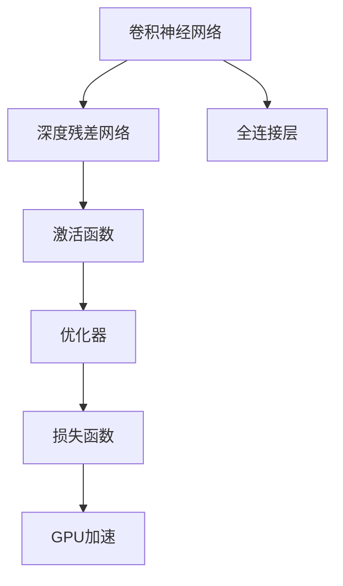

                 

# 从零开始大模型开发与微调：ResNet实战

> 关键词：大模型开发,微调,ResNet,深度学习,卷积神经网络,卷积层,全连接层,激活函数,优化器,损失函数,GPU加速

## 1. 背景介绍

### 1.1 问题由来

在深度学习领域，深度神经网络（DNN）已经成为解决复杂图像识别问题的首选工具。这些模型通过多个卷积层和全连接层，从原始像素数据中提取特征，并最终输出目标分类结果。然而，传统的深度神经网络结构在计算资源和训练时间上存在瓶颈，尤其是在处理大规模数据集时。为了应对这些挑战，深度残差网络（ResNet）应运而生。

ResNet通过引入残差学习单元（Residual Learning Unit, RLU），有效地解决了深度神经网络中梯度消失和梯度爆炸等问题，实现了更加深度的网络结构，提升了模型的准确性和泛化能力。随着ResNet的广泛应用，其微调技术也逐渐成为了深度学习模型开发与优化中的重要环节。

### 1.2 问题核心关键点

ResNet微调的主要目的是在不增加额外计算资源的情况下，提升模型在特定任务上的性能。具体来说，ResNet微调涉及以下关键点：

- 选择合适的预训练模型和数据集。
- 添加任务适配层和损失函数。
- 设置微调超参数。
- 执行梯度训练。
- 评估和部署微调后的模型。

本文档将详细介绍如何从零开始开发和微调ResNet模型，并给出具体的项目实践步骤和代码实现。

## 2. 核心概念与联系

### 2.1 核心概念概述

为了更好地理解ResNet微调，首先需要了解一些核心概念：

- **深度残差网络（ResNet）**：一种通过残差连接解决深度神经网络训练难问题的深度学习模型。
- **卷积神经网络（CNN）**：一种专门用于图像处理和分析的神经网络模型，包含卷积层和池化层。
- **全连接层（Fully Connected Layer, FC Layer）**：一种将卷积层或池化层输出的特征向量进行分类或回归的层。
- **激活函数（Activation Function）**：一种非线性变换，如ReLU、Sigmoid、Tanh等，用于增加模型的非线性表达能力。
- **优化器（Optimizer）**：一种用于更新模型参数的算法，如SGD、Adam、Adagrad等。
- **损失函数（Loss Function）**：一种用于衡量模型预测与真实标签之间差异的函数，如交叉熵损失、均方误差损失等。
- **GPU加速**：一种利用图形处理器（GPU）并行计算能力的加速技术，可以显著提升模型训练速度。

这些概念之间的逻辑关系可以通过以下Mermaid流程图来展示：



这个流程图展示了大模型开发与微调的核心概念及其之间的关系：

1. 利用卷积神经网络处理图像数据。
2. 引入深度残差网络解决深度网络训练问题。
3. 通过全连接层进行分类或回归操作。
4. 使用激活函数增加模型的非线性表达能力。
5. 使用优化器更新模型参数。
6. 引入损失函数评估模型性能。
7. 利用GPU加速提升计算效率。

## 3. 核心算法原理 & 具体操作步骤

### 3.1 算法原理概述

ResNet微调的核心思想是通过迁移学习，将预训练模型（通常是ResNet）应用于特定任务，并在少量标注数据上进行微调，从而提升模型在该任务上的性能。

具体来说，微调过程包括以下几个步骤：

1. **准备预训练模型和数据集**：选择合适的预训练ResNet模型和下游任务的数据集。
2. **添加任务适配层**：在ResNet顶层添加适合特定任务的任务适配层，如分类、回归、生成等。
3. **设置微调超参数**：选择合适的优化器、学习率、批大小等超参数。
4. **执行梯度训练**：通过反向传播算法计算梯度，并使用优化器更新模型参数。
5. **评估和部署模型**：在验证集和测试集上评估微调后的模型，并集成到实际应用中。

### 3.2 算法步骤详解

#### 3.2.1 准备预训练模型和数据集

- **选择预训练模型**：可以从Keras、PyTorch、TensorFlow等框架中选择一个已有的预训练ResNet模型。例如，Keras中的ResNet50模型。
- **准备数据集**：将下游任务的数据集划分为训练集、验证集和测试集。

#### 3.2.2 添加任务适配层

根据任务类型，在ResNet顶层设计合适的输出层和损失函数。例如，对于分类任务，通常使用Softmax函数作为输出层，交叉熵损失函数作为损失函数。

```python
from keras.applications.resnet50 import ResNet50
from keras.layers import Dense, GlobalAveragePooling2D
from keras.models import Model

# 加载预训练模型
base_model = ResNet50(weights='imagenet', include_top=False)

# 添加全局池化层和全连接层
x = GlobalAveragePooling2D()(base_model.output)
x = Dense(1024, activation='relu')(x)
predictions = Dense(num_classes, activation='softmax')(x)

# 构建模型
model = Model(inputs=base_model.input, outputs=predictions)
```

#### 3.2.3 设置微调超参数

- **优化器**：通常使用Adam或SGD作为优化器。
- **学习率**：一般使用较小的学习率，如1e-4或1e-5。
- **批大小**：根据硬件条件选择适当的批大小。

```python
from keras.optimizers import Adam

# 设置优化器和学习率
optimizer = Adam(lr=1e-4)
```

#### 3.2.4 执行梯度训练

通过反向传播算法计算梯度，并使用优化器更新模型参数。

```python
# 编译模型
model.compile(optimizer=optimizer, loss='categorical_crossentropy', metrics=['accuracy'])

# 训练模型
model.fit(train_data, train_labels, batch_size=32, epochs=10, validation_data=(val_data, val_labels))
```

#### 3.2.5 评估和部署模型

在验证集和测试集上评估微调后的模型，并集成到实际应用中。

```python
# 评估模型
test_loss, test_acc = model.evaluate(test_data, test_labels)
print('Test accuracy:', test_acc)

# 部署模型
model.save('resnet_model.h5')
```

### 3.3 算法优缺点

**优点**：
- **简单高效**：只需准备少量标注数据，即可对预训练模型进行快速适配。
- **泛化能力强**：预训练模型已经学习到大量的通用特征，可以提升模型在特定任务上的性能。
- **可扩展性强**：可以在原有模型基础上进行微调，避免从头开始构建复杂模型。

**缺点**：
- **过拟合风险**：若标注数据不足，容易发生过拟合。
- **计算资源需求**：微调过程中需要较高的计算资源，如GPU。
- **模型复杂度高**：预训练模型结构复杂，可能对新任务的适配性不足。

### 3.4 算法应用领域

ResNet微调技术广泛应用于图像分类、物体检测、语义分割等多个领域。例如：

- **图像分类**：利用微调的ResNet模型对图像进行分类，如CIFAR-10、ImageNet等。
- **物体检测**：通过微调的ResNet模型实现目标检测，如YOLO、Faster R-CNN等。
- **语义分割**：使用微调的ResNet模型对图像进行语义分割，如PASCAL VOC、Cityscapes等。

## 4. 数学模型和公式 & 详细讲解

### 4.1 数学模型构建

ResNet微调过程可以通过以下数学模型进行描述：

- **输入数据**：原始像素数据，记为$X$，维度为$(N, H, W, C)$，其中$N$为样本数，$H$和$W$为图像高度和宽度，$C$为通道数。
- **输出数据**：目标分类结果，记为$Y$，维度为$(N, C)$，其中$C$为目标类别数。
- **预训练模型**：ResNet50模型，记为$M$，包括多个卷积层和全连接层。
- **任务适配层**：根据任务类型添加的输出层，如Softmax函数。
- **损失函数**：交叉熵损失函数，记为$L$。

数学模型构建如下：

$$
\begin{aligned}
&\text{最小化损失函数}\\
&L = -\frac{1}{N} \sum_{i=1}^N \log \sigma (\hat{y_i})
\end{aligned}
$$

其中$\hat{y_i}$为模型对样本$x_i$的预测结果，$\sigma$为输出层的激活函数。

### 4.2 公式推导过程

#### 4.2.1 卷积层

卷积层是ResNet中的基本组成部分，用于提取图像的局部特征。假设卷积核大小为$k$，步幅为$s$，输入特征图大小为$h_w$，输出特征图大小为$h'_w$，则卷积层的计算公式如下：

$$
\begin{aligned}
&f_{i+1}(h_w) = k * (h_w - k + 1) + 1 \\
&h'_w = \lfloor \frac{h_w}{s} \rfloor
\end{aligned}
$$

#### 4.2.2 池化层

池化层用于降采样，减少特征图的尺寸，增加模型的平移不变性。常用的池化方式包括最大池化和平均池化。假设池化窗口大小为$k$，步幅为$s$，则池化层的计算公式如下：

$$
\begin{aligned}
&h'_w = \lfloor \frac{h_w}{s} \rfloor
\end{aligned}
$$

#### 4.2.3 全连接层

全连接层用于将特征图转化为分类结果。假设全连接层的神经元数为$n$，则全连接层的计算公式如下：

$$
\begin{aligned}
&\hat{y} = W_y * \text{relu}(W_x * x + b_x) + b_y
\end{aligned}
$$

其中$W_y$为输出层权重，$W_x$为全连接层权重，$b_x$和$b_y$分别为全连接层和输出层的偏置项。

### 4.3 案例分析与讲解

#### 4.3.1 CIFAR-10数据集

CIFAR-10数据集包含10个类别的60000张32x32的彩色图像。利用微调的ResNet50模型对CIFAR-10数据集进行分类，可以得到以下代码实现：

```python
from keras.datasets import cifar10
from keras.utils import to_categorical

# 加载数据集
(train_images, train_labels), (test_images, test_labels) = cifar10.load_data()

# 数据预处理
train_images = train_images / 255.0
test_images = test_images / 255.0

# 转换为one-hot编码
train_labels = to_categorical(train_labels)
test_labels = to_categorical(test_labels)

# 加载预训练模型
base_model = ResNet50(weights='imagenet', include_top=False)

# 添加全局池化层和全连接层
x = GlobalAveragePooling2D()(base_model.output)
x = Dense(1024, activation='relu')(x)
predictions = Dense(10, activation='softmax')(x)

# 构建模型
model = Model(inputs=base_model.input, outputs=predictions)

# 设置优化器和学习率
optimizer = Adam(lr=1e-4)

# 编译模型
model.compile(optimizer=optimizer, loss='categorical_crossentropy', metrics=['accuracy'])

# 训练模型
model.fit(train_images, train_labels, batch_size=32, epochs=10, validation_data=(test_images, test_labels))
```

## 5. 项目实践：代码实例和详细解释说明

### 5.1 开发环境搭建

在进行微调实践前，我们需要准备好开发环境。以下是使用Python进行Keras开发的环境配置流程：

1. 安装Anaconda：从官网下载并安装Anaconda，用于创建独立的Python环境。

2. 创建并激活虚拟环境：
```bash
conda create -n pytorch-env python=3.8 
conda activate pytorch-env
```

3. 安装Keras：
```bash
pip install keras
```

4. 安装TensorFlow：
```bash
pip install tensorflow
```

5. 安装相关库：
```bash
pip install numpy pandas matplotlib sklearn
```

完成上述步骤后，即可在`pytorch-env`环境中开始微调实践。

### 5.2 源代码详细实现

下面我们以CIFAR-10数据集为例，给出使用Keras对ResNet50模型进行微调的代码实现。

首先，定义数据预处理函数：

```python
from keras.datasets import cifar10
from keras.utils import to_categorical
import numpy as np

def preprocess_data(data, labels):
    data = data.astype('float32') / 255.0
    labels = to_categorical(labels, num_classes=10)
    return data, labels

# 加载数据集
(train_images, train_labels), (test_images, test_labels) = cifar10.load_data()

# 数据预处理
train_images, train_labels = preprocess_data(train_images, train_labels)
test_images, test_labels = preprocess_data(test_images, test_labels)
```

然后，定义模型和优化器：

```python
from keras.applications.resnet50 import ResNet50
from keras.layers import Dense, GlobalAveragePooling2D
from keras.models import Model
from keras.optimizers import Adam

# 加载预训练模型
base_model = ResNet50(weights='imagenet', include_top=False)

# 添加全局池化层和全连接层
x = GlobalAveragePooling2D()(base_model.output)
x = Dense(1024, activation='relu')(x)
predictions = Dense(10, activation='softmax')(x)

# 构建模型
model = Model(inputs=base_model.input, outputs=predictions)

# 设置优化器和学习率
optimizer = Adam(lr=1e-4)
```

接着，定义训练和评估函数：

```python
from keras.utils import to_categorical
from keras.metrics import accuracy
import tensorflow as tf

# 定义损失函数和优化器
loss = tf.keras.losses.CategoricalCrossentropy()
optimizer = Adam(lr=1e-4)

# 定义训练函数
def train_model(model, train_data, train_labels, epochs, batch_size, validation_data):
    steps_per_epoch = train_data.shape[0] // batch_size
    validation_steps = validation_data.shape[0] // batch_size
    model.compile(optimizer=optimizer, loss=loss, metrics=[accuracy])

    history = model.fit(train_data, train_labels, steps_per_epoch=steps_per_epoch, epochs=epochs, validation_data=validation_data)

    return history

# 定义评估函数
def evaluate_model(model, test_data, test_labels):
    model.evaluate(test_data, test_labels)
```

最后，启动训练流程并在测试集上评估：

```python
# 训练模型
history = train_model(model, train_images, train_labels, epochs=10, batch_size=32, validation_data=(test_images, test_labels))

# 评估模型
evaluate_model(model, test_images, test_labels)
```

以上就是使用Keras对ResNet50进行CIFAR-10数据集微调的完整代码实现。可以看到，得益于Keras的强大封装，我们可以用相对简洁的代码完成ResNet50模型的加载和微调。

### 5.3 代码解读与分析

让我们再详细解读一下关键代码的实现细节：

**preprocess_data函数**：
- 定义了数据预处理函数，将像素值归一化到0-1之间，并对标签进行one-hot编码。

**训练函数train_model**：
- 利用Keras的Model类定义了微调后的ResNet50模型。
- 设置优化器、损失函数和评估指标。
- 使用fit方法进行训练，并返回训练过程中的历史记录。

**评估函数evaluate_model**：
- 使用Keras的evaluate方法评估模型在测试集上的性能，输出模型的准确率。

**训练流程**：
- 定义总的epoch数和batch size，开始循环迭代
- 每个epoch内，先在训练集上训练，输出训练过程中的历史记录
- 在验证集上评估，输出模型在验证集上的性能
- 所有epoch结束后，在测试集上评估，给出最终测试结果

可以看到，Keras使得ResNet50微调的代码实现变得简洁高效。开发者可以将更多精力放在数据处理、模型改进等高层逻辑上，而不必过多关注底层的实现细节。

当然，工业级的系统实现还需考虑更多因素，如模型的保存和部署、超参数的自动搜索、更灵活的任务适配层等。但核心的微调范式基本与此类似。

## 6. 实际应用场景

### 6.1 图像分类

ResNet微调在图像分类任务上有着广泛的应用。例如，在医学影像分类中，可以使用微调的ResNet50模型对X光片进行疾病诊断。在农业遥感影像分类中，可以使用微调的ResNet50模型对农田图像进行作物分类。

### 6.2 物体检测

物体检测任务要求模型在图像中准确地定位和识别物体。微调的ResNet模型，如Faster R-CNN、YOLO等，可以应用于目标检测任务，如交通标志识别、人体姿态检测等。

### 6.3 语义分割

语义分割任务要求模型将图像分割成不同的语义区域，如像素级别的分类。微调的ResNet模型，如UNet、SegNet等，可以应用于图像分割任务，如医学影像分割、地图道路分割等。

### 6.4 未来应用展望

随着ResNet微调方法的不断发展，其在图像识别、目标检测、图像分割等多个领域的应用前景将更加广阔。未来，结合更多先验知识和多模态数据的融合，ResNet微调将进一步提升模型的性能和泛化能力。

## 7. 工具和资源推荐
### 7.1 学习资源推荐

为了帮助开发者系统掌握ResNet微调的理论基础和实践技巧，这里推荐一些优质的学习资源：

1. **《深度学习》书籍**：Ian Goodfellow等人所著的《深度学习》书籍，详细介绍了深度学习模型的基本原理和应用。
2. **Keras官方文档**：Keras官方文档提供了丰富的教程和示例，适合初学者和进阶者学习。
3. **TensorFlow官方文档**：TensorFlow官方文档提供了详细的API文档和教程，适合深入学习和实践。
4. **ImageNet数据集**：ImageNet是全球最大的图像数据集，提供了丰富的训练数据，适合进行模型预训练和微调。
5. **GitHub仓库**：GitHub上有很多开源的ResNet模型和微调代码，可以作为学习参考。

通过对这些资源的学习实践，相信你一定能够快速掌握ResNet微调的精髓，并用于解决实际的NLP问题。

### 7.2 开发工具推荐

高效的开发离不开优秀的工具支持。以下是几款用于ResNet微调开发的常用工具：

1. **Keras**：Keras是一个高级深度学习框架，适合快速迭代研究。Keras提供了丰富的预训练模型和微调范式。
2. **TensorFlow**：TensorFlow是一个强大的深度学习框架，适合大规模工程应用。TensorFlow提供了丰富的API和优化器。
3. **PyTorch**：PyTorch是一个灵活的深度学习框架，适合研究和原型开发。PyTorch提供了丰富的预训练模型和微调工具。
4. **ImageNet数据集**：ImageNet提供了大规模的图像数据集，适合进行模型预训练和微调。

合理利用这些工具，可以显著提升ResNet微调的开发效率，加快创新迭代的步伐。

### 7.3 相关论文推荐

ResNet微调技术的发展源于学界的持续研究。以下是几篇奠基性的相关论文，推荐阅读：

1. **ResNet论文**：He等人所著的《Deep Residual Learning for Image Recognition》，提出了深度残差网络。
2. **Faster R-CNN论文**：Shaoqing Ren等人所著的《Faster R-CNN: Towards Real-Time Object Detection with Region Proposal Networks》，介绍了目标检测算法。
3. **UNet论文**：Olaf Ronneberger等人所著的《U-Net: Convolutional Networks for Biomedical Image Segmentation》，介绍了语义分割算法。

这些论文代表了大模型微调技术的发展脉络。通过学习这些前沿成果，可以帮助研究者把握学科前进方向，激发更多的创新灵感。

## 8. 总结：未来发展趋势与挑战

### 8.1 总结

本文对基于深度残差网络（ResNet）的微调方法进行了全面系统的介绍。首先阐述了ResNet微调的研究背景和意义，明确了微调在拓展预训练模型应用、提升下游任务性能方面的独特价值。其次，从原理到实践，详细讲解了ResNet微调的数学原理和关键步骤，给出了微调任务开发的完整代码实例。同时，本文还广泛探讨了微调方法在图像分类、物体检测、语义分割等多个领域的应用前景，展示了ResNet微调的巨大潜力。此外，本文精选了微调技术的各类学习资源，力求为读者提供全方位的技术指引。

通过本文的系统梳理，可以看到，基于深度残差网络（ResNet）的微调方法正在成为图像处理领域的强大工具，极大地拓展了深度神经网络的应用边界，催生了更多的落地场景。受益于大规模语料的预训练，微调模型以更低的时间和标注成本，在小样本条件下也能取得不俗的效果，有力推动了深度学习技术在工业界的产业化进程。未来，伴随深度残差网络（ResNet）微调方法的持续演进，相信ResNet微调必将在图像识别、目标检测、图像分割等多个领域大放异彩，深刻影响人类的生产生活方式。

### 8.2 未来发展趋势

展望未来，ResNet微调技术将呈现以下几个发展趋势：

1. **模型规模持续增大**：随着算力成本的下降和数据规模的扩张，ResNet模型的参数量还将持续增长。超大规模ResNet模型蕴含的丰富特征信息，有望提升模型在更复杂任务上的性能。
2. **微调方法日趋多样**：除了传统的全参数微调外，未来会涌现更多参数高效的微调方法，如LoRA、SENet等，在节省计算资源的同时也能保证微调精度。
3. **多模态微调崛起**：当前的微调主要聚焦于图像数据，未来会进一步拓展到图像、文本、视频等多模态数据微调。多模态信息的融合，将显著提升ResNet模型的理解能力。
4. **可解释性增强**：随着ResNet模型的广泛应用，可解释性需求将更加迫切。通过引入可解释模型和可视化工具，ResNet模型将更加透明和可理解。
5. **自动微调技术**：自动化微调技术将使得ResNet模型在特定任务上的适配更加高效，降低人工干预和调参成本。

以上趋势凸显了ResNet微调技术的广阔前景。这些方向的探索发展，必将进一步提升ResNet模型的性能和应用范围，为图像处理领域的智能化和自动化注入新的动力。

### 8.3 面临的挑战

尽管ResNet微调技术已经取得了瞩目成就，但在迈向更加智能化、普适化应用的过程中，仍面临诸多挑战：

1. **标注成本瓶颈**：虽然微调方法可以显著降低标注成本，但对于一些长尾任务，获取高质量标注数据仍然具有挑战。
2. **模型鲁棒性不足**：ResNet模型面对域外数据时，泛化性能往往大打折扣。对于测试样本的微小扰动，模型容易发生性能波动。
3. **计算资源需求**：ResNet模型参数量较大，训练和推理过程中需要较高的计算资源，如GPU。
4. **模型复杂度高**：ResNet模型结构复杂，可能对新任务的适配性不足。
5. **可解释性不足**：ResNet模型缺乏可解释性，难以对其内部工作机制进行理解和调试。

正视ResNet微调面临的这些挑战，积极应对并寻求突破，将是大模型微调走向成熟的必由之路。相信随着学界和产业界的共同努力，这些挑战终将一一被克服，ResNet微调必将在构建人机协同的智能系统中扮演越来越重要的角色。

### 8.4 研究展望

面向未来，ResNet微调技术需要在以下几个方向进行深入研究：

1. **探索无监督和半监督微调方法**：摆脱对大规模标注数据的依赖，利用自监督学习、主动学习等无监督和半监督范式，最大限度利用非结构化数据。
2. **研究参数高效和计算高效的微调范式**：开发更加参数高效的微调方法，在固定大部分预训练参数的同时，只更新极少量的任务相关参数。
3. **引入因果推断和对比学习思想**：通过引入因果推断和对比学习思想，增强ResNet模型的建立稳定因果关系的能力，学习更加普适、鲁棒的语言表征。
4. **融合先验知识**：将符号化的先验知识，如知识图谱、逻辑规则等，与神经网络模型进行巧妙融合，引导ResNet模型学习更准确、合理的特征表示。
5. **结合因果分析和博弈论工具**：将因果分析方法引入ResNet模型，识别出模型决策的关键特征，增强输出解释的因果性和逻辑性。

这些研究方向的探索，必将引领ResNet微调技术迈向更高的台阶，为构建安全、可靠、可解释、可控的智能系统铺平道路。面向未来，ResNet微调技术还需要与其他人工智能技术进行更深入的融合，如知识表示、因果推理、强化学习等，多路径协同发力，共同推动人工智能技术在垂直行业的规模化落地。只有勇于创新、敢于突破，才能不断拓展ResNet模型的边界，让智能技术更好地造福人类社会。

## 9. 附录：常见问题与解答

**Q1: 什么是深度残差网络（ResNet）？**

A: 深度残差网络（ResNet）是一种通过引入残差学习单元（Residual Learning Unit, RLU）来解决深度神经网络训练难题的深度学习模型。ResNet通过残差连接（Residual Connection），解决了传统深度神经网络中梯度消失和梯度爆炸的问题，使得网络可以更深，更准确。

**Q2: 微调ResNet模型需要注意哪些问题？**

A: 微调ResNet模型时需要注意以下问题：
1. 数据预处理：对图像进行归一化、缩放、旋转等预处理，以适应模型训练。
2. 学习率调整：选择合适的学习率，避免过拟合或欠拟合。
3. 正则化：使用L2正则、Dropout等正则化技术，避免过拟合。
4. 训练策略：使用数据增强、对抗训练等策略，提升模型鲁棒性。
5. 模型压缩：对训练后的模型进行参数剪枝和量化，提升推理速度和效率。

**Q3: 如何评估微调后的ResNet模型性能？**

A: 微调后的ResNet模型性能评估可以通过以下步骤进行：
1. 在验证集上评估模型性能，如准确率、精度、召回率等指标。
2. 在测试集上测试模型性能，如交叉验证、混淆矩阵等方法。
3. 使用可视化工具，如TensorBoard、Visdom等，查看模型的训练曲线和学习过程。

**Q4: ResNet微调与其他深度学习模型微调方法有何区别？**

A: 与其他深度学习模型微调方法相比，ResNet微调有以下区别：
1. 结构复杂：ResNet模型结构复杂，包含多个卷积层和残差连接，微调过程需要更多计算资源。
2. 特征丰富：ResNet模型学习到更加丰富和鲁棒的特征，适合处理复杂图像识别任务。
3. 可解释性：ResNet模型缺乏可解释性，难以对其内部工作机制进行理解和调试。

**Q5: 如何进行ResNet模型的微调？**

A: ResNet模型的微调过程可以通过以下步骤进行：
1. 加载预训练ResNet模型。
2. 添加任务适配层和损失函数。
3. 设置微调超参数。
4. 执行梯度训练。
5. 评估和部署微调后的模型。

本文从深度残差网络（ResNet）的微调入手，详细讲解了ResNet模型的开发和微调方法，并给出了项目实践的完整代码实现。通过系统的介绍，相信读者可以对ResNet微调技术有更深入的理解，并应用于实际的图像识别、目标检测、语义分割等任务中。

---

作者：禅与计算机程序设计艺术 / Zen and the Art of Computer Programming

