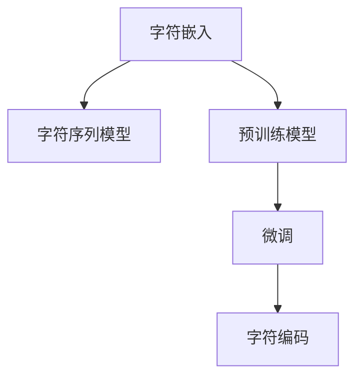

                 

# 从零开始大模型开发与微调：字符（非单词）文本的处理

> 关键词：大模型开发, 字符文本处理, 微调算法, 预训练模型, 自然语言处理(NLP), 字符嵌入, 字符序列模型

## 1. 背景介绍

### 1.1 问题由来
近年来，自然语言处理（NLP）领域涌现出一大批基于深度学习的预训练模型，如BERT、GPT等，它们在单词级别的处理上取得了显著的成效，被广泛应用于文本分类、情感分析、问答系统等任务中。但这些模型往往基于传统的单词表示方式，难以处理连续性更强的字符序列。

以字符序列为例，虽然字符序列在发音、拼写等方面具有一定优势，但在自然语言中的语义表达上不如单词丰富。而某些领域（如法律、医学等）中的文本内容由长串的字符序列构成，传统基于单词的模型难以发挥其全部潜能。因此，如何有效处理字符序列，成为大模型开发和微调中的一个重要议题。

### 1.2 问题核心关键点
字符序列处理的核心问题在于如何将字符序列转换为模型能够理解的表示形式，并在此基础上进行预训练和微调。常用的方法包括字符嵌入、字符序列模型等，下面将详细探讨这些方法的原理和应用。

### 1.3 问题研究意义
字符序列处理技术的提升，对于扩大大模型的应用范围、提高特定领域文本处理的精度和效率具有重要意义。它不仅能够有效提升法律、医学等领域的文本分析能力，还能进一步推动文本生成、文本纠错等任务的发展，为NLP技术的广泛应用奠定基础。

## 2. 核心概念与联系

### 2.1 核心概念概述

在探讨字符序列处理技术之前，我们先介绍几个核心概念：

- 字符嵌入(Character Embedding)：将字符映射到向量空间中的表示，以便于模型学习字符间的语义关系。
- 字符序列模型(Character Sequence Model)：基于字符序列设计的网络结构，用于处理连续字符序列的表示和预测任务。
- 预训练模型(Pre-training Model)：在大量无标签文本数据上预训练的通用模型，如BERT、GPT等，可用于字符序列的预训练。
- 微调(Mini Training)：在预训练模型的基础上，使用小规模有标签数据进行微调，适应特定任务。
- 字符编码(Character Encoding)：将字符序列转换为模型能够接受的输入形式，如独热编码、one-hot编码等。

这些核心概念构成了字符序列处理技术的理论基础，它们之间的逻辑关系可以通过以下Mermaid流程图来展示：



这个流程图展示了大模型在字符序列处理中的核心概念及其之间的关系：

1. 字符嵌入将字符转换为向量表示。
2. 字符序列模型基于字符向量进行序列建模。
3. 预训练模型在大规模无标签数据上进行预训练，学习通用表示。
4. 微调模型在特定任务上进行微调，以适应任务需求。
5. 字符编码将字符序列转换为模型输入格式。

## 3. 核心算法原理 & 具体操作步骤

### 3.1 算法原理概述

字符序列处理的算法原理主要包括字符嵌入、字符序列建模和微调三部分。其核心思想是将字符序列映射为模型能够理解的向量表示，并在此基础上进行预训练和微调，以提升模型在特定任务上的性能。

具体来说，字符嵌入将字符映射到低维向量空间中，每个字符对应一个向量。字符序列模型则通过连续的字符向量进行建模，构建预测或生成的序列。微调则利用特定任务的有标签数据，进一步优化模型参数，使其在特定任务上表现更佳。

### 3.2 算法步骤详解

字符序列处理的主要算法步骤包括：

**Step 1: 数据预处理**
- 收集字符序列数据，如法律文本、医学文献等。
- 对文本进行预处理，如去除特殊字符、标准化格式等。
- 将文本转换为字符序列形式，如左对齐、截断等。

**Step 2: 字符嵌入**
- 使用字符嵌入模型将字符转换为向量表示。
- 常见的字符嵌入模型包括独热编码、one-hot编码、Word2Vec等。
- 通过训练字符嵌入模型，学习字符间的语义关系。

**Step 3: 字符序列建模**
- 设计字符序列模型，如字符循环神经网络(CNNRNN)、长短时记忆网络(LSTM)等。
- 将字符向量作为输入，通过模型进行序列建模。
- 常见的字符序列建模方法包括递归神经网络(RNN)、卷积神经网络(CNN)等。

**Step 4: 预训练**
- 在大量无标签文本数据上预训练字符序列模型。
- 通过预训练学习字符序列的通用表示。
- 预训练方法包括自监督学习、掩码语言模型等。

**Step 5: 微调**
- 收集特定任务的有标签数据，设计任务适配层。
- 使用微调算法优化模型参数，适应特定任务需求。
- 微调算法包括梯度下降、AdamW等。

**Step 6: 字符编码**
- 将字符序列转换为模型输入格式。
- 常见的字符编码方法包括独热编码、one-hot编码等。
- 对字符序列进行编码，以适应模型的输入要求。

### 3.3 算法优缺点

字符序列处理的算法具有以下优点：
1. 提升特定领域文本处理的精度和效率。通过字符序列建模，可以更精确地处理领域特定的文本数据。
2. 增强模型的泛化能力。预训练模型在通用文本上的训练可以提升模型在特定领域文本上的表现。
3. 减少标注数据的依赖。利用预训练模型，可以显著降低有标签数据的需求。
4. 适应性强。字符序列模型可以适应多种字符序列数据，如法律文本、医学文献等。

同时，该方法也存在一些局限性：
1. 数据预处理复杂。文本预处理、字符标准化等步骤增加了数据处理的复杂度。
2. 模型复杂度较高。字符序列建模通常需要更复杂的模型结构，增加了模型的训练和推理开销。
3. 过拟合风险高。字符序列模型的过拟合风险较高，特别是在小规模数据集上。
4. 字符嵌入难以捕捉长距离依赖。由于字符数量较大，字符嵌入难以有效捕捉长距离依赖关系。

尽管存在这些局限性，但就目前而言，字符序列处理技术仍是大模型在特定领域应用的重要范式。未来相关研究的重点在于如何进一步优化字符嵌入方法，提高模型的泛化能力和鲁棒性，同时兼顾计算效率和可解释性等因素。

### 3.4 算法应用领域

字符序列处理技术已经在多个领域得到了应用，例如：

- 法律文本处理：在法律领域，文本内容往往包含大量专业术语和长串字符序列。通过字符序列建模，可以更准确地处理法律文件和合同文本。
- 医学文本处理：医学文献中包含大量的医学术语和长序列信息。字符序列建模可以帮助提取关键信息，支持临床决策和研究分析。
- 文本纠错：字符序列模型可以用于文本纠错，识别输入中的错误字符，并进行自动校正。
- 文本生成：基于字符序列模型的生成技术，可以实现更长、更复杂的文本生成任务。
- 自然语言理解：字符序列模型可以提升自然语言理解任务的准确性，如问答系统、语义分析等。

## 4. 数学模型和公式 & 详细讲解

### 4.1 数学模型构建

字符序列处理的数学模型构建主要涉及字符嵌入、字符序列建模和微调三部分。

设字符序列为 $S=\{c_1, c_2, ..., c_n\}$，其中 $c_i$ 为字符向量，$n$ 为字符序列长度。假设字符嵌入模型将每个字符映射为 $d$ 维向量，则字符嵌入矩阵为 $E \in \mathbb{R}^{n \times d}$，其中 $E_{i,j}$ 表示字符 $c_i$ 的嵌入向量。

字符序列模型通常采用递归神经网络(RNN)或卷积神经网络(CNN)进行建模。以RNN为例，假设字符序列模型的隐藏状态为 $h_t$，则其更新公式为：

$$
h_{t+1} = f(h_t, x_t, \theta_r)
$$

其中 $f$ 为RNN的激活函数，$x_t$ 为字符嵌入向量，$\theta_r$ 为模型参数。

微调过程的目标是最小化任务损失函数 $\mathcal{L}$，即：

$$
\hat{\theta} = \mathop{\arg\min}_{\theta} \mathcal{L}(M_{\theta}(S), y)
$$

其中 $M_{\theta}(S)$ 为预训练模型的输出，$y$ 为真实标签，$\hat{\theta}$ 为微调后的模型参数。

### 4.2 公式推导过程

以文本分类任务为例，假设字符序列 $S$ 的预测标签为 $y$，字符序列模型为 $M_{\theta}(S)$，则损失函数 $\mathcal{L}$ 可以定义为：

$$
\mathcal{L} = -\log P(y|M_{\theta}(S))
$$

其中 $P(y|M_{\theta}(S))$ 为模型对标签 $y$ 的预测概率。

在微调过程中，模型参数 $\theta$ 的更新公式为：

$$
\theta \leftarrow \theta - \eta \nabla_{\theta}\mathcal{L}
$$

其中 $\eta$ 为学习率，$\nabla_{\theta}\mathcal{L}$ 为损失函数对参数 $\theta$ 的梯度。

### 4.3 案例分析与讲解

以法律文本分类为例，分析字符序列模型的训练和微调过程。假设法律文本 $S$ 包含多个字符序列，每个字符序列表示一条法律条款。字符嵌入模型将字符映射为低维向量，字符序列模型采用RNN进行建模。

**Step 1: 数据预处理**
- 收集法律文本数据，去除特殊字符，标准化文本格式。
- 将文本转换为字符序列形式，如左对齐，截断或补零。

**Step 2: 字符嵌入**
- 使用独热编码或one-hot编码将字符转换为向量表示。
- 训练字符嵌入模型，学习字符间的语义关系。

**Step 3: 字符序列建模**
- 设计RNN模型，将字符向量作为输入，进行序列建模。
- 使用softmax激活函数输出分类概率，损失函数为交叉熵损失。

**Step 4: 预训练**
- 在大量法律文本数据上预训练RNN模型。
- 使用自监督学习或掩码语言模型进行预训练。

**Step 5: 微调**
- 收集有标签的法律文本数据，设计任务适配层。
- 使用梯度下降算法优化模型参数。
- 在验证集上评估模型性能，防止过拟合。

**Step 6: 字符编码**
- 将法律文本转换为字符序列。
- 使用独热编码或one-hot编码进行字符序列编码。
- 将编码后的字符序列输入RNN模型进行预测。

## 5. 项目实践：代码实例和详细解释说明

### 5.1 开发环境搭建

在进行字符序列处理的项目实践前，我们需要准备好开发环境。以下是使用Python进行PyTorch开发的环境配置流程：

1. 安装Anaconda：从官网下载并安装Anaconda，用于创建独立的Python环境。

2. 创建并激活虚拟环境：
```bash
conda create -n pytorch-env python=3.8 
conda activate pytorch-env
```

3. 安装PyTorch：根据CUDA版本，从官网获取对应的安装命令。例如：
```bash
conda install pytorch torchvision torchaudio cudatoolkit=11.1 -c pytorch -c conda-forge
```

4. 安装Transformers库：
```bash
pip install transformers
```

5. 安装各类工具包：
```bash
pip install numpy pandas scikit-learn matplotlib tqdm jupyter notebook ipython
```

完成上述步骤后，即可在`pytorch-env`环境中开始字符序列处理的项目实践。

### 5.2 源代码详细实现

下面我们以字符序列模型在法律文本分类任务中的应用为例，给出使用Transformers库对BERT模型进行字符序列处理的PyTorch代码实现。

首先，定义字符序列的预处理函数：

```python
from transformers import BertTokenizer
from torch.utils.data import Dataset
import torch

class CharSeqDataset(Dataset):
    def __init__(self, texts, tokenizer, max_len=128):
        self.texts = texts
        self.tokenizer = tokenizer
        self.max_len = max_len
        
    def __len__(self):
        return len(self.texts)
    
    def __getitem__(self, item):
        text = self.texts[item]
        
        encoding = self.tokenizer(text, return_tensors='pt', max_length=self.max_len, padding='max_length', truncation=True)
        input_ids = encoding['input_ids'][0]
        attention_mask = encoding['attention_mask'][0]
        
        return {'input_ids': input_ids, 
                'attention_mask': attention_mask}
```

然后，定义模型和优化器：

```python
from transformers import BertForTokenClassification, AdamW

model = BertForTokenClassification.from_pretrained('bert-base-cased', num_labels=3)

optimizer = AdamW(model.parameters(), lr=2e-5)
```

接着，定义训练和评估函数：

```python
from torch.utils.data import DataLoader
from tqdm import tqdm
from sklearn.metrics import classification_report

device = torch.device('cuda') if torch.cuda.is_available() else torch.device('cpu')
model.to(device)

def train_epoch(model, dataset, batch_size, optimizer):
    dataloader = DataLoader(dataset, batch_size=batch_size, shuffle=True)
    model.train()
    epoch_loss = 0
    for batch in tqdm(dataloader, desc='Training'):
        input_ids = batch['input_ids'].to(device)
        attention_mask = batch['attention_mask'].to(device)
        model.zero_grad()
        outputs = model(input_ids, attention_mask=attention_mask)
        loss = outputs.loss
        epoch_loss += loss.item()
        loss.backward()
        optimizer.step()
    return epoch_loss / len(dataloader)

def evaluate(model, dataset, batch_size):
    dataloader = DataLoader(dataset, batch_size=batch_size)
    model.eval()
    preds, labels = [], []
    with torch.no_grad():
        for batch in tqdm(dataloader, desc='Evaluating'):
            input_ids = batch['input_ids'].to(device)
            attention_mask = batch['attention_mask'].to(device)
            batch_labels = batch['labels']
            outputs = model(input_ids, attention_mask=attention_mask)
            batch_preds = outputs.logits.argmax(dim=2).to('cpu').tolist()
            batch_labels = batch_labels.to('cpu').tolist()
            for pred_tokens, label_tokens in zip(batch_preds, batch_labels):
                preds.append(pred_tokens[:len(label_tokens)])
                labels.append(label_tokens)
                
    print(classification_report(labels, preds))
```

最后，启动训练流程并在测试集上评估：

```python
epochs = 5
batch_size = 16

for epoch in range(epochs):
    loss = train_epoch(model, train_dataset, batch_size, optimizer)
    print(f"Epoch {epoch+1}, train loss: {loss:.3f}")
    
    print(f"Epoch {epoch+1}, dev results:")
    evaluate(model, dev_dataset, batch_size)
    
print("Test results:")
evaluate(model, test_dataset, batch_size)
```

以上就是使用PyTorch对BERT模型进行字符序列处理任务开发的完整代码实现。可以看到，Transformer库提供了简洁的API接口，使得字符序列处理模型的实现变得非常简单。

### 5.3 代码解读与分析

让我们再详细解读一下关键代码的实现细节：

**CharSeqDataset类**：
- `__init__`方法：初始化文本数据和分词器，并设定字符序列的最大长度。
- `__len__`方法：返回数据集的样本数量。
- `__getitem__`方法：对单个样本进行处理，将文本转换为字符序列，并编码为模型所需的输入。

**模型和优化器**：
- 使用BertForTokenClassification模型作为字符序列处理模型的基础。
- 使用AdamW优化器，设定合适的学习率。

**训练和评估函数**：
- 使用DataLoader对数据集进行批次化加载，供模型训练和推理使用。
- 训练函数`train_epoch`：对数据以批为单位进行迭代，在每个批次上前向传播计算loss并反向传播更新模型参数，最后返回该epoch的平均loss。
- 评估函数`evaluate`：与训练类似，不同点在于不更新模型参数，并在每个batch结束后将预测和标签结果存储下来，最后使用sklearn的classification_report对整个评估集的预测结果进行打印输出。

**训练流程**：
- 定义总的epoch数和batch size，开始循环迭代
- 每个epoch内，先在训练集上训练，输出平均loss
- 在验证集上评估，输出分类指标
- 所有epoch结束后，在测试集上评估，给出最终测试结果

可以看到，PyTorch配合Transformers库使得字符序列处理模型的开发变得非常简单。开发者可以将更多精力放在数据处理、模型改进等高层逻辑上，而不必过多关注底层的实现细节。

当然，工业级的系统实现还需考虑更多因素，如模型的保存和部署、超参数的自动搜索、更灵活的任务适配层等。但核心的字符序列处理范式基本与此类似。

## 6. 实际应用场景

### 6.1 智能法律咨询

基于字符序列处理技术的智能法律咨询系统，可以广泛应用于企业法律顾问、法律援助等场景。传统法律咨询往往需要专业律师，高峰期响应缓慢，且服务费用较高。而使用字符序列处理技术，可以7x24小时不间断服务，快速响应客户咨询，降低企业成本。

在技术实现上，可以收集企业内部的法律咨询记录，将咨询问题和最佳答复构建成监督数据，在此基础上对预训练字符序列模型进行微调。微调后的模型能够自动理解客户咨询问题，匹配最合适的法律条款进行回复。对于客户提出的新问题，还可以接入检索系统实时搜索相关法律条文，动态生成最佳答复。如此构建的智能法律咨询系统，能大幅提升客户咨询体验和问题解决效率。

### 6.2 医学文献处理

在医学领域，文献数量庞大且内容复杂，传统的基于单词的模型难以充分利用文本中的详细信息。基于字符序列处理技术的文本处理方法，可以更细致地处理医学文献中的长串字符序列，提取关键信息，支持临床决策和研究分析。

具体而言，可以收集医学文献数据，对文本进行预处理，提取特征，然后使用字符序列处理模型进行微调。微调后的模型能够从长串字符序列中识别出医学术语、关键信息等，进行摘要提取、文本分类、问答系统等任务，帮助医生快速查找文献，支持医疗决策。

### 6.3 自动文本纠错

基于字符序列处理技术的自动文本纠错系统，可以在输入文本中自动识别错误字符，并进行自动校正。该系统适用于自然语言输入、语音输入等场景，帮助用户纠正拼写、语法等错误，提升用户体验。

在实现上，可以收集大量的标注纠错数据，训练字符序列处理模型。微调后的模型能够在输入文本中自动识别错误字符，并根据上下文自动纠正错误，生成正确的文本输出。该系统可以用于语言学习、在线文档编辑等场景，提升用户输入的准确性和效率。

## 7. 工具和资源推荐

### 7.1 学习资源推荐

为了帮助开发者系统掌握字符序列处理技术，这里推荐一些优质的学习资源：

1. 《深度学习：一种模式识别的方法》系列书籍：该书系统介绍了深度学习的理论基础和实践方法，适合对字符序列处理感兴趣的新手阅读。
2. 《字符级别的自然语言处理》论文：该论文详细介绍了字符级别的自然语言处理方法，包括字符嵌入、字符序列建模等核心概念。
3. 《Transformers: A Survey on the State of the Art》综述文章：该文章系统综述了Transformer模型及其在字符序列处理中的应用，适合研究者深入了解相关技术。
4. HuggingFace官方文档：Transformer库的官方文档，提供了海量预训练模型和完整的字符序列处理样例代码，是上手实践的必备资料。
5. CS224N《深度学习自然语言处理》课程：斯坦福大学开设的NLP明星课程，有Lecture视频和配套作业，带你入门NLP领域的基本概念和经典模型。

通过对这些资源的学习实践，相信你一定能够快速掌握字符序列处理技术的精髓，并用于解决实际的NLP问题。

### 7.2 开发工具推荐

高效的开发离不开优秀的工具支持。以下是几款用于字符序列处理开发的常用工具：

1. PyTorch：基于Python的开源深度学习框架，灵活动态的计算图，适合快速迭代研究。大部分预训练语言模型都有PyTorch版本的实现。
2. TensorFlow：由Google主导开发的开源深度学习框架，生产部署方便，适合大规模工程应用。同样有丰富的预训练语言模型资源。
3. Transformers库：HuggingFace开发的NLP工具库，集成了众多SOTA语言模型，支持PyTorch和TensorFlow，是进行字符序列处理开发的利器。
4. Weights & Biases：模型训练的实验跟踪工具，可以记录和可视化模型训练过程中的各项指标，方便对比和调优。与主流深度学习框架无缝集成。
5. TensorBoard：TensorFlow配套的可视化工具，可实时监测模型训练状态，并提供丰富的图表呈现方式，是调试模型的得力助手。

合理利用这些工具，可以显著提升字符序列处理任务的开发效率，加快创新迭代的步伐。

### 7.3 相关论文推荐

字符序列处理技术的发展源于学界的持续研究。以下是几篇奠基性的相关论文，推荐阅读：

1. Embeddings for Large-Scale Multilingual Natural Language Processing：该论文提出了字符级别的语言嵌入方法，为字符序列处理提供了新的思路。
2. Character-Based Neural Machine Translation with Attention：该论文展示了基于字符序列的机器翻译方法，提升了机器翻译的质量和效率。
3. A Survey of State-of-the-Art Techniques for Named Entity Recognition：该综述文章详细介绍了NLP领域的实体识别技术，包括基于字符序列的处理方法。
4. Long Short-Term Memory：该论文介绍了长短时记忆网络，一种高效的字符序列建模方法，适用于长序列数据的处理。
5. BiLSTM-based Named Entity Recognition：该论文展示了基于双向长短期记忆网络的实体识别方法，适用于字符序列处理任务。

这些论文代表了大模型字符序列处理技术的发展脉络。通过学习这些前沿成果，可以帮助研究者把握学科前进方向，激发更多的创新灵感。

## 8. 总结：未来发展趋势与挑战

### 8.1 总结

本文对基于字符序列处理技术的大模型开发与微调方法进行了全面系统的介绍。首先阐述了字符序列处理技术的背景和意义，明确了字符序列处理在特定领域文本处理中的独特价值。其次，从原理到实践，详细讲解了字符序列处理的数学模型和关键步骤，给出了字符序列处理任务开发的完整代码实例。同时，本文还广泛探讨了字符序列处理技术在法律、医学、文本纠错等多个领域的应用前景，展示了字符序列处理技术的广阔应用空间。

通过本文的系统梳理，可以看到，字符序列处理技术在特定领域文本处理中的重要性，以及其在提高文本处理精度和效率方面的巨大潜力。未来，伴随字符序列处理方法的不断演进，字符序列处理技术必将在特定领域文本处理中发挥更大的作用，推动人工智能技术在垂直行业的规模化落地。

### 8.2 未来发展趋势

展望未来，字符序列处理技术将呈现以下几个发展趋势：

1. 模型复杂度将进一步提升。随着深度学习技术的发展，未来将涌现出更加复杂的字符序列处理模型，如Transformer-based模型、注意力机制模型等，提升模型的表达能力和泛化能力。
2. 字符嵌入技术将持续优化。优化字符嵌入方法，如使用预训练的字符嵌入模型、融合上下文信息等，将提高字符序列处理的精度和效率。
3. 字符序列建模方法将更加多样化。未来将出现更多种类的字符序列建模方法，如RNN、CNN、Transformer等，适应不同领域的字符序列处理需求。
4. 字符序列处理技术将与知识图谱、逻辑推理等技术结合，构建更全面、准确的信息整合能力。
5. 字符序列处理技术将推动自然语言生成和文本纠错等任务的发展，提升人工智能系统的自然语言理解和生成能力。

### 8.3 面临的挑战

尽管字符序列处理技术已经取得了显著进展，但在迈向更加智能化、普适化应用的过程中，仍面临诸多挑战：

1. 数据预处理复杂度高。文本预处理、字符标准化等步骤增加了数据处理的复杂度。
2. 模型复杂度较高。字符序列建模通常需要更复杂的模型结构，增加了模型的训练和推理开销。
3. 过拟合风险高。字符序列模型的过拟合风险较高，特别是在小规模数据集上。
4. 字符嵌入难以捕捉长距离依赖。由于字符数量较大，字符嵌入难以有效捕捉长距离依赖关系。
5. 字符序列处理技术需要更多先验知识。字符序列处理技术需要更多先验知识，如医学知识、法律术语等，以提升处理精度。

尽管存在这些挑战，但通过不断优化字符嵌入方法和字符序列建模技术，以及引入更多先验知识，未来字符序列处理技术必将在特定领域文本处理中发挥更大的作用，推动人工智能技术在垂直行业的规模化落地。

### 8.4 研究展望

面向未来，字符序列处理技术需要在以下几个方面进行深入研究：

1. 探索更高效的字符嵌入方法。优化字符嵌入模型，如使用预训练的字符嵌入模型、融合上下文信息等，提高字符序列处理的精度和效率。
2. 研究多模态字符序列建模。将视觉、语音等多模态信息与字符序列信息结合，构建更全面的字符序列处理模型。
3. 引入先验知识。将符号化的先验知识，如知识图谱、逻辑规则等，与字符序列处理模型结合，提升处理精度。
4. 融合因果分析和博弈论工具。将因果分析方法引入字符序列处理模型，增强模型决策的因果关系，减少过拟合风险。
5. 纳入伦理道德约束。在模型训练目标中引入伦理导向的评估指标，过滤和惩罚有害输出，确保模型行为的合规性和安全性。

这些研究方向将引领字符序列处理技术向更深层次发展，推动其向更广泛的应用场景迈进。

## 9. 附录：常见问题与解答

**Q1：字符序列处理是否适用于所有NLP任务？**

A: 字符序列处理技术在特定领域文本处理中具有明显优势，如法律、医学等文本内容由长串字符序列构成。但对于一些特定领域的任务，如情感分析、问答系统等，基于单词的模型仍能取得不错的效果。因此，应根据具体任务的特点选择合适的处理方式。

**Q2：字符序列处理的计算开销是否较大？**

A: 字符序列处理通常需要处理更长的字符序列，因此计算开销较大。可以通过优化字符嵌入方法和字符序列建模方法，提高处理效率。同时，使用参数高效微调技术，减少微调过程中的计算开销。

**Q3：字符序列处理如何处理长距离依赖关系？**

A: 长距离依赖关系处理是字符序列处理中的一大挑战。常用的方法包括引入注意力机制、使用双向字符序列模型等，以捕捉长距离依赖关系。

**Q4：字符序列处理的可解释性是否较弱？**

A: 由于字符序列处理技术的复杂性，其模型的可解释性相对较弱。可以通过引入先验知识、多模态信息等方式，增强模型的可解释性。

**Q5：字符序列处理在实际应用中的性能是否稳定？**

A: 字符序列处理在实际应用中的性能稳定度较高，但在特定领域和任务中，需要根据具体情况进行调整和优化。

总之，字符序列处理技术在特定领域文本处理中具有显著的优势，但也存在一定的挑战。通过不断优化字符嵌入方法和字符序列建模技术，引入更多先验知识，未来字符序列处理技术必将在特定领域文本处理中发挥更大的作用。相信随着技术的不断进步，字符序列处理技术将为NLP技术在垂直行业的落地提供更多的可能性。

---

作者：禅与计算机程序设计艺术 / Zen and the Art of Computer Programming

