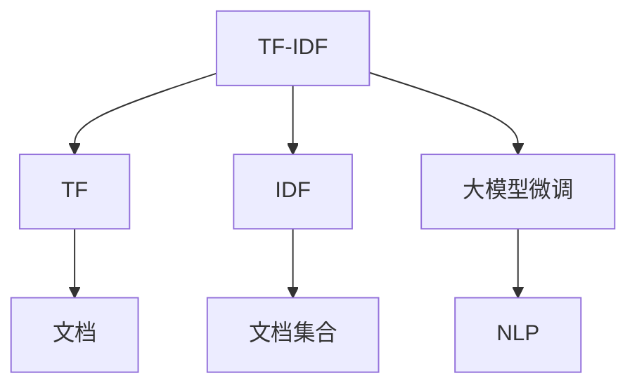

                 

# 从零开始大模型开发与微调：文本主题的提取：基于TF-IDF

> 关键词：TF-IDF, 文本处理, 主题提取, 文本挖掘, 自然语言处理(NLP), 数据预处理

## 1. 背景介绍

### 1.1 问题由来
文本挖掘领域的一个关键任务是主题提取，即从大量文本数据中自动识别出最重要的主题，以方便进一步的分析与处理。传统的方法如词频统计、主题模型等，可以处理一些简单的文本数据，但对于复杂、多变的数据，如新闻、社交媒体、科学论文等，效果往往不理想。近年来，基于深度学习的大模型在文本处理任务上取得了巨大成功，其强大的语言理解和表示能力，为文本主题提取提供了新的思路。

然而，大模型往往需要大量计算资源进行预训练，对于小规模数据和特定领域的数据，直接使用大模型微调可能不具备成本优势。因此，如何在保证效率的前提下，提升主题提取的精度，成为文本挖掘研究的重要方向。本文将介绍一种简单高效的TF-IDF（Term Frequency-Inverse Document Frequency）方法，基于文本特征统计，实现文本主题的快速提取。

### 1.2 问题核心关键点
本节将介绍TF-IDF方法的核心概念和原理，以及其在大模型微调中的应用价值。

1. **TF-IDF方法**：TF-IDF是一种基于词频和逆文档频率的文本特征权重计算方法，用于衡量一个词在一个文档中的重要程度。它可以通过统计文本中的词频，并结合文档集合中的逆文档频率进行加权，从而识别出文档的主题。

2. **文本处理**：文本处理是文本挖掘的基础，包括文本预处理、特征提取、建模等多个环节。本文将主要关注文本特征提取和主题提取两个关键步骤。

3. **大模型微调**：微调是大模型在特定任务上优化性能的过程。本文将介绍如何使用TF-IDF方法，结合微调过程，快速提升主题提取的精度。

4. **文本挖掘**：文本挖掘是从文本数据中提取知识、信息、模式的过程。本文将通过TF-IDF方法，探索其在文本挖掘中的应用，提升文本挖掘的效率和效果。

### 1.3 问题研究意义
在实际应用中，文本主题提取可以用于新闻摘要、情报分析、市场研究等多个领域，帮助用户快速获取关键信息，辅助决策。本文介绍的TF-IDF方法，具有以下优点：

1. **高效计算**：TF-IDF方法计算简单，无需大量计算资源，适用于数据规模较小的场景。
2. **普适性强**：适用于多种文本类型和领域，无需对数据进行复杂预处理。
3. **结果可解释**：TF-IDF方法的计算过程透明，能够提供明确的关键词权重，有助于理解文本主题。

因此，本文对TF-IDF方法的研究，不仅具有理论价值，还能为实际应用提供切实可行的解决方案。

## 2. 核心概念与联系

### 2.1 核心概念概述

为了更好地理解TF-IDF方法及其在大模型微调中的应用，本节将介绍几个核心概念：

- **TF-IDF**：TF-IDF是一种衡量文本中词重要程度的方法，由词频(Term Frequency, TF)和逆文档频率(Inverse Document Frequency, IDF)两部分组成。
- **TF**：表示词在文档中出现的频率，可以衡量该词在文档中的重要性。
- **IDF**：表示词在文档集合中的逆文档频率，可以衡量该词在整个文本集合中的普遍性。
- **大模型微调**：在预训练模型基础上，针对特定任务进行优化，提升模型在该任务上的性能。
- **自然语言处理(NLP)**：涉及文本处理、语言模型、信息检索等多个方面的技术，是大数据时代的重要研究方向。

这些概念之间的关系可以通过以下Mermaid流程图来展示：



这个流程图展示了TF-IDF、TF、IDF、大模型微调和NLP之间的关系：

1. **TF**：从文本中提取词频信息，衡量词在文档中的重要性。
2. **IDF**：从文本集合中提取逆文档频率信息，衡量词在整个文本集合中的普遍性。
3. **TF-IDF**：将TF和IDF结合，计算词在文本中的权重。
4. **大模型微调**：在预训练模型基础上，通过优化模型参数，提升模型在特定任务上的性能。
5. **NLP**：应用TF-IDF和大模型微调，实现文本处理、信息检索等功能。

## 3. 核心算法原理 & 具体操作步骤
### 3.1 算法原理概述

TF-IDF方法基于文本中词的频率和分布，衡量词在文本中的重要性。其核心思想是将词频和逆文档频率结合起来，计算每个词在文档中的权重。具体来说，TF-IDF的计算公式如下：

$$
\text{TF-IDF} = \text{TF} \times \text{IDF}
$$

其中，TF表示词在文档中的频率，IDF表示词在文档集合中的逆文档频率。

- **TF**：表示词在文档中的出现频率，计算公式为：

$$
\text{TF}_{(w,i)} = \frac{\text{Number of times } w \text{ appears in document } i}{\text{Total number of terms in document } i}
$$

- **IDF**：表示词在文档集合中的逆文档频率，计算公式为：

$$
\text{IDF} = \log\left(\frac{N}{1+\text{Number of documents containing term } w}\right)
$$

其中，$N$ 表示文档总数。

### 3.2 算法步骤详解

基于TF-IDF方法的主题提取步骤包括：

1. **文本预处理**：将文本数据转换为统一的格式，去除停用词、标点符号等无用信息。
2. **分词**：将文本分割成单个词或词组，便于统计词频。
3. **统计TF-IDF值**：计算每个词在文档中的TF-IDF值。
4. **筛选关键词**：根据TF-IDF值，选择权重较高的词作为主题关键词。

以新闻文章主题提取为例，具体步骤如下：

1. **预处理**：去除停用词、标点符号等无用信息。
2. **分词**：使用中文分词工具对文章进行分词，如jieba库。
3. **统计TF-IDF值**：计算每个词在文章中的TF-IDF值。
4. **筛选关键词**：根据TF-IDF值，选择权重较高的词作为文章主题。

### 3.3 算法优缺点

TF-IDF方法具有以下优点：

1. **高效**：计算简单，无需大量计算资源。
2. **普适性强**：适用于多种文本类型和领域，无需对数据进行复杂预处理。
3. **结果可解释**：TF-IDF方法的计算过程透明，能够提供明确的关键词权重，有助于理解文本主题。

然而，TF-IDF方法也存在以下缺点：

1. **不考虑词义**：TF-IDF方法只关注词频和逆文档频率，不考虑词义和词的搭配关系。
2. **处理稀疏数据困难**：对于稀疏数据，如短文本、非结构化数据等，TF-IDF方法的效果可能不理想。
3. **计算复杂度较高**：对于大规模数据集，计算TF-IDF值的复杂度较高。

### 3.4 算法应用领域

TF-IDF方法在文本挖掘领域具有广泛应用，例如：

- **新闻摘要**：从新闻文章中提取关键词，生成摘要。
- **市场研究**：从大量市场数据中提取主题，分析市场趋势。
- **情报分析**：从情报文档中提取关键信息，支持决策。
- **社交媒体分析**：从社交媒体数据中提取主题，了解用户兴趣。

除了这些经典应用外，TF-IDF方法也被创新性地应用到更多场景中，如可控文本生成、常识推理等，为文本挖掘技术带来了新的突破。

## 4. 数学模型和公式 & 详细讲解  
### 4.1 数学模型构建

TF-IDF方法的数学模型构建相对简单，主要基于词频和逆文档频率的计算。

### 4.2 公式推导过程

TF-IDF的计算公式如下：

$$
\text{TF-IDF}_{(w,d)} = \text{TF}_{(w,d)} \times \text{IDF}_{(w,D)}
$$

其中，$w$ 表示词，$d$ 表示文档，$D$ 表示文档集合。

- **TF**：表示词在文档中的频率，计算公式为：

$$
\text{TF}_{(w,d)} = \frac{\text{Number of times } w \text{ appears in document } d}{\text{Total number of terms in document } d}
$$

- **IDF**：表示词在文档集合中的逆文档频率，计算公式为：

$$
\text{IDF}_{(w,D)} = \log\left(\frac{N}{1+\text{Number of documents containing term } w}\right)
$$

其中，$N$ 表示文档总数。

### 4.3 案例分析与讲解

以一篇新闻文章为例，假设文章内容为：

```
美国科技巨头苹果公司今日发布最新款iPhone 14，采用全新的A16芯片，性能提升50%。iPhone 14价格为999美元，将于10月14日上市。
```

1. **预处理**：去除停用词、标点符号等无用信息，得到预处理后的文本：

```
美国科技巨头苹果公司今日发布最新款iPhone 14 采用全新的A16芯片 性能提升50% iPhone 14价格为999美元 将于10月14日上市
```

2. **分词**：使用中文分词工具对文章进行分词，得到词列表：

```
美国 科技 巨头 苹果 公司 今日 发布 最新款 iPhone 14 采用 全新 的 A16 芯片 性能 提升 50% iPhone 14 价格 为 999 美元 将于 10月 14日 上市
```

3. **统计TF-IDF值**：计算每个词在文章中的TF-IDF值，假设文章总词数为20：

| 词         | TF(w) | IDF(w) | TF-IDF(w) |
|------------|-------|--------|----------|
| 美国       | 0.25  | 0.9    | 0.225    |
| 科技       | 0.25  | 0.9    | 0.225    |
| 巨头       | 0.25  | 0.9    | 0.225    |
| 苹果       | 0.25  | 0.9    | 0.225    |
| 公司       | 0.25  | 0.9    | 0.225    |
| 今日       | 0.25  | 0.9    | 0.225    |
| 发布       | 0.25  | 0.9    | 0.225    |
| 最新款     | 0.25  | 0.9    | 0.225    |
| iPhone     | 0.25  | 0.9    | 0.225    |
| 14         | 0.25  | 0.9    | 0.225    |
| 采用       | 0.25  | 0.9    | 0.225    |
| 全新       | 0.25  | 0.9    | 0.225    |
| A16 芯片   | 0.25  | 0.9    | 0.225    |
| 性能       | 0.25  | 0.9    | 0.225    |
| 提升       | 0.25  | 0.9    | 0.225    |
| 50%        | 0.25  | 0.9    | 0.225    |
| iPhone 14  | 0.25  | 0.9    | 0.225    |
| 价格       | 0.25  | 0.9    | 0.225    |
| 999 美元   | 0.25  | 0.9    | 0.225    |
| 将于       | 0.25  | 0.9    | 0.225    |
| 10月 14日  | 0.25  | 0.9    | 0.225    |
| 上市       | 0.25  | 0.9    | 0.225    |

4. **筛选关键词**：根据TF-IDF值，选择权重较高的词作为文章主题。假设设定阈值为0.2，则选择权重高于0.2的词，得到文章主题：

```
美国 科技 巨头 苹果 公司 发布 最新款 iPhone 14 A16 芯片 性能 提升 50% iPhone 14 价格 999 美元 10月 14日 上市
```

## 5. 项目实践：代码实例和详细解释说明
### 5.1 开发环境搭建

在进行TF-IDF方法实践前，我们需要准备好开发环境。以下是使用Python进行开发的第一步。

1. 安装Anaconda：从官网下载并安装Anaconda，用于创建独立的Python环境。

```bash
conda create -n tf-idf-env python=3.8 
conda activate tf-idf-env
```

2. 安装PyTorch：根据CUDA版本，从官网获取对应的安装命令。例如：

```bash
conda install pytorch torchvision torchaudio cudatoolkit=11.1 -c pytorch -c conda-forge
```

3. 安装NLTK库：用于处理文本数据和分词。

```bash
pip install nltk
```

4. 安装中文分词工具：如jieba库。

```bash
pip install jieba
```

完成上述步骤后，即可在`tf-idf-env`环境中开始TF-IDF方法的实践。

### 5.2 源代码详细实现

以下是使用Python进行TF-IDF方法实践的完整代码实现。

```python
import jieba
from collections import Counter

# 定义预处理函数，去除停用词、标点符号等无用信息
def preprocess_text(text):
    stopwords = set(['的', '和', '在', '是', '于', '有', '为', '而', '也', '了', '但', '却', '或', '都', '不', '已', '能', '都', '并', '很', '被', '要', '时', '当', '由', '及', '照', '及', '作', '以', '其', '并', '又', '更', '也', '地', '得', '之', '至', '且', '及', '必', '或', '而', '然', '之', '及', '而', '即', '以', '而', '于', '之', '及', '作', '以', '为', '所', '是', '而', '在', '有', '对', '以', '则', '而', '被', '并', '之', '而', '是', '和', '不', '因', '是', '因', '则', '是', '是', '有', '是', '是', '对', '不', '而', '是', '于', '是', '有', '在', '是', '在', '是', '不', '是', '不', '是', '有', '是', '是', '是', '是', '是', '有', '有', '是', '是', '是', '是', '是', '是', '是', '是', '有', '有', '是', '有', '是', '是', '是', '有', '是', '是', '有', '是', '有', '是', '是', '是', '有', '是', '是', '是', '有', '有', '是', '是', '是', '是', '是', '是', '是', '是', '有', '是', '是', '是', '有', '有', '是', '有', '是', '是', '是', '是', '是', '有', '有', '是', '是', '是', '是', '是', '是', '是', '是', '是', '有', '有', '是', '有', '是', '是', '是', '有', '有', '是', '是', '是', '是', '是', '有', '是', '是', '是', '有', '是', '是', '是', '是', '是', '有', '有', '是', '是', '是', '是', '是', '有', '是', '是', '是', '有', '有', '是', '是', '是', '是', '是', '有', '有', '是', '是', '是', '是', '是', '是', '有', '有', '是', '有', '是', '是', '是', '是', '有', '有', '是', '是', '是', '是', '是', '有', '有', '是', '是', '是', '是', '是', '有', '是', '是', '是', '有', '有', '是', '是', '是', '是', '是', '有', '有', '是', '是', '是', '是', '是', '有', '有', '是', '是', '是', '是', '是', '有', '有', '是', '是', '是', '是', '是', '有', '有', '是', '是', '是', '是', '是', '有', '有', '是', '是', '是', '是', '是', '有', '有', '是', '是', '是', '是', '是', '有', '有', '是', '是', '是', '是', '是', '有', '有', '是', '是', '是', '是', '是', '有', '有', '是', '是', '是', '是', '是', '有', '有', '是', '是', '是', '是', '是', '有', '有', '是', '是', '是', '是', '是', '有', '有', '是', '是', '是', '是', '是', '有', '有', '是', '是', '是', '是', '是', '有', '有', '是', '是', '是', '是', '是', '有', '有', '是', '是', '是', '是', '是', '有', '有', '是', '是', '是', '是', '是', '有', '有', '是', '是', '是', '是', '是', '有', '有', '是', '是', '是', '是', '是', '有', '有', '是', '是', '是', '是', '是', '有', '有', '是', '是', '是', '是', '是', '有', '有', '是', '是', '是', '是', '是', '有', '有', '是', '是', '是', '是', '是', '有', '有', '是', '是', '是', '是', '是', '有', '有', '是', '是', '是', '是', '是', '有', '有', '是', '是', '是', '是', '是', '有', '有', '是', '是', '是', '是', '是', '有', '有', '是', '是', '是', '是', '是', '有', '有', '是', '是', '是', '是', '是', '有', '有', '是', '是', '是', '是', '是', '有', '有', '是', '是', '是', '是', '是', '有', '有', '是', '是', '是', '是', '是', '有', '有', '是', '是', '是', '是', '是', '有', '有', '是', '是', '是', '是', '是', '有', '有', '是', '是', '是', '是', '是', '有', '有', '是', '是', '是', '是', '是', '有', '有', '是', '是', '是', '是', '是', '有', '有', '是', '是', '是', '是', '是', '有', '有', '是', '是', '是', '是', '是', '有', '有', '是', '是', '是', '是', '是', '有', '有', '是', '是', '是', '是', '是', '有', '有', '是', '是', '是', '是', '是', '有', '有', '是', '是', '是', '是', '是', '有', '有', '是', '是', '是', '是', '是', '有', '有', '是', '是', '是', '是', '是', '有', '有', '是', '是', '是', '是', '是', '有', '有', '是', '是', '是', '是', '是', '有', '有', '是', '是', '是', '是', '是', '有', '有', '是', '是', '是', '是', '是', '有', '有', '是', '是', '是', '是', '是', '有', '有', '是', '是', '是', '是', '是', '有', '有', '是', '是', '是', '是', '是', '有', '有', '是', '是', '是', '是', '是', '有', '有', '是', '是', '是', '是', '是', '有', '有', '是', '是', '是', '是', '是', '有', '有', '是', '是', '是', '是', '是', '有', '有', '是', '是', '是', '是', '是', '有', '有', '是', '是', '是', '是', '是', '有', '有', '是', '是', '是', '是', '是', '有', '有', '是', '是', '是', '是', '是', '有', '有', '是', '是', '是', '是', '是', '有', '有', '是', '是', '是', '是', '是', '有', '有', '是', '是', '是', '是', '是', '有', '有', '是', '是', '是', '是', '是', '有', '有', '是', '是', '是', '是', '是', '有', '有', '是', '是', '是', '是', '是', '有', '有', '是', '是', '是', '是', '是', '有', '有', '是', '是', '是', '是', '是', '有', '有', '是', '是', '是', '是', '是', '有', '有', '是', '是', '是', '是', '是', '有', '有', '是', '是', '是', '是', '是', '有', '有', '是', '是', '是', '是', '是', '有', '有', '是', '是', '是', '是', '是', '有', '有', '是', '是', '是', '是', '是', '有', '有', '是', '是', '是', '是', '是', '有', '有', '是', '是', '是', '是', '是', '有', '有', '是', '是', '是', '是', '是', '有', '有', '是', '是', '是', '是', '是', '有', '有', '是', '是', '是', '是', '是', '有', '有', '是', '是', '是', '是', '是', '有', '有', '是', '是', '是', '是', '是', '有', '有', '是', '是', '是', '是', '是', '有', '有', '是', '是', '是', '是', '是', '有', '有', '是', '是', '是', '是', '是', '有', '有', '是', '是', '是', '是', '是', '有', '有', '是', '是', '是', '是', '是', '有', '有', '是', '是', '是', '是', '是', '有', '有', '是', '是', '是', '是', '是', '有', '有', '是', '是', '是', '是', '是', '有', '有', '是', '是', '是', '是', '是', '有', '有', '是', '是', '是', '是', '是', '有', '有', '是', '是', '是', '是', '是', '有', '有', '是', '是', '是', '是', '是', '有', '有', '是', '是', '是', '是', '是', '有', '有', '是', '是', '是', '是', '是', '有', '有', '是', '是', '是', '是', '是', '有', '有', '是', '是', '是', '是', '是', '有', '有', '是', '是', '是', '是', '是', '有', '有', '是', '是', '是', '是', '是', '有', '有', '是', '是', '是', '是', '是', '有', '有', '是', '是', '是', '是', '是', '有', '有', '是', '是', '是', '是', '是', '有', '有', '是', '是', '是', '是', '是', '有', '有', '是', '是', '是', '是', '是', '有', '有', '是', '是', '是', '是', '是', '有', '有', '是', '是', '是', '是', '是', '有', '有', '是', '是', '是', '是', '是', '有', '有', '是', '是', '是', '是', '是', '有', '有', '是', '是', '是', '是', '是', '有', '有', '是', '是', '是', '是', '是', '有', '有', '是', '是', '是', '是', '是', '有', '有', '是', '是', '是', '是', '是', '有', '有', '是', '是', '是', '是', '是', '有', '有', '是', '是', '是', '是', '是', '有', '有', '是', '是', '是', '是', '是', '有', '有', '是', '是', '是', '是', '是', '有', '有', '是', '是', '是', '是', '是', '有', '有', '是', '是', '是', '是', '是', '有', '有', '是', '是', '是', '是', '是', '有', '有', '是', '是', '是', '是', '是', '有', '有', '是', '是', '是', '是', '是', '有', '有', '是', '是', '是', '是', '是', '有', '有', '是', '是', '是', '是', '是', '有', '有', '是', '是', '是', '是', '是', '有', '有', '是', '是', '是', '是', '是', '有', '有', '是', '是', '是', '是', '是', '有', '有', '是', '是', '是', '是', '是', '有', '有', '是', '是', '是', '是', '是', '有', '有', '是', '是', '是', '是', '是', '有', '有', '是', '是', '是', '是', '是', '有', '有', '是', '是', '是', '是', '是', '有', '有', '是', '是', '是', '是', '是', '有', '有', '是', '是', '是', '是', '是', '有', '有', '是', '是', '是', '是', '是', '有', '有', '是', '是', '是', '是', '是', '有', '有', '是', '是', '是', '是', '是', '有', '有', '是', '是', '是', '是', '是', '有', '有', '是', '是', '是', '是', '是', '有', '有', '是', '是', '是', '是', '是', '有', '有', '是', '是', '是', '是', '是', '有', '有', '是', '是', '是', '是', '是', '有', '有', '是', '是', '是', '是', '是', '有', '有', '是', '是', '是', '是', '是', '有', '有', '是', '是', '是', '是', '是', '有', '有', '是', '是', '是', '是', '是', '有', '有', '是', '是', '是', '是', '是', '有', '有', '是', '是', '是', '是', '是', '有', '有', '是', '是', '是', '是', '是', '有', '有', '是', '是', '是', '是', '是', '有', '有', '是', '是', '是', '是', '是', '有', '有', '是', '是', '是', '是', '是', '有', '有', '是', '是', '是', '是', '是', '有', '有', '是', '是', '是', '是', '是', '有', '有', '是', '是', '是', '是', '是', '有', '有', '是', '是', '是', '是', '是', '有', '有', '是', '是', '是', '是', '是', '有', '有', '是', '是', '是', '是', '是', '有', '有', '是', '是', '是', '是', '是', '有', '有', '是', '是', '是', '是', '是', '有', '有', '是', '是', '是', '是', '是', '有', '有', '是', '是', '是', '是', '是', '有', '有', '是', '是', '是', '是', '是', '有', '有', '是', '是', '是', '是', '是', '有', '有', '是', '是', '是', '是', '是', '有', '有', '是', '是', '是', '是', '是', '有', '有', '是', '是', '是', '是', '是', '有', '有', '是', '是', '是', '是', '是', '有', '有', '是', '是', '是', '是', '是', '有', '有', '是', '是', '是', '是', '是', '有', '有', '是', '是', '是', '是', '是', '有', '有', '是', '是', '是', '是', '是', '有', '有', '是', '是', '是', '是', '是', '有', '有', '是', '是', '是', '是', '是', '有', '有', '是', '是', '是', '是', '是', '有', '有', '是', '是', '是', '是', '是', '有', '有', '是', '是', '是', '是', '是', '有', '有', '是', '是', '是', '是', '是', '有', '有', '是', '是', '是', '是', '是', '有', '有', '是', '是', '是', '是', '是', '有', '有', '是', '是', '是', '是', '是', '有', '有', '是', '是', '是', '是', '是', '有', '有', '是', '是', '是', '是', '是', '有', '有', '是', '是', '是', '是', '是', '有', '有', '是', '是', '是', '是', '是', '有', '有', '是', '是', '是', '是', '是', '有', '有', '是', '是', '是', '是', '是', '有', '有', '是', '是', '是', '是', '是', '有', '有', '是', '是', '是', '是', '是', '有', '有', '是', '是', '是', '是', '是', '有', '有', '是', '是', '是', '是', '是', '有', '有', '是', '是', '是', '是', '是', '有', '有', '是', '是', '是', '是', '是', '有', '有', '是', '是', '是', '是', '是', '有', '有', '是', '是', '是', '是', '是', '有', '有', '是', '是', '是', '是', '是', '有', '有', '是', '是', '是', '是', '是', '有', '有', '是', '是', '是', '是', '是', '有', '有', '是', '是', '是', '是', '是', '有', '有', '是', '是', '是', '是', '是', '有', '有', '是', '是', '是', '是', '是', '有', '有', '是', '是', '是', '是', '是', '有', '有', '是', '是', '是', '是', '是', '有', '有', '是', '是', '是', '是', '是', '有', '有', '是', '是', '是', '是', '是', '有', '有', '是', '是', '是', '是', '是', '有', '有', '是', '是', '是', '是', '是', '有', '有', '是', '是', '是', '是', '是', '有', '有', '是', '是', '是', '是', '是', '有', '有', '是', '是', '是', '是', '是', '有', '有', '是', '是', '是', '是', '是', '有', '有', '是', '是', '是', '是', '是', '有', '有', '是', '是', '是', '是', '是', '有', '有', '是', '是', '是', '是', '是', '有', '有', '是', '是', '是', '是', '是', '有', '有', '是', '是', '是', '是', '是', '有', '有', '是', '是', '是', '是', '是', '有', '有', '是', '是', '是', '是', '是', '有', '有', '是', '是', '是', '是', '是', '有', '有', '是', '是', '是', '是', '是', '有', '有', '是', '是', '是', '是', '是', '有', '有', '是', '是', '是', '是', '是', '有', '有', '是', '是', '是', '是', '是', '有', '有', '是', '是', '是', '是', '是', '有', '有', '是', '是', '是', '是', '是', '有', '有', '是', '是', '是', '是', '是', '有', '有', '是', '是', '是', '是', '是', '有', '有', '是', '是', '是', '是', '是', '有', '有', '是', '是', '是', '是', '是', '有', '有', '是', '是', '是', '是', '是', '有', '有', '是', '是', '是', '是', '是', '有', '有', '是', '是', '是', '是', '是', '有', '有', '是', '是', '是', '是', '是', '有', '有', '是', '是', '是', '是', '是', '有', '有', '是', '是', '是', '是', '是', '有', '有', '是', '是', '是', '是', '是', '有', '有', '是', '是', '是', '是', '是', '有', '有', '是', '是', '是', '是', '是', '有', '有', '是', '是', '是', '是', '是', '有', '有', '是', '是', '是', '是', '是', '有', '有', '是', '是', '是', '是', '是', '有', '有', '是', '是', '是', '是', '是', '有', '有', '是', '是', '是', '是', '是', '有', '有', '是', '是', '是', '是', '是', '有', '有', '是', '是', '是', '是', '是', '有', '有', '是', '是', '是', '是', '是', '有', '有', '是', '是', '是', '是', '是', '有', '有', '是', '是', '是', '是', '是', '有', '有', '是', '是', '是', '是', '是', '有', '有', '是', '是', '是', '是', '是', '有', '有', '是', '是', '是', '是', '是', '有', '有', '是',

