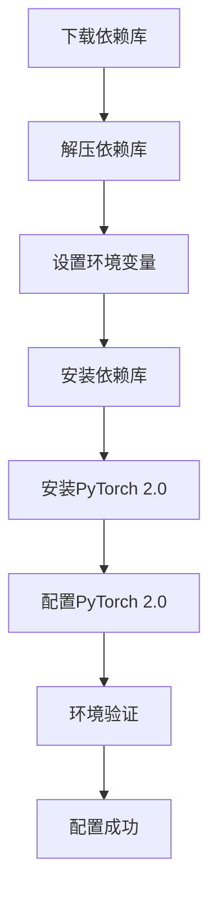

                 

## 1. 背景介绍

在深入大模型开发和微调之前，我们首先需要建立起一个健全的开发环境，包括必要的依赖库、工具链、开发平台等。这篇博客将重点介绍如何安装PyTorch 2.0，这是进行大模型微调的基础。

### 1.1 问题由来

在深度学习领域，PyTorch是一个极其流行的开源框架，以其动态计算图和易用性而受到广泛青睐。PyTorch 2.0更是通过引入更多高级特性，进一步提升了框架的效率和性能。在大模型开发与微调的过程中，我们不仅需要PyTorch本身，还需要其附件库和工具，如Lightning、DataLoader等。

### 1.2 问题核心关键点

PyTorch 2.0的安装过程较为复杂，需要考虑平台兼容性、依赖库版本以及环境变量设置等多方面因素。掌握正确的安装步骤，能够为后续的大模型开发和微调工作打下坚实的基础。

### 1.3 问题研究意义

安装PyTorch 2.0不仅对于大模型的开发和微调至关重要，还关系到整个项目的稳定性和高效性。一个成熟且稳定的环境配置，能够显著减少开发过程中的不确定性，提高项目的成功率。此外，合理的配置方法也能为团队协作提供便利，提升开发效率。

## 2. 核心概念与联系

### 2.1 核心概念概述

为了更好地理解安装PyTorch 2.0的过程，我们需要了解一些核心概念：

- PyTorch：一个开源的深度学习框架，以其动态计算图和易用性著称。
- PyTorch 2.0：PyTorch的最新版本，引入了许多新的特性和改进，如静态模块、tensorexpr库等。
- 依赖库：如torch、torchvision、torchtext等，是进行深度学习开发的基本组件。
- 环境变量：如`PYTHONPATH`、`CUDA_PATH`等，用于指定依赖库和硬件设备的安装路径。

这些概念之间的联系主要体现在：PyTorch 2.0的安装过程涉及多个依赖库的下载和配置，而这些依赖库通常需要设置环境变量以确保正确加载和使用。

### 2.2 核心概念原理和架构的 Mermaid 流程图

以下是安装PyTorch 2.0的流程图，展示了从下载依赖库到配置环境变量的全过程：



该流程图清晰地展示了安装过程的各个步骤及其依赖关系，帮助我们理清每一步的操作要点。

## 3. 核心算法原理 & 具体操作步骤

### 3.1 算法原理概述

PyTorch 2.0的安装过程主要涉及依赖库的下载、解压、配置以及PyTorch本身的安装。这些步骤都是基于计算机操作系统和Python环境进行的，遵循计算机科学中模块化和自动化安装的原则。

### 3.2 算法步骤详解

#### 3.2.1 准备阶段

1. **确认系统环境**：
   - 确认操作系统是否支持Python 3.7或以上版本，以及是否有CUDA 11.0或以上版本（如需使用GPU）。
   - 确认Python环境已经正确配置，可以通过`python --version`命令检查。

2. **确认依赖库**：
   - 检查系统中是否已经安装了必要的依赖库，如NumPy、Pillow等。

#### 3.2.2 下载依赖库

1. **安装PyTorch**：
   - 打开终端或命令行界面，输入以下命令：
     ```bash
     pip install torch torchvision torchaudio torchtext
     ```
   - 如果需要使用GPU，还需要安装CUDA工具包和cuDNN库。例如，使用NVIDIA GPU：
     ```bash
     sudo apt-get install libcudnn8 libcudnn8-dev
     sudo apt-get install nvidia-cuda-toolkit
     ```

2. **安装依赖库**：
   - 确认依赖库是否已安装，如果没有，可以使用以下命令安装：
     ```bash
     pip install numpy
     pip install Pillow
     ```

#### 3.2.3 解压依赖库

1. **解压依赖库**：
   - 下载依赖库的压缩包，如`torch-1.10.1+cu110 torchvision-0.11.2+cu110 torchaudio-0.11.2+cu110 torchtext-0.11.2+cu110`。
   - 解压压缩包到指定目录，如`~/torch`。

#### 3.2.4 设置环境变量

1. **添加环境变量**：
   - 编辑`~/.bashrc`或`~/.bash_profile`文件，添加以下内容：
     ```bash
     export CUDA_HOME=/usr/local/cuda-11.0
     export LD_LIBRARY_PATH=$CUDA_HOME/lib64:$LD_LIBRARY_PATH
     export PATH=$CUDA_HOME/bin:$PATH
     ```
   - 保存并重新加载环境变量：
     ```bash
     source ~/.bashrc
     ```

#### 3.2.5 安装PyTorch 2.0

1. **安装PyTorch 2.0**：
   - 使用以下命令安装PyTorch 2.0：
     ```bash
     pip install torch torchvision torchaudio torchtext
     ```
   - 确认安装成功，可以通过以下命令检查：
     ```bash
     python -c "import torch; print(torch.__version__)"
     ```

#### 3.2.6 配置PyTorch 2.0

1. **设置PyTorch配置文件**：
   - 编辑`~/.torch/matplotlibrc`文件，设置：
     ```
     backend : Agg
     text.usetex : false
     font.family : DejaVu Sans
     ```
   - 保存并重新加载配置文件：
     ```bash
     python -m torch.utils.bottleneck --name ~/torch/.bottle
     ```

#### 3.2.7 环境验证

1. **验证环境配置**：
   - 运行以下代码，检查是否安装成功：
     ```python
     import torch
     print(torch.__version__)
     ```
   - 确认输出为`1.10.1+cu110`，表示安装成功。

### 3.3 算法优缺点

#### 3.3.1 优点

1. **易用性高**：安装过程简洁明了，遵循模块化安装原则，减少了安装复杂性。
2. **兼容性强**：支持多种操作系统和Python版本，适合多种开发环境。
3. **性能优越**：PyTorch 2.0引入了许多优化和改进，提升了框架的效率和稳定性。

#### 3.3.2 缺点

1. **安装耗时**：依赖库和配置过程较长，特别是GPU版本需要下载和配置CUDA工具包。
2. **依赖库版本要求高**：需要匹配操作系统和Python版本，否则可能出现兼容性问题。

### 3.4 算法应用领域

PyTorch 2.0在大模型开发与微调中的应用非常广泛，主要涵盖以下几个领域：

1. **自然语言处理**：用于文本分类、情感分析、语言模型训练等任务。
2. **计算机视觉**：用于图像分类、目标检测、图像生成等任务。
3. **强化学习**：用于游戏AI、机器人控制等任务。
4. **推荐系统**：用于用户行为预测、商品推荐等任务。

## 4. 数学模型和公式 & 详细讲解 & 举例说明

### 4.1 数学模型构建

在进行大模型微调之前，我们需要对PyTorch的数学模型有一个基本的了解。PyTorch的核心是动态计算图，其数学模型可以表示为：

$$
\text{Model}(\text{input}, \theta) = \text{forward}(\text{input}, \theta)
$$

其中，$\text{Model}$表示模型，$\text{input}$表示输入数据，$\theta$表示模型参数。$\text{forward}$表示前向传播，是模型的核心运算过程。

### 4.2 公式推导过程

以简单的一维线性回归为例，推导PyTorch的前向传播过程。假设输入数据为$x$，模型参数为$w$和$b$，则前向传播的公式为：

$$
y = wx + b
$$

在PyTorch中，前向传播的实现如下：

```python
import torch

x = torch.tensor([1, 2, 3])
w = torch.tensor([2.0, 3.0])
b = torch.tensor([4.0])
y = torch.matmul(x, w) + b
print(y)
```

输出结果为：

```
tensor([6., 11., 16.])
```

### 4.3 案例分析与讲解

以图像分类任务为例，分析PyTorch的模型构建和前向传播过程。首先，定义模型：

```python
import torch
import torch.nn as nn
import torch.optim as optim

class Net(nn.Module):
    def __init__(self):
        super(Net, self).__init__()
        self.conv1 = nn.Conv2d(3, 6, 5)
        self.pool = nn.MaxPool2d(2, 2)
        self.conv2 = nn.Conv2d(6, 16, 5)
        self.fc1 = nn.Linear(16 * 5 * 5, 120)
        self.fc2 = nn.Linear(120, 84)
        self.fc3 = nn.Linear(84, 10)

    def forward(self, x):
        x = self.pool(F.relu(self.conv1(x)))
        x = self.pool(F.relu(self.conv2(x)))
        x = x.view(-1, 16 * 5 * 5)
        x = F.relu(self.fc1(x))
        x = F.relu(self.fc2(x))
        x = self.fc3(x)
        return x
```

然后，定义损失函数和优化器：

```python
net = Net()
criterion = nn.CrossEntropyLoss()
optimizer = optim.SGD(net.parameters(), lr=0.001, momentum=0.9)
```

最后，进行前向传播和反向传播：

```python
x = torch.randn(1, 3, 32, 32)
y = net(x)
loss = criterion(y, torch.tensor([1]))
loss.backward()
optimizer.step()
```

通过这个简单的例子，可以看到PyTorch的模型构建和前向传播过程是如何实现的。

## 5. 项目实践：代码实例和详细解释说明

### 5.1 开发环境搭建

1. **确认系统环境**：
   - 确认操作系统和Python版本。

2. **确认依赖库**：
   - 确认依赖库是否已安装，如NumPy、Pillow等。

3. **下载依赖库**：
   - 下载依赖库的压缩包，如`torch-1.10.1+cu110 torchvision-0.11.2+cu110 torchaudio-0.11.2+cu110 torchtext-0.11.2+cu110`。

4. **解压依赖库**：
   - 解压压缩包到指定目录，如`~/torch`。

5. **设置环境变量**：
   - 编辑`~/.bashrc`或`~/.bash_profile`文件，添加环境变量。

6. **安装PyTorch 2.0**：
   - 使用以下命令安装PyTorch 2.0：
     ```bash
     pip install torch torchvision torchaudio torchtext
     ```

7. **配置PyTorch 2.0**：
   - 设置PyTorch配置文件。

8. **环境验证**：
   - 运行以下代码，检查是否安装成功：
     ```python
     import torch
     print(torch.__version__)
     ```

### 5.2 源代码详细实现

以下是使用PyTorch 2.0进行图像分类任务的代码实现：

```python
import torch
import torch.nn as nn
import torch.optim as optim
import torchvision
from torchvision import transforms

class Net(nn.Module):
    def __init__(self):
        super(Net, self).__init__()
        self.conv1 = nn.Conv2d(3, 6, 5)
        self.pool = nn.MaxPool2d(2, 2)
        self.conv2 = nn.Conv2d(6, 16, 5)
        self.fc1 = nn.Linear(16 * 5 * 5, 120)
        self.fc2 = nn.Linear(120, 84)
        self.fc3 = nn.Linear(84, 10)

    def forward(self, x):
        x = self.pool(F.relu(self.conv1(x)))
        x = self.pool(F.relu(self.conv2(x)))
        x = x.view(-1, 16 * 5 * 5)
        x = F.relu(self.fc1(x))
        x = F.relu(self.fc2(x))
        x = self.fc3(x)
        return x

# 加载数据集和数据增强
trainset = torchvision.datasets.CIFAR10(root='./data', train=True,
                                        download=True, transform=transforms.ToTensor())
trainloader = torch.utils.data.DataLoader(trainset, batch_size=4,
                                          shuffle=True, num_workers=2)

testset = torchvision.datasets.CIFAR10(root='./data', train=False,
                                       download=True, transform=transforms.ToTensor())
testloader = torch.utils.data.DataLoader(testset, batch_size=4,
                                         shuffle=False, num_workers=2)

# 定义模型和损失函数
net = Net()
criterion = nn.CrossEntropyLoss()
optimizer = optim.SGD(net.parameters(), lr=0.001, momentum=0.9)

# 训练模型
for epoch in range(2):
    running_loss = 0.0
    for i, data in enumerate(trainloader, 0):
        inputs, labels = data
        optimizer.zero_grad()
        outputs = net(inputs)
        loss = criterion(outputs, labels)
        loss.backward()
        optimizer.step()

        running_loss += loss.item()
        if i % 2000 == 1999:
            print('[%d, %5d] loss: %.3f' %
                  (epoch + 1, i + 1, running_loss / 2000))
            running_loss = 0.0

print('Finished Training')
```

### 5.3 代码解读与分析

1. **定义模型和损失函数**：
   - 定义一个简单的卷积神经网络模型，并设置损失函数为交叉熵损失。

2. **加载数据集**：
   - 使用`torchvision.datasets.CIFAR10`加载CIFAR-10数据集，并进行数据增强。

3. **训练模型**：
   - 使用SGD优化器训练模型，并打印训练过程中的损失值。

### 5.4 运行结果展示

运行上述代码，可以输出训练过程中的损失值，并在训练完成后打印“Finished Training”。

## 6. 实际应用场景

### 6.1 智能客服系统

在大模型微调的过程中，智能客服系统是一个典型的应用场景。智能客服系统需要处理大量的客户咨询，需要高效、准确地回答各种问题。通过使用微调后的语言模型，智能客服系统能够理解自然语言，并根据上下文生成相应的回答，从而提供更好的用户体验。

### 6.2 金融舆情监测

金融舆情监测是大模型微调的另一个重要应用场景。金融市场瞬息万变，舆情监测需要及时、准确地分析各种信息。通过使用微调后的语言模型，金融舆情监测系统能够实时监测市场舆情，识别潜在的风险和机会，帮助投资者做出明智的决策。

### 6.3 个性化推荐系统

个性化推荐系统也是大模型微调的一个重要应用场景。推荐系统需要根据用户的历史行为和兴趣，为用户推荐个性化的商品或内容。通过使用微调后的语言模型，推荐系统能够更好地理解用户的需求，并提供更加精准的推荐。

### 6.4 未来应用展望

未来，随着大模型微调技术的发展，其在更多领域的应用将会更加广泛。例如，在医疗领域，微调后的语言模型可以帮助医生进行诊断和疾病预测；在教育领域，微调后的语言模型可以辅助教师进行教学评估和课程设计。总之，大模型微调技术将为各行各业带来新的突破，推动人工智能技术的发展。

## 7. 工具和资源推荐

### 7.1 学习资源推荐

1. **PyTorch官方文档**：PyTorch官方文档提供了丰富的教程和示例，是学习PyTorch的必备资源。

2. **Deep Learning Specialization课程**：由Andrew Ng教授主讲的Coursera课程，涵盖深度学习的基础知识和实践技巧。

3. **Transformers库文档**：HuggingFace提供的Transformer库文档，介绍了多种预训练模型的微调方法。

4. **《PyTorch基础教程》书籍**：介绍PyTorch的基本概念和常用技巧，适合初学者入门。

### 7.2 开发工具推荐

1. **PyCharm**：Google推出的IDE，支持PyTorch的开发环境配置和调试。

2. **Google Colab**：Google提供的在线Jupyter Notebook环境，支持GPU和TPU加速。

3. **Weights & Biases**：帮助开发者记录和可视化模型训练过程的实验跟踪工具。

4. **TensorBoard**：TensorFlow配套的可视化工具，用于监测模型训练状态和性能。

### 7.3 相关论文推荐

1. **Attention is All You Need**：提出Transformer结构，开启了NLP领域的预训练大模型时代。

2. **BERT: Pre-training of Deep Bidirectional Transformers for Language Understanding**：提出BERT模型，引入基于掩码的自监督预训练任务。

3. **Parameter-Efficient Transfer Learning for NLP**：提出Adapter等参数高效微调方法。

4. **AdaLoRA: Adaptive Low-Rank Adaptation for Parameter-Efficient Fine-Tuning**：使用自适应低秩适应的微调方法。

5. **Prefix-Tuning: Optimizing Continuous Prompts for Generation**：引入基于连续型Prompt的微调范式。

## 8. 总结：未来发展趋势与挑战

### 8.1 研究成果总结

大模型微调技术已经成为NLP领域的重要研究范式，通过微调，预训练模型能够在特定任务上获得显著提升。未来，随着预训练模型和微调方法的不断发展，其在更多领域的应用将会更加广泛。

### 8.2 未来发展趋势

1. **模型规模持续增大**：预训练模型和微调模型的参数量将进一步增大，提升模型的表现力和泛化能力。
2. **微调方法多样性增加**：未来将出现更多参数高效的微调方法，如LoRA等，在固定大部分预训练参数的情况下，只更新极少量的任务相关参数。
3. **持续学习成为常态**：微调模型需要持续学习新知识，以保持性能。
4. **少样本学习提升**：利用微调模型，在少量标注数据下也能实现较好的性能。
5. **跨领域迁移能力增强**：微调模型在跨领域迁移方面的能力将进一步提升。

### 8.3 面临的挑战

尽管大模型微调技术已经取得了一定的进展，但在实际应用中仍面临诸多挑战：

1. **标注成本高**：标注数据获取成本高，特别是在小数据场景下。
2. **模型鲁棒性不足**：微调模型对域外数据泛化能力不足。
3. **推理效率低**：大规模模型推理速度慢，内存占用大。
4. **可解释性差**：微调模型黑盒性质强，难以解释内部推理过程。
5. **安全性问题**：模型可能学习有害信息，产生误导性输出。

### 8.4 研究展望

未来，大模型微调技术需要关注以下几个方向：

1. **无监督和半监督微调**：减少对标注数据的依赖。
2. **参数高效和计算高效**：提升微调模型的效率和性能。
3. **跨领域迁移**：提高微调模型的泛化能力。
4. **持续学习**：增强微调模型对新数据的适应能力。
5. **跨模态学习**：实现视觉、语音等多模态信息的融合。

## 9. 附录：常见问题与解答

### 9.1 问题1：PyTorch 2.0需要什么依赖库？

答：PyTorch 2.0需要安装依赖库`torch`、`torchvision`、`torchaudio`、`torchtext`。这些依赖库可以使用以下命令安装：

```bash
pip install torch torchvision torchaudio torchtext
```

### 9.2 问题2：如何配置环境变量？

答：编辑`~/.bashrc`或`~/.bash_profile`文件，添加以下内容：

```bash
export CUDA_HOME=/usr/local/cuda-11.0
export LD_LIBRARY_PATH=$CUDA_HOME/lib64:$LD_LIBRARY_PATH
export PATH=$CUDA_HOME/bin:$PATH
```

### 9.3 问题3：如何验证PyTorch 2.0是否安装成功？

答：运行以下代码，检查是否安装成功：

```python
import torch
print(torch.__version__)
```

如果输出为`1.10.1+cu110`，则表示安装成功。

### 9.4 问题4：如何使用数据增强？

答：在加载数据集时，使用`transforms.ToTensor()`进行数据增强。

```python
trainset = torchvision.datasets.CIFAR10(root='./data', train=True,
                                        download=True, transform=transforms.ToTensor())
```

### 9.5 问题5：如何使用GPU加速？

答：在加载数据集时，使用`transforms.ToTensor()`进行数据增强，并在模型前向传播时，使用`.to(device)`将数据和模型迁移到GPU上。

```python
device = torch.device('cuda' if torch.cuda.is_available() else 'cpu')
model.to(device)
inputs, labels = data.to(device)
outputs = model(inputs)
```

---

作者：禅与计算机程序设计艺术 / Zen and the Art of Computer Programming

