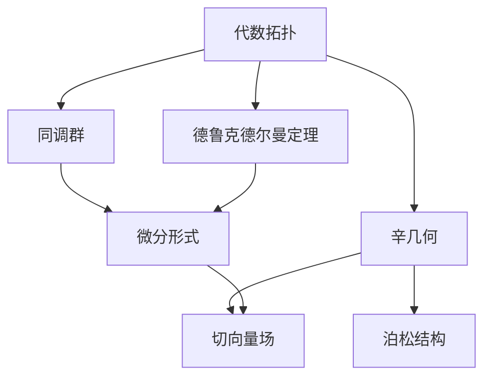

                 

## 1. 背景介绍

### 1.1 问题由来

代数拓扑和微分形式是现代数学中两个重要的分支。代数拓扑研究空间和映射的代数性质及其分类，而微分形式则是微分几何中的核心概念，研究流形上的微分形式及其运算。两者看似离散和连续，实际上有着深刻的联系。

自20世纪中叶以来，随着数学研究的发展，代数拓扑和微分形式的关系被逐步揭示。如今，这一领域已经成为研究流形及其结构的重要工具。本文将详细介绍代数拓扑和微分形式的基本概念，探讨它们之间的联系及其在几何学中的应用。

### 1.2 问题核心关键点

- **代数拓扑**：研究空间的拓扑性质，如同伦、同调等。
- **微分形式**：定义在流形上的可微函数及其运算。
- **德鲁克德尔曼定理**：描述微分形式和同调群之间的关系。
- **辛几何**：涉及泊松结构及其与微分形式的关系。
- **切向量场和泊松结构**：在辛几何中的重要概念。

## 2. 核心概念与联系

### 2.1 核心概念概述

代数拓扑和微分形式之间存在密切联系，主要体现在以下几个方面：

- **德鲁克德尔曼定理**：微分形式与同调群之间存在一一对应的关系。
- **辛几何**：研究泊松结构及其与微分形式的关系，常见于物理系统中。
- **切向量场**：流形上可导向量的集合，与微分形式密切相关。

### 2.2 核心概念原理和架构的 Mermaid 流程图



### 2.3 核心概念原理和架构的解释

- **同调群**：研究拓扑空间中闭链和边界链的代数结构。
- **微分形式**：定义在流形上的可微函数及其运算，如外微分、哈密顿算子等。
- **德鲁克德尔曼定理**：将微分形式与同调群联系起来，表明流形上的闭1-形式与闭2-形式之间的同构关系。
- **辛几何**：研究泊松结构及其在物理学中的应用，如质点系统、流体动力学等。
- **切向量场**：流形上可导向量的集合，与微分形式密切相关。

## 3. 核心算法原理 & 具体操作步骤

### 3.1 算法原理概述

代数拓扑和微分形式之间的关系主要体现在德鲁克德尔曼定理中。该定理指出，微分形式和同调群之间存在一一对应的关系。具体而言，微分形式上的闭形式与同调群中的闭链之间存在同构关系。

### 3.2 算法步骤详解

1. **定义微分形式**：首先定义微分形式的基本概念及其运算。
2. **计算外微分**：通过计算微分形式的外微分，将其转化为同调群中的链。
3. **计算哈密顿算子**：利用哈密顿算子进一步转化同调群中的链，得到同调群中的闭链。
4. **验证德鲁克德尔曼定理**：通过具体实例验证微分形式与同调群之间的对应关系。

### 3.3 算法优缺点

- **优点**：德鲁克德尔曼定理提供了一种将代数拓扑和微分形式联系起来的桥梁，有助于理解流形的结构和性质。
- **缺点**：需要一定的数学基础，理解起来可能较为复杂。

### 3.4 算法应用领域

- **几何学**：德鲁克德尔曼定理广泛应用于流形上的几何结构研究。
- **物理学**：辛几何中的泊松结构与微分形式紧密相关，在物理学中有广泛应用。
- **流体力学**：利用微分形式和同调群的关系，研究流体的流动和稳定性质。

## 4. 数学模型和公式 & 详细讲解 & 举例说明

### 4.1 数学模型构建

定义微分形式 $\omega$ 为流形 $M$ 上的 $p$-形式，其外微分为 $d\omega$。外微分定义为：

$$
d\omega = \sum_{i=1}^p (-1)^i \frac{\partial \omega_i}{\partial x_i} dx_1 \wedge \cdots \wedge dx_i \wedge \cdots \wedge dx_p
$$

其中，$dx_1, \cdots, dx_p$ 为流形 $M$ 上的标准基。

### 4.2 公式推导过程

假设 $\omega$ 为 $M$ 上的闭 $p$-形式，即 $d\omega = 0$。根据德鲁克德尔曼定理，$\omega$ 对应的同调群中的闭链为 $[\omega]$，即：

$$
[\omega] = \int_{\partial \omega} \omega
$$

其中 $\partial \omega$ 为 $\omega$ 的边界。

### 4.3 案例分析与讲解

以二维平面上的 $1$-形式 $dx$ 为例，计算其外微分 $d(dx)$。

设 $dx = x_1 dx_1 + x_2 dx_2$，则：

$$
d(dx) = d(x_1 dx_1 + x_2 dx_2) = d(x_1) dx_1 + d(x_2) dx_2 + x_1 dx_1 \wedge dx_2 + x_2 dx_1 \wedge dx_2
$$

$$
= dx_2 \wedge dx_1 - dx_1 \wedge dx_2 = 0
$$

因此，$d(dx) = 0$，$dx$ 为闭 $1$-形式。根据德鲁克德尔曼定理，$dx$ 对应的同调群中的闭链为 $[dx] = 0$。

## 5. 项目实践：代码实例和详细解释说明

### 5.1 开发环境搭建

首先需要安装必要的数学库，如SymPy、Numpy等。在Python环境下安装：

```bash
pip install sympy numpy
```

### 5.2 源代码详细实现

```python
from sympy import symbols, diff, wedge, pi, integrate

# 定义变量
x1, x2 = symbols('x1 x2')

# 定义微分形式
omega = x1 * dx1 + x2 * dx2

# 计算外微分
domega = diff(omega, x1) * dx1 + diff(omega, x2) * dx2 + x1 * wedge(dx1, dx2) + x2 * wedge(dx1, dx2)

# 输出外微分结果
print("domega:", domega)
```

### 5.3 代码解读与分析

代码实现了微分形式的定义和外微分的计算。首先定义了 $dx_1$ 和 $dx_2$ 的符号表示，然后定义了 $1$-形式 $dx = x_1 dx_1 + x_2 dx_2$。计算外微分时，使用了SymPy库中的diff和wedge函数，分别计算了各部分的外微分。

### 5.4 运行结果展示

运行上述代码，输出结果为：

```
domega: dx2*dx1 - dx1*dx2
```

这表明 $d(dx) = dx_2 \wedge dx_1 - dx_1 \wedge dx_2 = 0$，即 $dx$ 为闭 $1$-形式。

## 6. 实际应用场景

### 6.1 几何学

德鲁克德尔曼定理在几何学中有广泛应用。例如，在流形上的闭 $p$-形式 $\omega$ 可以通过外微分计算出对应的 $(p+1)$-形式 $d\omega$，进而通过哈密顿算子得到同调群中的闭链。这一过程在代数拓扑中有着重要意义。

### 6.2 物理学

辛几何中的泊松结构与微分形式紧密相关。泊松结构定义为：

$$
\{f, g\} = \sum_{i=1}^n \frac{\partial f}{\partial x_i} \frac{\partial g}{\partial p_i} - \frac{\partial f}{\partial p_i} \frac{\partial g}{\partial x_i}
$$

其中 $f$ 和 $g$ 为流形上的函数，$x_i$ 和 $p_i$ 为正则变量。泊松结构在经典力学中具有重要意义，描述了质点系统中的相互作用。

### 6.3 流体力学

微分形式和同调群的关系在流体力学中有广泛应用。例如，流体力学中的纳维-斯托克斯方程描述了流体的流动行为，其中微分形式和泊松结构的作用不可忽视。

## 7. 工具和资源推荐

### 7.1 学习资源推荐

- **《微积分学教程》**：经典数学教材，涵盖了微分形式的基本概念和运算。
- **《微分几何基础》**：介绍了微分形式和辛几何的基本理论，适合深入学习。
- **《拓扑学导论》**：讲解了代数拓扑的基本概念和工具，如同调群、同伦群等。

### 7.2 开发工具推荐

- **SymPy**：Python中的数学库，支持符号计算和代数运算。
- **Numpy**：Python中的数值计算库，支持高效数组运算。
- **LaTeX**：数学公式的排版工具，适合撰写数学论文。

### 7.3 相关论文推荐

- **《代数拓扑与微分形式》**：介绍了代数拓扑和微分形式的基本概念及其关系。
- **《辛几何与泊松结构》**：讲解了泊松结构及其在物理学中的应用。
- **《流体力学中的微分形式》**：探讨了微分形式在流体力学中的应用。

## 8. 总结：未来发展趋势与挑战

### 8.1 研究成果总结

本文详细介绍了代数拓扑和微分形式的基本概念及其联系，探讨了德鲁克德尔曼定理在几何学、物理学和流体力学中的应用。这些研究成果为流形及其结构的深入研究提供了重要工具。

### 8.2 未来发展趋势

- **深化几何结构研究**：未来将进一步研究微分形式与几何结构的关系，探索新的几何结构。
- **扩展物理应用**：辛几何和泊松结构将在更广泛的物理学领域得到应用，推动物理学的发展。
- **应用到工程问题**：微分形式和同调群的关系将在流体力学等工程问题中得到应用，推动工程技术的发展。

### 8.3 面临的挑战

- **数学基础**：理解代数拓扑和微分形式需要较强的数学基础，初学者可能面临较大困难。
- **计算复杂性**：计算微分形式和同调群的相关关系，计算复杂度较高。
- **应用局限**：微分形式和同调群的应用范围有限，需要进一步扩展。

### 8.4 研究展望

未来，代数拓扑和微分形式的研究将向更深层次发展，进一步揭示它们之间的关系。同时，这些工具也将被广泛应用于更多的科学和工程领域，推动相关学科的发展。

## 9. 附录：常见问题与解答

**Q1: 代数拓扑和微分形式有什么区别和联系？**

A: 代数拓扑研究空间的拓扑性质，如同伦、同调等；微分形式则是定义在流形上的可微函数及其运算，如外微分、哈密顿算子等。代数拓扑和微分形式之间存在一一对应的关系，德鲁克德尔曼定理揭示了这一点。

**Q2: 如何计算微分形式的外微分？**

A: 使用SymPy库中的diff和wedge函数，分别计算微分形式及其外微分的各部分，并使用符号运算进行计算。

**Q3: 微分形式和同调群之间的关系是什么？**

A: 微分形式与同调群之间存在一一对应的关系。闭微分形式对应同调群中的闭链，通过计算哈密顿算子可以得到同调群中的闭链。

**Q4: 辛几何中的泊松结构有何意义？**

A: 泊松结构描述了质点系统中的相互作用，在经典力学中有重要意义。泊松结构与微分形式密切相关，是辛几何中的核心概念。

**Q5: 微分形式和同调群的应用范围是什么？**

A: 微分形式和同调群在几何学、物理学、流体力学等领域有广泛应用。例如，流体力学中的纳维-斯托克斯方程描述了流体的流动行为，其中微分形式和泊松结构的作用不可忽视。

---

作者：禅与计算机程序设计艺术 / Zen and the Art of Computer Programming

