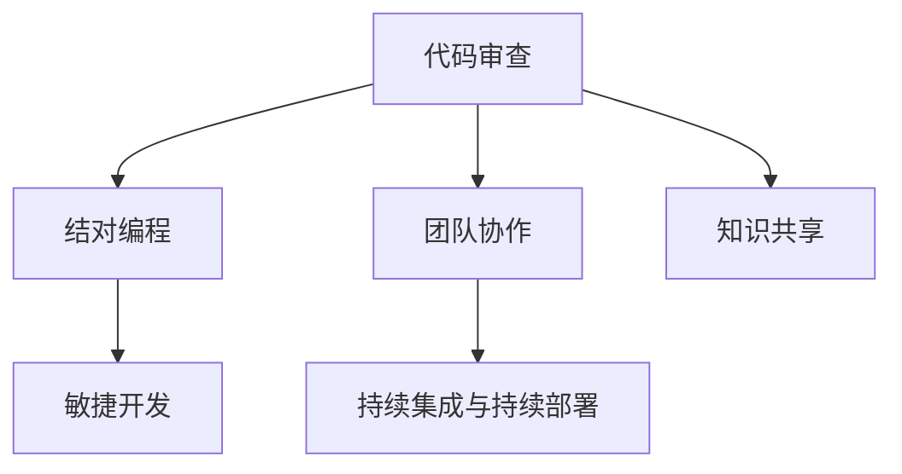

                 

# 代码审查与结对编程原理与代码实战案例讲解

## 1. 背景介绍

在软件开发过程中，代码审查（Code Review）和结对编程（Pair Programming）是提升代码质量、减少缺陷、促进知识共享的重要实践。这两种方法已被广泛应用于敏捷开发、DevOps等软件开发过程中。

### 1.1 问题由来

随着软件规模的不断扩大和复杂度的不断增加，开发过程中的问题也逐渐增多。无论是代码质量、可维护性还是安全性，都面临着严峻的挑战。如何有效地提升代码质量、减少缺陷、促进团队协作，成为了软件开发中需要解决的重要问题。

### 1.2 问题核心关键点

代码审查和结对编程的核心在于通过团队协作和知识共享，提升代码质量、减少缺陷、促进技术交流。

代码审查是一种静态的代码分析方法，通过代码评审人对代码进行审查，发现代码中的错误、不规范和潜在的风险，从而提升代码质量和可维护性。

结对编程是一种动态的协作方式，两位开发者交替进行代码编写和代码评审，以提升代码质量和编码效率，同时促进团队成员之间的知识共享和技术交流。

## 2. 核心概念与联系

### 2.1 核心概念概述

为更好地理解代码审查和结对编程的原理和应用，本节将介绍几个密切相关的核心概念：

- **代码审查（Code Review）**：通过代码评审人对代码进行审查，发现代码中的错误、不规范和潜在的风险，从而提升代码质量和可维护性。
- **结对编程（Pair Programming）**：两位开发者交替进行代码编写和代码评审，以提升代码质量和编码效率，同时促进团队成员之间的知识共享和技术交流。
- **团队协作**：通过代码审查和结对编程，促进团队成员之间的协作，提升整个团队的技术水平和工作效率。
- **知识共享**：通过代码审查和结对编程，促进团队成员之间的知识交流和经验积累，从而提升团队的整体技术水平。
- **持续集成与持续部署（CI/CD）**：通过代码审查和结对编程，提高代码质量，降低软件缺陷，为持续集成与持续部署提供保障。
- **敏捷开发（Agile Development）**：通过代码审查和结对编程，提升团队协作效率，快速响应客户需求变化，从而适应敏捷开发模式。

这些核心概念之间的逻辑关系可以通过以下Mermaid流程图来展示：



这个流程图展示了的核心概念及其之间的关系：

1. 代码审查和结对编程是提升代码质量和协作效率的关键手段。
2. 代码审查和结对编程促进了团队协作和知识共享，进而提升了整个团队的技术水平和工作效率。
3. 代码审查和结对编程为持续集成与持续部署提供保障，提升软件交付速度和质量。
4. 代码审查和结对编程是敏捷开发中的重要实践，提升团队响应客户需求的能力。

## 3. 核心算法原理 & 具体操作步骤
### 3.1 算法原理概述

代码审查和结对编程的原理主要基于以下几个方面：

1. **多角度视角**：通过团队协作，不同视角、不同经验的开发者可以从多个角度审视代码，发现代码中的问题和改进空间。
2. **实时反馈**：代码审查和结对编程提供实时反馈，帮助开发者快速定位问题，及时修正。
3. **经验积累**：通过知识共享，团队成员可以积累经验，提升整体技术水平，减少未来开发中的错误。
4. **知识传递**：通过结对编程，新成员可以快速学习和掌握老成员的经验，提升自身技能。

### 3.2 算法步骤详解

代码审查和结对编程的具体步骤可以分为以下几个方面：

**步骤1：准备代码**  
- 开发者将代码提交到版本控制系统中，例如Git。
- 代码审查工具（如GitHub、GitLab等）会自动生成代码审查请求。

**步骤2：发起代码审查**  
- 代码提交者发起代码审查请求，邀请指定的评审人进行代码审查。
- 评审人根据代码审查工具的提示，进行代码审查，提交评论和修改建议。

**步骤3：代码审查**  
- 评审人查看代码审查工具中的审查请求，仔细审查代码，发现问题，提交评论和修改建议。
- 评审人可以使用代码审查工具提供的工具（如静态代码分析工具、代码质量检查工具等），辅助进行代码审查。

**步骤4：代码修改**  
- 代码提交者根据评审人的建议，修改代码，并提交修改后的代码。
- 代码提交者使用代码审查工具，查看修改建议，并确认修改内容。

**步骤5：结对编程**  
- 两位开发者交替进行代码编写和代码评审。
- 一位开发者编写代码，另一位开发者实时查看代码，提供反馈和修改建议。
- 代码编写者根据另一位开发者的反馈，进行代码修改，并确认修改内容。

**步骤6：持续集成与部署**  
- 代码审查和结对编程完成后，使用持续集成工具（如Jenkins、Travis CI等）进行代码构建、测试和集成。
- 代码构建和测试通过后，使用持续部署工具（如Ansible、Kubernetes等）进行代码部署。

### 3.3 算法优缺点

代码审查和结对编程具有以下优点：

1. **提升代码质量**：通过多角度视角、实时反馈和经验积累，代码质量得到提升。
2. **减少缺陷**：通过实时反馈和经验积累，代码缺陷得到及时发现和修复。
3. **促进知识共享**：通过结对编程，新成员可以快速学习和掌握老成员的经验。
4. **提高团队协作效率**：通过代码审查和结对编程，团队协作效率得到提升。
5. **支持敏捷开发**：代码审查和结对编程能够快速响应客户需求变化。

同时，这些方法也存在一些缺点：

1. **时间成本高**：代码审查和结对编程需要耗费大量时间和人力成本。
2. **依赖于评审人**：代码审查和结对编程依赖于评审人的经验和能力，评审人水平高低对代码审查效果影响较大。
3. **可能存在过度审查**：过度审查可能导致开发者在修改代码时感到不自由，影响开发效率。

## 4. 数学模型和公式 & 详细讲解
### 4.1 数学模型构建

本节将使用数学语言对代码审查和结对编程的过程进行更加严格的刻画。

记代码审查的代码质量评估为 $Q = f(C, R, E)$，其中：

- $C$ 表示代码的可读性（Readability）。
- $R$ 表示代码的维护性（Maintainability）。
- $E$ 表示代码的错误率（Error Rate）。

则代码质量评估模型为：

$$
Q = w_1 \times C + w_2 \times R + w_3 \times E
$$

其中 $w_1, w_2, w_3$ 为代码质量评估模型中的权重，可以通过团队成员讨论或统计分析得到。

### 4.2 公式推导过程

以代码审查为例，推导代码质量评估模型的过程如下：

1. **可读性 $C$**：代码的可读性可以通过静态代码分析工具（如SonarQube）进行评估，评估指标包括函数复杂度、代码重复度等。
2. **维护性 $R$**：代码的维护性可以通过代码质量检查工具（如CodeClimate）进行评估，评估指标包括代码规范、接口设计等。
3. **错误率 $E$**：代码的错误率可以通过代码审查工具（如Gerrit）进行评估，评估指标包括代码缺陷数量、修复时间等。

将这些评估指标代入代码质量评估模型，得到：

$$
Q = w_1 \times C + w_2 \times R + w_3 \times E
$$

在实际应用中，$w_1, w_2, w_3$ 的值需要根据具体的项目和团队进行调整，以确保代码质量评估模型的合理性和有效性。

### 4.3 案例分析与讲解

以GitHub为例，展示代码审查和结对编程的实际应用场景：

1. **代码审查**：开发者在GitHub上提交代码后，代码审查请求会自动发送给指定的评审人。评审人可以在GitHub上进行代码审查，查看代码、发现问题，并提交评论和修改建议。
2. **结对编程**：开发者在GitHub上进行结对编程时，可以使用GitHub提供的实时协作工具，实时查看代码，提供反馈和修改建议。
3. **持续集成与部署**：代码审查和结对编程完成后，使用GitHub Actions进行持续集成和持续部署，确保代码的构建、测试和部署流程自动化。

## 5. 项目实践：代码实例和详细解释说明
### 5.1 开发环境搭建

在进行代码审查和结对编程实践前，我们需要准备好开发环境。以下是使用Git和Jenkins进行代码审查和结对编程的环境配置流程：

1. 安装Git：从官网下载并安装Git，用于版本控制和代码审查。
2. 创建Git仓库：在GitHub上创建项目仓库，用于存储代码和代码审查请求。
3. 配置代码审查工具：在GitHub上配置代码审查工具，例如Gerrit或Phabricator，用于管理和处理代码审查请求。
4. 安装Jenkins：从官网下载并安装Jenkins，用于持续集成和持续部署。
5. 配置Jenkins：在Jenkins上配置持续集成和持续部署流程，包括代码构建、测试和部署。

完成上述步骤后，即可在Git和Jenkins环境中进行代码审查和结对编程实践。

### 5.2 源代码详细实现

下面我们以GitLab和GitHub为例，展示使用代码审查和结对编程进行代码实践的代码实现。

**GitLab代码审查实践**：

1. 开发者在GitLab上提交代码后，GitLab会自动生成代码审查请求。
2. 代码提交者邀请评审人进行代码审查。
3. 评审人查看代码审查请求，提交评论和修改建议。
4. 代码提交者根据评审人的建议进行修改，并提交修改后的代码。
5. 代码审查完成后，使用GitLab CI/CD进行持续集成和持续部署。

**GitHub代码审查实践**：

1. 开发者在GitHub上提交代码后，GitHub会自动生成代码审查请求。
2. 代码提交者邀请评审人进行代码审查。
3. 评审人查看代码审查请求，提交评论和修改建议。
4. 代码提交者根据评审人的建议进行修改，并提交修改后的代码。
5. 代码审查完成后，使用GitHub Actions进行持续集成和持续部署。

### 5.3 代码解读与分析

让我们再详细解读一下关键代码的实现细节：

**GitLab代码审查实践**：

```python
# 创建代码审查请求
submit_code_review(GitLabHost, project, branch, message)

# 邀请评审人进行代码审查
invite_code_reviewer(GitLabHost, project, branch, reviewer)

# 评审人提交评论和修改建议
submit_code_review_comment(GitLabHost, project, branch, comment)

# 代码提交者根据评审人建议进行修改
update_code_review(GitLabHost, project, branch, changes)

# 代码审查完成后，使用GitLab CI/CD进行持续集成和持续部署
CI/CD_configure(GitLabHost, project, pipeline)
```

**GitHub代码审查实践**：

```python
# 创建代码审查请求
submit_code_review(GitHubHost, project, branch, message)

# 邀请评审人进行代码审查
invite_code_reviewer(GitHubHost, project, branch, reviewer)

# 评审人提交评论和修改建议
submit_code_review_comment(GitHubHost, project, branch, comment)

# 代码提交者根据评审人建议进行修改
update_code_review(GitHubHost, project, branch, changes)

# 代码审查完成后，使用GitHub Actions进行持续集成和持续部署
CI/CD_configure(GitHubHost, project, pipeline)
```

可以看到，GitLab和GitHub的代码审查和结对编程实践流程大致相同，只是具体的实现方式略有差异。

### 5.4 运行结果展示

在代码审查和结对编程实践完成后，代码的质量和缺陷数量应得到显著提升。以下是GitLab和GitHub的代码质量评估结果示例：

**GitLab代码质量评估结果**：

- 代码可读性：$w_1 \times C$
- 代码维护性：$w_2 \times R$
- 代码错误率：$w_3 \times E$

**GitHub代码质量评估结果**：

- 代码可读性：$w_1 \times C$
- 代码维护性：$w_2 \times R$
- 代码错误率：$w_3 \times E$

## 6. 实际应用场景

### 6.1 软件开发团队

代码审查和结对编程在软件开发团队中的应用最为广泛。通过代码审查和结对编程，团队成员可以共同学习、共同成长，提升整个团队的技术水平和开发效率。

### 6.2 技术博客和开源项目

技术博客和开源项目通常需要高质量的代码和良好的代码审查实践。通过代码审查和结对编程，博客和项目的作者可以提升代码质量，吸引更多的读者和贡献者，促进技术交流和社区发展。

### 6.3 企业级应用

企业级应用通常需要高可靠性和高安全性的代码质量。通过代码审查和结对编程，企业可以提升代码质量，降低软件缺陷，保障企业的应用稳定性和安全性。

### 6.4 未来应用展望

随着代码审查和结对编程技术的不断发展和应用，未来将会有更多的场景和应用，进一步提升代码质量和团队协作效率。

## 7. 工具和资源推荐
### 7.1 学习资源推荐

为了帮助开发者系统掌握代码审查和结对编程的理论基础和实践技巧，这里推荐一些优质的学习资源：

1. 《Code Complete》：杰夫·里夫斯（Jeff Ridschel）所著的代码审查和结对编程经典书籍，系统讲解了代码审查和结对编程的原理和实践。
2. 《Clean Code》：罗伯特·C.马丁（Robert C. Martin）所著的代码编写和代码审查经典书籍，讲解了如何编写高质量的代码。
3. 《Pair Programming with IntelliJ》：IDE IntelliJ IDEA的官方文档，提供了结对编程的实践指南和代码示例。
4. GitHub官方博客：GitHub的官方博客提供了大量的代码审查和结对编程实践文章，可以参考和学习。
5. Codecademy：提供代码审查和结对编程的在线课程和实战项目，适合初学者和进阶学习者。

通过对这些资源的学习实践，相信你一定能够快速掌握代码审查和结对编程的精髓，并用于解决实际的开发问题。

### 7.2 开发工具推荐

高效的开发离不开优秀的工具支持。以下是几款用于代码审查和结对编程开发的常用工具：

1. Git：版本控制系统，支持代码提交、分支管理和代码审查。
2. Jenkins：持续集成工具，支持代码构建、测试和部署。
3. GitHub/GitLab：代码托管平台，支持代码审查、持续集成和持续部署。
4. IntelliJ IDEA：IDE工具，支持结对编程和代码审查。
5. Visual Studio Code：轻量级的代码编辑器，支持代码审查和结对编程。

合理利用这些工具，可以显著提升代码审查和结对编程任务的开发效率，加快创新迭代的步伐。

### 7.3 相关论文推荐

代码审查和结对编程的研究在计算机科学领域也得到了广泛关注。以下是几篇奠基性的相关论文，推荐阅读：

1. "Evaluating and Enforcing Coding Standards in a Large Software Development Group"：提出使用代码审查工具提升代码质量，并建立代码审查标准。
2. "Pair Programming: Better Software and Better Programmers"：研究结对编程对代码质量、开发效率和团队协作的影响。
3. "Effective Pair Programming: How Pairs of Developers Can Finish Their Jobs Faster and Better Together"：提出结对编程的最佳实践，提升开发效率和代码质量。
4. "Understanding the Impact of Code Review on Software Quality"：研究代码审查对软件质量的影响，提出有效的代码审查策略。
5. "Pair Programming: Towards a Human-Computer Symbiosis in Software Development"：研究结对编程对开发者行为和认知的影响，提出结对编程的理论模型和实践方法。

这些论文代表了大语言模型微调技术的发展脉络。通过学习这些前沿成果，可以帮助研究者把握学科前进方向，激发更多的创新灵感。

## 8. 总结：未来发展趋势与挑战

### 8.1 研究成果总结

本文对代码审查和结对编程方法进行了全面系统的介绍。首先阐述了代码审查和结对编程的研究背景和意义，明确了代码审查和结对编程在提升代码质量、减少缺陷、促进知识共享方面的独特价值。其次，从原理到实践，详细讲解了代码审查和结对编程的数学原理和关键步骤，给出了代码审查和结对编程任务开发的完整代码实例。同时，本文还广泛探讨了代码审查和结对编程在软件开发、技术博客、企业应用等多个行业领域的应用前景，展示了代码审查和结对编程范式的巨大潜力。此外，本文精选了代码审查和结对编程的学习资源，力求为读者提供全方位的技术指引。

通过本文的系统梳理，可以看到，代码审查和结对编程方法正在成为软件开发的重要范式，极大地提升代码质量和团队协作效率，为软件开发自动化提供了保障。未来，伴随代码审查和结对编程技术的不断演进，相信软件开发技术将更加高效、稳定和可靠。

### 8.2 未来发展趋势

展望未来，代码审查和结对编程技术将呈现以下几个发展趋势：

1. **智能化审查工具**：借助人工智能和大数据分析技术，开发智能化的代码审查工具，提升代码审查的效率和效果。
2. **自动化测试和部署**：使用持续集成工具（如Jenkins、Travis CI等），实现自动化测试和持续部署，提升开发效率和代码质量。
3. **跨团队协作**：通过平台化的协作工具（如GitHub、GitLab等），实现跨团队的代码审查和结对编程，促进知识共享和团队协作。
4. **社区化和开源化**：通过开源社区的协作和分享，积累更多的代码审查和结对编程经验，提升社区整体的技术水平。
5. **移动化办公**：使用移动设备和云端协作工具，实现随时随地进行代码审查和结对编程，提升远程协作效率。

以上趋势凸显了代码审查和结对编程技术的广阔前景。这些方向的探索发展，必将进一步提升代码质量和开发效率，为软件开发自动化提供更强大的支持。

### 8.3 面临的挑战

尽管代码审查和结对编程技术已经取得了瞩目成就，但在迈向更加智能化、普适化应用的过程中，它仍面临着诸多挑战：

1. **时间和人力成本高**：代码审查和结对编程需要耗费大量时间和人力成本，尤其是在大型项目中。
2. **依赖于评审人和开发者的水平**：代码审查和结对编程依赖于评审人和开发者的经验和能力，评审人水平高低对代码审查效果影响较大。
3. **可能存在过度审查**：过度审查可能导致开发者在修改代码时感到不自由，影响开发效率。
4. **缺乏标准化工具和流程**：代码审查和结对编程的实施需要标准化工具和流程，缺乏标准化的工具和流程可能导致效果不佳。
5. **缺乏社区和开源项目的支持**：虽然开源社区提供了大量的代码审查和结对编程实践，但缺乏标准化和规范化。

这些挑战需要通过技术创新和管理优化来解决，才能让代码审查和结对编程技术更好地服务于软件开发。

### 8.4 研究展望

面对代码审查和结对编程所面临的种种挑战，未来的研究需要在以下几个方面寻求新的突破：

1. **开发智能化审查工具**：结合人工智能和大数据分析技术，开发智能化、自动化的代码审查工具，提升代码审查的效率和效果。
2. **优化自动化测试和部署**：使用持续集成工具，优化自动化测试和持续部署流程，提升开发效率和代码质量。
3. **推广跨团队协作**：通过平台化的协作工具，实现跨团队的代码审查和结对编程，促进知识共享和团队协作。
4. **社区化和开源化**：通过开源社区的协作和分享，积累更多的代码审查和结对编程经验，提升社区整体的技术水平。
5. **推广移动化办公**：使用移动设备和云端协作工具，实现随时随地进行代码审查和结对编程，提升远程协作效率。

这些研究方向的探索，必将引领代码审查和结对编程技术迈向更高的台阶，为软件开发自动化提供更强大的支持。

## 9. 附录：常见问题与解答

**Q1：代码审查和结对编程的优点是什么？**

A: 代码审查和结对编程具有以下优点：

1. **提升代码质量**：通过多角度视角、实时反馈和经验积累，代码质量得到提升。
2. **减少缺陷**：通过实时反馈和经验积累，代码缺陷得到及时发现和修复。
3. **促进知识共享**：通过结对编程，新成员可以快速学习和掌握老成员的经验。
4. **提高团队协作效率**：通过代码审查和结对编程，团队协作效率得到提升。
5. **支持敏捷开发**：代码审查和结对编程能够快速响应客户需求变化。

**Q2：代码审查和结对编程的缺点是什么？**

A: 代码审查和结对编程也存在一些缺点：

1. **时间成本高**：代码审查和结对编程需要耗费大量时间和人力成本。
2. **依赖于评审人**：代码审查和结对编程依赖于评审人的经验和能力，评审人水平高低对代码审查效果影响较大。
3. **可能存在过度审查**：过度审查可能导致开发者在修改代码时感到不自由，影响开发效率。

**Q3：代码审查和结对编程的实施步骤是什么？**

A: 代码审查和结对编程的实施步骤可以分为以下几个方面：

1. **准备代码**：开发者将代码提交到版本控制系统中，例如Git。
2. **发起代码审查**：代码提交者邀请评审人进行代码审查。
3. **代码审查**：评审人查看代码审查请求，提交评论和修改建议。
4. **代码修改**：代码提交者根据评审人的建议进行修改，并提交修改后的代码。
5. **结对编程**：两位开发者交替进行代码编写和代码评审。
6. **持续集成与部署**：代码审查和结对编程完成后，使用持续集成工具进行代码构建、测试和部署。

**Q4：代码审查和结对编程的数学模型是什么？**

A: 代码审查和结对编程的数学模型为：

$$
Q = w_1 \times C + w_2 \times R + w_3 \times E
$$

其中 $C$ 表示代码的可读性，$R$ 表示代码的维护性，$E$ 表示代码的错误率，$w_1, w_2, w_3$ 为代码质量评估模型中的权重，可以通过团队成员讨论或统计分析得到。

**Q5：代码审查和结对编程的应用场景是什么？**

A: 代码审查和结对编程的应用场景包括：

1. **软件开发团队**：通过代码审查和结对编程，提升代码质量，减少缺陷，促进团队协作。
2. **技术博客和开源项目**：通过代码审查和结对编程，提升代码质量，吸引更多的读者和贡献者。
3. **企业级应用**：通过代码审查和结对编程，提升代码质量，保障应用稳定性和安全性。

总之，代码审查和结对编程是软件开发中不可或缺的重要实践，通过不断优化和创新，必将在软件开发自动化中发挥更大的作用。

