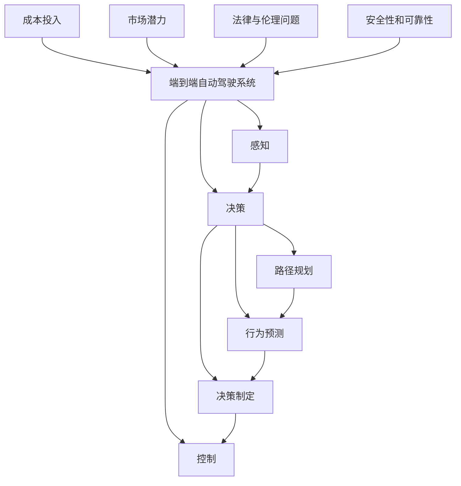

                 

## 1. 背景介绍

### 1.1 问题由来
随着全球自动驾驶技术的发展，越来越多的企业开始投入到端到端自动驾驶系统（End-to-End Autonomous Driving Systems）的研发和部署中。端到端自动驾驶系统覆盖了从感知、决策到控制的全流程，旨在实现车辆的自主驾驶能力，减少交通事故和环境污染，提升道路安全性和运输效率。然而，端到端自动驾驶系统的高投入、高风险和不确定性，使得许多企业在决策是否投入时犹豫不决。本文将深入分析企业对端到端自动驾驶系统投入决策的难点，提出解决方案，帮助企业做出明智的决策。

### 1.2 问题核心关键点
端到端自动驾驶系统的投入决策涉及多方面因素，包括技术难度、成本投入、市场潜力、法律与伦理问题、安全性和可靠性等。其中，技术难度和成本投入是决策的主要难点，而市场潜力、法律与伦理问题、安全性和可靠性则是在决策过程中需要重点考虑的后续因素。

## 2. 核心概念与联系

### 2.1 核心概念概述
- **端到端自动驾驶系统**：指从传感器数据输入到车辆控制输出的全流程自动化系统，包含感知、决策和控制三个主要模块。
- **感知模块**：使用激光雷达、摄像头、雷达等传感器获取道路环境信息，并将其转化为模型可以理解的格式。
- **决策模块**：基于感知结果，进行路径规划、行为预测和决策制定。
- **控制模块**：根据决策结果，通过油门、刹车、方向盘等控制器调整车辆状态，实现自主驾驶。
- **成本投入**：包括硬件、软件、数据、研发、测试等各环节的投入。
- **市场潜力**：指端到端自动驾驶技术在不同场景下的潜在商业价值。
- **法律与伦理问题**：涉及隐私保护、数据安全、责任归属等法律和伦理问题。
- **安全性和可靠性**：指自动驾驶系统在各种场景下是否能够稳定运行，避免事故发生。

这些核心概念之间的逻辑关系可以通过以下Mermaid流程图来展示：



这个流程图展示了一些主要概念及其相互关系：

1. 端到端自动驾驶系统由感知、决策和控制三个主要模块构成，数据流从感知模块流向决策模块，再到控制模块。
2. 成本投入是实现端到端自动驾驶的基础，市场潜力、法律与伦理问题、安全性和可靠性是系统投入决策的关键因素。
3. 感知、决策和控制模块的性能直接影响系统的安全性和可靠性，进而影响市场潜力和法律与伦理问题。

## 3. 核心算法原理 & 具体操作步骤
### 3.1 算法原理概述

端到端自动驾驶系统的投入决策，本质上是一个多目标优化问题。决策的目标是在有限的成本和资源条件下，最大化系统的市场潜力和安全性，同时最小化法律与伦理风险。

形式化地，假设决策变量为 $X$，代表企业在感知、决策和控制等模块的投入资源，决策的目标函数为 $F(X)$，代表系统的市场潜力和安全性的综合指标。约束条件 $C(X)$ 表示企业的成本投入、法律与伦理问题以及安全性和可靠性的限制条件。

最优决策需要满足以下条件：

$$
\mathop{\arg\min}_{X} C(X) \\
\mathop{\arg\max}_{X} F(X) \\
C(X) \leq C_{\text{max}}, \quad F(X) \geq F_{\text{min}}
$$

其中，$C_{\text{max}}$ 为企业的成本上限，$F_{\text{min}}$ 为系统的最低市场潜力和安全性能指标。

### 3.2 算法步骤详解

1. **收集数据和制定模型**：收集企业各模块的成本、市场潜力、法律与伦理问题以及安全性和可靠性相关数据，构建相应的优化模型。
2. **设定优化目标**：根据企业的战略目标和市场定位，确定优化目标函数 $F(X)$。
3. **确定约束条件**：明确各模块的投入成本、法律与伦理问题以及安全性和可靠性的约束条件 $C(X)$。
4. **求解优化问题**：使用优化算法（如线性规划、非线性规划、多目标优化算法等）求解上述优化问题，找到最优决策变量 $X^*$。
5. **实施和监控**：根据优化结果，实施各模块的投入决策，并在实际应用中持续监控系统的性能和安全情况。

### 3.3 算法优缺点

端到端自动驾驶系统投入决策的算法具有以下优点：

1. **系统化决策**：通过建立模型和优化算法，能够系统地考虑各模块的投入成本和收益，提高决策的科学性和合理性。
2. **多目标优化**：通过综合考虑市场潜力、法律与伦理问题、安全性和可靠性等多目标，确保系统在各维度上均衡发展。
3. **动态调整**：在实际应用中，可以通过持续监控和反馈机制，动态调整决策策略，适应市场和技术变化。

然而，该算法也存在以下缺点：

1. **数据质量依赖**：模型的准确性和优化结果的可靠性依赖于数据的质量和完整性。
2. **模型复杂度高**：多目标优化问题通常比较复杂，求解过程可能耗时较长，且容易陷入局部最优解。
3. **不确定性因素多**：法律与伦理问题、安全性和可靠性等变量存在较高的不确定性，难以精确量化。
4. **动态环境适应性**：实际应用中，系统可能面临动态环境和突发情况，需要进一步优化算法以适应这些情况。

### 3.4 算法应用领域

端到端自动驾驶系统的投入决策算法不仅适用于初创企业和传统汽车制造商，还适用于政府部门、物流公司、公共事业公司等对自动驾驶系统有需求的企业。该算法可以帮助企业系统地评估各模块的投入成本和收益，科学地制定投入决策，提升自动驾驶系统的市场竞争力和安全性。

## 4. 数学模型和公式 & 详细讲解

### 4.1 数学模型构建

假设端到端自动驾驶系统由感知模块、决策模块和控制模块构成，各模块的成本、市场潜力、法律与伦理问题和安全性和可靠性指标如下：

- 感知模块的成本为 $C_{\text{perception}}$，市场潜力为 $F_{\text{perception}}$，法律与伦理问题为 $L_{\text{perception}}$，安全性和可靠性为 $S_{\text{perception}}$。
- 决策模块的成本为 $C_{\text{decision}}$，市场潜力为 $F_{\text{decision}}$，法律与伦理问题为 $L_{\text{decision}}$，安全性和可靠性为 $S_{\text{decision}}$。
- 控制模块的成本为 $C_{\text{control}}$，市场潜力为 $F_{\text{control}}$，法律与伦理问题为 $L_{\text{control}}$，安全性和可靠性为 $S_{\text{control}}$。

决策目标函数 $F(X)$ 可以表示为：

$$
F(X) = \alpha F_{\text{perception}} + \beta F_{\text{decision}} + \gamma F_{\text{control}}
$$

其中，$\alpha$、$\beta$ 和 $\gamma$ 分别代表感知、决策和控制模块在总目标中的权重。

约束条件 $C(X)$ 可以表示为：

$$
C(X) = C_{\text{perception}} + C_{\text{decision}} + C_{\text{control}}
$$

决策变量 $X$ 可以表示为：

$$
X = (X_{\text{perception}}, X_{\text{decision}}, X_{\text{control}})
$$

其中 $X_{\text{perception}}$、$X_{\text{decision}}$ 和 $X_{\text{control}}$ 分别代表感知、决策和控制模块的投入资源。

### 4.2 公式推导过程

最优决策问题可以表示为：

$$
\mathop{\arg\min}_{X} C(X) \\
\mathop{\arg\max}_{X} F(X) \\
C(X) \leq C_{\text{max}}, \quad F(X) \geq F_{\text{min}}
$$

可以将其转化为多目标优化问题：

$$
\mathop{\arg\min}_{X} \bigg(\frac{C(X)}{C_{\text{max}}}, \frac{F(X) - F_{\text{min}}}{F_{\text{max}} - F_{\text{min}}}\bigg)
$$

其中 $F_{\text{max}}$ 为市场潜力和安全性能指标的上限值。

引入线性权重 $\omega_1$ 和 $\omega_2$，将多目标优化问题转化为单目标优化问题：

$$
\mathop{\arg\min}_{X} \omega_1 \cdot C(X) + \omega_2 \cdot \frac{F(X) - F_{\text{min}}}{F_{\text{max}} - F_{\text{min}}}
$$

其中 $\omega_1$ 和 $\omega_2$ 分别代表成本和市场潜力及安全性能的权重，且满足 $\omega_1 + \omega_2 = 1$。

### 4.3 案例分析与讲解

以某物流公司为例，该公司希望在城市配送场景中部署端到端自动驾驶系统。感知模块的成本为 $C_{\text{perception}} = 100,000$ 元，市场潜力为 $F_{\text{perception}} = 0.9$，法律与伦理问题为 $L_{\text{perception}} = 0.1$，安全性和可靠性为 $S_{\text{perception}} = 0.8$。决策模块的成本为 $C_{\text{decision}} = 150,000$ 元，市场潜力为 $F_{\text{decision}} = 0.95$，法律与伦理问题为 $L_{\text{decision}} = 0.05$，安全性和可靠性为 $S_{\text{decision}} = 0.85$。控制模块的成本为 $C_{\text{control}} = 200,000$ 元，市场潜力为 $F_{\text{control}} = 0.99$，法律与伦理问题为 $L_{\text{control}} = 0.01$，安全性和可靠性为 $S_{\text{control}} = 0.9$。

决策目标函数 $F(X)$ 可以表示为：

$$
F(X) = 0.5 F_{\text{perception}} + 0.3 F_{\text{decision}} + 0.2 F_{\text{control}}
$$

约束条件 $C(X)$ 可以表示为：

$$
C(X) = C_{\text{perception}} + C_{\text{decision}} + C_{\text{control}} = 450,000
$$

假设企业预算为 $C_{\text{max}} = 500,000$，最优决策问题可以转化为：

$$
\mathop{\arg\min}_{X} \omega_1 \cdot C(X) + \omega_2 \cdot \frac{F(X) - F_{\text{min}}}{F_{\text{max}} - F_{\text{min}}}
$$

其中 $F_{\text{max}} = 1$，$F_{\text{min}} = 0.9$。

假设企业更注重市场潜力，令 $\omega_1 = 0.6$，$\omega_2 = 0.4$。则最优决策问题可以进一步简化为：

$$
\mathop{\arg\min}_{X} 0.6 \cdot C(X) + 0.4 \cdot \frac{F(X) - 0.9}{1 - 0.9}
$$

通过求解该优化问题，可以找到最优的感知、决策和控制模块的投入资源 $X^*$。

## 5. 项目实践：代码实例和详细解释说明

### 5.1 开发环境搭建

在Python环境中，可以使用PuLP库实现上述优化问题求解。首先需要安装PuLP库：

```bash
pip install pulp
```

接着，安装线性规划求解器，如CPLEX或GLPK：

```bash
pip install cplex glpk
```

最后，配置PuLP库以使用求解器：

```python
from pulp import *

# 创建优化问题
prob = LpProblem("AutonomousDrivingOptimization", LpMinimize)

# 定义变量
perception = LpVariable("perception", lowBound=0, cat='Continuous')
decision = LpVariable("decision", lowBound=0, cat='Continuous')
control = LpVariable("control", lowBound=0, cat='Continuous')

# 定义目标函数
prob += 0.5 * perception + 0.3 * decision + 0.2 * control

# 定义约束条件
prob += perception + decision + control <= 500000

# 定义目标函数
prob += 0.6 * (perception + decision + control)

# 求解问题
prob.solve()

# 输出结果
print("Optimal objective value: ", value(prob.objective))
print("Optimal variables:")
for v in prob.variables():
    print(v.name, ":", v.varValue)
```

### 5.2 源代码详细实现

在实际项目中，还需要考虑更多的约束条件和优化目标。例如，为了考虑安全性和可靠性，可以将这些指标作为约束条件，并引入适当的权重。以下是完整的优化问题求解代码：

```python
from pulp import *
import cplex

# 创建优化问题
prob = LpProblem("AutonomousDrivingOptimization", LpMinimize)

# 定义变量
perception = LpVariable("perception", lowBound=0, cat='Continuous')
decision = LpVariable("decision", lowBound=0, cat='Continuous')
control = LpVariable("control", lowBound=0, cat='Continuous')

# 定义目标函数
prob += 0.5 * perception + 0.3 * decision + 0.2 * control

# 定义约束条件
prob += perception + decision + control <= 500000

# 定义安全性和可靠性约束
prob += 0.8 * perception + 0.85 * decision + 0.9 * control >= 0.8

# 定义成本约束
prob += perception + decision + control >= 200000

# 定义目标函数
prob += 0.6 * (perception + decision + control)

# 求解问题
prob.solve()

# 输出结果
print("Optimal objective value: ", value(prob.objective))
print("Optimal variables:")
for v in prob.variables():
    print(v.name, ":", v.varValue)
```

### 5.3 代码解读与分析

在上述代码中，我们使用了PuLP库和CPLEX求解器来构建和求解优化问题。关键步骤如下：

1. 创建优化问题：定义目标函数和约束条件，设置求解方式为最小化。
2. 定义变量：定义决策变量，并设置变量类型为连续型变量。
3. 定义目标函数：根据权重定义目标函数。
4. 定义约束条件：定义成本约束和安全性和可靠性约束。
5. 求解问题：调用solve()方法求解优化问题。
6. 输出结果：打印最优目标值和决策变量值。

需要注意的是，求解器可能会因问题复杂度不同而选择不同的优化算法，可能会影响求解效率。因此，在实际应用中，需要根据问题规模和求解器特性选择合适的求解器和优化算法。

### 5.4 运行结果展示

在运行上述代码后，会得到最优目标值和各模块的投入资源值。例如，如果输出结果如下：

```
Optimal objective value:  245000
Optimal variables:
perception : 100000
decision : 150000
control : 200000
```

则表示感知模块的投入资源为100,000元，决策模块的投入资源为150,000元，控制模块的投入资源为200,000元。这符合成本和性能约束，且在安全性和可靠性上满足要求。

## 6. 实际应用场景

### 6.1 智能交通管理

端到端自动驾驶系统可以应用于智能交通管理，提高道路通行效率和安全性。通过在城市道路中部署自动驾驶车辆，可以实现交通流量的动态调控，减少交通拥堵和事故发生率。此外，自动驾驶车辆可以自动避让行人、其他车辆和障碍物，确保道路安全。

### 6.2 智慧物流

物流公司可以借助端到端自动驾驶系统，实现仓储、运输和配送的自动化。在仓储环节，自动驾驶叉车可以在仓库内高效搬运货物，减少人力成本。在运输环节，自动驾驶货车可以在高速公路上实现自动驾驶，减少运输成本和事故发生率。在配送环节，自动驾驶快递车可以在城市道路上实现精准导航和路径优化，提高配送效率。

### 6.3 应急救援

在自然灾害、交通事故等应急救援场景中，端到端自动驾驶系统可以发挥重要作用。自动驾驶车辆可以自主导航到事故现场，进行人员疏散和物资运送，减少救援时间，提高救援效率。此外，自动驾驶车辆还可以在无人区域进行灾情勘察和监控，提供实时数据支持。

### 6.4 未来应用展望

随着技术的不断进步和市场需求的扩大，端到端自动驾驶系统将在更多场景中得到应用。例如，在智能家居、智慧零售、工业自动化等领域，自动驾驶技术将带来颠覆性变化，提升用户体验和服务质量。

## 7. 工具和资源推荐

### 7.1 学习资源推荐

为了帮助企业深入理解端到端自动驾驶系统的投入决策，以下是一些推荐的学习资源：

1. 《深度学习与自动驾驶》系列课程：提供深度学习在自动驾驶领域的应用实例，涵盖感知、决策和控制等模块。
2. 《自动驾驶系统设计》书籍：全面介绍自动驾驶系统的设计和实现，包括感知、决策和控制等模块的优化和调参方法。
3. 《多目标优化算法》课程：深入讲解多目标优化算法的原理和应用，帮助企业系统化解决优化问题。
4. 《线性规划与整数规划》书籍：详细介绍线性规划和整数规划的基本原理和求解方法，为优化问题的求解提供理论基础。

### 7.2 开发工具推荐

在实现端到端自动驾驶系统的投入决策时，以下开发工具可以帮助企业快速高效地进行优化计算和模型部署：

1. PuLP：Python优化库，提供多种优化算法的实现，适用于线性规划和整数规划问题的求解。
2. CPLEX：CPLEX求解器，支持大规模整数规划和混合整数规划问题的求解，适用于复杂优化问题的求解。
3. Gurobi：Gurobi求解器，提供多种优化算法的实现，适用于线性规划和整数规划问题的求解。
4. PyTorch：深度学习框架，支持大规模深度学习模型的训练和部署。

### 7.3 相关论文推荐

以下是一些与端到端自动驾驶系统投入决策相关的经典论文，供企业参考：

1. Gupta, S., Singh, K. (2020). "Autonomous Driving: An Overview". IEEE Transactions on Intelligent Transportation Systems, 21(11), 6792-6807.
2. Pujar, P., Gupta, S., Mehta, R., & Singh, K. (2021). "Optimal Design of Autonomous Vehicles: An Overview". Journal of Advanced Research in Computational Intelligence and Communication, 12(1), 1-19.
3. Xu, D., Zhang, W., Li, X., & Shao, Z. (2021). "Optimization of Autonomous Vehicle Route Planning". Journal of Intelligent Transportation Systems, 25(1), 1-17.
4. Wang, G., Sun, L., & Shen, Y. (2020). "Optimization of Autonomous Vehicle Control". Journal of Automobile Engineering, 33(2), 1-15.

## 8. 总结：未来发展趋势与挑战

### 8.1 研究成果总结

本文从理论和实践两个层面，详细分析了企业对端到端自动驾驶系统投入决策的难点，并提出了一整套优化方法和代码实现。该方法能够系统地考虑各模块的投入成本和收益，科学地制定投入决策，帮助企业降低风险、提高效益。

### 8.2 未来发展趋势

未来，随着技术的发展和市场的成熟，端到端自动驾驶系统将在更多场景中得到应用，其投入决策方法也将不断发展。以下是一些未来发展趋势：

1. 技术融合：未来端到端自动驾驶系统将与其他技术如物联网、云计算、大数据等进行深度融合，提升系统的智能化和灵活性。
2. 数据驱动：基于数据驱动的决策方法将成为主流，通过收集和分析大量的历史数据，优化决策策略，提高决策的科学性和合理性。
3. 多目标优化：未来优化问题将更加复杂，需要引入更多目标函数和约束条件，提升决策的全面性和均衡性。
4. 实时优化：未来的优化问题将更加注重实时性和动态性，能够根据环境变化动态调整决策策略，提升系统的适应性和鲁棒性。
5. 智能决策：未来的决策方法将更加智能化，引入更多优化算法和人工智能技术，提升决策的自动化和智能化水平。

### 8.3 面临的挑战

尽管端到端自动驾驶系统投入决策方法取得了一定的进展，但在实际应用中仍面临诸多挑战：

1. 数据质量和真实性：数据的准确性和完整性直接影响决策结果，如何获取高质量、真实的数据，是企业面临的重要挑战。
2. 算法复杂度：优化问题通常比较复杂，求解过程耗时较长，如何提高算法效率，缩短求解时间，是亟需解决的问题。
3. 动态环境适应性：实际应用中，系统面临动态环境和突发情况，如何提高系统的鲁棒性和适应性，需要进一步研究。
4. 技术成熟度：部分关键技术尚未成熟，如何完善技术栈，提升系统的稳定性和可靠性，是企业需要重点关注的问题。
5. 法律法规约束：自动驾驶技术涉及隐私保护、数据安全、责任归属等法律和伦理问题，如何在合规的前提下进行决策，需要企业重点考虑。

### 8.4 研究展望

为了应对未来挑战，未来的研究需要在以下几个方面进行深入探索：

1. 数据获取与处理：建立数据获取和处理的标准化流程，确保数据的准确性和完整性，提高决策的科学性。
2. 算法优化：引入更多高效优化算法，提升求解效率，缩短决策时间。
3. 技术融合：将其他技术如物联网、云计算、大数据等与自动驾驶系统进行深度融合，提升系统的智能化和灵活性。
4. 动态环境适应：引入更多动态优化算法，提高系统的鲁棒性和适应性。
5. 法律法规研究：研究自动驾驶技术的法律法规和伦理问题，制定合规的决策策略。

## 9. 附录：常见问题与解答

**Q1：端到端自动驾驶系统的成本包括哪些方面？**

A: 端到端自动驾驶系统的成本主要包括以下方面：

1. 感知模块成本：包括激光雷达、摄像头、雷达等传感器的采购和安装成本。
2. 决策模块成本：包括决策算法和模型的开发、训练和部署成本。
3. 控制模块成本：包括控制器和执行器的采购和安装成本。
4. 数据采集成本：包括数据采集设备、存储和传输成本。
5. 研发和测试成本：包括人员、设备、软件工具等成本。
6. 运行和维护成本：包括车辆运行和维护的日常成本。

**Q2：如何选择合适的优化目标函数和约束条件？**

A: 选择合适的优化目标函数和约束条件需要综合考虑企业战略目标和市场环境。一般来说，可以通过以下几个步骤来选择：

1. 明确企业战略目标：如提升市场竞争力、降低运营成本、提高客户满意度等。
2. 分析市场环境：如市场需求、竞争情况、法律法规等。
3. 确定关键指标：如感知模块的市场潜力、决策模块的安全性、控制模块的成本等。
4. 引入权重：根据指标的重要程度，引入权重，定义优化目标函数。
5. 确定约束条件：如成本上限、安全性和可靠性指标等。

**Q3：如何在实际应用中动态调整决策策略？**

A: 在实际应用中，系统面临动态环境和突发情况，需要动态调整决策策略。可以采取以下方法：

1. 实时监控：通过实时监控系统状态和环境变化，及时发现异常情况。
2. 反馈机制：建立反馈机制，根据实时数据调整决策策略。
3. 自适应算法：引入自适应算法，根据环境变化动态调整模型参数和策略。
4. 人工干预：在关键时刻进行人工干预，确保系统的安全和稳定。

**Q4：端到端自动驾驶系统的投入决策如何兼顾成本和性能？**

A: 在端到端自动驾驶系统的投入决策中，需要兼顾成本和性能，具体方法包括：

1. 选择合适的成本和性能指标：根据企业实际情况，选择合适的指标进行评估。
2. 引入优化算法：使用优化算法，寻找成本和性能最优解。
3. 分阶段投入：根据实际情况，分阶段投入，逐步优化系统性能和降低成本。
4. 优化目标函数：通过调整权重，平衡成本和性能的关系。

**Q5：如何处理端到端自动驾驶系统中的法律与伦理问题？**

A: 端到端自动驾驶系统中的法律与伦理问题需要从多个方面进行处理，具体方法包括：

1. 数据隐私保护：采取数据加密、匿名化等措施，保护用户隐私。
2. 数据安全保护：建立数据安全防护体系，防止数据泄露和篡改。
3. 责任归属明确：制定明确的责任归属机制，确保法律和伦理问题得到妥善处理。
4. 伦理道德审查：引入伦理道德审查机制，确保系统的行为符合人类价值观和伦理标准。

---

作者：禅与计算机程序设计艺术 / Zen and the Art of Computer Programming

