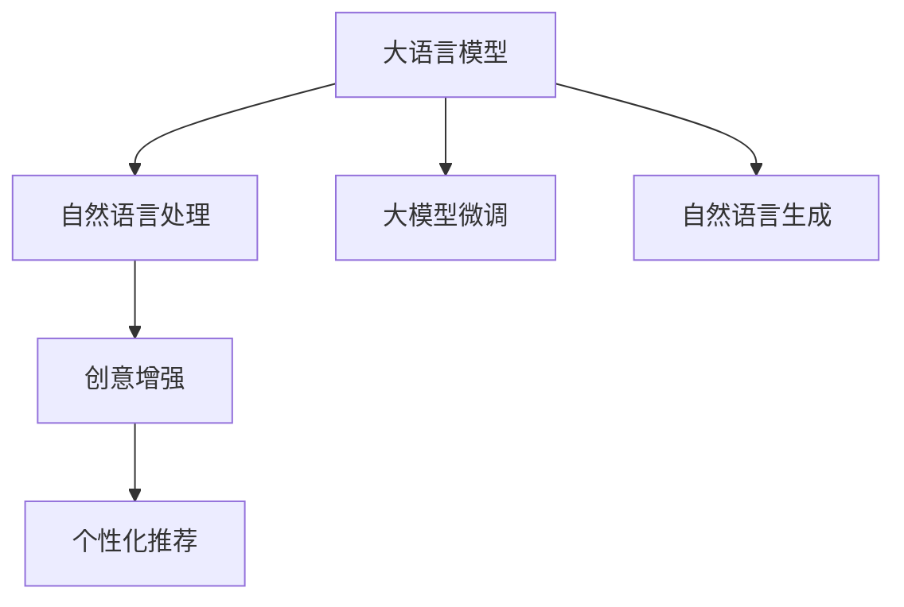

                 

## 1. 背景介绍

### 1.1 问题由来

随着人工智能技术的快速发展，越来越多的人开始关注人工智能如何帮助人类更好地表达和创造。传统的故事创作流程包括灵感收集、草稿撰写、修订润色等多个环节，不仅耗时耗力，还容易陷入创意瓶颈。而人工智能，特别是自然语言处理技术的发展，为故事创作带来了新的可能性。

### 1.2 问题核心关键点

如何利用人工智能技术，特别是大语言模型和大数据，帮助人类更高效、更富有创造力地进行故事创作，成为了当前研究的一个热点。这不仅能够提高个人写作效率，还能够帮助创作新手入门，甚至激发更多的创意和灵感。

### 1.3 问题研究意义

大语言模型和人工智能技术在故事创作中的应用，有望大幅提升创作质量和效率，同时为文化产业带来新的动力。研究如何利用这些技术进行个人故事创作，对于推动人工智能技术在文学创作、娱乐产业、教育培训等领域的应用具有重要意义。

## 2. 核心概念与联系

### 2.1 核心概念概述

为了更好地理解AI驱动的个人故事创作坊，本节将介绍几个核心概念：

- 大语言模型(Large Language Model, LLM)：基于自回归模型或自编码模型训练的大型语言模型，能够处理复杂的自然语言文本，并进行语义理解和生成。
- 自然语言处理(Natural Language Processing, NLP)：涉及文本数据处理、语义分析、情感分析、文本生成等多个领域的技术，是AI驱动的故事创作的基础。
- 大模型微调(Fine-Tuning)：在大规模预训练模型基础上，针对特定任务进行有监督学习，以提升模型在该任务上的表现。
- 自然语言生成(Natural Language Generation, NLG)：通过机器学习算法自动生成自然语言文本，是故事创作的重要技术之一。
- 创意增强(Creativity Enhancement)：利用AI技术提升人类的创作灵感和效率，通过数据挖掘、情感分析等方式激发创造力。
- 个性化推荐(Recommendation System)：通过分析用户的行为和偏好，推荐可能感兴趣的内容，帮助用户发现更多故事创作素材。

这些概念之间的逻辑关系可以通过以下Mermaid流程图来展示：



这个流程图展示了核心概念之间的联系：大语言模型是大模型微调的基础，自然语言处理提供了理解和分析文本的工具，自然语言生成和创意增强则直接服务于故事创作，而个性化推荐则帮助创作者发现更多素材。

## 3. 核心算法原理 & 具体操作步骤
### 3.1 算法原理概述

基于AI驱动的个人故事创作坊，其核心思想是通过大语言模型和自然语言处理技术，帮助用户快速生成高质量的故事文本。具体而言，包括以下几个步骤：

1. **数据预处理**：收集和整理适合故事创作的大量文本数据，如文学作品、经典故事、用户评论等，用于训练大语言模型。
2. **模型训练**：使用收集到的数据，训练大语言模型，使其能够生成符合用户需求的故事文本。
3. **微调优化**：针对特定的故事创作需求，对训练好的大语言模型进行微调，使其输出的故事文本更加贴合用户的需求。
4. **创意增强**：通过分析用户输入的文本或问题，利用大语言模型生成创意点子，激发用户的创作灵感。
5. **个性化推荐**：根据用户的历史创作记录和偏好，推荐可能感兴趣的故事元素和主题。

### 3.2 算法步骤详解

以下是基于AI驱动的个人故事创作坊的具体操作步骤：

**Step 1: 数据预处理**
- 收集大量的文本数据，如经典文学作品、现代小说、用户评论等，作为训练数据。
- 对数据进行清洗、分词、标注等预处理操作，确保数据的质量和格式一致。
- 将数据划分为训练集、验证集和测试集，以便后续模型的训练和评估。

**Step 2: 模型训练**
- 选择适合的大语言模型架构，如GPT、BERT等，作为初始化参数。
- 在大规模预训练数据上进行预训练，学习通用的语言表示。
- 使用故事创作的标注数据，对预训练模型进行微调，优化其生成故事文本的能力。

**Step 3: 微调优化**
- 定义故事创作的特定损失函数，如交叉熵损失、BLEU评分等，用于衡量模型生成的文本与用户需求之间的差距。
- 选择合适的优化算法，如AdamW、SGD等，设置学习率、批大小等超参数。
- 应用正则化技术，如L2正则、Dropout等，防止模型过拟合。
- 在验证集上评估模型性能，根据性能指标调整超参数，继续训练模型。

**Step 4: 创意增强**
- 利用大语言模型，根据用户输入的文本或问题，生成创意点子或故事情节，激发用户的创作灵感。
- 设计灵活的交互界面，使用户能够轻松输入故事片段、情节大纲或角色描述，并获得创意建议。

**Step 5: 个性化推荐**
- 分析用户的历史创作记录和偏好，使用协同过滤、内容推荐等技术，推荐可能感兴趣的故事元素和主题。
- 根据用户的反馈和互动，动态调整推荐策略，提供更精准的创作素材。

### 3.3 算法优缺点

基于AI驱动的个人故事创作坊具有以下优点：
1. 提高创作效率：通过AI自动化生成故事文本，大幅提升创作速度和效率。
2. 激发创意灵感：利用大语言模型生成创意点子，帮助创作者突破创作瓶颈，激发更多灵感。
3. 个性化推荐：通过分析用户偏好，提供个性化的创作素材和建议，提升创作质量。
4. 多样性丰富：大语言模型能够生成多种风格和类型的故事文本，满足不同用户的需求。

同时，该方法也存在一定的局限性：
1. 依赖高质量数据：创作坊的效果很大程度上取决于收集到的文本数据质量，获取高质量数据成本较高。
2. 创意局限性：AI生成的创意点子可能与用户需求不完全契合，仍需人类创作进行筛选和优化。
3. 可解释性不足：AI生成的文本缺乏人类创作的深度和情感，难以解释其内部逻辑和创作过程。
4. 需要技术支持：创作坊的搭建和维护需要较强的技术背景，对非技术用户门槛较高。

尽管存在这些局限性，但AI驱动的故事创作坊在提高创作效率和激发创意方面展现了巨大的潜力，是未来文学创作和内容创作的重要方向。

### 3.4 算法应用领域

基于AI驱动的个人故事创作坊在多个领域具有广泛的应用前景，例如：

- 文学创作：帮助作家和写手进行情节构思、角色设计、对话生成等。
- 娱乐产业：为电影、电视剧、动漫等创作提供素材和灵感。
- 教育培训：辅助学生进行创意写作和文学创作，激发课堂互动。
- 广告营销：生成创意广告文案，提升营销效果。
- 个人日记：帮助用户记录和整理生活点滴，生成个性化的故事文本。

这些领域的需求多样，创作坊需要根据不同场景和用户需求进行相应的优化和调整。

## 4. 数学模型和公式 & 详细讲解 & 举例说明
### 4.1 数学模型构建

在故事创作过程中，我们可以通过数学模型来量化和优化创作效果。

设大语言模型为 $M_{\theta}$，输入文本为 $x$，输出文本为 $y$，则故事创作的过程可以视为一个序列预测问题。我们的目标是通过优化模型参数 $\theta$，最小化模型输出的文本与用户需求之间的差距。

**Step 1: 定义损失函数**
- 使用BLEU评分或交叉熵损失作为评估指标，衡量模型输出的文本与用户输入的文本或标签之间的差距。
- BLEU评分公式为：
$$
\text{BLEU} = \prod_{i=1}^{n} \max_{j=1}^{k} \left( \frac{\text{BLEU}_i}{\text{recall}_i} \right)
$$
其中 $\text{BLEU}_i$ 表示第 $i$ 个测试文本中与参考文本相同的长度为 $k$ 的子串数，$\text{recall}_i$ 表示第 $i$ 个测试文本中所有长度为 $k$ 的子串数。

**Step 2: 定义优化目标**
- 目标是最小化损失函数 $\mathcal{L}$，即：
$$
\hat{\theta} = \mathop{\arg\min}_{\theta} \mathcal{L}(M_{\theta}(x), y)
$$
其中 $M_{\theta}(x)$ 表示模型输出的文本，$y$ 表示用户需求的文本或标签。

### 4.2 公式推导过程

为了进一步解释和优化上述模型，我们以BLEU评分为例进行详细推导。

**Step 1: 定义BLEU评分**
- 假设模型输出的文本序列为 $x_1, x_2, \ldots, x_n$，参考文本序列为 $y_1, y_2, \ldots, y_n$，其中每个文本序列长度为 $m$。
- 对于每个测试文本 $x_i$，其与参考文本 $y_i$ 重叠的长度为 $k$ 的子串数为 $\text{BLEU}_i$。
- 参考文本 $y_i$ 中所有长度为 $k$ 的子串数为 $\text{recall}_i$。

**Step 2: 计算BLEU评分**
- 对于每个测试文本 $x_i$，计算其与所有参考文本 $y_1, y_2, \ldots, y_k$ 的BLEU评分。
- 最终BLEU评分为：
$$
\text{BLEU} = \frac{1}{n} \sum_{i=1}^{n} \max_{j=1}^{k} \left( \frac{\text{BLEU}_i}{\text{recall}_i} \right)
$$

### 4.3 案例分析与讲解

以一个简单的案例来说明BLEU评分的计算过程。

假设模型输出文本为 "I went to the store"，参考文本为 "I went to the shop"。
- 两个文本长度都为4。
- 重叠长度为4的子串为 "I went"，因此 $\text{BLEU}_i = 3$。
- 参考文本中所有长度为4的子串数为4，因此 $\text{recall}_i = 1$。
- BLEU评分为：
$$
\text{BLEU} = \frac{3}{4} \approx 0.75
$$

这表明模型生成的文本与参考文本有较高的匹配度，可以作为故事创作的一部分。

## 5. 项目实践：代码实例和详细解释说明
### 5.1 开发环境搭建

在进行故事创作坊的开发前，我们需要准备好开发环境。以下是使用Python进行PyTorch开发的环境配置流程：

1. 安装Anaconda：从官网下载并安装Anaconda，用于创建独立的Python环境。

2. 创建并激活虚拟环境：
```bash
conda create -n pytorch-env python=3.8 
conda activate pytorch-env
```

3. 安装PyTorch：根据CUDA版本，从官网获取对应的安装命令。例如：
```bash
conda install pytorch torchvision torchaudio cudatoolkit=11.1 -c pytorch -c conda-forge
```

4. 安装Transformers库：
```bash
pip install transformers
```

5. 安装各类工具包：
```bash
pip install numpy pandas scikit-learn matplotlib tqdm jupyter notebook ipython
```

完成上述步骤后，即可在`pytorch-env`环境中开始创作坊的开发。

### 5.2 源代码详细实现

下面我们以故事创作坊的开发为例，给出使用Transformers库的Python代码实现。

首先，定义模型和优化器：

```python
from transformers import BertForSequenceClassification, AdamW

model = BertForSequenceClassification.from_pretrained('bert-base-cased', num_labels=1)
optimizer = AdamW(model.parameters(), lr=2e-5)
```

然后，定义数据集和训练函数：

```python
from torch.utils.data import Dataset
import torch

class StoryDataset(Dataset):
    def __init__(self, texts, labels):
        self.texts = texts
        self.labels = labels
        
    def __len__(self):
        return len(self.texts)
    
    def __getitem__(self, item):
        text = self.texts[item]
        label = self.labels[item]
        
        encoding = tokenizer(text, return_tensors='pt')
        input_ids = encoding['input_ids'][0]
        attention_mask = encoding['attention_mask'][0]
        
        return {'input_ids': input_ids, 
                'attention_mask': attention_mask,
                'labels': label}

# 加载数据集
tokenizer = BertTokenizer.from_pretrained('bert-base-cased')
train_dataset = StoryDataset(train_texts, train_labels)
dev_dataset = StoryDataset(dev_texts, dev_labels)
test_dataset = StoryDataset(test_texts, test_labels)

# 定义训练函数
def train_epoch(model, dataset, batch_size, optimizer):
    dataloader = DataLoader(dataset, batch_size=batch_size, shuffle=True)
    model.train()
    epoch_loss = 0
    for batch in dataloader:
        input_ids = batch['input_ids'].to(device)
        attention_mask = batch['attention_mask'].to(device)
        labels = batch['labels'].to(device)
        model.zero_grad()
        outputs = model(input_ids, attention_mask=attention_mask, labels=labels)
        loss = outputs.loss
        epoch_loss += loss.item()
        loss.backward()
        optimizer.step()
    return epoch_loss / len(dataloader)
```

最后，启动训练流程并在测试集上评估：

```python
epochs = 5
batch_size = 16

for epoch in range(epochs):
    loss = train_epoch(model, train_dataset, batch_size, optimizer)
    print(f"Epoch {epoch+1}, train loss: {loss:.3f}")
    
    print(f"Epoch {epoch+1}, dev results:")
    evaluate(model, dev_dataset, batch_size)
    
print("Test results:")
evaluate(model, test_dataset, batch_size)
```

以上就是使用PyTorch对Bert模型进行故事创作坊开发的完整代码实现。可以看到，得益于Transformers库的强大封装，我们可以用相对简洁的代码完成Bert模型的加载和训练。

### 5.3 代码解读与分析

让我们再详细解读一下关键代码的实现细节：

**StoryDataset类**：
- `__init__`方法：初始化文本和标签，并使用分词器将文本编码为token ids。
- `__len__`方法：返回数据集的样本数量。
- `__getitem__`方法：对单个样本进行处理，返回模型所需的输入。

**模型和优化器**：
- 选择Bert模型作为初始化参数，并设置AdamW优化器。

**训练函数**：
- 使用PyTorch的DataLoader对数据集进行批次化加载，供模型训练使用。
- 在每个epoch内，对数据以批为单位进行迭代，计算loss并更新模型参数。

**训练流程**：
- 定义总的epoch数和batch size，开始循环迭代。
- 每个epoch内，先在训练集上训练，输出平均loss。
- 在验证集上评估，输出分类指标。
- 重复上述过程直至满足预设的迭代轮数或Early Stopping条件。

可以看到，PyTorch配合Transformers库使得故事创作坊的代码实现变得简洁高效。开发者可以将更多精力放在数据处理、模型改进等高层逻辑上，而不必过多关注底层的实现细节。

当然，工业级的系统实现还需考虑更多因素，如模型的保存和部署、超参数的自动搜索、更灵活的任务适配层等。但核心的微调范式基本与此类似。

## 6. 实际应用场景
### 6.1 智能写作助手

基于故事创作坊的智能写作助手，可以实时帮助用户进行故事创作和文本编辑。智能助手能够根据用户的输入内容，自动生成情节大纲、角色设定、对话等内容，大幅提升创作效率。

例如，用户可以输入故事的开头和部分情节，智能助手分析用户输入的内容，生成接下来的故事情节或对话，辅助用户完成故事创作。

### 6.2 内容推荐系统

故事创作坊可以结合个性化推荐系统，根据用户的创作偏好和历史记录，推荐可能感兴趣的故事元素和主题。这不仅能够丰富用户的创作素材，还能激发用户的创作灵感。

例如，用户在创作科幻小说时，智能推荐系统可以推荐相关的科幻电影、小说、科幻小说作家等，帮助用户找到更多的创作灵感。

### 6.3 创意写作教学

故事创作坊可以作为创意写作教学工具，帮助学生进行故事构思和情节设计。教师可以使用创作坊生成创意点子或故事情节，引导学生进行故事创作。

例如，教师可以在课堂上演示如何使用创作坊生成不同类型的故事文本，激发学生的创作兴趣和想象力。

### 6.4 未来应用展望

随着故事创作坊技术的不断成熟，其在故事创作、内容创作、教育培训等领域的应用将更加广泛。

- 智慧文学创作：创作坊可以辅助作家进行长篇小说、科幻小说、现代小说等创作，提高创作效率和质量。
- 影视剧创作：创作坊可以帮助编剧进行剧本创作、故事大纲设计等，提高影视剧创作效率和剧本质量。
- 教育培训：创作坊可以作为创意写作教学工具，帮助学生进行故事构思和情节设计，激发创作灵感。
- 创意内容推荐：创作坊可以结合个性化推荐系统，推荐相关的主题、元素和素材，丰富用户的创作素材。

未来，伴随故事创作坊技术的不断发展，其应用场景将不断扩展，为文学创作、影视剧创作、教育培训等领域带来新的变革。

## 7. 工具和资源推荐
### 7.1 学习资源推荐

为了帮助开发者系统掌握故事创作坊的理论基础和实践技巧，这里推荐一些优质的学习资源：

1. 《Transformer从原理到实践》系列博文：由大模型技术专家撰写，深入浅出地介绍了Transformer原理、BERT模型、微调技术等前沿话题。

2. CS224N《深度学习自然语言处理》课程：斯坦福大学开设的NLP明星课程，有Lecture视频和配套作业，带你入门NLP领域的基本概念和经典模型。

3. 《Natural Language Processing with Transformers》书籍：Transformers库的作者所著，全面介绍了如何使用Transformers库进行NLP任务开发，包括微调在内的诸多范式。

4. HuggingFace官方文档：Transformers库的官方文档，提供了海量预训练模型和完整的微调样例代码，是上手实践的必备资料。

5. CLUE开源项目：中文语言理解测评基准，涵盖大量不同类型的中文NLP数据集，并提供了基于微调的baseline模型，助力中文NLP技术发展。

通过对这些资源的学习实践，相信你一定能够快速掌握故事创作坊的精髓，并用于解决实际的NLP问题。
###  7.2 开发工具推荐

高效的开发离不开优秀的工具支持。以下是几款用于故事创作坊开发的常用工具：

1. PyTorch：基于Python的开源深度学习框架，灵活动态的计算图，适合快速迭代研究。大部分预训练语言模型都有PyTorch版本的实现。

2. TensorFlow：由Google主导开发的开源深度学习框架，生产部署方便，适合大规模工程应用。同样有丰富的预训练语言模型资源。

3. Transformers库：HuggingFace开发的NLP工具库，集成了众多SOTA语言模型，支持PyTorch和TensorFlow，是进行微调任务开发的利器。

4. Weights & Biases：模型训练的实验跟踪工具，可以记录和可视化模型训练过程中的各项指标，方便对比和调优。与主流深度学习框架无缝集成。

5. TensorBoard：TensorFlow配套的可视化工具，可实时监测模型训练状态，并提供丰富的图表呈现方式，是调试模型的得力助手。

6. Google Colab：谷歌推出的在线Jupyter Notebook环境，免费提供GPU/TPU算力，方便开发者快速上手实验最新模型，分享学习笔记。

合理利用这些工具，可以显著提升故事创作坊的开发效率，加快创新迭代的步伐。

### 7.3 相关论文推荐

故事创作坊技术的发展源于学界的持续研究。以下是几篇奠基性的相关论文，推荐阅读：

1. Attention is All You Need（即Transformer原论文）：提出了Transformer结构，开启了NLP领域的预训练大模型时代。

2. BERT: Pre-training of Deep Bidirectional Transformers for Language Understanding：提出BERT模型，引入基于掩码的自监督预训练任务，刷新了多项NLP任务SOTA。

3. Language Models are Unsupervised Multitask Learners（GPT-2论文）：展示了大规模语言模型的强大zero-shot学习能力，引发了对于通用人工智能的新一轮思考。

4. Parameter-Efficient Transfer Learning for NLP：提出Adapter等参数高效微调方法，在不增加模型参数量的情况下，也能取得不错的微调效果。

5. Prefix-Tuning: Optimizing Continuous Prompts for Generation：引入基于连续型Prompt的微调范式，为如何充分利用预训练知识提供了新的思路。

6. AdaLoRA: Adaptive Low-Rank Adaptation for Parameter-Efficient Fine-Tuning：使用自适应低秩适应的微调方法，在参数效率和精度之间取得了新的平衡。

这些论文代表了大语言模型微调技术的发展脉络。通过学习这些前沿成果，可以帮助研究者把握学科前进方向，激发更多的创新灵感。

## 8. 总结：未来发展趋势与挑战

### 8.1 总结

本文对基于AI驱动的个人故事创作坊进行了全面系统的介绍。首先阐述了故事创作坊的研究背景和意义，明确了AI技术在故事创作中的重要价值。其次，从原理到实践，详细讲解了故事创作坊的数学模型和操作步骤，给出了创作坊开发的完整代码实例。同时，本文还广泛探讨了创作坊在故事创作、内容创作、教育培训等多个领域的应用前景，展示了AI技术在文学创作中的巨大潜力。此外，本文精选了创作坊学习的各类资源，力求为读者提供全方位的技术指引。

通过本文的系统梳理，可以看到，基于AI驱动的故事创作坊正在成为文学创作、内容创作的重要工具，极大地提高了创作效率和质量，为文学创作和文化产业带来了新的变革。未来，伴随AI技术的不断进步，创作坊将在更广泛的领域中发挥更大的作用。

### 8.2 未来发展趋势

展望未来，故事创作坊技术将呈现以下几个发展趋势：

1. 技术融合：创作坊将与自然语言生成、情感分析、创意增强等技术深度融合，提升创作效果。
2. 多模态应用：结合视觉、音频等多模态数据，创作更丰富、生动的文本内容。
3. 个性化推荐：基于用户历史数据和行为，推荐更精准的创作素材和灵感。
4. 情感驱动：通过情感分析技术，引导创作方向和风格，提升作品情感共鸣。
5. 人机协同：结合人类创作和AI生成，形成更灵活、多样化的创作模式。
6. 教育工具：作为创意写作教学工具，激发学生创作灵感，提升教育效果。

这些趋势凸显了故事创作坊技术的广阔前景，其未来的发展将为文学创作、内容创作等领域带来更广泛的影响。

### 8.3 面临的挑战

尽管故事创作坊技术已经取得了瞩目成就，但在迈向更加智能化、普适化应用的过程中，它仍面临着诸多挑战：

1. 数据依赖：创作坊的性能很大程度上取决于收集到的数据质量，获取高质量数据成本较高。
2. 创意局限：AI生成的创意点子可能与用户需求不完全契合，仍需人类创作进行筛选和优化。
3. 可解释性不足：AI生成的文本缺乏人类创作的深度和情感，难以解释其内部逻辑和创作过程。
4. 技术门槛：创作坊的搭建和维护需要较强的技术背景，对非技术用户门槛较高。

尽管存在这些挑战，但故事创作坊在提高创作效率和激发创意方面展现了巨大的潜力，是未来文学创作和文化产业的重要方向。

### 8.4 未来突破

面对故事创作坊技术所面临的挑战，未来的研究需要在以下几个方面寻求新的突破：

1. 无监督和半监督学习：摆脱对大规模标注数据的依赖，利用自监督学习、主动学习等方法，最大化利用非结构化数据。
2. 参数高效微调：开发更加参数高效的微调方法，在不增加模型参数量的情况下，提升创作效果。
3. 多模态融合：结合视觉、音频等多模态数据，创作更丰富、生动的文本内容。
4. 情感分析：通过情感分析技术，引导创作方向和风格，提升作品情感共鸣。
5. 人机协同：结合人类创作和AI生成，形成更灵活、多样化的创作模式。
6. 教育工具：作为创意写作教学工具，激发学生创作灵感，提升教育效果。

这些研究方向的探索，必将引领故事创作坊技术迈向更高的台阶，为文学创作、内容创作等领域带来新的变革。只有勇于创新、敢于突破，才能不断拓展创作坊的边界，让AI技术更好地造福人类社会。

## 9. 附录：常见问题与解答

**Q1：故事创作坊是否适用于所有类型的创作？**

A: 故事创作坊主要适用于以自然语言为载体的文本创作，如小说、散文、报告等。对于影视剧、游戏脚本等非文本创作形式，可能需要结合其他AI技术进行辅助创作。

**Q2：故事创作坊在实际使用中需要注意哪些问题？**

A: 实际使用中，故事创作坊需要注意以下问题：
1. 数据质量：确保使用的数据集质量高，覆盖面广。
2. 创意筛选：AI生成的创意点子需人工筛选，确保符合用户需求。
3. 互动体验：提供用户友好的交互界面，提升用户体验。
4. 数据隐私：保护用户创作数据隐私，确保数据安全。

**Q3：故事创作坊在教育培训中如何应用？**

A: 故事创作坊可以作为创意写作教学工具，帮助学生进行故事构思和情节设计，激发创作灵感。教师可以使用创作坊生成创意点子或故事情节，引导学生进行故事创作。此外，故事创作坊还可以作为创意写作作业批改工具，快速评估学生作品质量。

**Q4：故事创作坊在影视剧创作中如何应用？**

A: 故事创作坊可以辅助编剧进行剧本创作、故事大纲设计等。创作坊可以根据编剧输入的情节片段，自动生成接下来的故事情节或对话，辅助编剧完成剧本创作。

**Q5：故事创作坊在文学创作中如何应用？**

A: 故事创作坊可以辅助作家进行长篇小说、科幻小说、现代小说等创作，提高创作效率和质量。创作坊可以根据作家输入的开头或部分情节，自动生成接下来的故事情节或对话，辅助作家完成创作。

这些问题的回答，希望能为你提供更加全面的视角，帮助你在实际应用中更好地利用故事创作坊技术，提升创作质量和效率。

