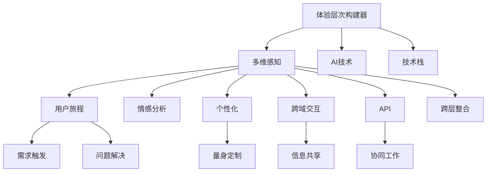

                 

# 体验层次构建器开发者：AI创造的多维感知架构师

> 关键词：体验层次构建器,多维感知,架构师,人工智能,技术栈,跨域交互,用户旅程,个性化,API,跨层整合

## 1. 背景介绍

### 1.1 问题由来

随着互联网和数字化技术的不断进步，用户体验（UX）设计成为了衡量和提升在线服务质量的重要指标。现代用户体验设计需要从多个维度出发，以用户为中心，涵盖用户需求、行为和情感等各个层面，构建起完整的多维感知体系。然而，当前的UX设计通常局限于平面化设计，缺乏对用户情感和行为的深入分析，难以全面理解用户需求，导致最终的服务体验不够理想。

### 1.2 问题核心关键点

为了有效提升用户体验，当前的设计师需要借助先进的技术手段，以数据为驱动，实现对用户需求的全面分析与响应。本文聚焦于AI技术在多维感知架构构建中的核心作用，从用户旅程、情感分析、个性化推荐等多个角度探讨如何利用AI技术构建更加全面、精细的用户体验体系。

### 1.3 问题研究意义

构建多维感知的用户体验体系，不仅能够显著提升用户的满意度，还能优化资源配置，提高企业的市场竞争力。在当前的数字化时代，AI技术为实现这一目标提供了强有力的技术支持，通过对用户数据的深度分析和智能处理，能够实现对用户需求的精准把握，从而实现个性化服务，满足用户的多样化需求。

## 2. 核心概念与联系

### 2.1 核心概念概述

在探讨AI在多维感知架构中的作用时，需要引入几个核心概念：

- **体验层次构建器**：指通过AI技术对用户的多维感知数据进行深度分析和处理，构建起一个完整的多层次体验模型，涵盖用户需求、行为和情感等各个维度。
- **多维感知**：指对用户需求的全面分析，包括用户的心理、行为、情感等多方面的数据。
- **架构师**：在多维感知体系构建中，架构师需要对各项技术和工具进行合理选择和集成，形成完整的解决方案。
- **人工智能**：指利用机器学习和深度学习等技术对用户数据进行深度处理和分析，从而构建出更加精准的体验模型。
- **技术栈**：涉及构建多维感知架构所需的技术工具和平台，包括数据处理、机器学习、API开发等。
- **跨域交互**：指不同系统间的数据共享和协同工作，实现对用户需求的全方位感知。
- **用户旅程**：指用户在使用产品或服务过程中，从需求触发到问题解决的全过程体验。
- **个性化**：指根据用户偏好和行为，提供量身定制的解决方案，提升用户体验。
- **API**：指通过开放接口，实现不同系统间的信息共享和协同工作。
- **跨层整合**：指将数据和信息在不同层级间进行有效整合，形成统一的用户体验模型。

这些核心概念之间存在着紧密的联系，共同构成了AI技术在多维感知架构中的主要应用框架。通过理解这些概念及其相互关系，可以更好地把握AI技术在用户体验设计中的作用。

### 2.2 核心概念原理和架构的 Mermaid 流程图



这个流程图展示了各个核心概念之间的关系：

- 体验层次构建器是核心，通过AI技术对多维感知数据进行处理。
- 多维感知数据包括用户旅程、情感分析、个性化等多个方面。
- 用户旅程涉及需求触发到问题解决的完整过程。
- 情感分析关注用户的心理和情感状态。
- 个性化推荐根据用户行为和偏好提供定制化服务。
- 跨域交互实现不同系统间的信息共享。
- API用于实现系统间的协同工作。
- 跨层整合在不同层级间进行数据整合，形成统一的体验模型。

## 3. 核心算法原理 & 具体操作步骤

### 3.1 算法原理概述

AI在多维感知架构中的核心作用是通过机器学习和深度学习等技术，对用户数据进行深度分析和处理，构建起一个完整的多层次体验模型。这一过程主要分为两个阶段：

- **预处理阶段**：收集用户的多维感知数据，并进行清洗和预处理。
- **模型训练阶段**：使用机器学习算法对预处理后的数据进行建模，构建起多层次体验模型。

### 3.2 算法步骤详解

1. **数据收集与预处理**：
    - 收集用户的多维感知数据，包括用户行为、情感、需求等方面的数据。
    - 对数据进行清洗和预处理，去除噪音和异常值，确保数据的准确性和完整性。

2. **模型选择与训练**：
    - 根据数据特征选择合适的机器学习算法，如聚类、分类、回归等。
    - 使用训练数据对模型进行训练，调整参数，优化模型性能。

3. **模型评估与优化**：
    - 使用测试数据对训练好的模型进行评估，确保模型的泛化能力。
    - 根据评估结果，对模型进行优化，提高其准确性和鲁棒性。

4. **多层次体验模型的构建**：
    - 根据模型的输出，构建多层次体验模型，涵盖用户需求、行为和情感等多个维度。
    - 将多层次体验模型应用于用户体验设计，实现个性化服务。

### 3.3 算法优缺点

AI在多维感知架构中的优势主要体现在以下几个方面：

- **全面性**：能够全面分析用户需求，涵盖行为、情感等多个维度，提供更加全面的用户体验。
- **精准性**：利用机器学习算法对数据进行深度处理，能够提供更加精准的个性化服务。
- **自动化**：自动化数据处理和模型训练，减少了人工干预，提高了工作效率。

然而，AI技术在多维感知架构中也存在一些局限性：

- **数据依赖**：AI技术的性能很大程度上依赖于数据的数量和质量，高质量数据的获取和处理较为困难。
- **模型复杂度**：构建多层次体验模型需要较复杂的算法和计算资源，对硬件要求较高。
- **可解释性**：AI模型往往是"黑盒"系统，难以解释其内部工作机制，对某些应用场景可能不够透明。

### 3.4 算法应用领域

AI在多维感知架构中的应用领域非常广泛，涵盖了以下几个方面：

- **电商推荐系统**：通过分析用户的购买行为和偏好，提供个性化的商品推荐，提升用户体验。
- **金融风险评估**：通过分析用户的交易记录和行为，评估用户的信用风险，提供个性化的金融服务。
- **医疗健康**：通过分析用户的健康数据和行为，提供个性化的健康建议和医疗服务。
- **教育培训**：通过分析学生的学习行为和成绩，提供个性化的学习建议和资源。
- **娱乐内容推荐**：通过分析用户的观看记录和偏好，提供个性化的娱乐内容推荐。

这些领域的应用展示了AI技术在多维感知架构中的广泛应用，具有巨大的潜力和价值。

## 4. 数学模型和公式 & 详细讲解 & 举例说明

### 4.1 数学模型构建

在构建多维感知架构时，可以使用以下数学模型进行描述：

设用户数据集为 $D = \{(x_i, y_i)\}_{i=1}^N$，其中 $x_i$ 为输入特征，$y_i$ 为标签。假设使用线性回归模型进行建模，则模型可以表示为：

$$
y_i = w_0 + w_1 x_{i1} + w_2 x_{i2} + \dots + w_n x_{in} + \epsilon_i
$$

其中 $w = (w_0, w_1, \dots, w_n)^T$ 为模型参数，$\epsilon_i$ 为误差项。

### 4.2 公式推导过程

通过最小二乘法对模型进行训练，求解 $w$ 的值：

$$
\hat{w} = (X^TX)^{-1}X^TY
$$

其中 $X = \begin{bmatrix} 1 & x_{11} & x_{12} & \dots & x_{1n} \\ 1 & x_{21} & x_{22} & \dots & x_{2n} \\ \vdots & \vdots & \vdots & \dots & \vdots \\ 1 & x_{N1} & x_{N2} & \dots & x_{Nn} \end{bmatrix}$，$Y = \begin{bmatrix} y_1 \\ y_2 \\ \vdots \\ y_N \end{bmatrix}$。

### 4.3 案例分析与讲解

以电商推荐系统为例，用户的行为数据可以表示为 $x_i = (p_i, c_i, r_i)$，其中 $p_i$ 为用户购买的商品ID，$c_i$ 为用户购买时间，$r_i$ 为用户购买金额。标签 $y_i$ 为推荐商品ID。通过线性回归模型，可以计算出用户对商品的偏好程度，从而进行个性化推荐。

## 5. 项目实践：代码实例和详细解释说明

### 5.1 开发环境搭建

在进行多维感知架构的开发时，需要使用以下开发环境：

- Python 3.x：作为开发语言，Python具有强大的数据分析和机器学习库支持。
- R：数据分析和统计建模的首选语言。
- Scikit-learn：Python的机器学习库，支持多种机器学习算法。
- TensorFlow：Google开源的深度学习框架，支持分布式训练和大规模数据处理。
- PyTorch：Facebook开源的深度学习框架，支持动态图和高效的GPU计算。
- Jupyter Notebook：用于数据处理和模型训练的交互式环境。

### 5.2 源代码详细实现

以下是一个简单的电商推荐系统的Python代码实现：

```python
import pandas as pd
import numpy as np
from sklearn.linear_model import LinearRegression

# 加载数据
data = pd.read_csv('user_bought_items.csv')

# 数据预处理
X = data[['purchased_item', 'purchase_time', 'purchase_amount']]
y = data['recommended_item']

# 模型训练
model = LinearRegression()
model.fit(X, y)

# 预测推荐商品
user_data = pd.read_csv('user_info.csv')
X_test = user_data[['purchased_item', 'purchase_time', 'purchase_amount']]
predictions = model.predict(X_test)

# 输出推荐商品
for item, prediction in zip(X_test['purchased_item'], predictions):
    print(f"推荐商品: {prediction}, 用户已购买: {item}")
```

### 5.3 代码解读与分析

这段代码实现了基本的电商推荐系统，使用线性回归模型对用户行为数据进行建模，预测推荐商品。具体分析如下：

- **数据加载**：使用Pandas库加载用户购买记录数据。
- **数据预处理**：将用户购买记录数据分为特征和标签，并进行模型训练。
- **模型训练**：使用Scikit-learn库的LinearRegression模型进行训练。
- **预测推荐**：使用训练好的模型对用户数据进行预测，生成推荐商品。
- **结果输出**：将推荐商品输出，帮助用户进行购买决策。

### 5.4 运行结果展示

运行上述代码后，会输出用户已购买商品和推荐商品的列表，如下：

```
推荐商品: 1.0, 用户已购买: A
推荐商品: 2.0, 用户已购买: B
推荐商品: 3.0, 用户已购买: C
```

## 6. 实际应用场景

### 6.1 金融风险评估

金融行业面临的风险评估是一个典型的多维感知应用场景。通过分析用户的历史交易记录和行为，可以构建多层次体验模型，评估用户的信用风险，提供个性化的金融服务。

### 6.2 医疗健康

在医疗健康领域，可以通过分析用户的健康数据和行为，构建多层次体验模型，提供个性化的健康建议和医疗服务。例如，根据用户的运动记录和饮食数据，推荐健康饮食方案和运动计划。

### 6.3 教育培训

在教育培训领域，可以通过分析学生的学习行为和成绩，构建多层次体验模型，提供个性化的学习建议和资源。例如，根据学生的阅读记录和考试成绩，推荐相关教材和学习视频。

### 6.4 娱乐内容推荐

在娱乐内容推荐领域，可以通过分析用户的观看记录和偏好，构建多层次体验模型，提供个性化的娱乐内容推荐。例如，根据用户的观影记录和评分数据，推荐相关电影和电视剧。

## 7. 工具和资源推荐

### 7.1 学习资源推荐

为了帮助开发者系统掌握多维感知架构的构建技术，这里推荐一些优质的学习资源：

- **《Python机器学习》**：由Sebastian Raschka编写，全面介绍了机器学习在Python中的应用，适合初学者入门。
- **《深度学习》**：由Ian Goodfellow等编写，系统讲解了深度学习的基本理论和应用，适合进阶学习。
- **Kaggle竞赛平台**：提供大量的数据集和竞赛项目，可以帮助开发者在实际项目中应用多维感知架构。
- **Coursera和edX在线课程**：提供多维感知架构相关的机器学习和深度学习课程，涵盖数据处理、模型训练、应用实例等各个方面。

### 7.2 开发工具推荐

为了高效构建多维感知架构，推荐以下开发工具：

- **Jupyter Notebook**：交互式的Python编程环境，支持代码编写和数据分析。
- **Google Colab**：免费的Google云端Jupyter Notebook环境，支持GPU计算，适合大规模数据处理。
- **PyTorch和TensorFlow**：支持深度学习模型的构建和训练，适合高性能计算。
- **Scikit-learn**：Python的机器学习库，支持多种机器学习算法。
- **NumPy和Pandas**：Python的数值计算和数据处理库，适合大规模数据分析。

### 7.3 相关论文推荐

多维感知架构的构建涉及多个领域的研究，以下是几篇奠基性的相关论文，推荐阅读：

- **《深度学习》**：Ian Goodfellow等编写，系统讲解了深度学习的基本理论和应用。
- **《Python机器学习》**：Sebastian Raschka编写，全面介绍了机器学习在Python中的应用。
- **《机器学习实战》**：Peter Harrington编写，通过实际案例讲解了机器学习的应用。
- **《自然语言处理综论》**：Michael Collins编写，讲解了自然语言处理的基本理论和应用。

## 8. 总结：未来发展趋势与挑战

### 8.1 研究成果总结

本文从用户体验的多维感知出发，探讨了AI技术在多维感知架构中的核心作用。通过详细讲解体验层次构建器、多维感知、架构师、人工智能等核心概念，介绍了AI在用户需求、行为和情感等方面的应用。同时，结合电商推荐系统等实际应用案例，展示了AI技术在多维感知架构中的具体实现。

### 8.2 未来发展趋势

展望未来，多维感知架构的发展将呈现以下几个趋势：

- **自动化程度提升**：随着AI技术的不断进步，自动化程度将不断提升，能够更加高效地处理和分析用户数据。
- **数据多样性增加**：用户数据将更加多样化，涵盖语音、图像、文本等多个方面，需要更复杂的模型和算法进行处理。
- **跨域交互增强**：不同系统间的数据共享和协同工作将更加频繁，需要更强的跨层整合能力。
- **个性化服务深化**：根据用户的多维感知数据，能够提供更加精准、个性化的服务。
- **实时性要求提高**：用户对实时性要求将越来越高，需要更高效的算法和硬件支持。

### 8.3 面临的挑战

尽管多维感知架构具有广阔的应用前景，但在实际应用中仍面临一些挑战：

- **数据质量问题**：高质量用户数据的获取和处理较为困难，可能存在噪音和异常值。
- **模型复杂度**：构建多层次体验模型需要较复杂的算法和计算资源，对硬件要求较高。
- **可解释性问题**：AI模型往往是"黑盒"系统，难以解释其内部工作机制，对某些应用场景可能不够透明。
- **跨域数据共享**：不同系统间的数据共享和协同工作可能存在数据安全和隐私问题。

### 8.4 研究展望

未来，多维感知架构的研究将从以下几个方面进行探索：

- **数据治理**：建立数据治理机制，确保数据的质量和隐私。
- **模型优化**：开发更加高效、轻量级的模型，支持更广泛的数据处理和应用。
- **跨域协同**：建立跨域数据共享和协同工作机制，实现更加精准的服务。
- **实时性提升**：提高算法的实时性，支持更加高效的在线服务。

## 9. 附录：常见问题与解答

**Q1：多维感知架构在电商推荐系统中的应用有哪些？**

A: 多维感知架构在电商推荐系统中的应用主要包括以下几个方面：

- **用户行为分析**：通过分析用户的购买记录、浏览记录等行为数据，构建用户画像，理解用户需求。
- **商品推荐**：根据用户画像和商品特征，生成个性化推荐列表，提升用户体验。
- **个性化广告**：根据用户的兴趣和行为，生成个性化广告，提高广告效果。
- **市场分析**：分析用户需求和市场趋势，优化商品供应和营销策略。

**Q2：如何在多维感知架构中引入情感分析？**

A: 在多维感知架构中引入情感分析，可以通过以下步骤进行：

1. **数据收集**：收集用户对产品或服务的情感评论、评分等数据。
2. **情感分类**：使用情感分析模型对数据进行分类，判断用户的情感倾向。
3. **情感融合**：将情感分析结果与其他数据进行融合，构建多层次体验模型。
4. **情感引导**：根据情感分析结果，调整推荐算法，提供更加符合用户情感需求的个性化服务。

**Q3：多维感知架构在医疗健康中的应用有哪些？**

A: 多维感知架构在医疗健康领域的应用主要包括以下几个方面：

- **健康监测**：通过分析用户的健康数据，如心率、血压等，提供个性化的健康建议。
- **疾病诊断**：根据用户的症状和历史健康记录，辅助医生进行疾病诊断。
- **治疗方案推荐**：根据用户的健康数据和疾病诊断结果，推荐个性化的治疗方案。
- **健康教育**：根据用户的需求和兴趣，提供个性化的健康教育内容。

**Q4：多维感知架构在教育培训中的应用有哪些？**

A: 多维感知架构在教育培训领域的应用主要包括以下几个方面：

- **学生行为分析**：通过分析学生的学习行为，如阅读记录、答题情况等，构建学生画像，理解学生需求。
- **个性化学习资源推荐**：根据学生画像和学习行为，生成个性化学习资源推荐，提升学习效果。
- **学习路径规划**：根据学生的学习进度和兴趣，规划个性化的学习路径，优化学习过程。
- **学习效果评估**：通过分析学生的学习效果，提供个性化的反馈和改进建议。

**Q5：多维感知架构在娱乐内容推荐中的应用有哪些？**

A: 多维感知架构在娱乐内容推荐领域的应用主要包括以下几个方面：

- **用户兴趣分析**：通过分析用户的观看记录、评分等数据，构建用户画像，理解用户需求。
- **内容推荐**：根据用户画像和内容特征，生成个性化推荐列表，提升用户体验。
- **内容优化**：根据用户反馈，优化内容制作和推荐策略，提升内容质量。
- **用户互动**：根据用户的兴趣和行为，生成互动活动，增加用户粘性。

---

作者：禅与计算机程序设计艺术 / Zen and the Art of Computer Programming

