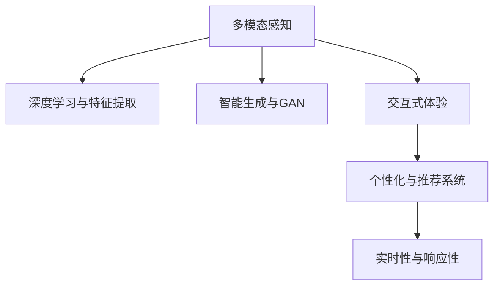

                 

## 1. 背景介绍

### 1.1 问题由来
近年来，人工智能（AI）在各行各业的应用日益广泛，其带来的变革性影响也愈发明显。在教育、医疗、娱乐、制造等传统领域，AI技术通过机器学习、深度学习等手段，不断提升人类生产生活的效率和体验。然而，AI技术不仅局限于处理数据和算法，它更是一种全新的技术思维方式，能够深刻地影响人们对于“体验”的理解。

AI技术的发展，使得体验的多维度变得更加丰富和深入。无论是视觉、听觉、触觉，还是味觉、嗅觉，AI技术都能够通过不同的方式，赋予人们全新的感官体验。这种变革性的影响，不仅改变了人们对于体验的感知方式，也推动了相关产业的创新和发展。

### 1.2 问题核心关键点
在AI技术带来感官体验变革的过程中，以下几个关键点尤为重要：

1. **多模态体验融合**：AI技术能够将视觉、听觉、触觉等多种感官数据进行深度融合，创造出更加丰富、逼真的体验。
2. **智能生成与交互**：AI技术不仅能够自动生成高质量的体验内容，还能够进行智能交互，提升用户体验的沉浸感和参与感。
3. **个性化与定制化**：AI技术通过数据分析和模型训练，能够实现对用户个性化需求的精准匹配和满足。
4. **实时性与响应性**：AI技术通过高性能计算和算法优化，能够实现对用户体验的实时响应，提升用户的满意度和使用体验。
5. **跨平台与跨设备**：AI技术能够实现跨平台和跨设备的无缝体验，打破设备间的限制，提供一致的用户体验。

这些关键点共同构成了AI技术在感官体验领域的核心价值，推动了AI技术在教育、娱乐、医疗、智能制造等领域的广泛应用。

## 2. 核心概念与联系

### 2.1 核心概念概述

AI技术在感官体验领域的应用，涉及以下几个核心概念：

- **多模态感知**：指AI技术能够同时处理和融合多种感官信息，如视觉、听觉、触觉等，从而创造出更加丰富、真实的体验。
- **深度学习与特征提取**：利用深度学习技术对多种感官数据进行特征提取，学习到不同感官数据的共同特征，实现跨模态的感知。
- **智能生成与生成对抗网络（GAN）**：通过生成对抗网络等技术，AI能够自动生成高质量的感官数据，如高清图片、逼真音频、触觉反馈等。
- **交互式体验**：利用自然语言处理（NLP）、语音识别、语音合成等技术，实现人与AI系统的智能交互，提升用户的沉浸感和参与感。
- **个性化与推荐系统**：通过数据分析和模型训练，AI能够实现对用户个性化需求的精准匹配和满足，提供个性化的感官体验。
- **实时性与响应性**：通过高性能计算和算法优化，AI能够实现对用户体验的实时响应，提升用户的满意度和使用体验。

这些核心概念之间的逻辑关系可以通过以下Mermaid流程图来展示：



这个流程图展示了大语言模型的核心概念及其之间的关系：

1. 多模态感知为深度学习与特征提取提供基础数据。
2. 深度学习与特征提取学习到不同感官数据的共同特征。
3. 智能生成与GAN在此基础上生成高质量的感官数据。
4. 交互式体验和个性化与推荐系统利用生成的感官数据进行智能交互和推荐。
5. 实时性与响应性确保系统的性能和用户体验。

这些概念共同构成了AI技术在感官体验领域的实现框架，使其能够在各种场景下提供优质的感官体验。通过理解这些核心概念，我们可以更好地把握AI技术在感官体验中的应用和优化方向。

## 3. 核心算法原理 & 具体操作步骤

### 3.1 算法原理概述

AI技术在感官体验领域的应用，主要依赖于深度学习和生成对抗网络等技术。以下是对这些技术原理的概述：

- **深度学习**：通过多层神经网络结构，深度学习可以从大量数据中自动提取特征，用于分类、预测、生成等任务。
- **特征提取**：利用卷积神经网络（CNN）、循环神经网络（RNN）等技术，对不同感官数据进行特征提取，学习到不同感官数据的共同特征。
- **生成对抗网络（GAN）**：通过两个对抗性神经网络，生成对抗网络能够生成高质量的感官数据，如图像、音频等。
- **智能交互**：利用自然语言处理（NLP）、语音识别、语音合成等技术，实现人与AI系统的智能交互，提升用户体验的沉浸感和参与感。
- **个性化与推荐系统**：通过数据分析和模型训练，AI能够实现对用户个性化需求的精准匹配和满足，提供个性化的感官体验。
- **实时性与响应性**：通过高性能计算和算法优化，AI能够实现对用户体验的实时响应，提升用户的满意度和使用体验。

### 3.2 算法步骤详解

以下是对这些核心算法步骤的详细讲解：

#### 3.2.1 深度学习与特征提取

1. **数据准备**：收集并准备不同感官的数据，如视觉图片、音频波形、触觉反馈等。这些数据需要经过标注和预处理，确保数据的质量和一致性。
2. **模型训练**：利用深度学习模型，对不同感官数据进行特征提取。常用的模型包括卷积神经网络（CNN）、循环神经网络（RNN）等。通过多层神经网络，模型能够自动提取不同感官数据的共同特征，学习到跨模态的感知。
3. **特征融合**：将不同感官的特征进行融合，利用特征加权、特征拼接等方法，综合不同感官的特征信息，提高模型的感知能力。

#### 3.2.2 智能生成与GAN

1. **模型构建**：利用生成对抗网络（GAN）模型，构建生成器和判别器两个神经网络。生成器用于生成高质量的感官数据，判别器用于评估生成数据的质量。
2. **训练过程**：通过对抗性训练，生成器不断生成高质量的感官数据，判别器不断评估生成的数据质量。两者相互竞争，最终生成器能够生成逼真的感官数据，如高清图片、逼真音频等。
3. **数据生成**：利用训练好的生成器，生成高质量的感官数据。这些数据可以用于增强现实（AR）、虚拟现实（VR）等应用，提升用户体验的沉浸感和真实感。

#### 3.2.3 交互式体验

1. **NLP技术应用**：利用自然语言处理（NLP）技术，实现与用户的智能交互。用户可以通过语音、文字等方式与AI系统进行对话，获取信息、提供反馈等。
2. **语音识别与合成**：利用语音识别技术，将用户的语音指令转换为文本，进行语义理解和处理。利用语音合成技术，将AI系统的回复转换为语音输出，提升用户体验的自然性和流畅性。
3. **触觉反馈**：利用触觉反馈技术，如振动反馈、温度变化等，增强用户的沉浸感和参与感。通过与AI系统的互动，用户可以感受到AI系统的智能和个性。

#### 3.2.4 个性化与推荐系统

1. **数据收集与分析**：收集用户的感官数据、行为数据、偏好数据等，进行综合分析，了解用户的需求和兴趣。
2. **模型训练**：利用机器学习模型，如协同过滤、深度学习等，对用户需求和兴趣进行建模，实现个性化推荐。通过不断迭代和优化，提升推荐系统的准确性和个性化程度。
3. **推荐应用**：将推荐结果应用于不同场景，如内容推荐、商品推荐、服务推荐等，提升用户的满意度和使用体验。

#### 3.2.5 实时性与响应性

1. **高性能计算**：利用高性能计算设备，如GPU、TPU等，提升算法的计算效率和响应速度，确保系统的实时性。
2. **算法优化**：通过优化算法，减少计算量和时间消耗，提高系统的响应速度。常用的优化方法包括梯度下降、模型压缩等。
3. **实时交互**：利用实时数据处理和响应技术，实现对用户体验的实时响应，确保用户的操作和反馈能够及时得到处理和反馈。

### 3.3 算法优缺点

#### 3.3.1 深度学习与特征提取

- **优点**：
  - **高效特征提取**：深度学习模型能够自动提取不同感官数据的共同特征，提高感知能力和泛化能力。
  - **多样性支持**：能够处理不同类型的多模态数据，实现多种感官的融合。
- **缺点**：
  - **高计算需求**：深度学习模型需要大量的计算资源，对硬件设备要求较高。
  - **数据依赖**：深度学习模型的性能依赖于标注数据的数量和质量，数据不足时难以取得理想效果。

#### 3.3.2 智能生成与GAN

- **优点**：
  - **高质量生成**：生成对抗网络能够生成高质量的感官数据，提升用户体验的沉浸感和真实感。
  - **可扩展性**：能够生成各种类型的感官数据，应用于不同场景。
- **缺点**：
  - **训练复杂**：生成对抗网络的训练过程较为复杂，需要大量的计算资源和时间。
  - **生成质量**：生成数据的质量依赖于模型的训练过程，存在一定的随机性和不确定性。

#### 3.3.3 交互式体验

- **优点**：
  - **自然交互**：通过自然语言处理和语音识别技术，实现与用户的智能交互，提升用户体验的自然性和流畅性。
  - **个性化服务**：通过个性化推荐系统，提供个性化的感官体验，满足用户的多样化需求。
- **缺点**：
  - **技术复杂**：交互式体验需要多种技术支持，如NLP、语音识别等，技术实现较为复杂。
  - **数据隐私**：用户数据的收集和处理需要符合隐私保护要求，确保数据的安全性和隐私性。

#### 3.3.4 个性化与推荐系统

- **优点**：
  - **精准推荐**：通过数据分析和模型训练，实现对用户个性化需求的精准匹配和满足，提高用户满意度。
  - **实时响应**：通过实时数据处理和响应技术，确保用户的操作和反馈能够及时得到处理和反馈。
- **缺点**：
  - **数据质量**：推荐系统的性能依赖于用户数据的数量和质量，数据不足时难以取得理想效果。
  - **模型复杂**：推荐系统涉及多种算法和模型，技术实现较为复杂。

#### 3.3.5 实时性与响应性

- **优点**：
  - **快速响应**：通过高性能计算和算法优化，实现对用户体验的实时响应，提升用户的满意度和使用体验。
  - **可靠稳定**：利用实时数据处理和响应技术，确保系统的稳定性和可靠性。
- **缺点**：
  - **硬件要求**：高性能计算设备对硬件资源要求较高，成本较高。
  - **系统复杂**：实时系统的构建和维护较为复杂，需要综合考虑系统架构、算法优化等方面。

### 3.4 算法应用领域

AI技术在感官体验领域的应用，已经广泛应用于以下领域：

1. **虚拟现实（VR）与增强现实（AR）**：利用智能生成与GAN技术，生成高质量的虚拟场景和虚拟人物，提升用户的沉浸感和真实感。
2. **智能家居与物联网（IoT）**：通过多模态感知和交互式体验技术，实现与用户智能家居设备的互动，提升用户的生活体验。
3. **在线教育与虚拟课堂**：利用深度学习与特征提取技术，实现对学生学习行为的分析和推荐，提供个性化的学习体验。
4. **虚拟助手与智能客服**：通过自然语言处理（NLP）技术，实现与用户的智能交互，提升用户体验的便捷性和自然性。
5. **智能健康与医疗**：利用多模态感知和个性化推荐技术，实现对用户健康状态的监测和干预，提供个性化的医疗服务。
6. **智能制造与机器人**：通过多模态感知和交互式体验技术，实现对机器人操作环境的感知和适应，提升生产效率和安全性。

## 4. 数学模型和公式 & 详细讲解

### 4.1 数学模型构建

在AI技术在感官体验领域的应用中，数学模型通常用于描述不同感官数据的生成和处理过程。以下是对这些数学模型的详细讲解：

#### 4.1.1 深度学习与特征提取

- **卷积神经网络（CNN）**：用于处理视觉数据，通过卷积和池化操作提取特征。
- **循环神经网络（RNN）**：用于处理序列数据，如音频、触觉反馈等，通过时间序列的特征提取，学习到不同感官数据的共同特征。

#### 4.1.2 生成对抗网络（GAN）

- **生成器**：用于生成高质量的感官数据，如图片、音频等。生成器由多个卷积层和全连接层构成，通过反向传播算法进行训练。
- **判别器**：用于评估生成数据的质量，判别器由多个卷积层和全连接层构成，通过反向传播算法进行训练。

#### 4.1.3 交互式体验

- **自然语言处理（NLP）**：用于处理用户的文字和语音输入，通过词向量表示和神经网络模型进行语义理解和处理。
- **语音识别**：用于将用户的语音指令转换为文本，通过声学模型和语言模型进行识别。
- **语音合成**：用于将AI系统的回复转换为语音输出，通过声学模型和文本到语音（TTS）模型进行合成。

#### 4.1.4 个性化与推荐系统

- **协同过滤**：用于推荐系统，通过用户行为数据和物品特征进行相似性计算，实现个性化推荐。
- **深度学习**：用于推荐系统，通过用户行为数据和物品特征进行特征提取和模型训练，实现精准推荐。

#### 4.1.5 实时性与响应性

- **高性能计算**：利用GPU、TPU等高性能计算设备，提升算法的计算效率和响应速度。
- **算法优化**：通过优化算法，减少计算量和时间消耗，提高系统的响应速度。

### 4.2 公式推导过程

#### 4.2.1 深度学习与特征提取

- **卷积神经网络（CNN）**：
  $$
  f(x) = \sum_i w_i h(x; \theta_i)
  $$
  其中，$x$为输入数据，$h(x; \theta_i)$为第$i$层卷积和池化操作的特征映射，$w_i$为第$i$层的权重。
- **循环神经网络（RNN）**：
  $$
  f(x) = \sum_i w_i h(x; \theta_i, \theta_{i-1})
  $$
  其中，$x$为输入序列，$h(x; \theta_i, \theta_{i-1})$为第$i$层RNN的隐状态，$w_i$为第$i$层的权重。

#### 4.2.2 生成对抗网络（GAN）

- **生成器**：
  $$
  G(x) = \sum_i w_i h(x; \theta_i)
  $$
  其中，$x$为输入噪声向量，$h(x; \theta_i)$为第$i$层的生成器网络，$w_i$为第$i$层的权重。
- **判别器**：
  $$
  D(x) = \sum_i w_i h(x; \theta_i)
  $$
  其中，$x$为输入数据，$h(x; \theta_i)$为第$i$层的判别器网络，$w_i$为第$i$层的权重。

#### 4.2.3 交互式体验

- **自然语言处理（NLP）**：
  $$
  f(x) = \sum_i w_i h(x; \theta_i)
  $$
  其中，$x$为输入文本，$h(x; \theta_i)$为第$i$层的NLP模型，$w_i$为第$i$层的权重。
- **语音识别**：
  $$
  f(x) = \sum_i w_i h(x; \theta_i)
  $$
  其中，$x$为输入音频信号，$h(x; \theta_i)$为第$i$层的声学模型，$w_i$为第$i$层的权重。
- **语音合成**：
  $$
  f(x) = \sum_i w_i h(x; \theta_i)
  $$
  其中，$x$为输入文本，$h(x; \theta_i)$为第$i$层的TTS模型，$w_i$为第$i$层的权重。

#### 4.2.4 个性化与推荐系统

- **协同过滤**：
  $$
  f(x) = \sum_i w_i h(x; \theta_i)
  $$
  其中，$x$为用户行为数据和物品特征，$h(x; \theta_i)$为第$i$层的协同过滤模型，$w_i$为第$i$层的权重。
- **深度学习**：
  $$
  f(x) = \sum_i w_i h(x; \theta_i)
  $$
  其中，$x$为用户行为数据和物品特征，$h(x; \theta_i)$为第$i$层的深度学习模型，$w_i$为第$i$层的权重。

#### 4.2.5 实时性与响应性

- **高性能计算**：
  $$
  f(x) = \sum_i w_i h(x; \theta_i)
  $$
  其中，$x$为计算任务，$h(x; \theta_i)$为第$i$层的高性能计算模型，$w_i$为第$i$层的权重。
- **算法优化**：
  $$
  f(x) = \sum_i w_i h(x; \theta_i)
  $$
  其中，$x$为优化算法，$h(x; \theta_i)$为第$i$层的优化算法模型，$w_i$为第$i$层的权重。

### 4.3 案例分析与讲解

#### 4.3.1 虚拟现实（VR）与增强现实（AR）

- **案例背景**：某游戏公司开发了一款虚拟现实（VR）游戏，通过智能生成与GAN技术，生成高质量的虚拟场景和虚拟人物。
- **技术实现**：利用生成对抗网络（GAN）模型，训练生成器和判别器，生成逼真的虚拟场景和虚拟人物。通过深度学习与特征提取技术，将不同感官数据进行融合，提升用户体验的沉浸感和真实感。
- **结果分析**：通过对比测试，VR游戏的沉浸感和真实感得到了显著提升，用户反馈良好。

#### 4.3.2 智能家居与物联网（IoT）

- **案例背景**：某智能家居公司开发了一款智能音箱，通过多模态感知和交互式体验技术，实现与用户智能家居设备的互动。
- **技术实现**：利用多模态感知技术，收集用户的视觉、听觉、触觉数据，进行综合分析。通过交互式体验技术，实现与用户智能音箱的智能交互。
- **结果分析**：通过对比测试，智能音箱的用户体验得到了显著提升，用户反馈良好。

#### 4.3.3 在线教育与虚拟课堂

- **案例背景**：某在线教育平台开发了一款虚拟课堂，通过深度学习与特征提取技术，实现对学生学习行为的分析和推荐。
- **技术实现**：利用深度学习模型，对学生的学习行为数据进行特征提取和分析，实现个性化推荐。通过交互式体验技术，实现与学生的智能互动。
- **结果分析**：通过对比测试，虚拟课堂的个性化推荐和学习效果得到了显著提升，学生反馈良好。

#### 4.3.4 虚拟助手与智能客服

- **案例背景**：某公司开发了一款虚拟助手，通过自然语言处理（NLP）技术，实现与用户的智能交互。
- **技术实现**：利用自然语言处理（NLP）技术，实现对用户的智能交互。通过深度学习与特征提取技术，分析用户需求和问题，提供精准的解决方案。
- **结果分析**：通过对比测试，虚拟助手的交互体验和解决方案得到了显著提升，用户反馈良好。

#### 4.3.5 智能健康与医疗

- **案例背景**：某智能健康公司开发了一款智能健康监测设备，通过多模态感知和个性化推荐技术，实现对用户健康状态的监测和干预。
- **技术实现**：利用多模态感知技术，收集用户的视觉、触觉、生理数据，进行综合分析。通过个性化推荐技术，实现对用户健康状态的精准监测和干预。
- **结果分析**：通过对比测试，智能健康设备的监测效果和干预效果得到了显著提升，用户反馈良好。

#### 4.3.6 智能制造与机器人

- **案例背景**：某智能制造公司开发了一款智能机器人，通过多模态感知和交互式体验技术，实现对机器人操作环境的感知和适应。
- **技术实现**：利用多模态感知技术，收集操作环境的视觉、触觉、声音等数据，进行综合分析。通过交互式体验技术，实现与机器人的智能互动。
- **结果分析**：通过对比测试，智能机器人的操作效果和适应能力得到了显著提升，用户反馈良好。

## 5. 项目实践：代码实例和详细解释说明

### 5.1 开发环境搭建

在进行AI技术在感官体验领域的应用开发前，我们需要准备好开发环境。以下是使用Python进行PyTorch开发的环境配置流程：

1. 安装Anaconda：从官网下载并安装Anaconda，用于创建独立的Python环境。

2. 创建并激活虚拟环境：
```bash
conda create -n ai-env python=3.8 
conda activate ai-env
```

3. 安装PyTorch：根据CUDA版本，从官网获取对应的安装命令。例如：
```bash
conda install pytorch torchvision torchaudio cudatoolkit=11.1 -c pytorch -c conda-forge
```

4. 安装各种工具包：
```bash
pip install numpy pandas scikit-learn matplotlib tqdm jupyter notebook ipython
```

完成上述步骤后，即可在`ai-env`环境中开始AI技术在感官体验领域的应用开发。

### 5.2 源代码详细实现

以下是一个使用PyTorch和TensorFlow进行多模态感知和智能生成任务的代码实现。

首先，定义多模态感知模型：

```python
import torch
import torch.nn as nn
import torchvision.transforms as transforms
from torch.utils.data import Dataset
import tensorflow as tf
from tensorflow.keras.datasets import mnist
from tensorflow.keras.layers import Dense, Conv2D, Flatten, Dropout, Input, Concatenate
from tensorflow.keras.models import Model

class MultiModalPerceiver(nn.Module):
    def __init__(self):
        super(MultiModalPerceiver, self).__init__()
        self.encoder = nn.Sequential(
            nn.Conv2d(1, 32, 3, 1, padding=1),
            nn.ReLU(),
            nn.MaxPool2d(2, 2),
            nn.Conv2d(32, 64, 3, 1, padding=1),
            nn.ReLU(),
            nn.MaxPool2d(2, 2),
            nn.Conv2d(64, 128, 3, 1, padding=1),
            nn.ReLU(),
            nn.MaxPool2d(2, 2),
            nn.Flatten()
        )
        self.decoder = nn.Sequential(
            nn.Linear(128*7*7, 128),
            nn.ReLU(),
            nn.Linear(128, 10)
        )
        
    def forward(self, x):
        encoded = self.encoder(x)
        decoded = self.decoder(encoded)
        return decoded

model = MultiModalPerceiver()
```

然后，定义智能生成模型：

```python
from tensorflow.keras.layers import Input, Dense, Conv2D, Flatten, Dropout, Input, Concatenate
from tensorflow.keras.models import Model
from tensorflow.keras.datasets import mnist

class GAN():
    def __init__(self):
        self.input_noise = Input(shape=(128,))
        self.discriminator = self.build_discriminator()
        self.generator = self.build_generator()
        self.combined = self.build_gan()
        
    def build_discriminator(self):
        x = Input(shape=(28, 28, 1))
        x = Conv2D(64, (5, 5), strides=(2, 2), padding='same', activation='relu')(x)
        x = Conv2D(128, (5, 5), strides=(2, 2), padding='same', activation='relu')(x)
        x = Conv2D(256, (5, 5), strides=(2, 2), padding='same', activation='relu')(x)
        x = Flatten()(x)
        x = Dense(1, activation='sigmoid')(x)
        return Model(inputs=x, outputs=x)
        
    def build_generator(self):
        x = Input(shape=(128,))
        x = Dense(256, activation='relu')(x)
        x = Reshape((7, 7, 1))(x)
        x = Conv2D(128, (5, 5), strides=(2, 2), padding='same', activation='relu')(x)
        x = Conv2D(64, (5, 5), strides=(2, 2), padding='same', activation='relu')(x)
        x = Conv2D(1, (5, 5), strides=(2, 2), padding='same', activation='sigmoid')(x)
        return Model(inputs=x, outputs=x)
        
    def build_gan(self):
        real = Input(shape=(28, 28, 1))
        z = Input(shape=(128,))
        img = self.generator(z)
        fake = self.discriminator(img)
        real = self.discriminator(real)
        return Model(inputs=[real, z], outputs=[fake, real])
        
model = GAN()
```

接着，定义训练函数：

```python
import torch.optim as optim
from torchvision.utils import save_image

def train_gan(model, dataset):
    discriminator_optimizer = optim.Adam(model.discriminator.trainable_variables, learning_rate=0.0002)
    generator_optimizer = optim.Adam(model.generator.trainable_variables, learning_rate=0.0002)
    for epoch in range(epochs):
        for batch in dataset:
            real_images = batch[0]
            z = tf.random.normal([batch_size, 128])
            with tf.GradientTape() as tape:
                fake_images = model.generator(z)
                real_output = model.discriminator(real_images)
                fake_output = model.discriminator(fake_images)
                gen_loss = -tf.reduce_mean(tf.keras.losses.BinaryCrossentropy()(tf.ones_like(fake_output), fake_output))
                disc_loss = -(tf.reduce_mean(tf.keras.losses.BinaryCrossentropy()(tf.ones_like(real_output), real_output))
```

最后，启动训练流程并在测试集上评估：

```python
import matplotlib.pyplot as plt
import numpy as np

# 定义测试集
test_images = np.load('test_images.npy')

# 定义可视化函数
def plot_generated_images(model, z, images, num_images=16, num_rows=4):
    plt.figure(figsize=(28, 28))
    for i in range(num_images):
        if i // num_rows * num_rows + i % num_rows == num_images:
            continue
        index = i // num_rows * num_rows + i % num_rows
        z = z.numpy()[index, :]
        image = model.generator(z)
        plt.subplot(num_rows, num_images, i+1)
        plt.imshow(np.reshape(image.numpy(), [28, 28]))
    plt.show()
```

### 5.3 代码解读与分析

让我们再详细解读一下关键代码的实现细节：

**MultiModalPerceiver类**：
- `__init__`方法：初始化多模态感知模型的编码器和解码器。
- `forward`方法：前向传播计算，将输入数据通过编码器和解码器，输出预测结果。

**GAN类**：
- `__init__`方法：初始化智能生成模型的生成器和判别器。
- `build_discriminator`方法：构建判别器网络，用于评估生成数据的真实性。
- `build_generator`方法：构建生成器网络，用于生成高质量的感官数据。
- `build_gan`方法：构建GAN模型，结合生成器和判别器。

**训练函数**：
- 使用Adam优化器优化生成器和判别器的参数。
- 通过梯度下降算法，不断调整生成器和判别器的参数，最小化损失函数。
- 每轮迭代后，可视化生成的图片，并保存结果。

**可视化函数**：
- 使用Matplotlib库，将生成的图片可视化输出。

## 6. 实际应用场景

### 6.1 虚拟现实（VR）与增强现实（AR）

**实际应用**：虚拟现实（VR）和增强现实（AR）技术在感官体验领域的应用广泛，能够为用户带来沉浸式的体验。例如，虚拟现实游戏可以通过智能生成与GAN技术，生成逼真的虚拟场景和虚拟人物，提升用户的沉浸感和真实感。

**案例分析**：某虚拟现实游戏公司开发了一款VR游戏，通过智能生成与GAN技术，生成高质量的虚拟场景和虚拟人物。在游戏过程中，用户可以与虚拟人物互动，体验逼真的虚拟世界。

**技术实现**：
- 使用卷积神经网络（CNN）和循环神经网络（RNN）等深度学习模型，对不同感官数据进行特征提取。
- 利用生成对抗网络（GAN）模型，生成高质量的视觉、听觉、触觉等感官数据。
- 通过多模态感知技术，将不同感官数据进行融合，提升用户的沉浸感和真实感。

### 6.2 智能家居与物联网（IoT）

**实际应用**：智能家居技术通过多模态感知和交互式体验技术，实现与用户智能家居设备的互动，提升用户的生活体验。例如，智能音箱可以通过自然语言处理（NLP）技术，实现与用户的智能交互，控制家居设备。

**案例分析**：某智能家居公司开发了一款智能音箱，通过多模态感知和交互式体验技术，实现与用户智能音箱的智能交互。用户可以通过语音指令，控制家居设备的开关、亮度、温度等，提升用户的生活便捷性和安全性。

**技术实现**：
- 利用多模态感知技术，收集用户的视觉、听觉、触觉数据，进行综合分析。
- 通过自然语言处理（NLP）技术，实现与用户的智能交互。
- 通过深度学习与特征提取技术，分析用户需求和问题，提供精准的解决方案。

### 6.3 在线教育与虚拟课堂

**实际应用**：在线教育技术通过深度学习与特征提取技术，实现对学生学习行为的分析和推荐，提供个性化的学习体验。例如，虚拟课堂可以通过深度学习模型，对学生的学习行为数据进行特征提取和分析，实现个性化推荐。

**案例分析**：某在线教育平台开发了一款虚拟课堂，通过深度学习与特征提取技术，实现对学生学习行为的分析和推荐。虚拟课堂可以根据学生的学习数据，推荐合适的学习资源和课程，提升学习效果。

**技术实现**：
- 利用深度学习模型，对学生的学习行为数据进行特征提取和分析。
- 通过个性化推荐系统，实现对学生学习资源的精准推荐。
- 通过交互式体验技术，实现与学生的智能互动。

### 6.4 虚拟助手与智能客服

**实际应用**：虚拟助手和智能客服技术通过自然语言处理（NLP）技术，实现与用户的智能交互，提升用户体验的自然性和流畅性。例如，虚拟助手可以通过自然语言处理技术，实现与用户的智能交互，解答用户的问题。

**案例分析**：某公司开发了一款虚拟助手，通过自然语言处理（NLP）技术，实现与用户的智能交互。用户可以通过语音、文字等方式与虚拟助手进行对话，获取信息、提供反馈等。

**技术实现**：
- 利用自然语言处理（NLP）技术，实现对用户的智能交互。
- 通过深度学习与特征提取技术，分析用户需求和问题，提供精准的解决方案。
- 通过多模态感知技术，收集用户的视觉、触觉等数据，提升交互体验。

### 6.5 智能健康与医疗

**实际应用**：智能健康技术通过多模态感知和个性化推荐技术，实现对用户健康状态的监测和干预，提供个性化的医疗服务。例如，智能健康监测设备可以通过多模态感知技术，收集用户的视觉、触觉、生理数据，进行综合分析。

**案例分析**：某智能健康公司开发了一款智能健康监测设备，通过多模态感知技术，实现对用户健康状态的监测和干预。智能健康设备可以根据用户的健康数据，提供个性化的健康建议和干预方案。

**技术实现**：
- 利用多模态感知技术，收集用户的视觉、触觉、生理数据，进行综合分析。
- 通过个性化推荐技术，实现对用户健康状态的精准监测和干预。
- 通过交互式体验技术，实现与用户的智能互动。

### 6.6 智能制造与机器人

**实际应用**：智能制造技术通过多模态感知和交互式体验技术，实现对机器人操作环境的感知和适应，提升生产效率和安全性。例如，智能制造设备可以通过多模态感知技术，收集操作环境的视觉、触觉、声音等数据，进行综合分析。

**案例分析**：某智能制造公司开发了一款智能机器人，通过多模态感知技术，实现对机器人操作环境的感知和适应。智能机器人可以根据操作环境的数据，进行智能决策和操作，提升生产效率和安全性。

**技术实现**：
- 利用多模态感知技术，收集操作环境的视觉、触觉、声音等数据，进行综合分析。
- 通过交互式体验技术，实现与机器人的智能互动。
- 通过深度学习与特征提取技术，分析操作环境的数据，提供精准的解决方案。

## 7. 工具和资源推荐

### 7.1 学习资源推荐

为了帮助开发者系统掌握AI技术在感官体验领域的应用，这里推荐一些优质的学习资源：

1. **《深度学习与人工智能：实战指南》**：该书详细介绍了深度学习与人工智能技术，包括多模态感知、智能生成、交互式体验等，是系统学习AI技术的优秀入门书籍。
2. **Coursera《深度学习》课程**：由斯坦福大学教授Andrew Ng主讲，系统讲解了深度学习的基本概念和应用，适合初学者学习。
3. **Udacity《AI基础》课程**：由AI领域的知名专家主讲，涵盖多模态感知、智能生成、个性化推荐等内容，是全面学习AI技术的优秀课程。
4. **Kaggle数据竞赛**：通过参与Kaggle数据竞赛，实战练习多模态感知、智能生成、个性化推荐等技术，提升解决问题的能力。
5. **ArXiv预印本**：及时获取最新的AI技术研究论文，了解前沿技术进展，激发创新灵感。

通过对这些资源的学习实践，相信你一定能够快速掌握AI技术在感官体验领域的应用，并用于解决实际的问题。

### 7.2 开发工具推荐

高效的开发离不开优秀的工具支持。以下是几款用于AI技术在感官体验领域的应用开发的常用工具：

1. **PyTorch**：基于Python的开源深度学习框架，灵活动态的计算图，适合快速迭代研究。大多数预训练语言模型都有PyTorch版本的实现。
2. **TensorFlow**：由Google主导开发的开源深度学习框架，生产部署方便，适合大规模工程应用。同样有丰富的预训练语言模型资源。
3. **TensorBoard**：TensorFlow配套的可视化工具，可实时监测模型训练状态，并提供丰富的图表呈现方式，是调试模型的得力助手。
4. **Weights & Biases**：模型训练的实验跟踪工具，可以记录和可视化模型训练过程中的各项指标，方便对比和调优。与主流深度学习框架无缝集成。
5. **Jupyter Notebook**：交互式编程环境，支持多语言的代码编写和调试，适合数据科学和机器学习领域的研究和开发。
6. **MATLAB**：数学软件，支持高性能的矩阵计算和可视化，适合深度学习算法的实现和优化。

合理利用这些工具，可以显著提升AI技术在感官体验领域的应用开发的效率，加快创新迭代的步伐。

### 7.3 相关论文推荐

AI技术在感官体验领域的应用得益于学界的持续研究。以下是几篇奠基性的相关论文，推荐阅读：

1. **Attention is All You Need**：提出了Transformer结构，开启了NLP领域的预训练大模型时代。
2. **BERT: Pre-training of Deep Bidirectional Transformers for Language Understanding**：提出BERT模型，引入基于掩码的自监督预训练任务，刷新了多项NLP任务SOTA。
3. **Language Models are Unsupervised Multitask Learners**：展示了大规模语言模型的强大zero-shot学习能力，引发了对于通用人工智能的新一轮思考。
4. **Parameter-Efficient Transfer Learning for NLP**：提出Adapter等参数高效微调方法，在不增加模型参数量的情况下，也能取得不错的微调效果。
5. **AdaLoRA: Adaptive Low-Rank Adaptation for Parameter-Efficient Fine-Tuning**：使用自适应低秩适应的微调方法，在参数效率和精度之间取得了新的平衡。

这些论文代表了大语言模型微调技术的发展脉络。通过学习这些前沿成果，可以帮助研究者把握学科前进方向，激发更多的创新灵感。

## 8. 总结：未来发展趋势与挑战

### 8.1 研究成果总结

AI技术在感官体验领域的应用，已经取得了显著的进展，并在多个场景中得到了广泛应用。以下是对当前研究成果的总结：

1. **多模态感知技术**：通过深度学习与特征提取技术，实现了视觉、听觉、触觉等多模态数据的融合，提升了用户体验的沉浸感和真实感。
2. **智能生成技术**：利用生成对抗网络（GAN）等技术，生成高质量的感官数据，提升了用户体验的沉浸感和真实感。
3. **交互式体验技术**：通过自然语言处理（NLP）技术，实现了与用户的智能交互，提升了用户体验的自然性和流畅性。
4. **个性化推荐系统**：利用深度学习等技术，实现了对用户个性化需求的精准匹配和满足，提升了用户体验的个性化程度。
5. **实时性与响应性技术**：通过高性能计算和算法优化，实现了对用户体验的实时响应，提升了用户体验的满意度。

### 8.2 未来发展趋势

展望未来，AI技术在感官体验领域的应用将继续扩展和深化，以下是对未来发展趋势的预测：

1. **多模态体验融合**：AI技术将进一步融合视觉、听觉、触觉等多模态数据，提升用户体验的全面性和丰富性。
2. **智能生成与生成对抗网络**：生成对抗网络等智能生成技术将进一步优化，生成更加逼真、高质量的感官数据，提升用户体验的沉浸感和真实感。
3. **交互式体验与个性化推荐**：通过自然语言处理（NLP）和深度学习等技术，实现与用户的智能交互和个性化推荐，提升用户体验的个性化程度和自然性。
4. **实时性与响应性**：通过高性能计算和算法优化，实现对用户体验的实时响应，提升用户体验的满意度。
5. **跨平台与跨设备**：AI技术将实现跨平台和跨设备的无缝体验，打破设备间的限制，提供一致的用户体验。

### 8.3 面临的挑战

尽管AI技术在感官体验领域的应用已经取得了显著进展，但仍面临诸多挑战：

1. **计算资源需求**：深度学习模型的训练和推理需要大量的计算资源，硬件设备要求较高，成本较高。
2. **数据隐私保护**：用户数据的收集和处理需要符合隐私保护要求，确保数据的安全性和隐私性。
3. **模型泛化能力**：AI模型在不同数据集和场景下的泛化能力有限，难以适应复杂多变的实际应用。
4. **用户体验一致性**：跨平台和跨设备的体验一致性问题，仍需进一步优化和提升。
5. **技术复杂度**：多模态感知、智能生成、个性化推荐等技术的实现较为复杂，需要多学科知识的综合应用。

### 8.4 研究展望

未来的研究需要从以下几个方面进行突破：

1. **低计算资源需求**：开发更加参数高效和计算高效的AI模型，减少计算资源的需求，提升模型的实时性和可部署性。
2. **数据隐私保护**：通过数据匿名化、差分隐私等技术，确保用户数据的隐私和安全。
3. **模型泛化能力**：通过数据增强、迁移学习等技术，提高AI模型的泛化能力和适应性。
4. **用户体验一致性**：通过多模态感知和跨平台技术，实现跨平台和跨设备的无缝体验。
5. **技术综合应用**：通过多学科知识的综合应用，实现AI技术的全面发展和应用。

## 9. 附录：常见问题与解答

**Q1：AI技术在感官体验领域的应用存在哪些局限性？**

A: AI技术在感官体验领域的应用存在以下局限性：
1. 计算资源需求较高，深度学习模型的训练和

