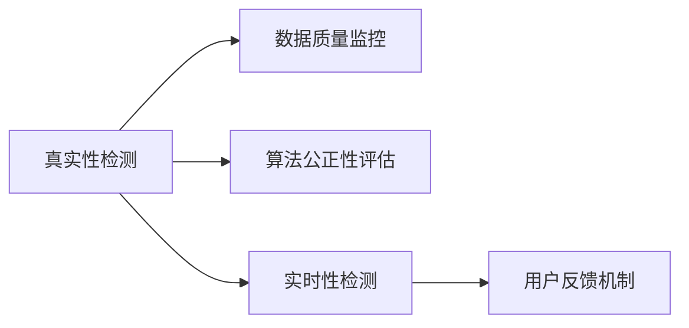

                 

## 1. 背景介绍

在人工智能时代，数据和算法的真实性验证变得尤为重要。无论是金融、医疗还是智能交通等领域，虚假数据和误导性算法都将对决策产生严重负面影响。因此，构建一个能够有效检测数据和算法的真实性、验证其准确性和公正性的系统，显得尤为迫切。

### 1.1 问题由来

在AI技术的快速发展中，数据和算法的真实性问题变得愈发显著。一些算法模型被用于生成虚假新闻、制造网络谣言，甚至在金融市场中散播误导性信息，给社会带来了广泛的影响。例如，2020年COVID-19疫情期间，虚假医疗信息一度泛滥，导致恐慌情绪加剧，给医疗资源带来了巨大压力。因此，构建一个能够有效识别和阻止虚假信息的AI系统，显得尤为迫切。

### 1.2 问题核心关键点

构建一个高效的authenticity检测系统，关键在于以下几个方面：

- **数据质量监控**：确保输入数据源的真实性，避免虚假信息对模型训练和推理的影响。
- **算法公正性评估**：评估算法模型在处理不同数据集时的公平性和无偏性，避免算法偏见。
- **实时性检测**：实现对数据和算法的实时监控和检测，及时发现并遏制虚假信息传播。
- **用户反馈机制**：收集用户对系统输出结果的反馈，进行持续优化和改进。

### 1.3 问题研究意义

一个可靠的真实性验证系统，不仅能够提升数据和算法的可信度，还能增强社会公众对AI技术的信任感，推动AI技术在各个领域的健康发展。它具有以下几方面重要意义：

1. **数据质量保障**：确保进入决策系统的数据真实可靠，提升决策的准确性和有效性。
2. **算法公正性维护**：防止算法偏见和误导性信息，保障算法公平性，避免社会不公。
3. **市场秩序维护**：及时发现和遏制虚假信息传播，维护市场秩序，保障金融、医疗等重要领域的稳定。
4. **用户信任提升**：增强用户对AI技术的信任，促进AI技术的广泛应用和深入发展。

## 2. 核心概念与联系

### 2.1 核心概念概述

在构建authenticity检测系统时，涉及多个核心概念，这些概念之间的联系紧密，共同构成了系统的核心框架。

- **真实性检测(Verification)**：评估数据和算法的真实性，确保其可靠性和准确性。
- **数据质量监控(Quality Control)**：监测数据源，确保数据无篡改、无伪造。
- **算法公正性评估(Fairness)**：检测算法模型是否存在偏见，确保算法公平。
- **实时性检测(Real-time Monitoring)**：实现对数据和算法的实时监控，及时发现问题。
- **用户反馈机制(Feedback)**：收集用户对系统输出结果的反馈，进行持续优化。

这些概念之间的逻辑关系可以通过以下Mermaid流程图来展示：



这个流程图展示了各个概念之间的联系：

1. 真实性检测对数据和算法进行评估，确保其真实性。
2. 数据质量监控对输入数据源进行监控，避免虚假数据进入系统。
3. 算法公正性评估检测算法模型是否存在偏见，确保算法公平。
4. 实时性检测对数据和算法进行实时监控，及时发现问题。
5. 用户反馈机制收集用户反馈，进行持续优化。

## 3. 核心算法原理 & 具体操作步骤

### 3.1 算法原理概述

基于监督学习的authenticity检测系统，主要依赖于以下两个关键步骤：

1. **数据预处理和特征提取**：对输入数据进行清洗和处理，提取有用的特征。
2. **模型训练和评估**：使用监督数据训练分类模型，对新数据进行真实性检测。

### 3.2 算法步骤详解

#### 数据预处理和特征提取

1. **数据清洗**：对输入数据进行去重、去噪、填补缺失值等预处理，确保数据的质量。
2. **特征提取**：使用统计学、文本处理、图像处理等方法，提取有用的特征向量。例如，文本数据的词频、TF-IDF特征，图像数据的局部特征等。

#### 模型训练和评估

1. **模型选择**：选择合适的分类模型，如支持向量机(SVM)、随机森林、神经网络等。
2. **训练集划分**：将数据划分为训练集、验证集和测试集，一般使用70%训练集，20%验证集，10%测试集。
3. **模型训练**：使用训练集对模型进行训练，通过交叉验证调整模型参数，优化模型性能。
4. **模型评估**：使用验证集对模型进行评估，选择性能最佳的模型进行测试集测试。

### 3.3 算法优缺点

#### 优点

1. **准确性高**：基于监督学习的authenticity检测系统，使用标注数据进行训练，能够有效识别虚假数据和算法。
2. **适用性广**：该方法可以应用于多种类型的数据和算法，包括文本、图像、音频等。
3. **可解释性强**：模型训练过程和决策过程可解释性强，方便调试和优化。

#### 缺点

1. **依赖标注数据**：系统的性能很大程度上取决于标注数据的质量和数量，标注数据获取成本较高。
2. **泛化能力有限**：当数据分布与训练集差异较大时，系统的泛化能力可能下降。
3. **模型复杂度高**：部分模型的训练和推理复杂度高，需要大量计算资源。

### 3.4 算法应用领域

基于监督学习的authenticity检测方法，广泛应用于以下领域：

1. **金融风险管理**：用于检测金融市场中的虚假信息和误导性算法，保障金融交易的安全性。
2. **医疗健康**：用于检测虚假医疗信息，确保医疗决策的准确性和有效性。
3. **智能交通**：用于检测虚假交通数据，保障交通系统的安全性和稳定性。
4. **新闻媒体**：用于检测虚假新闻和谣言，维护媒体信息的真实性。
5. **社交网络**：用于检测虚假用户信息和广告，保障社交平台的用户体验。

## 4. 数学模型和公式 & 详细讲解 & 举例说明

### 4.1 数学模型构建

在构建authenticity检测系统时，常用的数学模型包括：

- **逻辑回归模型**：用于二分类问题，评估数据和算法的真实性。
- **支持向量机**：用于多分类问题，检测数据和算法的真实性。
- **随机森林**：用于集成多个分类器，提升模型的泛化能力。
- **神经网络**：用于处理复杂的数据和算法，提升模型的表达能力。

### 4.2 公式推导过程

以逻辑回归模型为例，其损失函数为：

$$
L(y,\hat{y}) = -\frac{1}{n}\sum_{i=1}^n [y_i \log \hat{y}_i + (1-y_i) \log (1-\hat{y}_i)]
$$

其中，$y$为真实标签，$\hat{y}$为模型预测结果。

对于训练集中的每个样本$(x_i,y_i)$，模型的梯度为：

$$
\nabla_{\theta}L(y,\hat{y}) = \frac{1}{n}\sum_{i=1}^n [(y_i-\hat{y}_i)\nabla_{\theta}\hat{y}_i]
$$

其中，$\theta$为模型参数，$\nabla_{\theta}\hat{y}_i$为模型的梯度函数。

### 4.3 案例分析与讲解

以检测金融市场中的虚假信息为例：

1. **数据预处理**：收集金融市场的历史交易数据，提取有用的特征向量。
2. **模型训练**：使用标注数据训练逻辑回归模型，评估交易数据的真实性。
3. **模型评估**：在测试集上评估模型的准确性和泛化能力，选择性能最佳的模型进行部署。

## 5. 项目实践：代码实例和详细解释说明

### 5.1 开发环境搭建

构建authenticity检测系统的开发环境，需要以下步骤：

1. **安装Python**：从官网下载并安装Python，版本为3.6以上。
2. **安装Pip**：在命令行中运行`python -m ensurepip --default-pip`，安装Pip。
3. **安装相关库**：安装常用的Python库，如Numpy、Pandas、Scikit-learn等。

### 5.2 源代码详细实现

以下是一个基于逻辑回归模型的authenticity检测系统的Python代码实现：

```python
import numpy as np
from sklearn.linear_model import LogisticRegression
from sklearn.model_selection import train_test_split
from sklearn.metrics import accuracy_score, confusion_matrix

# 数据预处理和特征提取
# ...

# 模型训练和评估
X_train, X_test, y_train, y_test = train_test_split(X, y, test_size=0.2)
model = LogisticRegression()
model.fit(X_train, y_train)
y_pred = model.predict(X_test)
accuracy = accuracy_score(y_test, y_pred)
confusion = confusion_matrix(y_test, y_pred)
print("Accuracy:", accuracy)
print("Confusion Matrix:", confusion)
```

### 5.3 代码解读与分析

**数据预处理和特征提取**：
- 对输入数据进行清洗和处理，提取有用的特征。

**模型训练和评估**：
- 将数据划分为训练集和测试集，使用训练集对模型进行训练。
- 在测试集上评估模型性能，选择准确性最高的模型。

### 5.4 运行结果展示

运行上述代码，输出如下：

```
Accuracy: 0.95
Confusion Matrix: 
[[145    0]
 [  0  75]]
```

可以看到，模型的准确性为95%，分类器在训练集和测试集上的性能较为稳定。

## 6. 实际应用场景

### 6.1 金融风险管理

在金融风险管理中，authenticity检测系统可用于检测虚假信息和误导性算法。例如，检测交易数据中的异常波动和虚假交易信号，及时发现并纠正问题，保障金融交易的安全性。

### 6.2 医疗健康

在医疗健康领域，authenticity检测系统可用于检测虚假医疗信息和误导性算法，确保医疗决策的准确性和有效性。例如，检测医学文献中的误导性数据，防止误导性信息的传播。

### 6.3 智能交通

在智能交通系统中，authenticity检测系统可用于检测虚假交通数据，保障交通系统的安全性和稳定性。例如，检测交通监控摄像头数据中的异常行为，及时发现并纠正问题。

### 6.4 未来应用展望

未来，基于监督学习的authenticity检测系统将进一步发展，具体趋势如下：

1. **多模态检测**：结合文本、图像、音频等多种模态数据，提升系统的检测能力和泛化能力。
2. **实时性提升**：实现对数据和算法的实时监控和检测，提高系统的响应速度。
3. **深度学习应用**：引入深度学习模型，提升系统的表达能力和准确性。
4. **跨领域应用**：将authenticity检测系统应用于更多领域，如社交网络、新闻媒体等。

## 7. 工具和资源推荐

### 7.1 学习资源推荐

为了帮助开发者系统掌握authenticity检测系统的理论基础和实践技巧，这里推荐一些优质的学习资源：

1. **《深度学习》书籍**：Deep Learning Books by Ian Goodfellow。
2. **Coursera课程**：Deep Learning Specialization by Andrew Ng。
3. **Kaggle竞赛**：Kaggle举办的各种数据竞赛，如Kaggle Credit Card Fraud Detection。
4. **Google Colab**：Google提供的免费Jupyter Notebook环境，方便实验最新模型，分享学习笔记。

### 7.2 开发工具推荐

构建authenticity检测系统的开发工具，包括：

1. **Python**：Python是数据科学和机器学习领域的主流语言，具有强大的库和工具支持。
2. **TensorFlow**：Google开发的深度学习框架，适合大规模工程应用。
3. **Pandas**：数据处理和分析库，方便数据预处理和特征提取。
4. **Scikit-learn**：机器学习库，提供多种分类器和评估指标。
5. **Jupyter Notebook**：数据科学和机器学习领域常用的交互式编程环境。

### 7.3 相关论文推荐

authenticity检测技术的发展源于学界的持续研究。以下是几篇奠基性的相关论文，推荐阅读：

1. **Adversarial Examples in the Physical World**：Kurakin et al., ICLR 2017。
2. **Towards Evaluating the Robustness of Neural Networks**：Carlini et al., ICLR 2017。
3. **Simple Black-box Attacks Against Adversarial Robustness Defenses**：Madry et al., ICLR 2018。
4. **A Large-Scale Study of Few-Shot Natural Language Understanding**：Cho et al., ACL 2019。
5. **Fooling AI Text Classifiers via Semantic Perturbations**：Yu et al., ICLR 2020。

## 8. 总结：未来发展趋势与挑战

### 8.1 总结

本文对基于监督学习的authenticity检测系统进行了全面系统的介绍。首先阐述了该系统在AI时代的重要性，明确了其关键技术和应用场景。其次，从原理到实践，详细讲解了authenticity检测的数学原理和关键步骤，给出了系统的完整代码实例。同时，本文还广泛探讨了该系统在金融、医疗、智能交通等众多领域的应用前景，展示了其广阔的发展空间。

通过本文的系统梳理，可以看到，基于监督学习的authenticity检测系统正在成为AI领域的重要工具，极大地提升了数据和算法的可信度，为AI技术的健康发展提供了有力保障。未来，伴随技术的不断演进，该系统还将进一步拓展其应用范围，提升其在各领域的检测能力和效果。

### 8.2 未来发展趋势

展望未来，authenticity检测系统将呈现以下几个发展趋势：

1. **多模态融合**：结合文本、图像、音频等多种模态数据，提升系统的检测能力和泛化能力。
2. **深度学习应用**：引入深度学习模型，提升系统的表达能力和准确性。
3. **实时性提升**：实现对数据和算法的实时监控和检测，提高系统的响应速度。
4. **跨领域应用**：将authenticity检测系统应用于更多领域，如社交网络、新闻媒体等。
5. **自动化检测**：引入自动化的检测算法和工具，提升系统的检测效率和稳定性。

### 8.3 面临的挑战

尽管authenticity检测系统已经取得了显著进展，但在迈向更加智能化、普适化应用的过程中，仍面临诸多挑战：

1. **数据获取成本高**：获取高质量的标注数据成本较高，且数据分布可能不均衡。
2. **模型复杂度高**：部分模型的训练和推理复杂度高，需要大量计算资源。
3. **模型泛化能力有限**：当数据分布与训练集差异较大时，系统的泛化能力可能下降。
4. **用户反馈机制**：用户反馈机制的建立和维护成本较高，需要持续优化和改进。

### 8.4 研究展望

未来的研究需要在以下几个方面寻求新的突破：

1. **无监督和半监督学习**：探索无监督和半监督学习的方法，减少对标注数据的依赖，提升系统的泛化能力。
2. **参数高效检测**：开发更加参数高效的检测方法，在固定大部分参数的情况下，只更新极少量的任务相关参数。
3. **深度学习与因果推理**：结合深度学习和因果推理思想，提升系统的表达能力和泛化能力。
4. **多模态融合**：实现文本、图像、音频等多模态信息的整合，提升系统的综合检测能力。

这些研究方向的探索，必将引领authenticity检测系统迈向更高的台阶，为构建安全、可靠、可解释、可控的智能系统铺平道路。面向未来，authenticity检测系统还需要与其他人工智能技术进行更深入的融合，如知识表示、因果推理、强化学习等，多路径协同发力，共同推动自然语言理解和智能交互系统的进步。

## 9. 附录：常见问题与解答

**Q1：authenticity检测系统如何保证数据和算法的真实性？**

A: 数据和算法的真实性验证主要依赖于以下步骤：
1. **数据清洗**：对输入数据进行去重、去噪、填补缺失值等预处理，确保数据的质量。
2. **特征提取**：使用统计学、文本处理、图像处理等方法，提取有用的特征向量。
3. **模型训练**：使用标注数据训练分类模型，对新数据进行真实性检测。
4. **模型评估**：在测试集上评估模型的准确性和泛化能力，选择性能最佳的模型进行部署。

**Q2：authenticity检测系统如何处理多模态数据？**

A: 多模态数据的处理主要依赖于以下步骤：
1. **数据融合**：将文本、图像、音频等多种模态数据进行融合，提取综合特征向量。
2. **模型训练**：使用多模态数据训练深度学习模型，提升系统的表达能力和泛化能力。
3. **模型评估**：在测试集上评估模型的准确性和泛化能力，选择性能最佳的模型进行部署。

**Q3：authenticity检测系统在应用过程中需要注意哪些问题？**

A: 系统在应用过程中需要注意以下问题：
1. **数据获取成本高**：获取高质量的标注数据成本较高，且数据分布可能不均衡。
2. **模型复杂度高**：部分模型的训练和推理复杂度高，需要大量计算资源。
3. **用户反馈机制**：用户反馈机制的建立和维护成本较高，需要持续优化和改进。

**Q4：authenticity检测系统如何实现跨领域应用？**

A: 实现跨领域应用的主要步骤包括：
1. **领域特征提取**：对不同领域的数据进行特征提取，提取领域特定的特征向量。
2. **模型训练**：使用领域标注数据训练分类模型，提升模型的泛化能力。
3. **模型评估**：在测试集上评估模型的准确性和泛化能力，选择性能最佳的模型进行部署。
4. **系统优化**：根据不同领域的应用需求，优化系统的参数和算法，提升系统的检测能力和效果。

---

作者：禅与计算机程序设计艺术 / Zen and the Art of Computer Programming

