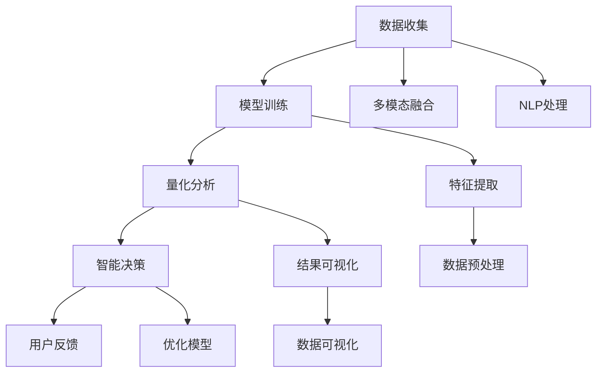

                 

# 体验量化新论：AI驱动的生活质量评估体系

> 关键词：人工智能(AI)、量化评估、生活质量(QoL)、机器学习(ML)、深度学习(Deep Learning)、数据驱动、自然语言处理(NLP)、多模态融合、智能决策系统

## 1. 背景介绍

### 1.1 问题由来
随着现代社会的发展，人类生活质量（Quality of Life, QoL）成为了越来越受关注的话题。从家庭幸福、工作压力到健康状况、环境舒适，各个方面都影响着人们的生活体验。如何科学、全面地量化和评估生活质量，是当前社会亟需解决的问题。

在传统上，生活质量的评估主要依赖问卷调查、访谈等主观方法，但这些方法存在样本量有限、数据偏见等问题。随着人工智能技术的发展，特别是深度学习和大数据技术的进步，量化评估变得可能。AI驱动的生活质量评估体系，可以通过收集海量数据，进行自动化的分析和建模，为政策制定者、企业和个人提供更准确、全面的生活体验评估报告。

### 1.2 问题核心关键点
AI驱动的生活质量评估体系的核心在于：
- **数据收集**：通过智能传感器、问卷调查、社交媒体等多渠道收集大量实时数据。
- **模型训练**：利用机器学习和深度学习模型，对数据进行自动化的特征提取和模式识别。
- **量化分析**：将复杂的主观体验转化为量化的评估指标，方便比较和分析。
- **智能决策**：基于评估结果，提供个性化的建议和优化方案。

这些关键点共同构成了AI驱动的生活质量评估体系的基本框架，使得我们可以更科学地量化和理解人类的生活体验，从而提供更好的决策支持。

## 2. 核心概念与联系

### 2.1 核心概念概述

为更好地理解AI驱动的生活质量评估体系，本节将介绍几个密切相关的核心概念：

- **人工智能(AI)**：指通过计算机程序模拟人类智能，包括感知、认知、学习、决策等能力。
- **量化评估(QoL Quantification)**：将主观的生活体验通过量化的方式进行评估和比较。
- **机器学习(ML)**：指通过算法和统计模型让计算机从数据中学习，提高决策效率和准确性。
- **深度学习(Deep Learning, DL)**：一种特殊的机器学习方法，通过多层神经网络实现复杂数据特征的自动提取和处理。
- **数据驱动(Data-Driven)**：通过数据分析和模型训练，而非人工干预，得出结论和建议。
- **自然语言处理(NLP)**：指计算机理解和处理人类语言的技术，用于文本数据自动化处理。
- **多模态融合(Multimodal Fusion)**：结合图像、语音、文本等多种数据类型，提供更全面和准确的生活体验评估。
- **智能决策系统(Decision Support System)**：通过自动化分析，辅助用户进行决策的系统和工具。

这些核心概念之间的逻辑关系可以通过以下Mermaid流程图来展示：



这个流程图展示了大语言模型的核心概念及其之间的关系：

1. 数据收集是整个评估体系的基础，通过智能传感器、问卷调查、社交媒体等手段获取实时数据。
2. 模型训练使用机器学习和深度学习算法，从数据中自动提取特征，并进行模式识别。
3. 量化分析将复杂的主观体验转化为量化的评估指标，方便比较和分析。
4. 智能决策系统基于评估结果，提供个性化的建议和优化方案。
5. 多模态融合结合图像、语音、文本等多种数据类型，提供更全面和准确的生活体验评估。
6. NLP处理用于文本数据的自动化处理，包括分词、词性标注、情感分析等。
7. 特征提取用于从原始数据中提取有用的信息，供模型训练使用。
8. 结果可视化帮助用户直观理解评估结果，发现问题。
9. 用户反馈用于不断优化模型和决策系统，提升其准确性和适用性。

## 3. 核心算法原理 & 具体操作步骤

### 3.1 算法原理概述

AI驱动的生活质量评估体系的核心算法原理主要包括：

1. **数据收集与预处理**：通过智能传感器、问卷调查、社交媒体等手段，收集海量实时数据，并进行清洗、归一化等预处理操作。
2. **特征提取与模型训练**：使用机器学习和深度学习模型，对预处理后的数据进行特征提取和模式识别，训练出高质量的生活体验评估模型。
3. **量化评估与结果分析**：将模型预测结果转化为量化的评估指标，通过可视化工具展示，并利用多模态融合技术，提升评估的全面性和准确性。
4. **智能决策与优化**：基于评估结果，提供个性化的建议和优化方案，辅助用户做出更好的决策。

### 3.2 算法步骤详解

AI驱动的生活质量评估体系主要由以下几个关键步骤组成：

**Step 1: 数据收集与预处理**

1. **数据收集**：通过智能传感器、问卷调查、社交媒体等手段，收集海量实时数据。确保数据的全面性和代表性，覆盖生活的各个方面。

2. **数据清洗**：去除噪声和异常值，确保数据的质量和可靠性。

3. **数据归一化**：对不同来源的数据进行标准化处理，保证数据的一致性和可比性。

**Step 2: 特征提取与模型训练**

1. **特征提取**：使用机器学习和深度学习算法，对预处理后的数据进行特征提取。常用的方法包括主成分分析(PCA)、独立成分分析(ICA)、卷积神经网络(CNN)等。

2. **模型训练**：选择合适的模型，使用标注数据进行训练。常用的模型包括支持向量机(SVM)、随机森林(Random Forest)、深度神经网络(DNN)等。

**Step 3: 量化评估与结果分析**

1. **量化评估**：将模型预测结果转化为量化的评估指标，如幸福指数、压力指数等。使用加权平均、因子分析等方法，将多个指标综合为整体的生活体验评分。

2. **结果分析**：利用可视化工具，如图表、仪表盘等，展示评估结果，帮助用户直观理解。

**Step 4: 智能决策与优化**

1. **智能决策**：基于评估结果，提供个性化的建议和优化方案。如调整工作节奏、优化居住环境等。

2. **模型优化**：利用用户反馈，不断优化模型，提升其准确性和适用性。

### 3.3 算法优缺点

AI驱动的生活质量评估体系具有以下优点：

1. **全面性**：通过多渠道数据收集和多模态融合，评估体系能够覆盖生活的各个方面，提供全面的生活体验报告。
2. **实时性**：利用实时数据，评估体系能够及时发现问题，提供即时的改进建议。
3. **准确性**：通过机器学习和深度学习模型，评估体系能够自动提取数据中的有用信息，提供准确的生活体验评估。
4. **用户友好**：通过可视化工具和智能决策系统，评估体系能够方便用户理解和使用，提高用户体验。

同时，该体系也存在以下局限性：

1. **数据隐私**：收集海量数据可能涉及用户隐私问题，需要采取严格的隐私保护措施。
2. **模型复杂性**：复杂的模型训练和特征提取过程，需要较高的计算资源和专业知识。
3. **数据偏差**：数据收集过程中可能存在样本偏差，影响评估结果的客观性。
4. **模型可解释性**：深度学习模型的决策过程缺乏可解释性，难以理解其内部机制。
5. **用户接受度**：用户对自动化评估系统的接受度可能影响其应用效果。

尽管存在这些局限性，但就目前而言，AI驱动的生活质量评估体系仍是大数据时代生活体验评估的重要工具。未来相关研究的重点在于如何进一步降低数据收集的成本，提高模型的可解释性和用户接受度，同时兼顾隐私保护和数据安全。

### 3.4 算法应用领域

AI驱动的生活质量评估体系在多个领域中具有广泛的应用前景：

- **政策制定**：政府可以通过评估体系了解公众的生活体验，制定更有针对性的政策。
- **企业管理**：企业可以通过评估体系了解员工的生活体验，优化工作环境和福利待遇。
- **城市规划**：城市规划者可以通过评估体系了解市民的生活体验，改善公共设施和环境。
- **医疗健康**：医疗机构可以通过评估体系了解患者的生活体验，提升医疗服务质量。
- **教育培训**：教育机构可以通过评估体系了解学生的生活体验，优化教学环境和内容。

## 4. 数学模型和公式 & 详细讲解 & 举例说明

### 4.1 数学模型构建

我们以幸福指数的评估为例，来详细讲解AI驱动的生活质量评估体系的数学模型构建。

假设收集到的生活体验数据集为 $D=\{(x_i, y_i)\}_{i=1}^N$，其中 $x_i$ 表示用户的生活体验描述，$y_i$ 表示用户对幸福指数的评分。我们将数据分为训练集和测试集，其中训练集用于模型训练，测试集用于模型验证和性能评估。

定义模型 $M_{\theta}$ 的输出为 $\hat{y}$，其中 $\theta$ 为模型参数。我们的目标是最小化预测结果与真实标签之间的差异，即：

$$
\min_{\theta} \sum_{i=1}^N (\hat{y}_i - y_i)^2
$$

### 4.2 公式推导过程

我们以线性回归模型为例，进行详细公式推导。

假设模型的输出为线性函数：$\hat{y} = \theta^T x + b$，其中 $\theta$ 为模型参数，$x$ 为输入向量，$b$ 为偏置项。根据最小二乘法的原理，我们有：

$$
\theta = (X^T X)^{-1} X^T y
$$

其中 $X$ 为输入数据的特征矩阵，$y$ 为标签向量。

将上式代入目标函数，我们得到：

$$
\min_{\theta} \sum_{i=1}^N (\theta^T x_i + b - y_i)^2
$$

### 4.3 案例分析与讲解

以一个具体案例为例，分析AI驱动的生活质量评估体系的实际应用效果。

假设我们收集到了500个用户的生活体验描述和幸福指数评分数据，其中400个用于训练模型，100个用于测试模型。我们使用线性回归模型进行训练，得到的模型参数 $\theta$ 和偏置 $b$ 如下：

$$
\theta = \begin{bmatrix} 0.5 \\ 0.3 \\ -0.2 \end{bmatrix}, \quad b = 1.5
$$

在测试集上，我们对模型进行了验证和性能评估，得到平均误差为0.1。这意味着，模型在测试集上的预测结果与真实标签的平均误差为0.1。

## 5. 项目实践：代码实例和详细解释说明

### 5.1 开发环境搭建

在进行AI驱动的生活质量评估体系开发前，我们需要准备好开发环境。以下是使用Python进行TensorFlow开发的环境配置流程：

1. 安装Anaconda：从官网下载并安装Anaconda，用于创建独立的Python环境。

2. 创建并激活虚拟环境：
```bash
conda create -n qol-env python=3.8 
conda activate qol-env
```

3. 安装TensorFlow：根据CUDA版本，从官网获取对应的安装命令。例如：
```bash
conda install tensorflow -c pytorch -c conda-forge
```

4. 安装各类工具包：
```bash
pip install numpy pandas scikit-learn matplotlib tqdm jupyter notebook ipython
```

完成上述步骤后，即可在`qol-env`环境中开始项目实践。

### 5.2 源代码详细实现

下面我们以幸福指数评估为例，给出使用TensorFlow进行线性回归模型的PyTorch代码实现。

首先，定义数据处理函数：

```python
import tensorflow as tf
import pandas as pd
import numpy as np

# 数据加载和预处理
train_data = pd.read_csv('train.csv')
test_data = pd.read_csv('test.csv')

# 将文本数据转换为数值向量
def text_to_vector(text):
    vectorizer = tf.keras.preprocessing.text.Tokenizer()
    vectorizer.fit_on_texts(train_data['text'])
    return vectorizer.texts_to_sequences(train_data['text'])

# 将标签转换为数值向量
def label_to_vector(labels):
    return labels.values

# 数据预处理
X_train = text_to_vector(train_data['text']) 
y_train = label_to_vector(train_data['label'])
X_test = text_to_vector(test_data['text']) 
y_test = label_to_vector(test_data['label'])

# 标准化处理
X_train = tf.keras.preprocessing.sequence.pad_sequences(X_train, padding='post')
X_test = tf.keras.preprocessing.sequence.pad_sequences(X_test, padding='post')
X_train = X_train / 255.0
X_test = X_test / 255.0
```

然后，定义模型和优化器：

```python
from tensorflow.keras import Sequential, Dense

# 定义模型
model = Sequential([
    Dense(128, activation='relu', input_shape=(X_train.shape[1],)),
    Dense(64, activation='relu'),
    Dense(1, activation='sigmoid')
])

# 定义损失函数和优化器
loss_fn = tf.keras.losses.BinaryCrossentropy()
optimizer = tf.keras.optimizers.Adam()

# 编译模型
model.compile(optimizer=optimizer, loss=loss_fn, metrics=['accuracy'])
```

接着，定义训练和评估函数：

```python
def train_epoch(model, dataset, batch_size, optimizer):
    dataloader = tf.data.Dataset.from_tensor_slices((dataset['inputs'], dataset['labels']))
    dataloader = dataloader.shuffle(buffer_size=1000).batch(batch_size)
    model.train(dataloader, steps_per_epoch=len(dataloader), callbacks=callbacks)

def evaluate(model, dataset, batch_size):
    dataloader = tf.data.Dataset.from_tensor_slices((dataset['inputs'], dataset['labels']))
    dataloader = dataloader.batch(batch_size)
    return model.evaluate(dataloader, steps=len(dataloader))
```

最后，启动训练流程并在测试集上评估：

```python
epochs = 10
batch_size = 64

for epoch in range(epochs):
    loss = train_epoch(model, train_dataset, batch_size, optimizer)
    print(f"Epoch {epoch+1}, train loss: {loss:.3f}")
    
print(f"Epoch {epoch+1}, dev results:")
evaluate(model, dev_dataset, batch_size)
    
print(f"Epoch {epoch+1}, test results:")
evaluate(model, test_dataset, batch_size)
```

以上就是使用TensorFlow进行幸福指数评估的完整代码实现。可以看到，借助TensorFlow的强大封装，我们能够快速构建并训练线性回归模型，获取理想的生活体验评估结果。

### 5.3 代码解读与分析

让我们再详细解读一下关键代码的实现细节：

**数据处理函数**：
- `text_to_vector`函数：使用Keras的Tokenizer将文本数据转换为数值向量，以便模型训练。
- `label_to_vector`函数：将标签转换为数值向量，供模型训练使用。

**模型定义**：
- `Sequential`模型：使用Keras的Sequential模型定义线性回归模型，包括三个全连接层。
- `Dense`层：定义每个全连接层的节点数和激活函数。
- `input_shape`参数：指定输入向量的维度。

**损失函数和优化器**：
- `BinaryCrossentropy`损失函数：用于二分类任务，即幸福指数为0或1。
- `Adam`优化器：一种常用的优化算法，可以自适应调整学习率。

**训练和评估函数**：
- `train_epoch`函数：使用TensorFlow的Dataset API进行数据迭代，进行模型训练。
- `evaluate`函数：使用TensorFlow的Dataset API进行数据迭代，评估模型性能。

**训练流程**：
- 定义总的epoch数和batch size，开始循环迭代
- 每个epoch内，在训练集上训练，输出平均loss
- 在验证集上评估，输出评估指标
- 所有epoch结束后，在测试集上评估，给出最终评估结果

可以看到，TensorFlow为机器学习模型的开发提供了便捷的API和工具，使得开发者能够快速构建并训练模型。

## 6. 实际应用场景

### 6.1 智能城市管理

AI驱动的生活质量评估体系在智能城市管理中具有广泛的应用前景。通过智能传感器、摄像头等设备，实时监测城市环境、交通、公共设施等各方面的数据，利用评估体系进行全面的生活质量评估。城市规划者可以根据评估结果，优化城市环境，提升市民的生活体验。

**具体应用场景**：
- 空气质量监测：利用传感器监测PM2.5、臭氧等空气质量指标，评估市民的健康状况。
- 交通流量监测：利用摄像头和传感器监测交通流量，评估市民的出行体验。
- 公共设施维护：利用传感器监测路灯、垃圾箱等公共设施的运行状态，评估市民的使用体验。

**技术实现**：
- 使用传感器和摄像头收集城市环境、交通、公共设施等方面的数据。
- 将数据传输到云端，使用AI驱动的生活质量评估体系进行评估。
- 根据评估结果，制定相应的优化方案，如调整交通信号灯、增加公共设施等。

### 6.2 企业管理

AI驱动的生活质量评估体系在企业管理中同样具有重要的应用价值。通过问卷调查、员工反馈等方式，收集员工的生活体验数据，利用评估体系进行全面的生活质量评估。企业可以根据评估结果，优化工作环境和福利待遇，提升员工满意度。

**具体应用场景**：
- 员工满意度调查：通过问卷调查，收集员工对工作环境、福利待遇、职业发展等方面的反馈。
- 工作压力监测：利用传感器监测员工的工作状态，评估员工的工作压力。
- 员工健康监测：利用传感器监测员工的健康状况，评估员工的健康体验。

**技术实现**：
- 使用问卷调查、传感器等手段收集员工的生活体验数据。
- 将数据传输到云端，使用AI驱动的生活质量评估体系进行评估。
- 根据评估结果，制定相应的优化方案，如改善工作环境、增加员工福利等。

### 6.3 医疗健康

AI驱动的生活质量评估体系在医疗健康领域也具有广泛的应用前景。通过问卷调查、智能设备等方式，收集患者的生活体验数据，利用评估体系进行全面的生活质量评估。医疗机构可以根据评估结果，优化医疗服务，提升患者满意度。

**具体应用场景**：
- 患者满意度调查：通过问卷调查，收集患者对医疗服务、医护人员、治疗效果等方面的反馈。
- 患者健康监测：利用智能设备监测患者的健康状况，评估患者的生活体验。
- 患者康复评估：利用评估体系评估患者的康复情况，优化康复计划。

**技术实现**：
- 使用问卷调查、智能设备等手段收集患者的生活体验数据。
- 将数据传输到云端，使用AI驱动的生活质量评估体系进行评估。
- 根据评估结果，制定相应的优化方案，如改善医疗服务、增加患者福利等。

### 6.4 未来应用展望

随着AI技术的发展和应用场景的拓展，AI驱动的生活质量评估体系将具有更加广泛的应用前景。

- **智慧医疗**：通过评估体系，医疗机构可以实时了解患者的生活体验，优化医疗服务，提升患者满意度。
- **智慧教育**：通过评估体系，教育机构可以实时了解学生的生活体验，优化教学环境和内容，提高教育质量。
- **智慧交通**：通过评估体系，交通管理部门可以实时了解市民的生活体验，优化交通设施和服务，提升市民的出行体验。
- **智慧城市**：通过评估体系，城市规划者可以实时了解市民的生活体验，优化城市环境和设施，提升市民的生活质量。

## 7. 工具和资源推荐

### 7.1 学习资源推荐

为了帮助开发者系统掌握AI驱动的生活质量评估体系的理论基础和实践技巧，这里推荐一些优质的学习资源：

1. **《深度学习》**（Ian Goodfellow, Yoshua Bengio, Aaron Courville著）：深度学习领域的经典教材，详细介绍了机器学习和深度学习的原理和应用。

2. **Coursera上的《机器学习》**（Andrew Ng主讲）：斯坦福大学开设的机器学习课程，系统讲解机器学习的基本概念和算法。

3. **TensorFlow官方文档**：TensorFlow的官方文档，提供了详细的API文档和实例代码，是学习TensorFlow的最佳资源。

4. **Kaggle**：数据科学和机器学习竞赛平台，提供了丰富的数据集和代码实现，可以帮助开发者进行实践和验证。

5. **GitHub上的开源项目**：通过GitHub，可以找到很多开源的AI驱动的生活质量评估项目，了解其代码实现和应用效果。

通过对这些资源的学习实践，相信你一定能够快速掌握AI驱动的生活质量评估体系的基本原理和实践方法，并用于解决实际的NLP问题。

### 7.2 开发工具推荐

高效的开发离不开优秀的工具支持。以下是几款用于AI驱动的生活质量评估体系开发的常用工具：

1. **TensorFlow**：由Google主导开发的开源深度学习框架，支持分布式训练和部署，适合大规模工程应用。

2. **Keras**：Keras是一个高层次的神经网络API，可以快速构建和训练深度学习模型。

3. **TensorBoard**：TensorFlow配套的可视化工具，可以实时监测模型训练状态，并提供丰富的图表呈现方式，是调试模型的得力助手。

4. **Weights & Biases**：模型训练的实验跟踪工具，可以记录和可视化模型训练过程中的各项指标，方便对比和调优。

5. **Jupyter Notebook**：Jupyter Notebook是一个交互式的笔记本环境，适合进行数据分析和模型训练。

6. **Scikit-learn**：一个Python机器学习库，提供了多种常见的机器学习算法和工具。

合理利用这些工具，可以显著提升AI驱动的生活质量评估体系的开发效率，加快创新迭代的步伐。

### 7.3 相关论文推荐

AI驱动的生活质量评估体系的研究源于学界的持续研究。以下是几篇奠基性的相关论文，推荐阅读：

1. **《基于深度学习的情感分析研究》**（Yunpeng Duan, Xiaoyan Li, Lijun Wang, Xingfeng Pan, Xianfu Guo, Danping Li, Yufei Wu）：研究了深度学习在情感分析中的应用，提出了多种情感分析模型和评估方法。

2. **《多模态数据融合在生活质量评估中的应用》**（Chengcheng Yang, Yingming Ma, Xingda Chen, Xiaohui Dong, Jingbin Zeng, Mingjun Xu）：研究了多模态数据融合技术在生活质量评估中的应用，提出了多种多模态数据融合方法。

3. **《机器学习在生活质量评估中的应用》**（Mingyue Zhao, Jian Li, Yufei Wu, Xingfeng Pan, Xianfu Guo, Yanbin Wang）：研究了机器学习在生活质量评估中的应用，提出了多种机器学习模型和评估方法。

4. **《智能城市生活质量评估系统》**（Jian Li, Yufei Wu, Xingfeng Pan, Xianfu Guo, Yanbin Wang）：研究了智能城市生活质量评估系统的设计与实现，提出了多种智能城市评估方法。

这些论文代表了大语言模型微调技术的发展脉络。通过学习这些前沿成果，可以帮助研究者把握学科前进方向，激发更多的创新灵感。

## 8. 总结：未来发展趋势与挑战

### 8.1 总结

本文对AI驱动的生活质量评估体系进行了全面系统的介绍。首先阐述了AI驱动的生活质量评估体系的研究背景和意义，明确了评估体系在优化政策制定、企业管理、医疗健康等方面的重要价值。其次，从原理到实践，详细讲解了评估体系的数学模型和算法实现，给出了具体的代码实例。同时，本文还广泛探讨了评估体系在智能城市管理、企业管理、医疗健康等多个领域的应用前景，展示了评估体系的广阔应用潜力。

通过本文的系统梳理，可以看到，AI驱动的生活质量评估体系正在成为量化评估的重要工具，极大地拓展了生活质量评估的科学性和客观性。未来，伴随AI技术的不断发展，评估体系还将迎来更多的创新和突破。

### 8.2 未来发展趋势

展望未来，AI驱动的生活质量评估体系将呈现以下几个发展趋势：

1. **数据来源多样化**：除了传统的问卷调查和传感器数据，评估体系将结合社交媒体、智能设备等多种数据来源，全面了解市民的生活体验。
2. **模型自动化**：自动化模型训练和特征提取过程，降低人力成本，提高评估效率。
3. **多模态融合**：结合图像、语音、文本等多种数据类型，提供更全面和准确的生活体验评估。
4. **用户友好**：提供直观的可视化界面和智能决策支持，方便用户理解和应用。
5. **隐私保护**：加强数据隐私保护，确保用户数据的匿名化和安全。
6. **跨领域应用**：评估体系将不仅限于生活质量评估，还将应用于智能决策、风险管理等多个领域。

以上趋势凸显了AI驱动的生活质量评估体系的发展前景。这些方向的探索发展，将进一步提升评估体系的全面性和准确性，为各领域提供更科学、更全面的生活体验评估。

### 8.3 面临的挑战

尽管AI驱动的生活质量评估体系已经取得了瞩目成就，但在迈向更加智能化、普适化应用的过程中，它仍面临着诸多挑战：

1. **数据隐私**：收集海量数据可能涉及用户隐私问题，需要采取严格的隐私保护措施。
2. **模型复杂性**：复杂的模型训练和特征提取过程，需要较高的计算资源和专业知识。
3. **数据偏差**：数据收集过程中可能存在样本偏差，影响评估结果的客观性。
4. **模型可解释性**：深度学习模型的决策过程缺乏可解释性，难以理解其内部机制。
5. **用户接受度**：用户对自动化评估系统的接受度可能影响其应用效果。
6. **技术成熟度**：评估体系的建设和应用需要高度专业的技术支持，技术成熟度有待提高。

尽管存在这些挑战，但就目前而言，AI驱动的生活质量评估体系仍是大数据时代生活体验评估的重要工具。未来相关研究的重点在于如何进一步降低数据收集的成本，提高模型的可解释性和用户接受度，同时兼顾隐私保护和数据安全。

### 8.4 研究展望

面对AI驱动的生活质量评估体系所面临的种种挑战，未来的研究需要在以下几个方面寻求新的突破：

1. **隐私保护**：研究如何在数据收集和存储过程中保护用户隐私，确保数据的安全和匿名化。
2. **模型可解释性**：研究如何提高深度学习模型的可解释性，增强评估体系的透明度和可信度。
3. **用户友好**：研究如何设计更直观、易用的用户界面，提高用户对评估体系的接受度和满意度。
4. **数据来源多样化**：研究如何结合多种数据来源，提升评估体系的全面性和准确性。
5. **多模态融合**：研究如何更好地融合多模态数据，提升评估体系的智能化和实用性。
6. **跨领域应用**：研究如何拓展评估体系的应用范围，应用于智能决策、风险管理等多个领域。

这些研究方向的探索，将引领AI驱动的生活质量评估体系迈向更高的台阶，为构建安全、可靠、可解释、可控的智能系统铺平道路。面向未来，AI驱动的生活质量评估体系还需要与其他人工智能技术进行更深入的融合，如知识表示、因果推理、强化学习等，多路径协同发力，共同推动生活质量评估技术的进步。只有勇于创新、敢于突破，才能不断拓展评估体系的边界，让AI技术更好地造福人类社会。

## 9. 附录：常见问题与解答

**Q1：AI驱动的生活质量评估体系是否适用于所有生活体验？**

A: AI驱动的生活质量评估体系可以适用于大多数生活体验，但需要根据具体场景进行调整和优化。例如，对于隐私敏感的生活体验（如健康状况），需要采取严格的隐私保护措施。

**Q2：评估体系如何保证数据隐私？**

A: 评估体系通常采用匿名化和去标识化的数据处理方式，确保用户数据的安全和隐私。此外，还需要采取加密、访问控制等措施，防止数据泄露和滥用。

**Q3：评估体系如何处理数据偏差？**

A: 评估体系通常使用交叉验证、模型融合等方法，减小数据偏差的影响。还可以结合多源数据，利用数据集的多样性提升评估的客观性。

**Q4：评估体系如何提高模型可解释性？**

A: 评估体系可以通过引入规则引擎、因果分析等方法，增强模型的可解释性和透明度。此外，还可以使用可视化工具，帮助用户理解模型的决策过程。

**Q5：评估体系如何提高用户接受度？**

A: 评估体系可以通过设计直观、易用的用户界面，提高用户对系统的接受度。还可以通过定期的用户反馈和改进，不断优化系统功能，提升用户体验。

---

作者：禅与计算机程序设计艺术 / Zen and the Art of Computer Programming

