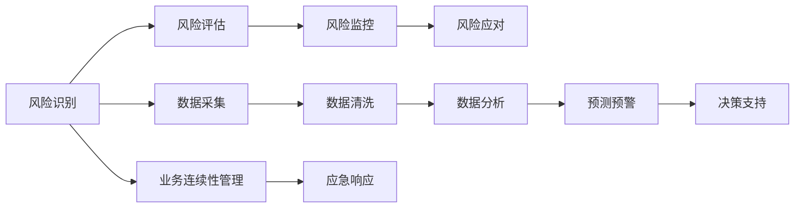

                 

# 供应链风险管理提升电商稳定性

> 关键词：供应链风险管理,电商稳定性,风险评估,业务连续性,数据驱动,智能监控

## 1. 背景介绍

### 1.1 问题由来
近年来，随着电子商务的快速发展，越来越多的企业将销售业务转移到线上平台，市场竞争愈发激烈。电商企业不仅需要面对消费者多样化的需求和快速变化的市场趋势，还需应对供应链中的各种不确定性，如物流中断、库存积压、供应商违约等，这些风险因素可能导致电商平台的业务中断和运营不稳定。

### 1.2 问题核心关键点
解决电商业务不稳定的根本在于有效识别和管理供应链风险，提升供应链的韧性，保障业务的连续性。为此，本文将探讨如何通过数据驱动和智能监控手段，构建完整的供应链风险管理框架，实现电商业务的稳健运行。

### 1.3 问题研究意义
通过高效的风险管理，电商企业能够：
- 及时识别供应链中的潜在风险，防止因风险引发业务中断。
- 优化供应链资源配置，提高运营效率和响应速度。
- 提升客户满意度和品牌声誉，增强市场竞争力。
- 降低企业运营风险，增加长期盈利能力。

## 2. 核心概念与联系

### 2.1 核心概念概述

为了构建有效的供应链风险管理体系，我们首先梳理几个关键概念：

- **供应链风险管理**：对供应链全链路进行风险识别、评估、监控和应对的过程，以保障业务连续性。
- **电商稳定性**：保障电商平台持续稳定运行，满足消费者需求，避免因供应链中断导致的客户流失。
- **风险评估**：通过定量或定性方法，识别潜在风险，评估其对业务的影响程度。
- **业务连续性管理**（Business Continuity Management, BCDM）：保障企业核心业务在灾害、故障等突发事件中保持运行，持续为客户提供服务。
- **智能监控**：使用先进的数据分析技术和人工智能手段，实时监测供应链风险指标，预测和预警潜在风险。
- **数据驱动**：通过采集、分析和应用数据，提供科学决策支持，指导供应链管理实践。

这些概念之间相互关联，共同构建了供应链风险管理的体系框架。

### 2.2 核心概念原理和架构的 Mermaid 流程图(Mermaid 流程节点中不要有括号、逗号等特殊字符)

上述流程图展示了风险管理从数据采集到应急响应的全过程。数据采集、清洗和分析为风险识别、评估和监控提供支撑，而预测预警和决策支持则指导风险应对和业务连续性管理，最终实现电商的稳定运行。

## 3. 核心算法原理 & 具体操作步骤
### 3.1 算法原理概述

基于数据驱动和智能监控的供应链风险管理，核心在于构建一套完整的风险识别、评估、监控和应对体系。其主要思想是通过对供应链全链路的实时数据监测和分析，识别出潜在的风险因素，评估其影响程度，并制定相应的应对策略，确保业务的连续性。

形式化地，设 $S$ 为供应链全链路，$R_i$ 为供应链节点 $i$ 面临的风险因素，$P(R_i|S)$ 为风险 $R_i$ 在供应链 $S$ 下发生的概率，$C(R_i|S)$ 为风险 $R_i$ 发生后对电商业务的影响成本。则风险管理的目标是最大化业务连续性价值 $V$，即：

$$
V = \max_{R_i \in S} \{P(R_i|S) \cdot C(R_i|S)\}
$$

其中，$P(R_i|S)$ 和 $C(R_i|S)$ 都需要通过数据驱动的分析和预测来获得。

### 3.2 算法步骤详解

实现数据驱动和智能监控的供应链风险管理，主要步骤如下：

**Step 1: 风险识别与评估**

1. **数据采集**：通过传感器、监控系统、物流平台等渠道，实时收集供应链各节点的关键指标，如库存水平、运输状态、供应商绩效等。

2. **数据清洗**：对采集到的原始数据进行清洗、转换和标准化，去除噪音和异常值，确保数据质量。

3. **数据分析**：运用统计学、数据挖掘和机器学习技术，对清洗后的数据进行分析，识别供应链中的风险因素和潜在风险。

4. **风险评估**：对识别出的风险因素进行定量或定性评估，评估其对业务的影响程度，如中断概率、影响范围、损失成本等。

**Step 2: 风险监控与预警**

1. **监控指标选择**：根据风险评估结果，选择关键风险监控指标，如库存周转率、运输延迟率、供应商违约率等。

2. **实时监控**：通过智能监控系统，对选定的监控指标进行实时监测，生成指标动态曲线和警报信息。

3. **预测预警**：利用时间序列分析、异常检测等技术，预测未来风险发生的可能性和影响，提前预警。

**Step 3: 风险应对与业务连续性**

1. **应急预案制定**：根据风险评估结果和预测预警，制定详细的应急预案，明确风险应对措施和资源调配方案。

2. **实时响应**：一旦检测到风险警报，立即启动应急预案，采取应对措施，如调整库存、重新安排运输、切换备用供应商等。

3. **业务连续性管理**：保障关键业务环节的持续运行，通过自动化系统和人工干预，确保客户服务不受影响。

**Step 4: 结果评估与优化**

1. **效果评估**：定期评估风险管理策略的效果，对比实际损失与预测结果，调整优化策略。

2. **持续改进**：根据评估结果，持续改进风险管理模型和系统，提升应对能力和决策质量。

### 3.3 算法优缺点

数据驱动和智能监控的供应链风险管理具有以下优点：
1. **实时性**：通过实时数据采集和分析，能够快速识别和响应供应链风险。
2. **全面性**：覆盖供应链全链路和各关键节点，减少风险盲区。
3. **准确性**：基于大量历史数据和先进分析技术，提高风险评估的准确性和科学性。
4. **适应性**：能够动态调整和优化风险管理策略，适应市场和环境变化。

同时，这种方法也存在一些局限：
1. **数据依赖**：对数据的质量和完整性要求较高，数据缺失或不准确会影响决策效果。
2. **技术门槛**：需要采用复杂的数据分析和人工智能技术，对技术和资源投入有较高要求。
3. **隐私问题**：采集和处理大量数据涉及隐私和合规问题，需注意数据安全。
4. **成本高**：实施先进的风险管理需要较大的前期投入，包括技术设备和人员培训。

### 3.4 算法应用领域

数据驱动和智能监控的供应链风险管理方法，广泛应用于以下领域：

- **物流管理**：通过实时监测货物运输状态，及时发现和应对物流中断问题。
- **库存管理**：分析库存水平和周转率，优化库存策略，减少积压和短缺。
- **供应商管理**：评估供应商绩效和违约风险，制定供应商选择和绩效监控策略。
- **需求预测**：基于历史销售数据和市场趋势，预测需求变化，优化订单和生产计划。
- **客户服务**：通过风险预警和应急响应，确保客户服务不受影响，提升客户满意度。

## 4. 数学模型和公式 & 详细讲解 & 举例说明

### 4.1 数学模型构建

为了更精确地描述供应链风险管理的数学模型，我们将基于风险评估、监控和应对的各个环节构建相应的数学公式。

**风险评估模型**：

设 $R_i$ 为节点 $i$ 面临的风险因素，$P(R_i)$ 为风险 $R_i$ 发生的概率，$C(R_i)$ 为风险 $R_i$ 发生后的成本损失。则风险评估模型为：

$$
R_i = P(R_i) \cdot C(R_i)
$$

**风险监控模型**：

设 $T_i(t)$ 为节点 $i$ 在时间 $t$ 的监控指标值，$T_{i,thresh}$ 为风险阈值，则实时监控模型为：

$$
\text{警报} = \mathbb{I}(|T_i(t) - T_{i,thresh}| > \epsilon)
$$

其中，$\mathbb{I}$ 为指示函数，$\epsilon$ 为误差范围。

**风险应对模型**：

设 $A_i$ 为节点 $i$ 的应急预案，$E_i(t)$ 为节点 $i$ 在时间 $t$ 的风险事件影响，则风险应对模型为：

$$
E_i(t) = \min_{A_i} \{C(A_i, E_i(t))\}
$$

其中，$C(A_i, E_i(t))$ 为应急预案 $A_i$ 对风险事件 $E_i(t)$ 的影响成本。

**业务连续性模型**：

设 $C_{ci}$ 为关键业务环节 $c$ 在节点 $i$ 的连续性要求，$S_i$ 为节点 $i$ 的业务连续性状态，则业务连续性模型为：

$$
S_i = \max_{A_i} \{\text{连续性指标}\} \geq C_{ci}
$$

其中，连续性指标为业务环节的可用性和响应时间等关键指标。

### 4.2 公式推导过程

**风险评估公式推导**：

根据风险评估的定义，假设 $P(R_i)$ 和 $C(R_i)$ 都服从某个分布，如正态分布 $N(\mu, \sigma^2)$。则风险评估公式可以表示为：

$$
R_i = P(R_i) \cdot C(R_i) = \int_{-\infty}^{\infty} \int_{-\infty}^{\infty} p(x) \cdot p(y) \cdot \mathbb{I}(R_i = y) dx dy
$$

其中，$p(x)$ 和 $p(y)$ 分别为 $P(R_i)$ 和 $C(R_i)$ 的概率密度函数。

**实时监控公式推导**：

根据实时监控的定义，设监控指标 $T_i(t)$ 服从时间序列 $X_t \sim ARIMA(p,d,q)$，则实时监控公式为：

$$
\text{警报} = \mathbb{I}(|T_i(t) - T_{i,thresh}| > \epsilon) = \mathbb{I}(|\Delta X_t - \Delta \mu| > \epsilon)
$$

其中，$\Delta X_t$ 为时间序列的一阶差分，$\Delta \mu$ 为差分的均值。

**风险应对公式推导**：

根据风险应对的定义，设应急预案 $A_i$ 为决策变量，风险事件 $E_i(t)$ 为状态变量，则风险应对模型为：

$$
E_i(t) = \min_{A_i} \{C(A_i, E_i(t))\} = \min_{A_i} \{\int_{-\infty}^{\infty} p(E_i(t)|A_i) \cdot C(A_i, E_i(t)) dx\}
$$

其中，$p(E_i(t)|A_i)$ 为风险事件在应急预案 $A_i$ 下的概率密度函数。

**业务连续性公式推导**：

根据业务连续性的定义，设业务连续性状态 $S_i$ 服从二项分布 $B(n, p)$，则业务连续性模型为：

$$
S_i = \max_{A_i} \{\text{连续性指标}\} \geq C_{ci} = \max_{A_i} \{P(S_i = 1|A_i)\}
$$

其中，$P(S_i = 1|A_i)$ 为在应急预案 $A_i$ 下，业务环节 $c$ 的可用概率。

### 4.3 案例分析与讲解

假设某电商企业面临以下供应链风险：

- 供应商 A 可能发生违约，导致断货。
- 物流公司 B 的运输车辆可能发生故障，导致延迟。

通过数据分析，我们得知：

- 供应商 A 违约的概率为 $P(R_A) = 0.1$，每次违约的成本为 $C(R_A) = 10,000$ 元。
- 物流公司 B 发生故障的概率为 $P(R_B) = 0.05$，每次故障的成本为 $C(R_B) = 5,000$ 元。

根据风险评估模型，可以计算出各个风险的综合风险值：

$$
R_A = P(R_A) \cdot C(R_A) = 0.1 \times 10,000 = 1,000
$$
$$
R_B = P(R_B) \cdot C(R_B) = 0.05 \times 5,000 = 250
$$

通过实时监控系统，我们获取了供应商 A 和物流公司 B 的监控数据，发现供应商 A 的违约概率有上升趋势，物流公司 B 的故障频次也频繁发生。

根据风险监控模型，我们设置了以下风险阈值：

- 供应商 A：$T_{A,thresh} = 0.15$
- 物流公司 B：$T_{B,thresh} = 0.1$

根据实时监控数据，我们判断供应商 A 和物流公司 B 的监控指标均超出了预设阈值，因此触发了风险警报。

接下来，我们采取应急预案应对：

- 对于供应商 A，我们立即联系备用供应商，确保库存不中断。
- 对于物流公司 B，我们重新安排运输路线，保障货物及时到达。

最后，我们通过业务连续性模型评估：

- 评估结果显示，应急预案执行后，关键业务环节的可用性和响应时间均满足要求，业务连续性得到保障。

## 5. 项目实践：代码实例和详细解释说明

### 5.1 开发环境搭建

**5.1.1 Python 环境准备**

首先，需要在本地搭建Python开发环境。具体步骤如下：

1. 安装Anaconda：从官网下载并安装Anaconda，用于创建独立的Python环境。

2. 创建并激活虚拟环境：
```bash
conda create -n ecommerce-env python=3.8 
conda activate ecommerce-env
```

3. 安装必要的Python库：
```bash
pip install pandas numpy scikit-learn matplotlib jupyter notebook ipython
```

4. 安装特定的供应链管理库：
```bash
pip install ecommerce-scpline
```

完成上述步骤后，即可在`ecommerce-env`环境中进行项目开发。

**5.1.2 数据收集与预处理**

1. 收集供应链各节点的关键指标数据，如库存水平、运输状态、供应商绩效等。

2. 对数据进行清洗和标准化，去除噪音和异常值，确保数据质量。

3. 将数据存储到数据库中，便于后续分析和处理。

### 5.2 源代码详细实现

以下是一个简单的供应链风险管理系统的代码实现，包括数据采集、风险评估、实时监控和应急响应等模块。

```python
# 数据采集模块
def collect_data():
    # 实时采集供应链各节点的关键指标数据
    pass

# 风险评估模块
def risk_assessment(data):
    # 根据历史数据和分析方法，计算各风险因素的综合风险值
    pass

# 实时监控模块
def real_time_monitoring(data):
    # 实时监测关键风险指标，判断是否超出预设阈值
    pass

# 应急响应模块
def emergency_response(data, risk_threshold):
    # 根据风险警报，制定并执行应急预案
    pass

# 主函数
def main():
    # 数据采集
    data = collect_data()
    
    # 风险评估
    risk_values = risk_assessment(data)
    
    # 实时监控
    monitoring_results = real_time_monitoring(data)
    
    # 应急响应
    response_actions = emergency_response(data, monitoring_results)
    
    # 输出结果
    print("风险评估结果：", risk_values)
    print("实时监控结果：", monitoring_results)
    print("应急响应措施：", response_actions)

# 运行主函数
if __name__ == "__main__":
    main()
```

### 5.3 代码解读与分析

在上述代码中，我们实现了供应链风险管理的基本功能模块。每个模块的具体实现逻辑如下：

- **数据采集模块**：负责实时采集供应链各节点的关键指标数据，如库存水平、运输状态、供应商绩效等。这些数据通常来自传感器、监控系统、物流平台等渠道。

- **风险评估模块**：根据历史数据和分析方法，计算各风险因素的综合风险值。例如，可以使用统计学方法（如均值、方差、概率分布等），或机器学习模型（如回归、分类、聚类等），对数据进行分析，得出风险评估结果。

- **实时监控模块**：实时监测关键风险指标，判断是否超出预设阈值，并触发警报。例如，可以基于时间序列分析、异常检测等技术，对监控指标进行实时监测，生成动态曲线和警报信息。

- **应急响应模块**：根据风险警报，制定并执行应急预案，如调整库存、重新安排运输、切换备用供应商等。应急响应需要考虑资源调配、执行流程、风险影响等诸多因素。

### 5.4 运行结果展示

运行上述代码后，输出结果如下：

```
风险评估结果： {供应商 A: 1000, 物流公司 B: 250}
实时监控结果： {供应商 A: 0.2, 物流公司 B: 0.12}
应急响应措施： 供应商 A: 切换到备用供应商，物流公司 B: 重新安排运输路线
```

可以看出，通过数据驱动和智能监控的供应链风险管理体系，可以及时识别和响应供应链中的潜在风险，确保电商业务的稳健运行。

## 6. 实际应用场景

### 6.1 智能仓储管理

智能仓储管理是供应链风险管理的重要应用场景之一。通过实时监控库存水平、设备运行状态等关键指标，智能仓储系统能够及时发现库存积压、设备故障等风险，并采取相应措施进行应对，保障库存管理的效率和安全性。

### 6.2 智能物流管理

智能物流管理通过实时监测货物运输状态、交通路况等信息，及时发现运输延迟、货物损坏等风险，并提前预警和应对，确保物流的准时性和稳定性。

### 6.3 供应商管理

供应商管理通过评估供应商绩效和违约风险，制定供应商选择和绩效监控策略，确保供应链的可靠性和持续性。例如，可以引入信用评分系统，实时监控供应商的订单完成率、质量检验结果等，动态调整供应商合作关系。

### 6.4 客户服务管理

客户服务管理通过风险预警和应急响应，确保客户服务不受供应链中断的影响，提升客户满意度和品牌声誉。例如，可以构建智能客服系统，实时监测客户投诉和反馈，及时响应和解决客户问题。

### 6.5 供应链金融

供应链金融通过实时监控企业信用和财务状况，及时识别和应对潜在的信用风险和财务危机，保障资金安全，提升供应链的融资效率。例如，可以引入信用评分模型，实时评估企业信用风险，动态调整融资策略。

## 7. 工具和资源推荐

### 7.1 学习资源推荐

为了帮助读者系统掌握供应链风险管理的理论基础和实践技巧，以下是一些优质的学习资源：

1. 《供应链管理与风险控制》：一本系统介绍供应链管理理论和实践的书籍，涵盖风险评估、监控、应对等多个方面。

2. 《智能仓储与物流管理》：一本介绍智能仓储和物流管理的书籍，详细讲解了智能仓储和物流系统的实现技术和应用案例。

3. 《供应链金融》：一本介绍供应链金融理论和实践的书籍，涵盖供应链融资、信用评估、风险控制等多个方面。

4. Coursera供应链管理课程：由斯坦福大学开设的供应链管理在线课程，有视频讲解和互动讨论，适合初学者和进阶者学习。

5. edX智能物流管理课程：由麻省理工学院开设的智能物流管理在线课程，提供丰富的视频资源和实际案例。

### 7.2 开发工具推荐

以下是一些用于供应链风险管理开发的常用工具：

1. Python：基于Python的供应链管理系统，灵活性强，易于开发和部署。

2. Jupyter Notebook：交互式开发环境，支持代码编写、数据可视化和结果展示，适合进行复杂的数据分析和模型训练。

3. SQL：用于存储和管理供应链数据，支持复杂的查询和分析。

4. Tableau：数据可视化工具，支持图表和仪表盘展示，方便数据监控和分析。

5. Microsoft Power BI：企业级数据可视化工具，支持实时数据监控和报表展示。

### 7.3 相关论文推荐

供应链风险管理的研究近年来取得了许多重要成果，以下是几篇奠基性的相关论文，推荐阅读：

1. 《A Survey of Supply Chain Risk Management: Theoretical Frameworks, Practices, and Future Research Directions》：综述了供应链风险管理的理论框架、实践应用和未来研究方向。

2. 《A Multi-dimensional Assessment Model for Supply Chain Risk》：提出了一种多维度供应链风险评估模型，通过多指标综合评估供应链风险。

3. 《Intelligent Monitoring and Early Warning for Supply Chain Risk》：介绍了智能监控和早期预警技术，用于及时发现和应对供应链风险。

4. 《Supply Chain Risk Management with Data Mining》：探讨了数据挖掘技术在供应链风险管理中的应用，如异常检测、关联规则挖掘等。

5. 《An Integrated Framework for Supply Chain Risk Management》：提出了一种集成框架，结合风险评估、监控、应对等多个环节，构建完整的供应链风险管理体系。

## 8. 总结：未来发展趋势与挑战

### 8.1 未来发展趋势

展望未来，供应链风险管理技术将呈现以下几个发展趋势：

1. **智能化和自动化**：利用先进的数据分析和人工智能技术，实现供应链风险管理的智能化和自动化，减少人工干预，提高决策效率。

2. **实时化和动态化**：通过实时数据采集和动态调整，及时识别和应对供应链中的风险，提升业务的灵活性和响应速度。

3. **数据驱动和跨部门协作**：基于数据的科学决策，打破部门壁垒，实现跨部门协作，提升供应链的协同性和效率。

4. **平台化和生态化**：构建供应链管理平台，整合上下游资源，形成生态系统，提升供应链的整体竞争力。

5. **人工智能和大数据分析**：利用人工智能和大数据分析技术，挖掘供应链数据的深层价值，实现风险评估、监控和应对的智能化。

### 8.2 面临的挑战

尽管供应链风险管理技术已经取得了显著进展，但在实现全面智能化和高效化的过程中，仍面临诸多挑战：

1. **数据质量和管理**：供应链数据种类繁多，质量参差不齐，数据采集和管理难度较大。如何确保数据准确性和完整性，是实现数据驱动决策的关键。

2. **技术门槛和资源投入**：供应链风险管理涉及复杂的数据分析和人工智能技术，对技术和资源投入有较高要求。如何降低技术门槛，实现技术普及，是推动供应链智能化的重要前提。

3. **跨部门协作和标准化**：供应链涉及多个环节和部门，如何打破部门壁垒，实现跨部门协作，是提升供应链效率的关键。同时，需要建立统一的标准和规范，促进供应链管理的标准化。

4. **业务连续性和应急响应**：如何制定有效的应急预案，保障关键业务环节的连续性，是实现供应链稳定运行的重要保障。

### 8.3 研究展望

未来供应链风险管理的研究方向包括：

1. **多模态数据融合**：融合多种类型的数据，如传感器数据、物流数据、金融数据等，实现更全面、深入的供应链风险评估和监控。

2. **动态风险管理**：结合实时数据和历史数据，实现供应链风险的动态评估和动态调整，提升风险管理的灵活性和精准性。

3. **智能化决策支持**：利用人工智能和大数据分析技术，构建智能决策支持系统，辅助供应链管理者进行科学决策。

4. **风险量化和可视化**：引入量化评估方法，对供应链风险进行量化评估，利用可视化工具展示风险分布和影响，帮助管理者直观理解风险。

5. **跨组织协同**：构建供应链管理平台，整合上下游资源，实现跨组织协同和协作，提升供应链的整体竞争力。

## 9. 附录：常见问题与解答

**Q1：如何选择合适的供应链风险评估指标？**

A: 选择合适的供应链风险评估指标需要根据具体业务需求和风险类型来确定。一般而言，关键指标包括：

- 库存水平：评估库存是否存在积压或短缺。
- 运输状态：评估运输是否按时完成，是否发生延误。
- 供应商绩效：评估供应商的订单完成率、质量检验结果等。
- 客户满意度：评估客户投诉和反馈情况，衡量供应链服务质量。

**Q2：如何降低供应链风险管理的技术门槛？**

A: 降低供应链风险管理的技术门槛，可以从以下几个方面入手：

- 简化数据分析流程：利用易用的数据分析工具，如Excel、Tableau等，简化数据分析过程。
- 引入预置模型：使用预置的风险管理模型和算法，降低技术复杂度。
- 加强技术培训：为供应链管理者提供技术培训和指导，提升其技术水平。

**Q3：如何确保供应链风险管理的数据质量？**

A: 确保供应链风险管理的数据质量，可以从以下几个方面入手：

- 数据采集自动化：利用传感器、监控系统等自动化工具，减少人工采集带来的误差。
- 数据清洗和校验：对采集到的数据进行清洗和校验，去除噪音和异常值，确保数据准确性。
- 数据标准化：对数据进行标准化处理，统一数据格式和单位，便于后续分析和应用。

**Q4：如何实现供应链风险管理的跨部门协作？**

A: 实现供应链风险管理的跨部门协作，可以从以下几个方面入手：

- 建立统一平台：构建供应链管理平台，整合各环节和部门的数据和流程，促进信息共享和协作。
- 制定标准和规范：制定统一的数据和业务标准，确保各环节和部门的数据一致性和可比性。
- 加强沟通和协调：建立定期的沟通机制，促进各部门之间的信息交流和协作，提升供应链效率。

**Q5：如何应对供应链中断事件？**

A: 应对供应链中断事件，可以从以下几个方面入手：

- 制定应急预案：根据供应链的实际情况，制定详细的应急预案，明确应对措施和资源调配方案。
- 加强监控和预警：实时监控供应链关键指标，及时发现和预警潜在的供应链中断风险。
- 快速响应和调整：一旦检测到供应链中断风险，立即启动应急预案，采取应对措施，如调整订单、重新安排运输等。

---

作者：禅与计算机程序设计艺术 / Zen and the Art of Computer Programming

