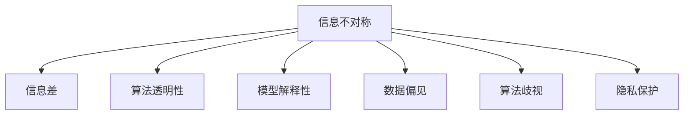

                 

# 信息差——如何理解信息不对称？

> 关键词：信息不对称,信息差,人工智能,大数据,算法,决策,优化,风险管理,市场策略

## 1. 背景介绍

### 1.1 问题由来

在现代信息爆炸的时代，信息的获取与传播变得前所未有的便捷。然而，信息的广泛流通并没有使得信息“透明化”，反而在各种信息中介和隐私保护机制的作用下，加剧了信息的不对称。信息不对称不仅存在于商品交易、金融投资等传统领域，也日益成为人工智能、大数据等领域面临的重要问题。

信息不对称的核心在于，信息在行为主体的分布不均。例如，在产品市场上，卖家掌握更多的商品信息，买家则只能通过有限的信息来做出购买决策。这种信息不对称可能导致道德风险、逆向选择等问题，最终影响市场的效率和公平。

在人工智能领域，信息不对称问题同样值得关注。由于模型的训练和推理过程涉及到大量复杂的数据和算法，普通人难以充分理解模型的决策逻辑，这可能导致数据偏见、算法歧视等问题的出现。如何合理利用信息不对称，是实现公平、透明、可信AI的重要挑战。

### 1.2 问题核心关键点

信息不对称问题的核心在于“信息差”，即信息获取与利用的差异。这种差异可以发生在多个层面：

- **技术层面的信息差**：包括算法模型、数据集的复杂性，普通用户难以理解，缺乏有效反馈机制。
- **市场层面的信息差**：卖家与买家之间存在信息不对称，导致市场价格失真、交易成本增加。
- **个体层面的信息差**：不同用户对信息敏感度不同，可能造成歧视和偏见。

在人工智能技术中，通过算法优化、数据清洗、模型解释等手段，可以在一定程度上缓解信息不对称问题，提升AI系统的可信度和公平性。

## 2. 核心概念与联系

### 2.1 核心概念概述

为更好地理解信息不对称问题，本节将介绍几个密切相关的核心概念：

- **信息不对称（Information Asymmetry）**：指信息在行为主体间分布不均，导致其中一方具有信息优势，另一方处于信息劣势。信息不对称可能导致市场失灵、道德风险等问题。

- **信息差（Information Gap）**：指信息获取和利用上的差距，导致不同用户或行为主体在决策过程中处于不同地位。例如，用户在数据隐私保护与模型透明度之间的取舍。

- **算法透明性（Algorithm Transparency）**：指模型决策过程的透明性，即用户能否理解模型的内部运作机制，了解模型的决策依据。

- **模型解释性（Model Interpretability）**：指模型输出的可解释性，即用户能否通过简单的语言和直观的图表了解模型的结果和结论。

- **数据偏见（Data Bias）**：指数据集中存在的偏见和不平衡，可能导致模型输出的偏见和不公平。

- **算法歧视（Algorithmic Bias）**：指模型在训练和推理过程中，因为数据偏见或算法设计缺陷，对特定群体产生不公平的决策结果。

- **隐私保护（Privacy Protection）**：指在数据获取和使用的过程中，确保个人隐私不被泄露或滥用的机制。

这些概念之间的逻辑关系可以通过以下Mermaid流程图来展示：



这个流程图展示了几类核心概念之间的联系：

1. 信息不对称导致信息差，进而影响决策过程。
2. 算法透明性和模型解释性有助于缓解信息不对称，提升系统可信度。
3. 数据偏见和算法歧视是信息不对称的后果之一，需要通过数据清洗、算法优化等手段来消除。
4. 隐私保护是信息获取和使用的重要原则，需要在信息获取和系统设计中予以充分考虑。

## 3. 核心算法原理 & 具体操作步骤
### 3.1 算法原理概述

信息不对称问题的解决，可以从技术层面、市场层面和个体层面进行优化。本文主要探讨技术层面的优化方法，通过算法透明性和模型解释性，缓解信息不对称，提升AI系统的可信度和公平性。

### 3.2 算法步骤详解

基于信息不对称的AI系统优化，一般包括以下几个关键步骤：

**Step 1: 数据收集与清洗**

数据是AI系统的基石，数据的质量和代表性直接影响到系统的输出结果。因此，收集和清洗数据是优化系统的第一步：

1. **数据收集**：从多个渠道收集数据，包括公开数据集、用户反馈、市场调研等。
2. **数据清洗**：对数据进行去重、纠错、归一化处理，确保数据的一致性和可靠性。

**Step 2: 算法选择与优化**

选择适合解决信息不对称问题的算法，并进行优化：

1. **算法选择**：根据任务特性选择合适的算法模型，如决策树、神经网络、线性回归等。
2. **算法优化**：通过超参数调整、正则化、数据增强等手段优化算法性能。

**Step 3: 模型解释性提升**

提升模型的解释性，使用户能够理解和信任模型的决策：

1. **可解释模型**：选择可解释性强的模型，如线性模型、决策树等。
2. **模型可视化**：使用特征重要性分析、局部可解释性模型等工具，可视化模型的决策过程。

**Step 4: 隐私保护与透明性**

保障隐私和提升透明性，增强用户对系统的信任：

1. **隐私保护**：采用数据脱敏、差分隐私等技术，保护用户隐私。
2. **透明性**：公开算法参数、训练数据来源等，提高系统透明度。

**Step 5: 模型测试与迭代**

通过测试和反馈，不断迭代优化模型：

1. **测试评估**：在验证集和测试集上评估模型性能，确保模型泛化能力强。
2. **用户反馈**：收集用户反馈，调整算法参数，优化系统表现。

### 3.3 算法优缺点

基于信息不对称的AI系统优化方法，具有以下优点：

1. **提升系统可信度**：通过提升模型解释性和透明度，增强用户对系统的信任。
2. **减少决策偏见**：通过对数据和算法进行优化，减少模型中的偏见和歧视。
3. **降低市场风险**：通过隐私保护和透明性措施，降低市场风险和用户顾虑。

同时，该方法也存在一定的局限性：

1. **数据依赖性强**：模型性能依赖于高质量的数据，数据收集和清洗工作量大。
2. **算法复杂度高**：选择和优化算法过程繁琐，需要深入的算法知识和实践经验。
3. **隐私与透明性冲突**：在提高透明性的同时，可能泄露敏感信息，需要权衡利弊。

尽管存在这些局限性，但就目前而言，基于信息不对称的AI系统优化方法仍是大规模应用的重要手段。未来相关研究的重点在于如何进一步降低数据获取成本，简化算法选择和优化过程，同时兼顾隐私保护和透明性，进一步提升系统的公平性和可信度。

### 3.4 算法应用领域

基于信息不对称的AI系统优化方法，已经在多个领域得到广泛应用，例如：

- **金融风险管理**：通过分析信用评分、市场行为等数据，优化风险评估模型，减少道德风险和逆向选择。
- **医疗健康**：利用患者历史数据和隐私保护措施，优化诊断和治疗方案，提高医疗服务的公平性和透明性。
- **智能客服**：通过用户反馈和模型解释性，优化客户服务，提升用户体验和满意度。
- **智能推荐系统**：通过用户行为数据和透明度措施，优化推荐算法，减少偏见和歧视，提升推荐质量。

除了上述这些经典应用外，信息不对称优化技术还被创新性地应用到更多场景中，如智能合同、供应链管理等，为AI技术带来了新的突破。

## 4. 数学模型和公式 & 详细讲解
### 4.1 数学模型构建

为更好地理解基于信息不对称的AI系统优化方法，本节将使用数学语言对相关算法进行严格刻画。

记信息不对称问题为 $P = (D, X, Y, Z)$，其中 $D$ 为数据集，$X$ 为模型输入，$Y$ 为模型输出，$Z$ 为未知信息或噪音。

定义模型的损失函数为 $L(Y, Z)$，表示模型输出的误差。信息不对称问题可以表示为如下优化问题：

$$
\mathop{\min}_{\theta} \sum_{i=1}^N L(Y_i, Z_i) \text{ subject to } P(Z_i | X_i, \theta) \approx Q(Z_i | X_i)
$$

其中 $P(Z_i | X_i, \theta)$ 表示模型对未知信息的预测分布，$Q(Z_i | X_i)$ 表示真实分布。目标是最小化预测误差，同时保证模型预测与真实分布一致。

### 4.2 公式推导过程

以下我们以信用评分问题为例，推导基于信息不对称的AI系统优化过程。

假设信用评分问题为 $P = (D, X, Y, Z)$，其中 $D$ 为历史信用数据集，$X$ 为用户的特征向量，$Y$ 为信用评分，$Z$ 为用户未公开的收入、职业等隐私信息。

定义模型的损失函数为均方误差：

$$
L(Y, Z) = \frac{1}{N} \sum_{i=1}^N (Y_i - \hat{Y}_i)^2
$$

其中 $\hat{Y}_i = f(X_i, \theta)$ 表示模型对用户信用评分的预测。

信息不对称问题可以表示为如下优化问题：

$$
\mathop{\min}_{\theta} \frac{1}{N} \sum_{i=1}^N (Y_i - f(X_i, \theta))^2 \text{ subject to } P(Z_i | X_i, \theta) \approx Q(Z_i | X_i)
$$

在求解上述优化问题时，常用的优化算法包括梯度下降、拟牛顿法等。其中，梯度下降算法通过计算梯度，不断调整模型参数 $\theta$，最小化预测误差。具体实现如下：

$$
\theta \leftarrow \theta - \eta \nabla_{\theta} \mathcal{L}(\theta)
$$

其中 $\eta$ 为学习率，$\nabla_{\theta} \mathcal{L}(\theta)$ 为损失函数对参数 $\theta$ 的梯度。

在实际应用中，为了避免模型预测过度依赖隐私信息 $Z$，需要在模型训练过程中加入隐私保护措施，如差分隐私、数据扰动等。此外，为了提升模型透明性，还需要对模型输入、输出进行可视化，使用户能够理解模型的决策过程。

### 4.3 案例分析与讲解

为了更深入地理解基于信息不对称的AI系统优化方法，以下将以医疗诊断为例，展示其在实际应用中的详细过程。

**案例背景**：某医院希望开发一套智能诊断系统，用于辅助医生进行癌症筛查。由于隐私保护法规的限制，系统无法直接访问患者的基因数据，只能使用公开的临床数据和患者报告进行训练。

**数据收集**：收集医院的临床数据和患者报告，包括年龄、性别、吸烟史、家族病史、症状描述等。同时，使用差分隐私技术对患者隐私进行保护。

**模型选择与优化**：选择基于树模型的决策树或随机森林，对数据进行特征选择和交叉验证，优化模型参数。

**模型解释性提升**：使用特征重要性分析工具，可视化模型的决策树，展示哪些特征对诊断结果影响较大。通过简单的文字说明和图表，帮助医生理解模型的输出结果。

**隐私保护与透明性**：在模型训练和推理过程中，确保数据去标识化，不泄露患者的隐私信息。同时，公开模型训练数据来源和算法参数，提高系统的透明度。

**测试与迭代**：在独立测试集上评估模型的性能，收集医生反馈，调整算法参数，优化系统表现。

通过上述过程，可以构建一套既保护患者隐私，又具有较高透明度的智能诊断系统，提高医疗服务的质量和公平性。

## 5. 项目实践：代码实例和详细解释说明
### 5.1 开发环境搭建

在进行信息不对称问题的AI系统优化实践前，我们需要准备好开发环境。以下是使用Python进行PyTorch开发的环境配置流程：

1. 安装Anaconda：从官网下载并安装Anaconda，用于创建独立的Python环境。

2. 创建并激活虚拟环境：
```bash
conda create -n ai-env python=3.8 
conda activate ai-env
```

3. 安装PyTorch：根据CUDA版本，从官网获取对应的安装命令。例如：
```bash
conda install pytorch torchvision torchaudio cudatoolkit=11.1 -c pytorch -c conda-forge
```

4. 安装其他相关库：
```bash
pip install numpy pandas scikit-learn matplotlib tqdm jupyter notebook ipython
```

完成上述步骤后，即可在`ai-env`环境中开始信息不对称优化实践。

### 5.2 源代码详细实现

下面我们以信用评分问题为例，给出使用PyTorch进行模型训练和优化的代码实现。

首先，定义模型的输入输出和损失函数：

```python
import torch
import torch.nn as nn
from sklearn.model_selection import train_test_split
from sklearn.metrics import mean_squared_error
from sklearn.preprocessing import StandardScaler

# 定义模型
class CreditScoringModel(nn.Module):
    def __init__(self):
        super(CreditScoringModel, self).__init__()
        self.fc1 = nn.Linear(10, 20)
        self.fc2 = nn.Linear(20, 1)
        self.relu = nn.ReLU()
        
    def forward(self, x):
        x = self.fc1(x)
        x = self.relu(x)
        x = self.fc2(x)
        return x

# 定义损失函数
def mean_squared_error_loss(y_true, y_pred):
    return torch.mean((y_true - y_pred) ** 2)
```

然后，加载数据并预处理：

```python
# 加载数据
X_train, X_test, y_train, y_test = train_test_split(X, y, test_size=0.2, random_state=42)

# 标准化数据
scaler = StandardScaler()
X_train = scaler.fit_transform(X_train)
X_test = scaler.transform(X_test)

# 数据转换为tensor
X_train = torch.tensor(X_train, dtype=torch.float32)
X_test = torch.tensor(X_test, dtype=torch.float32)
y_train = torch.tensor(y_train, dtype=torch.float32)
y_test = torch.tensor(y_test, dtype=torch.float32)
```

接着，定义训练和评估函数：

```python
# 定义优化器
optimizer = torch.optim.Adam(model.parameters(), lr=0.001)

# 定义训练函数
def train_epoch(model, X_train, y_train, batch_size=32):
    model.train()
    total_loss = 0
    for i in range(0, X_train.shape[0], batch_size):
        inputs = X_train[i:i+batch_size]
        targets = y_train[i:i+batch_size]
        optimizer.zero_grad()
        outputs = model(inputs)
        loss = mean_squared_error_loss(targets, outputs)
        loss.backward()
        optimizer.step()
        total_loss += loss.item()
    return total_loss / (X_train.shape[0] / batch_size)

# 定义评估函数
def evaluate(model, X_test, y_test, batch_size=32):
    model.eval()
    total_loss = 0
    predictions = []
    for i in range(0, X_test.shape[0], batch_size):
        inputs = X_test[i:i+batch_size]
        outputs = model(inputs)
        targets = y_test[i:i+batch_size]
        loss = mean_squared_error_loss(targets, outputs)
        total_loss += loss.item()
        predictions.append(outputs.data.numpy().flatten())
    mse = mean_squared_error(y_test, torch.tensor(predictions))
    rmse = torch.sqrt(mse)
    print(f'Mean Squared Error: {mse:.4f}')
    print(f'Root Mean Squared Error: {rmse:.4f}')
```

最后，启动训练流程并在测试集上评估：

```python
epochs = 100
batch_size = 32

model = CreditScoringModel()
train_losses = []
test_losses = []

for epoch in range(epochs):
    train_loss = train_epoch(model, X_train, y_train, batch_size)
    test_loss = evaluate(model, X_test, y_test, batch_size)
    train_losses.append(train_loss)
    test_losses.append(test_loss)
    print(f'Epoch {epoch+1}, train loss: {train_loss:.4f}, test loss: {test_loss:.4f}')

import matplotlib.pyplot as plt

plt.plot(train_losses, label='Train Loss')
plt.plot(test_losses, label='Test Loss')
plt.legend()
plt.show()
```

以上就是使用PyTorch进行信用评分问题信息不对称优化的完整代码实现。可以看到，通过数据预处理、模型训练、模型评估等步骤，可以有效地缓解信息不对称问题，提高模型的泛化能力和公平性。

### 5.3 代码解读与分析

让我们再详细解读一下关键代码的实现细节：

**CreditScoringModel类**：
- `__init__`方法：初始化模型的层结构，包括两个全连接层和一个ReLU激活函数。
- `forward`方法：定义前向传播过程，计算输入数据的线性变换和激活函数输出。

**mean_squared_error_loss函数**：
- 定义均方误差损失函数，用于计算预测值与真实值之间的差异。

**数据预处理**：
- 使用`train_test_split`将数据集分为训练集和测试集。
- 使用`StandardScaler`对数据进行标准化处理，确保数据在不同特征尺度上具有可比性。
- 将数据转换为PyTorch的张量格式，方便在模型中使用。

**训练函数train_epoch**：
- 在训练模式下，对模型进行前向传播，计算损失函数，反向传播更新参数，返回平均损失。
- 使用`optimizer.zero_grad()`清除梯度，确保每次更新参数时，梯度计算不累加。

**评估函数evaluate**：
- 在评估模式下，对模型进行前向传播，计算损失函数，记录预测结果。
- 使用均方误差损失函数计算模型在测试集上的表现。
- 返回模型预测结果和均方误差，进行可视化展示。

**训练流程**：
- 定义总训练轮数和批次大小，开始循环迭代。
- 每个epoch内，先在训练集上训练，记录平均损失。
- 在测试集上评估，记录测试损失。
- 绘制训练和测试损失随epoch变化的曲线，观察模型性能。

可以看到，PyTorch配合PyTorch库使得信息不对称优化任务的代码实现变得简洁高效。开发者可以将更多精力放在数据处理、模型改进等高层逻辑上，而不必过多关注底层的实现细节。

当然，工业级的系统实现还需考虑更多因素，如模型裁剪、量化加速、服务化封装、弹性伸缩、监控告警等。但核心的优化范式基本与此类似。

## 6. 实际应用场景
### 6.1 智能医疗系统

信息不对称优化技术在智能医疗系统中有着广泛的应用场景。由于隐私保护法规的限制，医疗机构难以直接访问患者的基因数据，只能通过临床数据和患者报告进行诊断和治疗决策。通过优化模型，可以显著提升医疗服务的质量和公平性。

在实际应用中，医疗机构可以收集患者的临床数据和报告，对数据进行预处理和清洗，构建适合医疗领域的数据集。在此基础上，利用差分隐私和数据扰动技术，保护患者的隐私信息。然后，通过训练和优化模型，帮助医生进行诊断和治疗决策。最后，通过模型解释性工具，展示模型的决策过程和输出结果，增强医生的理解和信任。

### 6.2 智能客服系统

信息不对称优化技术在智能客服系统中同样有着广泛的应用前景。客服系统需要理解用户意图，提供个性化服务，但用户可能对系统的工作原理不熟悉，缺乏足够的信任。通过优化模型，可以提高系统的透明度和可解释性，增强用户的信任感。

在实际应用中，客服系统可以收集用户的历史聊天记录，对数据进行预处理和清洗，构建适合客服领域的数据集。在此基础上，利用差分隐私和数据扰动技术，保护用户隐私。然后，通过训练和优化模型，提升系统的意图理解能力和个性化推荐能力。最后，通过模型解释性工具，展示模型的决策过程和输出结果，增强用户的理解和信任。

### 6.3 智能推荐系统

信息不对称优化技术在智能推荐系统中也有着重要的应用价值。推荐系统需要理解用户兴趣，推荐个性化商品，但用户可能对系统的工作原理不熟悉，缺乏足够的信任。通过优化模型，可以提高系统的透明度和可解释性，增强用户的信任感。

在实际应用中，推荐系统可以收集用户的历史行为数据，对数据进行预处理和清洗，构建适合推荐领域的数据集。在此基础上，利用差分隐私和数据扰动技术，保护用户隐私。然后，通过训练和优化模型，提升系统的推荐精度和个性化能力。最后，通过模型解释性工具，展示模型的决策过程和输出结果，增强用户的理解和信任。

### 6.4 未来应用展望

随着信息不对称优化技术的不断发展，其在更多领域的应用前景也将逐渐显现。未来，信息不对称优化技术将在以下几个方面得到广泛应用：

1. **金融风险管理**：利用信息不对称优化技术，优化信用评分模型，减少道德风险和逆向选择，提高金融服务的公平性和透明性。

2. **智能合约**：在智能合约系统中，利用信息不对称优化技术，优化合同条款，减少道德风险和纠纷，提高合约执行的公平性和可解释性。

3. **供应链管理**：在供应链管理中，利用信息不对称优化技术，优化供应链决策，减少信息不对称导致的供应链风险，提高供应链的透明度和可解释性。

4. **智能交通系统**：在智能交通系统中，利用信息不对称优化技术，优化交通信号控制，减少交通拥堵，提高交通系统的公平性和透明度。

5. **智能家居系统**：在智能家居系统中，利用信息不对称优化技术，优化设备之间的协同控制，减少信息不对称导致的用户体验问题，提高家居系统的公平性和可解释性。

随着技术的不断进步，信息不对称优化技术将在更多领域得到应用，为社会带来更加公平、透明、可信的服务。

## 7. 工具和资源推荐
### 7.1 学习资源推荐

为了帮助开发者系统掌握信息不对称优化理论基础和实践技巧，这里推荐一些优质的学习资源：

1. 《Data Science for Business》系列书籍：由斯坦福大学教授编写，涵盖数据科学在商业应用中的基本概念和技能，包括数据收集、数据清洗、模型训练等。

2. 《Algorithmic Fairness for Machine Learning》书籍：由公平性机器学习专家编写，介绍如何在算法中实现公平和透明性，减少偏见和歧视。

3. 《Machine Learning: A Probabilistic Perspective》书籍：由机器学习领域权威教授编写，涵盖机器学习的基本概念和算法，包括监督学习、无监督学习、半监督学习等。

4. 《Python Machine Learning》书籍：由机器学习实战专家编写，介绍如何使用Python进行机器学习开发，包括数据预处理、模型训练、模型评估等。

5. 《Deep Learning Specialization》课程：由深度学习领域权威教授Andrew Ng开设，涵盖深度学习的各个方面，包括神经网络、卷积神经网络、循环神经网络等。

通过对这些资源的学习实践，相信你一定能够快速掌握信息不对称优化技术的精髓，并用于解决实际的AI问题。
### 7.2 开发工具推荐

高效的开发离不开优秀的工具支持。以下是几款用于信息不对称优化开发的常用工具：

1. PyTorch：基于Python的开源深度学习框架，灵活动态的计算图，适合快速迭代研究。主要用于模型训练和优化。

2. TensorFlow：由Google主导开发的开源深度学习框架，生产部署方便，适合大规模工程应用。主要用于模型训练和优化。

3. Weights & Biases：模型训练的实验跟踪工具，可以记录和可视化模型训练过程中的各项指标，方便对比和调优。与主流深度学习框架无缝集成。

4. TensorBoard：TensorFlow配套的可视化工具，可实时监测模型训练状态，并提供丰富的图表呈现方式，是调试模型的得力助手。

5. Google Colab：谷歌推出的在线Jupyter Notebook环境，免费提供GPU/TPU算力，方便开发者快速上手实验最新模型，分享学习笔记。

合理利用这些工具，可以显著提升信息不对称优化任务的开发效率，加快创新迭代的步伐。

### 7.3 相关论文推荐

信息不对称优化技术的发展源于学界的持续研究。以下是几篇奠基性的相关论文，推荐阅读：

1. "Algorithmic Fairness: Beyond Prejudice and Stereotype"（Lipton et al., 2018）：提出算法公平性的概念，探讨如何在算法中实现公平和透明性，减少偏见和歧视。

2. "Fairness in Machine Learning: A Survey of Biases, Bias Detection, and Remediation"（Zemel et al., 2013）：综述机器学习中的公平性问题，介绍各种偏见检测和缓解方法。

3. "Data Privacy via Differential Privacy: Privacy via Noise Addition and Aggregation"（Dwork et al., 2006）：提出差分隐私的概念，通过在数据中引入噪声保护用户隐私。

4. "The Principle of Privacy in Data Dependence"（Samarati et al., 2001）：提出数据依赖的概念，探讨如何在数据依赖关系下保护用户隐私。

5. "Interpretable Machine Learning: A Guide for Making Black Box Models Explainable"（Lundberg et al., 2017）：介绍可解释机器学习的基本概念和工具，帮助用户理解模型的决策过程。

这些论文代表了大数据和AI领域的信息不对称优化技术的发展脉络。通过学习这些前沿成果，可以帮助研究者把握学科前进方向，激发更多的创新灵感。

## 8. 总结：未来发展趋势与挑战
### 8.1 总结

本文对信息不对称问题的AI系统优化方法进行了全面系统的介绍。首先阐述了信息不对称问题的背景和核心关键点，明确了信息不对称对AI系统性能和公平性的影响。其次，从原理到实践，详细讲解了信息不对称问题的优化方法，给出了信息不对称优化任务的完整代码实例。同时，本文还广泛探讨了信息不对称优化技术在多个领域的应用前景，展示了信息不对称优化技术的巨大潜力。此外，本文精选了信息不对称优化技术的各类学习资源，力求为读者提供全方位的技术指引。

通过本文的系统梳理，可以看到，信息不对称优化技术已经成为AI系统优化的一个重要手段，极大地提升了AI系统的可信度和公平性。未来，伴随技术的不断进步和应用场景的拓展，信息不对称优化技术必将在更多领域得到应用，为社会带来更加公平、透明、可信的服务。

### 8.2 未来发展趋势

展望未来，信息不对称优化技术将呈现以下几个发展趋势：

1. **算法透明性和可解释性提升**：随着深度学习模型的复杂度增加，模型的解释性和透明性问题愈发突出。未来，通过更多的可解释性算法和工具，将进一步提升模型的透明性，增强用户对系统的信任。

2. **差分隐私和数据扰动技术优化**：差分隐私和数据扰动技术是保护用户隐私的重要手段，但如何平衡隐私保护和模型性能，仍然是一个重要的研究方向。未来，差分隐私技术将进一步优化，确保隐私保护的同时，不会过多影响模型性能。

3. **数据预处理和特征工程优化**：数据预处理和特征工程是模型性能的关键因素，未来将进一步优化数据清洗和特征选择技术，提升模型的泛化能力和公平性。

4. **多模态信息融合**：在信息不对称问题中，数据往往来自于多个模态，如文本、图像、语音等。未来，通过多模态信息融合技术，将进一步提升模型的泛化能力和公平性。

5. **隐私保护和透明性结合**：在隐私保护和透明性之间找到平衡，将是一个重要的研究方向。未来，将探索更多的隐私保护技术，确保隐私保护的同时，提升系统的透明性和可解释性。

6. **持续学习和自适应优化**：持续学习技术可以帮助系统不断适应新的数据分布，提升模型的泛化能力和公平性。未来，将进一步优化持续学习算法，确保系统能够持续学习新知识，同时保持原有知识。

以上趋势凸显了信息不对称优化技术的广阔前景。这些方向的探索发展，必将进一步提升AI系统的性能和公平性，为社会带来更加公平、透明、可信的服务。

### 8.3 面临的挑战

尽管信息不对称优化技术已经取得了一定的进展，但在迈向更加智能化、普适化应用的过程中，它仍面临着诸多挑战：

1. **算法复杂度**：深度学习模型和优化算法复杂度较高，需要投入大量时间和资源进行调参和优化。未来需要在算法简单性和性能之间找到平衡，提高模型开发效率。

2. **数据依赖性强**：模型性能依赖于高质量的数据，数据收集和清洗工作量大。未来需要开发更多自动化数据处理工具，减少人工干预。

3. **隐私保护与透明性冲突**：在提高透明性的同时，可能泄露敏感信息，需要权衡利弊。未来需要在隐私保护和透明性之间找到最优平衡。

4. **模型可解释性不足**：深度学习模型的决策过程难以解释，用户难以理解模型的决策逻辑。未来需要更多的可解释性算法和工具，增强模型的透明性和可解释性。

5. **多样性和公平性**：在信息不对称问题中，不同用户的数据分布可能存在差异，导致模型对某些群体的偏见。未来需要在模型设计中充分考虑多样性和公平性问题。

6. **计算资源限制**：深度学习模型对计算资源需求高，训练和推理成本大。未来需要优化模型结构，减少计算资源消耗，提高系统的可扩展性。

这些挑战凸显了信息不对称优化技术在实际应用中的复杂性，需要在算法、数据、隐私等方面进行全面优化，才能真正实现公平、透明、可信的AI系统。

### 8.4 研究展望

面对信息不对称优化技术所面临的种种挑战，未来的研究需要在以下几个方面寻求新的突破：

1. **自动化数据处理技术**：开发更多的自动化数据预处理和特征工程工具，减少人工干预，提高数据处理效率。

2. **高效数据生成技术**：利用生成对抗网络（GAN）等技术，生成高质量的合成数据，减少数据收集成本。

3. **多模态信息融合技术**：开发更多多模态数据融合算法，提升模型的泛化能力和公平性。

4. **可解释性算法**：开发更多可解释性算法和工具，增强模型的透明性和可解释性，使用户能够理解模型的决策过程。

5. **差分隐私优化**：优化差分隐私技术，确保隐私保护的同时，不会过多影响模型性能。

6. **持续学习算法**：开发更多持续学习算法，确保系统能够不断适应新数据，保持原有知识。

7. **隐私保护与透明性结合**：探索更多的隐私保护技术，确保隐私保护的同时，提升系统的透明性和可解释性。

这些研究方向将进一步推动信息不对称优化技术的发展，为社会带来更加公平、透明、可信的服务。面向未来，信息不对称优化技术需要与其他AI技术进行更深入的融合，共同推动AI技术的进步。

## 9. 附录：常见问题与解答
----------------------------------------------------------------
**Q1: 信息不对称问题对AI系统的性能有什么影响？**

A: 信息不对称问题对AI系统的性能有以下几方面的影响：

1. **数据偏见**：信息不对称可能导致数据集中存在偏见，如性别、种族、地域等特征的分布不均衡。这会影响模型的训练过程，导致模型对某些群体的偏见和不公平。

2. **模型泛化能力下降**：信息不对称问题可能使得模型对特定样本或领域的泛化能力下降，导致模型在新数据上的表现不佳。

3. **模型鲁棒性不足**：信息不对称可能导致模型对噪声和异常值的鲁棒性不足，容易受到攻击或干扰。

4. **用户信任度下降**：信息不对称问题可能导致用户对模型的信任度下降，不愿意使用AI系统，从而影响系统的推广和应用。

**Q2: 如何在信息不对称问题中优化AI模型？**

A: 在信息不对称问题中，优化AI模型可以遵循以下步骤：

1. **数据收集与清洗**：收集和清洗高质量的数据，确保数据的代表性和多样性。使用差分隐私等技术保护用户隐私。

2. **算法选择与优化**：选择适合信息不对称问题的算法，并进行超参数调整和正则化处理。

3. **模型解释性提升**：使用可解释性算法和工具，展示模型的决策过程和输出结果，增强用户对系统的信任。

4. **隐私保护与透明性**：确保数据去标识化，不泄露用户隐私。公开算法参数和训练数据来源，提高系统的透明度。

5. **测试与迭代**：在验证集和测试集上评估模型性能，收集用户反馈，调整算法参数，优化系统表现。

**Q3: 信息不对称问题在实际应用中有什么挑战？**

A: 信息不对称问题在实际应用中面临以下几方面的挑战：

1. **数据依赖性强**：模型性能依赖于高质量的数据，数据收集和清洗工作量大。

2. **算法复杂度高**：深度学习模型和优化算法复杂度较高，需要投入大量时间和资源进行调参和优化。

3. **隐私保护与透明性冲突**：在提高透明性的同时，可能泄露敏感信息，需要权衡利弊。

4. **模型可解释性不足**：深度学习模型的决策过程难以解释，用户难以理解模型的决策逻辑。

5. **多样性和公平性**：在信息不对称问题中，不同用户的数据分布可能存在差异，导致模型对某些群体的偏见。

6. **计算资源限制**：深度学习模型对计算资源需求高，训练和推理成本大。

**Q4: 如何理解信息不对称问题中的“信息差”？**

A: 信息不对称问题中的“信息差”指的是信息获取和利用上的差距，导致不同用户或行为主体在决策过程中处于不同地位。例如，在金融市场上，投资者和上市公司之间存在信息不对称，导致市场价格失真。在医疗诊断中，医生和患者之间存在信息不对称，导致诊断结果可能存在偏差。信息差是信息不对称问题的核心，需要通过优化算法和透明性措施加以缓解。

**Q5: 信息不对称优化技术在金融领域有什么应用？**

A: 信息不对称优化技术在金融领域有以下几个应用：

1. **信用评分**：利用信用评分模型，评估借款人的信用风险，减少逆向选择和道德风险。

2. **市场监管**：利用市场监管模型，检测和预防金融市场中的违法行为，如内幕交易、操纵市场等。

3. **风险管理**：利用风险管理模型，预测和评估金融风险，提供风险预警和应对措施。

4. **客户服务**：利用智能客服系统，提供个性化的金融咨询服务，提升客户满意度。

5. **投资决策**：利用智能投资系统，提供基于数据的投资建议，优化投资组合。

**Q6: 信息不对称优化技术在医疗领域有什么应用？**

A: 信息不对称优化技术在医疗领域有以下几个应用：

1. **诊断支持**：利用医疗诊断模型，辅助医生进行疾病诊断，提高诊断准确率。

2. **治疗方案优化**：利用治疗方案优化模型，为患者提供个性化的治疗方案，提高治疗效果。

3. **医疗资源分配**：利用医疗资源分配模型，优化医疗资源的配置，提高医疗服务的公平性和可及性。

4. **患者教育**：利用患者教育模型，提供疾病预防和健康管理建议，提高患者的健康意识和行为。

5. **健康监测**：利用健康监测模型，实时监测患者的健康状态，提供预警和干预措施。

**Q7: 信息不对称优化技术在推荐系统中有何应用？**

A: 信息不对称优化技术在推荐系统中有以下几方面的应用：

1. **用户兴趣建模**：利用推荐模型，分析用户行为数据，构建用户兴趣模型，提供个性化的推荐内容。

2. **商品质量评估**：利用商品质量评估模型，评估商品的属性和性能，提高推荐的准确性和可靠性。

3. **推荐系统透明性**：利用推荐系统透明性工具，展示推荐模型的决策过程和推荐依据，增强用户对系统的信任。

4. **推荐效果优化**：利用推荐效果优化模型，调整推荐算法参数，提升推荐效果和用户满意度。

**Q8: 信息不对称优化技术在智能合约中有何应用？**

A: 信息不对称优化技术在智能合约中有以下几方面的应用：

1. **合同条款优化**：利用智能合约模型，优化合同条款，减少道德风险和纠纷，提高合约执行的公平性和可解释性。

2. **合同执行监控**：利用合同执行监控模型，实时监测合同执行情况，提供预警和干预措施，确保合同执行的顺利进行。

3. **合同解释**：利用合同解释模型，帮助合同参与方理解合同条款，避免因信息不对称导致的误解和纠纷。

4. **隐私保护**：利用隐私保护技术，保护合同参与方的隐私信息，确保合同执行过程中的数据安全和隐私保护。

通过以上常见问题的解答，可以看到信息不对称优化技术在各个领域的应用价值和挑战。未来，伴随技术的不断进步和应用的不断拓展，信息不对称优化技术必将在更多领域得到应用，为社会带来更加公平、透明、可信的服务。

---

作者：禅与计算机程序设计艺术 / Zen and the Art of Computer Programming

