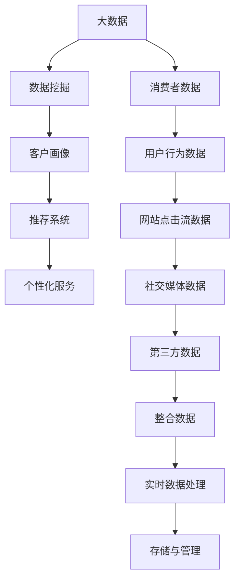

                 

# 信息差的商业服务个性化：大数据如何实现服务个性化

## 1. 背景介绍

在当今商业环境中，个性化服务已成为企业和消费者之间建立稳固关系的核心驱动力。个性化服务通过深入了解客户需求，为其提供定制化的产品或服务，从而提升客户满意度和忠诚度。然而，实现个性化服务并非易事，尤其是在大数据时代，如何高效、准确地捕捉和利用客户信息，是一大挑战。本文旨在探讨大数据如何在商业服务中实现个性化，帮助企业更好地理解和满足客户需求，从而在激烈的市场竞争中脱颖而出。

## 2. 核心概念与联系

### 2.1 核心概念概述

为了理解如何利用大数据实现商业服务的个性化，首先需要明确几个核心概念：

- **大数据**：指超出传统数据处理工具和设备能力范围的数据集，包括结构化数据、半结构化数据和无结构化数据。大数据处理和分析可以揭示隐藏在其中的有用信息，支持决策制定和创新。
- **个性化服务**：指针对个体客户需求定制的服务，包括个性化推荐、定制化营销、个性化内容等，旨在提高客户满意度和忠诚度。
- **客户画像**：通过大数据分析构建的客户特征模型，包括人口统计特征、行为特征、偏好特征等，用于识别和预测客户需求。
- **推荐系统**：利用算法为用户推荐最符合其需求的产品或服务，提升用户体验和满意度。
- **数据挖掘**：从大量数据中提取有价值的信息，发现潜在的模式和关联，为个性化服务提供数据支持。

这些核心概念构成了大数据实现个性化服务的框架，帮助企业通过数据驱动的决策制定，提升服务质量和客户体验。

### 2.2 核心概念原理和架构的 Mermaid 流程图



这个流程图展示了大数据实现个性化服务的核心流程：从收集消费者数据，到进行数据挖掘和整合，构建客户画像，再到利用推荐系统提供个性化服务，每一个环节都是密不可分的。

## 3. 核心算法原理 & 具体操作步骤

### 3.1 算法原理概述

大数据实现个性化服务的核心算法原理主要包括以下几个方面：

- **数据集成与清洗**：将来自不同渠道的数据进行整合，并通过清洗去除冗余和错误数据，确保数据质量。
- **特征提取与选择**：从数据集中提取有意义的特征，并进行选择，以提高模型预测的准确性。
- **模型训练与评估**：利用机器学习算法（如决策树、随机森林、神经网络等）训练模型，并通过交叉验证等方法评估模型性能。
- **个性化推荐算法**：基于用户历史行为、偏好等数据，推荐最符合其需求的产品或服务。

### 3.2 算法步骤详解

1. **数据收集**：
    - 收集消费者数据，包括人口统计信息、购买历史、搜索行为、社交媒体互动等。
    - 使用API接口、爬虫技术、数据库导出等手段获取数据。

2. **数据清洗与预处理**：
    - 去除重复数据、缺失值、异常值等，确保数据的一致性和完整性。
    - 对文本数据进行分词、去停用词、词干提取等预处理。

3. **特征提取与选择**：
    - 提取有意义的特征，如用户行为特征、购买偏好、搜索习惯等。
    - 使用主成分分析（PCA）、特征选择算法等进行特征选择，减少冗余特征。

4. **模型训练与评估**：
    - 选择适当的机器学习算法，如随机森林、神经网络等。
    - 利用交叉验证、AUC-ROC曲线等方法评估模型性能。
    - 使用超参数调优技术，如网格搜索、随机搜索等，优化模型参数。

5. **个性化推荐**：
    - 利用协同过滤、基于内容的推荐算法等，为用户推荐产品或服务。
    - 结合实时数据，动态调整推荐策略，提升推荐效果。

### 3.3 算法优缺点

大数据实现个性化服务的算法具有以下优点：
- **数据驱动**：通过大量数据进行分析，提供更加精准和个性化的服务。
- **动态调整**：能够根据用户反馈和行为变化，实时调整推荐策略。
- **覆盖面广**：能够覆盖更多的用户需求，提高整体服务质量。

同时，该方法也存在一些局限：
- **数据隐私**：收集和使用消费者数据涉及隐私问题，需要严格遵守法律法规。
- **数据质量**：数据的质量直接影响到算法的准确性，数据清洗和特征选择是关键步骤。
- **计算复杂度**：大规模数据集的处理和分析需要高性能计算资源。

### 3.4 算法应用领域

大数据实现个性化服务的应用领域非常广泛，以下是几个典型案例：

- **电商**：利用用户行为数据和购买历史，推荐个性化的商品和优惠活动。
- **金融**：根据用户财务状况和交易记录，提供定制化的理财和投资建议。
- **医疗**：通过健康数据和病历记录，提供个性化的健康管理和诊疗建议。
- **旅游**：根据用户旅游偏好和历史行程，推荐个性化的旅游路线和酒店。

这些领域的大数据应用，不仅提高了企业的服务质量和客户满意度，也为消费者提供了更加个性化和便捷的服务体验。

## 4. 数学模型和公式 & 详细讲解 & 举例说明

### 4.1 数学模型构建

大数据实现个性化服务的数学模型通常包括以下几个部分：

- **输入变量**：包括用户历史行为数据、偏好特征、地理位置等。
- **输出变量**：包括推荐产品ID、服务价格、推荐时间等。
- **模型函数**：利用回归、分类、聚类等算法建立模型函数。

以推荐系统为例，可以使用如下回归模型：

$$
\hat{y} = \beta_0 + \sum_{i=1}^n \beta_i x_i
$$

其中，$\hat{y}$ 为预测值，$\beta_0$ 为截距，$\beta_i$ 为特征系数，$x_i$ 为输入变量。

### 4.2 公式推导过程

以协同过滤推荐算法为例，假设用户$u$对物品$i$的评分是$r_{ui}$，物品$i$的评分向量是$\text{avg}_i = \frac{1}{n} \sum_{j=1}^n r_{ij}$，用户$u$的评分向量是$\text{avg}_u = \frac{1}{m} \sum_{i=1}^m r_{iu}$。则用户$u$对物品$i$的预测评分$r_{ui}^{pred}$可以表示为：

$$
r_{ui}^{pred} = \frac{1}{n}\sum_{j=1}^n r_{uj} \left(\frac{r_{ij}}{\text{avg}_i} - \frac{r_{ji}}{\text{avg}_j}\right)
$$

该公式的推导基于协同过滤的基本原理，即通过用户-物品评分矩阵，找到与目标用户兴趣相似的邻居用户，计算其对未评分的物品的评分预测。

### 4.3 案例分析与讲解

以Netflix推荐系统为例，分析其个性化推荐算法的设计思路：

- **数据收集**：收集用户观看历史、评分数据、人口统计特征等。
- **特征提取**：提取用户行为特征，如观看时长、评分偏好等。
- **模型训练**：使用协同过滤算法，构建用户-物品评分矩阵。
- **个性化推荐**：根据用户行为数据，动态调整推荐策略，提供个性化推荐。

Netflix通过不断优化推荐算法和数据处理流程，显著提升了用户体验和留存率，成为全球领先的流媒体平台之一。

## 5. 项目实践：代码实例和详细解释说明

### 5.1 开发环境搭建

要进行个性化服务的开发，首先需要搭建一个完善的开发环境。以下是基本的开发环境搭建步骤：

1. **选择编程语言**：Python是当前数据科学领域的主流语言，适合进行数据分析和机器学习。
2. **安装Python环境**：可以使用Anaconda或Miniconda进行Python环境的搭建和管理。
3. **安装必要的库**：安装Pandas、NumPy、Scikit-learn、TensorFlow等数据处理和机器学习库。
4. **设置数据存储和处理环境**：使用Hadoop、Spark等大数据处理框架，处理和存储大规模数据集。

### 5.2 源代码详细实现

以电商个性化推荐系统为例，展示源代码的详细实现过程：

```python
import pandas as pd
from sklearn.model_selection import train_test_split
from sklearn.ensemble import RandomForestRegressor
from sklearn.metrics import mean_squared_error

# 加载数据
df = pd.read_csv('user_basket.csv')

# 数据预处理
X = df.drop('item_id', axis=1)
y = df['item_id']

# 数据分割
X_train, X_test, y_train, y_test = train_test_split(X, y, test_size=0.2, random_state=42)

# 模型训练
model = RandomForestRegressor()
model.fit(X_train, y_train)

# 模型评估
y_pred = model.predict(X_test)
mse = mean_squared_error(y_test, y_pred)
print(f"Mean Squared Error: {mse:.2f}")
```

以上代码实现了基于随机森林的个性化推荐系统，通过用户行为数据预测推荐商品ID。

### 5.3 代码解读与分析

**代码解读**：
- `pd.read_csv()`：读取用户行为数据。
- `X.drop('item_id', axis=1)`：移除目标变量，只保留特征变量。
- `train_test_split()`：数据分割，将数据集分为训练集和测试集。
- `RandomForestRegressor()`：创建随机森林回归模型。
- `model.fit(X_train, y_train)`：模型训练。
- `model.predict(X_test)`：模型预测。
- `mean_squared_error()`：计算预测结果与真实值之间的均方误差。

**分析**：
- 数据预处理是机器学习模型的关键步骤，包括特征选择、数据清洗等。
- 模型训练需要选择适当的算法，并进行超参数调优。
- 模型评估使用常见的评估指标，如均方误差、准确率等，评估模型性能。

## 6. 实际应用场景

### 6.1 电商平台

电商平台通过大数据实现个性化服务，帮助用户发现感兴趣的商品，提高转化率和复购率。例如，亚马逊推荐系统根据用户浏览历史、购买记录和评分数据，动态调整推荐策略，提供个性化的商品推荐。

### 6.2 在线教育平台

在线教育平台利用大数据分析学生的学习行为和成绩，提供个性化的学习计划和推荐资源。例如，Coursera根据学生的学习历史和偏好，推荐相关的课程和学习材料，提高学习效率。

### 6.3 金融服务

金融服务提供商利用大数据分析用户的财务状况和交易记录，提供个性化的理财建议和投资方案。例如，支付宝通过用户消费数据和理财行为，推荐合适的理财产品和投资组合。

### 6.4 未来应用展望

随着技术的不断进步，大数据实现个性化服务的应用场景将更加广泛，以下是几个未来展望：

- **跨领域应用**：大数据不仅应用于电商、金融等传统领域，还将拓展到医疗、教育、娱乐等更多领域。
- **实时推荐**：利用流处理技术，实现实时数据处理和推荐，提升用户体验。
- **多模态数据融合**：结合图像、视频、文本等多种数据，提供更加全面和准确的个性化服务。
- **深度学习应用**：利用深度学习技术，如卷积神经网络、循环神经网络等，提升推荐系统的性能。

## 7. 工具和资源推荐

### 7.1 学习资源推荐

为了帮助开发者系统掌握大数据实现个性化服务的技术，这里推荐一些优质的学习资源：

1. **Coursera《机器学习》课程**：由斯坦福大学Andrew Ng教授主讲，系统介绍机器学习的基本概念和算法。
2. **Kaggle竞赛平台**：提供大量数据集和竞赛项目，实践机器学习和数据分析技能。
3. **《Python数据科学手册》**：详细介绍了Python在数据科学和机器学习中的应用。
4. **TensorFlow官方文档**：提供全面的TensorFlow学习资源，包括教程、代码示例等。
5. **《Deep Learning with Python》**：讲解深度学习的基本原理和实现方法。

### 7.2 开发工具推荐

以下是一些常用的开发工具，帮助开发者高效实现大数据个性化服务：

1. **Jupyter Notebook**：数据科学和机器学习的交互式开发环境，支持代码、数据和可视化展示。
2. **PySpark**：Spark的Python API，支持大规模数据处理和分析。
3. **Hadoop**：分布式数据处理框架，支持海量数据存储和处理。
4. **Scikit-learn**：Python机器学习库，提供简单易用的机器学习算法实现。
5. **TensorBoard**：TensorFlow的可视化工具，支持模型训练和调试。

### 7.3 相关论文推荐

大数据实现个性化服务的研究论文很多，以下是几篇经典论文推荐：

1. **《Scalable Collaborative Filtering for Recommendations》**：提出基于协同过滤的推荐算法，并进行扩展和优化。
2. **《Personalized Recommendation Systems》**：介绍个性化推荐系统的设计思路和实现方法。
3. **《Fine-Grained Recommendation System for E-Commerce》**：讨论电商领域个性化推荐系统的挑战和解决方案。
4. **《A Survey of Personalized Recommendation Systems》**：综述个性化推荐系统的研究进展和应用案例。

## 8. 总结：未来发展趋势与挑战

### 8.1 研究成果总结

本文探讨了大数据在商业服务个性化中的应用，详细讲解了个性化服务的数据收集、处理、特征提取、模型训练和推荐算法。通过具体案例和代码实现，展示了大数据实现个性化服务的技术细节和方法。

### 8.2 未来发展趋势

未来，大数据实现个性化服务将继续发展，以下是几个主要趋势：

- **多模态数据融合**：结合图像、视频、文本等多种数据，提供更加全面和准确的个性化服务。
- **实时推荐系统**：利用流处理技术，实现实时数据处理和推荐，提升用户体验。
- **深度学习应用**：利用深度学习技术，如卷积神经网络、循环神经网络等，提升推荐系统的性能。
- **跨领域应用**：大数据不仅应用于电商、金融等传统领域，还将拓展到医疗、教育、娱乐等更多领域。

### 8.3 面临的挑战

尽管大数据实现个性化服务有很多优势，但也面临一些挑战：

- **数据隐私**：收集和使用消费者数据涉及隐私问题，需要严格遵守法律法规。
- **数据质量**：数据的质量直接影响到算法的准确性，数据清洗和特征选择是关键步骤。
- **计算复杂度**：大规模数据集的处理和分析需要高性能计算资源。
- **模型可解释性**：复杂的推荐模型难以解释其内部工作机制和决策逻辑。

### 8.4 研究展望

未来研究需要在以下几个方面取得新的突破：

- **隐私保护**：设计更加隐私保护的算法和系统，确保用户数据的安全。
- **高效数据处理**：开发更高效的数据处理和存储技术，降低计算复杂度。
- **可解释性**：提升推荐系统的可解释性，使其更加透明和可信。
- **跨领域应用**：探索更多领域的大数据个性化应用，拓展商业服务的边界。

## 9. 附录：常见问题与解答

### 常见问题与解答

**Q1：如何评估个性化推荐系统的性能？**

A: 推荐系统的性能评估通常使用以下几个指标：
- 准确率：推荐系统预测的用户评分与实际评分的接近程度。
- 召回率：用户评分推荐系统中实际存在的推荐物品占总推荐物品的比例。
- 覆盖率：推荐系统中实际存在的物品占总物品的比例。

**Q2：推荐系统中如何处理数据稀疏问题？**

A: 数据稀疏是推荐系统面临的主要挑战之一，可以通过以下方法进行处理：
- 协同过滤算法：利用用户之间的相似性进行推荐，处理数据稀疏问题。
- 矩阵分解：将用户-物品评分矩阵分解为低秩矩阵，填充缺失值。
- 混合推荐算法：结合内容推荐和协同过滤算法，提升推荐效果。

**Q3：如何在电商平台上实现个性化推荐？**

A: 在电商平台上实现个性化推荐需要以下步骤：
- 收集用户浏览历史、购买记录、搜索行为等数据。
- 提取用户行为特征，如浏览时长、购买偏好等。
- 使用协同过滤算法或深度学习模型，训练推荐模型。
- 根据用户行为数据，动态调整推荐策略，提供个性化推荐。

通过不断优化推荐算法和数据处理流程，电商平台的个性化推荐系统能够提高用户体验和销售转化率，从而在激烈的市场竞争中脱颖而出。

---

作者：禅与计算机程序设计艺术 / Zen and the Art of Computer Programming

