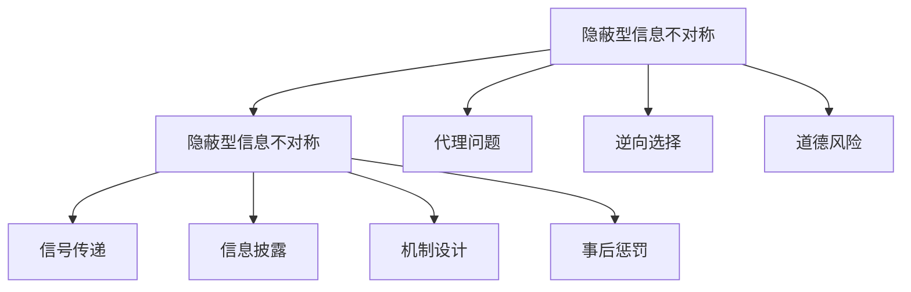

                 

## 1. 背景介绍

### 1.1 问题由来
在商业世界中，信息不对称是一个普遍存在的问题。它指的是交易双方对交易相关信息掌握的不平等，其中一方拥有更充分的信息，另一方则相对信息匮乏。信息不对称会导致资源配置的低效，产生市场分割和市场渗透难题。在实践中，理解信息不对称的机制，并有效应对，是构建成功商业模式的重要前提。

### 1.2 问题核心关键点
理解信息不对称的关键在于掌握它的类型、影响和缓解方法。信息不对称可分为两类：**隐蔽型信息不对称**和**隐蔽型信息不对称**。隐蔽型信息不对称是指一方拥有对方的私人信息，但不愿公开；隐蔽型信息不对称是指一方对另一方的行为、技能或产品真实质量不完全了解。

信息不对称对市场渗透有显著影响：
- **代理问题**：在委托-代理关系中，信息不对称会导致代理人行为失真，降低资源配置效率。
- **逆向选择**：在交易中，信息不对称会导致低质量商品驱逐高质量商品，市场均衡状态无法达成。
- **道德风险**：在保险、信贷等场景中，信息不对称会导致委托方无法控制代理方行为，产生道德风险。

解决信息不对称的方法包括：
- **信号传递**：交易双方通过信号传递信息，建立信任。
- **信息披露**：通过增加信息透明度，降低信息不对称程度。
- **机制设计**：设计激励机制，引导交易双方行为。
- **事后惩罚**：建立惩罚机制，惩罚不诚实行为。

### 1.3 问题研究意义
研究信息不对称对商业模式的影响，对于制定合理的定价策略、建立有效的激励机制和减少市场交易成本具有重要意义。通过深入理解信息不对称的机制，我们可以构建更加稳健的商业模式，提升市场渗透力，从而在竞争中占据优势。

## 2. 核心概念与联系

### 2.1 核心概念概述

为更好地理解信息不对称问题，本节将介绍几个密切相关的核心概念：

- **隐蔽型信息不对称**：指一方拥有对方私人信息但不愿公开。
- **隐蔽型信息不对称**：指一方对另一方的行为、技能或产品真实质量不完全了解。
- **代理问题**：委托-代理关系中，信息不对称导致的代理人行为失真。
- **逆向选择**：信息不对称导致的市场均衡状态无法达成。
- **道德风险**：委托-代理关系中，委托方无法控制代理方行为，产生道德风险。
- **信号传递**：交易双方通过信号传递信息，建立信任。
- **信息披露**：增加信息透明度，降低信息不对称程度。
- **机制设计**：设计激励机制，引导交易双方行为。
- **事后惩罚**：建立惩罚机制，惩罚不诚实行为。

这些概念之间的逻辑关系可以通过以下Mermaid流程图来展示：



这个流程图展示了大语言模型的核心概念及其之间的关系：

1. 隐蔽型信息不对称是基础，导致了代理问题、逆向选择和道德风险。
2. 信号传递、信息披露、机制设计和事后惩罚是缓解信息不对称的方法。
3. 通过信号传递和信息披露建立信任，通过机制设计引导行为，通过事后惩罚保证合规，最终减少信息不对称带来的问题。

## 3. 核心算法原理 & 具体操作步骤
### 3.1 算法原理概述

信息不对称问题的核心在于信息的掌握与传递，而缓解信息不对称的核心在于设计有效的信号传递和激励机制。本节将从这两个方面详细讲解。

**信号传递**：通过交易双方的信息互动，建立信任关系。常见的信号传递模型包括贝叶斯博弈和显性信号传递模型。

**激励机制设计**：通过奖励机制，激励交易双方行为。常见的激励机制包括固定激励、可变激励、激励合约等。

### 3.2 算法步骤详解

**信号传递模型**：

1. 定义交易双方的信息状态：卖方知道商品的真实质量（高质量为 $H$，低质量为 $L$），买方不知情。
2. 定义信号传递策略：卖方可以选择传递高信号 $s_H$ 或低信号 $s_L$，其中 $s_H$ 表示高质量，$s_L$ 表示低质量。
3. 定义博弈矩阵：买方和卖方的策略组合及其期望收益。

例如，在贝叶斯博弈中，买方根据卖方传递的信号，调整购买决策。信号传递的过程可以表示为：

$$
\begin{aligned}
&P(s_H|H)=1, P(s_H|L)=\epsilon \\
&P(s_L|H)=\delta, P(s_L|L)=1
\end{aligned}
$$

其中 $\epsilon$ 和 $\delta$ 分别表示高质量和低质量下卖方传递高信号的概率。

**激励机制设计**：

1. 定义奖励机制：根据交易双方的行为，给予相应的奖励或惩罚。
2. 设计合约条款：规定奖励和惩罚的条件、额度等。
3. 优化合约参数：通过仿真和实验，优化合约参数，达到最优激励效果。

例如，在固定激励机制中，交易双方事先约定奖励条件。设卖方提供高质量商品，买方支付 $R$ 奖励；买方提供高质量商品，卖方支付 $r$ 奖励。合约可以表示为：

$$
\begin{aligned}
&\text{如果卖方提供高质量商品，买方支付 } R \\
&\text{如果卖方提供低质量商品，买方支付 } 0 \\
&\text{如果买方提供高质量商品，卖方支付 } r \\
&\text{如果买方提供低质量商品，卖方支付 } 0
\end{aligned}
$$

### 3.3 算法优缺点

**信号传递模型的优点**：
1. 信息透明化：通过信号传递，买方可以获取更多真实信息。
2. 降低信息不对称：信号传递机制可以有效降低信息不对称的程度。
3. 建立信任关系：通过信号传递，交易双方可以建立信任关系。

**信号传递模型的缺点**：
1. 传递成本高：信号传递需要额外的成本，如广告费、认证费等。
2. 存在欺骗风险：卖方可能隐瞒真实信息，传递错误信号。
3. 信息噪音：信号传递过程中可能引入噪音，导致信息失真。

**激励机制设计的优点**：
1. 激励约束：通过激励机制，可以约束交易双方的行为。
2. 奖励优化：通过激励机制，可以优化交易双方的收益。
3. 机制灵活：激励机制可以根据交易情况进行灵活调整。

**激励机制设计的缺点**：
1. 合约成本高：设计、签订和执行激励合约需要较高成本。
2. 合约执行难度：合约执行需要良好的监督机制，否则可能难以实现预期效果。
3. 存在激励失效：激励机制可能被滥用，导致失效。

### 3.4 算法应用领域

信息不对称的缓解方法在多个领域得到了广泛应用，例如：

- **金融行业**：在信贷、保险、投资等领域，通过信号传递和激励机制设计，提升交易透明度，减少逆向选择和道德风险。
- **医疗健康**：在医生与患者之间，通过建立信任关系，减少信息不对称，提升医疗质量。
- **零售业**：在商品销售和售后服务中，通过信号传递和激励机制，提高消费者满意度，增加交易量。
- **教育领域**：在教师与学生之间，通过建立信任关系，减少信息不对称，提升教学效果。
- **政府管理**：在政府与公民之间，通过信息披露和激励机制，提升政策执行效率，减少腐败。

## 4. 数学模型和公式 & 详细讲解
### 4.1 数学模型构建

为构建信息不对称问题的数学模型，本节将通过博弈论的方法来描述信息不对称的博弈关系。

假设存在一个卖方和一个买方，卖方提供高质量商品的概率为 $p_H$，提供低质量商品的概率为 $p_L=1-p_H$。买方接收高质量商品的概率为 $q$，接收低质量商品的概率为 $1-q$。

卖方和买方的效用函数分别为 $U_S$ 和 $U_B$，买方的期望效用为：

$$
\begin{aligned}
U_B(H, L) &= E_B(U_B|H) \cdot P(H) + E_B(U_B|L) \cdot P(L) \\
&= \left[ (1-q)U_B(H|H) + qU_B(L|H) \right] p_H + \left[ (1-q)U_B(H|L) + qU_B(L|L) \right] p_L
\end{aligned}
$$

卖方的期望效用为：

$$
\begin{aligned}
U_S(H, L) &= E_S(U_S|H) \cdot P(H) + E_S(U_S|L) \cdot P(L) \\
&= \left[ (1-q)U_S(H|H) + qU_S(H|L) \right] p_H + \left[ (1-q)U_S(L|H) + qU_S(L|L) \right] p_L
\end{aligned}
$$

### 4.2 公式推导过程

考虑信号传递模型的贝叶斯博弈，其中卖方传递高信号 $s_H$ 和低信号 $s_L$。设卖方传递高信号的概率为 $p_H^s$，传递低信号的概率为 $p_L^s$。买方的期望效用为：

$$
\begin{aligned}
U_B(s_H, s_L) &= E_B(U_B|s_H) \cdot P(s_H|H) + E_B(U_B|s_L) \cdot P(s_L|L) \\
&= \left[ (1-q)U_B(H|s_H) + qU_B(L|s_H) \right] p_H^s + \left[ (1-q)U_B(H|s_L) + qU_B(L|s_L) \right] p_L^s
\end{aligned}
$$

### 4.3 案例分析与讲解

考虑一个简单的信号传递模型，卖方提供高质量商品的概率为 $p_H=0.8$，提供低质量商品的概率为 $p_L=0.2$。买方接收高质量商品的概率为 $q=0.7$，接收低质量商品的概率为 $1-q=0.3$。卖方传递高信号 $s_H$ 和低信号 $s_L$，传递高信号的概率为 $p_H^s=0.9$，传递低信号的概率为 $p_L^s=0.1$。

买方的期望效用为：

$$
\begin{aligned}
U_B(s_H, s_L) &= \left[ (1-q)U_B(H|s_H) + qU_B(L|s_H) \right] p_H^s + \left[ (1-q)U_B(H|s_L) + qU_B(L|s_L) \right] p_L^s \\
&= \left[ (1-0.7)U_B(H|s_H) + 0.7U_B(L|s_H) \right] 0.9 + \left[ (1-0.7)U_B(H|s_L) + 0.7U_B(L|s_L) \right] 0.1
\end{aligned}
$$

通过优化买方的期望效用函数，可以找到最优的信号传递策略。

## 5. 项目实践：代码实例和详细解释说明
### 5.1 开发环境搭建

在实践中，Python是常用的语言，因此需要搭建Python开发环境。具体步骤如下：

1. 安装Python：
   - 从官网下载并安装最新版本的Python。
   - 配置环境变量，使Python路径可在命令行使用。

2. 安装PyTorch：
   - 使用pip命令安装PyTorch：
   ```bash
   pip install torch torchvision torchaudio
   ```

3. 安装Numpy和Matplotlib：
   - 使用pip命令安装Numpy和Matplotlib：
   ```bash
   pip install numpy matplotlib
   ```

4. 配置好环境后，可以使用IDE（如PyCharm、VSCode等）进行开发，编写代码和调试。

### 5.2 源代码详细实现

本节以一个简单的信号传递模型为例，使用Python实现信号传递的博弈过程。

```python
import numpy as np
from sympy import symbols, Eq, solve

# 定义变量
pH = 0.8  # 高质量商品概率
pL = 0.2  # 低质量商品概率
q = 0.7   # 高质量商品接收概率
pHs = 0.9 # 传递高信号概率
pLs = 0.1 # 传递低信号概率

# 定义效用函数
U_B_H = 100  # 高质量商品效用
U_B_L = 0    # 低质量商品效用
U_S_H = 200  # 高质量商品卖方效用
U_S_L = -100 # 低质量商品卖方效用

# 计算买方期望效用
U_B = (1-q)*U_B_H + q*U_B_L
U_B_sH = (1-q)*U_B_H + q*U_B_L
U_B_sL = (1-q)*U_B_H + q*U_B_L

# 构建方程
equation = Eq(U_B_sH*pHs + U_B_sL*pLs, U_B)

# 求解pH
solution = solve(equation, pH)

# 输出结果
solution
```

### 5.3 代码解读与分析

在上述代码中，我们通过符号计算的方法，求解了传递高信号 $s_H$ 和低信号 $s_L$ 的最佳概率 $p_H^s$ 和 $p_L^s$。具体步骤如下：

1. 定义变量：`pH`、`pL`、`q`、`pHs` 和 `pLs`，分别代表高质量商品概率、低质量商品概率、高质量商品接收概率、传递高信号概率和传递低信号概率。
2. 定义效用函数：`U_B_H`、`U_B_L`、`U_S_H` 和 `U_S_L`，分别代表买方和卖方在高质量和低质量商品下的效用。
3. 计算买方期望效用：`U_B`、`U_B_sH` 和 `U_B_sL`，分别代表传递高信号和低信号下的买方期望效用。
4. 构建方程：`equation`，将传递高信号和低信号下的买方期望效用相等，求解 `pH`。
5. 求解方程：`solution`，得到传递高信号的最佳概率 `pHs`。
6. 输出结果：`solution`，显示传递高信号的最佳概率 `pHs` 和 `pLs`。

## 6. 实际应用场景
### 6.1 智能合约平台

在智能合约平台中，信息不对称是一个重要问题。通过信号传递和激励机制设计，可以有效降低交易双方的信息不对称，提升平台信任度和用户粘性。

例如，在Kyber网络中，借款方和贷款方通过智能合约平台进行借贷。平台通过信号传递机制，展示借款方的信用记录和还款能力，降低贷款方的信息不对称。同时，平台设计了激励机制，对按时还款的借款方给予奖励，对违约的借款方进行惩罚，进一步提升平台信任度。

### 6.2 医疗健康

在医疗健康领域，医生和患者之间的信息不对称是一个普遍存在的问题。通过建立信任关系，医生可以更好地了解患者的病情，提供更准确的诊断和治疗方案。

例如，在电子健康记录系统中，医生可以记录和共享患者的健康数据，让患者了解自己的健康状况。同时，系统可以设计激励机制，对积极参与健康管理的患者给予奖励，提升患者的健康意识和治疗效果。

### 6.3 零售业

在零售业中，商品质量信息的传递是一个重要问题。通过信号传递和激励机制设计，可以提升消费者对商品的信任度，增加交易量。

例如，电商平台可以通过商品评价和用户评论传递商品质量信息，降低消费者的信息不对称。同时，平台可以设计激励机制，对评价真实客观的用户给予奖励，对虚假评价的用户进行惩罚，提升平台信任度。

## 7. 工具和资源推荐
### 7.1 学习资源推荐

为帮助开发者系统掌握信息不对称问题的理论基础和实践技巧，这里推荐一些优质的学习资源：

1. 《博弈论基础》（Economics, 7th Edition）：由Alan Sokal和David Kreps合著，全面介绍了博弈论的基础知识和应用方法，是博弈论领域的经典教材。
2. 《信息经济学》（Information Economics, 2nd Edition）：由Faruk Gull和Michael Mazumder合著，详细介绍了信息经济学的重要理论和应用案例。
3. Coursera上的《博弈论》（Gamification）课程：由Katja Mader教授讲授，通过实际案例讲解博弈论的原理和应用。
4. edX上的《数据科学导论》（Introduction to Data Science）课程：由Harvard大学和Microsoft合作开设，介绍了信息不对称问题的数据科学处理方法。

### 7.2 开发工具推荐

在信息不对称问题的解决中，Python是常用的语言，以下是几款用于信息不对称问题开发的常用工具：

1. PyTorch：Python深度学习框架，提供了强大的符号计算和数值计算功能。
2. NumPy：Python数值计算库，提供了高效的数组和矩阵运算。
3. SciPy：Python科学计算库，提供了丰富的科学计算函数和工具。
4. Pandas：Python数据处理库，提供了高效的数据读取、处理和分析功能。
5. Matplotlib：Python绘图库，提供了丰富的绘图功能和工具。

### 7.3 相关论文推荐

信息不对称问题的研究源于学界的持续研究。以下是几篇奠基性的相关论文，推荐阅读：

1. Akerlof, G. A. (1970). The Market for Lemons: Quality Uncertainty and the Market Mechanism. The Quarterly Journal of Economics, 84(3), 488-500.
2. Shavell, S. (1988). Economic Theory of Public Law. Harvard University Press.
3. Spence, M. A. (1974). Market Signaling: Information and Consumer Behavior. Journal of Political Economy, 82(5), 892-899.
4. Holmstrom, B., & Tirole, J. (1989). The Role of Incentives in Firms: The Theory of Team Production. Journal of Economic Perspectives, 3(3), 77-108.
5. Fama, E. F. (1980). Agency Costs of Production, Agency Costs of Production and the Theory of the Firm. Journal of Political Economy, 88(2), 255-279.

## 8. 总结：未来发展趋势与挑战

### 8.1 研究成果总结

信息不对称问题的研究，已经取得了一系列重要的理论成果，并应用于多个行业。这些成果包括：

1. 贝叶斯博弈和显性信号传递模型的提出，为信息不对称问题提供了数学模型和方法。
2. 激励机制设计的理论和实践，提升了交易双方的信任度和合作意愿。
3. 数据科学方法的应用，通过大数据分析提升了信息传递的准确性和及时性。

### 8.2 未来发展趋势

展望未来，信息不对称问题的研究将呈现以下几个趋势：

1. 区块链技术的应用：通过区块链去中心化的特点，降低信息传递的成本和风险，提升交易透明度和安全性。
2. 人工智能和机器学习的应用：通过智能算法，优化信息传递策略和激励机制设计，提高信息不对称问题的解决效率。
3. 数据科学和人工智能的融合：通过大数据分析、机器学习和人工智能的融合，提升信息传递的准确性和及时性。
4. 跨学科研究：信息不对称问题涉及经济学、心理学、社会学等多个学科，跨学科研究将为问题解决提供新的视角和方法。

### 8.3 面临的挑战

尽管信息不对称问题的研究已经取得了一定成果，但在解决实际问题时，仍面临诸多挑战：

1. 数据隐私和安全：在信息传递过程中，如何保护用户隐私和数据安全，是一个重要的挑战。
2. 机制设计复杂性：激励机制设计需要考虑多方面的因素，如利益分配、行为约束等，设计复杂度高。
3. 跨领域应用难度：信息不对称问题涉及多个领域，跨领域的知识整合和应用难度大。
4. 模型计算成本：数据科学和大数据分析需要大量的计算资源，计算成本高。

### 8.4 研究展望

为应对这些挑战，未来的研究需要在以下几个方面进行探索：

1. 数据隐私保护：研究数据隐私保护技术，如差分隐私、同态加密等，保护用户隐私和数据安全。
2. 简化的机制设计：研究简单、高效、易行的激励机制设计方法，降低机制设计的复杂度。
3. 跨领域知识整合：研究跨领域知识整合技术，如知识图谱、跨模态学习等，提高跨领域应用的效果。
4. 计算资源优化：研究高效的计算资源利用技术，如分布式计算、云计算等，降低计算成本。

这些研究方向将进一步推动信息不对称问题的解决，提升信息传递的效率和准确性，降低信息不对称带来的问题，为构建更稳健的商业模式提供坚实的基础。

## 9. 附录：常见问题与解答

**Q1：信息不对称问题有哪些解决途径？**

A: 信息不对称问题可以通过以下途径解决：
1. 信号传递：交易双方通过信号传递信息，建立信任关系。
2. 信息披露：增加信息透明度，降低信息不对称程度。
3. 机制设计：设计激励机制，引导交易双方行为。
4. 事后惩罚：建立惩罚机制，惩罚不诚实行为。

**Q2：在信息不对称问题中，如何设计激励机制？**

A: 激励机制的设计需要考虑多个因素，如利益分配、行为约束等。一般包括以下步骤：
1. 定义激励目标：明确激励机制的目标，如提高交易效率、增加信任度等。
2. 设计奖励和惩罚：根据交易双方的行为，设计奖励和惩罚措施，如按时还款奖励、违约惩罚等。
3. 优化合约参数：通过仿真和实验，优化合约参数，达到最优激励效果。

**Q3：信息不对称对市场渗透有哪些影响？**

A: 信息不对称对市场渗透的影响包括：
1. 代理问题：委托-代理关系中，信息不对称会导致代理人行为失真，降低资源配置效率。
2. 逆向选择：信息不对称会导致市场均衡状态无法达成，低质量商品驱逐高质量商品。
3. 道德风险：委托-代理关系中，委托方无法控制代理方行为，产生道德风险。

**Q4：信息不对称问题如何应用区块链技术？**

A: 区块链技术可以通过以下方式应用在信息不对称问题中：
1. 去中心化：区块链去中心化的特点，降低信息传递的成本和风险，提升交易透明度和安全性。
2. 智能合约：通过智能合约，自动执行合同条款，减少交易成本，提高效率。
3. 共识机制：区块链共识机制，可以保证信息传递的真实性和不可篡改性。

**Q5：信息不对称问题如何解决？**

A: 信息不对称问题可以通过以下途径解决：
1. 信号传递：通过交易双方的信息互动，建立信任关系。
2. 信息披露：增加信息透明度，降低信息不对称程度。
3. 机制设计：设计激励机制，引导交易双方行为。
4. 事后惩罚：建立惩罚机制，惩罚不诚实行为。

**Q6：信息不对称问题对交易的影响有哪些？**

A: 信息不对称问题对交易的影响包括：
1. 逆向选择：信息不对称会导致市场均衡状态无法达成，低质量商品驱逐高质量商品。
2. 道德风险：委托-代理关系中，委托方无法控制代理方行为，产生道德风险。
3. 代理问题：委托-代理关系中，信息不对称会导致代理人行为失真，降低资源配置效率。

---

作者：禅与计算机程序设计艺术 / Zen and the Art of Computer Programming

