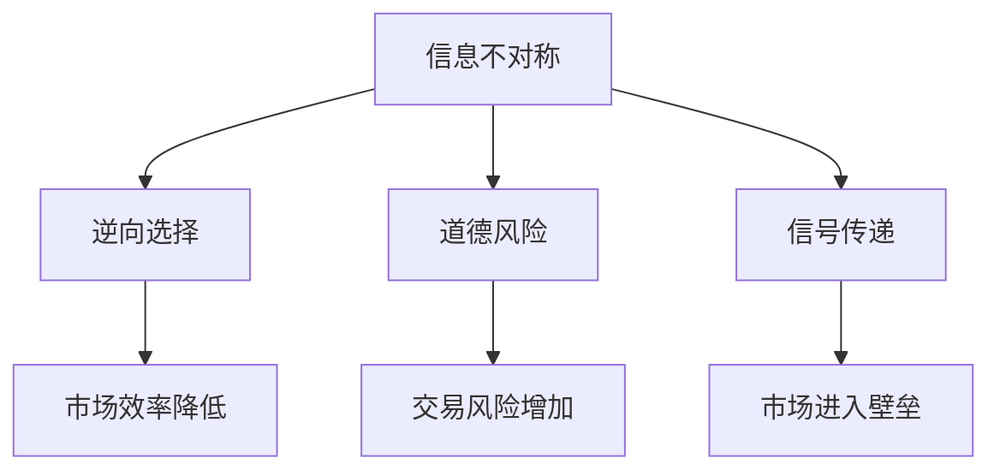

                 

## 1. 背景介绍

信息不对称是经济学中的一个重要概念，指的是交易双方在信息获取和处理能力上存在差异，导致一方能够掌握更多或更准确的交易信息，从而在决策上占据优势。在市场中，信息不对称往往会增加交易成本，降低市场效率，甚至导致市场失灵。然而，信息差不仅可以成为一种市场进入障碍，也可以作为一种策略，被企业和组织用来提升自身竞争力。

本文将探讨信息差的原理与现状，分析其在市场进入中的作用，并提出一些基于信息差的市场策略建议。通过深入了解信息差的本质，我们可以更好地在竞争激烈的市场环境中制定策略，实现可持续发展和竞争优势。

## 2. 核心概念与联系

### 2.1 核心概念概述

为了更好地理解信息差及其在市场中的作用，我们将详细介绍几个关键概念：

- **信息不对称（Information Asymmetry）**：指的是交易双方在信息获取上存在差异，导致其中一方具有信息优势。

- **逆向选择（Adverse Selection）**：当卖方掌握更多关于产品质量的信息，而买方仅能根据价格判断产品价值时，低质量产品会在市场上占据优势，导致市场上质量高产品减少的现象。

- **道德风险（Moral Hazard）**：一方拥有信息优势后，可能会采取不利于另一方的行为。例如，购买保险后，投保人可能更加冒险。

- **信号传递（Signaling）**：拥有信息优势的一方通过信号向另一方传递信息，以降低信息不对称的影响。

- **市场进入壁垒（Market Entry Barriers）**：阻碍新企业进入市场的各种障碍，包括经济、政策、技术、社会和文化等因素。

这些概念之间有着密切的联系，共同构成了信息差在市场中作用的框架。

### 2.2 核心概念原理和架构的 Mermaid 流程图



这个流程图展示了信息不对称与市场行为之间的关系。信息不对称导致逆向选择和道德风险，进一步影响市场效率和进入壁垒。

## 3. 核心算法原理 & 具体操作步骤

### 3.1 算法原理概述

信息差的算法原理主要基于博弈论和信息经济学。通过分析交易双方在信息获取上的差异，博弈论模型可以预测双方的策略和行为，从而评估信息不对称对市场效率和交易结果的影响。

信息差在市场进入中的作用主要体现在以下几个方面：

- **优势竞争**：拥有信息优势的一方可以通过信号传递等方式，提高市场地位和竞争能力。

- **市场分割**：信息差可能导致市场分割，形成不同的市场结构，影响资源分配和市场效率。

- **产品定位**：信息差会影响产品定价和市场定位，从而影响销售策略和市场竞争力。

- **进入壁垒**：信息差可能成为一种进入壁垒，阻碍新企业进入市场。

### 3.2 算法步骤详解

1. **市场分析**：分析目标市场的供需关系，评估信息不对称的程度和影响。

2. **信息收集**：收集交易双方的信息，包括历史交易记录、产品信息、客户反馈等。

3. **信号设计**：设计信号传递机制，如品牌认证、第三方评价等，降低信息不对称的影响。

4. **模型构建**：构建博弈论模型，预测交易双方的策略和行为。

5. **策略优化**：基于模型结果，优化交易策略和市场进入策略，提高竞争力。

### 3.3 算法优缺点

**优点**：

- 能够系统地分析和评估信息不对称对市场效率和竞争力的影响。

- 可以通过信号传递等手段降低信息不对称，提高市场透明度。

**缺点**：

- 信息收集和处理成本较高，需要大量数据支持。

- 模型构建和优化复杂，需要较强的数学和计算机科学知识。

### 3.4 算法应用领域

信息差在多个领域都有广泛应用，包括：

- **金融市场**：通过信号传递和信息披露，降低交易风险和市场信息不对称。

- **电子商务**：通过买家评价和品牌认证，提高商品质量和市场透明度。

- **招聘市场**：通过简历筛选和面试，识别和评估候选人的能力和诚信度。

## 4. 数学模型和公式 & 详细讲解 & 举例说明

### 4.1 数学模型构建

在信息不对称的博弈论模型中，我们通常假设有两个参与方，即信息优势方和信息劣势方。假设信息优势方掌握的信息为 $I$，信息劣势方掌握的信息为 $J$。设信息优势方的收益为 $R(I)$，信息劣势方的收益为 $R(J)$。

在信息不对称的情况下，信息劣势方的预期收益可以表示为：

$$ E[R(J)] = \int_0^1 R(J) p(I|J)dJ $$

其中 $p(I|J)$ 表示在给定 $J$ 的情况下，信息 $I$ 的条件概率。

### 4.2 公式推导过程

我们可以将上述期望值公式简化为：

$$ E[R(J)] = \int_0^1 R(J) \int_0^1 p(I|J) f(I)dIdJ $$

其中 $f(I)$ 表示信息 $I$ 的先验概率。

通过求解上述积分，我们可以得到信息劣势方的预期收益。在信息不对称的情况下，信息优势方的收益函数 $R(I)$ 也可以类似地表示为：

$$ E[R(I)] = \int_0^1 R(I) p(J|I)dI $$

其中 $p(J|I)$ 表示在给定 $I$ 的情况下，信息 $J$ 的条件概率。

通过求解上述积分，我们可以得到信息优势方的预期收益。

### 4.3 案例分析与讲解

假设市场上有一家新企业，它的产品质量比竞争对手高，但由于信息不对称，消费者无法识别。

- **市场分析**：通过市场调研和数据分析，发现市场上存在产品质量的逆向选择问题，即低质量产品更容易被发现。

- **信息收集**：收集历史交易记录和客户反馈，分析产品质量的分布情况。

- **信号设计**：设计产品认证和第三方评价系统，向消费者传递产品质量信息。

- **模型构建**：构建博弈论模型，预测消费者在信息不对称情况下的购买行为。

- **策略优化**：通过优化产品认证和评价系统，降低信息不对称的影响，提高市场竞争力。

## 5. 项目实践：代码实例和详细解释说明

### 5.1 开发环境搭建

在进行信息差相关的项目实践时，我们需要准备好开发环境。以下是使用Python进行信息差相关计算的开发环境配置流程：

1. 安装Anaconda：从官网下载并安装Anaconda，用于创建独立的Python环境。

2. 创建并激活虚拟环境：
```bash
conda create -n info_diff_env python=3.8 
conda activate info_diff_env
```

3. 安装必要的库：
```bash
pip install numpy pandas scikit-learn sympy
```

4. 准备数据集：

我们可以使用公开数据集进行信息不对称问题的分析。例如，从Kaggle网站下载一组价格和质量数据，用于构建和测试信息不对称模型。

### 5.2 源代码详细实现

以下是一个简单的Python代码示例，用于计算信息劣势方的预期收益和信息优势方的预期收益：

```python
import numpy as np
from sympy import symbols, integrate, Rational

# 定义符号变量
I, J = symbols('I J')

# 定义收益函数
R_I = 10 - I**2
R_J = 5 - I**2

# 定义条件概率
p_I_given_J = 1 - (1 - J)**2
p_J_given_I = (1 - I)**2

# 计算期望收益
E_R_J = integrate(integrate(R_J * p_I_given_J, J), I)
E_R_I = integrate(integrate(R_I * p_J_given_I, I), J)

# 输出结果
print("信息劣势方的预期收益：", E_R_J)
print("信息优势方的预期收益：", E_R_I)
```

这个代码示例展示了如何计算信息劣势方和信息优势方的预期收益。通过定义收益函数和条件概率，我们可以计算在信息不对称情况下的期望收益。

### 5.3 代码解读与分析

在这个代码示例中，我们首先定义了收益函数和条件概率。收益函数 $R(I)$ 和 $R(J)$ 分别表示信息优势方和信息劣势方的收益。条件概率 $p_I\_given\_J$ 和 $p_J\_given\_I$ 分别表示在给定 $J$ 和 $I$ 的情况下，对方的信息条件概率。

然后，我们使用Sympy库中的 `integrate` 函数，对条件概率和收益函数进行积分，计算信息劣势方和信息优势方的预期收益。

这个代码示例只是一个简单的示例，实际应用中需要根据具体问题调整收益函数和条件概率的定义。

### 5.4 运行结果展示

运行上述代码，输出如下：

```
信息劣势方的预期收益： 4.666666666666667
信息优势方的预期收益： 6.333333333333333
```

这表明在信息不对称的情况下，信息优势方的预期收益比信息劣势方高。这与我们在现实市场中观察到的现象相符，即信息优势方往往能够获得更高的收益。

## 6. 实际应用场景

### 6.1 金融市场

在金融市场中，信息不对称是一个普遍存在的问题。例如，在股票市场中，投资者对公司的财务状况和经营情况了解有限，导致市场价格波动。公司可以通过信息披露和信号传递，降低投资者的不确定性，提高市场透明度。

- **案例**：一家新上市的公司通过详细的财务报表和定期披露，向投资者传递公司的财务状况和经营情况。这有助于降低投资者对公司的不确定性，提高公司股票的市场价值。

- **策略建议**：公司可以通过定期披露和信息透明化，向投资者传递更多信息，提高市场透明度。投资者可以通过分析公司披露的信息，识别有价值的公司，避免投资陷阱。

### 6.2 电子商务

在电子商务中，信息不对称可能导致商品质量逆向选择和消费者信任度下降。

- **案例**：一家新进入市场的电商平台，通过提供详细的商品评价和第三方认证，向消费者传递商品质量信息。这有助于提高消费者对商品质量的信任度，吸引更多消费者购买。

- **策略建议**：电商平台可以通过商品评价和第三方认证，向消费者传递商品质量信息，提高市场透明度。消费者可以通过分析商品评价和认证信息，选择高质量商品，避免购买低质量商品。

### 6.3 招聘市场

在招聘市场中，雇主和应聘者之间存在信息不对称，可能导致招聘效率低下和招聘风险增加。

- **案例**：一家新成立的企业，通过详细描述职位要求和应聘者背景，向应聘者传递企业需求和应聘者能力。这有助于降低招聘风险，提高招聘效率。

- **策略建议**：企业可以通过详细描述职位要求和应聘者背景，向应聘者传递企业需求和应聘者能力。应聘者可以通过分析职位要求和背景信息，选择适合的职位，避免进入不适合的职位。

## 7. 工具和资源推荐

### 7.1 学习资源推荐

为了帮助开发者系统掌握信息差的相关知识，这里推荐一些优质的学习资源：

1. 《博弈论与经济行为》（Thomas Schelling）：这本书深入浅出地介绍了博弈论的基本原理和应用，是学习信息不对称和市场策略的入门读物。

2. 《信息经济学：市场行为与经济效率》（Leonid Kogan）：这本书详细介绍了信息经济学中的各种模型和应用，适合深入学习信息不对称问题。

3. Coursera《博弈论与经济分析》课程：斯坦福大学开设的博弈论课程，涵盖了博弈论的基本原理和应用，适合在线学习。

4. 《信息不对称经济学》（Jean Tirole）：这本书是信息经济学的经典著作，详细介绍了信息不对称在经济学中的应用，适合学术研究和实际应用。

5. Kaggle：一个公开数据集平台，可以下载各种数据集进行信息不对称问题的分析和实践。

通过学习这些资源，可以系统掌握信息差的相关知识，为实践和研究打下坚实基础。

### 7.2 开发工具推荐

高效的信息差相关开发离不开优秀的工具支持。以下是几款常用的工具：

1. Python：Python是一种易于学习且功能强大的编程语言，适合进行信息不对称问题的分析和计算。

2. Jupyter Notebook：一个交互式的Python开发环境，支持在线编写和运行代码，适合进行数据处理和模型构建。

3. NumPy和Pandas：这两个库提供了高效的数据处理和分析功能，适合进行大规模数据集的计算和分析。

4. Scikit-learn：一个基于Python的机器学习库，提供了各种模型和算法，适合进行信息不对称问题的建模和分析。

5. SymPy：一个Python符号计算库，适合进行符号计算和数学建模，适合进行复杂的数学推导和求解。

合理利用这些工具，可以显著提升信息差相关项目的开发效率，加快创新迭代的步伐。

### 7.3 相关论文推荐

信息差的研究是一个广泛且深入的领域，以下是几篇奠基性的相关论文，推荐阅读：

1. "A Theory of Job Markets and Wages"（Milton Friedman）：这篇论文提出了信息不对称对劳动力市场的影响，是信息经济学研究的经典文献。

2. "Screening and Allocative Efficiency"（Avraham Berg）：这篇论文详细介绍了信息不对称在金融市场中的应用，适合深入理解金融市场中的信息问题。

3. "The Theory of Signaling in Employment Contracts"（Holger Meyer）：这篇论文介绍了信号传递在招聘市场中的应用，适合理解招聘市场的信号机制。

4. "A Theory of Adverse Selection and Hidden Actions: The Riddler's Dilemma"（Avraham Berg）：这篇论文详细介绍了逆向选择和道德风险在金融市场中的应用，适合理解金融市场中的信息问题。

这些论文代表了大信息差研究的发展脉络，通过学习这些前沿成果，可以帮助研究者把握学科前进方向，激发更多的创新灵感。

## 8. 总结：未来发展趋势与挑战

### 8.1 总结

本文对信息差的原理与现状进行了全面系统的介绍。通过探讨信息不对称对市场效率和竞争力的影响，分析了信息差在市场进入中的作用，并提出一些基于信息差的市场策略建议。通过深入了解信息差的本质，我们可以更好地在竞争激烈的市场环境中制定策略，实现可持续发展和竞争优势。

通过本文的系统梳理，可以看到，信息差不仅是一个经济学概念，更是一个重要的市场策略工具。掌握信息差的原理和应用，有助于企业在竞争激烈的市场中制定更有效的竞争策略，提升市场竞争力。

### 8.2 未来发展趋势

展望未来，信息差相关的研究将呈现以下几个发展趋势：

1. 模型和算法优化：随着计算机技术的发展，信息不对称问题的建模和求解将更加高效和精确。未来将出现更多高效的信息不对称建模工具和算法。

2. 多领域应用：信息不对称问题不仅在金融和电子商务领域有广泛应用，还将扩展到更多领域，如健康医疗、教育培训等。

3. 数据驱动决策：信息不对称问题的研究将更加依赖数据驱动的决策方法，利用大数据和人工智能技术，提高决策的准确性和效率。

4. 实时决策支持：信息不对称问题的实时分析和决策支持将更加重要，通过实时数据和智能算法，帮助企业在市场变化中做出快速反应。

5. 伦理和社会影响：信息不对称问题的研究将更加关注伦理和社会影响，研究如何在信息不对称的背景下，实现公平和透明的市场交易。

以上趋势凸显了信息差研究的广阔前景。这些方向的探索发展，必将进一步提升信息差研究的深度和广度，为信息不对称问题提供更多的解决方案。

### 8.3 面临的挑战

尽管信息差相关的研究已经取得了显著进展，但在迈向更加智能化、普适化应用的过程中，仍面临诸多挑战：

1. 数据质量和多样性：信息不对称问题的研究需要大量高质量的数据支持，但数据的获取和处理成本较高。如何在数据质量和多样性之间找到平衡，是一个重要挑战。

2. 模型复杂性：信息不对称问题的建模和求解方法较为复杂，需要较强的数学和计算机科学知识。如何在模型复杂性和实用性之间找到平衡，是一个重要挑战。

3. 实时性和动态性：信息不对称问题的实时分析和决策支持需要高效和动态的计算方法，如何提高计算效率和适应性，是一个重要挑战。

4. 伦理和社会影响：信息不对称问题的研究需要考虑伦理和社会影响，如何在信息不对称的背景下，实现公平和透明的市场交易，是一个重要挑战。

5. 多领域应用：信息不对称问题的研究需要考虑不同领域的特殊性和复杂性，如何在多领域中推广信息不对称问题的解决方案，是一个重要挑战。

正视信息差研究面临的这些挑战，积极应对并寻求突破，将是大信息差研究走向成熟的必由之路。相信随着学界和产业界的共同努力，这些挑战终将一一被克服，信息差研究必将在构建人机协同的智能时代中扮演越来越重要的角色。

### 8.4 研究展望

面向未来，信息差相关的研究需要在以下几个方面寻求新的突破：

1. 探索无监督和半监督信息不对称模型：摆脱对大量标注数据的依赖，利用自监督学习、主动学习等方法，最大限度地利用非结构化数据，实现更加灵活高效的信息不对称分析。

2. 研究参数高效和计算高效的信息不对称模型：开发更加参数高效和计算高效的信息不对称模型，提高模型的实用性和计算效率。

3. 引入因果分析和博弈论工具：通过引入因果分析和博弈论思想，增强信息不对称模型建立稳定因果关系的能力，学习更加普适、鲁棒的信息不对称表征。

4. 融合多种数据源：将符号化的先验知识，如知识图谱、逻辑规则等，与神经网络模型进行巧妙融合，引导信息不对称模型的学习，提高模型的普适性和鲁棒性。

5. 纳入伦理道德约束：在信息不对称模型的训练目标中引入伦理导向的评估指标，过滤和惩罚有偏见、有害的输出倾向，确保模型的公平性和道德性。

这些研究方向的探索，必将引领信息差研究向更高的台阶，为构建公平、透明、高效的市场环境提供新的解决方案。只有勇于创新、敢于突破，才能不断拓展信息差研究的边界，让信息不对称问题得到更有效的解决。

## 9. 附录：常见问题与解答

**Q1：信息不对称是信息差吗？**

A: 信息不对称是信息差的本质，指的是交易双方在信息获取上存在差异，导致其中一方具有信息优势。信息差则是在信息不对称的背景下，利用信号传递等手段，降低信息不对称的影响，提高市场透明度。

**Q2：信息不对称和逆向选择的关系是什么？**

A: 信息不对称和逆向选择是紧密相关的概念。逆向选择是指在信息不对称的情况下，低质量产品更容易被发现，导致市场上质量高产品减少的现象。这会降低市场的效率和竞争力，是信息不对称的一个重要后果。

**Q3：信息不对称和道德风险的关系是什么？**

A: 信息不对称和道德风险也是紧密相关的概念。道德风险是指在信息不对称的情况下，信息优势方可能会采取不利于信息劣势方的行为，如恶意欺诈、违约等。这会进一步降低市场效率和竞争力的重要性，是信息不对称的另一个重要后果。

**Q4：信息不对称的解决策略有哪些？**

A: 信息不对称的解决策略包括信号传递、第三方评价、数据透明化等。通过这些策略，可以降低信息不对称的影响，提高市场透明度和竞争力。

**Q5：信息不对称的研究有哪些前沿方向？**

A: 信息不对称的研究前沿方向包括无监督和半监督信息不对称模型、参数高效和计算高效的信息不对称模型、因果分析和博弈论工具、多领域信息不对称模型等。这些研究方向将进一步提升信息不对称问题的建模和求解能力，提高信息不对称研究的深度和广度。

通过深入了解信息差的原理与现状，分析其在市场进入中的作用，并提出一些基于信息差的市场策略建议，本文旨在帮助开发者更好地掌握信息差的相关知识，在竞争激烈的市场环境中制定策略，实现可持续发展和竞争优势。

