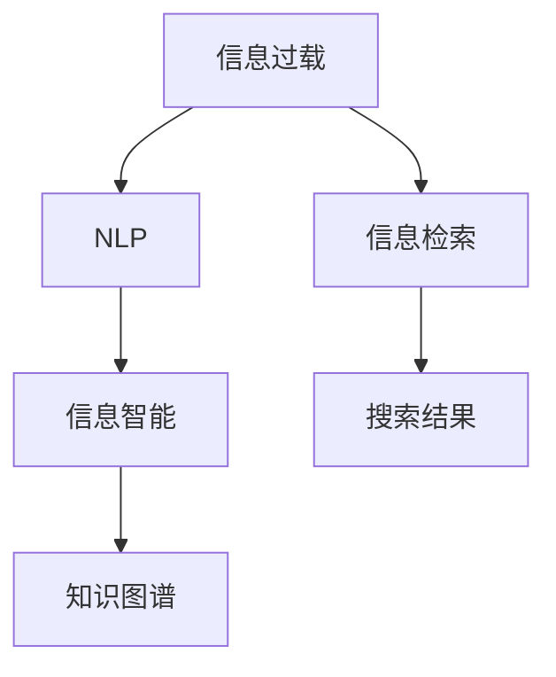

                 

# 信息过载与信息搜索技术：在庞大的信息海洋中找到你需要的信息

> 关键词：信息过载,信息搜索技术,自然语言处理,NLP,信息检索,机器学习,深度学习,人工智能,信息智能,知识图谱

## 1. 背景介绍

### 1.1 问题由来
随着互联网和数字化技术的飞速发展，人们已经进入了一个前所未有的信息爆炸时代。根据国际数据公司(IDC)的预测，全球数字数据量每年以40%的速度增长，预计到2025年，全球数据总量将达到175ZB，相当于每年生成超过40泽字节的数据。面对海量的数据，如何从中找到有价值的信息，成为了现代社会的一个重要课题。

信息过载不仅对企业和机构构成了威胁，也对个人的信息获取能力提出了巨大挑战。据统计，全球有超过70%的信息是通过搜索引擎等工具获取的。然而，搜索引擎的效果并不总是令人满意的，尤其是在用户进行长尾查询或面对复杂语义问题时，搜索结果往往不尽人意。因此，如何提升信息搜索的质量和效率，已成为推动人工智能领域发展的核心问题之一。

### 1.2 问题核心关键点
信息搜索技术的发展主要围绕以下几个关键点进行：
- 提升搜索结果的相关性和准确性：在处理海量数据时，如何提高搜索结果的匹配度和精确度？
- 增强搜索系统的智能性：如何利用自然语言处理(NLP)等技术，提高搜索系统的理解和推理能力？
- 提高搜索系统的效率和响应速度：如何在处理大规模数据时，保持快速响应和高效检索？
- 增强搜索系统的个性化和定制化：如何根据用户的行为和偏好，提供更加个性化和贴合用户需求的搜索结果？
- 实现跨语言和跨文化的搜索：如何打破语言和文化的限制，进行全球范围内的信息检索？

## 2. 核心概念与联系

### 2.1 核心概念概述

为更好地理解信息搜索技术，本节将介绍几个关键概念及其相互之间的关系：

- **信息过载**：指信息量超出了人们的处理能力，导致信息获取困难，进而影响决策和行为的一种现象。
- **信息检索**：指利用计算机技术，从大量数据中快速、准确地查找出与用户查询相关的信息的过程。
- **自然语言处理(NLP)**：指利用计算机技术处理、理解、生成自然语言的能力，包括文本分类、命名实体识别、语义理解等。
- **信息智能**：指将机器学习、深度学习等技术应用于信息检索和处理，提升信息系统的智能水平。
- **知识图谱**：指用图谱化的方式表示知识结构，将实体、属性和关系等知识元素有机地连接起来，便于信息检索和推理。

这些概念之间的逻辑关系可以通过以下Mermaid流程图来展示：



这个流程图展示信息过载、信息检索、NLP、信息智能和知识图谱之间的核心关系：

1. 信息过载是推动信息检索技术发展的核心问题。
2. NLP是信息检索的基础，用于处理文本数据，进行实体识别和语义理解。
3. 信息智能利用机器学习等技术，提升信息检索的准确性和智能性。
4. 知识图谱通过将知识结构化，为信息检索提供更高效的知识表示和推理能力。
5. 信息检索技术的最终目的是生成搜索结果，服务于用户的查询需求。

## 3. 核心算法原理 & 具体操作步骤
### 3.1 算法原理概述

信息搜索技术的主要目标是提高搜索结果的相关性和准确性，同时提升系统的响应速度和智能化水平。以下是几个核心的算法原理：

- **TF-IDF算法**：用于衡量一个单词在文档中的重要性和频率，从而提升搜索结果的相关性。
- **倒排索引**：用于快速定位和检索文档中的单词，提高搜索效率。
- **机器学习与深度学习**：用于增强信息搜索系统的智能性，通过学习用户行为和数据特征，进行个性化推荐和智能排序。
- **自然语言处理(NLP)**：用于处理和理解用户查询，进行语义匹配和实体识别，从而提高搜索的精准度。
- **知识图谱**：用于存储和表示知识结构，支持基于实体和关系的信息检索。

### 3.2 算法步骤详解

信息搜索技术的操作流程一般包括以下几个关键步骤：

**Step 1: 数据预处理**
- 收集和整理相关的数据，清洗噪声和错误。
- 对文本进行分词、词性标注、命名实体识别等处理。
- 构建倒排索引，快速定位单词在文档中的位置。

**Step 2: 构建查询解析树**
- 利用NLP技术，对用户查询进行语义分析和实体识别。
- 将查询转化为逻辑表达式，构建查询解析树。

**Step 3: 特征提取**
- 根据TF-IDF算法，计算单词在文档中的重要性。
- 提取文档特征，如关键词、句子长度、文档来源等。
- 使用深度学习模型，如BERT、GPT等，进行语义匹配和理解。

**Step 4: 信息检索与排序**
- 利用倒排索引快速定位包含查询单词的文档。
- 使用机器学习模型，如逻辑回归、支持向量机等，进行文档排序和推荐。
- 结合知识图谱，进行基于实体的信息检索和推理。

**Step 5: 结果展示**
- 将排序后的文档结果展示给用户，通常包括摘要、链接等信息。
- 提供相关性评分和推荐理由，帮助用户评估搜索结果。

### 3.3 算法优缺点

信息搜索技术具有以下优点：
1. 高效性：通过倒排索引和机器学习算法，可以快速定位和排序结果，满足用户的即时查询需求。
2. 准确性：利用TF-IDF和NLP技术，可以提升搜索结果的相关性和语义匹配度。
3. 智能化：通过深度学习模型和知识图谱，可以提高搜索系统的智能水平，进行个性化推荐和跨领域检索。
4. 可扩展性：信息搜索技术可以处理大规模数据，适用于各种应用场景。

同时，该技术也存在以下局限性：
1. 数据依赖性高：搜索结果的质量很大程度上依赖于数据质量和标注数据的数量。
2. 处理复杂查询困难：对于长尾查询、复杂语义问题，搜索结果的相关性难以保证。
3. 处理噪声和噪音能力强：对于噪声较多的数据，处理效率和准确性会受到影响。
4. 模型复杂度高：深度学习模型和知识图谱的训练复杂度较高，需要大量的计算资源和时间。
5. 结果多样性问题：对于多义词和歧义查询，搜索结果的解释性和多样性需要进一步改进。

尽管存在这些局限性，但就目前而言，信息搜索技术仍是处理信息过载问题的有效手段。未来相关研究的重点在于如何进一步提升技术性能，降低对数据和计算的依赖，同时提高结果的多样性和解释性。

### 3.4 算法应用领域

信息搜索技术在多个领域中得到了广泛的应用，例如：

- **电子商务**：通过搜索引擎和推荐系统，为用户提供商品搜索、推荐和个性化购物体验。
- **社交媒体**：利用搜索引擎和话题标签，帮助用户发现和分享有趣的内容。
- **医疗健康**：通过搜索引擎和知识图谱，提供疾病查询、症状分析和医疗知识检索。
- **教育培训**：利用搜索引擎和知识图谱，帮助用户查找学习资源和答疑解惑。
- **科学研究**：通过搜索引擎和数据库，查找相关文献和实验数据。
- **政府和企业**：利用搜索引擎和推荐系统，进行政策分析、市场调研和业务决策。

这些应用领域覆盖了经济、社会、文化、科技等多个方面，展示了信息搜索技术的广泛影响力。

## 4. 数学模型和公式 & 详细讲解 & 举例说明
### 4.1 数学模型构建

信息搜索技术的核心是构建高效的查询解析树和数据特征提取模型，以下介绍几个关键数学模型：

- **TF-IDF模型**：用于衡量单词在文档中的重要性。其数学公式如下：

  $$
  TFIDF(t,d,D) = TF(t,d) \times IDF(t,D)
  $$

  其中，$TF(t,d)$表示单词$t$在文档$d$中出现的频率，$IDF(t,D)$表示单词$t$在语料库$D$中的逆文档频率。

- **倒排索引**：用于快速定位单词在文档中的位置。其数学表示如下：

  $$
  InvertedIndex(w) = \{d_1, d_2, \ldots, d_n\}
  $$

  其中，$w$表示单词，$d_i$表示包含该单词的文档列表。

- **向量空间模型**：用于表示文档和查询的特征向量，提升匹配度。其数学公式如下：

  $$
  \mathbf{v}_d = (v_{d1}, v_{d2}, \ldots, v_{dn})
  $$

  其中，$v_{di}$表示文档$d$在单词$i$上的权重。

### 4.2 公式推导过程

以TF-IDF模型为例，进行数学推导。

假设语料库$D$中包含$m$个文档，每个文档中包含$n$个单词，用$\mathbf{D}$表示$m \times n$的文档-单词矩阵，其中$D_{ij}$表示单词$i$在文档$j$中的出现次数。

定义单词$i$在文档$d$中的频率$TF(i,d)$为：

$$
TF(i,d) = \frac{D_{id}}{n}
$$

定义单词$i$在语料库$D$中的逆文档频率$IDF(i,D)$为：

$$
IDF(i,D) = \log \frac{m}{|\{d \in D|i \in d\}|
$$

因此，单词$i$在文档$d$上的TF-IDF权重为：

$$
TFIDF(i,d,D) = TF(i,d) \times IDF(i,D)
$$

通过TF-IDF模型，可以得到每个单词在文档中的重要性权重，用于提升搜索结果的相关性。

### 4.3 案例分析与讲解

以百度的搜索引擎为例，分析其核心算法原理。

百度搜索引擎的核心算法包括以下几个部分：

1. **查询解析树**：利用NLP技术，对用户查询进行语义分析和实体识别。查询解析树展示了查询的逻辑结构和单词的关系。

2. **TF-IDF模型**：用于计算单词在文档中的重要性，并进行特征提取。

3. **倒排索引**：用于快速定位包含查询单词的文档。

4. **深度学习模型**：用于处理和理解查询，进行语义匹配和理解。

5. **个性化推荐**：利用用户行为和数据特征，进行个性化推荐和智能排序。

通过这些核心算法，百度搜索引擎能够快速、准确地检索用户查询相关的信息，并提供个性化的搜索结果。

## 5. 项目实践：代码实例和详细解释说明
### 5.1 开发环境搭建

在进行信息搜索技术开发前，我们需要准备好开发环境。以下是使用Python进行信息检索系统开发的典型环境配置流程：

1. 安装Anaconda：从官网下载并安装Anaconda，用于创建独立的Python环境。

2. 创建并激活虚拟环境：
```bash
conda create -n info-env python=3.8 
conda activate info-env
```

3. 安装必要的Python包：
```bash
conda install scikit-learn scipy matplotlib pandas joblib tqdm gunicorn
```

4. 安装爬虫工具：
```bash
pip install requests beautifulsoup4
```

5. 安装机器学习库：
```bash
pip install scikit-learn numpy
```

6. 安装深度学习库：
```bash
pip install torch torchvision
```

7. 安装搜索引擎和索引库：
```bash
pip install elasticsearch
```

完成上述步骤后，即可在`info-env`环境中开始信息检索系统开发。

### 5.2 源代码详细实现

以下是一个基于TF-IDF和倒排索引的简单信息检索系统的代码实现。

```python
import json
import os
from collections import defaultdict
from sklearn.feature_extraction.text import TfidfVectorizer
from sklearn.metrics.pairwise import linear_kernel

# 加载数据集
def load_data(path):
    data = []
    with open(path, 'r', encoding='utf-8') as f:
        for line in f:
            doc = json.loads(line)
            data.append(doc['content'])
    return data

# 构建倒排索引
def build_index(data):
    index = defaultdict(list)
    for doc in data:
        for word in doc.split():
            index[word].append(doc)
    return index

# 计算TF-IDF权重
def calculate_tfidf(data):
    vectorizer = TfidfVectorizer()
    tfidf_matrix = vectorizer.fit_transform(data)
    return vectorizer.vocabulary_

# 查询和排序
def search(query, index, tfidf_matrix):
    query_words = query.split()
    query_vector = vectorizer.transform([query]).toarray()
    scores = {}
    for word in query_words:
        if word in index:
            doc_index = index[word]
            doc_vectors = tfidf_matrix[doc_index]
            scores[word] = linear_kernel(query_vector, doc_vectors).tolist()
    return sorted(scores.items(), key=lambda x: x[1], reverse=True)
```

该代码实现了基于TF-IDF和倒排索引的简单信息检索系统。具体步骤如下：

1. 加载数据集，构建倒排索引。
2. 计算TF-IDF权重，构建特征向量。
3. 根据查询单词，计算查询向量与文档向量的匹配度。
4. 根据匹配度排序，返回匹配结果。

### 5.3 代码解读与分析

以上代码实现了一个基于TF-IDF和倒排索引的简单信息检索系统。以下对其关键代码进行详细解读：

**load_data函数**：
- 用于加载数据集，这里以JSON格式的数据为例。
- 读取JSON文件，提取文本内容并返回数据集。

**build_index函数**：
- 用于构建倒排索引，将每个单词出现的文档列表记录下来。
- 返回一个字典，键为单词，值为包含该单词的文档列表。

**calculate_tfidf函数**：
- 用于计算TF-IDF权重，构建特征向量。
- 使用`TfidfVectorizer`构建特征向量，并返回单词到特征向量的映射。

**search函数**：
- 用于根据查询单词，计算查询向量与文档向量的匹配度。
- 返回按照匹配度排序的文档列表。

**代码解读与分析**：
- 该代码实现了一个基于TF-IDF和倒排索引的简单信息检索系统。
- 通过计算TF-IDF权重，构建文档特征向量。
- 根据查询单词，计算查询向量与文档向量的匹配度，并根据匹配度排序返回结果。
- 这种简单的信息检索系统可以满足基本的搜索需求，但对于复杂的查询和语义匹配，需要进一步优化。

## 6. 实际应用场景
### 6.1 智能推荐系统

信息搜索技术可以广泛应用于智能推荐系统，帮助用户发现和推荐符合自己兴趣的商品或内容。智能推荐系统能够根据用户的历史行为、兴趣和偏好，推荐个性化的商品或内容，提升用户体验和转化率。

例如，亚马逊和淘宝等电商平台通过搜索引擎和推荐系统，为用户推荐符合其购物习惯的商品，从而提高销售额。通过深度学习模型和知识图谱，推荐系统能够更加精准地捕捉用户需求，提供个性化的购物体验。

### 6.2 医疗搜索系统

医疗搜索系统可以帮助医生和患者快速查找相关的医学资料和诊疗信息。通过搜索引擎和知识图谱，医疗搜索系统能够快速定位到特定的疾病、症状和治疗方案，提供精准的医疗信息。

例如，丁香园等医疗网站通过搜索引擎和知识图谱，提供医学文献、疾病百科和诊疗方案等，帮助医生和患者快速查找相关信息。通过NLP技术，医疗搜索系统能够理解复杂的查询需求，提供精准的搜索结果。

### 6.3 企业知识库

企业知识库通过信息搜索技术，帮助员工快速查找和使用内部文档、知识库、FAQ等资源。通过搜索引擎和知识图谱，企业知识库能够快速定位到相关知识，提升工作效率。

例如，谷歌文档和Microsoft OneDrive等知识管理平台，通过搜索引擎和知识图谱，提供文档、知识库、FAQ等资源，帮助员工快速查找和使用信息。通过NLP技术，知识库能够理解员工的查询需求，提供精准的知识检索。

### 6.4 未来应用展望

随着信息搜索技术的不断发展和应用，未来将在更多领域得到广泛应用，例如：

- **智能家居**：通过搜索引擎和知识图谱，智能家居系统能够快速查找和执行用户指令，提升生活便利性。
- **智能交通**：通过搜索引擎和知识图谱，智能交通系统能够提供实时交通信息和路线规划，提升出行效率。
- **智能金融**：通过搜索引擎和知识图谱，智能金融系统能够提供金融市场信息、股票行情和投资建议，帮助用户进行决策。
- **智能教育**：通过搜索引擎和知识图谱，智能教育系统能够提供学习资源、课程推荐和智能答疑，提升学习效率。
- **智能客服**：通过搜索引擎和知识图谱，智能客服系统能够快速定位问题，提供精准的解决方案，提升客户满意度。

这些应用场景展示了信息搜索技术的广阔前景，为各行各业带来新的价值和可能性。

## 7. 工具和资源推荐
### 7.1 学习资源推荐

为了帮助开发者系统掌握信息搜索技术，以下推荐一些优质的学习资源：

1. 《信息检索：原理与实现》：由Stanford大学Yaser Abu-Mostafa教授等编写，详细介绍了信息检索的基本原理和实现方法。
2. 《自然语言处理综论》：由斯坦福大学教授D Manning等编写，介绍了NLP技术的核心概念和应用方法。
3. 《深度学习与信息检索》：由清华大学张永志教授等编写，介绍了深度学习在信息检索中的应用。
4. 《搜索推荐系统》：由阿里巴巴技术专家编写，介绍了搜索和推荐系统的核心算法和技术。
5. 《知识图谱与语义网》：由清华大学陈博教授等编写，介绍了知识图谱的基本概念和应用方法。

通过对这些资源的学习，相信你一定能够全面掌握信息搜索技术的精髓，并用于解决实际的搜索问题。

### 7.2 开发工具推荐

以下是几款用于信息搜索系统开发的常用工具：

1. Elasticsearch：开源的搜索引擎和数据分析引擎，支持全文检索、分词、查询解析等核心功能。
2. Apache Solr：Apache基金会开发的搜索引擎，支持多种查询语言和插件扩展。
3. Apache Nutch：开源的网络爬虫和搜索引擎，支持大规模数据采集和索引。
4. TensorFlow：谷歌开源的深度学习框架，支持复杂模型的构建和训练。
5. PyTorch：Facebook开源的深度学习框架，支持动态计算图和高效的模型训练。
6. Scikit-learn：Python科学计算库，支持各种机器学习算法和数据处理。

合理利用这些工具，可以显著提升信息搜索系统的开发效率，加快创新迭代的步伐。

### 7.3 相关论文推荐

信息搜索技术的发展源于学界的持续研究。以下是几篇奠基性的相关论文，推荐阅读：

1. Salahuddin Mahmud：《信息检索：原理、技术与应用》：介绍了信息检索的基本原理和实现方法。
2. Christopher Manning & Hinrich Schütze：《信息检索：核心技术》：介绍了信息检索的核心技术和算法。
3. Andrew Y. Ng & John P. Orwell：《搜索引擎如何工作》：介绍了搜索引擎的核心算法和技术。
4. Zhang Yi et al.：《基于深度学习的检索技术》：介绍了深度学习在信息检索中的应用。
5. Qi Zhang et al.：《基于知识图谱的检索技术》：介绍了知识图谱在信息检索中的应用。

这些论文代表了大信息搜索技术的发展脉络。通过学习这些前沿成果，可以帮助研究者把握学科前进方向，激发更多的创新灵感。

## 8. 总结：未来发展趋势与挑战
### 8.1 总结

本文对信息搜索技术进行了全面系统的介绍。首先阐述了信息过载的问题由来，明确了信息检索技术的发展方向和应用价值。其次，从原理到实践，详细讲解了信息搜索技术的核心算法和操作步骤，给出了信息检索系统开发的完整代码实例。同时，本文还广泛探讨了信息搜索技术在智能推荐、医疗搜索、企业知识库等多个领域的应用前景，展示了信息搜索技术的广泛影响力。此外，本文精选了信息搜索技术的各类学习资源，力求为读者提供全方位的技术指引。

通过本文的系统梳理，可以看到，信息搜索技术在处理信息过载问题上具有重要价值，极大地提升了信息检索的效率和精准度。随着预训练语言模型和深度学习技术的发展，信息搜索系统的智能化水平将进一步提升，为各行各业带来新的价值和可能性。

### 8.2 未来发展趋势

展望未来，信息搜索技术将呈现以下几个发展趋势：

1. 深度学习与NLP融合：利用深度学习模型和NLP技术，提升信息检索的准确性和智能性。
2. 知识图谱与语义网：通过知识图谱和语义网，提升信息检索的推理能力和跨领域检索能力。
3. 多模态信息检索：利用多模态信息，如文本、图像、视频等，提升信息检索的多样性和全面性。
4. 个性化与自适应：通过个性化推荐和自适应学习，提升信息检索的精准度和用户体验。
5. 实时与动态：通过实时数据处理和动态更新，提升信息检索的实时性和时效性。
6. 跨语言与跨文化：通过跨语言和跨文化技术，提升全球范围内的信息检索能力。

这些趋势展示了信息搜索技术的广阔前景，预示着未来信息检索系统的智能化水平将进一步提升，为各行各业带来更多的价值和可能性。

### 8.3 面临的挑战

尽管信息搜索技术已经取得了瞩目成就，但在迈向更加智能化、普适化应用的过程中，它仍面临着诸多挑战：

1. 数据质量与标注成本：高质量的标注数据和数据集对信息检索的效果至关重要，但标注成本和数据质量问题常常制约其发展。
2. 复杂查询处理：对于复杂的查询和长尾查询，现有的信息检索系统仍难以处理。
3. 模型复杂性与计算资源：深度学习模型和知识图谱的训练和推理复杂度较高，需要大量的计算资源和时间。
4. 结果解释性与多样性：现有信息检索系统的结果解释性不足，缺乏多样性。
5. 安全与隐私：信息检索系统可能涉及用户隐私和敏感信息，如何确保数据安全和隐私保护是一个重要问题。

尽管存在这些挑战，但通过持续的技术创新和优化，这些挑战终将得到解决，信息搜索技术必将在更多领域得到广泛应用。

### 8.4 研究展望

面对信息搜索技术面临的种种挑战，未来的研究需要在以下几个方面寻求新的突破：

1. 利用深度学习和NLP技术，提升信息检索的准确性和智能性。
2. 探索知识图谱和语义网，提升信息检索的推理能力和跨领域检索能力。
3. 引入多模态信息，提升信息检索的多样性和全面性。
4. 研究个性化推荐和自适应学习，提升信息检索的精准度和用户体验。
5. 利用实时数据处理和动态更新，提升信息检索的实时性和时效性。
6. 引入跨语言和跨文化技术，提升全球范围内的信息检索能力。
7. 探索安全与隐私保护技术，确保数据安全和隐私保护。

这些研究方向的探索，必将引领信息搜索技术迈向更高的台阶，为构建安全、可靠、可解释、可控的智能系统铺平道路。面向未来，信息搜索技术还需要与其他人工智能技术进行更深入的融合，如知识表示、因果推理、强化学习等，多路径协同发力，共同推动信息检索系统的进步。只有勇于创新、敢于突破，才能不断拓展信息检索技术的边界，让智能技术更好地造福人类社会。

## 9. 附录：常见问题与解答

**Q1：什么是TF-IDF模型？**

A: TF-IDF模型是信息检索中常用的一种文本特征提取方法，用于衡量单词在文档中的重要性和频率。其数学公式为：

$$
TFIDF(t,d,D) = TF(t,d) \times IDF(t,D)
$$

其中，$TF(t,d)$表示单词$t$在文档$d$中出现的频率，$IDF(t,D)$表示单词$t$在语料库$D$中的逆文档频率。

**Q2：什么是倒排索引？**

A: 倒排索引是一种数据结构，用于快速定位包含某个单词的文档列表。其数学表示为：

$$
InvertedIndex(w) = \{d_1, d_2, \ldots, d_n\}
$$

其中，$w$表示单词，$d_i$表示包含该单词的文档列表。

**Q3：如何提升信息检索系统的准确性和智能性？**

A: 提升信息检索系统的准确性和智能性，可以从以下几个方面入手：
1. 利用深度学习模型和NLP技术，提升语义匹配和实体识别的精准度。
2. 引入知识图谱和语义网，增强信息的推理能力和跨领域检索能力。
3. 利用多模态信息，提升信息检索的多样性和全面性。
4. 研究个性化推荐和自适应学习，提升信息检索的精准度和用户体验。

**Q4：信息检索系统如何处理复杂查询？**

A: 信息检索系统处理复杂查询，可以采用以下策略：
1. 利用NLP技术，对查询进行语义分析和实体识别，构建查询解析树。
2. 利用深度学习模型，进行查询向量的生成和匹配。
3. 引入知识图谱，进行基于实体的信息检索和推理。
4. 利用多模态信息，提升信息检索的多样性和全面性。

这些策略可以提升信息检索系统处理复杂查询的能力，提升用户满意度。

**Q5：信息检索系统如何保护用户隐私？**

A: 信息检索系统保护用户隐私，可以采用以下措施：
1. 对用户数据进行匿名化处理，避免用户隐私泄露。
2. 限制数据访问权限，确保数据安全和隐私保护。
3. 引入隐私保护算法，如差分隐私、同态加密等，保障用户隐私。
4. 对用户行为数据进行脱敏处理，减少隐私风险。

这些措施可以确保用户数据的安全和隐私保护，提升信息检索系统的可信度。

---

作者：禅与计算机程序设计艺术 / Zen and the Art of Computer Programming

