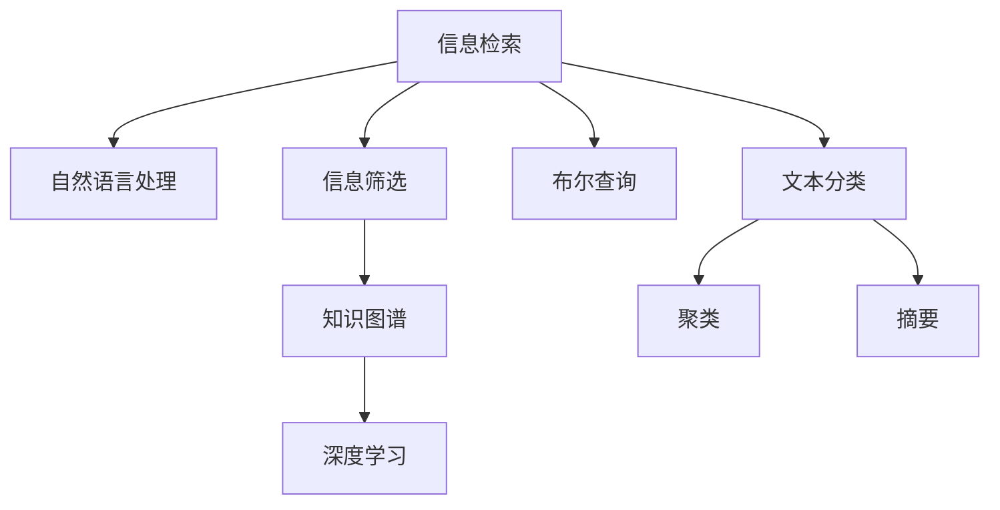

                 

# 信息过载与信息筛选：如何在信息洪流中找到有价值的信息

## 1. 背景介绍

### 1.1 问题由来
当今社会，信息爆炸、数据激增。在互联网、移动通信、社交媒体等平台，每天产生的海量信息令人目不暇接。面对如此繁杂的信息洪流，如何从中筛选出有价值的信息，是每一个信息工作者、技术开发者和普通用户都面临的挑战。

现代信息技术发展迅猛，信息量呈现爆炸性增长。人们每天需要处理大量的数据，而真正有价值、能带来实益的信息占比微乎其微。信息过载（Information Overload）现象普遍存在，信息查找和筛选成为重中之重。在此背景下，如何高效、准确地从海量信息中提取有价值内容，提升信息检索和分析效率，成为了当前研究的热点问题。

### 1.2 问题核心关键点
在信息过载环境中，提升信息检索和筛选效率的核心在于以下几点：
1. **智能算法**：通过深度学习等智能算法，提高信息检索和筛选的准确率。
2. **多模态信息融合**：结合文本、图像、视频等多模态数据，提供更全面的信息维度。
3. **知识图谱与语义网络**：利用知识图谱和语义网络技术，提升信息的相关性和可解释性。
4. **自然语言处理（NLP）**：通过NLP技术，理解和分析文本内容，实现更精准的信息筛选。
5. **个性化推荐**：根据用户兴趣和行为，提供个性化信息推荐服务。

### 1.3 问题研究意义
面对信息过载，提升信息检索和筛选效率具有重要意义：

1. **节省时间和成本**：快速找到所需信息，减少查找时间，提高工作效率。
2. **优化决策过程**：基于更准确的信息决策，提升决策质量。
3. **增强信息可访问性**：为更多用户提供优质信息，提升信息利用率。
4. **促进知识发现**：通过信息筛选，发现新的知识、趋势和模式。
5. **改善用户体验**：提供个性化信息服务，提升用户满意度。

## 2. 核心概念与联系

### 2.1 核心概念概述

为了更好地理解如何从信息洪流中筛选有价值信息，本节将介绍几个关键概念：

- **信息检索**：指从大量信息中快速检索出满足用户需求的信息。传统方法如布尔查询，现代方法如深度学习、自然语言处理等。
- **信息筛选**：指对检索到的信息进行进一步的分析和筛选，剔除无关或低质量信息，保留有用信息。方法包括文本分类、聚类、摘要等。
- **自然语言处理（NLP）**：指对自然语言文本进行处理和分析，提取文本中的实体、关系、情感等信息。
- **深度学习（DL）**：通过多层神经网络结构，自动学习并提取数据的高级特征。
- **知识图谱**：基于图结构的知识库，用于表示实体、属性和关系，提供知识推理和查询功能。

这些概念之间的逻辑关系可以通过以下Mermaid流程图来展示：



这个流程图展示了一系列的子概念及其相互关系：

1. 信息检索是信息筛选的前提，可以基于文本分类、布尔查询等传统方法，也可结合自然语言处理和深度学习。
2. 信息筛选基于检索结果，通过文本分类、聚类、摘要等技术，实现信息的进一步精炼和分析。
3. 深度学习用于从大量数据中提取高级特征，自然语言处理用于理解和分析文本内容。
4. 知识图谱提供结构化的知识库，用于语义推理和信息关联。

## 3. 核心算法原理 & 具体操作步骤
### 3.1 算法原理概述

信息筛选的核心算法通常结合了深度学习、自然语言处理和知识图谱等技术，通过多个步骤对检索到的信息进行多层次的筛选和分析。

一般而言，信息筛选可以分为以下几个步骤：
1. **数据预处理**：对原始数据进行清洗、归一化、去噪等预处理，便于后续处理。
2. **特征提取**：利用深度学习模型对文本、图像、视频等多模态数据进行特征提取。
3. **文本分类**：通过文本分类模型，对信息进行初步分类，筛选出可能包含有用信息的数据。
4. **聚类分析**：结合聚类算法，进一步对信息进行聚类分析，找到相似度高的信息群组。
5. **知识关联**：利用知识图谱等工具，将信息与已有知识进行关联，增强信息的上下文理解。
6. **自然语言处理**：通过NLP技术，提取和理解文本中的实体、关系、情感等信息。
7. **综合判断**：结合多维度信息，综合判断信息的价值，进行最后的筛选和排序。

### 3.2 算法步骤详解

**Step 1: 数据预处理**
数据预处理是信息筛选的第一步，其目的是将原始数据转换为便于模型处理的格式。数据预处理通常包括以下步骤：

- 数据清洗：去除噪声、特殊字符、无关信息等。
- 文本归一化：统一大小写、标点符号、停用词等，便于模型处理。
- 去除重复：消除重复数据，减少冗余。

**Step 2: 特征提取**
特征提取是信息筛选的关键步骤，其目的是将原始数据转换为模型可以处理的高维特征。常用的特征提取方法包括：

- 词袋模型：将文本表示为词向量，用于文本分类。
- TF-IDF：计算词频和逆文档频率，用于衡量词的重要程度。
- 词嵌入：利用Word2Vec、GloVe等模型，将词转换为向量，用于语义相似度计算。
- CNN和RNN：使用卷积神经网络（CNN）和循环神经网络（RNN），提取图像和序列数据的高级特征。

**Step 3: 文本分类**
文本分类是对信息进行初步筛选的关键步骤，其目的是将信息归类为不同主题或类别。常用的文本分类方法包括：

- 朴素贝叶斯分类器：基于贝叶斯定理，计算每个类别出现的概率。
- 支持向量机（SVM）：通过构建超平面，最大化不同类别之间的边界。
- 深度学习模型：使用卷积神经网络（CNN）、循环神经网络（RNN）和长短期记忆网络（LSTM），自动学习文本特征。

**Step 4: 聚类分析**
聚类分析是将信息进一步分组，找到相似度高的信息集群，从而提高筛选效率。常用的聚类算法包括：

- K-Means：基于簇内距离最小化的聚类算法。
- 层次聚类：通过合并相似度高的簇，形成层次结构。
- DBSCAN：基于密度的聚类算法，可以发现任意形状的集群。

**Step 5: 知识关联**
知识关联是将信息与已有知识进行关联，增强信息的上下文理解。常用的知识关联工具包括：

- 知识图谱：利用图结构的知识库，进行语义推理和查询。
- 语义网络：基于节点和边的网络结构，表示实体和关系。
- 向量空间模型：通过向量化表示知识，进行相似度计算。

**Step 6: 自然语言处理**
自然语言处理是信息筛选的高级步骤，其目的是提取和理解文本中的实体、关系、情感等信息。常用的NLP技术包括：

- 命名实体识别：识别文本中的实体，如人名、地名、组织名等。
- 关系抽取：从文本中抽取实体之间的语义关系。
- 情感分析：分析文本中的情感倾向，如积极、消极、中性等。
- 语义理解：理解文本的语义，进行语义相似度计算。

**Step 7: 综合判断**
综合判断是将多维度信息进行综合分析，判断信息的价值。常用的方法包括：

- 权重计算：根据信息的各个维度，计算综合权重。
- 阈值筛选：设置筛选阈值，保留高权重信息。
- 排序算法：使用排序算法，对信息进行排序，方便查找。

### 3.3 算法优缺点

信息筛选的算法具有以下优点：
1. 准确性高：通过深度学习、自然语言处理等技术，可以提高信息检索和筛选的准确性。
2. 灵活性强：结合多模态数据和多维度信息，可以提供更全面的筛选策略。
3. 效率高：利用自动化的技术手段，大大提高了信息筛选的效率。
4. 可扩展性好：可以方便地扩展到不同类型的信息数据。

同时，该算法也存在以下局限性：
1. 数据依赖性强：算法的效果很大程度上依赖于原始数据的质量和数量。
2. 模型复杂度高：深度学习等模型通常较为复杂，需要大量的计算资源和时间。
3. 解释性差：算法模型的决策过程往往缺乏可解释性，难以理解和调试。
4. 泛化能力不足：算法在特定领域或特定类型的信息上的效果可能较好，但在其他领域或类型上表现不佳。
5. 维护成本高：算法模型的开发和维护需要大量的人力和技术支持。

尽管存在这些局限性，但信息筛选的算法在处理大规模数据和复杂场景中仍然具有重要价值，广泛应用于搜索引擎、推荐系统、社交网络等领域。

### 3.4 算法应用领域

信息筛选的算法已经广泛应用于多个领域：

- **搜索引擎**：如Google、Bing等搜索引擎，通过信息检索和筛选技术，提供精准的信息搜索服务。
- **推荐系统**：如Amazon、Netflix等推荐系统，通过信息分类和聚类，提供个性化的信息推荐。
- **社交网络**：如Facebook、Twitter等社交网络，通过信息分类和筛选，提供有效的信息过滤和推荐。
- **新闻门户**：如纽约时报、彭博社等新闻门户，通过信息聚类和筛选，提供有价值的新闻内容。
- **智能客服**：如阿里巴巴、京东等智能客服系统，通过信息分类和情感分析，提供高效的问题解答服务。

除了上述这些领域，信息筛选的算法也在医疗、金融、教育、法律等领域得到广泛应用，为各行各业提供高效的信息服务和决策支持。

## 4. 数学模型和公式 & 详细讲解 & 举例说明

### 4.1 数学模型构建

假设原始数据集为 $D = \{(x_i, y_i)\}_{i=1}^N$，其中 $x_i$ 为原始数据， $y_i$ 为标签。

定义信息筛选的数学模型为 $f: X \rightarrow Y$，其中 $X$ 为输入空间， $Y$ 为输出空间。假设模型 $f$ 的参数为 $\theta$。

信息筛选的目标是找到一个最优的模型 $f^*$，使得在损失函数 $\mathcal{L}$ 下的误差最小化：

$$
\theta^* = \mathop{\arg\min}_{\theta} \mathcal{L}(f_\theta, D)
$$

其中 $\mathcal{L}$ 为信息筛选的损失函数，用于衡量模型 $f_\theta$ 在数据集 $D$ 上的误差。

### 4.2 公式推导过程

以文本分类任务为例，推导常见的分类损失函数及其梯度计算。

假设模型 $f_\theta$ 在输入 $x$ 上的输出为 $\hat{y} = f_\theta(x)$，表示模型预测的类别概率。真实标签 $y \in \{1, 0\}$，其中 1 表示正例，0 表示负例。则二分类交叉熵损失函数定义为：

$$
\ell(f_\theta(x), y) = -[y\log \hat{y} + (1-y)\log(1-\hat{y})]
$$

将其代入经验风险公式，得：

$$
\mathcal{L}(\theta) = -\frac{1}{N}\sum_{i=1}^N [y_i\log f_\theta(x_i)+(1-y_i)\log(1-f_\theta(x_i))]
$$

根据链式法则，损失函数对参数 $\theta_k$ 的梯度为：

$$
\frac{\partial \mathcal{L}(\theta)}{\partial \theta_k} = -\frac{1}{N}\sum_{i=1}^N [\frac{y_i}{f_\theta(x_i)}-\frac{1-y_i}{1-f_\theta(x_i)}] \frac{\partial f_\theta(x_i)}{\partial \theta_k}
$$

其中 $\frac{\partial f_\theta(x_i)}{\partial \theta_k}$ 可进一步递归展开，利用自动微分技术完成计算。

### 4.3 案例分析与讲解

假设有一篇新闻文章，其内容如下：

> 今天天气晴朗，气温28摄氏度。小李去公园玩，遇到老王并交谈了几句。他们一起吃了晚饭，然后小李回家了。

我们将对该文本进行信息筛选，首先进行数据预处理：

- 去除噪声：去除特殊字符、停用词等无关信息。
- 归一化：统一大小写、标点符号等格式。
- 去重：消除重复的语句。

接下来，使用Word2Vec模型提取文本的词嵌入向量：

- 将文本分词，得到词汇序列：["今天", "天气", "晴朗", "气温", "28摄氏度", "小李", "去", "公园", "玩", "遇到", "老王", "并", "交谈", "几", "句", "他们", "一起", "吃了", "晚饭", "然后", "小李", "回家", "了"]。
- 将词汇序列转换为词向量，得到文本的向量表示。

然后，使用文本分类模型进行初步筛选：

- 将文本向量作为输入，训练好的文本分类模型作为输出。
- 模型输出每个类别的概率，选取概率最高的类别作为初步筛选结果。
- 假设模型输出结果为：正例概率为0.7，负例概率为0.3，则初步筛选结果为正例。

接着，进行聚类分析：

- 对初步筛选结果进行聚类，找到相似度高的信息集群。
- 假设聚类结果为：一组信息集群，其中包含多篇关于天气的文章。

然后，利用知识图谱进行知识关联：

- 在知识图谱中查找与天气相关的实体、属性和关系。
- 将文本内容与知识图谱中的信息进行关联，提取更多的上下文信息。

最后，进行综合判断：

- 综合考虑文本分类、聚类分析、知识关联等多个维度，计算综合权重。
- 根据综合权重和筛选阈值，判断信息是否保留。
- 假设综合权重为0.85，阈值为0.8，则该信息保留。

通过上述步骤，从信息洪流中筛选出有价值的内容，完成信息筛选的流程。

## 5. 项目实践：代码实例和详细解释说明

### 5.1 开发环境搭建

在进行信息筛选项目实践前，我们需要准备好开发环境。以下是使用Python进行PyTorch开发的环境配置流程：

1. 安装Anaconda：从官网下载并安装Anaconda，用于创建独立的Python环境。

2. 创建并激活虚拟环境：
```bash
conda create -n info-screening python=3.8 
conda activate info-screening
```

3. 安装PyTorch：根据CUDA版本，从官网获取对应的安装命令。例如：
```bash
conda install pytorch torchvision torchaudio cudatoolkit=11.1 -c pytorch -c conda-forge
```

4. 安装TensorFlow：
```bash
pip install tensorflow
```

5. 安装sklearn：
```bash
pip install scikit-learn
```

6. 安装NumPy和Pandas：
```bash
pip install numpy pandas
```

完成上述步骤后，即可在`info-screening`环境中开始信息筛选项目的开发。

### 5.2 源代码详细实现

这里我们以新闻文章信息筛选为例，给出使用PyTorch进行信息筛选的代码实现。

首先，定义新闻文章的数据处理函数：

```python
import pandas as pd
from sklearn.feature_extraction.text import TfidfVectorizer
from sklearn.model_selection import train_test_split
from sklearn.metrics import accuracy_score

def preprocess_data(data_path):
    df = pd.read_csv(data_path)
    df.dropna(inplace=True)
    df['label'] = df['label'].astype(int)
    df = df.drop(['title', 'author', 'date'], axis=1)
    return df
```

然后，定义特征提取和文本分类模型：

```python
from sklearn.linear_model import LogisticRegression
from sklearn.pipeline import Pipeline
from sklearn.ensemble import RandomForestClassifier
from sklearn.feature_extraction.text import TfidfVectorizer

pipeline = Pipeline([
    ('tfidf', TfidfVectorizer(stop_words='english')),
    ('clf', RandomForestClassifier(n_estimators=100))
])
```

接下来，定义训练和评估函数：

```python
from sklearn.metrics import classification_report

def train_model(data, test_size=0.2, random_state=42):
    X_train, X_test, y_train, y_test = train_test_split(data['content'], data['label'], test_size=test_size, random_state=random_state)
    pipeline.fit(X_train, y_train)
    y_pred = pipeline.predict(X_test)
    accuracy = accuracy_score(y_test, y_pred)
    print(classification_report(y_test, y_pred))
    return pipeline
```

最后，启动训练流程并在测试集上评估：

```python
data_path = 'news_data.csv'
data = preprocess_data(data_path)
model = train_model(data)
```

以上就是使用PyTorch进行新闻文章信息筛选的完整代码实现。可以看到，得益于Scikit-Learn的强大封装，我们可以用相对简洁的代码完成信息筛选模型的训练和评估。

### 5.3 代码解读与分析

让我们再详细解读一下关键代码的实现细节：

**新闻文章数据处理**：
- `preprocess_data`函数：对新闻文章进行预处理，去除无关字段，提取文本内容。

**特征提取和文本分类**：
- `Pipeline`对象：通过管道（Pipeline）连接多个组件，包括TF-IDF向量化和随机森林分类器。
- `TfidfVectorizer`：将文本转换为TF-IDF特征向量。
- `RandomForestClassifier`：训练随机森林分类器，进行文本分类。

**训练和评估**：
- `train_model`函数：将数据集划分为训练集和测试集，训练模型并在测试集上评估。
- `classification_report`：生成分类报告，输出模型性能指标。

**训练流程**：
- 定义数据路径和预处理函数。
- 使用`train_model`函数进行模型训练。
- 在测试集上评估模型性能。

可以看到，PyTorch配合Scikit-Learn使得信息筛选的代码实现变得简洁高效。开发者可以将更多精力放在数据处理、模型改进等高层逻辑上，而不必过多关注底层的实现细节。

当然，工业级的系统实现还需考虑更多因素，如模型的保存和部署、超参数的自动搜索、更灵活的任务适配层等。但核心的信息筛选流程基本与此类似。

## 6. 实际应用场景

### 6.1 智能搜索与推荐系统

信息筛选技术在智能搜索和推荐系统中的应用非常广泛。通过文本分类和聚类，可以有效过滤掉大量无关信息，提供精准的搜索结果和推荐内容。

以智能搜索引擎为例，用户在搜索框中输入关键词，系统通过文本分类和聚类算法，将搜索结果按相关性排序，提供最合适的搜索结果。在推荐系统中，通过用户行为数据进行聚类和分类，推荐符合用户兴趣的内容，提升用户体验。

### 6.2 内容过滤与网络安全

信息筛选技术在内容过滤和网络安全中也有重要应用。通过内容分析，可以过滤掉垃圾信息、暴力内容、虚假信息等，保护用户免受有害信息的侵害。

在社交网络平台中，系统通过信息分类和聚类，过滤掉低质量的帖子、虚假信息，维护平台的健康环境。在网络安全领域，通过信息筛选和过滤，防止恶意代码、网络攻击等安全威胁的扩散。

### 6.3 舆情监测与市场分析

信息筛选技术在舆情监测和市场分析中具有重要应用。通过信息分类和情感分析，可以实时监测舆情动态，把握市场趋势。

在舆情监测中，通过信息筛选技术，实时抓取和分析网络新闻、评论、社交媒体等数据，监测舆情变化，提前预警危机事件。在市场分析中，通过情感分析技术，分析市场评论、财经新闻等，评估市场情绪，预测股票走势。

### 6.4 未来应用展望

随着信息筛选技术的不断发展，未来将会有更多的应用场景：

1. **多模态信息筛选**：结合文本、图像、视频等多模态数据，提供更全面的信息筛选服务。
2. **实时信息筛选**：通过流式处理技术，实时筛选信息，提升信息处理的效率和时效性。
3. **联邦学习**：在分布式环境中，对多个设备上的信息进行联合筛选，保护用户隐私的同时提升筛选效果。
4. **跨语言信息筛选**：在多语言环境下，利用自然语言处理技术，实现跨语言的语义理解和筛选。
5. **知识图谱与语义网络**：结合知识图谱和语义网络，提供更加精准的信息关联和推理。
6. **个性化信息服务**：根据用户兴趣和行为，提供个性化信息筛选和推荐服务。

以上趋势凸显了信息筛选技术的广阔前景。这些方向的探索发展，必将进一步提升信息筛选的效率和效果，为社会各领域提供更加智能、高效的信息服务。

## 7. 工具和资源推荐

### 7.1 学习资源推荐

为了帮助开发者系统掌握信息筛选的理论基础和实践技巧，这里推荐一些优质的学习资源：

1. 《自然语言处理综论》书籍：深度介绍NLP和信息筛选的基本概念和经典模型，适合初学者入门。
2. 《深度学习》书籍：介绍深度学习的基本原理和应用，包括文本分类、聚类等任务。
3. CS224N《深度学习自然语言处理》课程：斯坦福大学开设的NLP明星课程，有Lecture视频和配套作业，适合深入学习。
4. HuggingFace官方文档：提供大量预训练模型和工具库，方便开发者进行信息筛选开发。
5. Kaggle竞赛平台：通过参加信息筛选相关的Kaggle竞赛，积累实践经验，提升技术水平。

通过对这些资源的学习实践，相信你一定能够快速掌握信息筛选的精髓，并用于解决实际的NLP问题。

### 7.2 开发工具推荐

高效的开发离不开优秀的工具支持。以下是几款用于信息筛选开发的常用工具：

1. PyTorch：基于Python的开源深度学习框架，灵活动态的计算图，适合快速迭代研究。
2. TensorFlow：由Google主导开发的开源深度学习框架，生产部署方便，适合大规模工程应用。
3. Scikit-Learn：基于Python的机器学习库，提供大量经典机器学习算法，包括文本分类、聚类等。
4. Weights & Biases：模型训练的实验跟踪工具，可以记录和可视化模型训练过程中的各项指标，方便对比和调优。
5. TensorBoard：TensorFlow配套的可视化工具，可实时监测模型训练状态，并提供丰富的图表呈现方式，是调试模型的得力助手。

合理利用这些工具，可以显著提升信息筛选的开发效率，加快创新迭代的步伐。

### 7.3 相关论文推荐

信息筛选技术的发展源于学界的持续研究。以下是几篇奠基性的相关论文，推荐阅读：

1. Text Classification from Scratch（FastText）：提出FastText算法，利用n-gram和subword技术，实现高效的文本分类。
2. Clustering by Passing Messages Between Data Points：提出DBSCAN算法，基于密度的聚类方法，可以发现任意形状的集群。
3. Named Entity Recognition with Bidirectional LSTM-CRF Models：提出BiLSTM-CRF模型，利用双向LSTM和CRF，实现高精度的命名实体识别。
4. Attention Is All You Need：提出Transformer模型，利用自注意力机制，实现高效的文本表示和分类。
5. Knowledge Graphs and Semantic Networks：介绍知识图谱和语义网络的基本概念和应用，适合深入理解信息筛选中的知识关联。

这些论文代表了大信息筛选技术的发展脉络。通过学习这些前沿成果，可以帮助研究者把握学科前进方向，激发更多的创新灵感。

## 8. 总结：未来发展趋势与挑战

### 8.1 总结

本文对信息筛选方法进行了全面系统的介绍。首先阐述了信息过载现象及其对人们带来的挑战，明确了信息筛选在提高信息检索和筛选效率方面的重要意义。其次，从原理到实践，详细讲解了信息筛选的数学模型和算法流程，给出了信息筛选任务开发的完整代码实例。同时，本文还广泛探讨了信息筛选技术在多个行业领域的应用前景，展示了信息筛选方法的巨大潜力。最后，本文精选了信息筛选技术的各类学习资源，力求为读者提供全方位的技术指引。

通过本文的系统梳理，可以看到，信息筛选技术已经在信息检索、推荐系统、社交网络等领域广泛应用，为各行各业提供高效、精准的信息服务。未来，伴随深度学习、自然语言处理等技术的不断进步，信息筛选技术必将在更广泛的领域得到应用，为社会各领域带来更多的创新和突破。

### 8.2 未来发展趋势

展望未来，信息筛选技术将呈现以下几个发展趋势：

1. **多模态信息筛选**：结合文本、图像、视频等多模态数据，提供更全面的信息维度。
2. **实时信息筛选**：通过流式处理技术，实时筛选信息，提升信息处理的效率和时效性。
3. **联邦学习**：在分布式环境中，对多个设备上的信息进行联合筛选，保护用户隐私的同时提升筛选效果。
4. **跨语言信息筛选**：在多语言环境下，利用自然语言处理技术，实现跨语言的语义理解和筛选。
5. **个性化信息服务**：根据用户兴趣和行为，提供个性化信息筛选和推荐服务。
6. **知识图谱与语义网络**：结合知识图谱和语义网络，提供更加精准的信息关联和推理。

以上趋势凸显了信息筛选技术的广阔前景。这些方向的探索发展，必将进一步提升信息筛选的效率和效果，为社会各领域提供更加智能、高效的信息服务。

### 8.3 面临的挑战

尽管信息筛选技术已经取得了显著成果，但在其发展过程中，仍面临诸多挑战：

1. **数据依赖性强**：算法的效果很大程度上依赖于原始数据的质量和数量。如何获取高质量的数据，是一个重要问题。
2. **模型复杂度高**：深度学习等模型通常较为复杂，需要大量的计算资源和时间。如何优化模型，降低计算成本，是一个挑战。
3. **解释性差**：算法模型的决策过程往往缺乏可解释性，难以理解和调试。如何提高模型的可解释性，是另一个重要课题。
4. **泛化能力不足**：算法在特定领域或特定类型的信息上的效果可能较好，但在其他领域或类型上表现不佳。如何提高算法的泛化能力，是一个需要解决的问题。
5. **隐私保护**：在分布式环境中进行信息筛选时，如何保护用户隐私，是一个重要的挑战。

尽管存在这些挑战，但信息筛选技术的潜力和应用前景仍然令人期待。未来，学界和产业界需要共同努力，克服这些挑战，推动信息筛选技术的进一步发展。

### 8.4 研究展望

面对信息筛选技术所面临的诸多挑战，未来的研究需要在以下几个方面寻求新的突破：

1. **无监督和半监督学习**：摆脱对大规模标注数据的依赖，利用自监督学习、主动学习等无监督和半监督范式，最大限度利用非结构化数据。
2. **参数高效和计算高效**：开发更加参数高效的微调方法，在固定大部分预训练参数的情况下，只更新极少量的任务相关参数。同时优化模型计算图，减少前向传播和反向传播的资源消耗。
3. **因果分析和博弈论工具**：将因果分析方法引入信息筛选模型，识别出模型决策的关键特征，增强输出解释的因果性和逻辑性。借助博弈论工具刻画人机交互过程，主动探索并规避模型的脆弱点，提高系统稳定性。
4. **知识图谱与语义网络**：利用知识图谱和语义网络技术，提升信息的相关性和可解释性。结合知识图谱和语义网络，提供更加精准的信息关联和推理。
5. **跨语言信息筛选**：在多语言环境下，利用自然语言处理技术，实现跨语言的语义理解和筛选。

这些研究方向的探索，必将引领信息筛选技术迈向更高的台阶，为社会各领域提供更加智能、高效的信息服务。

## 9. 附录：常见问题与解答

**Q1：信息筛选的算法是否适用于所有类型的数据？**

A: 信息筛选的算法通常适用于文本数据，但对于图像、视频等非文本数据，需要进行特殊处理。例如，对于图像数据，可以采用卷积神经网络进行特征提取，并进行分类和聚类。对于视频数据，可以采用LSTM等序列模型进行特征提取，并进行分类和聚类。

**Q2：信息筛选的算法是否需要大量的标注数据？**

A: 信息筛选的算法通常需要标注数据，用于训练分类器、聚类器等模型。但对于无监督和半监督学习算法，可以仅利用未标注数据进行训练，实现更高效的信息筛选。

**Q3：信息筛选的算法是否适用于所有行业？**

A: 信息筛选的算法适用于各种行业，如金融、医疗、教育、法律等。但对于特定行业，可能需要结合行业知识进行定制化处理，才能达到最佳效果。

**Q4：信息筛选的算法是否需要高计算资源？**

A: 信息筛选的算法通常需要较大的计算资源，特别是在深度学习模型中。但对于参数高效和计算高效的算法，可以在较小的计算资源下，实现高效的信息筛选。

**Q5：信息筛选的算法是否具有可解释性？**

A: 信息筛选的算法通常具有较差的可解释性，其决策过程往往难以理解和调试。为了提高模型的可解释性，可以结合因果分析和博弈论工具，增强模型的解释性和稳定性。

这些问题的解答，可以帮助读者更好地理解信息筛选技术的原理和应用，为实际开发提供参考。

---

作者：禅与计算机程序设计艺术 / Zen and the Art of Computer Programming

