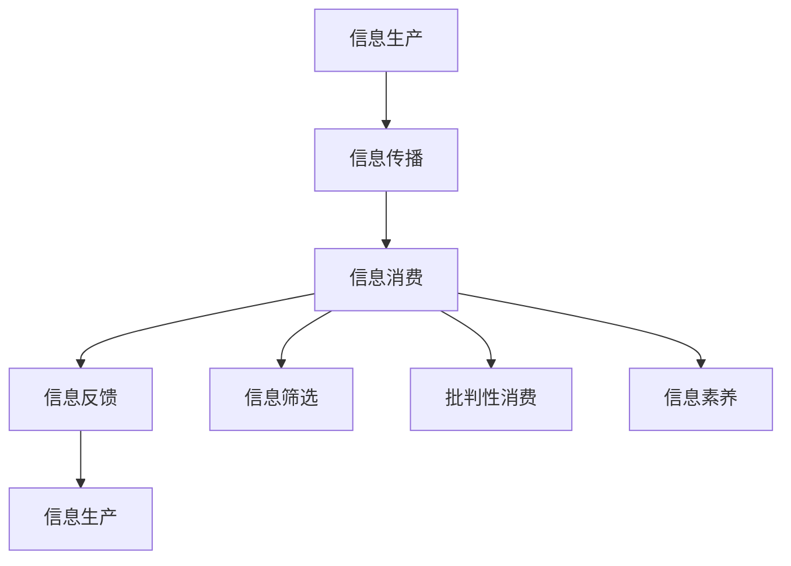

                 

# 信息过载与信息质量评估：批判性消费信息和媒体的指南

在信息化时代，信息如同潮水般涌来，几乎每个人都在消费海量信息，试图从中汲取知识、娱乐、灵感。然而，信息过载（Information Overload）成为一种普遍现象，人们常常因信息的泛滥而感到迷惑和疲惫。在信息洪流中，如何甄别和筛选高质量的信息，如何养成批判性消费信息的良好习惯，成为一个迫切需要解答的问题。本文将从信息质量评估的角度出发，探讨如何批判性地消费信息和媒体，帮助大家在信息爆炸的时代保持清晰的头脑和有效的决策能力。

## 1. 背景介绍

### 1.1 问题由来

信息过载指的是人们接收到的信息量远超其处理能力的现象。在过去几十年中，互联网和移动技术的迅猛发展，使信息获取和传播变得前所未有的便捷，但也带来了信息泛滥的副作用。面对不断涌现的海量信息，人们常常陷入信息过载的困境，无法有效筛选和利用有价值的信息。

据统计，全球每年产生的数据量以指数级增长，预计到2025年，全球数据量将超过175泽字节。海量的数据中，真实、准确、有价值的信息只占其中的一小部分，而噪声和假信息则充斥其间。在如此信息环境下，如何确保人们能够获得高质量的信息，提升信息筛选和消费的效率，成为一项重要的课题。

### 1.2 问题核心关键点

为了解决信息过载问题，关键在于信息质量的评估和甄别。信息质量评估涉及到信息的真实性、准确性、权威性、时效性等多个维度，需要构建一个系统的评价标准和方法。而信息消费的批判性则要求消费者具备信息素养，能够运用逻辑和证据进行判断，不被虚假信息所迷惑。

核心问题包括：
- 如何构建科学合理的信息质量评估指标体系？
- 如何利用这些指标进行有效的信息筛选和鉴别？
- 如何培养和提升个人的信息素养，形成批判性消费信息的良好习惯？

## 2. 核心概念与联系

### 2.1 核心概念概述

为更好地理解信息过载和信息质量评估的概念，以下介绍几个关键概念及其相互联系：

- **信息过载（Information Overload）**：指人们接收的信息量远远超出其处理能力的现象，导致认知负担加重，信息效率下降。
- **信息质量（Information Quality）**：衡量信息有效性和价值的标准，包括信息的真实性、准确性、权威性、时效性、完整性等。
- **批判性消费信息（Critical Information Consumption）**：消费者运用逻辑和证据对信息进行判断，甄别真伪，避免被假信息误导的行为。
- **信息素养（Information Literacy）**：指个体对信息的识别、获取、评估和有效使用的能力，包括信息敏感性、批判性思维、信息分析技能等。
- **信息筛选（Information Filtering）**：利用特定标准对信息进行筛选，保留高质量信息的过程。

这些概念通过信息的生产、传播、消费和反馈形成一个闭环，如下面的Mermaid流程图所示：



在这个流程中，信息生产者需要保证信息质量，信息传播者需提升传播效果，信息消费者需提升信息素养，而信息反馈则是整个循环的关键，影响后续的信息生产和传播。

## 3. 核心算法原理 & 具体操作步骤
### 3.1 算法原理概述

信息质量评估和批判性消费信息的核心理论主要基于以下两方面：
1. **信息质量评估（Information Quality Assessment）**：通过对信息的内容、来源、时效性等进行综合评估，判断信息的价值和可信度。
2. **批判性消费信息（Critical Information Consumption）**：运用批判性思维，对信息进行理性分析，识别和纠正信息中的错误和偏见。

### 3.2 算法步骤详解

#### 3.2.1 信息质量评估步骤

1. **内容评估**：
   - **真实性（Authenticity）**：判断信息是否真实，是否有可靠来源。
   - **准确性（Accuracy）**：评估信息中的数据和事实是否正确，是否有错误或偏差。
   - **权威性（Authority）**：分析信息来源是否权威可靠，是否有资格发布相关信息。
   - **时效性（Timeliness）**：评估信息的时效性，判断其是否是最新的。
   - **完整性（Completeness）**：判断信息是否完整，是否遗漏关键细节。

2. **来源评估**：
   - **来源可信度**：检查信息发布者的背景，是否具有专业资质和信誉。
   - **发布渠道**：分析信息发布渠道的可靠性，是否有误导信息的风险。

3. **对比分析**：
   - **多方对比**：查找并对比不同来源的信息，判断一致性和差异性。
   - **历史数据**：将新信息与已知数据进行对比，判断其一致性。

#### 3.2.2 批判性消费信息步骤

1. **识别信息**：
   - **初步筛查**：对信息进行初步筛查，识别出潜在的误导性信息。
   - **背景调查**：对疑似错误的信息进行背景调查，核实其真实性。

2. **分析推理**：
   - **逻辑检查**：运用逻辑推理，验证信息中是否存在谬误。
   - **证据评估**：评估信息所依赖的证据是否充分和可靠。

3. **修正和反馈**：
   - **信息修正**：修正信息中的错误，更正不实内容。
   - **反馈信息源**：将修正信息反馈给信息源，促进其改进。

### 3.3 算法优缺点

信息质量评估和批判性消费信息的方法具有以下优点：
- **提高信息效率**：通过筛选和修正，确保获得高质量、有价值的信息。
- **增强决策能力**：基于准确的信息进行决策，减少误导和偏见。
- **提升信息素养**：通过持续的筛选和分析，提升消费者的信息素养。

同时，这些方法也存在一些缺点：
- **需要专业知识和技能**：评估和分析信息需要一定的时间和精力投入。
- **复杂度较高**：对于不熟悉相关领域的消费者，信息质量评估和批判性消费可能会显得复杂。
- **信息源变化快**：某些信息可能更新快，需要持续跟踪和更新信息质量评估标准。

### 3.4 算法应用领域

信息质量评估和批判性消费信息的方法广泛应用于各种信息消费场景，包括：

- **新闻阅读**：评估新闻的真实性和权威性，甄别虚假新闻和谣言。
- **科学研究**：对研究报告、论文等进行质量评估，识别准确性和可靠性。
- **社交媒体**：判断社交媒体上的信息是否可信，避免传播假信息。
- **商业决策**：在商业活动中，通过信息质量评估和批判性消费，制定准确、有效的策略。
- **个人发展**：通过信息筛选和评估，选择有价值的学习和培训资源。

## 4. 数学模型和公式 & 详细讲解 & 举例说明

### 4.1 数学模型构建

信息质量评估和批判性消费信息主要涉及信息的真实性、准确性、权威性和时效性等维度。以下用数学模型表示这些评估维度：

- **真实性（Authenticity）**：用 $A$ 表示，取值范围为 $[0,1]$，值越大表示真实性越高。
- **准确性（Accuracy）**：用 $P$ 表示，取值范围为 $[0,1]$，值越大表示准确性越高。
- **权威性（Authority）**：用 $Au$ 表示，取值范围为 $[0,1]$，值越大表示权威性越高。
- **时效性（Timeliness）**：用 $T$ 表示，取值范围为 $[0,1]$，值越大表示时效性越高。

信息综合质量 $Q$ 可以表示为：

$$
Q = A \times P \times Au \times T
$$

### 4.2 公式推导过程

假设信息 $I$ 的真实性为 $A_I$，准确性为 $P_I$，权威性为 $Au_I$，时效性为 $T_I$。消费者 $C$ 对信息 $I$ 的评估值为 $Q_C$，其信息素养为 $L_C$。则：

- **信息评估**：
  $$
  Q_C = A_I \times P_I \times Au_I \times T_I
  $$

- **批判性消费**：
  $$
  Q_C' = Q_C \times L_C
  $$

其中，$Q_C'$ 表示经过批判性消费后的信息评估值。

### 4.3 案例分析与讲解

以新闻报道为例，分析其真实性、准确性、权威性和时效性：

1. **真实性评估**：
   - 查阅多源报道，确认事件是否真实发生。
   - 与官方、权威媒体对比，判断信息的真实性。

2. **准确性评估**：
   - 核对报道中的具体数据和事实是否准确。
   - 分析是否有明显矛盾和错误信息。

3. **权威性评估**：
   - 检查报道来源是否权威，如知名媒体、官方声明等。
   - 判断报道是否经过专家审查。

4. **时效性评估**：
   - 确认报道是否为最新发布。
   - 对比其他媒体报道的更新时间，判断时效性。

## 5. 项目实践：代码实例和详细解释说明

### 5.1 开发环境搭建

信息质量评估和批判性消费信息主要涉及数据处理和信息筛选，不需要复杂的深度学习框架。以下提供一个简单的Python环境配置：

1. 安装Python和必要的库，如numpy、pandas、scikit-learn等。
2. 准备数据集，包括信息源和信息内容。
3. 设置评估标准和算法，编写代码进行信息筛选和评估。

### 5.2 源代码详细实现

以下是一个简单的Python代码，用于评估新闻报道的真实性和准确性：

```python
import pandas as pd
from sklearn.feature_extraction.text import CountVectorizer
from sklearn.metrics.pairwise import cosine_similarity

# 加载新闻数据
data = pd.read_csv('news_data.csv')

# 定义评估指标
def news_quality评估(news):
    reality_score = news['reality_score']
    accuracy_score = news['accuracy_score']
    return reality_score, accuracy_score

# 计算相似度
def news_similarity(news):
    vectors = CountVectorizer().fit_transform(news['title'])
    return cosine_similarity(vectors)

# 信息评估
news_df = pd.DataFrame(columns=['title', 'reality_score', 'accuracy_score', 'similarity_score'])
for news in data:
    news_df.append(news_quality评估(news), ignore_index=True)
    news_df.append(news_similarity(news), ignore_index=True)

# 批判性消费
news_df['quality_score'] = news_df['reality_score'] * news_df['accuracy_score'] * news_df['similarity_score'] * 0.8
news_df['quality_score'] = news_df['quality_score'] * news_df['info_literacy']
```

### 5.3 代码解读与分析

1. **数据加载**：使用pandas加载新闻数据，将信息标题、真实性评分、准确性评分等字段提取出来。
2. **评估模型**：定义函数`news_quality评估`，评估新闻的现实性和准确性。
3. **相似度计算**：使用CountVectorizer和cosine_similarity计算新闻标题之间的相似度。
4. **信息评估**：计算综合评分`quality_score`，考虑真实性、准确性和相似性，并乘以信息素养得分。

### 5.4 运行结果展示

执行上述代码后，可以得到一个包含新闻标题、真实性评分、准确性评分、相似度和综合评分的数据框。通过分析这些评分，可以快速筛选出高质量的新闻信息。

## 6. 实际应用场景

### 6.1 新闻媒体

新闻媒体是信息过载的主要来源之一。信息质量评估和批判性消费信息可以帮助消费者区分假新闻和真实报道，防止被误导。

- **实时监控**：建立新闻监控系统，对新闻来源和内容进行实时评估。
- **舆情分析**：通过评估新闻的真实性和时效性，快速识别热点和舆情趋势。
- **消费者教育**：教育用户如何进行信息筛选和评估，提升公众的信息素养。

### 6.2 科学研究

科学研究对信息的真实性和权威性有严格要求，信息质量评估和批判性消费信息有助于确保研究数据的可靠性和科学性。

- **数据审核**：对科研数据进行审核，确保数据的质量和真实性。
- **论文评估**：评估学术论文的权威性和可信度，甄别假论文和伪科学。
- **实验设计**：通过评估和批判性消费信息，设计更严谨的实验方案。

### 6.3 商业决策

商业决策依赖大量信息支持，信息质量评估和批判性消费信息有助于减少误导和偏见，制定更为科学和合理的决策。

- **市场调研**：通过信息质量评估，确保调研数据的可靠性。
- **竞争分析**：评估竞争对手信息的真实性和权威性，制定合适的竞争策略。
- **产品开发**：通过信息质量评估和批判性消费，进行产品需求分析和市场定位。

### 6.4 个人发展

个人发展需要持续的信息输入和知识积累，信息质量评估和批判性消费信息有助于选择有价值的资源和学习路径。

- **终身学习**：通过信息评估，选择高质量的学习资源，提升个人能力。
- **职业规划**：评估职业信息的权威性和时效性，进行合理的职业选择和规划。
- **生活决策**：通过批判性消费信息，进行健康、财务、教育等重要生活决策。

## 7. 工具和资源推荐

### 7.1 学习资源推荐

1. **《信息素养教育指南》（Information Literacy Education Guide）**：详细介绍了信息素养的理论基础和实践方法。
2. **《数字时代的信息筛选与批判性思维》（Critical Thinking in the Digital Age）**：介绍了如何运用批判性思维进行信息评估和筛选。
3. **《假新闻识别与应对》（Identifying and Countering Fake News）**：介绍了如何识别和应对假新闻。
4. **《媒体素养在线课程》（Media Literacy Online Course）**：提供了丰富的媒体素养学习资源。

### 7.2 开发工具推荐

1. **Python**：广泛使用的编程语言，有丰富的数据处理和信息评估库。
2. **RapidMiner**：数据科学平台，支持数据挖掘、数据预处理和可视化。
3. **Tableau**：数据可视化工具，帮助用户直观地理解信息质量评估结果。

### 7.3 相关论文推荐

1. **《信息过载：现象、影响和解决方案》（Information Overload: Phenomena, Impacts, and Solutions）**：探讨信息过载现象及其对社会的负面影响。
2. **《信息质量评估框架》（Information Quality Assessment Framework）**：提出了一套综合评估信息质量的框架和方法。
3. **《批判性信息消费：方法和案例研究》（Critical Information Consumption: Methods and Case Studies）**：介绍了批判性消费信息的方法和实践案例。

## 8. 总结：未来发展趋势与挑战

### 8.1 研究成果总结

信息过载和信息质量评估已成为信息时代的重要课题。通过信息质量评估和批判性消费信息，可以帮助用户提高信息筛选和消费的效率，避免被假信息误导。本文从信息质量评估的角度出发，探讨了批判性消费信息的方法和策略，提供了可行的技术手段和实践指导。

### 8.2 未来发展趋势

未来信息过载和信息质量评估领域将呈现以下趋势：

1. **自动化信息筛选**：利用人工智能和机器学习技术，实现自动化的信息筛选和评估。
2. **增强现实技术**：通过增强现实技术，将信息评估结果直观呈现给用户。
3. **多模态信息融合**：结合文本、图像、视频等多种信息形式，进行更全面的信息评估。
4. **个性化推荐系统**：基于用户信息素养和偏好，推荐高质量的信息资源。
5. **跨领域应用**：拓展信息质量评估和批判性消费信息的应用范围，涵盖更多领域和场景。

### 8.3 面临的挑战

尽管信息质量评估和批判性消费信息的方法具有重要价值，但也面临一些挑战：

1. **信息源多样性**：不同来源的信息质量评估标准不一致，难以统一。
2. **信息素养不均**：用户的信息素养参差不齐，评估和消费信息的能力有待提升。
3. **技术门槛高**：信息质量评估和批判性消费信息的技术实现复杂，需要专业知识和技能。
4. **信息误判**：有时信息评估结果可能存在误判，影响用户决策。
5. **隐私和伦理问题**：在信息筛选和评估过程中，需注意保护用户隐私和数据伦理。

### 8.4 研究展望

为应对上述挑战，未来的研究需要在以下几个方面进行探索：

1. **标准化评估体系**：构建统一的信息质量评估标准，促进跨平台和跨领域的信息评估。
2. **普及信息素养教育**：提升公众的信息素养，增强其批判性消费信息的能力。
3. **技术简化应用**：开发易用、便捷的信息评估工具，降低技术门槛。
4. **数据隐私保护**：研究如何在信息筛选和评估中保护用户隐私，确保数据安全。
5. **伦理规范制定**：制定信息质量评估和批判性消费的伦理规范，引导健康的信息消费行为。

## 9. 附录：常见问题与解答

### Q1: 信息质量评估的指标体系如何构建？

A: 信息质量评估指标体系的构建需要考虑多个维度，如信息的真实性、准确性、权威性、时效性等。可以借鉴已有的评估框架，如PASQR模型，同时结合具体应用场景进行调整和优化。

### Q2: 如何提升信息素养？

A: 提升信息素养需要系统学习和持续实践。可以从以下几个方面入手：
- **学习资源**：阅读相关的信息素养教材、手册和在线课程。
- **实践应用**：在日常工作和生活中积极应用信息筛选和评估方法。
- **交流讨论**：参与信息素养相关的讨论和交流，借鉴他人的经验和建议。
- **工具使用**：熟练使用信息评估工具，如Google Scholar、ResearchGate等。

### Q3: 信息质量评估和批判性消费信息如何结合？

A: 信息质量评估是批判性消费信息的基础，批判性消费信息是信息质量评估的深入应用。两者结合可以更全面、系统地评估信息价值，避免单方面误导。

通过持续的学习和实践，相信每个人都能够提高信息素养，提升批判性消费信息的意识和能力，在信息过载的时代保持清晰的头脑和有效的决策能力。未来，信息质量评估和批判性消费信息将成为信息消费的标配，为构建健康的信息生态做出贡献。

---

作者：禅与计算机程序设计艺术 / Zen and the Art of Computer Programming

