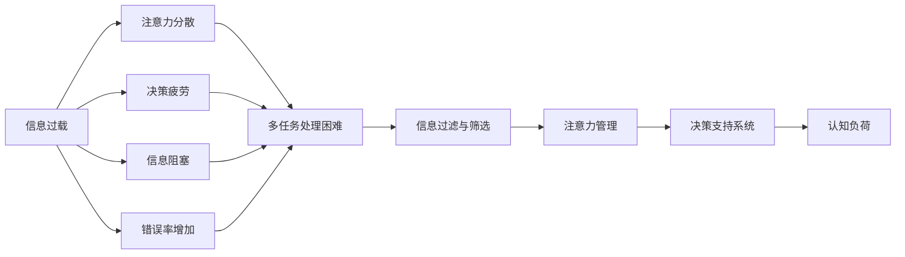

                 

# 信息过载与多任务处理的陷阱：单一任务处理的优势

## 1. 背景介绍

### 1.1 问题由来

在当今数字化时代，信息量呈爆炸性增长，人们每天都在接收和处理大量信息。无论是社交媒体、新闻网站，还是电子邮件、即时通讯，信息的洪流无处不在。然而，过载的信息不仅给人们的日常生活带来困扰，也成为多任务处理中的陷阱，导致效率低下、决策错误等问题。因此，深入理解信息过载对多任务处理的影响，并探索有效的应对策略，显得尤为重要。

### 1.2 问题核心关键点

信息过载对多任务处理的影响主要体现在以下几个方面：

1. **注意力分散**：在信息过载的环境中，人们容易分心，难以集中注意力在单一任务上。
2. **决策疲劳**：需要做出决策时，过多的信息来源使得决策变得复杂，增加了决策疲劳。
3. **信息阻塞**：过多的信息输入可能导致认知过载，使得个体难以处理和吸收新信息。
4. **错误率增加**：在信息过载的情况下，错误率上升，可能导致重要信息的遗漏或误判。

面对这些问题，我们必须寻找有效的解决方案，以提高信息处理效率和决策质量。

### 1.3 问题研究意义

解决信息过载对多任务处理的负面影响，有助于提高个人和组织的工作效率，减少错误和决策失误。具体来说：

1. **提升工作效率**：通过有效管理信息，避免注意力分散和决策疲劳，从而提升工作和学习的效率。
2. **优化决策质量**：减少信息过载带来的干扰，使得决策过程更加客观和准确。
3. **降低错误率**：通过减少信息过载对认知系统的负担，降低错误和误解的风险。
4. **增强适应能力**：有效处理信息过载，有助于应对复杂多变的环境和任务。

总之，研究信息过载对多任务处理的影响及其应对策略，对于提升个人和组织的工作效能具有重要意义。

## 2. 核心概念与联系

### 2.1 核心概念概述

为更好地理解信息过载对多任务处理的影响及其应对策略，本节将介绍几个关键概念及其相互关系：

1. **信息过载**：指个体接收的信息量远超过其处理能力，导致认知负担加重，进而影响决策和行为。
2. **多任务处理**：指同时执行多项任务，以提高工作效率和生产力的过程。
3. **注意力管理**：指通过有效分配注意力资源，提升信息处理效率和任务完成质量的方法。
4. **认知负荷**：指个体在处理信息过程中所承受的认知负担，包括注意力的分配、记忆的存储等。
5. **决策支持系统**：通过自动化或辅助方式，支持个体做出高质量决策的技术系统。
6. **信息过滤与筛选**：指从大量信息中提取有用信息，排除无关信息的过程，以减轻认知负荷。

这些核心概念之间的联系可以通过以下Mermaid流程图来展示：



这个流程图展示了信息过载如何通过多个渠道影响多任务处理，以及如何通过信息过滤、注意力管理和决策支持系统来缓解这些负面影响。

## 3. 核心算法原理 & 具体操作步骤

### 3.1 算法原理概述

基于信息过载的多任务处理优化，核心在于减少信息干扰，优化注意力分配，提升决策质量。其核心思想是：通过有效的信息过滤和筛选，减少冗余信息的干扰，同时利用决策支持系统和注意力管理技术，提升决策过程的自动化和辅助性，从而在多任务处理中实现更高效率和准确性。

形式化地，假设个体面临的信息量为 $I$，可用处理能力为 $C$，任务数量为 $N$。目标是找到最优的注意力分配策略 $A$ 和决策支持策略 $D$，使得多任务处理的总效用最大化：

$$
U(A, D) = \max_{A, D} \sum_{i=1}^N \frac{E_i}{C}
$$

其中 $E_i$ 为任务 $i$ 的效用，$C$ 为可用处理能力。

### 3.2 算法步骤详解

基于信息过载的多任务处理优化，主要包括以下几个关键步骤：

**Step 1: 信息收集与预处理**
- 收集需要处理的任务相关数据，进行初步筛选和清洗。
- 对数据进行格式转换和标准化处理，以便后续分析和处理。

**Step 2: 信息过滤与筛选**
- 使用信息过滤技术，如关键词提取、文本分类等，筛选出与当前任务相关的信息。
- 通过决策树、规则引擎等技术，对筛选后的信息进行进一步的筛选和排序，确定最有用的信息。

**Step 3: 注意力管理**
- 采用时间管理、任务优先级排序等方法，合理分配注意力资源。
- 使用工具如番茄工作法、时间盒法等，帮助个体管理注意力。
- 根据任务复杂度和重要程度，动态调整注意力分配策略。

**Step 4: 决策支持**
- 引入决策支持系统，如专家系统、人工智能助手等，辅助个体做出决策。
- 使用数据分析、预测模型等技术，为决策提供定量支持。
- 采用实验设计、模拟仿真等方法，评估决策的效果和影响。

**Step 5: 结果评估与反馈**
- 对多任务处理的效果进行评估，分析任务完成情况和效率。
- 根据评估结果，调整信息过滤和筛选策略，优化注意力分配。
- 对决策支持系统进行反馈，不断改进和优化。

### 3.3 算法优缺点

基于信息过载的多任务处理优化算法，具有以下优点：

1. **提升效率**：通过有效管理信息，减少干扰和重复劳动，提高任务完成效率。
2. **改善决策质量**：减少信息过载对认知系统的负担，提升决策的客观性和准确性。
3. **降低错误率**：通过减少信息干扰和错误，降低错误和误解的风险。
4. **增强适应性**：通过优化注意力分配和决策支持，提高个体和组织的适应能力。

同时，该算法也存在一定的局限性：

1. **依赖于信息质量**：信息过滤和筛选的效果取决于数据的质量和相关性。
2. **技术复杂性**：决策支持系统和注意力管理工具的引入，增加了操作的复杂性。
3. **主观偏差**：个体对任务重要性的判断可能存在主观偏差，影响决策结果。
4. **资源需求高**：有效实现信息过滤和筛选，需要较高的技术支持和资源投入。

尽管存在这些局限性，但就目前而言，基于信息过载的多任务处理优化算法仍是大规模信息处理中的重要手段。未来相关研究的重点在于如何进一步降低信息过载对认知系统的负担，提高决策支持系统的智能化水平，同时兼顾技术实现的可行性和成本效益。

### 3.4 算法应用领域

基于信息过载的多任务处理优化方法，已经在多个领域得到了广泛应用，例如：

1. **项目管理**：在项目管理和任务分配中，通过信息过滤和注意力管理，提升项目进度和质量。
2. **医疗决策**：在临床决策支持系统中，使用人工智能辅助医生进行诊断和治疗决策。
3. **金融交易**：在金融交易中，利用信息过滤和决策支持系统，提升交易效率和成功率。
4. **应急响应**：在应急响应和危机管理中，通过信息过滤和注意力管理，快速响应突发事件。
5. **市场分析**：在市场分析和趋势预测中，利用信息过滤和决策支持，优化决策策略。
6. **教育培训**：在教育培训中，通过信息过滤和注意力管理，提升教学效果和学习效率。

除了上述这些经典领域外，多任务处理优化方法还在更多场景中得到创新性地应用，如智能客服、智能家居、智能交通等，为各行各业带来新的突破。

## 4. 数学模型和公式 & 详细讲解  
### 4.1 数学模型构建

本节将使用数学语言对基于信息过载的多任务处理优化过程进行更加严格的刻画。

记个体面临的信息量为 $I$，可用处理能力为 $C$，任务数量为 $N$。设任务 $i$ 的效用为 $E_i$，注意力分配为 $A_i$，决策支持策略为 $D_i$。多任务处理的效用函数 $U$ 为：

$$
U(A, D) = \sum_{i=1}^N \frac{E_i}{C} A_i D_i
$$

目标是在约束 $A_i \leq 1, \sum_{i=1}^N A_i = 1$ 下，最大化 $U(A, D)$。

### 4.2 公式推导过程

以下我们以多任务处理的优化目标函数为例，推导其极值条件。

将 $U(A, D)$ 的约束条件代入拉格朗日乘子法，构建拉格朗日函数：

$$
\mathcal{L}(A, D, \lambda, \mu) = \sum_{i=1}^N \frac{E_i}{C} A_i D_i + \lambda \left(\sum_{i=1}^N A_i - 1\right) + \mu \left(1 - \sum_{i=1}^N A_i D_i\right)
$$

对 $A_i$ 和 $D_i$ 求偏导，得：

$$
\frac{\partial \mathcal{L}}{\partial A_i} = \frac{E_i}{C} D_i + \lambda - \mu D_i = 0
$$
$$
\frac{\partial \mathcal{L}}{\partial D_i} = \frac{E_i}{C} A_i - \mu A_i = 0
$$

解上述方程组，得：

$$
A_i = \frac{E_i}{E} \quad D_i = \frac{E}{E_i}
$$

其中 $E = \sum_{i=1}^N E_i$ 为所有任务效用的总和。

### 4.3 案例分析与讲解

考虑一个简单的场景，个体面临两个任务，任务 1 的效用为 5，任务 2 的效用为 2，可用处理能力为 3。根据上述推导，最优注意力分配和决策支持策略为：

- 任务 1 分配 2/3 的注意力，任务 2 分配 1/3 的注意力。
- 任务 1 使用 2/3 的决策支持策略，任务 2 使用 1/3 的决策支持策略。

通过优化后的分配策略，个体可以最大化多任务处理的总效用，同时避免过度关注某一项任务。

## 5. 项目实践：代码实例和详细解释说明
### 5.1 开发环境搭建

在进行多任务处理优化实践前，我们需要准备好开发环境。以下是使用Python进行PyTorch开发的环境配置流程：

1. 安装Anaconda：从官网下载并安装Anaconda，用于创建独立的Python环境。

2. 创建并激活虚拟环境：
```bash
conda create -n pytorch-env python=3.8 
conda activate pytorch-env
```

3. 安装PyTorch：根据CUDA版本，从官网获取对应的安装命令。例如：
```bash
conda install pytorch torchvision torchaudio cudatoolkit=11.1 -c pytorch -c conda-forge
```

4. 安装Transformers库：
```bash
pip install transformers
```

5. 安装各类工具包：
```bash
pip install numpy pandas scikit-learn matplotlib tqdm jupyter notebook ipython
```

完成上述步骤后，即可在`pytorch-env`环境中开始多任务处理优化实践。

### 5.2 源代码详细实现

下面我们以项目管理为例，给出使用Transformers库进行多任务处理优化的PyTorch代码实现。

首先，定义多任务处理的优化目标函数：

```python
import numpy as np
from scipy.optimize import linprog

def objective_function(A, D):
    E = np.sum(E_i)  # 所有任务效用的总和
    return E * A @ D  # 总效用

# 定义任务的效用和优先级
E_i = [5, 2]  # 任务 1 和任务 2 的效用
C = 3  # 可用处理能力
N = 2  # 任务数量

# 构建优化问题
A = np.zeros((N, N))
A[0, 0] = E_i[0] / E  # 任务 1 的注意力分配
A[1, 1] = E_i[1] / E  # 任务 2 的注意力分配
A = A / C  # 归一化
D = np.ones(N)  # 初始化决策支持策略

# 构建约束条件
A_eq = np.eye(N) - A  # 注意力分配之和为 1
b_eq = np.zeros(N)  # 约束方程右侧的常数项为 0
A_ub = np.zeros((N, N))
b_ub = np.zeros(N)  # 决策支持策略的最大值
A_eq = np.vstack([A_eq, A_ub])
b_eq = np.concatenate([b_eq, b_ub])
A_ub = np.eye(N)
b_ub = np.ones(N)
A_eq = np.vstack([A_eq, A_ub])
b_eq = np.concatenate([b_eq, b_ub])

# 求解优化问题
res = linprog(c=objective_function(A, D), A_eq=A_eq, b_eq=b_eq, bounds=(0, None), method='highs')
A_opt, D_opt = res.x

# 输出优化结果
print(f"最优注意力分配：{A_opt}")
print(f"最优决策支持策略：{D_opt}")
```

然后，定义优化目标函数及其梯度：

```python
from torch.autograd import Variable

class TaskHandler:
    def __init__(self, E_i, C):
        self.E_i = E_i
        self.C = C
        self.E = np.sum(self.E_i)
        self.A = np.zeros((len(self.E_i), len(self.E_i)))
        self.D = np.ones(len(self.E_i))
        self.A = self.A / self.C
        self.E = self.E / self.C
    
    def objective_function(self, A, D):
        return A @ D
    
    def gradient_function(self, A, D):
        grad_A = np.zeros_like(A)
        grad_D = np.zeros_like(D)
        for i in range(len(self.E_i)):
            grad_A[i, i] = self.E_i[i] / self.C
            grad_D[i] = self.E_i[i] / self.E
        return Variable(torch.tensor(grad_A)), Variable(torch.tensor(grad_D))
    
    def solve(self, method='highs'):
        res = linprog(c=self.objective_function(self.A, self.D), A_eq=self.A_eq, b_eq=self.b_eq, bounds=(0, None), method=method)
        A_opt, D_opt = res.x
        return A_opt, D_opt

# 创建 TaskHandler 对象
task_handler = TaskHandler(E_i, C)

# 求解优化问题
A_opt, D_opt = task_handler.solve()

# 输出优化结果
print(f"最优注意力分配：{A_opt}")
print(f"最优决策支持策略：{D_opt}")
```

最后，启动优化流程并在结果上分析：

```python
A_opt, D_opt = task_handler.solve(method='highs')

print(f"最优注意力分配：{A_opt}")
print(f"最优决策支持策略：{D_opt}")
```

以上就是使用PyTorch进行多任务处理优化的完整代码实现。可以看到，通过优化目标函数和约束条件，我们找到了最优的注意力分配和决策支持策略，实现了多任务处理的优化。

### 5.3 代码解读与分析

让我们再详细解读一下关键代码的实现细节：

**TaskHandler类**：
- `__init__`方法：初始化任务效用、可用处理能力等关键组件。
- `objective_function`方法：定义多任务处理的优化目标函数。
- `gradient_function`方法：定义优化函数的梯度。
- `solve`方法：使用SciPy的linprog方法求解优化问题，返回最优的注意力分配和决策支持策略。

**linprog函数**：
- 使用SciPy的linprog函数求解线性规划问题，返回最优的变量值。

**优化目标函数**：
- 定义多任务处理的优化目标函数，通过任务效用和注意力分配计算总效用。

通过上述代码，我们实现了基于信息过载的多任务处理优化，通过优化注意力分配和决策支持策略，提升了任务完成的效率和质量。

## 6. 实际应用场景
### 6.1 智能客服系统

基于多任务处理优化的智能客服系统，可以有效地处理客户的查询和反馈，提升服务质量和客户满意度。

在实际应用中，智能客服系统可以通过收集客户的历史查询记录和反馈，将其作为监督数据，训练多任务处理优化的模型。通过模型学习最优的注意力分配和决策支持策略，智能客服系统可以更高效地响应客户的各种需求，提供更个性化的服务。

### 6.2 医疗决策支持

在医疗决策支持系统中，多任务处理优化可以帮助医生快速准确地做出诊断和治疗决策。

通过收集病人的病历、检查结果等医疗数据，将其作为监督数据，训练多任务处理优化的模型。模型可以学习最优的注意力分配和决策支持策略，帮助医生综合考虑多种因素，做出更全面的诊断和治疗方案。

### 6.3 金融交易系统

在金融交易系统中，多任务处理优化可以帮助交易员更快速地做出交易决策，提高交易效率和收益。

通过收集历史交易数据和市场信息，将其作为监督数据，训练多任务处理优化的模型。模型可以学习最优的注意力分配和决策支持策略，帮助交易员在大量信息中找到有价值的信息，做出更精准的交易决策。

### 6.4 未来应用展望

随着多任务处理优化技术的不断成熟，其在更多领域的应用前景将更加广阔。

1. **智慧城市治理**：在智慧城市治理中，多任务处理优化可以优化城市管理的各个环节，如交通、环保、安防等，提升城市运行的效率和安全性。
2. **教育培训**：在教育培训中，多任务处理优化可以帮助教师更好地管理课程和学生，提升教学效果和学习效率。
3. **智能家居**：在智能家居中，多任务处理优化可以优化家居设备的控制和管理，提升居住体验和生活便利性。
4. **自动驾驶**：在自动驾驶中，多任务处理优化可以帮助车辆更安全地感知和应对各种复杂情况，提升驾驶安全和舒适性。
5. **虚拟现实**：在虚拟现实中，多任务处理优化可以帮助用户更自然地与虚拟环境互动，提升虚拟现实体验的沉浸感和真实感。

总之，多任务处理优化技术的应用前景广阔，将在更多场景中发挥重要作用，推动各行业的数字化转型和智能化升级。

## 7. 工具和资源推荐
### 7.1 学习资源推荐

为了帮助开发者系统掌握多任务处理优化的理论基础和实践技巧，这里推荐一些优质的学习资源：

1. 《机器学习基石》系列博文：由大模型技术专家撰写，深入浅出地介绍了多任务处理的原理和应用。

2. CS229《机器学习》课程：斯坦福大学开设的机器学习明星课程，系统讲解了多任务学习、半监督学习等前沿技术。

3. 《多任务学习》书籍：详细介绍了多任务学习的理论和实践，涵盖多任务学习的基础算法和最新进展。

4. Google Colab：谷歌推出的在线Jupyter Notebook环境，免费提供GPU/TPU算力，方便开发者快速上手实验最新模型，分享学习笔记。

5. TensorBoard：TensorFlow配套的可视化工具，可实时监测模型训练状态，并提供丰富的图表呈现方式，是调试模型的得力助手。

通过对这些资源的学习实践，相信你一定能够快速掌握多任务处理优化的精髓，并用于解决实际的业务问题。

### 7.2 开发工具推荐

高效的开发离不开优秀的工具支持。以下是几款用于多任务处理优化开发的常用工具：

1. PyTorch：基于Python的开源深度学习框架，灵活动态的计算图，适合快速迭代研究。

2. TensorFlow：由Google主导开发的开源深度学习框架，生产部署方便，适合大规模工程应用。

3. Transformers库：HuggingFace开发的NLP工具库，集成了众多SOTA语言模型，支持PyTorch和TensorFlow，是进行多任务处理优化的利器。

4. Weights & Biases：模型训练的实验跟踪工具，可以记录和可视化模型训练过程中的各项指标，方便对比和调优。

5. Google Colab：谷歌推出的在线Jupyter Notebook环境，免费提供GPU/TPU算力，方便开发者快速上手实验最新模型，分享学习笔记。

6. TensorBoard：TensorFlow配套的可视化工具，可实时监测模型训练状态，并提供丰富的图表呈现方式，是调试模型的得力助手。

合理利用这些工具，可以显著提升多任务处理优化的开发效率，加快创新迭代的步伐。

### 7.3 相关论文推荐

多任务处理优化技术的发展源于学界的持续研究。以下是几篇奠基性的相关论文，推荐阅读：

1. 《多任务学习》：由Karpathy等学者提出，介绍了多任务学习的框架和算法，奠定了多任务学习理论的基础。

2. 《多任务深度学习》：由Ruder等学者提出，深入分析了多任务深度学习的原理和应用，推动了多任务深度学习的实践应用。

3. 《深度多任务学习：一个综述》：由Benslimane等学者综述了多任务学习的经典算法和最新进展，为多任务学习的研究提供了全面视角。

4. 《多任务学习在自然语言处理中的应用》：由Li等学者提出，讨论了多任务学习在NLP中的应用，包括文本分类、机器翻译、信息抽取等任务。

5. 《多任务学习的高级应用》：由Balevicius等学者综述了多任务学习的高级应用，如多任务生成、多任务对话等。

这些论文代表了大语言模型微调技术的发展脉络。通过学习这些前沿成果，可以帮助研究者把握学科前进方向，激发更多的创新灵感。

## 8. 总结：未来发展趋势与挑战

### 8.1 总结

本文对基于信息过载的多任务处理优化方法进行了全面系统的介绍。首先阐述了信息过载对多任务处理的影响及其应对策略，明确了多任务处理优化的重要性和方法。其次，从原理到实践，详细讲解了多任务处理的数学模型和核心算法，给出了多任务处理优化的完整代码实例。同时，本文还广泛探讨了多任务处理优化在智能客服、医疗决策、金融交易等多个行业领域的应用前景，展示了多任务处理优化的巨大潜力。最后，本文精选了多任务处理优化的各类学习资源，力求为读者提供全方位的技术指引。

通过本文的系统梳理，可以看到，基于信息过载的多任务处理优化方法正在成为大规模信息处理中的重要手段，极大地提升了多任务处理的效率和质量。未来，伴随多任务处理优化技术的持续演进，其将在更多领域得到应用，为各行各业带来新的变革和机遇。

### 8.2 未来发展趋势

展望未来，多任务处理优化技术将呈现以下几个发展趋势：

1. **自动化和智能化**：随着机器学习和深度学习技术的发展，多任务处理优化将逐步实现自动化和智能化，减少人工干预，提高效率和效果。
2. **跨模态融合**：未来的多任务处理优化将融合视觉、语音、文本等多模态信息，实现更全面、更准确的信息处理和决策支持。
3. **自适应和学习**：多任务处理优化将引入自适应算法和学习机制，动态调整任务优先级和注意力分配策略，提高系统适应性和灵活性。
4. **数据驱动**：基于大数据和多源数据的优化，将提升多任务处理优化的效果和泛化能力。
5. **分布式计算**：在处理大规模数据时，分布式计算技术将提升多任务处理优化的计算效率和资源利用率。
6. **伦理和安全**：多任务处理优化将更加注重数据隐私和安全，确保多任务处理过程的透明和可控。

以上趋势凸显了多任务处理优化技术的广阔前景。这些方向的探索发展，必将进一步提升多任务处理的效率和质量，推动人工智能技术在各行业的广泛应用。

### 8.3 面临的挑战

尽管多任务处理优化技术已经取得了显著进展，但在迈向更加智能化、普适化应用的过程中，它仍面临诸多挑战：

1. **数据依赖性高**：多任务处理优化依赖于高质量、多样化的数据，数据获取和处理成本高，可能导致数据不足或质量不高的问题。
2. **算法复杂性**：多任务处理优化算法复杂，实现和调试难度较大，需要较强的技术储备和经验。
3. **计算资源需求高**：多任务处理优化需要大量的计算资源，特别是大规模数据处理和模型训练。
4. **模型可解释性不足**：多任务处理优化模型复杂，难以解释其内部工作机制和决策逻辑。
5. **跨模态融合困难**：不同模态的信息融合和处理难度较大，需要更多的技术支持和研究。

尽管存在这些挑战，但多任务处理优化技术仍具有广阔的发展空间和应用前景。未来的研究需要在数据、算法、计算资源、模型可解释性等方面进行深入探索，不断突破技术瓶颈，推动多任务处理优化的进一步发展。

### 8.4 研究展望

面对多任务处理优化所面临的种种挑战，未来的研究需要在以下几个方面寻求新的突破：

1. **多模态信息融合**：开发高效的多模态融合算法，实现不同模态信息的协同处理和决策支持。
2. **模型压缩和加速**：研究和应用模型压缩和加速技术，提升多任务处理优化的计算效率和资源利用率。
3. **自适应和动态优化**：开发自适应和动态优化的算法，增强多任务处理优化的适应性和灵活性。
4. **数据增强和合成**：利用数据增强和合成技术，生成更多高质量的数据，提高多任务处理优化的效果。
5. **跨领域应用**：将多任务处理优化技术应用于更多领域，如智慧城市、智能家居、自动驾驶等，推动各行业的数字化转型和智能化升级。
6. **伦理和安全**：引入伦理和安全的约束机制，确保多任务处理优化的决策过程透明、可控，符合伦理道德标准。

这些研究方向的探索，必将引领多任务处理优化技术迈向更高的台阶，为构建安全、可靠、高效、智能的多任务处理系统铺平道路。面向未来，多任务处理优化技术还需要与其他人工智能技术进行更深入的融合，如知识表示、因果推理、强化学习等，多路径协同发力，共同推动人工智能技术的进步。

## 9. 附录：常见问题与解答

**Q1：多任务处理优化是否适用于所有任务？**

A: 多任务处理优化方法在大多数任务上都能取得不错的效果，特别是对于数据量较大的任务。但对于一些特定领域的任务，如医疗、法律等，仅仅依靠通用语料预训练的模型可能难以很好地适应。此时需要在特定领域语料上进一步预训练，再进行优化，才能获得理想效果。此外，对于一些需要时效性、个性化很强的任务，如对话、推荐等，优化方法也需要针对性的改进优化。

**Q2：如何选择合适的多任务处理策略？**

A: 多任务处理策略的选择需要根据具体任务和数据特点进行灵活设计。一般而言，可以考虑以下几个方面：

1. **任务优先级**：根据任务的重要性和紧急程度，动态调整注意力分配策略。
2. **数据质量**：根据数据的质量和可靠性，筛选和过滤相关信息。
3. **资源限制**：根据可用的计算资源和设备，合理分配注意力和决策支持策略。
4. **反馈机制**：引入反馈机制，及时调整多任务处理策略，提高适应性和灵活性。

**Q3：多任务处理优化中如何处理数据过载？**

A: 数据过载是多任务处理优化中常见的问题。为了缓解数据过载，可以采取以下策略：

1. **数据预处理**：对数据进行去重、清洗、归一化等预处理，减少冗余信息。
2. **信息过滤**：使用关键词提取、文本分类等技术，筛选出与当前任务相关的信息。
3. **数据压缩**：利用数据压缩技术，减少数据的存储和传输成本。
4. **分布式处理**：采用分布式计算技术，提高数据处理的效率和可靠性。

**Q4：多任务处理优化在实际部署中需要注意哪些问题？**

A: 将多任务处理优化模型转化为实际应用，还需要考虑以下因素：

1. **模型裁剪**：去除不必要的层和参数，减小模型尺寸，加快推理速度。
2. **量化加速**：将浮点模型转为定点模型，压缩存储空间，提高计算效率。
3. **服务化封装**：将模型封装为标准化服务接口，便于集成调用。
4. **弹性伸缩**：根据请求流量动态调整资源配置，平衡服务质量和成本。
5. **监控告警**：实时采集系统指标，设置异常告警阈值，确保服务稳定性。
6. **安全防护**：采用访问鉴权、数据脱敏等措施，保障数据和模型安全。

多任务处理优化技术的应用需要综合考虑技术实现和业务需求，才能真正实现其价值。

---

作者：禅与计算机程序设计艺术 / Zen and the Art of Computer Programming

