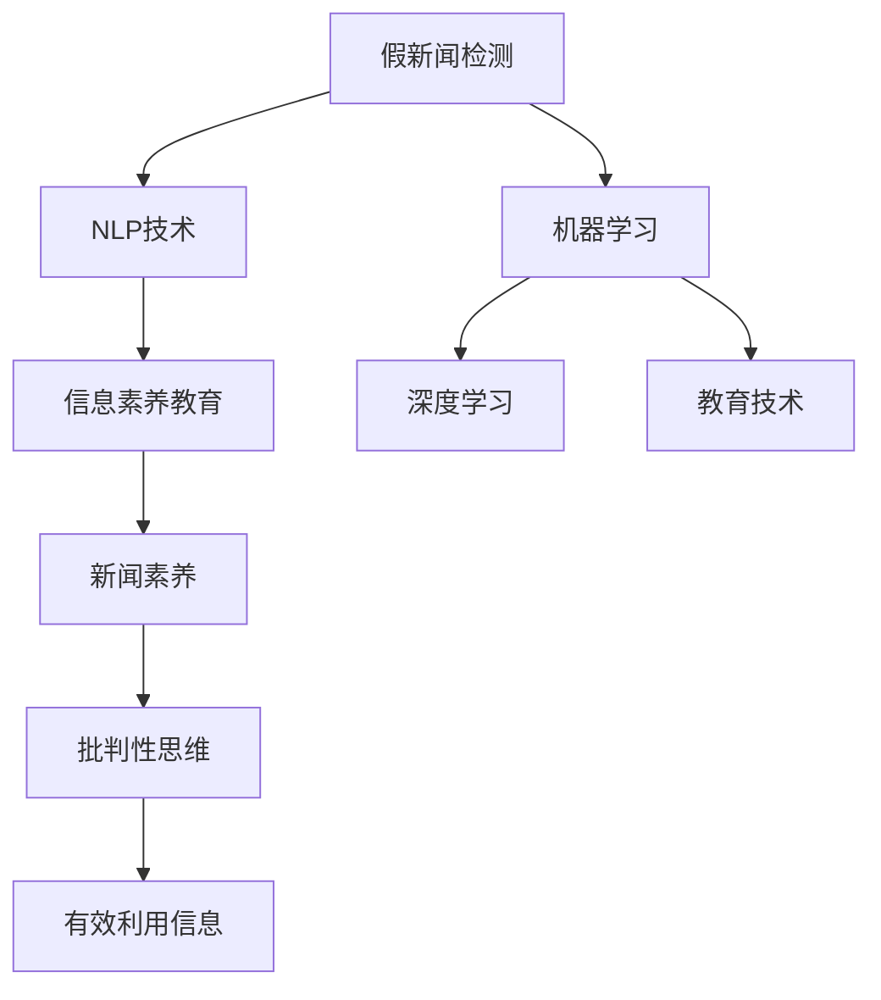

                 

## 1. 背景介绍

### 1.1 问题由来
在数字化时代，假新闻和媒体操纵成为了一种普遍现象，严重影响公众的知情权、判断力和决策能力。根据多个研究机构的数据，全球范围内，每年都有大量的假新闻被制造和传播。这不仅对公共议题造成误导，还可能引发社会动荡，破坏国际关系。

传统的新闻验证方法依赖于记者和编辑的专业判断，但随着信息量爆炸式增长，人工审查已无法满足需求。因此，开发一种自动化的、可扩展的、准确的信息验证系统成为了当务之急。与此同时，培养媒体素养，使公众能够辨识信息真伪，也是解决这一问题的关键。

### 1.2 问题核心关键点
媒体素养教育的信息验证系统需要具备以下核心能力：
- **自动化信息验证**：使用机器学习、自然语言处理等技术，自动识别和标记假新闻。
- **可扩展性**：系统能够快速适应新的信息形式和传播渠道。
- **准确性**：能够在高噪声环境中准确辨识信息真伪。
- **透明度**：提供清晰的决策过程和依据，方便用户理解和信任。
- **可解释性**：能够向用户解释其推理过程，提升用户的媒体素养。
- **隐私保护**：确保信息验证过程中用户的隐私安全。

解决这些问题需要融合人工智能技术、新闻学理论、心理学研究和教育方法，构建一个综合的信息验证和媒体素养教育平台。

## 2. 核心概念与联系

### 2.1 核心概念概述

为更好地理解信息验证和媒体素养教育的原理和架构，本节将介绍几个密切相关的核心概念：

- **假新闻检测**：使用机器学习算法自动识别和标记假新闻的过程。
- **自然语言处理(NLP)**：使计算机能够理解、分析、生成人类语言的技术。
- **机器学习**：通过数据驱动的模型学习，自动识别模式和规律。
- **深度学习**：一类特殊的机器学习方法，使用多层神经网络处理复杂数据。
- **信息素养**：培养公众批判性思维、有效利用信息的能力。
- **教育技术**：结合教育学和技术的融合，提升教育效果。

这些核心概念之间的逻辑关系可以通过以下Mermaid流程图来展示：



这个流程图展示了信息验证和媒体素养教育的核心概念及其之间的关系：

1. 假新闻检测利用NLP技术提取文本特征，通过机器学习和深度学习算法识别模式，实现自动化的假新闻检测。
2. 信息素养教育通过教育技术手段，培养用户的批判性思维、有效利用信息的能力。
3. 新闻素养教育是信息素养教育的一部分，具体关注新闻行业的知识和技能。
4. 批判性思维和有效利用信息是信息素养教育的核心目标。

这些概念共同构成了信息验证和媒体素养教育的框架，使其能够有效地应对假新闻和媒体操纵的挑战。

## 3. 核心算法原理 & 具体操作步骤
### 3.1 算法原理概述

信息验证和媒体素养教育的系统构建，本质上是一个融合人工智能技术和教育学理论的多学科交叉过程。其核心思想是：利用先进的技术手段，构建一个自动化、可扩展的信息验证平台，同时通过教育技术手段，提升公众的媒体素养，使其具备辨别假新闻的能力。

形式化地，假设假新闻检测的系统输入为 $N$ 篇新闻，系统输出为每篇新闻的标签 $\hat{y} \in \{0,1\}$，其中 $0$ 表示真新闻，$1$ 表示假新闻。系统设计的目标是最小化预测错误率，即找到最优参数：

$$
\theta^* = \mathop{\arg\min}_{\theta} \mathcal{L}(\theta)
$$

其中 $\mathcal{L}$ 为系统在训练集上的损失函数，用于衡量预测结果与真实标签之间的差异。常见的损失函数包括交叉熵损失、均方误差损失等。

### 3.2 算法步骤详解

信息验证和媒体素养教育系统的构建一般包括以下几个关键步骤：

**Step 1: 准备训练数据集**
- 收集大量真实新闻和假新闻的语料，进行标注，构建训练集、验证集和测试集。
- 使用NLP技术提取文本特征，如TF-IDF、word2vec等。

**Step 2: 设计算法模型**
- 选择合适的算法模型，如基于深度学习的文本分类模型、基于规则的检测模型等。
- 设计训练目标函数和优化算法，如交叉熵损失、Adam优化器等。

**Step 3: 训练和评估模型**
- 使用训练集对模型进行训练，在验证集上评估模型性能。
- 使用测试集进行最终测试，评估模型的泛化能力。

**Step 4: 部署系统**
- 将训练好的模型部署到生产环境，使用API接口接受用户输入，返回验证结果。
- 提供可视化界面，方便用户理解和使用。

**Step 5: 教育培训**
- 开发教育课程和资源，培训公众识别假新闻的方法和技巧。
- 与教育机构合作，将信息验证和媒体素养教育纳入日常教学。

以上是信息验证和媒体素养教育系统的构建一般流程。在实际应用中，还需要针对具体任务和用户需求，对各个环节进行优化设计，如改进特征提取方法，引入更多的监督数据，搜索最优的超参数组合等，以进一步提升系统性能。

### 3.3 算法优缺点

信息验证和媒体素养教育系统具有以下优点：
1. 自动化程度高。通过机器学习模型自动检测假新闻，减少了人工审查的工作量。
2. 泛化能力强。基于大规模标注数据训练的模型，可以适应不同的新闻类型和传播渠道。
3. 教育效果显著。通过教育技术手段，提高了公众的媒体素养，提升了信息辨识能力。
4. 可扩展性好。系统能够快速适应新类型的新闻和传播形式。
5. 透明度高。提供清晰的推理过程和依据，方便用户理解和信任。

同时，该系统也存在一些局限性：
1. 依赖标注数据。假新闻检测的效果很大程度上取决于标注数据的质量和数量，获取高质量标注数据的成本较高。
2. 模型鲁棒性有限。面对高度变化的噪声环境，模型的泛化性能可能受到限制。
3. 可解释性不足。当前的信息验证系统缺乏可解释性，难以对其推理逻辑进行分析和调试。
4. 隐私保护问题。在处理用户数据时，需要特别注意隐私保护和数据安全。

尽管存在这些局限性，但就目前而言，信息验证和媒体素养教育系统仍是应对假新闻和媒体操纵的有效手段。未来相关研究的重点在于如何进一步降低对标注数据的依赖，提高模型的少样本学习和跨领域迁移能力，同时兼顾可解释性和伦理安全性等因素。

### 3.4 算法应用领域

信息验证和媒体素养教育系统已经在新闻媒体、社交网络、政府机构等多个领域得到了广泛应用，具体包括：

- 新闻媒体：自动检测假新闻，提升新闻编辑效率和质量。
- 社交网络：自动识别和标记假新闻，防止虚假信息的传播。
- 政府机构：监测舆论舆情，防范虚假信息的恶意传播。
- 教育机构：培养学生的信息素养，提升其批判性思维和媒体素养。

除了上述这些经典应用外，信息验证和媒体素养教育系统还被创新性地应用于反欺诈、公共安全、企业舆情监控等更多场景中，为各行各业提供了新的技术手段。随着技术的进步和应用的拓展，信息验证和媒体素养教育系统必将在更广阔的领域发挥重要作用。

## 4. 数学模型和公式 & 详细讲解 & 举例说明
### 4.1 数学模型构建

本节将使用数学语言对信息验证和媒体素养教育系统的构建过程进行更加严格的刻画。

假设假新闻检测的系统输入为 $N$ 篇新闻，系统输出为每篇新闻的标签 $\hat{y} \in \{0,1\}$，其中 $0$ 表示真新闻，$1$ 表示假新闻。定义模型 $M_{\theta}$ 在输入新闻 $x_i$ 上的输出为 $\hat{y}_i=M_{\theta}(x_i) \in [0,1]$，表示模型预测该新闻为真新闻的概率。训练集为 $D=\{(x_i,y_i)\}_{i=1}^N, x_i \in \mathcal{X}, y_i \in \{0,1\}$，其中 $\mathcal{X}$ 为输入空间。

定义模型 $M_{\theta}$ 在数据样本 $(x,y)$ 上的损失函数为 $\ell(M_{\theta}(x),y)$，则在数据集 $D$ 上的经验风险为：

$$
\mathcal{L}(\theta) = \frac{1}{N} \sum_{i=1}^N \ell(M_{\theta}(x_i),y_i)
$$

其中 $\ell$ 为针对任务设计的损失函数，用于衡量模型预测结果与真实标签之间的差异。常见的损失函数包括交叉熵损失、均方误差损失等。

通过梯度下降等优化算法，模型 $M_{\theta}$ 不断更新参数 $\theta$，最小化损失函数 $\mathcal{L}(\theta)$，使得模型输出逼近真实标签。由于 $\theta$ 已经通过预训练获得了较好的初始化，因此即便在标注数据较少的场景下，也能较快收敛到理想的模型参数 $\hat{\theta}$。

### 4.2 公式推导过程

以下我们以二分类任务为例，推导交叉熵损失函数及其梯度的计算公式。

假设模型 $M_{\theta}$ 在输入新闻 $x$ 上的输出为 $\hat{y}=M_{\theta}(x) \in [0,1]$，表示模型预测该新闻为真新闻的概率。真实标签 $y \in \{0,1\}$。则二分类交叉熵损失函数定义为：

$$
\ell(M_{\theta}(x),y) = -[y\log \hat{y} + (1-y)\log (1-\hat{y})]
$$

将其代入经验风险公式，得：

$$
\mathcal{L}(\theta) = -\frac{1}{N}\sum_{i=1}^N [y_i\log M_{\theta}(x_i)+(1-y_i)\log(1-M_{\theta}(x_i))]
$$

根据链式法则，损失函数对参数 $\theta_k$ 的梯度为：

$$
\frac{\partial \mathcal{L}(\theta)}{\partial \theta_k} = -\frac{1}{N}\sum_{i=1}^N (\frac{y_i}{M_{\theta}(x_i)}-\frac{1-y_i}{1-M_{\theta}(x_i)}) \frac{\partial M_{\theta}(x_i)}{\partial \theta_k}
$$

其中 $\frac{\partial M_{\theta}(x_i)}{\partial \theta_k}$ 可进一步递归展开，利用自动微分技术完成计算。

在得到损失函数的梯度后，即可带入参数更新公式，完成模型的迭代优化。重复上述过程直至收敛，最终得到适应假新闻检测任务的最优模型参数 $\hat{\theta}$。

## 5. 项目实践：代码实例和详细解释说明
### 5.1 开发环境搭建

在进行信息验证和媒体素养教育系统的开发前，我们需要准备好开发环境。以下是使用Python进行PyTorch开发的环境配置流程：

1. 安装Anaconda：从官网下载并安装Anaconda，用于创建独立的Python环境。

2. 创建并激活虚拟环境：
```bash
conda create -n pytorch-env python=3.8 
conda activate pytorch-env
```

3. 安装PyTorch：根据CUDA版本，从官网获取对应的安装命令。例如：
```bash
conda install pytorch torchvision torchaudio cudatoolkit=11.1 -c pytorch -c conda-forge
```

4. 安装TensorFlow：
```bash
pip install tensorflow
```

5. 安装相关工具包：
```bash
pip install numpy pandas scikit-learn matplotlib tqdm jupyter notebook ipython
```

完成上述步骤后，即可在`pytorch-env`环境中开始开发实践。

### 5.2 源代码详细实现

这里我们以假新闻检测任务为例，给出使用Transformers库对BERT模型进行假新闻检测的PyTorch代码实现。

首先，定义假新闻检测任务的数据处理函数：

```python
from transformers import BertTokenizer
from torch.utils.data import Dataset
import torch

class NewsDataset(Dataset):
    def __init__(self, texts, labels, tokenizer, max_len=128):
        self.texts = texts
        self.labels = labels
        self.tokenizer = tokenizer
        self.max_len = max_len
        
    def __len__(self):
        return len(self.texts)
    
    def __getitem__(self, item):
        text = self.texts[item]
        label = self.labels[item]
        
        encoding = self.tokenizer(text, return_tensors='pt', max_length=self.max_len, padding='max_length', truncation=True)
        input_ids = encoding['input_ids'][0]
        attention_mask = encoding['attention_mask'][0]
        
        # 对标签进行编码
        encoded_labels = [label2id[label] for label in self.labels] 
        encoded_labels.extend([label2id['O']] * (self.max_len - len(encoded_labels)))
        labels = torch.tensor(encoded_labels, dtype=torch.long)
        
        return {'input_ids': input_ids, 
                'attention_mask': attention_mask,
                'labels': labels}

# 标签与id的映射
label2id = {'O': 0, 'Fake': 1}
id2label = {v: k for k, v in label2id.items()}

# 创建dataset
tokenizer = BertTokenizer.from_pretrained('bert-base-cased')

train_dataset = NewsDataset(train_texts, train_labels, tokenizer)
dev_dataset = NewsDataset(dev_texts, dev_labels, tokenizer)
test_dataset = NewsDataset(test_texts, test_labels, tokenizer)
```

然后，定义模型和优化器：

```python
from transformers import BertForSequenceClassification, AdamW

model = BertForSequenceClassification.from_pretrained('bert-base-cased', num_labels=2)

optimizer = AdamW(model.parameters(), lr=2e-5)
```

接着，定义训练和评估函数：

```python
from torch.utils.data import DataLoader
from tqdm import tqdm
from sklearn.metrics import classification_report

device = torch.device('cuda') if torch.cuda.is_available() else torch.device('cpu')
model.to(device)

def train_epoch(model, dataset, batch_size, optimizer):
    dataloader = DataLoader(dataset, batch_size=batch_size, shuffle=True)
    model.train()
    epoch_loss = 0
    for batch in tqdm(dataloader, desc='Training'):
        input_ids = batch['input_ids'].to(device)
        attention_mask = batch['attention_mask'].to(device)
        labels = batch['labels'].to(device)
        model.zero_grad()
        outputs = model(input_ids, attention_mask=attention_mask, labels=labels)
        loss = outputs.loss
        epoch_loss += loss.item()
        loss.backward()
        optimizer.step()
    return epoch_loss / len(dataloader)

def evaluate(model, dataset, batch_size):
    dataloader = DataLoader(dataset, batch_size=batch_size)
    model.eval()
    preds, labels = [], []
    with torch.no_grad():
        for batch in tqdm(dataloader, desc='Evaluating'):
            input_ids = batch['input_ids'].to(device)
            attention_mask = batch['attention_mask'].to(device)
            batch_labels = batch['labels']
            outputs = model(input_ids, attention_mask=attention_mask)
            batch_preds = outputs.logits.argmax(dim=2).to('cpu').tolist()
            batch_labels = batch_labels.to('cpu').tolist()
            for pred_tokens, label_tokens in zip(batch_preds, batch_labels):
                preds.append(pred_tokens[:len(label_tokens)])
                labels.append(label_tokens)
                
    print(classification_report(labels, preds))
```

最后，启动训练流程并在测试集上评估：

```python
epochs = 5
batch_size = 16

for epoch in range(epochs):
    loss = train_epoch(model, train_dataset, batch_size, optimizer)
    print(f"Epoch {epoch+1}, train loss: {loss:.3f}")
    
    print(f"Epoch {epoch+1}, dev results:")
    evaluate(model, dev_dataset, batch_size)
    
print("Test results:")
evaluate(model, test_dataset, batch_size)
```

以上就是使用PyTorch对BERT进行假新闻检测任务训练的完整代码实现。可以看到，得益于Transformers库的强大封装，我们可以用相对简洁的代码完成BERT模型的加载和训练。

### 5.3 代码解读与分析

让我们再详细解读一下关键代码的实现细节：

**NewsDataset类**：
- `__init__`方法：初始化文本、标签、分词器等关键组件。
- `__len__`方法：返回数据集的样本数量。
- `__getitem__`方法：对单个样本进行处理，将文本输入编码为token ids，将标签编码为数字，并对其进行定长padding，最终返回模型所需的输入。

**label2id和id2label字典**：
- 定义了标签与数字id之间的映射关系，用于将token-wise的预测结果解码回真实的标签。

**训练和评估函数**：
- 使用PyTorch的DataLoader对数据集进行批次化加载，供模型训练和推理使用。
- 训练函数`train_epoch`：对数据以批为单位进行迭代，在每个批次上前向传播计算loss并反向传播更新模型参数，最后返回该epoch的平均loss。
- 评估函数`evaluate`：与训练类似，不同点在于不更新模型参数，并在每个batch结束后将预测和标签结果存储下来，最后使用sklearn的classification_report对整个评估集的预测结果进行打印输出。

**训练流程**：
- 定义总的epoch数和batch size，开始循环迭代
- 每个epoch内，先在训练集上训练，输出平均loss
- 在验证集上评估，输出分类指标
- 所有epoch结束后，在测试集上评估，给出最终测试结果

可以看到，PyTorch配合Transformers库使得BERT训练的代码实现变得简洁高效。开发者可以将更多精力放在数据处理、模型改进等高层逻辑上，而不必过多关注底层的实现细节。

当然，工业级的系统实现还需考虑更多因素，如模型的保存和部署、超参数的自动搜索、更灵活的任务适配层等。但核心的微调范式基本与此类似。

## 6. 实际应用场景
### 6.1 智能媒体平台

基于信息验证和媒体素养教育技术的智能媒体平台，可以帮助媒体机构自动检测和标记假新闻，防止假新闻的传播。平台能够实时监控大量用户投稿和发布内容，自动检测并提醒编辑审核，提升新闻编辑效率。

在技术实现上，可以整合信息验证和媒体素养教育的算法模型，开发高效的新闻检测工具，并集成到新闻编辑系统中。智能媒体平台不仅能够快速检测假新闻，还能对新闻进行分类、排序和推荐，提升用户体验和平台吸引力。

### 6.2 教育培训

信息验证和媒体素养教育技术可以应用于各种教育场景，提升公众的信息辨识能力。学校、图书馆、社区中心等场所，可以定期开展假新闻检测和媒体素养教育培训，培养学生和公众的批判性思维和信息素养。

具体而言，可以设计针对性的教育课程，结合真实的案例和案例分析，教授用户如何辨识假新闻、分析信息来源、评估新闻可信度等。同时，利用在线教育平台，如Khan Academy、Coursera等，推广信息素养教育的普及，使更多人受益。

### 6.3 政府机构

政府机构在公共信息传播和舆论引导中扮演重要角色，面对假新闻的挑战，需要开发高效的信息验证系统，及时发现和应对假新闻。通过信息验证技术，政府机构可以提升舆情监测的准确性和及时性，避免负面信息的传播。

例如，在疫情期间，信息验证系统可以帮助政府机构识别和驳斥虚假疫苗、疫情谣言等，防止公众恐慌，维护社会稳定。政府机构还可以将信息验证系统应用于社交媒体监控、新闻发布会现场审核等场景，提升信息传播的权威性和公信力。

### 6.4 未来应用展望

随着信息验证和媒体素养教育技术的不断发展，未来将在更多领域得到应用，为信息时代带来新的变革。

在智慧城市治理中，信息验证技术可以帮助监测和管理城市舆情，提升城市管理的自动化和智能化水平。在金融、医疗、教育等行业，信息验证和媒体素养教育技术也将为业务带来新的突破，提高决策效率和业务质量。

未来，随着技术的进一步进步，信息验证和媒体素养教育技术将与更多AI技术进行深度融合，如知识表示、因果推理、强化学习等，形成更加全面、高效的信息验证和媒体素养教育系统。这将使信息时代的公众具备更强的信息辨识能力和媒体素养，推动人类社会的健康发展和进步。

## 7. 工具和资源推荐
### 7.1 学习资源推荐

为了帮助开发者系统掌握信息验证和媒体素养教育的技术基础和实践技巧，这里推荐一些优质的学习资源：

1. 《自然语言处理综述》系列博文：由大模型技术专家撰写，深入浅出地介绍了自然语言处理的原理、技术和应用，包括假新闻检测。

2. Coursera《自然语言处理与深度学习》课程：由斯坦福大学开设的NLP经典课程，内容涵盖了NLP的基础知识、深度学习模型和实际应用，适合入门学习。

3. 《深度学习与NLP》书籍：自然语言处理领域的权威教材，系统介绍了深度学习在NLP中的重要应用，包括假新闻检测。

4. Weights & Biases：模型训练的实验跟踪工具，可以记录和可视化模型训练过程中的各项指标，方便对比和调优。与主流深度学习框架无缝集成。

5. Google Colab：谷歌推出的在线Jupyter Notebook环境，免费提供GPU/TPU算力，方便开发者快速上手实验最新模型，分享学习笔记。

通过对这些资源的学习实践，相信你一定能够快速掌握信息验证和媒体素养教育的技术精髓，并用于解决实际的信息辨识问题。

### 7.2 开发工具推荐

高效的开发离不开优秀的工具支持。以下是几款用于信息验证和媒体素养教育开发的常用工具：

1. PyTorch：基于Python的开源深度学习框架，灵活动态的计算图，适合快速迭代研究。大部分预训练语言模型都有PyTorch版本的实现。

2. TensorFlow：由Google主导开发的开源深度学习框架，生产部署方便，适合大规模工程应用。同样有丰富的预训练语言模型资源。

3. Transformers库：HuggingFace开发的NLP工具库，集成了众多SOTA语言模型，支持PyTorch和TensorFlow，是进行假新闻检测任务的开发利器。

4. Weights & Biases：模型训练的实验跟踪工具，可以记录和可视化模型训练过程中的各项指标，方便对比和调优。与主流深度学习框架无缝集成。

5. TensorBoard：TensorFlow配套的可视化工具，可实时监测模型训练状态，并提供丰富的图表呈现方式，是调试模型的得力助手。

6. Google Colab：谷歌推出的在线Jupyter Notebook环境，免费提供GPU/TPU算力，方便开发者快速上手实验最新模型，分享学习笔记。

合理利用这些工具，可以显著提升信息验证和媒体素养教育系统的开发效率，加快创新迭代的步伐。

### 7.3 相关论文推荐

信息验证和媒体素养教育技术的发展源于学界的持续研究。以下是几篇奠基性的相关论文，推荐阅读：

1. Snopes.com的“验证假新闻的机器学习算法”：介绍了Snopes.com利用机器学习技术验证假新闻的实践，展示了机器学习在假新闻检测中的应用。

2. “基于深度学习的假新闻检测”：研究了使用深度神经网络进行假新闻检测的方法，并对比了不同模型在假新闻检测中的效果。

3. “自然语言处理中的假新闻检测：综述与展望”：总结了当前假新闻检测的研究进展，展望了未来研究方向。

4. “基于知识图谱的假新闻检测”：利用知识图谱技术，提升了假新闻检测的准确性和可解释性。

5. “多模态假新闻检测”：研究了将图像、文本等多种数据源融合，提升假新闻检测的效果。

这些论文代表了大语言模型微调技术的发展脉络。通过学习这些前沿成果，可以帮助研究者把握学科前进方向，激发更多的创新灵感。

## 8. 总结：未来发展趋势与挑战

### 8.1 总结

本文对信息验证和媒体素养教育的技术进行了全面系统的介绍。首先阐述了假新闻和媒体操纵的广泛影响，明确了信息验证和媒体素养教育系统的研究背景和意义。其次，从原理到实践，详细讲解了信息验证和媒体素养教育系统的构建过程，给出了系统开发的完整代码实例。同时，本文还广泛探讨了信息验证和媒体素养教育技术在多个行业领域的应用前景，展示了技术的广阔应用潜力。最后，本文精选了信息验证和媒体素养教育技术的各类学习资源，力求为读者提供全方位的技术指引。

通过本文的系统梳理，可以看到，信息验证和媒体素养教育技术正在成为应对假新闻和媒体操纵的有效手段，显著提升了公众的信息辨识能力。该技术不仅能够应用于新闻媒体、社交网络、政府机构等特定场景，更能在教育培训、智慧城市治理、企业舆情监控等更广泛的领域发挥作用。未来，随着技术的不断进步，信息验证和媒体素养教育技术必将在构建信息时代的健康生态中发挥更加重要的角色。

### 8.2 未来发展趋势

展望未来，信息验证和媒体素养教育技术将呈现以下几个发展趋势：

1. **技术融合**：信息验证和媒体素养教育技术将与其他AI技术进行深度融合，如知识表示、因果推理、强化学习等，提升系统的智能水平和决策能力。

2. **自动化程度**：随着技术的进步，信息验证和媒体素养教育系统将具备更高的自动化和智能化水平，能够自动检测、分析和处理大量信息，提升工作效率。

3. **多模态数据融合**：除了文本数据，信息验证和媒体素养教育系统将更多地利用图像、视频、语音等多模态数据，提升系统的准确性和鲁棒性。

4. **可解释性增强**：信息验证和媒体素养教育系统将进一步增强其可解释性，提供清晰透明的推理过程，方便用户理解和信任。

5. **教育效果提升**：通过结合教育学理论和心理学的研究，信息验证和媒体素养教育技术将更加注重培养用户的信息素养和批判性思维，提升其信息辨识能力。

6. **跨领域应用拓展**：信息验证和媒体素养教育技术将突破新闻媒体、社交网络等领域的限制，应用于更多垂直行业，如金融、医疗、教育等，提升业务决策的科学性和公信力。

这些趋势将推动信息验证和媒体素养教育技术的不断发展，使其在应对假新闻和媒体操纵方面发挥更大的作用。

### 8.3 面临的挑战

尽管信息验证和媒体素养教育技术已经取得了显著成果，但在迈向更加智能化、普适化应用的过程中，它仍面临以下挑战：

1. **数据质量和数量**：高质量、大规模的假新闻数据是训练高效模型的基础。然而，获取高质量标注数据的成本较高，且假新闻数据本身具有高度噪声和多样性。

2. **模型鲁棒性**：信息验证和媒体素养教育系统需要在高噪声环境中保持稳定性和泛化能力。面对不同形式和风格的假新闻，模型的检测效果可能受到影响。

3. **可解释性不足**：当前的信息验证系统缺乏可解释性，难以向用户解释其推理过程和依据，限制了系统的可信度和使用范围。

4. **隐私保护问题**：在处理用户数据时，需要特别注意隐私保护和数据安全，避免数据泄露和滥用。

5. **技术门槛**：信息验证和媒体素养教育技术的应用需要较高的技术门槛，需具备良好的编程能力和数据分析能力。

尽管存在这些挑战，但随着研究的不断深入和技术的进步，信息验证和媒体素养教育技术必将进一步发展和完善，成为应对假新闻和媒体操纵的重要手段。未来，研究工作将聚焦于如何降低对标注数据的依赖，提高模型的跨领域迁移能力和可解释性，同时加强隐私保护和用户体验，为构建信息时代的健康生态提供有力支持。

### 8.4 研究展望

面向未来，信息验证和媒体素养教育技术的研究方向主要包括：

1. **无监督和半监督学习**：探索不依赖标注数据的假新闻检测方法，如无监督学习、半监督学习，提高系统的鲁棒性和泛化能力。

2. **多模态融合**：将文本、图像、视频等多种数据源融合，提升假新闻检测的准确性和可解释性。

3. **知识表示和因果推理**：利用知识图谱和因果推理技术，增强模型的推理能力和决策可靠性。

4. **教育技术融合**：结合教育学和心理学的研究，设计更加有效的教育课程和工具，提升用户的信息素养和媒体素养。

5. **模型压缩和加速**：优化模型结构和参数，提高推理速度和资源利用效率，满足实际应用的需求。

6. **隐私保护和可解释性**：开发隐私保护技术，确保数据安全和用户隐私。增强模型的可解释性，提升用户的信任度和使用意愿。

通过这些研究方向的研究，信息验证和媒体素养教育技术将更加全面、高效、智能，为信息时代的公众提供更加可靠的信息辨识工具和教育资源，提升信息时代社会的健康发展。

## 9. 附录：常见问题与解答

**Q1：如何评估信息验证和媒体素养教育系统的性能？**

A: 信息验证和媒体素养教育系统的性能评估通常包括以下几个方面：

1. **准确性**：系统在假新闻检测任务上的准确率和召回率。
2. **鲁棒性**：系统在不同噪声环境下的鲁棒性和泛化能力。
3. **可解释性**：系统的推理过程是否清晰透明，是否能够向用户解释其决策依据。
4. **效率**：系统的训练和推理效率，是否能够满足实际应用的需求。
5. **隐私保护**：系统在处理用户数据时，是否具备足够的隐私保护措施。

常用的评估方法包括交叉验证、测试集评估、混淆矩阵等。可以通过这些方法综合评估系统的各个性能指标，找到系统的优势和不足。

**Q2：信息验证和媒体素养教育系统如何处理多模态数据？**

A: 信息验证和媒体素养教育系统可以通过以下几种方式处理多模态数据：

1. **数据融合**：将不同模态的数据融合到一个统一的空间中，进行联合训练和推理。可以使用多模态嵌入技术，如LATENT、CLIP等，将不同模态的数据映射到相同的特征空间中。

2. **多任务学习**：在训练过程中，同时学习多个任务，提升系统的泛化能力和多模态推理能力。可以使用联合训练、多任务联合学习等方法，将不同模态的数据进行协同训练。

3. **特征融合**：在模型输入和输出中融合不同模态的数据，提升系统的表达能力和准确性。可以使用特征拼接、特征融合等方法，将不同模态的数据进行处理和融合。

4. **迁移学习**：在特定模态上训练的模型，可以迁移到其他模态上进行推理，提升系统的适应能力和鲁棒性。

通过这些方法，信息验证和媒体素养教育系统可以更全面地处理多模态数据，提升系统的准确性和鲁棒性。

**Q3：信息验证和媒体素养教育系统面临哪些隐私保护问题？**

A: 信息验证和媒体素养教育系统在处理用户数据时，主要面临以下隐私保护问题：

1. **数据匿名化**：在数据处理过程中，确保用户数据的匿名化，避免数据泄露和滥用。可以使用数据匿名化技术，如脱敏、去标识化等，保护用户隐私。

2. **数据加密**：在数据存储和传输过程中，使用加密技术保护用户数据的安全。可以使用数据加密技术，如AES、RSA等，对数据进行加密处理。

3. **访问控制**：在数据处理过程中，确保只有授权人员可以访问和处理用户数据。可以使用访问控制技术，如身份验证、权限管理等，限制数据访问范围。

4. **审计和监控**：在数据处理过程中，记录和监控数据访问和使用情况，确保数据安全和隐私保护。可以使用审计和监控技术，如日志记录、入侵检测等，保护数据安全。

5. **隐私政策**：在数据处理过程中，制定明确的隐私政策，告知用户数据的使用和保护措施。可以制定隐私政策，明确数据的使用范围和保护措施，提升用户的信任度。

通过这些隐私保护措施，信息验证和媒体素养教育系统可以确保用户数据的隐私安全和数据使用合规。

**Q4：信息验证和媒体素养教育系统如何提升用户的信息素养？**

A: 信息验证和媒体素养教育系统可以通过以下几种方式提升用户的信息素养：

1. **教育课程设计**：设计针对性的教育课程，教授用户如何辨识假新闻、分析信息来源、评估新闻可信度等。可以使用在线教育平台，如Khan Academy、Coursera等，推广信息素养教育的普及。

2. **案例分析和讨论**：利用真实的案例和案例分析，帮助用户理解假新闻的识别方法和分析思路。可以组织用户讨论，提升其批判性思维和信息辨识能力。

3. **互动式学习**：使用互动式学习工具，如在线测验、模拟游戏等，提升用户的信息辨识能力和媒体素养。可以使用互动式学习平台，如Edmodo、Khan Academy等，提供互动式学习资源。

4. **多媒体教学**：利用多媒体教学资源，如视频、音频、图文等，提升用户的感知能力和信息辨识能力。可以使用多媒体教学平台，如YouTube、TED等，提供多媒体教学资源。

通过这些方式，信息验证和媒体素养教育系统可以有效地提升用户的信息素养，使其具备更强的信息辨识能力和媒体素养。

---

作者：禅与计算机程序设计艺术 / Zen and the Art of Computer Programming

