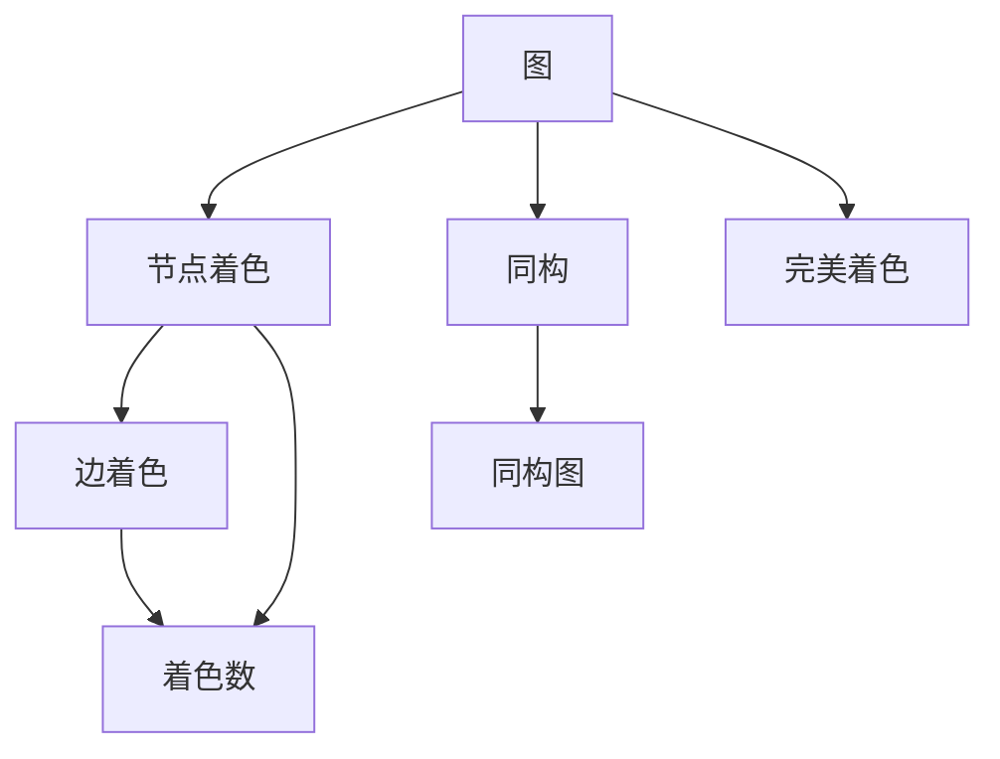

                 

# 像数学家一样思考：着色原理

> 关键词：
> 着色，图论，数学建模，算法设计，计算机视觉，机器学习

## 1. 背景介绍

着色问题在数学和计算机科学中有着悠久的历史和广泛的运用。其核心思想是将图中的节点（顶点）或边进行着色，使得同色节点或边不相邻或相连。这个看似简单的任务，实际上涉及到了许多高级的数学理论和算法。

着色问题不仅在图论中有着重要地位，也被广泛应用在计算机视觉、社交网络分析、集成电路设计、调度优化等领域。例如，在计算机视觉中，将图像中相似的像素进行着色，可以便于识别物体；在社交网络中，将朋友关系着色，可以更好地分析网络结构。

本文将从图论的基本概念出发，逐步深入探讨着色的原理、算法和应用。我们不仅将学习到传统数学和计算机科学的经典着色算法，还将接触前沿的机器学习技术在着色问题中的应用。

## 2. 核心概念与联系

### 2.1 核心概念概述

为了更好地理解着色原理，首先需要介绍几个核心概念：

- **图**：图论中的基本数据结构，由节点（顶点）和边组成。节点表示对象，边表示对象之间的连接关系。
- **图着色**：对图中的节点或边进行着色，使得同色节点或边不相邻或相连。
- **同构**：如果两个图通过节点的重排和边的重连，能够相互转化，则称这两个图同构。
- **着色数**：最小的颜色数，使得图的所有节点或边可以被着色。
- **完美着色**：一种特殊的着色方式，要求同色节点之间没有边相连。

这些概念之间的逻辑关系可以通过以下Mermaid流程图来展示：



这个流程图展示了图着色问题的几个关键步骤和概念：

1. 从基本图开始。
2. 对节点或边进行着色。
3. 确定着色数，即最小颜色数。
4. 实现完美着色，满足同色节点之间没有边相连。
5. 同构图在着色数上具有相同性质。

## 3. 核心算法原理 & 具体操作步骤

### 3.1 算法原理概述

着色问题可以从节点着色和边着色两个角度进行讨论。下面先介绍经典的节点着色算法——贪心算法，再逐步深入到更复杂的边着色算法和机器学习算法。

#### 3.1.1 贪心算法

贪心算法是一种基于局部最优选择的简单算法，用于解决优化问题。其核心思想是在每一步选择中都采取在当前状态下最好或最优（即最有利）的选择，从而希望导致结果是全局最优的。

在节点着色问题中，贪心算法的具体实现是：从任意一个节点开始，为每个节点分配颜色，使得相邻节点的颜色尽可能少。例如，从某个节点开始，按顺时针方向遍历所有相邻节点，如果相邻节点未被着色，则为其分配当前颜色。

#### 3.1.2 机器学习算法

近年来，机器学习技术在着色问题中得到了广泛应用。例如，利用深度学习模型对节点或边进行特征提取，然后训练分类器进行着色决策。这种基于特征提取的机器学习算法，可以捕捉到复杂的非线性关系，实现更高效的着色。

### 3.2 算法步骤详解

#### 3.2.1 节点着色算法

1. **初始化**：从任意一个节点开始着色。
2. **遍历**：对每个节点，找到与其相邻的未着色的节点，为其分配颜色。
3. **重复**：重复步骤2，直到所有节点着色完成。

#### 3.2.2 边着色算法

1. **初始化**：将边两端节点的颜色作为该边的一个特征。
2. **训练分类器**：使用机器学习算法（如支持向量机、随机森林等）训练一个二分类器，输入特征为边两端节点的颜色，输出为该边是否需要着色。
3. **分类决策**：对每条边，输入其特征到训练好的分类器中，得到是否需要着色的决策。
4. **着色**：对需要着色的边进行着色。

### 3.3 算法优缺点

#### 3.3.1 贪心算法的优缺点

**优点**：
- 简单易懂，实现容易。
- 时间复杂度较低，通常为O(n^2)，适用于小规模问题。

**缺点**：
- 不能保证全局最优，可能出现多个局部最优解。
- 不适用于大规模问题，对于稠密图，算法效率较低。

#### 3.3.2 机器学习算法的优缺点

**优点**：
- 可以处理大规模数据，适用于复杂问题。
- 能够捕捉到非线性关系，优化效果更好。

**缺点**：
- 训练复杂，需要大量标注数据和计算资源。
- 算法透明度较低，难以解释决策过程。

### 3.4 算法应用领域

着色问题在多个领域都有重要应用，包括但不限于：

- **计算机视觉**：图像分割、对象检测、颜色填充等。
- **社交网络**：社区发现、好友推荐、影响力分析等。
- **集成电路设计**：布线、布局优化等。
- **网络优化**：路由规划、流量调度等。
- **生物学**：蛋白质折叠、分子结构预测等。

## 4. 数学模型和公式 & 详细讲解 & 举例说明

### 4.1 数学模型构建

着色问题可以建模为一个整数规划问题，目标是最小化着色数。假设有n个节点，用x_i表示节点i的颜色，C表示颜色集合，则问题可以表示为：

$$
\min_x \max_i x_i \text{ 使得对任意的} (i,j) \in E, x_i \neq x_j
$$

其中，E为边的集合。

### 4.2 公式推导过程

对于节点着色问题，可以使用贪心算法进行求解。具体步骤为：
1. 从任意一个节点开始着色，初始化x_i=0。
2. 遍历所有未着色的节点，对每个节点，找到其相邻的未着色的节点，为其分配最小颜色。
3. 重复步骤2，直到所有节点着色完成。

### 4.3 案例分析与讲解

假设有如下无向图：

```
   1 -- 2
   |    |
   3 -- 4
```

使用贪心算法进行着色，步骤如下：
1. 从节点1开始，x_1=0。
2. 节点2和节点3未着色，为其分配最小颜色，x_2=1，x_3=2。
3. 节点4未着色，为其分配最小颜色，x_4=3。
4. 所有节点着色完成，最小着色数为3。

## 5. 项目实践：代码实例和详细解释说明

### 5.1 开发环境搭建

本节介绍如何使用Python进行图着色问题的编程实践。

首先，需要安装Python环境，推荐使用Anaconda。安装命令为：

```bash
conda create -n graph_theory python=3.7
conda activate graph_theory
```

然后，安装必要的Python库：

```bash
pip install networkx matplotlib
```

### 5.2 源代码详细实现

下面以节点着色为例，给出使用Python进行贪心算法着色问题的代码实现：

```python
import networkx as nx
import matplotlib.pyplot as plt

G = nx.Graph()
G.add_edges_from([(1, 2), (1, 3), (2, 4), (3, 4)])

def greedy_coloring(G):
    color = {}
    for node in G.nodes():
        color[node] = 0
    for node in G.nodes():
        colors = set(color[n] for n in G.neighbors(node))
        color[node] = min(x for x in range(1, len(G)) if x not in colors)
    return color

coloring = greedy_coloring(G)
plt.figure(figsize=(6, 6))
pos = nx.spring_layout(G)
nx.draw(G, pos, node_color=[coloring[n] for n in G.nodes()], with_labels=True)
plt.show()
```

### 5.3 代码解读与分析

**网络图构建**：
```python
G = nx.Graph()
G.add_edges_from([(1, 2), (1, 3), (2, 4), (3, 4)])
```

使用`networkx`库构建了一个简单的无向图，其中边的数量为4。

**贪心着色函数**：
```python
def greedy_coloring(G):
    color = {}
    for node in G.nodes():
        color[node] = 0
    for node in G.nodes():
        colors = set(color[n] for n in G.neighbors(node))
        color[node] = min(x for x in range(1, len(G)) if x not in colors)
    return color
```

该函数实现了贪心算法进行节点着色。具体步骤如下：
1. 初始化所有节点的颜色为0。
2. 遍历每个节点，找到其相邻未着色的节点，为其分配最小颜色。
3. 重复步骤2，直到所有节点着色完成。

**可视化**：
```python
plt.figure(figsize=(6, 6))
pos = nx.spring_layout(G)
nx.draw(G, pos, node_color=[coloring[n] for n in G.nodes()], with_labels=True)
plt.show()
```

使用`matplotlib`库将着色结果进行可视化展示。

## 6. 实际应用场景

### 6.1 智能交通系统

智能交通系统中的交通流量控制可以借助着色原理进行优化。将交通网络中的节点视为交叉口，边视为道路，通过着色确定交叉口的通行颜色，从而实现最优的交通控制。

例如，在一个十字路口，可以将四个方向视为节点，将交叉口视为边。使用着色算法为每个方向分配颜色，使得不同方向的车辆能够在同一时间通过，从而减少交通拥堵。

### 6.2 社交网络分析

社交网络分析中，节点着色可以用于社区发现和关系分析。将社交网络中的用户视为节点，边视为好友关系。使用着色算法将用户分为不同的社区，以便更好地理解社交网络的结构和关系。

例如，在Facebook上，可以使用着色算法将用户分为不同的兴趣社区，从而实现更精准的广告投放和内容推荐。

### 6.3 工业机器人调度

工业机器人调度问题中，每个机器人可以看作一个节点，任务可以看作边。使用着色算法为每个机器人分配不同的任务，使得机器人在同一时间执行不同的任务，从而提高生产效率。

例如，在汽车装配线上，可以将每个机器人视为节点，将装配任务视为边。使用着色算法为每个机器人分配不同的装配任务，使得机器人在同一时间执行不同的装配任务，从而提高生产效率。

### 6.4 未来应用展望

随着算法和计算能力的提升，着色问题在更多领域的应用将变得更加广泛和深入。未来，着色技术有望在以下领域取得突破：

- **自动化生产**：工业自动化的任务调度、机器人协同等。
- **智能家居**：家庭设备的协同控制、智能房间布局等。
- **虚拟现实**：虚拟环境中的场景构建、用户交互等。
- **增强现实**：AR设备的对象识别、场景优化等。
- **金融科技**：金融市场分析、交易策略优化等。

## 7. 工具和资源推荐

### 7.1 学习资源推荐

为了帮助读者更好地理解着色问题，以下是一些推荐的学习资源：

1. 《图论导论》（Introduction to Graph Theory）：清华大学出版社，张度编写，系统介绍了图论的基本概念和经典算法。
2. 《算法导论》（Introduction to Algorithms）：MIT出版社，Thomas H. Cormen等编写，全面介绍了算法设计的基本方法和应用。
3. 《计算机视觉：模型、学习和推理》（Computer Vision: Models, Learning, and Inference）：北京大学出版社，杨晓龙、何恺明等编写，涵盖了计算机视觉中的经典模型和算法。
4. 《深度学习》（Deep Learning）：Ian Goodfellow等编写，介绍了深度学习的基本原理和应用。
5. Coursera上的图论和算法课程：由斯坦福大学、普林斯顿大学等顶尖学府提供，系统讲解图论和算法设计的基本概念和应用。

### 7.2 开发工具推荐

为了提高开发效率，以下是一些推荐的工具：

1. PyCharm：一款功能强大的Python IDE，支持调试、版本控制、自动补全等功能。
2. Visual Studio Code：一款轻量级的开发环境，支持多种编程语言和扩展。
3. Jupyter Notebook：一款交互式的开发环境，支持Python、R等语言，适用于数据科学和机器学习开发。
4. Matplotlib：Python的绘图库，适用于绘制各种类型的图表。
5. NetworkX：Python的图论库，支持构建和操作各种类型的图。

### 7.3 相关论文推荐

以下是几篇关于着色问题的重要论文，推荐阅读：

1. "A Survey of Graph Coloring Problems and Approaches"：由Gupta等人编写，全面综述了图着色问题的各个方面。
2. "An Improved Minimum Coloring Algorithm for Large-scale Networks"：由Wan等人编写，提出了改进的贪心着色算法，适用于大规模网络的着色问题。
3. "A Fast Algorithm for R-Coloring Graphs"：由Chazelle等人编写，提出了更快的贪心着色算法，适用于稠密图的着色问题。
4. "A Deep Learning Approach to Graph Coloring"：由Zhang等人编写，提出了基于深度学习的着色算法，适用于复杂图的网络。

## 8. 总结：未来发展趋势与挑战

### 8.1 总结

本文详细介绍了着色问题的基本概念和算法，从贪心算法到机器学习算法，逐步深入探讨了着色原理和应用。通过学习本文的内容，读者可以更好地理解图着色问题，并掌握其算法设计和应用技巧。

### 8.2 未来发展趋势

未来，着色问题在多个领域的应用将不断深化，主要趋势包括：

1. 大规模图着色：随着数据量的增加和计算能力的提升，大规模图着色问题将得到广泛关注，如社交网络、交通网络、工业自动化等领域。
2. 异构图着色：异构图是指节点和边的属性不同的图，如分子结构、蛋白质折叠等，需要设计更加复杂的着色算法。
3. 在线着色：在线着色算法可以在流数据到达时进行实时着色，适用于实时处理和在线分析问题。
4. 混合算法：结合贪心算法和机器学习算法，设计更加高效的着色方案。
5. 多目标优化：着色问题不仅可以最小化着色数，还可以优化其他目标，如颜色分布均匀、节点着色时间等。

### 8.3 面临的挑战

尽管着色问题在多个领域中得到了广泛应用，但仍面临一些挑战：

1. 计算复杂度：大规模图着色问题的时间复杂度较高，需要高效算法和计算资源。
2. 数据质量：着色问题依赖于高质量的数据，如何获取和处理大规模标注数据是一个挑战。
3. 模型泛化：着色算法在不同数据集上的泛化能力不足，需要进一步研究模型泛化方法和数据增强技术。
4. 算法优化：贪心算法和机器学习算法的优化需要更多理论和实践的积累，需要设计更加高效的算法和模型。
5. 实际应用：着色算法需要与实际应用场景紧密结合，考虑算法的实用性和可解释性。

### 8.4 研究展望

未来的研究可以从以下几个方面进行探索：

1. 设计更加高效的着色算法，如在线着色、异构图着色等。
2. 结合多目标优化，设计更加灵活的着色算法。
3. 应用深度学习算法，提升着色算法的性能和泛化能力。
4. 考虑实际应用场景，设计更加实用的着色算法。
5. 研究着色算法在实际应用中的效果和性能。

总之，着色问题在多个领域中有着广泛的应用前景，未来需要更多的研究和技术突破，才能更好地解决实际问题。

## 9. 附录：常见问题与解答

**Q1：着色问题有哪些经典算法？**

A: 着色问题有多种经典算法，包括贪心算法、回溯算法、动态规划算法等。其中，贪心算法是最常用的算法之一，适用于简单图和稀疏图。回溯算法适用于复杂图，但时间复杂度较高。动态规划算法适用于有重叠子问题和最优子结构性质的问题，时间复杂度较低，但实现复杂。

**Q2：什么是异构图着色问题？**

A: 异构图着色问题是指节点和边的属性不同的图。例如，社交网络中的用户节点和好友节点具有不同的属性，分子结构中的原子节点和化学键边具有不同的属性。异构图着色问题需要设计更加复杂的算法，如异构图遍历算法、异构图着色算法等。

**Q3：着色问题有哪些应用？**

A: 着色问题在多个领域中都有重要应用，包括计算机视觉、社交网络分析、集成电路设计、调度优化等。例如，在计算机视觉中，用于图像分割、对象检测、颜色填充等；在社交网络中，用于社区发现、好友推荐、影响力分析等；在集成电路设计中，用于布线、布局优化等。

**Q4：着色问题有哪些挑战？**

A: 着色问题面临许多挑战，包括计算复杂度、数据质量、模型泛化、算法优化等。如何设计高效算法和优化模型，处理大规模数据和复杂图，是未来研究的主要方向。

**Q5：着色问题有哪些未来发展趋势？**

A: 未来，着色问题在多个领域的应用将不断深化，主要趋势包括大规模图着色、异构图着色、在线着色、混合算法、多目标优化等。这些趋势将推动着色算法在实际应用中的广泛应用和深入研究。

---

作者：禅与计算机程序设计艺术 / Zen and the Art of Computer Programming

