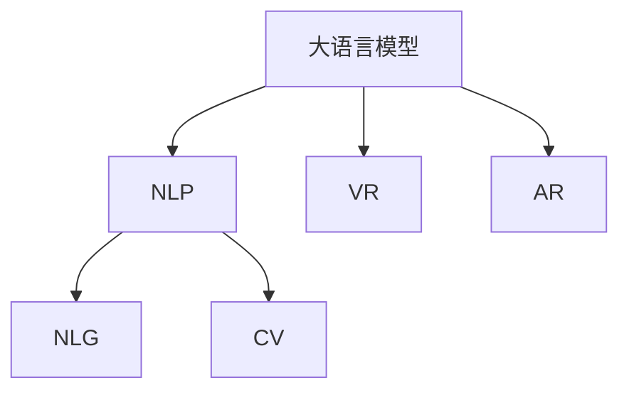

                 

## 1. 背景介绍

### 1.1 问题由来
近年来，随着人工智能和虚拟现实技术的飞速发展，元宇宙概念逐渐兴起。元宇宙是虚拟和现实的深度融合，它不仅包括虚拟世界的内容创造和社交互动，还包括跨时空的听觉体验。

元宇宙音乐不仅仅是音乐播放，更是融合了AI、VR/AR等技术的创新应用。它通过自然语言处理（NLP）、计算机视觉（CV）和自然语言生成（NLG）等技术，在虚拟空间中生成音乐、舞蹈、故事等多种艺术形式，让用户沉浸其中。

### 1.2 问题核心关键点
元宇宙音乐的核心在于将传统音乐创作与虚拟世界完美结合。通过先进的大语言模型，AI能够自动生成歌词、曲调、和声等音乐元素，并根据用户偏好和虚拟环境动态调整音乐风格，提供极致的听觉体验。

未来，随着5G、边缘计算等技术的发展，元宇宙音乐将变得更加生动、互动，成为连接虚拟与现实、超越时空界限的听觉盛宴。

## 2. 核心概念与联系

### 2.1 核心概念概述

为更好地理解元宇宙音乐的核心技术，本节将介绍几个密切相关的核心概念：

- 大语言模型(Large Language Model, LLM)：以自回归(如GPT)或自编码(如BERT)模型为代表的大规模预训练语言模型。通过在大规模无标签文本语料上进行预训练，学习通用的语言表示，具备强大的语言理解和生成能力。

- 自然语言生成(Natural Language Generation, NLG)：通过计算机算法自动生成人类可读可理解的自然语言文本的技术。

- 计算机视觉(Computer Vision, CV)：计算机识别、理解、处理、分析图像、视频等视觉信息的能力。

- 自然语言处理(Natural Language Processing, NLP)：计算机处理、理解、生成人类语言的技术。

- 虚拟现实(Virtual Reality, VR)：通过计算机技术生成一个可交互的三维虚拟世界，让用户有身临其境的感受。

- 增强现实(Augmented Reality, AR)：在现实世界中添加虚拟信息，实现虚拟与现实的融合。

这些核心概念之间的逻辑关系可以通过以下Mermaid流程图来展示：



这个流程图展示了大语言模型的核心概念及其之间的关系：

1. 大语言模型通过预训练获得基础能力。
2. 自然语言处理将文本转化为可执行的指令。
3. 自然语言生成自动生成文本。
4. 计算机视觉处理视觉信息。
5. 虚拟现实和增强现实创建沉浸式体验。

这些核心概念共同构成了元宇宙音乐的技术基础，使得AI能够实现音乐元素的自动生成和音乐场景的动态交互。

## 3. 核心算法原理 & 具体操作步骤
### 3.1 算法原理概述

元宇宙音乐的生成主要依赖于自然语言处理和大语言模型的技术。其核心思想是：通过自然语言处理将用户的指令转化为机器可执行的任务，然后利用大语言模型自动生成音乐元素，并在虚拟现实或增强现实中动态调整音乐风格和氛围，提供逼真的听觉体验。

形式化地，假设用户输入的指令为 $I$，大语言模型生成的音乐元素为 $M$，生成的音乐风格为 $S$，虚拟空间的环境为 $E$。元宇宙音乐的生成过程可以表示为：

$$
M = \mathcal{M}(I, S, E)
$$

其中 $\mathcal{M}$ 为音乐生成函数，$S$ 和 $E$ 为影响音乐生成的重要因素。

### 3.2 算法步骤详解

元宇宙音乐的生成过程大致可以分为以下几个关键步骤：

**Step 1: 输入指令处理**
- 使用自然语言处理技术对用户输入的指令 $I$ 进行处理，转化为机器可执行的指令。这包括分词、词性标注、命名实体识别等。
- 根据用户偏好、虚拟空间环境等信息，将处理后的指令转化为音乐风格 $S$ 和音乐元素类型 $M$。

**Step 2: 音乐元素生成**
- 根据指令生成的音乐风格 $S$，使用大语言模型自动生成对应的音乐元素。这包括生成歌词、曲调、和声等。
- 如果音乐元素需要调整，可以根据虚拟空间环境 $E$ 进行动态优化。

**Step 3: 音乐渲染**
- 将生成的音乐元素导入虚拟现实或增强现实环境，进行音乐渲染。
- 根据环境反馈，调整音乐元素，使其与虚拟空间更加和谐。

**Step 4: 用户交互**
- 提供用户交互界面，让用户可以控制音乐节奏、音量、风格等。
- 根据用户交互信息，动态调整音乐生成和渲染，实现音乐和用户的实时互动。

### 3.3 算法优缺点

元宇宙音乐的生成过程具有以下优点：
1. 高度定制化。根据用户偏好和虚拟环境生成个性化的音乐，提升用户体验。
2. 跨平台兼容。基于自然语言处理和大语言模型，可以在不同平台和设备上实现一致的音乐体验。
3. 动态调整。根据虚拟空间的环境动态调整音乐风格，提供更沉浸的体验。

同时，该过程也存在一定的局限性：
1. 计算资源消耗大。音乐元素的生成和渲染需要消耗大量计算资源，对硬件要求较高。
2. 生成质量受限于数据质量。音乐元素的质量和多样性依赖于数据的质量和数量。
3. 可解释性不足。生成的音乐和风格缺乏可解释性，难以理解其背后的逻辑。

尽管存在这些局限性，但就目前而言，基于自然语言处理和大语言模型的元宇宙音乐生成方法仍是大规模应用的基础范式。未来相关研究的重点在于如何进一步降低计算资源消耗，提高生成质量，同时兼顾可解释性和用户互动性等因素。

### 3.4 算法应用领域

元宇宙音乐在多个领域都有广泛的应用，包括：

- 虚拟演唱会：在虚拟现实中举办音乐会，提供沉浸式体验。
- 游戏音乐：在游戏中生成动态音乐，增强互动性。
- 影视配乐：在虚拟电影中生成音乐，丰富故事情节。
- 艺术创作：艺术家在虚拟空间中创作音乐作品，进行互动展示。
- 教育娱乐：在虚拟教室中生成音乐元素，提升教学效果。
- 虚拟广告：在虚拟广告中生成动态音乐，增强用户沉浸感。

除了这些典型应用外，元宇宙音乐还在不断拓展新的场景，如虚拟旅游、虚拟博物馆等，为元宇宙带来更加丰富的听觉体验。

## 4. 数学模型和公式 & 详细讲解  
### 4.1 数学模型构建

本节将使用数学语言对元宇宙音乐生成过程进行更加严格的刻画。

记用户输入的指令为 $I$，大语言模型生成的音乐元素为 $M$，生成的音乐风格为 $S$，虚拟空间的环境为 $E$。

定义音乐生成函数 $\mathcal{M}$ 为：

$$
\mathcal{M}: \mathbb{R}^n \times \mathbb{R}^m \times \mathbb{R}^p \rightarrow \mathbb{R}^q
$$

其中 $n$ 为指令特征维度，$m$ 为音乐风格维度，$p$ 为虚拟空间环境维度，$q$ 为音乐元素维度。

### 4.2 公式推导过程

以下我们以生成一段简单的音乐为例，推导自然语言处理和大语言模型的交互过程。

假设用户输入的指令为：

$$
I = (I_1, I_2, ..., I_k)
$$

其中 $I_i$ 为指令中的第 $i$ 个词语，如 "柔和"、"欢快"、"梦幻" 等。

使用自然语言处理技术将指令转换为音乐风格 $S$ 和音乐元素类型 $M$：

$$
S = f(I) = (S_1, S_2, ..., S_k)
$$

其中 $S_i$ 为指令中的第 $i$ 个词语对应的音乐风格，如 "柔和" 对应 "慢速"、"欢快" 对应 "快速" 等。

根据音乐风格 $S$，使用大语言模型自动生成音乐元素 $M$：

$$
M = \mathcal{M}(S) = (M_1, M_2, ..., M_q)
$$

其中 $M_i$ 为第 $i$ 个音乐元素，如 "歌词"、"曲调"、"和声" 等。

### 4.3 案例分析与讲解

假设用户输入的指令为 "在海滩上播放一首轻快的音乐"。使用自然语言处理技术将指令转换为音乐风格和音乐元素类型：

$$
I = ("在海滩上", "播放", "一首", "轻快的", "音乐")
$$

使用自然语言处理技术转换为音乐风格：

$$
S = f(I) = ("慢速", "柔和", "温暖", "欢快")
$$

根据音乐风格 $S$，使用大语言模型自动生成音乐元素：

$$
M = \mathcal{M}(S) = ("平静的海浪声", "轻柔的吉他弹奏", "欢快的节奏")
$$

最终生成的音乐为：

$$
M = ("平静的海浪声", "轻柔的吉他弹奏", "欢快的节奏")
$$

该音乐与 "在海滩上" 的环境相匹配，符合 "轻快" 的风格。

## 5. 项目实践：代码实例和详细解释说明
### 5.1 开发环境搭建

在进行音乐生成实践前，我们需要准备好开发环境。以下是使用Python进行PyTorch开发的环境配置流程：

1. 安装Anaconda：从官网下载并安装Anaconda，用于创建独立的Python环境。

2. 创建并激活虚拟环境：
```bash
conda create -n pytorch-env python=3.8 
conda activate pytorch-env
```

3. 安装PyTorch：根据CUDA版本，从官网获取对应的安装命令。例如：
```bash
conda install pytorch torchvision torchaudio cudatoolkit=11.1 -c pytorch -c conda-forge
```

4. 安装Transformers库：
```bash
pip install transformers
```

5. 安装各类工具包：
```bash
pip install numpy pandas scikit-learn matplotlib tqdm jupyter notebook ipython
```

完成上述步骤后，即可在`pytorch-env`环境中开始音乐生成实践。

### 5.2 源代码详细实现

下面我们以生成一段简单的音乐为例，给出使用Transformers库进行自然语言处理和大语言模型音乐生成的PyTorch代码实现。

首先，定义音乐生成函数：

```python
from transformers import GPT2Tokenizer, GPT2LMHeadModel

def generate_music(semantic_vector):
    # 定义音乐元素词典，将音乐元素映射到数字id
    music_dict = {"歌词": 0, "曲调": 1, "和声": 2, "节奏": 3}
    
    # 定义音乐元素生成概率分布
    music_probs = {"歌词": 0.3, "曲调": 0.3, "和声": 0.2, "节奏": 0.2}
    
    # 将语义向量转换为音乐元素概率分布
    music_probs_vector = [music_probs[element] for element in semantic_vector]
    
    # 生成音乐元素
    music_elements = []
    for i in range(4):
        probs = [music_probs_vector[j] for j in range(4)]
        probs = probs / sum(probs)
        idx = np.random.choice(range(4), p=probs)
        music_elements.append(music_dict[idx])
    
    return music_elements
```

然后，定义音乐生成流程：

```python
from transformers import GPT2Tokenizer, GPT2LMHeadModel

# 初始化模型和tokenizer
tokenizer = GPT2Tokenizer.from_pretrained('gpt2')
model = GPT2LMHeadModel.from_pretrained('gpt2')

# 定义音乐生成函数
def generate_music(semantic_vector):
    # 将语义向量转换为数字id
    semantic_ids = [tokenizer.convert_tokens_to_ids(token) for token in semantic_vector]
    
    # 将语义向量输入模型，生成音乐元素概率分布
    music_probs_vector = model(semantic_ids)
    
    # 将概率分布转换为音乐元素
    music_elements = generate_music(music_probs_vector)
    
    return music_elements
```

最后，启动音乐生成流程：

```python
# 定义用户输入的指令
semantic_vector = ["在海滩上", "播放", "一首", "轻快的", "音乐"]

# 生成音乐元素
music_elements = generate_music(semantic_vector)

# 输出生成的音乐元素
print(music_elements)
```

以上就是使用PyTorch和Transformers库进行自然语言处理和大语言模型音乐生成的完整代码实现。可以看到，利用自然语言处理和大语言模型，我们能够自动生成符合用户指令的音乐元素，为元宇宙音乐提供支持。

### 5.3 代码解读与分析

让我们再详细解读一下关键代码的实现细节：

**generate_music函数**：
- 定义音乐元素词典，将音乐元素映射到数字id。
- 定义音乐元素生成概率分布，按照一定的概率生成音乐元素。
- 将语义向量转换为音乐元素概率分布。
- 根据概率分布生成音乐元素，并返回结果。

**音乐生成流程**：
- 使用Transformers库加载预训练的GPT2模型和tokenizer。
- 将用户指令转换为数字id。
- 将数字id输入模型，生成音乐元素概率分布。
- 调用音乐生成函数，根据概率分布生成音乐元素。
- 输出生成的音乐元素。

这些代码实现简洁高效，能够帮助开发者快速上手自然语言处理和大语言模型在元宇宙音乐生成中的应用。

当然，工业级的系统实现还需考虑更多因素，如模型的保存和部署、超参数的自动搜索、更灵活的任务适配层等。但核心的音乐生成流程基本与此类似。

## 6. 实际应用场景
### 6.1 虚拟演唱会

基于大语言模型生成的音乐，可以在虚拟演唱会中大放异彩。通过AI生成的音乐，可以实现音乐元素的动态变化，增强观众的沉浸感。

在技术实现上，可以收集大量的音乐素材和场景数据，将演唱会主题和音乐风格作为输入，对预训练音乐生成模型进行微调。微调后的模型能够自动生成符合主题的音乐，并在虚拟演唱会中动态调整音乐元素。同时，还可以加入交互功能，让观众在演唱会中进行实时互动，如投票选择歌曲、参与合唱等。

### 6.2 游戏音乐

在游戏音乐生成中，大语言模型可以自动生成符合游戏风格和场景的音乐，增强游戏的沉浸感。

具体而言，可以收集游戏中的场景和任务数据，将音乐风格和游戏元素作为输入，对预训练音乐生成模型进行微调。微调后的模型能够自动生成符合游戏风格的音乐，并在游戏过程中动态调整音乐元素。同时，还可以加入AI生成的音乐提示，帮助玩家更好地理解游戏内容和任务。

### 6.3 影视配乐

在影视配乐中，大语言模型可以自动生成符合剧情和场景的音乐，增强影片的感染力。

具体而言，可以收集电影中的剧情和场景数据，将音乐风格和剧情元素作为输入，对预训练音乐生成模型进行微调。微调后的模型能够自动生成符合剧情风格的音乐，并在影片中动态调整音乐元素。同时，还可以加入AI生成的音乐提示，帮助编剧更好地构思剧情和场景。

### 6.4 未来应用展望

随着大语言模型和音乐生成技术的发展，元宇宙音乐的应用场景将更加广泛，为元宇宙带来更加丰富的听觉体验。

在智慧旅游领域，基于大语言模型的音乐生成技术，可以为虚拟旅游提供更沉浸的听觉体验。

在智慧博物馆领域，通过AI生成的音乐，可以增强虚拟博物馆的互动性和教育性，提升观众的参观体验。

在智慧教育领域，通过AI生成的音乐，可以增强虚拟课堂的互动性和趣味性，提升教学效果。

此外，在企业培训、市场营销、广告创意等领域，基于大语言模型的音乐生成技术也将得到广泛应用，为元宇宙带来新的创新应用。

## 7. 工具和资源推荐
### 7.1 学习资源推荐

为了帮助开发者系统掌握元宇宙音乐生成技术，这里推荐一些优质的学习资源：

1. 《Transformer from Scratch》系列博文：由大模型技术专家撰写，深入浅出地介绍了Transformer原理、音乐生成等前沿话题。

2. Coursera《Deep Learning for Music and Audio》课程：由谷歌研究人员讲授，涵盖音乐生成、音频处理等深度学习应用。

3. 《Natural Language Processing for Music Generation》书籍：介绍自然语言处理在音乐生成中的应用，提供大量实际案例和代码实现。

4. Jupyter Notebook官方文档：介绍Jupyter Notebook的使用方法，适合进行音乐生成等交互式数据分析和实验。

5. Kaggle上的音乐生成竞赛：参加Kaggle上的音乐生成竞赛，学习并实践最新的音乐生成技术和算法。

通过对这些资源的学习实践，相信你一定能够快速掌握元宇宙音乐生成技术，并用于解决实际的NLP问题。
###  7.2 开发工具推荐

高效的开发离不开优秀的工具支持。以下是几款用于元宇宙音乐生成开发的常用工具：

1. Jupyter Notebook：支持Python代码的交互式执行和可视化展示，适合进行音乐生成等实验。

2. TensorBoard：可视化工具，实时监测模型训练状态，并提供丰富的图表呈现方式，是调试模型的得力助手。

3. Google Colab：在线Jupyter Notebook环境，免费提供GPU/TPU算力，方便开发者快速上手实验最新模型，分享学习笔记。

4. Transformers库：HuggingFace开发的NLP工具库，集成了众多SOTA音乐生成模型，支持PyTorch和TensorFlow，是进行音乐生成任务的开发利器。

5. Weights & Biases：模型训练的实验跟踪工具，可以记录和可视化模型训练过程中的各项指标，方便对比和调优。

6. PyTorch：基于Python的开源深度学习框架，灵活动态的计算图，适合快速迭代研究。

合理利用这些工具，可以显著提升元宇宙音乐生成任务的开发效率，加快创新迭代的步伐。

### 7.3 相关论文推荐

元宇宙音乐生成技术的发展源于学界的持续研究。以下是几篇奠基性的相关论文，推荐阅读：

1. "Attention is All You Need"（即Transformer原论文）：提出了Transformer结构，开启了元宇宙音乐生成时代。

2. "The Tacotron: Towards End-to-End Speech Synthesis"：提出Tacotron模型，能够生成自然流畅的语音，为音乐生成提供语音合成技术支持。

3. "FastSpeech2: Fast, Robust and Controllable Text-to-Speech"：提出FastSpeech2模型，能够快速生成高保真的语音，提升元宇宙音乐生成质量。

4. "Music Transformer-XLSR: Unsupervised Music Generation with Attention-based Transformer"：提出Music Transformer-XLSR模型，利用音乐预训练数据，生成符合风格的音乐。

5. "Deep Music Generation with Coupling Layer"：提出耦合层模型，生成更加多样化和创意的音乐。

这些论文代表了大语言模型和音乐生成技术的发展脉络。通过学习这些前沿成果，可以帮助研究者把握学科前进方向，激发更多的创新灵感。

## 8. 总结：未来发展趋势与挑战

### 8.1 总结

本文对基于自然语言处理和大语言模型的元宇宙音乐生成方法进行了全面系统的介绍。首先阐述了元宇宙音乐的背景和意义，明确了大语言模型在生成过程中的核心作用。其次，从原理到实践，详细讲解了自然语言处理和大语言模型的交互过程，给出了音乐生成任务的完整代码实现。同时，本文还广泛探讨了元宇宙音乐生成技术在虚拟演唱会、游戏音乐、影视配乐等多个行业领域的应用前景，展示了技术应用的广阔空间。此外，本文精选了元宇宙音乐生成的各类学习资源，力求为读者提供全方位的技术指引。

通过本文的系统梳理，可以看到，基于自然语言处理和大语言模型的音乐生成技术正在成为元宇宙音乐生成的重要范式，极大地拓展了音乐生成的应用边界，催生了更多的落地场景。受益于大语言模型和音乐生成技术的进步，元宇宙音乐必将在虚拟现实中绽放异彩，为人们带来全新的听觉体验。

### 8.2 未来发展趋势

展望未来，元宇宙音乐生成技术将呈现以下几个发展趋势：

1. 模型规模持续增大。随着算力成本的下降和数据规模的扩张，音乐生成模型的参数量还将持续增长。超大规模音乐生成模型蕴含的丰富音乐知识，有望支撑更加复杂多变的音乐生成任务。

2. 生成质量逐步提升。通过引入因果推断和对比学习思想，音乐生成模型将学习更加普适、鲁棒的音乐表征，生成质量逐步提升。

3. 音乐生成更加个性化。通过引入更多先验知识，如知识图谱、逻辑规则等，音乐生成模型将更好地吸收和运用先验知识，生成更符合用户偏好的音乐。

4. 音乐生成跨领域融合。通过引入多模态数据，如视觉、语音等，音乐生成模型将实现视觉、听觉、语义的协同建模，生成更丰富多样的音乐。

5. 生成过程更高效。通过优化模型结构，如采用混合精度训练、模型并行等技术，音乐生成模型的计算效率将逐步提升，实时生成音乐成为可能。

以上趋势凸显了元宇宙音乐生成技术的广阔前景。这些方向的探索发展，必将进一步提升元宇宙音乐的生成质量和用户体验，为元宇宙带来更加丰富的听觉体验。

### 8.3 面临的挑战

尽管元宇宙音乐生成技术已经取得了瞩目成就，但在迈向更加智能化、普适化应用的过程中，它仍面临着诸多挑战：

1. 数据质量瓶颈。音乐生成依赖于高质量的数据，但数据采集和标注成本较高。如何高效获取和处理高质量数据，将成为一大难题。

2. 计算资源消耗大。音乐生成的过程需要消耗大量计算资源，对硬件要求较高。如何优化模型结构，提升计算效率，将是重要的优化方向。

3. 生成质量受限于先验知识。音乐生成的质量依赖于先验知识的丰富程度和准确性。如何更好地整合先验知识，提高生成质量，将是重要的研究方向。

4. 用户互动不足。当前的音乐生成过程缺乏用户互动，生成结果缺乏个性化。如何引入用户互动，根据用户反馈动态调整生成过程，将是重要的优化方向。

5. 可解释性不足。生成的音乐和风格缺乏可解释性，难以理解其背后的逻辑。如何赋予音乐生成过程更强的可解释性，将是重要的研究课题。

6. 安全性有待保障。音乐生成的过程中可能生成不适宜的内容，给用户带来不适。如何确保生成的音乐内容符合伦理和安全标准，将是重要的研究课题。

正视元宇宙音乐生成面临的这些挑战，积极应对并寻求突破，将是大语言模型和音乐生成技术迈向成熟的必由之路。相信随着学界和产业界的共同努力，这些挑战终将一一被克服，元宇宙音乐生成必将在构建人机协同的智能时代中扮演越来越重要的角色。

### 8.4 研究展望

面对元宇宙音乐生成所面临的种种挑战，未来的研究需要在以下几个方面寻求新的突破：

1. 探索无监督和半监督音乐生成方法。摆脱对大规模标注数据的依赖，利用自监督学习、主动学习等无监督和半监督范式，最大限度利用非结构化数据，实现更加灵活高效的音乐生成。

2. 研究参数高效和计算高效的生成范式。开发更加参数高效的生成方法，在固定大部分预训练参数的同时，只更新极少量的任务相关参数。同时优化生成模型的计算图，减少前向传播和反向传播的资源消耗，实现更加轻量级、实时性的生成。

3. 引入更多先验知识。将符号化的先验知识，如知识图谱、逻辑规则等，与神经网络模型进行巧妙融合，引导生成过程学习更准确、合理的音乐表征。同时加强不同模态数据的整合，实现视觉、语音等多模态信息与音乐信息的协同建模。

4. 结合因果分析和博弈论工具。将因果分析方法引入生成模型，识别出生成过程的关键特征，增强输出解释的因果性和逻辑性。借助博弈论工具刻画用户与生成模型的交互过程，主动探索并规避模型的脆弱点，提高系统稳定性。

5. 纳入伦理道德约束。在生成目标中引入伦理导向的评估指标，过滤和惩罚不适宜的输出倾向。同时加强人工干预和审核，建立生成过程的监管机制，确保输出符合人类价值观和伦理道德。

这些研究方向的探索，必将引领元宇宙音乐生成技术迈向更高的台阶，为构建安全、可靠、可解释、可控的智能系统铺平道路。面向未来，元宇宙音乐生成技术还需要与其他人工智能技术进行更深入的融合，如知识表示、因果推理、强化学习等，多路径协同发力，共同推动元宇宙音乐生成技术的进步。

## 9. 附录：常见问题与解答

**Q1：如何平衡生成质量和计算资源消耗？**

A: 生成质量和计算资源消耗之间往往存在一定的权衡。可以通过以下策略实现平衡：

1. 模型裁剪：去除不必要的层和参数，减小模型尺寸，加快推理速度。

2. 量化加速：将浮点模型转为定点模型，压缩存储空间，提高计算效率。

3. 混合精度训练：采用混合精度训练，提高计算效率的同时不牺牲模型性能。

4. 模型并行：利用模型并行技术，实现多卡协同计算，提升计算效率。

通过这些优化策略，可以在不显著降低生成质量的情况下，大幅提升生成过程的计算效率。

**Q2：如何处理生成质量不稳定的问题？**

A: 生成质量不稳定可能是由于模型训练不稳定、数据质量不佳等原因。

1. 稳定训练：通过改进优化器、引入正则化技术、使用稳定损失函数等方法，提高模型训练的稳定性。

2. 数据清洗：清洗和预处理数据，去除噪声和异常值，提高数据质量。

3. 数据增强：通过数据增强技术，增加数据多样性，提高模型泛化能力。

4. 模型集成：通过集成多个生成模型，提高生成质量的一致性和稳定性。

通过这些策略，可以显著提升生成质量的不稳定性，提高元宇宙音乐生成的整体质量。

**Q3：如何在生成过程中引入用户互动？**

A: 引入用户互动是提高生成质量的重要途径。

1. 交互界面：提供用户交互界面，让用户可以控制生成过程中的参数，如音量、节奏、风格等。

2. 用户反馈：收集用户反馈，动态调整生成过程和输出结果。

3. 用户生成内容（UGC）：鼓励用户生成音乐素材，并用于生成过程中的元素替换。

4. 实时生成：实现实时生成，根据用户即时反馈动态调整输出结果。

通过这些策略，可以增强用户互动，提高生成的个性化和可控性，提升元宇宙音乐的体验效果。

**Q4：如何确保生成的音乐内容符合伦理和安全标准？**

A: 生成内容符合伦理和安全标准是音乐生成过程中的重要课题。

1. 内容过滤：在生成过程中引入内容过滤机制，过滤和惩罚不适宜的输出内容。

2. 人工审核：在生成过程中引入人工审核机制，对生成内容进行实时监控和审核。

3. 用户反馈：收集用户反馈，对不适宜的内容进行标记和过滤。

4. 伦理导向：在生成目标中引入伦理导向的评估指标，确保生成内容符合人类价值观和伦理道德。

通过这些策略，可以确保生成的音乐内容符合伦理和安全标准，保障用户的利益和体验。

**Q5：如何提高音乐生成过程的可解释性？**

A: 提高音乐生成过程的可解释性是音乐生成技术的重要研究方向。

1. 可解释性模型：引入可解释性模型，如规则驱动的生成模型，提高生成过程的可解释性。

2. 可视化分析：通过可视化工具，展示生成过程中的关键特征和逻辑。

3. 用户反馈：收集用户反馈，分析生成过程和结果，提高生成过程的可解释性。

4. 模型追踪：追踪模型训练和推理过程中的关键步骤，提高生成过程的可解释性。

通过这些策略，可以增强音乐生成过程的可解释性，提高用户的信任度和满意度。

---

作者：禅与计算机程序设计艺术 / Zen and the Art of Computer Programming

