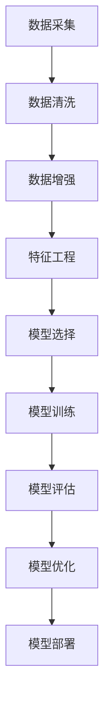

                 

# 全栈AI开发：从数据处理到模型部署

## 1. 背景介绍

### 1.1 问题由来

在人工智能（AI）快速发展的今天，从机器学习到深度学习，AI技术已经广泛应用于各个领域，包括自动驾驶、金融风控、医疗诊断、自然语言处理等。全栈AI开发是随着这些应用场景的多样化而逐渐兴起的一种全流程开发方法，旨在解决跨领域应用需求，实现从数据采集、数据处理、模型训练到模型部署的端到端开发。

### 1.2 问题核心关键点

全栈AI开发涉及的环节众多，包括数据采集、数据清洗、数据增强、特征工程、模型选择、模型训练、模型评估、模型优化、模型部署等，每一环都需要精心设计。全栈AI开发的成功与否取决于对全流程的深刻理解和全面掌握。

### 1.3 问题研究意义

研究全栈AI开发方法，有助于提升AI应用的开发效率，降低开发成本，确保AI系统的可靠性和稳定性，加速AI技术在各个行业中的落地应用。

## 2. 核心概念与联系

### 2.1 核心概念概述

为更好地理解全栈AI开发，本节将介绍几个核心概念：

- **数据采集（Data Collection）**：指从多个渠道（如日志文件、数据库、API等）收集数据的过程。数据的质量和完整性直接影响后续分析和模型训练的结果。

- **数据清洗（Data Cleaning）**：指通过去除噪声、填补缺失值、处理异常值等手段，提高数据质量，确保数据可用于分析或模型训练。

- **数据增强（Data Augmentation）**：指通过对已有数据进行旋转、翻转、缩放等变换，增加数据集的多样性，减少过拟合风险。

- **特征工程（Feature Engineering）**：指根据具体任务需求，选择合适的特征，并进行特征提取、特征组合等操作，以提高模型性能。

- **模型选择（Model Selection）**：指根据数据特征、任务类型、性能需求等因素，选择合适的机器学习或深度学习模型。

- **模型训练（Model Training）**：指使用已清洗和增强的数据，对模型进行训练，优化模型参数，使其能够在特定任务上取得最佳表现。

- **模型评估（Model Evaluation）**：指使用独立的测试集或交叉验证方法，评估模型在未知数据上的泛化能力，包括准确率、召回率、F1值等指标。

- **模型优化（Model Optimization）**：指通过调参、集成学习、模型融合等手段，提升模型性能，如减少过拟合、提高泛化能力等。

- **模型部署（Model Deployment）**：指将训练好的模型部署到生产环境，实现对新数据的实时预测或推理。

这些核心概念之间的逻辑关系可以通过以下Mermaid流程图来展示：



这个流程图展示了一个典型的全栈AI开发流程，每个环节都紧密关联，共同作用于最终的目标——构建一个高效、可靠、可解释的AI模型。

## 3. 核心算法原理 & 具体操作步骤

### 3.1 算法原理概述

全栈AI开发的核心在于构建一个高效、可靠、可解释的AI模型。具体来说，全栈AI开发包含以下几个主要环节：

- **数据采集**：从不同数据源收集数据，确保数据的多样性和完整性。
- **数据清洗**：通过数据清洗技术去除噪声、填补缺失值，提高数据质量。
- **数据增强**：通过对数据进行旋转、翻转、缩放等变换，增加数据集的多样性，减少过拟合风险。
- **特征工程**：根据具体任务需求，选择合适的特征，并进行特征提取、特征组合等操作，以提高模型性能。
- **模型选择**：根据数据特征、任务类型、性能需求等因素，选择合适的机器学习或深度学习模型。
- **模型训练**：使用已清洗和增强的数据，对模型进行训练，优化模型参数，使其能够在特定任务上取得最佳表现。
- **模型评估**：使用独立的测试集或交叉验证方法，评估模型在未知数据上的泛化能力，包括准确率、召回率、F1值等指标。
- **模型优化**：通过调参、集成学习、模型融合等手段，提升模型性能，如减少过拟合、提高泛化能力等。
- **模型部署**：将训练好的模型部署到生产环境，实现对新数据的实时预测或推理。

### 3.2 算法步骤详解

全栈AI开发的实施步骤主要包括以下几个关键环节：

**Step 1: 数据采集**

1. **数据源选择**：根据任务需求，选择合适的数据源，如日志文件、数据库、API、爬虫等。
2. **数据收集工具**：选择合适的数据收集工具，如Apache Nifi、AWS Glue、Google BigQuery等。
3. **数据导入策略**：设计数据导入策略，确保数据能够高效、可靠地从数据源传输到存储系统。

**Step 2: 数据清洗**

1. **数据质量评估**：使用统计分析方法评估数据质量，包括数据缺失率、异常值检测、数据重复等。
2. **缺失值处理**：根据具体需求，选择合适的缺失值处理方法，如均值填充、中位数填充、插值法等。
3. **异常值检测与处理**：使用统计方法或机器学习算法检测并处理异常值。

**Step 3: 数据增强**

1. **数据增强策略**：根据数据特征，选择合适的数据增强策略，如旋转、翻转、缩放、平移等。
2. **数据增强工具**：选择合适的数据增强工具，如Keras ImageDataGenerator、OpenCV等。
3. **增强数据集**：使用增强策略生成新数据，扩大数据集规模。

**Step 4: 特征工程**

1. **特征选择**：根据任务需求，选择合适的特征，包括数值型特征、类别型特征、文本型特征等。
2. **特征提取**：选择合适的特征提取方法，如主成分分析（PCA）、因子分析（FA）、降维等。
3. **特征组合**：使用特征组合方法，如组合特征、交叉特征等，生成新的特征。

**Step 5: 模型选择**

1. **模型类型选择**：根据任务类型和数据特征，选择合适的模型类型，如线性模型、决策树模型、随机森林模型、深度学习模型等。
2. **模型参数调优**：选择合适的模型参数调优方法，如网格搜索、随机搜索、贝叶斯优化等。
3. **模型性能评估**：使用交叉验证等方法评估模型性能，选择合适的模型。

**Step 6: 模型训练**

1. **训练策略设计**：设计合适的训练策略，包括学习率、批大小、迭代次数、正则化等。
2. **训练工具选择**：选择合适的训练工具，如TensorFlow、PyTorch、Scikit-learn等。
3. **模型参数更新**：使用优化算法更新模型参数，优化模型性能。

**Step 7: 模型评估**

1. **评估指标选择**：选择合适的评估指标，如准确率、召回率、F1值、ROC曲线等。
2. **评估方法设计**：设计合适的评估方法，如独立测试集评估、交叉验证等。
3. **评估结果分析**：分析评估结果，确定模型性能优劣。

**Step 8: 模型优化**

1. **调参策略**：选择合适的调参策略，如网格搜索、随机搜索、贝叶斯优化等。
2. **集成学习**：使用集成学习技术，如Bagging、Boosting、Stacking等，提升模型性能。
3. **模型融合**：使用模型融合技术，如模型堆叠、模型融合等，提升模型性能。

**Step 9: 模型部署**

1. **部署策略设计**：设计合适的部署策略，包括模型序列化、模型压缩、模型优化等。
2. **部署工具选择**：选择合适的部署工具，如AWS SageMaker、Google Cloud AI Platform、Kubeflow等。
3. **部署结果验证**：验证模型在生产环境中的性能，确保模型可靠、高效、可解释。

### 3.3 算法优缺点

全栈AI开发具有以下优点：

1. **高效性**：全栈AI开发覆盖了数据处理、模型训练、模型部署等全流程，提高了开发效率。
2. **可靠性**：通过多轮数据清洗、特征工程、模型选择和优化，提高了模型的泛化能力和鲁棒性。
3. **可解释性**：全栈AI开发注重模型评估和优化，使得模型的决策过程更加透明和可解释。

但全栈AI开发也存在以下缺点：

1. **复杂性高**：全栈AI开发涉及多个环节，需要较高的专业知识和技能。
2. **资源消耗大**：全栈AI开发需要大量的计算资源和存储空间。
3. **开发周期长**：全栈AI开发涉及多个环节，开发周期较长。

## 4. 数学模型和公式 & 详细讲解 & 举例说明

### 4.1 数学模型构建

全栈AI开发的数学模型主要包括数据处理模型和模型训练模型。

数据处理模型：
$$
D = D_{train} \cup D_{val} \cup D_{test}
$$
其中 $D$ 为数据集，$D_{train}$、$D_{val}$、$D_{test}$ 分别为训练集、验证集、测试集。

模型训练模型：
$$
M_{\theta} = M_{train}(\theta)
$$
其中 $M_{\theta}$ 为训练好的模型，$M_{train}(\theta)$ 为模型训练过程。

### 4.2 公式推导过程

以下以线性回归模型为例，推导数据清洗和特征工程的数学公式。

**数据清洗**：
假设原始数据集为 $D = \{(x_i, y_i)\}_{i=1}^N$，其中 $x_i$ 为输入特征，$y_i$ 为输出标签。

数据清洗的目标是去除噪声和异常值，使数据更接近真实分布。假设存在异常值 $(x_i, y_i)$，其噪声服从均值为 $y_i$，方差为 $\sigma^2$ 的高斯分布，则其概率密度函数为：
$$
P(y_i|x_i, \theta) = \frac{1}{\sqrt{2\pi\sigma^2}}\exp\left(-\frac{(y_i-\hat{y}_i)^2}{2\sigma^2}\right)
$$
其中 $\hat{y}_i$ 为拟合的预测值。

**特征工程**：
假设原始特征为 $x_i = (x_{i1}, x_{i2}, \cdots, x_{in})$，其中 $x_{ij}$ 为第 $j$ 个特征。

特征工程的目标是选择合适的特征，并进行特征提取和特征组合。假设特征提取方法为线性组合，则新特征 $z_{ik}$ 为：
$$
z_{ik} = \sum_{j=1}^{n} w_{kj}x_{ij} + b_k
$$
其中 $w_{kj}$ 为第 $k$ 个特征的第 $j$ 个权重，$b_k$ 为第 $k$ 个特征的偏置项。

### 4.3 案例分析与讲解

以医疗诊断为例，分析全栈AI开发的过程。

**数据采集**：
从医院信息系统（HIS）、电子病历系统（EMR）、影像系统等渠道采集数据，包括患者基本信息、实验室检查结果、影像数据等。

**数据清洗**：
使用数据清洗技术去除缺失值、异常值，如缺失值填充、异常值检测和处理等。

**数据增强**：
对影像数据进行旋转、缩放、平移等增强操作，以增加数据集的多样性。

**特征工程**：
选择合适的特征，如患者的年龄、性别、病史、检查结果等，并进行特征提取和组合。

**模型选择**：
根据任务需求，选择合适的模型，如支持向量机（SVM）、随机森林、深度学习模型等。

**模型训练**：
使用训练集数据训练模型，优化模型参数，如学习率、正则化系数等。

**模型评估**：
使用验证集和测试集评估模型性能，如准确率、召回率、F1值等。

**模型优化**：
使用调参、集成学习等方法优化模型性能，如网格搜索、随机搜索等。

**模型部署**：
将训练好的模型部署到生产环境，实现对新数据的实时预测或推理。

## 5. 项目实践：代码实例和详细解释说明

### 5.1 开发环境搭建

在进行全栈AI开发实践前，我们需要准备好开发环境。以下是使用Python进行PyTorch开发的环境配置流程：

1. 安装Anaconda：从官网下载并安装Anaconda，用于创建独立的Python环境。

2. 创建并激活虚拟环境：
```bash
conda create -n pytorch-env python=3.8 
conda activate pytorch-env
```

3. 安装PyTorch：根据CUDA版本，从官网获取对应的安装命令。例如：
```bash
conda install pytorch torchvision torchaudio cudatoolkit=11.1 -c pytorch -c conda-forge
```

4. 安装Transformers库：
```bash
pip install transformers
```

5. 安装各类工具包：
```bash
pip install numpy pandas scikit-learn matplotlib tqdm jupyter notebook ipython
```

完成上述步骤后，即可在`pytorch-env`环境中开始全栈AI开发实践。

### 5.2 源代码详细实现

下面我们以医疗影像诊断为例，给出使用Transformers库对BERT模型进行微调的PyTorch代码实现。

首先，定义医疗影像诊断任务的数据处理函数：

```python
from transformers import BertTokenizer
from torch.utils.data import Dataset
import torch

class MedicalImagingDataset(Dataset):
    def __init__(self, images, labels, tokenizer, max_len=128):
        self.images = images
        self.labels = labels
        self.tokenizer = tokenizer
        self.max_len = max_len
        
    def __len__(self):
        return len(self.images)
    
    def __getitem__(self, item):
        image = self.images[item]
        label = self.labels[item]
        
        encoding = self.tokenizer(image, return_tensors='pt', max_length=self.max_len, padding='max_length', truncation=True)
        input_ids = encoding['input_ids'][0]
        attention_mask = encoding['attention_mask'][0]
        
        # 对label进行编码
        label = label2id[label]
        
        return {'input_ids': input_ids, 
                'attention_mask': attention_mask,
                'label': label}

# 标签与id的映射
label2id = {'normal': 0, 'cancer': 1}

# 创建dataset
tokenizer = BertTokenizer.from_pretrained('bert-base-cased')

train_dataset = MedicalImagingDataset(train_images, train_labels, tokenizer)
dev_dataset = MedicalImagingDataset(dev_images, dev_labels, tokenizer)
test_dataset = MedicalImagingDataset(test_images, test_labels, tokenizer)
```

然后，定义模型和优化器：

```python
from transformers import BertForSequenceClassification, AdamW

model = BertForSequenceClassification.from_pretrained('bert-base-cased', num_labels=len(label2id))

optimizer = AdamW(model.parameters(), lr=2e-5)
```

接着，定义训练和评估函数：

```python
from torch.utils.data import DataLoader
from tqdm import tqdm
from sklearn.metrics import classification_report

device = torch.device('cuda') if torch.cuda.is_available() else torch.device('cpu')
model.to(device)

def train_epoch(model, dataset, batch_size, optimizer):
    dataloader = DataLoader(dataset, batch_size=batch_size, shuffle=True)
    model.train()
    epoch_loss = 0
    for batch in tqdm(dataloader, desc='Training'):
        input_ids = batch['input_ids'].to(device)
        attention_mask = batch['attention_mask'].to(device)
        labels = batch['label'].to(device)
        model.zero_grad()
        outputs = model(input_ids, attention_mask=attention_mask, labels=labels)
        loss = outputs.loss
        epoch_loss += loss.item()
        loss.backward()
        optimizer.step()
    return epoch_loss / len(dataloader)

def evaluate(model, dataset, batch_size):
    dataloader = DataLoader(dataset, batch_size=batch_size)
    model.eval()
    preds, labels = [], []
    with torch.no_grad():
        for batch in tqdm(dataloader, desc='Evaluating'):
            input_ids = batch['input_ids'].to(device)
            attention_mask = batch['attention_mask'].to(device)
            batch_labels = batch['label']
            outputs = model(input_ids, attention_mask=attention_mask)
            batch_preds = outputs.logits.argmax(dim=2).to('cpu').tolist()
            batch_labels = batch_labels.to('cpu').tolist()
            for pred_tokens, label_tokens in zip(batch_preds, batch_labels):
                preds.append(pred_tokens[:len(label_tokens)])
                labels.append(label_tokens)
                
    print(classification_report(labels, preds))
```

最后，启动训练流程并在测试集上评估：

```python
epochs = 5
batch_size = 16

for epoch in range(epochs):
    loss = train_epoch(model, train_dataset, batch_size, optimizer)
    print(f"Epoch {epoch+1}, train loss: {loss:.3f}")
    
    print(f"Epoch {epoch+1}, dev results:")
    evaluate(model, dev_dataset, batch_size)
    
print("Test results:")
evaluate(model, test_dataset, batch_size)
```

以上就是使用PyTorch对BERT进行医疗影像诊断任务的全栈AI开发实践代码实现。可以看到，得益于Transformers库的强大封装，我们可以用相对简洁的代码完成BERT模型的加载和微调。

### 5.3 代码解读与分析

让我们再详细解读一下关键代码的实现细节：

**MedicalImagingDataset类**：
- `__init__`方法：初始化图像、标签、分词器等关键组件。
- `__len__`方法：返回数据集的样本数量。
- `__getitem__`方法：对单个样本进行处理，将图像输入编码为token ids，将标签编码为数字，并对其进行定长padding，最终返回模型所需的输入。

**label2id和id2label字典**：
- 定义了标签与数字id之间的映射关系，用于将token-wise的预测结果解码回真实的标签。

**训练和评估函数**：
- 使用PyTorch的DataLoader对数据集进行批次化加载，供模型训练和推理使用。
- 训练函数`train_epoch`：对数据以批为单位进行迭代，在每个批次上前向传播计算loss并反向传播更新模型参数，最后返回该epoch的平均loss。
- 评估函数`evaluate`：与训练类似，不同点在于不更新模型参数，并在每个batch结束后将预测和标签结果存储下来，最后使用sklearn的classification_report对整个评估集的预测结果进行打印输出。

**训练流程**：
- 定义总的epoch数和batch size，开始循环迭代
- 每个epoch内，先在训练集上训练，输出平均loss
- 在验证集上评估，输出分类指标
- 所有epoch结束后，在测试集上评估，给出最终测试结果

可以看到，PyTorch配合Transformers库使得BERT微调的代码实现变得简洁高效。开发者可以将更多精力放在数据处理、模型改进等高层逻辑上，而不必过多关注底层的实现细节。

当然，工业级的系统实现还需考虑更多因素，如模型的保存和部署、超参数的自动搜索、更灵活的任务适配层等。但核心的全栈AI开发范式基本与此类似。

## 6. 实际应用场景

### 6.1 智能客服系统

基于全栈AI开发技术，可以构建智能客服系统的全栈开发流程。传统客服往往需要配备大量人力，高峰期响应缓慢，且一致性和专业性难以保证。而使用全栈AI开发的智能客服系统，可以7x24小时不间断服务，快速响应客户咨询，用自然流畅的语言解答各类常见问题。

在技术实现上，可以收集企业内部的历史客服对话记录，将问题和最佳答复构建成监督数据，在此基础上对预训练语言模型进行微调。微调后的语言模型能够自动理解用户意图，匹配最合适的答案模板进行回复。对于客户提出的新问题，还可以接入检索系统实时搜索相关内容，动态组织生成回答。如此构建的智能客服系统，能大幅提升客户咨询体验和问题解决效率。

### 6.2 金融舆情监测

金融机构需要实时监测市场舆论动向，以便及时应对负面信息传播，规避金融风险。传统的人工监测方式成本高、效率低，难以应对网络时代海量信息爆发的挑战。基于全栈AI开发的文本分类和情感分析技术，为金融舆情监测提供了新的解决方案。

具体而言，可以收集金融领域相关的新闻、报道、评论等文本数据，并对其进行主题标注和情感标注。在此基础上对预训练语言模型进行微调，使其能够自动判断文本属于何种主题，情感倾向是正面、中性还是负面。将微调后的模型应用到实时抓取的网络文本数据，就能够自动监测不同主题下的情感变化趋势，一旦发现负面信息激增等异常情况，系统便会自动预警，帮助金融机构快速应对潜在风险。

### 6.3 个性化推荐系统

当前的推荐系统往往只依赖用户的历史行为数据进行物品推荐，无法深入理解用户的真实兴趣偏好。基于全栈AI开发技术，个性化推荐系统可以更好地挖掘用户行为背后的语义信息，从而提供更精准、多样的推荐内容。

在实践中，可以收集用户浏览、点击、评论、分享等行为数据，提取和用户交互的物品标题、描述、标签等文本内容。将文本内容作为模型输入，用户的后续行为（如是否点击、购买等）作为监督信号，在此基础上微调预训练语言模型。微调后的模型能够从文本内容中准确把握用户的兴趣点。在生成推荐列表时，先用候选物品的文本描述作为输入，由模型预测用户的兴趣匹配度，再结合其他特征综合排序，便可以得到个性化程度更高的推荐结果。

### 6.4 未来应用展望

随着全栈AI开发技术的不断发展，其在更多领域的应用前景将更加广阔。

在智慧医疗领域，基于全栈AI开发的医疗问答、病历分析、药物研发等应用将提升医疗服务的智能化水平，辅助医生诊疗，加速新药开发进程。

在智能教育领域，全栈AI开发可应用于作业批改、学情分析、知识推荐等方面，因材施教，促进教育公平，提高教学质量。

在智慧城市治理中，全栈AI开发可用于城市事件监测、舆情分析、应急指挥等环节，提高城市管理的自动化和智能化水平，构建更安全、高效的未来城市。

此外，在企业生产、社会治理、文娱传媒等众多领域，全栈AI开发的应用也将不断涌现，为传统行业数字化转型升级提供新的技术路径。相信随着技术的日益成熟，全栈AI开发必将在构建人机协同的智能时代中扮演越来越重要的角色。

## 7. 工具和资源推荐
### 7.1 学习资源推荐

为了帮助开发者系统掌握全栈AI开发理论基础和实践技巧，这里推荐一些优质的学习资源：

1. 《深度学习》（Ian Goodfellow）：系统讲解深度学习原理，涵盖卷积神经网络、循环神经网络、生成模型等。
2. 《Python机器学习》（Sebastian Raschka）：详细介绍Python机器学习库的使用，包括Numpy、Scikit-learn、TensorFlow等。
3. Coursera《深度学习专项课程》：由深度学习领域的顶尖学者开设的课程，涵盖深度学习基础、卷积神经网络、循环神经网络等。
4. Kaggle：数据科学竞赛平台，提供丰富的数据集和竞赛项目，提升数据处理和模型训练能力。
5. Kubeflow：Kubernetes上构建机器学习工作流的平台，支持全栈AI开发的全流程管理和调度。

通过对这些资源的学习实践，相信你一定能够快速掌握全栈AI开发的精髓，并用于解决实际的AI问题。
###  7.2 开发工具推荐

高效的开发离不开优秀的工具支持。以下是几款用于全栈AI开发开发的常用工具：

1. PyTorch：基于Python的开源深度学习框架，灵活动态的计算图，适合快速迭代研究。
2. TensorFlow：由Google主导开发的开源深度学习框架，生产部署方便，适合大规模工程应用。
3. Keras：高层次神经网络API，可以构建快速原型和快速迭代模型。
4. Jupyter Notebook：交互式编程环境，适合进行数据处理、模型训练等。
5. Scikit-learn：Python机器学习库，提供了丰富的算法和工具，支持数据预处理、特征工程等。

合理利用这些工具，可以显著提升全栈AI开发任务的开发效率，加快创新迭代的步伐。

### 7.3 相关论文推荐

全栈AI开发技术的发展源于学界的持续研究。以下是几篇奠基性的相关论文，推荐阅读：

1. Google AI Blog上的《A Guide to AI/ML Development》：详细介绍了全栈AI开发的工作流程和工具选择。
2. Kaggle上的《A Comprehensive Guide to AI Development》：全面介绍了AI开发的流程和工具，包括数据处理、模型训练、模型部署等。
3. arXiv上的《AI Development Workflow Automation》：探讨了AI开发工作流的自动化，提升开发效率。
4. IEEE上的《Full-Stack AI Development in Industry》：介绍了全栈AI开发在工业界的应用案例和挑战。
5. ACM上的《Automatic AI Development》：探讨了自动AI开发技术，包括自动化调参、自动化部署等。

这些论文代表了大规模AI开发技术的最新进展，通过学习这些前沿成果，可以帮助研究者把握学科前进方向，激发更多的创新灵感。

## 8. 总结：未来发展趋势与挑战

### 8.1 总结

本文对全栈AI开发方法进行了全面系统的介绍。首先阐述了全栈AI开发的研究背景和意义，明确了全栈AI开发在数据处理、模型训练、模型部署等环节的全面覆盖。其次，从原理到实践，详细讲解了全栈AI开发的数学模型和算法步骤，给出了全栈AI开发任务开发的完整代码实例。同时，本文还广泛探讨了全栈AI开发在智能客服、金融舆情、个性化推荐等多个行业领域的应用前景，展示了全栈AI开发的巨大潜力。此外，本文精选了全栈AI开发的学习资源，力求为读者提供全方位的技术指引。

通过本文的系统梳理，可以看到，全栈AI开发技术正在成为AI应用的常见开发方法，极大提升了AI系统的开发效率和应用范围。全栈AI开发强调从数据采集到模型部署的端到端开发，使得AI技术的开发和应用更加高效、可靠、可解释。未来，伴随全栈AI开发技术的持续演进，AI技术必将在更多领域发挥重要作用，深刻影响人类的生产生活方式。

### 8.2 未来发展趋势

展望未来，全栈AI开发技术将呈现以下几个发展趋势：

1. **数据处理自动化**：数据处理环节将更加自动化和智能化，包括数据清洗、特征工程、数据增强等。
2. **模型训练自动化**：模型训练环节将引入自动化调参、自动搜索、自动模型选择等技术，提高模型训练效率。
3. **模型部署自动化**：模型部署环节将引入自动化模型管理、自动化模型优化、自动化监控等技术，提升模型部署的可靠性和可维护性。
4. **全栈AI开发平台化**：全栈AI开发将更加平台化，提供一站式的开发工具和平台，降低开发门槛，加速模型应用。
5. **全栈AI开发标准化**：全栈AI开发将逐步标准化，包括数据格式、模型格式、模型接口等，提高开发和应用的一致性和互操作性。
6. **全栈AI开发智能化**：全栈AI开发将引入智能化的自动化技术，如自动化调参、自动化模型融合等，提升开发效率和效果。

以上趋势凸显了全栈AI开发技术的广阔前景。这些方向的探索发展，必将进一步提升AI应用的开发效率和性能，加速AI技术在各行各业的落地应用。

### 8.3 面临的挑战

尽管全栈AI开发技术已经取得了一定的进展，但在迈向更加智能化、普适化应用的过程中，它仍面临着诸多挑战：

1. **数据处理复杂性高**：大规模数据处理需要高水平的数据工程能力和技术，特别是在数据清洗和特征工程环节。
2. **模型训练资源消耗大**：大规模模型训练需要大量的计算资源和存储空间，特别是在深度学习模型和强化学习模型中。
3. **模型部署难度高**：模型部署环节需要考虑多种因素，如模型序列化、模型压缩、模型优化等，技术复杂度高。
4. **模型性能优化难**：全栈AI开发涉及多个环节，模型性能优化需要综合考虑数据质量、模型选择、超参数调优等因素，难度较大。
5. **系统可靠性保障难**：全栈AI开发系统需要高可靠性和高稳定性，系统设计和管理复杂。
6. **伦理和安全性问题**：全栈AI开发系统需要考虑伦理和安全性问题，如数据隐私保护、模型偏见等。

这些挑战凸显了全栈AI开发技术的复杂性和艰巨性，但正是这些挑战推动了技术的不断进步和完善。只有克服这些挑战，全栈AI开发才能真正实现大规模应用。

### 8.4 研究展望

面对全栈AI开发所面临的挑战，未来的研究需要在以下几个方面寻求新的突破：

1. **自动化技术发展**：进一步发展自动化调参、自动化搜索、自动化模型选择等技术，提高全栈AI开发的效率和效果。
2. **智能化技术应用**：引入智能化的自动化技术，如智能优化器、智能调度等，提升全栈AI开发的智能化水平。
3. **标准化技术完善**：完善全栈AI开发的标准化技术，包括数据格式、模型格式、模型接口等，提高开发和应用的一致性和互操作性。
4. **开源社区建设**：加强开源社区建设，推动全栈AI开发技术的应用和普及。
5. **伦理和安全性研究**：加强伦理和安全性研究，确保全栈AI开发系统符合伦理要求和法律法规。

这些研究方向的探索，必将引领全栈AI开发技术迈向更高的台阶，为AI技术的开发和应用提供更强大、更可靠、更智能的支持。

## 9. 附录：常见问题与解答

**Q1：全栈AI开发是否适用于所有AI应用？**

A: 全栈AI开发适用于大多数AI应用，特别是涉及数据处理、模型训练、模型部署等环节的应用。但对于一些特定领域的应用，如医疗、法律等，仍然需要针对具体需求进行定制化开发。

**Q2：全栈AI开发的优势是什么？**

A: 全栈AI开发的优势包括：
1. 覆盖数据处理、模型训练、模型部署等全流程，提高了开发效率。
2. 引入自动化、智能化技术，降低了开发难度和复杂度。
3. 提供了一站式的开发工具和平台，降低了开发门槛。
4. 支持大规模模型训练和部署，提升了系统性能和可靠性。
5. 强调模型可解释性和可维护性，确保系统的透明性和可靠性。

**Q3：全栈AI开发面临的主要挑战是什么？**

A: 全栈AI开发面临的主要挑战包括：
1. 数据处理环节复杂，需要高水平的数据工程能力和技术。
2. 模型训练资源消耗大，需要大量的计算资源和存储空间。
3. 模型部署难度高，需要综合考虑模型序列化、模型压缩、模型优化等因素。
4. 模型性能优化难，需要综合考虑数据质量、模型选择、超参数调优等因素。
5. 系统可靠性保障难，需要高可靠性和高稳定性的系统设计和管理。
6. 伦理和安全性问题，需要考虑数据隐私保护、模型偏见等。

**Q4：全栈AI开发的主要应用场景有哪些？**

A: 全栈AI开发的主要应用场景包括：
1. 智能客服系统：构建7x24小时不间断服务，快速响应客户咨询。
2. 金融舆情监测：实时监测市场舆论动向，及时应对负面信息传播。
3. 个性化推荐系统：深度挖掘用户行为背后的语义信息，提供个性化推荐内容。
4. 智慧医疗：辅助医生诊疗，加速新药开发进程。
5. 智能教育：因材施教，促进教育公平，提高教学质量。
6. 智慧城市治理：提高城市管理的自动化和智能化水平。

**Q5：全栈AI开发如何提升AI系统的性能？**

A: 全栈AI开发通过以下方式提升AI系统的性能：
1. 数据处理环节自动化，提高数据质量和多样性。
2. 模型训练环节引入自动化调参、自动搜索、自动模型选择等技术，提高模型训练效率和效果。
3. 模型部署环节引入自动化模型管理、自动化模型优化、自动化监控等技术，提升模型部署的可靠性和可维护性。
4. 全栈AI开发覆盖数据处理、模型训练、模型部署等全流程，提高了开发效率和系统性能。
5. 引入智能化的自动化技术，如智能优化器、智能调度等，提升全栈AI开发的智能化水平。

**Q6：全栈AI开发未来发展方向是什么？**

A: 全栈AI开发未来发展方向包括：
1. 自动化技术发展，进一步发展自动化调参、自动化搜索、自动化模型选择等技术，提高全栈AI开发的效率和效果。
2. 智能化技术应用，引入智能化的自动化技术，如智能优化器、智能调度等，提升全栈AI开发的智能化水平。
3. 标准化技术完善，完善全栈AI开发的标准化技术，包括数据格式、模型格式、模型接口等，提高开发和应用的一致性和互操作性。
4. 开源社区建设，加强开源社区建设，推动全栈AI开发技术的应用和普及。
5. 伦理和安全性研究，加强伦理和安全性研究，确保全栈AI开发系统符合伦理要求和法律法规。

---

作者：禅与计算机程序设计艺术 / Zen and the Art of Computer Programming

