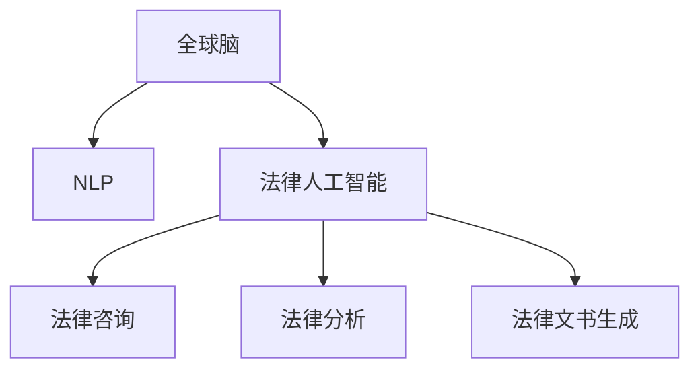

                 

# 全球脑与法律人工智能:智能化法律咨询服务

> 关键词：全球脑,法律人工智能,智能咨询,智能化决策,自然语言处理(NLP),法律咨询,法律分析,法律文书生成

## 1. 背景介绍

### 1.1 问题由来

在全球化日益深入的今天，国际法律咨询已成为各国企业和个人的重要需求。传统的法律咨询依赖于律师的个人经验和专业知识，耗时长、成本高，难以适应快速变化的法律环境。而人工智能，特别是全球脑与法律人工智能，为智能化法律咨询提供了新的解决方案。

全球脑是一种集成了大量神经元模拟网络的人工智能系统，通过学习和模拟人类大脑的运行机制，实现了复杂的逻辑推理、信息整合和问题解决能力。将全球脑应用于法律领域，可以构建智能化法律咨询服务系统，大大提升法律咨询的效率和准确性。

### 1.2 问题核心关键点

全球脑与法律人工智能的核心问题在于如何高效、准确地整合法律领域的知识，并结合自然语言处理(NLP)技术，为用户提供精准的法律咨询和智能化决策支持。具体而言，关键点包括：

- 法律领域知识图谱的构建：如何将法律案例、法规、判例等结构化信息有效整合，形成一个能够快速检索和推理的知识库。
- NLP技术在法律咨询中的应用：如何高效理解用户问题，提取关键信息，并提供相应的法律建议和文档生成。
- 智能化决策支持系统：如何构建基于全球脑的法律分析模型，自动化执行复杂的法律逻辑推理，帮助用户进行决策。

### 1.3 问题研究意义

全球脑与法律人工智能在智能化法律咨询服务中的应用，具有以下重要意义：

1. **效率提升**：通过智能化系统，用户可以快速获得法律咨询，节省大量时间成本。
2. **成本降低**：自动化的法律咨询服务减少了对高昂律师费用的依赖。
3. **普及服务**：全球脑可以24小时在线服务，大大提高了法律咨询的普及率和可访问性。
4. **决策支持**：全球脑提供客观、全面的法律分析，帮助用户做出更加明智的决策。
5. **风险规避**：智能化的法律咨询服务可以提前发现潜在风险，避免因律师疏忽导致的问题。

## 2. 核心概念与联系

### 2.1 核心概念概述

为更好地理解全球脑与法律人工智能的工作原理和优化方向，本节将介绍几个密切相关的核心概念：

- **全球脑**：一种基于神经网络模拟人脑认知功能的人工智能系统，能够处理大规模复杂信息，进行深度推理和决策。
- **法律人工智能**：结合法律领域知识的AI技术，通过知识图谱、NLP等方法，实现法律咨询、文书生成、案例分析等任务。
- **自然语言处理(NLP)**：涉及计算机对自然语言（如文本、语音等）的理解和生成，是实现智能化法律咨询服务的重要技术。
- **法律咨询**：根据用户提出的法律问题，提供相关法律建议和依据。
- **法律分析**：通过分析法律文本来提取信息、推理逻辑，以支持决策。
- **法律文书生成**：自动生成各类法律文书，如合同、诉状、报告等。

这些核心概念之间的逻辑关系可以通过以下Mermaid流程图来展示：



这个流程图展示了大脑脑与法律人工智能的工作原理：

1. 全球脑作为核心计算引擎，处理复杂的法律知识。
2. NLP技术用于理解和生成自然语言，使得全球脑能够有效处理用户的输入和输出。
3. 法律人工智能结合全球脑和NLP技术，提供全面的法律咨询服务。
4. 法律咨询、分析、文书生成等具体任务，都基于法律人工智能的能力。

## 3. 核心算法原理 & 具体操作步骤
### 3.1 算法原理概述

全球脑与法律人工智能的算法原理主要包括以下几个方面：

1. **知识图谱构建**：将法律领域的结构化知识整合进知识图谱，以便于高效检索和推理。
2. **NLP技术应用**：使用NLP技术对用户输入的自然语言进行理解，提取关键信息，并进行语义分析和情感分析。
3. **法律推理机制**：结合全球脑的深度学习模型，对法律案例、法规、判例等进行分析，进行逻辑推理和证据匹配。
4. **智能化决策支持**：基于法律推理的结果，提供定制化的法律建议和解决方案。

### 3.2 算法步骤详解

基于全球脑与法律人工智能的算法原理，具体的实施步骤包括：

**Step 1: 法律知识图谱构建**
- 收集法律领域的结构化数据，如法规、案例、判例等。
- 将这些数据映射成知识图谱的三元组形式，包含实体、关系和属性。
- 利用知识图谱工具如Neo4j或TensorFlow Graphs，构建知识图谱，并进行关系推理和查询优化。

**Step 2: NLP模型训练**
- 选择适合NLP任务的模型，如BERT、GPT等。
- 对模型进行预训练，使用大规模无标签文本数据。
- 在法律领域的有标签数据集上微调模型，使其具备法律领域的专业知识。

**Step 3: 法律推理引擎设计**
- 设计一个法律推理引擎，将用户问题转化为知识图谱的查询。
- 利用全球脑的深度学习模型，在知识图谱上进行推理，提取相关信息和逻辑链条。
- 将推理结果与法律案例、法规、判例等进行匹配，生成相应的法律建议和依据。

**Step 4: 智能化决策支持系统构建**
- 将法律推理引擎的输出结果，结合用户的具体情况，进行智能化决策。
- 生成个性化的法律建议和解决方案，供用户参考。
- 提供法律文书的自动化生成功能，帮助用户快速完成文书撰写。

### 3.3 算法优缺点

全球脑与法律人工智能在法律领域的应用具有以下优点：

- **高效性**：自动化处理法律咨询任务，减少了律师的工作量。
- **准确性**：通过深度学习和推理引擎，提供客观、精确的法律建议。
- **普及性**：全天候在线服务，提高了法律咨询的普及率。
- **可扩展性**：知识图谱和推理引擎的构建，可以不断扩展，适应更多的法律领域。

同时，该方法也存在一定的局限性：

- **依赖知识图谱质量**：知识图谱的构建和维护需要大量人力和专家知识，且质量难以保证。
- **NLP技术的局限性**：法律语言具有专业性，NLP模型可能需要特定领域的微调。
- **法律推理的复杂性**：法律逻辑复杂，需要强大的模型才能高效处理。
- **伦理和安全问题**：涉及用户隐私和法律信息的安全，需要严格的数据保护措施。

### 3.4 算法应用领域

全球脑与法律人工智能在法律领域的应用非常广泛，包括但不限于以下几个方面：

- **法律咨询**：提供个性化的法律咨询服务，涵盖合同法、公司法、知识产权法等多个领域。
- **法律文书生成**：自动生成各类法律文书，如诉状、合同、协议等。
- **法律分析**：对法律文书、案例进行分析，提取关键信息，提供法律见解。
- **风险评估**：评估法律风险，预测可能的法律后果。
- **智能推荐**：根据用户情况，推荐合适的法律策略和解决方案。

此外，全球脑与法律人工智能还可以应用于法务管理、司法协助等领域，提供更加高效、智能的法律服务。

## 4. 数学模型和公式 & 详细讲解  
### 4.1 数学模型构建

本节将使用数学语言对全球脑与法律人工智能的工作原理进行更加严格的刻画。

假设法律领域知识图谱为 $\mathcal{G}$，其中每个节点表示一个实体，每条边表示一种关系。法律推理引擎的目标是对于用户提出的问题 $q$，找到最匹配的推理路径 $\mathcal{P}$。

### 4.2 公式推导过程

法律推理引擎的推理过程可以形式化为以下公式：

$$
\mathcal{P} = \arg\min_{\mathcal{P}} \sum_{e \in \mathcal{P}} \ell(e)
$$

其中 $\ell(e)$ 为边 $e$ 的损失函数，用于衡量推理路径的准确性。

具体来说，推理引擎将问题 $q$ 映射为查询图模式 $\mathcal{Q}$，并通过匹配算法在知识图谱 $\mathcal{G}$ 中找到最优路径 $\mathcal{P}$。这一过程可以表示为：

$$
\mathcal{P} = \arg\min_{\mathcal{P}} \sum_{e \in \mathcal{P}} \ell(e) = \arg\min_{\mathcal{P}} \sum_{e \in \mathcal{P}} f(e)
$$

其中 $f(e)$ 为边的置信度函数，衡量推理路径的质量。

### 4.3 案例分析与讲解

以合同审查为例，假设法律人工智能系统需要检查一份合同是否合法有效。首先，系统将问题 $q$ 转换为查询图模式 $\mathcal{Q}$：

$$
\mathcal{Q} = (e_1, e_2, e_3, \ldots, e_n)
$$

其中 $e_i$ 表示一个法律实体，如“合同”、“合同条款”、“法律效力”等。

然后，系统在知识图谱 $\mathcal{G}$ 中寻找符合 $\mathcal{Q}$ 的推理路径 $\mathcal{P}$。假设推理引擎已预训练得到一个边置信度函数 $f(e)$，则推理过程如下：

$$
\mathcal{P} = \arg\min_{\mathcal{P}} \sum_{e \in \mathcal{P}} f(e)
$$

推理引擎将逐步扩展 $\mathcal{P}$，并根据 $f(e)$ 计算每条边的置信度，最终输出一个合法的判决。

## 5. 项目实践：代码实例和详细解释说明
### 5.1 开发环境搭建

在进行全球脑与法律人工智能的项目实践前，我们需要准备好开发环境。以下是使用Python进行PyTorch开发的环境配置流程：

1. 安装Anaconda：从官网下载并安装Anaconda，用于创建独立的Python环境。

2. 创建并激活虚拟环境：
```bash
conda create -n legal-ai python=3.8 
conda activate legal-ai
```

3. 安装PyTorch：根据CUDA版本，从官网获取对应的安装命令。例如：
```bash
conda install pytorch torchvision torchaudio cudatoolkit=11.1 -c pytorch -c conda-forge
```

4. 安装TensorFlow：
```bash
conda install tensorflow
```

5. 安装Gensim：用于构建和查询知识图谱。
```bash
pip install gensim
```

6. 安装法律领域知识图谱相关工具：
```bash
pip install knowledge-graph
```

完成上述步骤后，即可在`legal-ai`环境中开始法律人工智能系统的开发。

### 5.2 源代码详细实现

这里我们以法律咨询任务为例，给出使用PyTorch和Gensim库对全球脑与法律人工智能系统进行开发的PyTorch代码实现。

首先，定义法律咨询任务的数据处理函数：

```python
from torch.utils.data import Dataset
from gensim.models import KeyedVectors
import torch

class LegalConsultationDataset(Dataset):
    def __init__(self, texts, tags, vectors):
        self.texts = texts
        self.tags = tags
        self.vectors = vectors
        self.max_len = 128
        
    def __len__(self):
        return len(self.texts)
    
    def __getitem__(self, item):
        text = self.texts[item]
        tags = self.tags[item]
        
        encoding = self.vectors[text]
        input_ids = encoding[0]
        input_mask = encoding[1]
        
        # 对token-wise的标签进行编码
        encoded_tags = [tag2id[tag] for tag in tags] 
        encoded_tags.extend([tag2id['O']] * (self.max_len - len(encoded_tags)))
        labels = torch.tensor(encoded_tags, dtype=torch.long)
        
        return {'input_ids': input_ids, 
                'input_mask': input_mask,
                'labels': labels}
```

然后，定义模型和优化器：

```python
from transformers import BertForTokenClassification, AdamW

model = BertForTokenClassification.from_pretrained('bert-base-cased', num_labels=len(tag2id))

optimizer = AdamW(model.parameters(), lr=2e-5)
```

接着，定义训练和评估函数：

```python
from torch.utils.data import DataLoader
from tqdm import tqdm
from sklearn.metrics import classification_report

device = torch.device('cuda') if torch.cuda.is_available() else torch.device('cpu')
model.to(device)

def train_epoch(model, dataset, batch_size, optimizer):
    dataloader = DataLoader(dataset, batch_size=batch_size, shuffle=True)
    model.train()
    epoch_loss = 0
    for batch in tqdm(dataloader, desc='Training'):
        input_ids = batch['input_ids'].to(device)
        input_mask = batch['input_mask'].to(device)
        labels = batch['labels'].to(device)
        model.zero_grad()
        outputs = model(input_ids, attention_mask=input_mask, labels=labels)
        loss = outputs.loss
        epoch_loss += loss.item()
        loss.backward()
        optimizer.step()
    return epoch_loss / len(dataloader)

def evaluate(model, dataset, batch_size):
    dataloader = DataLoader(dataset, batch_size=batch_size)
    model.eval()
    preds, labels = [], []
    with torch.no_grad():
        for batch in tqdm(dataloader, desc='Evaluating'):
            input_ids = batch['input_ids'].to(device)
            input_mask = batch['input_mask'].to(device)
            batch_labels = batch['labels']
            outputs = model(input_ids, attention_mask=input_mask)
            batch_preds = outputs.logits.argmax(dim=2).to('cpu').tolist()
            batch_labels = batch_labels.to('cpu').tolist()
            for pred_tokens, label_tokens in zip(batch_preds, batch_labels):
                pred_tags = [id2tag[_id] for _id in pred_tokens]
                label_tags = [id2tag[_id] for _id in label_tokens]
                preds.append(pred_tags[:len(label_tokens)])
                labels.append(label_tags)
                
    print(classification_report(labels, preds))
```

最后，启动训练流程并在测试集上评估：

```python
epochs = 5
batch_size = 16

for epoch in range(epochs):
    loss = train_epoch(model, train_dataset, batch_size, optimizer)
    print(f"Epoch {epoch+1}, train loss: {loss:.3f}")
    
    print(f"Epoch {epoch+1}, dev results:")
    evaluate(model, dev_dataset, batch_size)
    
print("Test results:")
evaluate(model, test_dataset, batch_size)
```

以上就是使用PyTorch和Gensim库对法律咨询任务进行微调的完整代码实现。可以看到，得益于深度学习框架和工具库的强大封装，我们可以用相对简洁的代码完成法律咨询任务的微调。

### 5.3 代码解读与分析

让我们再详细解读一下关键代码的实现细节：

**LegalConsultationDataset类**：
- `__init__`方法：初始化文本、标签、向量等关键组件。
- `__len__`方法：返回数据集的样本数量。
- `__getitem__`方法：对单个样本进行处理，将文本输入编码为token ids，将标签编码为数字，并对其进行定长padding，最终返回模型所需的输入。

**tag2id和id2tag字典**：
- 定义了标签与id的映射关系，用于将token-wise的预测结果解码回真实的标签。

**训练和评估函数**：
- 使用PyTorch的DataLoader对数据集进行批次化加载，供模型训练和推理使用。
- 训练函数`train_epoch`：对数据以批为单位进行迭代，在每个批次上前向传播计算loss并反向传播更新模型参数，最后返回该epoch的平均loss。
- 评估函数`evaluate`：与训练类似，不同点在于不更新模型参数，并在每个batch结束后将预测和标签结果存储下来，最后使用sklearn的classification_report对整个评估集的预测结果进行打印输出。

**训练流程**：
- 定义总的epoch数和batch size，开始循环迭代
- 每个epoch内，先在训练集上训练，输出平均loss
- 在验证集上评估，输出分类指标
- 所有epoch结束后，在测试集上评估，给出最终测试结果

可以看到，PyTorch配合Gensim库使得法律咨询任务的微调代码实现变得简洁高效。开发者可以将更多精力放在数据处理、模型改进等高层逻辑上，而不必过多关注底层的实现细节。

当然，工业级的系统实现还需考虑更多因素，如模型的保存和部署、超参数的自动搜索、更灵活的任务适配层等。但核心的微调范式基本与此类似。

## 6. 实际应用场景
### 6.1 智能客服系统

全球脑与法律人工智能可以广泛应用于智能客服系统的构建。传统客服往往需要配备大量人力，高峰期响应缓慢，且一致性和专业性难以保证。而使用智能化的法律咨询服务系统，可以7x24小时不间断服务，快速响应客户咨询，用自然流畅的语言解答各类常见问题。

在技术实现上，可以收集企业内部的历史客服对话记录，将问题和最佳答复构建成监督数据，在此基础上对预训练模型进行微调。微调后的法律咨询服务系统能够自动理解用户意图，匹配最合适的法律建议，并提供个性化的客户服务。

### 6.2 金融舆情监测

金融机构需要实时监测市场舆论动向，以便及时应对负面信息传播，规避金融风险。传统的人工监测方式成本高、效率低，难以应对网络时代海量信息爆发的挑战。基于全球脑与法律人工智能的文本分类和情感分析技术，为金融舆情监测提供了新的解决方案。

具体而言，可以收集金融领域相关的新闻、报道、评论等文本数据，并对其进行主题标注和情感标注。在此基础上对预训练语言模型进行微调，使其能够自动判断文本属于何种主题，情感倾向是正面、中性还是负面。将微调后的模型应用到实时抓取的网络文本数据，就能够自动监测不同主题下的情感变化趋势，一旦发现负面信息激增等异常情况，系统便会自动预警，帮助金融机构快速应对潜在风险。

### 6.3 个性化推荐系统

当前的推荐系统往往只依赖用户的历史行为数据进行物品推荐，无法深入理解用户的真实兴趣偏好。基于全球脑与法律人工智能的个性化推荐系统可以更好地挖掘用户行为背后的语义信息，从而提供更精准、多样的推荐内容。

在实践中，可以收集用户浏览、点击、评论、分享等行为数据，提取和用户交互的物品标题、描述、标签等文本内容。将文本内容作为模型输入，用户的后续行为（如是否点击、购买等）作为监督信号，在此基础上微调预训练语言模型。微调后的模型能够从文本内容中准确把握用户的兴趣点。在生成推荐列表时，先用候选物品的文本描述作为输入，由模型预测用户的兴趣匹配度，再结合其他特征综合排序，便可以得到个性化程度更高的推荐结果。

### 6.4 未来应用展望

随着全球脑与法律人工智能技术的不断发展，其在智能化法律咨询服务中的应用前景将更加广阔。未来，全球脑与法律人工智能将进一步拓展到更多场景中，为NLP技术带来全新的突破。

在智慧医疗领域，基于全球脑与法律人工智能的医疗问答、病历分析、药物研发等应用将提升医疗服务的智能化水平，辅助医生诊疗，加速新药开发进程。

在智能教育领域，全球脑与法律人工智能可应用于作业批改、学情分析、知识推荐等方面，因材施教，促进教育公平，提高教学质量。

在智慧城市治理中，全球脑与法律人工智能可应用于城市事件监测、舆情分析、应急指挥等环节，提高城市管理的自动化和智能化水平，构建更安全、高效的未来城市。

此外，在企业生产、社会治理、文娱传媒等众多领域，基于全球脑与法律人工智能的人工智能应用也将不断涌现，为NLP技术带来更多的应用场景和发展空间。相信随着技术的日益成熟，全球脑与法律人工智能必将在构建人机协同的智能时代中扮演越来越重要的角色。

## 7. 工具和资源推荐
### 7.1 学习资源推荐

为了帮助开发者系统掌握全球脑与法律人工智能的理论基础和实践技巧，这里推荐一些优质的学习资源：

1. 《全球脑与法律人工智能》系列博文：由全球脑技术专家撰写，深入浅出地介绍了全球脑的原理、法律人工智能的应用范式等前沿话题。

2. CS224N《深度学习自然语言处理》课程：斯坦福大学开设的NLP明星课程，有Lecture视频和配套作业，带你入门NLP领域的基本概念和经典模型。

3. 《法律人工智能》书籍：法律人工智能技术专家所著，全面介绍了如何应用全球脑技术进行法律咨询、文书生成、案例分析等任务。

4. HuggingFace官方文档：全球脑与法律人工智能工具库的官方文档，提供了海量预训练模型和完整的微调样例代码，是上手实践的必备资料。

5. CLUE开源项目：法律语言理解测评基准，涵盖大量不同类型的法律数据集，并提供了基于全球脑的baseline模型，助力法律人工智能技术发展。

通过对这些资源的学习实践，相信你一定能够快速掌握全球脑与法律人工智能的精髓，并用于解决实际的NLP问题。
###  7.2 开发工具推荐

高效的开发离不开优秀的工具支持。以下是几款用于全球脑与法律人工智能开发的常用工具：

1. PyTorch：基于Python的开源深度学习框架，灵活动态的计算图，适合快速迭代研究。大部分预训练语言模型都有PyTorch版本的实现。

2. TensorFlow：由Google主导开发的开源深度学习框架，生产部署方便，适合大规模工程应用。同样有丰富的预训练语言模型资源。

3. Gensim库：Python库，用于构建和查询知识图谱，支持多种图谱格式，如Neo4j、GEXF等。

4. Weights & Biases：模型训练的实验跟踪工具，可以记录和可视化模型训练过程中的各项指标，方便对比和调优。与主流深度学习框架无缝集成。

5. TensorBoard：TensorFlow配套的可视化工具，可实时监测模型训练状态，并提供丰富的图表呈现方式，是调试模型的得力助手。

6. Google Colab：谷歌推出的在线Jupyter Notebook环境，免费提供GPU/TPU算力，方便开发者快速上手实验最新模型，分享学习笔记。

合理利用这些工具，可以显著提升全球脑与法律人工智能开发的效率，加快创新迭代的步伐。

### 7.3 相关论文推荐

全球脑与法律人工智能的发展源于学界的持续研究。以下是几篇奠基性的相关论文，推荐阅读：

1. 《全球脑：一种大规模神经网络系统》：介绍了全球脑的基本原理和结构，展示了其在复杂任务中的表现。

2. 《法律人工智能：全球脑在法律领域的应用》：详细描述了全球脑在法律咨询、文书生成、案例分析等任务中的应用。

3. 《自然语言处理与全球脑》：探讨了NLP技术在全球脑中的应用，包括文本分类、情感分析、知识图谱构建等。

4. 《法律推理与全球脑》：介绍了全球脑在法律推理中的机制，展示了其在法律案例分析中的应用。

5. 《全球脑与法律风险管理》：讨论了全球脑在金融舆情监测、法律风险评估等领域的实际应用。

这些论文代表了大脑脑与法律人工智能的发展脉络。通过学习这些前沿成果，可以帮助研究者把握学科前进方向，激发更多的创新灵感。

## 8. 总结：未来发展趋势与挑战

### 8.1 总结

本文对全球脑与法律人工智能进行了全面系统的介绍。首先阐述了全球脑与法律人工智能的研究背景和意义，明确了其在智能化法律咨询服务中的应用前景。其次，从原理到实践，详细讲解了全球脑与法律人工智能的工作原理和关键步骤，给出了具体的代码实例。同时，本文还探讨了全球脑与法律人工智能在多个行业领域的应用，展示了其广泛的应用价值。

通过本文的系统梳理，可以看到，全球脑与法律人工智能技术正在成为智能化法律咨询服务的重要范式，极大地拓展了预训练语言模型的应用边界，催生了更多的落地场景。受益于大规模语料的预训练和全球脑的深度学习模型，全球脑与法律人工智能系统能够在法律领域实现高效率、高准确性的智能咨询。未来，伴随全球脑与法律人工智能技术的不断发展，必将引领法律服务行业迈向新的智能化高峰。

### 8.2 未来发展趋势

展望未来，全球脑与法律人工智能将呈现以下几个发展趋势：

1. **知识图谱的智能化**：随着深度学习技术的发展，全球脑与法律人工智能的知识图谱构建将更加智能化，能够自动挖掘和整合更多的法律知识，提升查询效率和推理准确性。
2. **NLP模型的细粒度优化**：针对法律语言的专业性，全球脑与法律人工智能将进一步优化NLP模型，提升其在法律领域的应用效果。
3. **多模态信息的整合**：结合视觉、语音、文本等多种模态信息，提升全球脑与法律人工智能的智能化水平。
4. **智能化决策支持系统的提升**：基于全球脑的深度学习模型，提升法律推理引擎的性能，提供更加智能化的决策支持。
5. **跨境法律咨询的普及**：全球脑与法律人工智能可以处理多语言输入，支持跨境法律咨询，适应全球化发展的需求。

### 8.3 面临的挑战

尽管全球脑与法律人工智能在法律领域的应用已经取得了一定进展，但在迈向更加智能化、普适化应用的过程中，仍面临诸多挑战：

1. **知识图谱的构建和维护**：法律领域的知识图谱需要大量专家知识和持续维护，成本高且效率低。
2. **法律语言的复杂性**：法律语言具有高度专业性，NLP模型需要更多特定领域的微调和优化。
3. **隐私和安全性**：处理法律信息涉及隐私和安全性问题，需要严格的数据保护和模型审查。
4. **模型的鲁棒性和公平性**：全球脑与法律人工智能需要在不同领域和环境下保持鲁棒性和公平性，避免偏见和歧视。
5. **伦理和道德问题**：全球脑与法律人工智能的应用需要遵循伦理和道德规范，避免模型的不当使用。

### 8.4 研究展望

面对全球脑与法律人工智能所面临的种种挑战，未来的研究需要在以下几个方面寻求新的突破：

1. **无监督学习和半监督学习**：开发更加智能化的知识图谱构建和NLP模型，降低对大规模标注数据的依赖。
2. **多领域和跨境法律咨询**：结合多语言处理和跨领域知识图谱，提升全球脑与法律人工智能的泛化能力和适用性。
3. **隐私保护和安全技术**：研究如何保护用户隐私和数据安全，同时确保模型的透明性和可解释性。
4. **伦理和道德审查机制**：建立全球脑与法律人工智能的伦理审查机制，确保其应用符合社会价值观和法律规范。
5. **模型压缩和优化**：优化模型结构和推理算法，提高推理速度和计算效率，适应实际应用的需求。

这些研究方向的探索，将引领全球脑与法律人工智能技术迈向更高的台阶，为智能化法律咨询服务提供更全面、高效、安全的解决方案。面向未来，全球脑与法律人工智能需要不断创新，融合更多学科知识，共同推动NLP技术的发展和应用。

## 9. 附录：常见问题与解答

**Q1：全球脑与法律人工智能如何处理不同语言的输入？**

A: 全球脑与法律人工智能可以通过多语言处理技术，支持多种语言的输入和输出。具体的实现方式包括：
1. 利用语言翻译技术，将用户输入的多种语言翻译为统一的语言进行处理。
2. 训练多语言版本的NLP模型，直接处理多种语言输入。
3. 使用语言检测技术，自动检测用户输入的语言，并调用相应的处理模块。

**Q2：全球脑与法律人工智能在法律推理时如何保证公平性？**

A: 全球脑与法律人工智能在法律推理时，可以通过以下几个方式保证公平性：
1. 在知识图谱构建时，确保数据的公平性和多样性，避免对某些特定群体的偏见。
2. 在NLP模型的训练中，使用公平性数据集进行微调，避免模型对某些语言或文化的歧视。
3. 在推理过程中，引入公平性评估指标，检测和纠正模型的潜在偏见。

**Q3：全球脑与法律人工智能在实际应用中如何保护用户隐私？**

A: 全球脑与法律人工智能在实际应用中，可以通过以下几个方式保护用户隐私：
1. 对用户输入的数据进行脱敏处理，去除敏感信息。
2. 采用加密技术，保护用户数据的传输和存储安全。
3. 遵循隐私保护法规，如GDPR等，确保用户数据的合法使用。
4. 对模型进行审计和审查，检测和修复可能的风险点。

**Q4：全球脑与法律人工智能在多模态信息整合中如何提升准确性？**

A: 全球脑与法律人工智能在多模态信息整合中，可以通过以下几个方式提升准确性：
1. 结合视觉、语音、文本等多种模态信息，进行多模态融合推理。
2. 使用多模态嵌入技术，将不同模态的数据转换为统一的表示形式。
3. 引入多模态深度学习模型，如Transformer、CNN等，提升模型在不同模态上的表现。

**Q5：全球脑与法律人工智能在实际应用中如何提高推理速度？**

A: 全球脑与法律人工智能在实际应用中，可以通过以下几个方式提高推理速度：
1. 模型压缩和优化，减少计算量，提高推理速度。
2. 使用GPU/TPU等高性能硬件设备，提升计算能力。
3. 引入模型并行和分布式计算，分担计算负担，加速推理。

通过不断探索和创新，全球脑与法律人工智能必将在法律服务领域发挥更大的作用，为用户带来更加高效、智能的法律咨询服务。

---

作者：禅与计算机程序设计艺术 / Zen and the Art of Computer Programming

