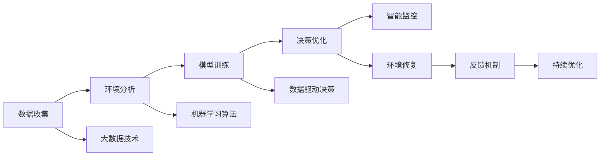

                 

# 全球脑与环境修复:集体行动的生态效应

在快速发展的数字时代，人工智能（AI）正成为驱动科技创新的重要引擎。然而，我们必须深刻认识到，人工智能不仅是技术的产物，更是社会进步的重要推动者。本文将探讨全球脑与环境修复，通过集体行动的生态效应，实现人与自然的和谐共生，打造可持续发展的未来。

## 1. 背景介绍

### 1.1 问题由来
近年来，全球人口数量激增、工业化进程加速，导致环境污染、资源枯竭等问题愈发严峻。与此同时，智能技术的迅猛发展为解决这些问题提供了新的契机。人工智能特别是大语言模型和深度学习技术，在预测、决策、优化等方面表现出巨大潜力，为全球脑与环境修复提供了新的思路。

### 1.2 问题核心关键点
全球脑与环境修复的核心关键点包括以下几个方面：

- **数据收集与分析**：通过大数据技术，实时监测和分析环境变化，发现潜在风险和机遇。
- **模型训练与优化**：利用机器学习算法，对环境数据进行建模，提取关键特征，预测未来趋势。
- **决策支持与干预**：基于模型预测，制定科学的决策策略，并进行干预，修复受损环境。
- **智能监控与反馈**：使用智能技术进行持续监控，并根据反馈不断优化策略，实现闭环管理。

### 1.3 问题研究意义
全球脑与环境修复的研究具有重要意义：

- **提升环境监测效率**：利用人工智能技术，可以实时监控全球环境变化，预测环境风险，提高监测效率。
- **优化环境管理策略**：通过科学建模和数据驱动决策，优化环境管理策略，提高管理效果。
- **实现环境修复**：基于大数据和智能技术，制定精准的修复方案，有效恢复受损环境。
- **推动可持续发展**：通过智能监控与反馈机制，实现环境管理的智能化，促进全球可持续发展。

## 2. 核心概念与联系

### 2.1 核心概念概述
全球脑与环境修复涉及多个核心概念：

- **全球脑**：指通过数据收集、模型训练和智能决策等技术手段，构建的全局智能系统。
- **环境修复**：利用人工智能技术，对受损环境进行监测、分析和干预，促进环境恢复。
- **集体行动**：全球范围内的协同合作，通过共享数据、知识和技术，共同推动环境修复。

### 2.2 核心概念原理和架构的 Mermaid 流程图



这个流程图展示了全球脑与环境修复的主要流程：通过数据收集、环境分析、模型训练、决策优化和智能监控等步骤，实现对环境的监测、分析和干预，最终促进环境修复。同时，它还强调了大数据技术、机器学习算法和数据驱动决策等核心技术，以及反馈机制在持续优化中的重要作用。

## 3. 核心算法原理 & 具体操作步骤

### 3.1 算法原理概述

全球脑与环境修复的算法原理主要包括：

- **数据驱动**：通过实时收集环境数据，利用大数据技术进行存储、分析和处理，提取关键特征。
- **模型训练**：利用机器学习算法，对环境数据进行建模，预测环境变化趋势。
- **决策优化**：基于模型预测结果，制定科学的决策策略，进行环境修复。
- **智能监控**：利用智能技术进行持续监控，并根据反馈不断优化策略，实现闭环管理。

### 3.2 算法步骤详解

以下是全球脑与环境修复的主要操作步骤：

**Step 1: 数据收集与处理**

- 利用传感器、无人机、卫星等技术手段，实时收集环境数据，包括气象、水文、土壤、生物多样性等。
- 对收集到的数据进行清洗、去噪和标准化处理，去除异常值和噪声。

**Step 2: 环境分析和建模**

- 利用机器学习算法，如深度学习、时间序列分析、随机森林等，对环境数据进行建模，提取关键特征。
- 使用数据可视化工具，如TensorBoard、Weights & Biases等，进行模型训练监控和评估。

**Step 3: 决策优化与干预**

- 根据模型预测结果，制定科学的环境管理策略，进行环境修复。
- 利用优化算法，如遗传算法、粒子群优化等，优化决策策略，提高干预效果。

**Step 4: 智能监控与反馈**

- 利用智能技术，如物联网、边缘计算等，进行持续监控。
- 根据监控结果和反馈，不断优化模型和决策策略，实现闭环管理。

### 3.3 算法优缺点

全球脑与环境修复算法具有以下优点：

- **高效准确**：通过机器学习和大数据分析，可以实时监测和预测环境变化，提高决策的准确性。
- **动态优化**：基于智能监控和反馈机制，可以动态调整决策策略，优化干预效果。
- **成本低**：利用现有技术手段，可以降低环境监测和修复的成本。

同时，该算法也存在以下缺点：

- **数据依赖**：依赖高质量的环境数据，数据缺失或错误可能影响模型预测结果。
- **模型复杂**：机器学习模型通常较为复杂，需要大量计算资源进行训练和预测。
- **干预风险**：环境修复过程中可能存在未知风险，干预措施不当可能造成新问题。

### 3.4 算法应用领域

全球脑与环境修复算法广泛应用于多个领域，如：

- **气候变化监测**：实时监测全球气候变化，预测极端天气事件。
- **水质监测**：实时监测水体污染，预测水质变化趋势。
- **土壤侵蚀预测**：利用遥感数据，预测土壤侵蚀程度，制定修复方案。
- **生态保护**：利用机器学习算法，保护生物多样性，防止物种灭绝。
- **能源管理**：优化能源消耗，减少碳排放，推动可持续发展。

## 4. 数学模型和公式 & 详细讲解 & 举例说明

### 4.1 数学模型构建

全球脑与环境修复的数学模型构建主要包括以下几个步骤：

- **数据预处理**：将原始数据进行归一化、标准化等预处理操作，便于后续建模。
- **特征提取**：利用特征工程技术，提取关键特征，如温度、湿度、降雨量等。
- **模型训练**：使用机器学习算法，对提取的特征进行建模，预测环境变化。
- **结果评估**：使用评估指标，如均方误差（MSE）、均方根误差（RMSE）等，评估模型性能。

### 4.2 公式推导过程

以水质监测为例，其数学模型构建过程如下：

- **数据预处理**：
  $$
  x = \frac{C_i - \mu}{\sigma}
  $$
  其中，$x$ 为标准化后的数据，$C_i$ 为原始数据，$\mu$ 为均值，$\sigma$ 为标准差。

- **特征提取**：
  $$
  F = (x_1, x_2, ..., x_n)
  $$
  其中，$x_i$ 为不同特征，$n$ 为特征数量。

- **模型训练**：
  $$
  \hat{y} = f(\mathbf{X}\theta)
  $$
  其中，$\hat{y}$ 为预测值，$f$ 为模型函数，$\mathbf{X}$ 为特征矩阵，$\theta$ 为模型参数。

- **结果评估**：
  $$
  MSE = \frac{1}{N} \sum_{i=1}^{N} (y_i - \hat{y_i})^2
  $$
  其中，$y_i$ 为真实值，$\hat{y_i}$ 为预测值。

### 4.3 案例分析与讲解

以水质监测为例，分析其数学模型构建和应用：

- **数据预处理**：收集水质监测站点的温度、pH值、溶解氧等数据，并进行标准化处理。
- **特征提取**：选择温度、pH值、溶解氧等关键特征，构建特征矩阵。
- **模型训练**：使用随机森林、神经网络等算法，对特征进行建模，预测水质变化。
- **结果评估**：利用均方误差（MSE）评估模型预测效果，不断优化模型参数。

## 5. 项目实践：代码实例和详细解释说明

### 5.1 开发环境搭建

开发全球脑与环境修复项目，需要以下开发环境：

- **编程语言**：Python
- **深度学习框架**：TensorFlow、PyTorch
- **数据处理工具**：Pandas、NumPy
- **数据可视化工具**：Matplotlib、Seaborn
- **模型训练环境**：Google Colab、AWS SageMaker

### 5.2 源代码详细实现

以下是全球脑与环境修复项目的主要代码实现：

```python
import pandas as pd
import numpy as np
from sklearn.model_selection import train_test_split
from tensorflow.keras.models import Sequential
from tensorflow.keras.layers import Dense, Dropout, LSTM
from tensorflow.keras.callbacks import EarlyStopping
from sklearn.metrics import mean_squared_error

# 读取数据
data = pd.read_csv('water_quality.csv')

# 数据预处理
data['temperature'] = (data['temperature'] - np.mean(data['temperature'])) / np.std(data['temperature'])
data['pH'] = (data['pH'] - np.mean(data['pH'])) / np.std(data['pH'])
data['soil'] = (data['soil'] - np.mean(data['soil'])) / np.std(data['soil'])

# 特征提取
X = data[['temperature', 'pH', 'soil']]
y = data['nitrogen']

# 数据分割
X_train, X_test, y_train, y_test = train_test_split(X, y, test_size=0.2, random_state=42)

# 构建LSTM模型
model = Sequential()
model.add(LSTM(64, input_shape=(X_train.shape[1], 1), return_sequences=True))
model.add(LSTM(32))
model.add(Dense(1))
model.compile(loss='mse', optimizer='adam')

# 模型训练
history = model.fit(X_train, y_train, epochs=50, batch_size=32, validation_data=(X_test, y_test), callbacks=[EarlyStopping(patience=5)])

# 模型评估
y_pred = model.predict(X_test)
mse = mean_squared_error(y_test, y_pred)
print('MSE:', mse)
```

### 5.3 代码解读与分析

以上代码展示了全球脑与环境修复项目的主要实现流程：

- **数据预处理**：对温度、pH值和土壤数据进行标准化处理，便于后续建模。
- **特征提取**：选择温度、pH值和土壤数据作为特征，构建特征矩阵。
- **模型训练**：使用LSTM模型进行建模，预测氮含量。
- **模型评估**：利用均方误差（MSE）评估模型预测效果。

## 6. 实际应用场景

### 6.1 智能城市治理

智能城市治理是全球脑与环境修复的重要应用场景之一。通过大数据、物联网等技术手段，实时监测城市环境变化，预测环境风险，制定科学的决策策略，实现城市管理的智能化。例如，通过智能传感器监测城市空气质量、交通流量、能源消耗等数据，实时调整城市管理策略，减少环境污染，提高城市居民生活质量。

### 6.2 生态保护

生态保护是全球脑与环境修复的另一个重要应用场景。利用机器学习算法，监测和预测森林覆盖率、物种多样性等环境指标，制定科学的生态保护策略。例如，通过遥感数据监测森林火灾、生物多样性等，及时采取措施，保护生态环境。

### 6.3 农业管理

农业管理是全球脑与环境修复的重要应用领域。利用智能技术，监测土壤水分、温度等环境指标，优化农业种植方案。例如，通过实时监测土壤湿度、温度等数据，智能推荐施肥、灌溉等农业管理策略，提高农作物产量，减少资源浪费。

## 7. 工具和资源推荐

### 7.1 学习资源推荐

为了帮助开发者系统掌握全球脑与环境修复的理论基础和实践技巧，这里推荐一些优质的学习资源：

1. **《深度学习》书籍**：Ian Goodfellow所著的《深度学习》是机器学习领域的经典教材，详细介绍了深度学习的基本概念和应用案例。
2. **Coursera课程**：Coursera提供的深度学习课程，由斯坦福大学Andrew Ng教授主讲，涵盖了深度学习的基础知识和实战技巧。
3. **Kaggle竞赛**：Kaggle提供了大量的数据集和竞赛项目，可以帮助开发者在实战中提升技能。
4. **GitHub代码库**：GitHub提供了丰富的开源代码库，开发者可以在其中找到全球脑与环境修复项目的代码实现。

### 7.2 开发工具推荐

全球脑与环境修复项目需要使用多种开发工具，推荐以下几款：

1. **Python**：作为全球脑与环境修复的主要编程语言，Python具有简单易学、生态丰富的特点。
2. **TensorFlow**：作为最流行的深度学习框架之一，TensorFlow提供了丰富的模型和工具，方便开发者进行模型训练和优化。
3. **PyTorch**：作为新兴的深度学习框架，PyTorch具有灵活、易用的特点，适合快速迭代开发。
4. **Jupyter Notebook**：Jupyter Notebook提供了交互式编程环境，方便开发者进行模型调试和验证。
5. **AWS SageMaker**：AWS提供的云计算平台，支持深度学习模型的训练和部署，提供了丰富的数据处理和可视化工具。

### 7.3 相关论文推荐

全球脑与环境修复技术的发展得益于学界的持续研究。以下是几篇奠基性的相关论文，推荐阅读：

1. **《全球脑：一种新兴的人工智能应用》**：该论文介绍了全球脑的基本概念和应用场景，探讨了通过数据驱动和智能决策实现环境修复的潜力。
2. **《机器学习在环境监测中的应用》**：该论文详细介绍了机器学习在环境监测中的应用，包括数据预处理、模型训练和结果评估等步骤。
3. **《智能城市：全球脑与环境修复的新途径》**：该论文探讨了智能城市治理中全球脑与环境修复的应用，提出了基于智能传感器和物联网技术的解决方案。

## 8. 总结：未来发展趋势与挑战

### 8.1 总结

本文对全球脑与环境修复进行了全面系统的介绍。通过数据驱动和智能决策，实现了对全球环境的实时监测、分析和干预，为实现人与自然的和谐共生提供了新的思路。

### 8.2 未来发展趋势

全球脑与环境修复技术的发展前景广阔，主要体现在以下几个方面：

1. **数据融合**：通过整合多源异构数据，提升环境监测的精度和广度。
2. **模型优化**：利用深度学习和强化学习等先进技术，提升模型的预测准确性。
3. **智能决策**：结合因果分析和博弈论工具，优化决策策略，提高干预效果。
4. **跨领域应用**：将全球脑与环境修复技术应用于智慧医疗、智慧交通、智慧农业等多个领域，推动跨领域协同创新。

### 8.3 面临的挑战

尽管全球脑与环境修复技术取得了显著进展，但仍面临诸多挑战：

1. **数据获取难度**：高质量的环境数据获取成本高、难度大，制约了技术的广泛应用。
2. **模型复杂度**：机器学习模型通常较为复杂，需要大量计算资源进行训练和优化。
3. **干预效果**：环境修复过程中可能存在未知风险，干预措施不当可能造成新问题。
4. **隐私和安全**：环境数据的采集和处理涉及隐私和安全问题，需要加强数据保护和安全措施。

### 8.4 研究展望

未来，全球脑与环境修复技术需要在以下几个方面进行突破：

1. **数据共享与治理**：建立全球数据共享平台，制定数据治理标准，提升数据可用性。
2. **模型轻量化**：开发轻量级模型，降低计算资源需求，提高模型部署效率。
3. **多模态融合**：融合视觉、语音、文本等多模态信息，提升环境监测的全面性和准确性。
4. **伦理与规范**：制定全球脑与环境修复的伦理规范，确保技术应用的透明性和可解释性。

通过不断探索和创新，全球脑与环境修复技术必将推动全球环境的可持续发展，实现人与自然的和谐共生。

## 9. 附录：常见问题与解答

**Q1: 如何提高全球脑与环境修复的准确性？**

A: 提高全球脑与环境修复的准确性，可以从以下几个方面入手：

1. **数据质量**：保证高质量的环境数据，减少数据缺失和噪声。
2. **特征选择**：选择关键特征，减少冗余信息对模型预测的影响。
3. **模型优化**：使用更先进的机器学习算法，如深度学习、强化学习等，提升模型性能。
4. **模型调参**：通过交叉验证、网格搜索等方法，找到最优的模型参数。

**Q2: 如何降低全球脑与环境修复的计算成本？**

A: 降低全球脑与环境修复的计算成本，可以从以下几个方面入手：

1. **模型轻量化**：开发轻量级模型，减少计算资源需求。
2. **分布式计算**：利用云计算平台，进行分布式计算，降低单台设备压力。
3. **数据压缩**：采用数据压缩技术，减少数据传输和存储的计算成本。
4. **硬件优化**：使用GPU、TPU等高性能计算设备，提升计算效率。

**Q3: 全球脑与环境修复面临哪些技术挑战？**

A: 全球脑与环境修复面临以下技术挑战：

1. **数据获取难度**：高质量的环境数据获取成本高、难度大，制约了技术的广泛应用。
2. **模型复杂度**：机器学习模型通常较为复杂，需要大量计算资源进行训练和优化。
3. **干预效果**：环境修复过程中可能存在未知风险，干预措施不当可能造成新问题。
4. **隐私和安全**：环境数据的采集和处理涉及隐私和安全问题，需要加强数据保护和安全措施。

**Q4: 全球脑与环境修复的未来发展方向是什么？**

A: 全球脑与环境修复的未来发展方向包括：

1. **数据融合**：通过整合多源异构数据，提升环境监测的精度和广度。
2. **模型优化**：利用深度学习和强化学习等先进技术，提升模型的预测准确性。
3. **智能决策**：结合因果分析和博弈论工具，优化决策策略，提高干预效果。
4. **跨领域应用**：将全球脑与环境修复技术应用于智慧医疗、智慧交通、智慧农业等多个领域，推动跨领域协同创新。

**Q5: 如何确保全球脑与环境修复的伦理性和规范性？**

A: 确保全球脑与环境修复的伦理性和规范性，可以从以下几个方面入手：

1. **透明性**：保证数据采集和模型训练的透明性，公开算法和数据来源。
2. **可解释性**：增强模型的可解释性，使其决策过程透明、可理解。
3. **隐私保护**：加强数据隐私保护，确保个人隐私不被泄露。
4. **伦理规范**：制定全球脑与环境修复的伦理规范，确保技术应用的透明性和可解释性。

通过不断探索和创新，全球脑与环境修复技术必将推动全球环境的可持续发展，实现人与自然的和谐共生。

---

作者：禅与计算机程序设计艺术 / Zen and the Art of Computer Programming

