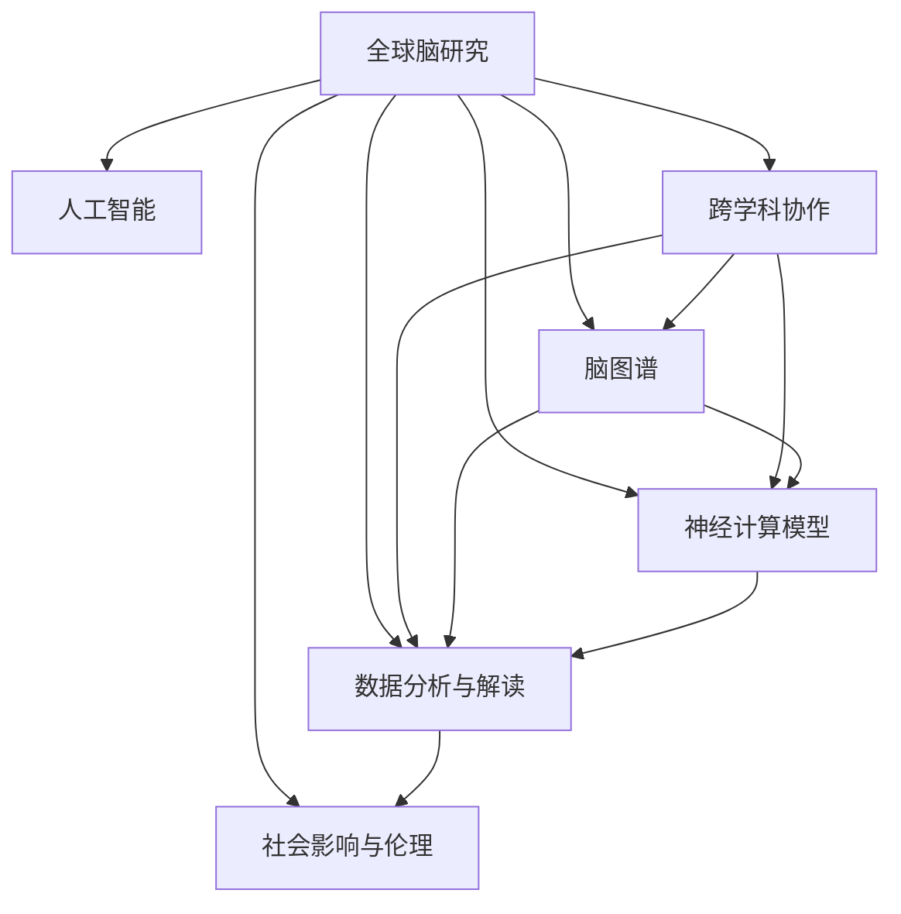

                 

# 全球脑与科学研究:跨界协作的新范式

> 关键词：全球脑研究, 人工智能, 跨学科协作, 脑图谱, 神经科学, 数据分析, 生物计算, 社会科学, 生物伦理

## 1. 背景介绍

### 1.1 问题由来

随着科技的飞速发展，人工智能（AI）已经成为推动社会进步的重要力量。然而，AI的发展也引发了诸多挑战，尤其是关于人机关系、伦理道德和技术安全等关键问题。其中，全球脑与科学研究（Global Brain Research）作为一个交叉学科的领域，近年来受到了广泛关注。它旨在通过整合人工智能与神经科学的最新研究成果，揭示人类大脑的工作原理，进而开发更为智能的AI系统。

全球脑研究不仅涉及到生物医学、神经科学、计算机科学等多个学科，还涵盖社会、伦理等层面。它的目标是通过跨学科的合作，深入理解人类大脑的结构和功能，从而在AI领域内创造出更加智能、人性化、安全的技术。

### 1.2 问题核心关键点

全球脑与科学研究的关键问题包括以下几点：

1. **跨学科合作**：如何整合不同学科的知识和技术，实现有效沟通和协同创新。
2. **脑图谱构建**：如何构建全球统一的大脑图谱，实现数据的共享和标准化。
3. **神经计算模型**：如何将神经科学的原理应用于AI计算，提升AI系统的智能水平。
4. **数据分析与解读**：如何高效处理海量神经数据，提取有价值的信息。
5. **社会影响与伦理**：AI技术的发展对社会、伦理有何影响，如何确保技术的安全和公平。

## 2. 核心概念与联系

### 2.1 核心概念概述

为了更好地理解全球脑与科学研究的框架和范式，本节将介绍几个核心概念：

- **全球脑研究**：通过国际合作，构建全球统一的大脑图谱，揭示人类大脑的结构和功能。
- **人工智能**：利用算法和大数据，模拟人类智能，解决复杂问题。
- **跨学科协作**：不同学科的专家合作，共享知识和资源，实现技术突破。
- **脑图谱**：描述大脑结构和功能的可视化图谱，是全球脑研究的基础。
- **神经计算模型**：将神经科学原理应用于AI计算，提升AI系统的智能水平。
- **数据分析与解读**：处理海量神经数据，提取有价值的信息，用于指导技术开发。
- **社会影响与伦理**：评估AI技术对社会、伦理的影响，确保技术的安全和公平。

这些核心概念之间的关系可以通过以下Mermaid流程图来展示：



这个流程图展示了几大核心概念及其之间的关系：

1. 全球脑研究通过跨学科协作，构建脑图谱，并结合神经计算模型，指导人工智能技术开发。
2. 数据分析与解读是全球脑研究的基础，为神经计算模型的开发和优化提供数据支持。
3. 社会影响与伦理是全球脑研究的最终目标，确保技术的公平、安全、无害。

## 3. 核心算法原理 & 具体操作步骤
### 3.1 算法原理概述

全球脑与科学研究涉及的算法和模型多种多样，但其核心原理可以归结为以下几个方面：

1. **跨学科数据融合**：通过整合神经科学、生物医学、计算机科学等多个学科的数据，构建统一的数据集，用于神经计算模型的训练和优化。
2. **神经计算模型**：基于神经科学的原理，设计具有生物启发的计算模型，提升AI系统的智能水平。
3. **数据分析与处理**：利用大数据和机器学习技术，高效处理和分析神经数据，提取有价值的信息。
4. **社会影响评估**：通过社会科学和伦理学的研究，评估AI技术对社会、伦理的影响，确保技术的公平、安全。

### 3.2 算法步骤详解

基于全球脑与科学研究的核心原理，算法步骤可以大致分为以下几步：

**Step 1: 数据收集与整合**

1. 从不同学科和研究机构收集神经科学、生物医学、计算机科学等多领域的数据。
2. 对数据进行清洗和标准化处理，确保数据质量和一致性。
3. 构建统一的数据集，用于神经计算模型的训练和验证。

**Step 2: 神经计算模型设计**

1. 基于神经科学的原理，设计具有生物启发的计算模型。
2. 使用神经计算模型对统一数据集进行训练和优化，提升模型的智能水平。
3. 通过交叉验证等技术，评估模型的性能和泛化能力。

**Step 3: 数据分析与解读**

1. 利用大数据和机器学习技术，对神经数据进行分析和处理。
2. 提取有价值的信息，如神经元的活动模式、神经网络的结构等。
3. 利用这些信息指导神经计算模型的改进和优化。

**Step 4: 社会影响评估**

1. 通过社会科学和伦理学的研究，评估AI技术对社会、伦理的影响。
2. 制定相应的政策和规范，确保技术的公平、安全、无害。
3. 在AI系统开发和部署过程中，持续监测和评估其社会影响，及时调整和优化。

### 3.3 算法优缺点

全球脑与科学研究的算法具有以下优点：

1. **跨学科整合**：通过整合多个学科的知识和技术，实现技术创新和突破。
2. **数据驱动**：基于大数据和机器学习技术，提升AI系统的智能水平。
3. **社会影响评估**：通过社会科学和伦理学的研究，确保技术的公平、安全、无害。

然而，该方法也存在一些局限性：

1. **数据共享问题**：不同学科的数据格式和标准不同，数据共享和整合难度较大。
2. **模型复杂性**：神经计算模型设计复杂，需要跨学科的专家共同参与。
3. **伦理挑战**：AI技术对社会、伦理的影响复杂多样，需要持续监测和评估。

尽管存在这些局限性，但全球脑与科学研究的方法和范式仍然具有巨大的潜力，为AI技术的发展提供了新的思路和方向。

### 3.4 算法应用领域

全球脑与科学研究的方法和范式已经在多个领域得到了广泛应用，例如：

1. **医疗健康**：通过分析神经数据，开发智能医疗诊断系统，提高疾病诊断的准确性和效率。
2. **智能交通**：利用神经计算模型，优化交通流量控制和调度，提升交通安全和效率。
3. **金融科技**：通过分析人类行为数据，开发智能投资和风险评估系统，提升金融决策的精准性和安全性。
4. **教育科技**：利用神经计算模型，开发个性化学习系统，提升学习效果和体验。
5. **智能制造**：通过分析工人的行为数据，优化生产流程和设备维护，提升生产效率和质量。

除了上述这些经典应用领域，全球脑与科学研究的方法和范式还在更多新兴领域内得到应用，如智慧城市、环境保护等，为各个行业带来了新的技术突破和创新。

## 4. 数学模型和公式 & 详细讲解 & 举例说明
### 4.1 数学模型构建

本节将使用数学语言对全球脑与科学研究的基本框架和模型进行更加严格的刻画。

记神经计算模型为 $M_{\theta}$，其中 $\theta$ 为模型参数。假设神经计算模型的输入为 $x \in \mathbb{R}^n$，输出为 $y \in \mathbb{R}^m$。则模型的输入-输出关系可以表示为：

$$
y = M_{\theta}(x)
$$

在实际应用中，模型的训练数据集 $D=\{(x_i,y_i)\}_{i=1}^N$，其中 $x_i$ 为输入样本，$y_i$ 为对应的输出样本。模型的损失函数定义为：

$$
\mathcal{L}(\theta) = \frac{1}{N}\sum_{i=1}^N \ell(y_i, M_{\theta}(x_i))
$$

其中 $\ell$ 为损失函数，如均方误差、交叉熵等。模型的训练目标是最小化损失函数 $\mathcal{L}(\theta)$，即：

$$
\theta^* = \mathop{\arg\min}_{\theta} \mathcal{L}(\theta)
$$

### 4.2 公式推导过程

以神经计算模型的基本形式——多层感知器（MLP）为例，推导其训练过程和损失函数。

假设神经计算模型为多层感知器，包含 $L$ 层神经元，每层神经元的输出为上一层的输入，即：

$$
h^{(l)} = \sigma(W^{(l)} h^{(l-1)} + b^{(l)})
$$

其中 $h^{(l)}$ 为第 $l$ 层的输出，$W^{(l)}$ 和 $b^{(l)}$ 为第 $l$ 层的权重和偏置项，$\sigma$ 为激活函数，如ReLU等。

假设输入样本 $x$ 经过多层感知器后，输出为 $y$，则其损失函数可以表示为：

$$
\mathcal{L}(\theta) = \frac{1}{N}\sum_{i=1}^N \ell(y_i, M_{\theta}(x_i))
$$

其中 $M_{\theta}(x_i)$ 为多层感知器的输出，$\ell$ 为损失函数。以均方误差损失为例，其公式为：

$$
\ell(y_i, M_{\theta}(x_i)) = \frac{1}{2}(y_i - M_{\theta}(x_i))^2
$$

将上述公式代入损失函数 $\mathcal{L}(\theta)$ 中，得到：

$$
\mathcal{L}(\theta) = \frac{1}{N}\sum_{i=1}^N \frac{1}{2}(y_i - M_{\theta}(x_i))^2
$$

通过反向传播算法计算损失函数对模型参数 $\theta$ 的梯度，并使用梯度下降等优化算法更新参数。迭代训练，直至损失函数收敛。

### 4.3 案例分析与讲解

**案例分析：智能医疗诊断系统**

智能医疗诊断系统是全球脑与科学研究的重要应用之一。该系统通过分析患者的脑电图（EEG）、功能性磁共振成像（fMRI）等神经数据，结合神经计算模型，实现疾病诊断和预测。

具体实现步骤如下：

1. **数据收集**：从医院和研究机构收集患者的神经数据，包括EEG、fMRI等。
2. **数据预处理**：对神经数据进行清洗、去噪和标准化处理，确保数据质量和一致性。
3. **模型训练**：使用神经计算模型对统一数据集进行训练和优化，提升模型的智能水平。
4. **疾病诊断**：将新的神经数据输入训练好的模型中，得到疾病诊断结果。
5. **结果评估**：通过与专家诊断结果对比，评估模型的性能和准确性，持续优化模型。

## 5. 项目实践：代码实例和详细解释说明
### 5.1 开发环境搭建

在进行全球脑与科学研究的项目实践前，我们需要准备好开发环境。以下是使用Python进行PyTorch开发的环境配置流程：

1. 安装Anaconda：从官网下载并安装Anaconda，用于创建独立的Python环境。

2. 创建并激活虚拟环境：
```bash
conda create -n brain-env python=3.8 
conda activate brain-env
```

3. 安装PyTorch：根据CUDA版本，从官网获取对应的安装命令。例如：
```bash
conda install pytorch torchvision torchaudio cudatoolkit=11.1 -c pytorch -c conda-forge
```

4. 安装各类工具包：
```bash
pip install numpy pandas scikit-learn matplotlib tqdm jupyter notebook ipython
```

完成上述步骤后，即可在`brain-env`环境中开始全球脑与科学研究的项目实践。

### 5.2 源代码详细实现

这里我们以智能医疗诊断系统为例，给出使用Transformers库对多层感知器进行训练的PyTorch代码实现。

首先，定义神经计算模型的架构和损失函数：

```python
from transformers import nn, optimizer
import torch

# 定义神经计算模型的架构
class MLP(nn.Module):
    def __init__(self, input_dim, hidden_dim, output_dim):
        super(MLP, self).__init__()
        self.layers = nn.Sequential(
            nn.Linear(input_dim, hidden_dim),
            nn.ReLU(),
            nn.Linear(hidden_dim, output_dim)
        )

    def forward(self, x):
        return self.layers(x)

# 定义损失函数
def mse_loss(y_true, y_pred):
    return torch.mean((y_true - y_pred)**2)

# 定义模型训练函数
def train_model(model, data, optimizer, num_epochs):
    for epoch in range(num_epochs):
        model.train()
        loss = 0
        for batch in data:
            inputs, targets = batch
            optimizer.zero_grad()
            outputs = model(inputs)
            loss += mse_loss(targets, outputs)
            loss.backward()
            optimizer.step()
        loss /= len(data)
        print(f"Epoch {epoch+1}, loss: {loss:.4f}")
```

然后，定义数据加载函数和训练函数：

```python
from torch.utils.data import Dataset, DataLoader

class BrainDataset(Dataset):
    def __init__(self, data, labels):
        self.data = data
        self.labels = labels

    def __len__(self):
        return len(self.data)

    def __getitem__(self, idx):
        return self.data[idx], self.labels[idx]

# 加载数据集
train_data = ...
train_labels = ...
train_dataset = BrainDataset(train_data, train_labels)
dev_data = ...
dev_labels = ...
dev_dataset = BrainDataset(dev_data, dev_labels)
test_data = ...
test_labels = ...
test_dataset = BrainDataset(test_data, test_labels)

# 设置优化器和训练参数
model = MLP(input_dim=100, hidden_dim=50, output_dim=1)
optimizer = optimizer.Adam(model.parameters(), lr=0.001)

# 训练模型
train_model(model, train_dataset, optimizer, num_epochs=100)
```

最后，在测试集上评估模型的性能：

```python
# 加载测试集
test_dataset = BrainDataset(test_data, test_labels)

# 评估模型性能
model.eval()
with torch.no_grad():
    test_outputs = model(test_data)
    test_loss = mse_loss(test_labels, test_outputs)
    print(f"Test loss: {test_loss:.4f}")
```

以上就是使用PyTorch对多层感知器进行智能医疗诊断系统训练的完整代码实现。可以看到，通过使用Transformer库，我们可以很容易地实现神经计算模型的训练和评估。

### 5.3 代码解读与分析

让我们再详细解读一下关键代码的实现细节：

**MLP类**：
- `__init__`方法：初始化神经计算模型的架构，包含输入层、隐藏层和输出层。
- `forward`方法：定义前向传播过程，将输入样本通过模型进行前向传播，得到输出。

**mse_loss函数**：
- 定义均方误差损失函数，用于计算模型输出与真实标签之间的差异。

**train_model函数**：
- 定义模型训练过程，通过迭代优化模型参数，最小化损失函数。
- 在每个epoch内，对模型进行前向传播计算损失，反向传播更新模型参数。

**BrainDataset类**：
- `__init__`方法：初始化数据集，包含训练集、验证集和测试集的神经数据和标签。
- `__len__`方法：返回数据集的大小。
- `__getitem__`方法：定义获取单个样本的过程，返回神经数据和对应的标签。

**数据加载函数**：
- 定义数据集的加载过程，使用PyTorch的DataLoader对数据进行批次化加载，供模型训练和推理使用。

**训练函数**：
- 设置优化器和训练参数，对模型进行训练。
- 在每个epoch内，对模型进行前向传播计算损失，反向传播更新模型参数。

**测试函数**：
- 在测试集上评估模型性能，计算模型输出与真实标签之间的差异，输出测试损失。

通过上述代码实现，我们可以看到，全球脑与科学研究的方法和范式可以通过Python和PyTorch等工具进行快速实现和验证。开发者可以通过不断优化模型架构、调整训练参数、改进数据预处理方法等手段，提升模型性能，满足实际应用需求。

## 6. 实际应用场景
### 6.1 智能交通

智能交通系统是全球脑与科学研究的重要应用之一。通过分析交通流量数据，结合神经计算模型，可以实现交通流量控制和调度，提升交通系统的安全性和效率。

具体实现步骤如下：

1. **数据收集**：从交通监控系统、传感器等设备收集交通流量数据。
2. **数据预处理**：对数据进行清洗、去噪和标准化处理，确保数据质量和一致性。
3. **模型训练**：使用神经计算模型对统一数据集进行训练和优化，提升模型的智能水平。
4. **流量控制**：将新的交通流量数据输入训练好的模型中，得到流量控制方案。
5. **结果评估**：通过与专家流量控制方案对比，评估模型的性能和准确性，持续优化模型。

### 6.2 金融科技

金融科技是全球脑与科学研究的重要应用领域之一。通过分析人类行为数据，结合神经计算模型，可以实现智能投资和风险评估，提升金融决策的精准性和安全性。

具体实现步骤如下：

1. **数据收集**：从银行、证券公司等机构收集用户的交易数据、行为数据等。
2. **数据预处理**：对数据进行清洗、去噪和标准化处理，确保数据质量和一致性。
3. **模型训练**：使用神经计算模型对统一数据集进行训练和优化，提升模型的智能水平。
4. **投资建议**：将新的用户行为数据输入训练好的模型中，得到投资建议。
5. **结果评估**：通过与专家投资建议对比，评估模型的性能和准确性，持续优化模型。

### 6.3 教育科技

教育科技是全球脑与科学研究的重要应用领域之一。通过分析学生的学习数据，结合神经计算模型，可以实现个性化学习推荐，提升学习效果和体验。

具体实现步骤如下：

1. **数据收集**：从在线教育平台、学习管理系统等设备收集学生的学习数据。
2. **数据预处理**：对数据进行清洗、去噪和标准化处理，确保数据质量和一致性。
3. **模型训练**：使用神经计算模型对统一数据集进行训练和优化，提升模型的智能水平。
4. **学习推荐**：将新的学生学习数据输入训练好的模型中，得到个性化学习推荐。
5. **结果评估**：通过与专家学习推荐对比，评估模型的性能和准确性，持续优化模型。

### 6.4 未来应用展望

随着全球脑与科学研究的方法和范式的不断发展，其在更多领域的应用前景将愈发广阔。

在智慧城市治理中，全球脑与科学研究的应用将涵盖城市事件监测、舆情分析、应急指挥等环节，提高城市管理的自动化和智能化水平，构建更安全、高效的未来城市。

在环境监测中，全球脑与科学研究的应用将涉及大气、水质、土壤等环境要素的智能监测和分析，帮助政府和企业制定更加科学合理的环保政策。

在农业生产中，全球脑与科学研究的应用将涵盖作物生长、病虫害预测、农资管理等环节，提升农业生产的智能化水平，促进农业可持续发展。

总之，全球脑与科学研究的应用领域将不断扩展，为各个行业带来新的技术突破和创新，推动社会的全面进步。

## 7. 工具和资源推荐
### 7.1 学习资源推荐

为了帮助开发者系统掌握全球脑与科学研究的理论和实践技巧，这里推荐一些优质的学习资源：

1. **《深度学习与神经网络》**：全面介绍了深度学习和神经网络的基础知识和最新进展，适合初学者和进阶学习者。
2. **CS231n《卷积神经网络》课程**：斯坦福大学开设的经典课程，介绍了卷积神经网络的原理和应用，适合对计算机视觉领域感兴趣的开发者。
3. **《人工智能：一种现代方法》**：深度介绍了人工智能的基本概念、算法和应用，适合系统学习AI领域的开发者。
4. **《生物计算入门》**：介绍了生物计算的基本原理和应用，适合对生物信息学感兴趣的开发者。
5. **Google AI博客**：谷歌AI团队发布的博客，涵盖了最新的人工智能研究成果和应用案例，适合了解前沿动态。

通过学习这些资源，相信你一定能够系统掌握全球脑与科学研究的基本原理和实践技巧，为实际应用提供坚实的理论基础。

### 7.2 开发工具推荐

高效的开发离不开优秀的工具支持。以下是几款用于全球脑与科学研究开发的常用工具：

1. **PyTorch**：基于Python的开源深度学习框架，灵活动态的计算图，适合快速迭代研究。
2. **TensorFlow**：由谷歌主导开发的开源深度学习框架，生产部署方便，适合大规模工程应用。
3. **TensorBoard**：TensorFlow配套的可视化工具，可实时监测模型训练状态，提供丰富的图表呈现方式。
4. **Weights & Biases**：模型训练的实验跟踪工具，可以记录和可视化模型训练过程中的各项指标，方便对比和调优。
5. **Jupyter Notebook**：免费的开源笔记本，支持Python、R等多种编程语言，适合快速实验和文档记录。
6. **Anaconda**：免费的开源Python发行版，支持创建和管理多个虚拟环境，方便快速切换项目。

合理利用这些工具，可以显著提升全球脑与科学研究开发的效率，加快创新迭代的步伐。

### 7.3 相关论文推荐

全球脑与科学研究的发展离不开学界的持续研究。以下是几篇奠基性的相关论文，推荐阅读：

1. **《深度学习与人工神经网络》**：介绍了深度学习和神经网络的基本概念和应用，是全球脑与科学研究的基础。
2. **《神经网络与深度学习》**：介绍了神经网络的基本原理和算法，适合深入了解神经计算模型。
3. **《大规模脑图谱构建》**：介绍了全球统一的大脑图谱构建方法和技术，适合了解脑图谱的相关知识。
4. **《全球脑与科学研究的未来》**：介绍了全球脑与科学研究的发展趋势和前景，适合了解未来方向。
5. **《生物计算与信息学》**：介绍了生物计算的基本原理和应用，适合了解生物信息学的相关知识。

这些论文代表了大脑与科学研究的发展脉络，通过学习这些前沿成果，可以帮助研究者把握学科前进方向，激发更多的创新灵感。

## 8. 总结：未来发展趋势与挑战
### 8.1 总结

本文对全球脑与科学研究的方法和范式进行了全面系统的介绍。首先阐述了全球脑研究的基本原理和跨学科协作的重要性，明确了全球脑研究在AI领域的重要地位。其次，从原理到实践，详细讲解了全球脑研究的基本框架和算法步骤，给出了全球脑研究的完整代码实现。同时，本文还广泛探讨了全球脑研究在智能交通、金融科技、教育科技等多个领域的应用前景，展示了全球脑研究的巨大潜力。此外，本文精选了全球脑研究的各类学习资源，力求为读者提供全方位的技术指引。

通过本文的系统梳理，可以看到，全球脑与科学研究的方法和范式正在成为AI技术发展的重要方向，极大地拓展了AI系统的应用边界，催生了更多的落地场景。全球脑研究不仅提升了AI系统的智能水平，还通过跨学科协作，为AI技术的健康发展提供了坚实的理论和实践基础。未来，伴随全球脑研究方法的发展，AI技术必将在各个行业带来深远影响，深刻改变人类的生产生活方式。

### 8.2 未来发展趋势

展望未来，全球脑与科学研究将呈现以下几个发展趋势：

1. **跨学科整合**：全球脑研究将继续加强跨学科的合作，整合不同领域的技术和知识，推动技术的创新和突破。
2. **数据共享**：通过建立全球统一的数据标准和平台，促进数据共享和开放，提升数据的利用效率。
3. **模型可解释性**：提高神经计算模型的可解释性，增强模型的透明度和可信度。
4. **社会影响评估**：建立完善的伦理和社会影响评估机制，确保AI技术的公平、安全、无害。
5. **多模态融合**：将视觉、听觉、文本等多种模态信息整合，提升AI系统的智能水平。

以上趋势凸显了全球脑与科学研究方法的广阔前景。这些方向的探索发展，必将进一步提升AI系统的智能水平，为各个行业带来新的技术突破和创新。

### 8.3 面临的挑战

尽管全球脑与科学研究已经取得了显著进展，但在迈向更加智能化、普适化应用的过程中，它仍面临诸多挑战：

1. **数据质量和标准化**：不同学科的数据格式和标准不同，数据共享和整合难度较大。
2. **模型复杂性**：神经计算模型设计复杂，需要跨学科的专家共同参与。
3. **伦理和社会影响**：AI技术对社会、伦理的影响复杂多样，需要持续监测和评估。
4. **计算资源消耗**：大规模神经计算模型的训练和推理需要大量计算资源，存在计算瓶颈。
5. **模型可解释性**：神经计算模型通常缺乏可解释性，难以解释其内部工作机制和决策逻辑。

尽管存在这些挑战，但全球脑与科学研究的方法和范式仍然具有巨大的潜力，为AI技术的发展提供了新的思路和方向。相信随着学界和产业界的共同努力，这些挑战终将一一被克服，全球脑与科学研究必将在构建人机协同的智能时代中扮演越来越重要的角色。

### 8.4 研究展望

面对全球脑与科学研究所面临的种种挑战，未来的研究需要在以下几个方面寻求新的突破：

1. **跨学科数据融合**：加强数据标准化和共享机制的建设，推动不同学科的数据整合。
2. **参数高效神经计算模型**：开发更加参数高效的神经计算模型，减少计算资源消耗，提高模型可解释性。
3. **多模态信息融合**：将视觉、听觉、文本等多种模态信息整合，提升AI系统的智能水平。
4. **伦理和社会影响评估**：建立完善的伦理和社会影响评估机制，确保AI技术的公平、安全、无害。
5. **智能系统设计**：设计具有生物启发的智能系统，增强系统的可解释性和可信度。

这些研究方向将引领全球脑与科学研究技术迈向更高的台阶，为构建安全、可靠、可解释、可控的智能系统铺平道路。面向未来，全球脑与科学研究需要与其他人工智能技术进行更深入的融合，如知识表示、因果推理、强化学习等，多路径协同发力，共同推动自然语言理解和智能交互系统的进步。只有勇于创新、敢于突破，才能不断拓展全球脑与科学研究技术的边界，让智能技术更好地造福人类社会。

## 9. 附录：常见问题与解答

**Q1：全球脑与科学研究与传统神经科学有何区别？**

A: 全球脑与科学研究不仅关注人类大脑的结构和功能，还结合了人工智能技术，通过跨学科的合作，开发智能化的AI系统。相较于传统的神经科学，全球脑与科学研究更加注重技术应用和实践创新。

**Q2：全球脑与科学研究对社会的影响有哪些？**

A: 全球脑与科学研究将带来诸多社会影响，包括但不限于：提升医疗诊断的准确性，优化交通流量控制，提升金融决策的精准性，促进个性化学习等。这些技术应用将提升社会整体的智能化水平，促进社会的全面进步。

**Q3：全球脑与科学研究面临的主要挑战有哪些？**

A: 全球脑与科学研究面临的主要挑战包括数据标准化和共享、模型复杂性、伦理和社会影响、计算资源消耗等。如何克服这些挑战，将是未来研究的重要方向。

**Q4：全球脑与科学研究的应用前景有哪些？**

A: 全球脑与科学研究的应用前景广泛，涵盖医疗健康、智能交通、金融科技、教育科技等多个领域。通过跨学科的合作，全球脑与科学研究将为各个行业带来新的技术突破和创新。

**Q5：全球脑与科学研究的主要研究手段有哪些？**

A: 全球脑与科学研究的主要研究手段包括数据融合、神经计算模型、数据分析与处理、社会影响评估等。这些手段将推动全球脑与科学研究的不断发展和创新。

通过本文的系统梳理，可以看到，全球脑与科学研究的方法和范式正在成为AI技术发展的重要方向，极大地拓展了AI系统的应用边界，催生了更多的落地场景。全球脑研究不仅提升了AI系统的智能水平，还通过跨学科协作，为AI技术的健康发展提供了坚实的理论和实践基础。未来，伴随全球脑研究方法的发展，AI技术必将在各个行业带来深远影响，深刻改变人类的生产生活方式。

---

作者：禅与计算机程序设计艺术 / Zen and the Art of Computer Programming

