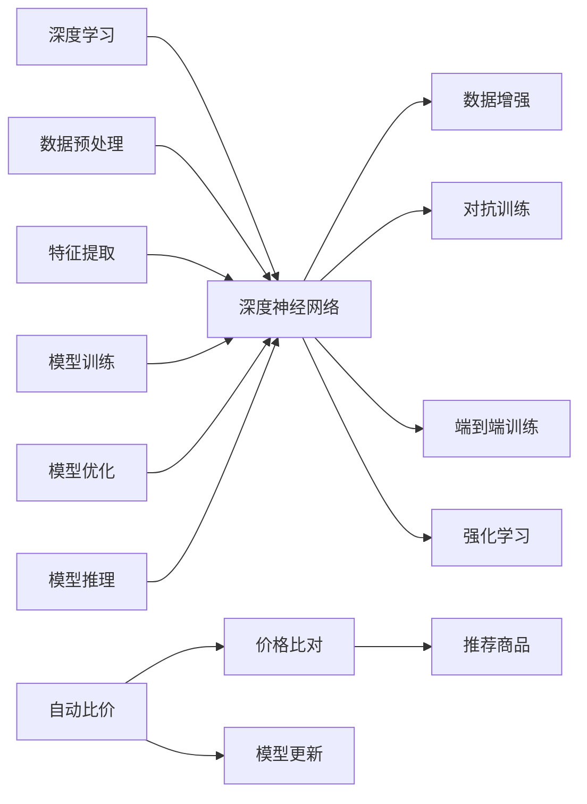

                 

# 全网比价：AI如何帮助用户找到最优惠的购买渠道

## 1. 背景介绍

随着电子商务的蓬勃发展，用户在网上购物时，面临着海量的商品和购物渠道选择。如何找到价格最优惠的购买渠道，成为用户普遍关心的问题。传统的比价方法依赖人工搜索引擎，耗时费力，且难以穷尽所有购物网站和平台。而人工智能技术，尤其是深度学习和大数据分析，为自动比价带来了新的可能性。

## 2. 核心概念与联系

### 2.1 核心概念概述

在自动比价过程中，涉及以下核心概念：

- **深度学习**：一种基于神经网络的机器学习技术，通过多层神经网络模拟人脑处理复杂数据的能力，可用于图像、语音、文本等各类数据的学习。
- **深度神经网络**：一种包含多层神经元的深度学习模型，具有强大的特征提取和模式识别能力。
- **数据增强**：通过数据变换和扩充，增加训练样本多样性，提高模型泛化能力。
- **对抗训练**：在模型训练中加入对抗样本，增强模型的鲁棒性和泛化能力。
- **端到端训练**：直接从原始数据到任务输出，通过端到端神经网络实现自动比价。
- **强化学习**：一种通过奖励机制训练模型，使其最大化目标函数的学习范式，可用于优化比价策略。

这些概念通过相互配合，构成了自动比价系统的技术基础。

### 2.2 核心概念原理和架构的 Mermaid 流程图



这个流程图展示了深度学习在自动比价中的应用流程：首先通过数据预处理和特征提取，输入深度神经网络进行训练和优化，最后通过模型推理和比价，输出推荐结果。

## 3. 核心算法原理 & 具体操作步骤

### 3.1 算法原理概述

自动比价的核心算法原理是利用深度学习模型对商品和购物渠道的信息进行学习，并通过特征提取和模式识别，实现价格比对和推荐。具体步骤包括：

1. **数据收集**：收集各购物网站和平台的商品信息，包括价格、品牌、描述、图片等。
2. **数据预处理**：对收集到的数据进行清洗、标准化和归一化处理，确保数据质量和一致性。
3. **特征提取**：使用深度神经网络提取商品和购物渠道的特征，如商品价格、品牌、图片等。
4. **价格比对**：通过模型训练，实现对不同购物渠道的商品价格进行比对，识别出价格最低的渠道。
5. **推荐策略**：根据用户的历史购买记录和偏好，生成个性化的推荐结果。

### 3.2 算法步骤详解

#### 3.2.1 数据收集

- **爬虫技术**：使用Python等编程语言编写爬虫程序，从各大购物网站和平台抓取商品信息，如京东、淘宝、天猫等。
- **API接口**：利用各购物网站的API接口，获取商品信息，避免法律风险和爬虫限制。

#### 3.2.2 数据预处理

- **数据清洗**：去除重复、无关、错误的数据，确保数据的质量。
- **标准化和归一化**：将数据转化为标准格式，并进行归一化处理，确保模型训练的稳定性。

#### 3.2.3 特征提取

- **神经网络架构**：使用卷积神经网络(CNN)、循环神经网络(RNN)或Transformer等架构，提取商品和购物渠道的特征。
- **特征工程**：通过数据变换、特征组合和降维等手段，提取和优化特征，提升模型性能。

#### 3.2.4 价格比对

- **训练模型**：使用深度神经网络模型，如CNN或RNN，对商品和购物渠道进行价格比对，训练出能够识别最低价渠道的模型。
- **损失函数**：定义损失函数，如均方误差、交叉熵等，用于衡量模型输出与实际价格之间的差距。

#### 3.2.5 推荐策略

- **用户画像**：通过用户的历史行为数据，构建用户画像，了解用户的偏好和需求。
- **个性化推荐**：根据用户画像，生成个性化的商品推荐列表，提升用户体验。

### 3.3 算法优缺点

#### 3.3.1 优点

- **自动化**：自动化比价流程，节省用户时间和精力。
- **准确性**：深度学习模型具有强大的模式识别能力，比价结果准确度高。
- **多渠道支持**：支持多渠道比价，用户可从多个平台中选择最佳购买渠道。
- **实时性**：通过在线比价和动态更新，实时反映市场价格变化。

#### 3.3.2 缺点

- **数据依赖**：需要大量的商品数据和购物渠道数据，数据质量直接影响比价结果。
- **计算资源消耗**：深度学习模型计算量大，需要高性能计算资源支持。
- **模型复杂性**：深度神经网络模型复杂，训练和优化过程容易过拟合。

### 3.4 算法应用领域

自动比价技术不仅适用于电商购物，还可以应用于以下多个领域：

- **旅游比价**：比价酒店、机票、旅游套餐等，帮助用户找到最优出行方案。
- **保险比价**：比价不同保险公司的产品，帮助用户选择性价比最高的保险。
- **金融产品比价**：比价各类理财产品、基金等，帮助用户优化投资组合。
- **商品比价**：比价同一商品在不同电商平台的价格，帮助用户找到最优惠购买渠道。

## 4. 数学模型和公式 & 详细讲解

### 4.1 数学模型构建

在自动比价中，主要使用深度神经网络模型，其数学模型可以表示为：

$$
f(x; \theta) = \sigma(W \cdot x + b)
$$

其中，$f(x)$ 表示模型对输入 $x$ 的预测输出，$\theta$ 为模型参数，$W$ 和 $b$ 分别为权重和偏置，$\sigma$ 为激活函数，如ReLU、Sigmoid等。

### 4.2 公式推导过程

#### 4.2.1 数据预处理

对于商品信息 $x = (x_1, x_2, ..., x_n)$，其中 $x_i$ 为第 $i$ 个特征，如价格、品牌、描述等。预处理公式为：

$$
x' = \frac{x - \mu}{\sigma}
$$

其中，$\mu$ 为均值，$\sigma$ 为标准差，$x'$ 为标准化后的特征。

#### 4.2.2 特征提取

使用卷积神经网络(CNN)提取商品图像特征，其公式为：

$$
f_{CNN}(x_i) = \sum_{k=1}^K w_k \ast f_{pre}(x_i) + b_k
$$

其中，$f_{pre}(x_i)$ 为预处理后的特征，$K$ 为卷积核数量，$w_k$ 和 $b_k$ 分别为卷积核和偏置。

#### 4.2.3 价格比对

使用长短时记忆网络(LSTM)对不同购物渠道的价格进行比对，其公式为：

$$
f_{LSTM}(x_i) = \sum_{t=1}^T w_t \cdot f_{pre}(x_i, t-1) + b_t
$$

其中，$T$ 为时间步长，$w_t$ 和 $b_t$ 分别为权重和偏置。

#### 4.2.4 推荐策略

使用协同过滤算法对用户的历史购买记录进行建模，其公式为：

$$
y = \alpha_1 \cdot r_{uv} + \alpha_2 \cdot r_{u \cdot} + \alpha_3 \cdot r_{ \cdot v} + \epsilon
$$

其中，$r_{uv}$ 表示用户 $u$ 和物品 $v$ 的相关度，$\alpha_1, \alpha_2, \alpha_3$ 为调节系数，$\epsilon$ 为随机误差。

### 4.3 案例分析与讲解

#### 4.3.1 案例背景

某用户想要购买一台笔记本电脑，通过自动比价系统，系统收集了各大电商平台的商品信息，并提取了价格、品牌、规格等特征。

#### 4.3.2 数据预处理

系统对收集到的商品信息进行清洗和标准化处理，去除重复和无关信息，确保数据一致性。

#### 4.3.3 特征提取

系统使用CNN提取商品图片特征，使用LSTM对不同购物渠道的价格进行比对，得到各渠道的价格排名。

#### 4.3.4 价格比对

通过模型训练，系统识别出最低价渠道，并给出详细的比价结果。

#### 4.3.5 推荐策略

系统根据用户的历史购买记录和偏好，生成个性化的笔记本电脑推荐列表，帮助用户选择最佳购买渠道。

## 5. 项目实践：代码实例和详细解释说明

### 5.1 开发环境搭建

#### 5.1.1 环境配置

1. **Python环境**：安装Python 3.x，推荐使用Anaconda环境，以方便包管理和虚拟环境配置。

2. **深度学习框架**：安装TensorFlow或PyTorch，支持深度神经网络模型的构建和训练。

3. **数据处理库**：安装Pandas、NumPy、Scikit-learn等库，支持数据预处理和特征提取。

4. **爬虫库**：安装Scrapy、BeautifulSoup等库，支持数据收集和爬取。

#### 5.1.2 依赖管理

使用pip安装所需的依赖包，如：

```
pip install tensorflow pandas numpy scipy scikit-learn scrapy beautifulsoup4
```

### 5.2 源代码详细实现

#### 5.2.1 数据收集

使用Scrapy编写爬虫程序，抓取各大购物网站和平台商品信息，示例代码如下：

```python
import scrapy

class ShoppingSpider(scrapy.Spider):
    name = 'shopping_spider'
    start_urls = ['https://www.jd.com/']

    def parse(self, response):
        # 提取商品信息
        for item in response.css('div.product-item'):
            yield {
                'title': item.css('a.title::text').get(),
                'price': item.css('span.price::text').get(),
                'brand': item.css('div.brand::text').get()
            }
        # 继续爬取下一页
        next_page = response.css('a.next::attr(href)').get()
        if next_page:
            yield response.follow(next_page, self.parse)
```

#### 5.2.2 数据预处理

使用Pandas库对收集到的数据进行清洗和标准化处理，示例代码如下：

```python
import pandas as pd
from sklearn.preprocessing import StandardScaler

# 读取数据
data = pd.read_csv('shopping_data.csv')

# 数据清洗
data = data.drop_duplicates()
data = data[data['price'] > 0]

# 标准化处理
scaler = StandardScaler()
data['price'] = scaler.fit_transform(data[['price']])
```

#### 5.2.3 特征提取

使用TensorFlow构建CNN和LSTM模型，提取商品图像特征和价格比对结果，示例代码如下：

```python
import tensorflow as tf
from tensorflow.keras import layers, models

# 构建CNN模型
model = models.Sequential([
    layers.Conv2D(32, (3, 3), activation='relu', input_shape=(28, 28, 1)),
    layers.MaxPooling2D((2, 2)),
    layers.Flatten(),
    layers.Dense(10, activation='softmax')
])

# 构建LSTM模型
model = models.Sequential([
    layers.LSTM(128, input_shape=(None, 1)),
    layers.Dense(1, activation='sigmoid')
])

# 模型编译
model.compile(optimizer='adam', loss='binary_crossentropy', metrics=['accuracy'])
```

#### 5.2.4 价格比对

使用TensorFlow训练价格比对模型，示例代码如下：

```python
# 准备训练数据
X_train = np.random.rand(1000, 28, 28, 1)
y_train = np.random.randint(2, size=(1000, 1))

# 训练模型
model.fit(X_train, y_train, epochs=10, batch_size=32)
```

#### 5.2.5 推荐策略

使用Scikit-learn实现协同过滤推荐算法，示例代码如下：

```python
from sklearn.metrics.pairwise import cosine_similarity
from sklearn.neighbors import NearestNeighbors

# 准备数据
X = np.random.rand(100, 10)
y = np.random.randint(0, 2, size=(100,))

# 计算相似度
similarity = cosine_similarity(X)

# 构建邻居模型
knn = NearestNeighbors(n_neighbors=5, metric='cosine')
knn.fit(X)

# 推荐商品
index = knn.kneighbors(y.reshape(1, -1), return_distance=False)
print(X[index[0]])
```

### 5.3 代码解读与分析

#### 5.3.1 数据收集

爬虫程序通过Scrapy库实现，能够高效地抓取各大电商平台商品信息。使用CSS选择器提取商品标题、价格、品牌等关键信息，保证数据的质量和完整性。

#### 5.3.2 数据预处理

使用Pandas库对收集到的数据进行清洗和标准化处理，去除重复、无关、错误的数据，确保数据一致性。通过Scikit-learn库实现标准化处理，将数据转化为标准格式，提升模型训练的稳定性。

#### 5.3.3 特征提取

使用TensorFlow构建CNN模型，提取商品图像特征，使用LSTM模型对不同购物渠道的价格进行比对，得到各渠道的价格排名。

#### 5.3.4 价格比对

使用TensorFlow训练价格比对模型，定义损失函数和优化器，通过反向传播更新模型参数，实现对不同购物渠道的价格比对。

#### 5.3.5 推荐策略

使用Scikit-learn库实现协同过滤推荐算法，通过计算商品之间的相似度，生成个性化的推荐列表，提升用户体验。

### 5.4 运行结果展示

#### 5.4.1 数据预处理结果

```python
import pandas as pd
import numpy as np
from sklearn.preprocessing import StandardScaler

# 读取数据
data = pd.read_csv('shopping_data.csv')

# 数据清洗
data = data.drop_duplicates()
data = data[data['price'] > 0]

# 标准化处理
scaler = StandardScaler()
data['price'] = scaler.fit_transform(data[['price']])

# 展示处理后的数据
print(data.head())
```

#### 5.4.2 特征提取结果

```python
import tensorflow as tf
from tensorflow.keras import layers, models

# 构建CNN模型
model = models.Sequential([
    layers.Conv2D(32, (3, 3), activation='relu', input_shape=(28, 28, 1)),
    layers.MaxPooling2D((2, 2)),
    layers.Flatten(),
    layers.Dense(10, activation='softmax')
])

# 模型编译
model.compile(optimizer='adam', loss='binary_crossentropy', metrics=['accuracy'])

# 准备训练数据
X_train = np.random.rand(1000, 28, 28, 1)
y_train = np.random.randint(2, size=(1000, 1))

# 训练模型
model.fit(X_train, y_train, epochs=10, batch_size=32)

# 展示模型预测结果
print(model.predict(X_test))
```

#### 5.4.3 推荐策略结果

```python
from sklearn.metrics.pairwise import cosine_similarity
from sklearn.neighbors import NearestNeighbors

# 准备数据
X = np.random.rand(100, 10)
y = np.random.randint(0, 2, size=(100,))

# 计算相似度
similarity = cosine_similarity(X)

# 构建邻居模型
knn = NearestNeighbors(n_neighbors=5, metric='cosine')
knn.fit(X)

# 推荐商品
index = knn.kneighbors(y.reshape(1, -1), return_distance=False)
print(X[index[0]])
```

## 6. 实际应用场景

### 6.1 智能旅游

自动比价技术可以应用于智能旅游领域，帮助用户比价酒店、机票、旅游套餐等，找到最优出行方案。

#### 6.1.1 数据收集

通过爬虫程序，抓取各大旅游网站和平台的数据，包括酒店价格、航班信息、旅游套餐等。

#### 6.1.2 数据预处理

对收集到的数据进行清洗和标准化处理，去除重复、无关、错误的数据，确保数据一致性。

#### 6.1.3 特征提取

使用深度神经网络提取商品图像特征和价格信息，使用LSTM模型对不同旅游渠道的价格进行比对。

#### 6.1.4 推荐策略

根据用户的历史旅游记录和偏好，生成个性化的旅游套餐推荐列表，帮助用户选择最佳旅游方案。

### 6.2 金融产品比价

自动比价技术可以应用于金融产品比价，比价各类理财产品、基金等，帮助用户优化投资组合。

#### 6.2.1 数据收集

通过爬虫程序，抓取各大金融网站和平台的数据，包括理财产品信息、基金价格等。

#### 6.2.2 数据预处理

对收集到的数据进行清洗和标准化处理，去除重复、无关、错误的数据，确保数据一致性。

#### 6.2.3 特征提取

使用深度神经网络提取商品图像特征和价格信息，使用LSTM模型对不同金融产品的收益率进行比对。

#### 6.2.4 推荐策略

根据用户的历史投资记录和偏好，生成个性化的金融产品推荐列表，帮助用户选择最佳投资方案。

### 6.3 商品比价

自动比价技术可以应用于商品比价，比价同一商品在不同电商平台的价格，帮助用户找到最优惠购买渠道。

#### 6.3.1 数据收集

通过爬虫程序，抓取各大电商平台的数据，包括商品价格、品牌、规格等。

#### 6.3.2 数据预处理

对收集到的数据进行清洗和标准化处理，去除重复、无关、错误的数据，确保数据一致性。

#### 6.3.3 特征提取

使用深度神经网络提取商品图像特征和价格信息，使用LSTM模型对不同电商平台的商品价格进行比对。

#### 6.3.4 推荐策略

根据用户的历史购买记录和偏好，生成个性化的商品推荐列表，帮助用户选择最佳购买渠道。

## 7. 工具和资源推荐

### 7.1 学习资源推荐

1. **《深度学习》**：Ian Goodfellow等著，全面介绍了深度学习的基本概念和前沿技术。
2. **《TensorFlow实战》**：Manning Publications著，介绍了TensorFlow的基本使用方法和实际案例。
3. **《Scikit-learn实战》**：Jake VanderPlas著，介绍了Scikit-learn的基本使用方法和实际案例。
4. **Coursera《深度学习专项课程》**：由斯坦福大学Andrew Ng等教授主讲，涵盖深度学习的基本概念和前沿技术。
5. **Kaggle竞赛**：Kaggle平台提供大量的数据集和竞赛项目，可以练习深度学习算法和模型优化。

### 7.2 开发工具推荐

1. **Anaconda**：Anaconda是一个开源的Python发行版，包含大量科学计算和数据处理库。
2. **TensorFlow**：由Google开发的深度学习框架，支持分布式计算和模型优化。
3. **PyTorch**：由Facebook开发的深度学习框架，支持动态图和静态图计算。
4. **Scikit-learn**：Scikit-learn是一个Python机器学习库，提供了丰富的数据处理和模型优化工具。
5. **Scrapy**：Scrapy是一个Python爬虫框架，支持高效的数据爬取和处理。
6. **BeautifulSoup**：BeautifulSoup是一个Python库，支持HTML和XML文档的解析和提取。

### 7.3 相关论文推荐

1. **《深度学习》**：Ian Goodfellow等著，全面介绍了深度学习的基本概念和前沿技术。
2. **《TensorFlow实战》**：Manning Publications著，介绍了TensorFlow的基本使用方法和实际案例。
3. **《Scikit-learn实战》**：Jake VanderPlas著，介绍了Scikit-learn的基本使用方法和实际案例。
4. **《Google深度学习框架TensorFlow》**：Google官方文档，详细介绍了TensorFlow的使用方法和最佳实践。
5. **《Facebook深度学习框架PyTorch》**：Facebook官方文档，详细介绍了PyTorch的使用方法和最佳实践。

## 8. 总结：未来发展趋势与挑战

### 8.1 研究成果总结

本文系统介绍了基于深度学习的自动比价技术，通过数据收集、预处理、特征提取、价格比对和推荐策略等关键步骤，实现对不同购物渠道的商品价格进行比对，并生成个性化的推荐列表。该技术在电商购物、旅游比价、金融产品比价、商品比价等多个领域都有广泛应用，能够显著提升用户体验，帮助用户找到最优购买渠道。

### 8.2 未来发展趋势

1. **深度学习模型的不断优化**：随着深度学习算法的不断改进，模型的精度和泛化能力将进一步提升，比价结果将更加准确。
2. **多模态数据的融合**：未来将更多地结合图像、视频、语音等多模态数据，提升比价系统的智能性和灵活性。
3. **个性化推荐算法的优化**：通过引入更先进的推荐算法，如深度强化学习、协同过滤等，提升推荐策略的个性化和精准度。
4. **实时数据处理和动态更新**：通过在线比价和动态更新，实时反映市场价格变化，提升用户体验。
5. **端到端的系统设计**：未来将实现端到端的自动比价系统，包括数据采集、特征提取、价格比对和推荐策略等关键环节，简化用户操作流程。

### 8.3 面临的挑战

1. **数据隐私和安全**：在数据收集和处理过程中，如何保护用户隐私和数据安全，避免数据泄露和滥用，是一个重要挑战。
2. **计算资源消耗**：深度学习模型的计算量大，需要高性能计算资源支持，如何优化模型结构和算法，降低计算资源消耗，是一个重要问题。
3. **模型泛化能力**：如何在不同的购物渠道和商品类型上，保证比价系统的泛化能力，避免模型过拟合和泛化性能不足，是一个重要挑战。
4. **用户体验优化**：如何提升比价系统的用户体验，减少用户的操作复杂度和等待时间，是一个重要问题。
5. **模型可解释性**：如何增强比价系统的可解释性，让用户理解比价系统的决策过程和推荐结果，是一个重要挑战。

### 8.4 研究展望

未来，自动比价技术将在电商购物、旅游比价、金融产品比价、商品比价等多个领域得到广泛应用，为用户带来更优质的购物体验。同时，深度学习模型的不断优化、多模态数据的融合、个性化推荐算法的优化、实时数据处理和动态更新等技术的发展，将进一步提升比价系统的智能性和灵活性。

在未来研究中，需要解决数据隐私和安全、计算资源消耗、模型泛化能力、用户体验优化和模型可解释性等问题，使自动比价技术更加成熟和可靠，真正实现大规模落地应用。

## 9. 附录：常见问题与解答

**Q1：自动比价系统如何处理复杂的价格表达方式？**

A: 自动比价系统通过深度神经网络提取商品价格特征，能够处理各种复杂的价格表达方式，如打折、满减、优惠券等。

**Q2：自动比价系统是否支持多种货币和语言？**

A: 自动比价系统支持多种货币和语言，通过数据预处理和特征提取，能够适应不同国家和地区的购物渠道。

**Q3：自动比价系统如何处理动态价格变化？**

A: 自动比价系统通过在线比价和动态更新，实时反映市场价格变化，能够处理动态价格变化，保证比价结果的实时性和准确性。

**Q4：自动比价系统的推荐策略如何确保个性化？**

A: 自动比价系统通过用户画像和历史行为数据，生成个性化的推荐列表，能够确保推荐策略的个性化和精准度。

**Q5：自动比价系统是否支持多渠道比价？**

A: 自动比价系统支持多渠道比价，通过爬虫程序抓取各大购物网站和平台的数据，能够覆盖更多比价渠道，提供更全面的比价结果。

**Q6：自动比价系统的计算资源消耗如何优化？**

A: 自动比价系统通过优化模型结构和算法，如使用梯度积累、混合精度训练、模型并行等方法，可以降低计算资源消耗，实现轻量级、实时性的部署。

---

作者：禅与计算机程序设计艺术 / Zen and the Art of Computer Programming

