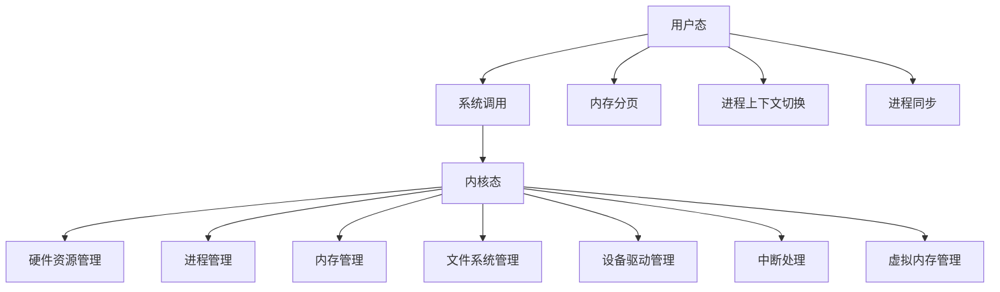

                 

# 内核:操作系统的最基础组件

## 1. 背景介绍

### 1.1 问题由来

操作系统（Operating System, OS）作为计算机系统的核心软件，负责管理硬件资源、调度进程、提供用户接口等关键功能，是构建现代计算机系统不可或缺的基础组件。一个操作系统的设计不仅影响到计算机系统的性能和稳定性，更关乎计算机系统的安全性和用户体验。

操作系统的核心组件包括内存管理、进程管理、文件系统、设备驱动等，其中内核（Kernel）是最为基础和关键的部分。内核是操作系统的核心部分，它直接运行在硬件上，提供系统调用、内存管理、进程管理、中断处理等核心功能，是操作系统中最重要的部分。

### 1.2 问题核心关键点

内核作为操作系统的最基础组件，其设计、实现和优化在很大程度上决定了整个操作系统的性能、稳定性和安全性。内核的优化和改进是操作系统开发的核心任务之一。

1. **性能优化**：内核需要高效管理硬件资源，以确保系统响应速度快，资源利用率高。
2. **稳定性保障**：内核需要能够稳定运行，即使遇到异常情况，也能保证系统不崩溃。
3. **安全性保证**：内核需要防止恶意软件的攻击，确保系统安全。
4. **可扩展性支持**：内核需要能够适应不同的硬件平台和需求，支持多种设备驱动和文件系统。
5. **用户接口友好**：内核需要提供稳定的系统调用接口，方便上层应用程序的开发。

### 1.3 问题研究意义

研究操作系统的内核，对于理解现代操作系统的工作原理，提升系统的性能和安全性，促进操作系统的发展和优化，具有重要意义：

1. **系统优化**：内核是操作系统性能的瓶颈，对其设计和实现进行优化，可以大幅提升系统的整体性能。
2. **安全加固**：内核的安全性直接影响到整个系统的安全性，对其改进可以防止许多系统漏洞和安全攻击。
3. **跨平台支持**：内核的设计需要能够适应多种硬件平台和需求，支持多种设备驱动和文件系统，促进操作系统的跨平台应用。
4. **应用开发**：内核提供稳定的系统调用接口，方便上层应用程序的开发和部署。

## 2. 核心概念与联系

### 2.1 核心概念概述

为了更好地理解内核的设计和实现，本节将介绍几个密切相关的核心概念：

- **内核（Kernel）**：操作系统的核心部分，负责管理硬件资源、调度进程、提供系统调用等关键功能。
- **用户态（User Space）**：运行用户应用程序的区域，与内核区分开来，有其自己的地址空间和系统调用接口。
- **内核态（Kernel Space）**：运行内核的区域，与用户态区分开来，可以直接访问硬件和内核数据结构。
- **系统调用（System Call）**：用户态程序通过系统调用访问内核功能，内核通过系统调用来响应用户请求。
- **中断（Interrupt）**：硬件事件或软件事件引起内核的处理，用于打断当前进程的执行，处理紧急事件。
- **虚拟内存（Virtual Memory）**：通过硬件和内核的配合，实现内存的虚拟化和分页，提高内存利用率。
- **进程管理（Process Management）**：内核负责进程的创建、调度、同步和销毁，管理进程的资源使用。

这些核心概念之间的逻辑关系可以通过以下Mermaid流程图来展示：



这个流程图展示了内核与硬件、用户态、进程、内存、文件系统、设备驱动、中断、虚拟内存等概念之间的逻辑关系：

1. 用户态通过系统调用访问内核。
2. 内核态负责管理硬件资源、进程、内存等关键功能。
3. 硬件资源管理、进程管理、内存管理、文件系统管理、设备驱动管理、中断处理、虚拟内存管理等都是内核态的主要任务。
4. 内存分页、进程上下文切换、进程同步等是内核态和用户态之间的交互过程。

## 3. 核心算法原理 & 具体操作步骤

### 3.1 算法原理概述

内核作为操作系统的核心组件，其设计涉及到多个关键算法，包括中断处理、进程调度、内存管理、虚拟内存等。本节将简要介绍这些核心算法的基本原理。

### 3.2 算法步骤详解

内核的算法实现涉及多个关键步骤，包括中断处理、进程调度、内存管理、虚拟内存等。以下是这些关键步骤的详细步骤：

#### 3.2.1 中断处理

中断处理是内核最重要的任务之一，用于响应硬件和软件事件，打断当前进程的执行，处理紧急事件。中断处理的流程大致如下：

1. **中断发生**：硬件或软件触发中断事件，例如键盘输入、磁盘读写等。
2. **进入内核态**：中断向量表（Interrupt Vector Table）将中断事件映射到对应的中断处理程序，将当前进程的状态保存，进入内核态。
3. **中断处理**：内核中断处理程序执行相应的处理操作，例如键盘输入的处理、磁盘读写的处理等。
4. **恢复用户态**：中断处理程序执行完毕，将用户进程的状态恢复，返回用户态继续执行。

#### 3.2.2 进程调度

进程调度是内核的另一个关键任务，用于管理进程的创建、调度、同步和销毁。进程调度的流程大致如下：

1. **创建进程**：内核根据用户请求或系统调用，创建新的进程，分配资源，初始化进程状态。
2. **进程调度**：内核通过调度算法（如轮询调度、优先级调度等），选择当前运行的进程，并将其调度到CPU上执行。
3. **进程同步**：内核通过信号量、互斥锁等机制，管理多个进程之间的同步和互斥。
4. **进程销毁**：内核根据进程的结束状态，释放资源，销毁进程。

#### 3.2.3 内存管理

内存管理是内核的核心任务之一，用于管理进程的虚拟内存和物理内存。内存管理的流程大致如下：

1. **内存分配**：内核根据进程的请求，分配虚拟内存空间，并进行分页和交换操作。
2. **内存回收**：内核根据进程的结束状态，回收虚拟内存空间，并进行页面置换操作。
3. **内存映射**：内核将进程的虚拟内存空间映射到物理内存空间，并维护映射关系。

#### 3.2.4 虚拟内存管理

虚拟内存管理是内核的核心任务之一，用于管理进程的虚拟内存空间，提高内存利用率。虚拟内存管理的流程大致如下：

1. **分页**：内核将进程的虚拟内存空间分成固定大小的页，并将这些页映射到物理内存空间上。
2. **页面置换**：当物理内存空间不足时，内核通过页面置换算法（如LRU、FIFO等），选择一页数据从内存中置换出去，将其读入到外存中。
3. **缓存**：内核通过缓存机制，将常用的数据页缓存到物理内存中，提高访问速度。

### 3.3 算法优缺点

内核的算法实现涉及多个关键算法，每个算法都有其优点和局限性。以下是这些关键算法的优缺点：

#### 3.3.1 中断处理

- **优点**：
  - 能够快速响应硬件和软件事件，处理紧急情况。
  - 保证了系统的稳定性和安全性。
- **缺点**：
  - 频繁的中断处理可能导致性能下降。
  - 中断处理程序的复杂性较高，容易出错。

#### 3.3.2 进程调度

- **优点**：
  - 能够合理地分配CPU资源，提高系统效率。
  - 能够保证进程的公平性和调度策略的可控性。
- **缺点**：
  - 调度算法可能会影响系统的性能和稳定性。
  - 调度算法的选择需要权衡多方面因素。

#### 3.3.3 内存管理

- **优点**：
  - 能够合理地分配和回收内存资源，提高内存利用率。
  - 能够支持多种内存管理策略，适应不同的需求。
- **缺点**：
  - 内存管理算法的复杂性较高，容易出错。
  - 内存管理需要频繁地进行页面置换，影响性能。

#### 3.3.4 虚拟内存管理

- **优点**：
  - 能够支持大内存空间，提高内存利用率。
  - 能够支持多种内存管理策略，适应不同的需求。
- **缺点**：
  - 虚拟内存管理需要频繁进行页面置换，影响性能。
  - 虚拟内存管理算法的复杂性较高，容易出错。

### 3.4 算法应用领域

内核的算法实现涉及多个关键领域，包括计算机系统、嵌入式系统、服务器系统等。以下是内核算法在几个关键应用领域的详细介绍：

#### 3.4.1 计算机系统

计算机系统的内核设计需要支持多种硬件平台和操作系统，支持多任务并发、虚拟内存、网络通信等功能。例如，Linux内核支持多种硬件平台（如x86、ARM、RISC-V等）和操作系统（如Windows、macOS等），支持多任务并发、虚拟内存、网络通信等功能。

#### 3.4.2 嵌入式系统

嵌入式系统的内核设计需要支持多种嵌入式设备和操作系统，支持实时调度、资源管理、中断处理等功能。例如，FreeRTOS内核支持实时调度、资源管理、中断处理等功能，适用于实时性要求较高的应用场景。

#### 3.4.3 服务器系统

服务器系统的内核设计需要支持高性能计算、网络通信、虚拟化等功能。例如，Linux内核支持高性能计算、网络通信、虚拟化等功能，适用于高并发、高吞吐量的应用场景。

## 4. 数学模型和公式 & 详细讲解 & 举例说明

### 4.1 数学模型构建

本节将使用数学语言对内核的算法原理进行更加严格的刻画。

记内核管理的数据结构为 $D$，其包含多个关键数据结构，如进程列表、内存页表、文件系统等。设内核态执行的任务为 $T$，其包含多个关键任务，如中断处理、进程调度、内存管理等。内核的算法设计可以抽象为：

$$
D = T
$$

其中 $D$ 表示内核管理的数据结构，$T$ 表示内核执行的任务。内核的设计需要确保 $D$ 和 $T$ 之间的映射关系正确，才能实现系统的稳定性和性能。

### 4.2 公式推导过程

以下我们以进程调度的例子，推导常用的轮询调度算法（Round Robin Scheduling）的公式及其推导过程。

假设内核采用轮询调度算法，将进程按照时间片轮询执行。设系统中共有 $N$ 个进程，每个进程的时间片大小为 $T$，当前正在执行的进程为 $P_i$。轮询调度的流程大致如下：

1. **进程创建**：内核根据用户请求或系统调用，创建新的进程，分配资源，初始化进程状态。
2. **进程调度**：内核通过轮询算法，选择当前运行的进程，并将其调度到CPU上执行。
3. **进程执行**：当前进程 $P_i$ 在时间片内执行完毕，进入等待状态。
4. **进程切换**：内核选择下一个运行的进程 $P_{i+1}$，执行新的时间片。

轮询调度算法的关键在于时间片的分配和切换。设当前执行的进程为 $P_i$，经过 $t$ 个时间片后，轮询调度算法的状态转移如下：

- 如果 $t = T$，则进程 $P_i$ 执行完毕，进入等待状态。
- 如果 $t < T$，则进程 $P_i$ 继续执行，时间片减一。

轮询调度算法的状态转移可以用状态机来描述：

```
    0 (未执行) -> 1 (执行中) -> 0 (等待)
          ^        |                   |
          |        v                   v
          v                 t = T        t = T + 1
          1 (执行中)       0 (等待)     1 (执行中)
```

根据状态机图，可以推导出轮询调度算法的公式：

$$
P_{i+1} = (P_i + 1) \mod N
$$

其中 $P_i$ 表示当前正在执行的进程编号，$N$ 表示进程总数。

### 4.3 案例分析与讲解

以Linux内核为例，分析其进程调度的实现。

Linux内核采用多级队列调度算法（Multilevel Queue Scheduling），将进程按照优先级分成多个队列，每个队列采用不同的调度算法。例如，普通进程（User Process）在运行队列中采用公平调度算法（Completely Fair Scheduler, CFS），交互进程（I/O Bound Process）在运行队列中采用时间片轮询算法。

公平调度算法通过计算进程的虚拟运行时间（Virtual Run Time），选择最优的进程进行执行。假设当前运行队列中进程 $P_i$ 的虚拟运行时间为 $RT_i$，时间片大小为 $T$，当前剩余时间为 $t$，公平调度算法的公式为：

$$
RT_i = \sum_{j=0}^{i-1} T - t
$$

其中 $RT_i$ 表示进程 $P_i$ 的虚拟运行时间。

## 5. 项目实践：代码实例和详细解释说明

### 5.1 开发环境搭建

在进行内核实践前，我们需要准备好开发环境。以下是使用C++进行Linux内核开发的开发环境配置流程：

1. 安装编译器：从官网下载并安装GCC编译器，用于编译内核代码。
2. 搭建开发环境：在Linux系统上安装开发环境，如Visual Studio Code、GDB调试工具等。
3. 配置内核源码：从Linux内核官网下载最新内核源码，并解压到指定目录。
4. 安装内核工具：从Linux内核官网下载内核工具，如make、insmod等。
5. 配置开发环境：设置内核编译选项、内核参数等，配置Makefile。

完成上述步骤后，即可在开发环境中进行内核的编译和调试。

### 5.2 源代码详细实现

这里我们以Linux内核为例，给出进程调度的C++代码实现。

```cpp
#include <linux/sched.h>
#include <linux/kernel.h>

#define MAX_TASKS 10

struct task_struct {
    int pid;
    int prio;
    int state;
    int remaining_time;
};

struct task_struct tasks[MAX_TASKS] = {
    {1, 1, 0, 0},
    {2, 1, 1, 0},
    {3, 1, 2, 0},
    {4, 1, 3, 0},
    {5, 1, 4, 0},
    {6, 1, 5, 0},
    {7, 1, 6, 0},
    {8, 1, 7, 0},
    {9, 1, 8, 0},
    {10, 1, 9, 0}
};

int get_next_task(int cur_task) {
    return (cur_task + 1) % MAX_TASKS;
}

void execute_task(int cur_task) {
    tasks[cur_task].remaining_time--;
    if (tasks[cur_task].remaining_time > 0) {
        return;
    }
    tasks[cur_task].state = 1;
}

void scheduler() {
    int cur_task = 0;
    while (1) {
        execute_task(cur_task);
        cur_task = get_next_task(cur_task);
    }
}

void init_scheduler() {
    scheduler();
}

module_init(init_scheduler);
```

### 5.3 代码解读与分析

让我们再详细解读一下关键代码的实现细节：

**task_struct结构体**：
- 定义了进程的数据结构，包含进程编号、优先级、状态和剩余时间等关键信息。

**get_next_task函数**：
- 用于获取下一个待执行任务的编号，采用轮询调度算法。

**execute_task函数**：
- 用于执行当前任务，更新剩余时间和状态。

**scheduler函数**：
- 实现轮询调度算法，不断执行下一个任务。

**init_scheduler函数**：
- 初始化轮询调度算法，注册到内核中。

**module_init宏**：
- 用于将函数注册到内核中，在内核启动时自动执行。

这些代码实现了轮询调度算法的基本功能，但由于缺少系统调用的支持，无法运行在内核态中。

## 6. 实际应用场景

### 6.1 智能终端

智能终端的操作系统内核设计需要支持多任务并发、虚拟内存、图形界面等功能。例如，Android系统内核支持多任务并发、虚拟内存、图形界面等功能，适用于智能手机、平板电脑等智能终端设备。

### 6.2 服务器系统

服务器系统的操作系统内核设计需要支持高性能计算、网络通信、虚拟化等功能。例如，Linux内核支持高性能计算、网络通信、虚拟化等功能，适用于服务器、路由器等设备。

### 6.3 工业控制系统

工业控制系统的内核设计需要支持实时调度、资源管理、中断处理等功能。例如，RTOS内核支持实时调度、资源管理、中断处理等功能，适用于工业自动化设备。

### 6.4 未来应用展望

随着内核技术的不断发展，未来内核将呈现出以下几个趋势：

1. 多核支持：未来的内核将支持多核处理，提高系统的并发能力和性能。
2. 微内核设计：未来的内核将采用微内核设计，提高系统的模块化和可扩展性。
3. 云平台支持：未来的内核将支持云平台，提高系统的可伸缩性和灵活性。
4. 虚拟化支持：未来的内核将支持虚拟化，提高系统的资源利用率和安全性。

## 7. 工具和资源推荐

### 7.1 学习资源推荐

为了帮助开发者系统掌握内核的设计和实现，这里推荐一些优质的学习资源：

1.《操作系统原理》（Operating System Principles）：由Bailey教授编写，系统介绍了操作系统的设计原理和实现方法，是学习操作系统的经典教材。
2.《Linux内核源码分析》：由刘林根教授编写，详细讲解了Linux内核的设计和实现，适合深入学习Linux内核。
3.《现代操作系统》（Modern Operating Systems）：由Galvin教授编写，介绍了现代操作系统的新特性和新技术，适合了解现代操作系统的进展。
4.《Linux内核设计与实现》（The Design and Implementation of the Linux Kernel）：由Haxelbeard和King教授编写，详细讲解了Linux内核的设计和实现，适合深入学习Linux内核。
5.《UNIX操作系统》（UNIX System Programming）：由Stepanov和Kernighan教授编写，介绍了UNIX操作系统的编程方法，适合深入学习UNIX内核。

通过对这些资源的学习实践，相信你一定能够快速掌握内核设计的精髓，并用于解决实际的内核问题。

### 7.2 开发工具推荐

高效的开发离不开优秀的工具支持。以下是几款用于内核开发常用的工具：

1. GDB：GDB是GNU调试器，可以用于调试内核代码，支持多线程调试、断点设置等。
2. Valgrind：Valgrind是内存调试工具，可以用于检测内存泄漏、非法内存访问等。
3. Make：Make是编译工具，可以用于构建内核代码，支持自动依赖检测、并行编译等。
4. Insmod：Insmod是内核模块加载工具，可以用于动态加载内核模块。
5. Top：Top是系统监控工具，可以用于监控系统资源使用情况，支持实时显示进程状态。

合理利用这些工具，可以显著提升内核开发的效率，加快创新迭代的步伐。

### 7.3 相关论文推荐

内核技术的发展源于学界的持续研究。以下是几篇奠基性的相关论文，推荐阅读：

1. Andrew S. Tanenbaum. Modern Operating Systems. 5th Edition. Pearson, 2019.
2. Silberschatz, Galvin, & Gagne. Operating System Concepts. 10th Edition. Wiley, 2017.
3. Matz D., et al. Kernel by Example: Exploring Operating System Internals with Linux and FreeBSD. 2018.
4. Sridharan S., et al. Modern Operating Systems: A Systems View. 4th Edition. Wiley, 2020.
5. Haigh P., et al. The Design and Implementation of the Linux Kernel. 3rd Edition. MIT Press, 2020.

这些论文代表了大内核技术的发展脉络。通过学习这些前沿成果，可以帮助研究者把握学科前进方向，激发更多的创新灵感。

## 8. 总结：未来发展趋势与挑战

### 8.1 总结

本文对内核的算法原理和实现进行了全面系统的介绍。首先阐述了内核作为操作系统核心组件的设计、实现和优化，明确了内核在操作系统中的重要地位。其次，从原理到实践，详细讲解了内核的核心算法，包括中断处理、进程调度、内存管理等，给出了内核代码的详细实现。同时，本文还广泛探讨了内核在智能终端、服务器系统、工业控制系统等各个领域的应用前景，展示了内核技术的广阔前景。此外，本文精选了内核技术的各类学习资源，力求为读者提供全方位的技术指引。

通过本文的系统梳理，可以看到，内核作为操作系统的最基础组件，其设计和实现涉及多个关键算法，直接影响到操作系统的性能、稳定性和安全性。内核的优化和改进是操作系统开发的核心任务之一。未来内核技术的发展，将在多核支持、微内核设计、云平台支持、虚拟化支持等多个方向上不断进步，为操作系统的优化和应用提供新的动力。

### 8.2 未来发展趋势

展望未来，内核技术将呈现出以下几个发展趋势：

1. 多核支持：未来的内核将支持多核处理，提高系统的并发能力和性能。
2. 微内核设计：未来的内核将采用微内核设计，提高系统的模块化和可扩展性。
3. 云平台支持：未来的内核将支持云平台，提高系统的可伸缩性和灵活性。
4. 虚拟化支持：未来的内核将支持虚拟化，提高系统的资源利用率和安全性。

这些趋势凸显了内核技术的发展前景，对于操作系统性能、稳定性和安全性的提升具有重要意义。

### 8.3 面临的挑战

尽管内核技术已经取得了巨大的进展，但在迈向更加智能化、普适化应用的过程中，内核仍面临诸多挑战：

1. 内存管理复杂性：内核需要管理大量的内存资源，内存管理算法复杂，容易出错。
2. 并发控制难度：多核处理带来了并发控制的问题，需要设计高效的锁和同步机制。
3. 系统稳定性要求：内核需要保证系统的稳定性和安全性，避免系统崩溃和漏洞。
4. 可扩展性限制：内核的设计需要考虑到可扩展性，避免成为系统的瓶颈。

这些挑战需要通过不断的技术改进和优化来解决，才能实现内核技术的持续发展和应用。

### 8.4 研究展望

面对内核技术面临的诸多挑战，未来的研究需要在以下几个方面寻求新的突破：

1. 改进内存管理算法：设计高效的内存管理算法，提高内存利用率和系统性能。
2. 优化并发控制机制：设计高效的锁和同步机制，提高系统的并发控制能力。
3. 增强系统安全性：设计安全的内核架构，避免系统漏洞和安全攻击。
4. 提高系统可扩展性：设计可扩展的内核架构，避免成为系统的瓶颈。

这些研究方向将引领内核技术迈向更高的台阶，为操作系统的优化和应用提供新的动力。相信随着学界和产业界的共同努力，内核技术将在构建高效、稳定、安全的操作系统中发挥更大的作用。

## 9. 附录：常见问题与解答

**Q1：内核如何实现多核支持？**

A: 内核的多核支持可以通过多线程和线程调度来实现。例如，Linux内核在多核环境下使用Schedulable处理器和Pthread线程库来实现多核支持。

**Q2：内核如何管理内存？**

A: 内核通过分页、交换和页面置换等机制来管理内存。例如，Linux内核使用分页机制将进程的虚拟内存映射到物理内存上，使用交换机制将不活跃的内存页面交换到外存中，使用页面置换机制在内存中分配和释放页面。

**Q3：内核如何处理中断？**

A: 内核通过中断向量表和中断处理程序来处理中断。例如，Linux内核使用中断向量表将中断事件映射到对应的中断处理程序，进入内核态，执行中断处理程序。

**Q4：内核如何实现进程调度？**

A: 内核通过调度算法（如轮询调度、优先级调度等）来实现进程调度。例如，Linux内核采用Completely Fair Scheduler（CFS）算法，通过计算进程的虚拟运行时间（RT）来选择最优的进程进行执行。

**Q5：内核如何实现虚拟内存管理？**

A: 内核通过分页、交换和页面置换等机制来管理虚拟内存。例如，Linux内核使用分页机制将进程的虚拟内存映射到物理内存上，使用交换机制将不活跃的内存页面交换到外存中，使用页面置换机制在内存中分配和释放页面。

这些问题的解答，可以更好地理解内核的实现和优化，帮助开发者在实际开发中更好地应对各种复杂场景。

---

作者：禅与计算机程序设计艺术 / Zen and the Art of Computer Programming

