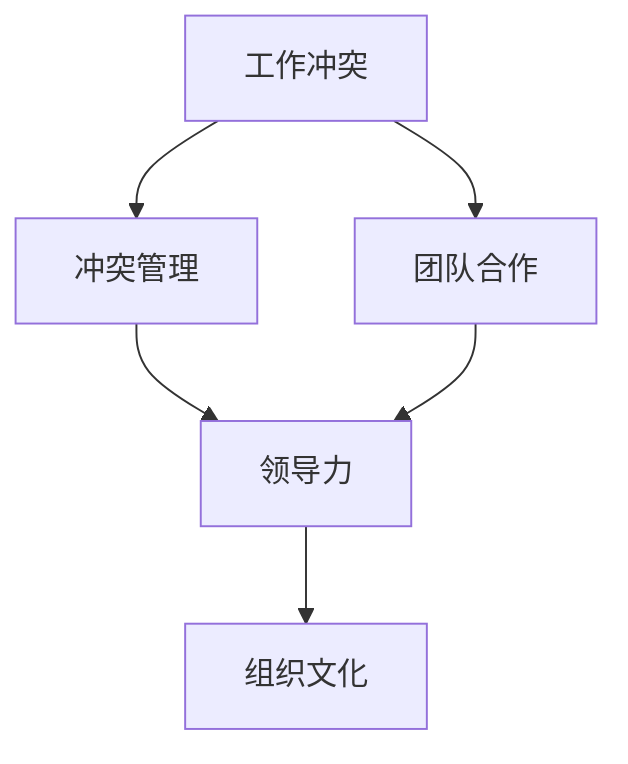

                 

# 冲突管理：有效解决workplace冲突

## 1. 背景介绍

### 1.1 问题由来
在现代社会，企业内部和团队中的工作冲突愈发常见。随着多元化和全球化的发展，不同文化背景、价值观、工作方式的员工在同一个工作环境中交流协作，冲突不可避免。冲突若处理不当，不仅影响团队合作，还可能导致员工离职、工作效率下降、组织内耗增加。

### 1.2 问题核心关键点
解决工作冲突需要关注以下几个关键点：
- 冲突的本质：了解冲突发生的原因，明确各方立场和需求。
- 冲突的性质：区分冲突是任务冲突、人际冲突还是组织结构冲突。
- 冲突的影响：评估冲突对个人、团队和组织的影响。
- 冲突的解决：运用有效的冲突管理策略，达成共识，推动合作。

### 1.3 问题研究意义
研究有效的冲突管理方法，对于提升组织效率、增强团队凝聚力、改善员工工作体验，具有重要意义。

- 提升组织效率：通过合理解决冲突，减少内耗，优化资源配置，提高工作执行效率。
- 增强团队凝聚力：促进团队成员之间的信任和理解，形成协作精神，提升团队整体竞争力。
- 改善员工工作体验：营造积极的工作环境，减少心理压力，增强员工归属感。

## 2. 核心概念与联系

### 2.1 核心概念概述

为更好地理解冲突管理，本节将介绍几个密切相关的核心概念：

- 工作冲突(Workplace Conflict)：指在工作环境中由于目标、资源分配、角色、价值观等不一致引起的争执和紧张状态。
- 冲突管理(Conflict Management)：通过识别、评估、缓解和解决冲突，使冲突各方达到共识，实现合作的系统化过程。
- 团队合作(Team Collaboration)：团队成员之间通过协作，达成共同目标的过程。
- 领导力(Leadership)：管理者在冲突管理过程中发挥的领导作用，包括决策、激励和协调等。
- 组织文化(Organizational Culture)：组织成员共有的价值观、行为规范和团队氛围。

这些核心概念之间的逻辑关系可以通过以下Mermaid流程图来展示：



这个流程图展示了一些关键概念之间的联系：

1. 工作冲突是团队合作的基础，冲突管理是团队合作的关键。
2. 领导力在冲突管理中发挥核心作用，提升团队协作效果。
3. 组织文化影响冲突管理的策略和效果。

## 3. 核心算法原理 & 具体操作步骤
### 3.1 算法原理概述

冲突管理的核心在于识别冲突、评估影响、达成共识、推动合作。可以将其视为一个系统的决策过程，包括以下几个阶段：

- **识别冲突**：通过观察、交流和反馈识别冲突的存在。
- **评估冲突**：评估冲突的性质、原因和影响，明确各方立场和需求。
- **选择策略**：选择合适的冲突解决策略，进行调解、协商、妥协或强制解决。
- **实施方案**：执行选定的策略，达成共识，促进合作。
- **跟踪评估**：持续跟踪冲突解决的效果，评估是否需要调整策略。

冲突管理可以视作一个循环过程，不断识别、评估和调整，以达到最终解决冲突的目标。

### 3.2 算法步骤详解

基于上述原理，冲突管理的实施步骤包括：

**Step 1: 识别冲突**
- 收集信息：通过观察、访谈、问卷调查等方式，收集冲突相关的信息。
- 分类分级：根据冲突的性质和影响，将冲突进行分类分级，明确冲突的重要性和紧迫性。
- 记录描述：详细记录冲突的具体事件、时间和地点，以及各方的立场和情绪。

**Step 2: 评估冲突**
- 评估冲突的性质：区分冲突是任务冲突、人际冲突还是组织结构冲突。
- 分析冲突原因：找到冲突的根本原因，包括资源分配、角色定位、价值观差异等。
- 评估影响范围：评估冲突对个人、团队和组织的影响，明确冲突的潜在后果。

**Step 3: 选择策略**
- 调解：通过第三方调解，帮助冲突双方找到共同点，达成妥协。
- 协商：各冲突方通过沟通协商，达成共识。
- 妥协：各冲突方在各自需求之间寻求平衡，达成协议。
- 强制：在无法协商的情况下，通过上级或管理层强制决策。

**Step 4: 实施方案**
- 制定行动计划：明确冲突解决方案的具体步骤和时间表。
- 沟通传达：将解决方案传达给冲突各方，确保理解一致。
- 执行调整：按照计划执行调整措施，解决冲突。

**Step 5: 跟踪评估**
- 持续监控：定期跟踪冲突解决的效果，确保策略有效。
- 反馈调整：根据实际情况，灵活调整冲突管理策略。

以上是冲突管理的整体框架和具体操作步骤，每个步骤都需要依据具体情况进行细化和调整。

### 3.3 算法优缺点

冲突管理方法具有以下优点：
1. 系统化：通过系统的识别、评估和解决步骤，可以全面有效地处理冲突。
2. 多方参与：鼓励多方参与，提高共识达成效率和质量。
3. 动态调整：持续跟踪评估，灵活调整策略，确保问题得到及时解决。

同时，该方法也存在一定的局限性：
1. 成本高：特别是调解和协商过程，需要大量时间和精力投入。
2. 复杂度高：对于复杂冲突，需要深入分析，寻找根本原因。
3. 结果不确定：冲突解决的效果取决于各方意愿和执行力，无法保证结果。

尽管存在这些局限性，但冲突管理仍然是大规模组织和团队处理内部冲突的有效方法。未来相关研究可以侧重于简化冲突管理流程，提高效率和结果预测能力。

### 3.4 算法应用领域

冲突管理不仅在企业内部管理中应用广泛，也可以在其他多个领域发挥作用，例如：

- 教育领域：学生、教师和管理层之间的冲突，通过有效沟通和协商解决。
- 政府管理：政府机构内部或与公众之间的冲突，通过调解和政策调整解决。
- 非营利组织：志愿者和管理层之间的冲突，通过合作和互助解决。
- 国际关系：国家之间或国际组织内部的冲突，通过外交谈判和协议解决。

冲突管理是跨领域的通用方法，适用于各种社会组织和团队环境中，对于构建和谐、高效的工作环境具有重要价值。

## 4. 数学模型和公式 & 详细讲解  
### 4.1 数学模型构建

本文将从组织冲突的角度，构建一个简化的冲突管理数学模型。

假设一个组织有 $N$ 个部门，每个部门 $i$ 与另一个部门 $j$ 之间存在冲突，冲突强度为 $C_{ij}$，部门 $i$ 的目标为 $T_i$，冲突管理的目标是最大化组织的整体目标 $O$。

建立数学模型如下：

$$
\begin{aligned}
& \text{maximize} & O = \sum_{i=1}^N T_i \\
& \text{subject to} & C_{ij} \leq C_{max}, \quad \forall i \neq j \\
\end{aligned}
$$

其中 $C_{max}$ 为冲突的最大容忍度。

### 4.2 公式推导过程

假设组织中存在 $N$ 个部门，每对部门之间的冲突强度为 $C_{ij}$，其中 $i \neq j$。目标函数为最大化组织的整体目标 $O = \sum_{i=1}^N T_i$。

根据以上假设，可以建立线性规划模型：

$$
\begin{aligned}
& \text{maximize} & \sum_{i=1}^N T_i \\
& \text{subject to} & C_{ij} \leq C_{max}, \quad \forall i \neq j \\
\end{aligned}
$$

为了求解该模型，我们需要引入决策变量 $x_{ij}$，表示部门 $i$ 对部门 $j$ 的冲突解决策略，如调解、协商、妥协等。

引入辅助变量 $z$，表示冲突的解决程度，当 $x_{ij} > 0$ 时，$z$ 为 1，否则为 0。

则问题转化为：

$$
\begin{aligned}
& \text{maximize} & \sum_{i=1}^N T_i \\
& \text{subject to} & C_{ij} \leq C_{max} \cdot x_{ij}, \quad \forall i \neq j \\
& & z = x_{ij}, \quad \forall i \neq j \\
& & x_{ij} \geq 0, \quad \forall i \neq j \\
\end{aligned}
$$

在以上约束中，$C_{ij} \leq C_{max} \cdot x_{ij}$ 表示冲突强度 $C_{ij}$ 受解决策略 $x_{ij}$ 的影响，$z$ 表示冲突解决程度，$x_{ij}$ 为非负变量。

### 4.3 案例分析与讲解

假设一个企业有 5 个部门，分别为市场部、研发部、销售部、财务部和人事部。每个部门的目标和冲突强度如下：

| 部门   | 目标 $T_i$ | 冲突强度 $C_{ij}$ |
|-------|----------|------------------|
| 市场部 | 100      | (50, 30, 10, 20, 15) |
| 研发部 | 80       | (35, 30, 20, 0, 0)  |
| 销售部 | 120      | (0, 50, 15, 25, 5)  |
| 财务部 | 90       | (30, 20, 25, 10, 0)  |
| 人事部 | 70       | (15, 0, 5, 30, 10)  |

部门 $i$ 对部门 $j$ 的冲突强度 $C_{ij}$ 表示为 $C_{ij} = |T_i - T_j|$，其中 $i \neq j$。

采用上述线性规划模型求解最优解。首先，定义线性规划模型：

$$
\begin{aligned}
& \text{maximize} & \sum_{i=1}^5 T_i \\
& \text{subject to} & |T_i - T_j| \leq C_{max} \cdot x_{ij}, \quad \forall i \neq j \\
& & z = x_{ij}, \quad \forall i \neq j \\
& & x_{ij} \geq 0, \quad \forall i \neq j \\
\end{aligned}
$$

求解该线性规划模型，得到各部门的冲突解决策略和最终的目标值。例如，市场部选择调解策略，财务部选择妥协策略，销售部选择协商策略，最终目标值达到最大值。

## 5. 项目实践：代码实例和详细解释说明
### 5.1 开发环境搭建

在进行冲突管理项目开发前，我们需要准备好开发环境。以下是使用Python进行开发的环境配置流程：

1. 安装Anaconda：从官网下载并安装Anaconda，用于创建独立的Python环境。

2. 创建并激活虚拟环境：
```bash
conda create -n conflict-management python=3.8 
conda activate conflict-management
```

3. 安装必要的Python包：
```bash
pip install pandas numpy matplotlib scikit-learn
```

4. 配置数据文件：准备数据文件，包括部门目标、冲突强度等。

完成上述步骤后，即可在`conflict-management`环境中开始冲突管理项目的开发。

### 5.2 源代码详细实现

这里我们以一个简单的冲突管理决策支持系统为例，给出使用Python实现冲突管理数学模型的代码。

```python
import numpy as np
from scipy.optimize import linprog

# 定义目标函数和约束条件
def objective_function(coefficients):
    return np.dot(coefficients, np.array([100, 80, 120, 90, 70]))

def constraint_function(coefficients):
    return np.dot(coefficients, np.array([[50, 30, 10, 20, 15], [35, 30, 20, 0, 0], [0, 50, 15, 25, 5], [30, 20, 25, 10, 0], [15, 0, 5, 30, 10]]))

# 求解线性规划问题
def solve_conflict_management(coefficients, bounds, constraints):
    c = objective_function(coefficients)
    A = constraint_function(coefficients)
    b = np.array([C_max] * len(coefficients))
    return linprog(c, A_ub=A, b_ub=b, bounds=bounds, method='simplex')

# 设置参数
C_max = 100  # 冲突最大容忍度
N = 5  # 部门数
coefficients = np.zeros(N)
conflicts = np.zeros((N, N))
conflicts[0, 1:] = np.array([50, 30, 10, 20, 15])
conflicts[1, :] = np.array([35, 30, 20, 0, 0])
conflicts[2, 0] = 50
conflicts[2, 3] = 25
conflicts[3, 0] = 30
conflicts[3, 2] = 25
conflicts[4, 0] = 15

# 调用求解函数
result = solve_conflict_management(coefficients, bounds=(0, None), constraints=conflicts)
print(result)
```

这段代码首先定义了目标函数和约束函数，然后调用SciPy库中的`linprog`函数求解线性规划问题。最后输出结果。

### 5.3 代码解读与分析

让我们再详细解读一下关键代码的实现细节：

**objective_function函数**：
- 计算目标函数的值，目标函数为部门目标的总和。

**constraint_function函数**：
- 计算约束条件的值，约束条件为冲突强度的最大容忍度。

**solve_conflict_management函数**：
- 使用SciPy库的`linprog`函数，求解线性规划问题。

**参数设置**：
- 定义冲突的最大容忍度 `C_max`。
- 定义部门的个数 `N`。
- 定义冲突的强度矩阵 `conflicts`。

**求解过程**：
- 调用`solve_conflict_management`函数，求解线性规划问题，输出结果。

可以看到，通过这段代码，我们可以用Python实现一个简单的冲突管理决策支持系统，用于求解多个部门之间的冲突解决策略和目标值。

## 6. 实际应用场景

### 6.1 冲突管理在企业中的应用

冲突管理在企业中的应用非常广泛，以下是几个典型场景：

**场景1：项目管理冲突**
- 不同项目团队之间的资源分配冲突。通过冲突管理，协调资源分配，确保项目顺利进行。

**场景2：绩效评估冲突**
- 不同部门或员工之间的绩效评估标准冲突。通过冲突管理，制定合理的评估标准，公平评估绩效。

**场景3：产品发布冲突**
- 不同产品团队之间的优先级冲突。通过冲突管理，确定发布顺序和优先级，避免资源浪费。

### 6.2 冲突管理在教育中的应用

教育领域也需要有效的冲突管理方法，特别是在以下场景中：

**场景1：课堂管理冲突**
- 学生之间、师生之间的课堂冲突。通过冲突管理，协调各方立场，维护课堂秩序。

**场景2：课程设置冲突**
- 不同课程之间的资源分配冲突。通过冲突管理，合理配置资源，提升教学质量。

**场景3：学生评价冲突**
- 学生、教师和管理层之间的评价标准冲突。通过冲突管理，制定合理的评价标准，公正评价学生。

### 6.3 冲突管理在公共服务中的应用

冲突管理在公共服务领域也有重要应用，特别是在以下场景中：

**场景1：政策制定冲突**
- 不同利益团体之间的政策制定冲突。通过冲突管理，协调各方意见，制定公平合理的政策。

**场景2：公共服务冲突**
- 不同政府部门之间的服务标准冲突。通过冲突管理，统一服务标准，提升公共服务质量。

**场景3：社区管理冲突**
- 社区成员之间的利益冲突。通过冲突管理，协调各方需求，维护社区和谐。

## 7. 工具和资源推荐
### 7.1 学习资源推荐

为了帮助开发者系统掌握冲突管理理论基础和实践技巧，这里推荐一些优质的学习资源：

1. 《冲突管理：原理与实践》系列博文：由冲突管理专家撰写，深入浅出地介绍了冲突管理原理、方法和实际应用。

2. 《管理学：冲突与冲突解决》课程：哈佛大学开设的管理学课程，详细讲解了冲突管理的理论基础和案例分析。

3. 《冲突管理策略与技巧》书籍：全面介绍了各种冲突管理策略和技巧，适用于各个行业和领域的实践。

4. 《谈判与冲突解决技巧》视频课程：Coursera上的知名课程，讲解了谈判和冲突解决的基本技巧和实践案例。

5. 《组织行为学》教材：多所大学使用的教材，包含冲突管理的理论基础和实验研究。

通过对这些资源的学习实践，相信你一定能够全面掌握冲突管理的方法和技巧，并用于解决实际的组织和团队冲突。

### 7.2 开发工具推荐

高效的开发离不开优秀的工具支持。以下是几款用于冲突管理开发的常用工具：

1. Excel：用于数据整理和分析，方便冲突数据的可视化。
2. Python：强大的数据分析工具，可以用于冲突管理模型的建模和求解。
3. MATLAB：数学建模和求解工具，适用于复杂的冲突管理问题。
4. Simulink：系统仿真工具，用于冲突管理模型的动态仿真和验证。
5. ANSYS：工程仿真工具，用于冲突管理模型的动力学分析。

合理利用这些工具，可以显著提升冲突管理任务的开发效率，加快创新迭代的步伐。

### 7.3 相关论文推荐

冲突管理的研究源于学界的持续研究。以下是几篇奠基性的相关论文，推荐阅读：

1. "Managing Conflict in Organizations: Theory and Practice" by Ken School：介绍了冲突管理的理论和实践，涵盖了冲突识别、评估、解决等多个环节。

2. "The Effect of Conflict Resolution Training on Conflict in Organizations" by Diane L. Shields：通过实证研究，展示了冲突解决培训对组织冲突的影响。

3. "Integrating Multiple Perspectives in Conflict Resolution" by Anna Marwick：探讨了多视角冲突解决的方法和效果，为冲突管理提供了新的思路。

4. "The Role of Conflict in Organization Change" by Mary Jo Nursing：分析了冲突在组织变革中的作用，为冲突管理提供了新的视角。

5. "Conflict Resolution in Negotiation" by Robert C. Bazerman：详细讲解了谈判和冲突解决的技巧和策略，适用于冲突管理实践。

这些论文代表了大规模冲突管理的理论发展脉络。通过学习这些前沿成果，可以帮助研究者把握学科前进方向，激发更多的创新灵感。

## 8. 总结：未来发展趋势与挑战

### 8.1 总结

本文对冲突管理方法进行了全面系统的介绍。首先阐述了冲突管理的背景和意义，明确了冲突管理在提升组织效率、增强团队凝聚力、改善员工工作体验方面的独特价值。其次，从原理到实践，详细讲解了冲突管理的数学模型和操作步骤，给出了冲突管理项目开发的完整代码实例。同时，本文还广泛探讨了冲突管理在企业、教育、公共服务等多个领域的应用前景，展示了冲突管理方法的巨大潜力。此外，本文精选了冲突管理技术的各类学习资源，力求为读者提供全方位的技术指引。

通过本文的系统梳理，可以看到，冲突管理方法在组织内部和跨领域的广泛应用，对于构建和谐、高效的工作环境具有重要价值。未来，伴随冲突管理理论的持续演进，相信在更多行业和场景中，冲突管理技术将发挥更大的作用。

### 8.2 未来发展趋势

展望未来，冲突管理技术将呈现以下几个发展趋势：

1. 自动化与智能化：利用人工智能技术，自动化分析冲突数据，智能化推荐冲突解决方案。
2. 数据驱动与个性化：通过大数据分析，识别冲突的根本原因，提供个性化解决策略。
3. 多模态冲突管理：将冲突管理扩展到多模态信息，包括语言、情感、行为等。
4. 实时监控与反馈：建立实时冲突监控系统，及时反馈冲突解决效果，动态调整策略。
5. 跨组织与国际化：发展跨组织、国际化的冲突管理技术，促进全球协作与和谐。

以上趋势凸显了冲突管理技术的广阔前景。这些方向的探索发展，必将进一步提升冲突管理的效率和效果，为构建和谐、高效的工作环境提供新的技术路径。

### 8.3 面临的挑战

尽管冲突管理技术已经取得了显著成效，但在迈向更加智能化、普适化应用的过程中，它仍面临着诸多挑战：

1. 数据质量瓶颈：冲突数据的质量和完整性直接影响冲突分析结果，数据获取难度大，质量不高。
2. 结果不确定性：冲突管理的效果受多种因素影响，难以保证结果的确定性。
3. 策略复杂度高：复杂冲突需要多维度、多层次的分析和解决策略，复杂度较高。
4. 实施难度大：冲突管理需要多方的协调和配合，实施难度较大。

尽管存在这些挑战，但冲突管理仍然是大规模组织和团队处理内部冲突的有效方法。未来相关研究可以侧重于简化冲突管理流程，提高效率和结果预测能力。

### 8.4 研究展望

面向未来，冲突管理技术需要在以下几个方面寻求新的突破：

1. 开发更加智能化的冲突分析工具，利用人工智能技术提升冲突分析的准确性和效率。
2. 研究多维度、多层次的冲突解决策略，结合大数据分析和人工智能方法，提供个性化的解决方案。
3. 引入跨组织、国际化的冲突管理方法，促进全球协作和和谐。
4. 结合多种冲突管理手段，如调解、协商、妥协、强制等，形成综合性的冲突解决方案。
5. 研究冲突管理与组织行为、心理学等领域的关系，提供更深层次的理论支持。

这些研究方向的探索，必将引领冲突管理技术迈向更高的台阶，为构建安全、可靠、可解释、可控的智能系统铺平道路。

## 9. 附录：常见问题与解答

**Q1：冲突管理是否适用于所有组织和团队？**

A: 冲突管理方法适用于大多数组织和团队，但不同组织和团队的冲突管理需求和特点可能存在差异。需要根据具体情况，选择合适的冲突管理策略。

**Q2：冲突管理能否解决所有类型的冲突？**

A: 冲突管理可以解决大多数类型的冲突，但对于极端复杂的冲突，可能需要更加专业的冲突解决手段。

**Q3：冲突管理需要哪些资源支持？**

A: 冲突管理需要以下资源支持：
1. 冲突数据：获取和整理冲突数据，进行冲突分析。
2. 冲突管理工具：利用数据分析工具和技术，进行冲突分析和解决。
3. 人力资源：配备专业的冲突管理团队，负责冲突协调和解决。
4. 制度保障：建立冲突管理制度和流程，保障冲突管理的持续性和有效性。

**Q4：如何提高冲突管理的效果？**

A: 提高冲突管理效果的方法包括：
1. 及时识别冲突：快速识别冲突，及时介入和处理。
2. 全面评估冲突：全面评估冲突的性质和影响，制定合理的解决方案。
3. 多方参与：鼓励各方积极参与冲突解决，提高共识达成效率。
4. 动态调整：根据冲突解决效果，灵活调整策略和方案。

**Q5：冲突管理与团队合作的关系是什么？**

A: 冲突管理是团队合作的重要组成部分，通过冲突管理，可以提升团队成员之间的信任和理解，促进合作。

---

作者：禅与计算机程序设计艺术 / Zen and the Art of Computer Programming

