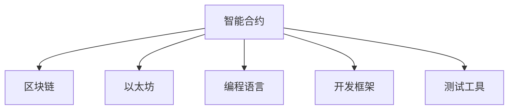

                 

## 1. 背景介绍

### 1.1 问题由来
智能合约是近年来区块链技术中最引人瞩目的应用之一，以其不可篡改、去中心化的特性，吸引了众多行业的关注。智能合约本质上是一种运行在区块链上的自动化合约，通过代码实现合约的执行和监控，无需第三方中介。

智能合约的应用场景包括但不限于金融、供应链、物流、版权等。然而，由于智能合约的特殊性质，其开发难度较大，需要具备丰富的加密算法、分布式系统、编程语言等多方面的知识。如何利用现有的技术优势，简化智能合约的开发流程，提升其可读性和可维护性，成为智能合约开发中的一个重要课题。

### 1.2 问题核心关键点
本文旨在探讨如何利用技术优势，对智能合约开发进行优化。智能合约开发的核心关键点包括：

- 代码的可读性和可维护性：智能合约需要由众多开发者协作开发，如何设计易于理解和维护的代码，是智能合约开发中的重要难题。
- 安全性：智能合约一旦部署，任何人都无法修改，因此需要确保其代码和逻辑绝对安全。
- 性能：智能合约在执行时需要消耗大量计算资源，如何优化代码以提高其执行效率，也是开发中的一个重要问题。
- 扩展性：智能合约需要支持复杂的多方协同，如何设计可扩展的架构，满足不同场景的需求，是智能合约开发中的挑战之一。
- 易用性：如何设计简单易用的接口，使得非技术人员也能理解和使用智能合约，是智能合约开发的另一个重要方面。

本文将围绕这些核心关键点，深入探讨如何利用现有的技术优势，简化智能合约的开发流程。

## 2. 核心概念与联系

### 2.1 核心概念概述

为更好地理解智能合约的开发优化方法，本节将介绍几个密切相关的核心概念：

- 智能合约(Smart Contracts)：一种运行在区块链上的自动化合约，通过代码实现合约的执行和监控。智能合约的本质是一种自执行、自验证的合约，无需第三方中介。

- 区块链(Blockchain)：一种分布式账本技术，通过去中心化的方式记录和验证交易，保障交易的不可篡改性和透明性。区块链是智能合约的运行平台，提供了智能合约执行的环境和规则。

- 以太坊(Ethereum)：一种基于区块链的去中心化平台，支持智能合约的开发和部署。以太坊提供了丰富的智能合约框架和工具，是智能合约开发的主流平台。

- 编程语言：智能合约通常使用Solidity、EVM字节码等编程语言进行开发。选择适合的编程语言，可以提高开发效率和代码质量。

- 开发框架：智能合约开发框架如Truffle、Remix、MythX等，提供了代码编辑器、调试器、测试框架等工具，简化了开发流程。

- 测试工具：如Truffle Test Framework、MythX等，用于编写、运行智能合约测试用例，保障合约的安全性和稳定性。

这些核心概念之间的逻辑关系可以通过以下Mermaid流程图来展示：



这个流程图展示了一些关键概念及其之间的关系：

1. 智能合约运行在区块链上，而以太坊是最流行的智能合约平台之一。
2. 智能合约使用Solidity、EVM字节码等编程语言进行开发。
3. 开发框架如Truffle、Remix、MythX等提供了各种开发工具，简化智能合约的开发流程。
4. 测试工具如Truffle Test Framework、MythX等用于编写和运行智能合约测试用例，保障合约的安全性和稳定性。

## 3. 核心算法原理 & 具体操作步骤
### 3.1 算法原理概述

智能合约开发的主要算法原理包括合约设计、编码实现和测试部署。智能合约的开发通常遵循以下步骤：

1. 设计合约逻辑：确定智能合约的功能和约束条件，设计合约的结构和接口。
2. 编写合约代码：使用编程语言编写智能合约的代码，实现合约的逻辑功能。
3. 测试合约代码：编写和运行测试用例，验证合约的正确性和安全性。
4. 部署合约：将智能合约部署到区块链上，使其可以在区块链上自动执行和监控。

本文将详细介绍每个步骤的算法原理和具体操作步骤。

### 3.2 算法步骤详解

#### 3.2.1 合约设计

智能合约的设计通常包括三个关键步骤：确定合约目的、定义合约状态和设计合约接口。

1. 确定合约目的：明确智能合约的业务需求和功能目标。例如，一个金融贷款智能合约的目的可能是自动分配贷款并管理还款。

2. 定义合约状态：确定智能合约在运行过程中需要维护的数据和状态。例如，贷款智能合约需要维护贷款金额、贷款利率、还款进度等信息。

3. 设计合约接口：定义智能合约的输入和输出接口，使其他智能合约或应用可以调用和交互。例如，贷款智能合约需要定义贷款申请、还款、提前还款等接口。

#### 3.2.2 编码实现

智能合约的编码实现通常包括以下几个步骤：

1. 选择合适的编程语言：选择适合智能合约开发的编程语言，如Solidity、EVM字节码等。Solidity是目前最流行的智能合约编程语言，具有丰富的语义和丰富的库。

2. 编写合约代码：使用编程语言编写智能合约的代码，实现合约的逻辑功能。例如，贷款智能合约可以编写以下代码：

```solidity
contract Loan {
    uint public loanAmount;
    uint public interestRate;
    uint public repaymentSchedule;
    address public lender;
    address public borrower;
    
    event LoanReceived(uint _amount);
    event RepaymentMade(uint _amount, uint _interest);

    function applyForLoan(uint _amount, uint _interestRate, uint _repaymentSchedule) public {
        loanAmount = _amount;
        interestRate = _interestRate;
        repaymentSchedule = _repaymentSchedule;
        lender = msg.sender;
        borrower = msg.sender;
        emit LoanReceived(_amount);
    }

    function repayLoan(uint _amount) public {
        require(repaymentSchedule > 0);
        repaymentSchedule--;
        uint _interest = loanAmount * interestRate / 100;
        uint _totalRepayment = _amount + _interest;
        if (_totalRepayment > loanAmount) {
            loanAmount = 0;
        } else {
            loanAmount -= _totalRepayment;
        }
        emit RepaymentMade(_amount, _interest);
    }
}
```

3. 测试合约代码：编写和运行测试用例，验证合约的正确性和安全性。例如，贷款智能合约可以编写以下测试用例：

```solidity
contract LoanTests {
    using SafeMath for uint;

    Loan public loan;

    LoanTests() {
        loan = new Loan(100, 5, 12);
    }

    function testApplyForLoan() public {
        loan.applyForLoan(100, 5, 12);
        assert(loan.loanAmount == 100);
        assert(loan.interestRate == 5);
        assert(loan.repaymentSchedule == 12);
        assert(loan.lender == msg.sender);
        assert(loan.borrower == msg.sender);
    }

    function testRepayLoan() public {
        loan.applyForLoan(100, 5, 12);
        loan.repayLoan(50);
        assert(loan.loanAmount == 50);
        assert(loan.repaymentSchedule == 11);
        assert(loan.lender == msg.sender);
        assert(loan.borrower == msg.sender);
    }
}
```

#### 3.2.3 测试部署

智能合约的测试部署通常包括以下几个步骤：

1. 选择测试网络：选择适合的测试网络进行合约测试，如Ropsten、Rinkeby等。

2. 编写测试代码：编写和运行测试用例，验证合约的正确性和安全性。例如，贷款智能合约可以编写以下测试代码：

```solidity
pragma solidity ^0.8.0;

contract LoanTests {
    using SafeMath for uint;

    Loan public loan;
    
    LoanTests() {
        loan = new Loan(100, 5, 12);
    }

    function testApplyForLoan() public {
        loan.applyForLoan(100, 5, 12);
        assert(loan.loanAmount == 100);
        assert(loan.interestRate == 5);
        assert(loan.repaymentSchedule == 12);
        assert(loan.lender == msg.sender);
        assert(loan.borrower == msg.sender);
    }

    function testRepayLoan() public {
        loan.applyForLoan(100, 5, 12);
        loan.repayLoan(50);
        assert(loan.loanAmount == 50);
        assert(loan.repaymentSchedule == 11);
        assert(loan.lender == msg.sender);
        assert(loan.borrower == msg.sender);
    }
}
```

3. 部署合约：将智能合约部署到区块链上，使其可以在区块链上自动执行和监控。例如，贷款智能合约可以编写以下部署代码：

```solidity
pragma solidity ^0.8.0;

contract Loan {
    uint public loanAmount;
    uint public interestRate;
    uint public repaymentSchedule;
    address public lender;
    address public borrower;
    
    event LoanReceived(uint _amount);
    event RepaymentMade(uint _amount, uint _interest);

    function applyForLoan(uint _amount, uint _interestRate, uint _repaymentSchedule) public {
        loanAmount = _amount;
        interestRate = _interestRate;
        repaymentSchedule = _repaymentSchedule;
        lender = msg.sender;
        borrower = msg.sender;
        emit LoanReceived(_amount);
    }

    function repayLoan(uint _amount) public {
        require(repaymentSchedule > 0);
        repaymentSchedule--;
        uint _interest = loanAmount * interestRate / 100;
        uint _totalRepayment = _amount + _interest;
        if (_totalRepayment > loanAmount) {
            loanAmount = 0;
        } else {
            loanAmount -= _totalRepayment;
        }
        emit RepaymentMade(_amount, _interest);
    }
}
```

### 3.3 算法优缺点

智能合约开发具有以下优点：

1. 不可篡改性：智能合约一旦部署，任何人都无法修改，保障了合约的不可篡改性。

2. 去中心化：智能合约通过区块链实现，无需第三方中介，降低了交易成本和风险。

3. 透明性：智能合约的代码和逻辑公开透明，所有参与方都可以查看和审计合约的执行过程。

4. 自动化：智能合约可以自动执行和监控合约，减少了人为干预和错误。

智能合约开发也存在以下缺点：

1. 开发难度大：智能合约开发需要具备丰富的加密算法、分布式系统、编程语言等多方面的知识，开发门槛较高。

2. 安全性问题：智能合约的代码和逻辑需要绝对安全，否则可能导致严重的安全漏洞和经济损失。

3. 执行效率低：智能合约的执行需要消耗大量计算资源，执行效率较低。

4. 可扩展性差：智能合约的扩展性较差，难以适应复杂的多方协同场景。

5. 易用性不足：智能合约的代码和接口复杂，非技术人员难以理解和使用。

## 4. 数学模型和公式 & 详细讲解 & 举例说明

### 4.1 数学模型构建

智能合约的数学模型通常包括合约的状态模型和合约的执行模型。合约的状态模型用于描述合约的当前状态，合约的执行模型用于描述合约的执行过程和结果。

假设智能合约的状态为 $S_t = (A_t, R_t, L_t)$，其中 $A_t$ 表示合约的资产余额，$R_t$ 表示合约的剩余还款金额，$L_t$ 表示合约的剩余还款期限。合约的执行模型为：

$$
S_{t+1} = f(S_t, I_t, P_t)
$$

其中 $I_t$ 表示合约在执行阶段产生的事件，$P_t$ 表示合约在执行阶段执行的策略。

### 4.2 公式推导过程

假设智能合约的状态为 $S_t = (A_t, R_t, L_t)$，合约在执行阶段产生的事件为 $I_t = (i_1, i_2, \ldots, i_n)$，合约在执行阶段执行的策略为 $P_t = (p_1, p_2, \ldots, p_n)$。则合约的执行模型可以表示为：

$$
S_{t+1} = (A_{t+1}, R_{t+1}, L_{t+1}) = f(S_t, I_t, P_t)
$$

其中 $A_{t+1} = A_t + p_1 \cdot i_1 + p_2 \cdot i_2 + \ldots + p_n \cdot i_n$，$R_{t+1} = R_t - p_1 \cdot i_1 - p_2 \cdot i_2 - \ldots - p_n \cdot i_n$，$L_{t+1} = L_t - p_1 + p_2 + \ldots + p_n$。

例如，贷款智能合约的执行模型可以表示为：

$$
S_{t+1} = (A_{t+1}, R_{t+1}, L_{t+1}) = f(S_t, I_t, P_t)
$$

其中 $A_{t+1} = A_t + p_1 \cdot i_1 + p_2 \cdot i_2 + \ldots + p_n \cdot i_n$，$R_{t+1} = R_t - p_1 \cdot i_1 - p_2 \cdot i_2 - \ldots - p_n \cdot i_n$，$L_{t+1} = L_t - p_1 + p_2 + \ldots + p_n$。

### 4.3 案例分析与讲解

假设有一家贷款公司，希望通过智能合约自动化发放贷款并管理还款。贷款公司的智能合约可以设计为如下形式：

```solidity
contract Loan {
    uint public loanAmount;
    uint public interestRate;
    uint public repaymentSchedule;
    address public lender;
    address public borrower;
    
    event LoanReceived(uint _amount);
    event RepaymentMade(uint _amount, uint _interest);

    function applyForLoan(uint _amount, uint _interestRate, uint _repaymentSchedule) public {
        loanAmount = _amount;
        interestRate = _interestRate;
        repaymentSchedule = _repaymentSchedule;
        lender = msg.sender;
        borrower = msg.sender;
        emit LoanReceived(_amount);
    }

    function repayLoan(uint _amount) public {
        require(repaymentSchedule > 0);
        repaymentSchedule--;
        uint _interest = loanAmount * interestRate / 100;
        uint _totalRepayment = _amount + _interest;
        if (_totalRepayment > loanAmount) {
            loanAmount = 0;
        } else {
            loanAmount -= _totalRepayment;
        }
        emit RepaymentMade(_amount, _interest);
    }
}
```

在该智能合约中，$S_t = (A_t, R_t, L_t)$ 表示合约的当前状态，$I_t$ 表示合约在执行阶段产生的事件，$P_t$ 表示合约在执行阶段执行的策略。例如，$I_t$ 可以表示为 $(i_1, i_2, \ldots, i_n)$，其中 $i_1$ 表示贷款申请事件，$i_2$ 表示提前还款事件，$i_3$ 表示正常还款事件等。$P_t$ 可以表示为 $(p_1, p_2, \ldots, p_n)$，其中 $p_1$ 表示贷款申请策略，$p_2$ 表示提前还款策略，$p_3$ 表示正常还款策略等。

## 5. 项目实践：代码实例和详细解释说明

### 5.1 开发环境搭建

智能合约的开发环境搭建通常包括以下几个步骤：

1. 安装Node.js：从官网下载并安装Node.js，用于编写和运行智能合约代码。

2. 安装Truffle：从官网下载并安装Truffle，用于编写、测试和部署智能合约。

3. 安装Ganache：从官网下载并安装Ganache，用于在本地测试智能合约。

4. 编写智能合约代码：使用Solidity编写智能合约代码。

5. 运行智能合约测试：使用Truffle Test Framework运行智能合约测试用例。

6. 部署智能合约：使用Truffle将智能合约部署到区块链上。

### 5.2 源代码详细实现

以下是贷款智能合约的源代码实现，包括合约的设计、编写、测试和部署过程。

#### 5.2.1 合约设计

```solidity
pragma solidity ^0.8.0;

contract Loan {
    uint public loanAmount;
    uint public interestRate;
    uint public repaymentSchedule;
    address public lender;
    address public borrower;
    
    event LoanReceived(uint _amount);
    event RepaymentMade(uint _amount, uint _interest);

    function applyForLoan(uint _amount, uint _interestRate, uint _repaymentSchedule) public {
        loanAmount = _amount;
        interestRate = _interestRate;
        repaymentSchedule = _repaymentSchedule;
        lender = msg.sender;
        borrower = msg.sender;
        emit LoanReceived(_amount);
    }

    function repayLoan(uint _amount) public {
        require(repaymentSchedule > 0);
        repaymentSchedule--;
        uint _interest = loanAmount * interestRate / 100;
        uint _totalRepayment = _amount + _interest;
        if (_totalRepayment > loanAmount) {
            loanAmount = 0;
        } else {
            loanAmount -= _totalRepayment;
        }
        emit RepaymentMade(_amount, _interest);
    }
}
```

#### 5.2.2 编写合约代码

```solidity
pragma solidity ^0.8.0;

contract Loan {
    uint public loanAmount;
    uint public interestRate;
    uint public repaymentSchedule;
    address public lender;
    address public borrower;
    
    event LoanReceived(uint _amount);
    event RepaymentMade(uint _amount, uint _interest);

    function applyForLoan(uint _amount, uint _interestRate, uint _repaymentSchedule) public {
        loanAmount = _amount;
        interestRate = _interestRate;
        repaymentSchedule = _repaymentSchedule;
        lender = msg.sender;
        borrower = msg.sender;
        emit LoanReceived(_amount);
    }

    function repayLoan(uint _amount) public {
        require(repaymentSchedule > 0);
        repaymentSchedule--;
        uint _interest = loanAmount * interestRate / 100;
        uint _totalRepayment = _amount + _interest;
        if (_totalRepayment > loanAmount) {
            loanAmount = 0;
        } else {
            loanAmount -= _totalRepayment;
        }
        emit RepaymentMade(_amount, _interest);
    }
}
```

#### 5.2.3 测试合约代码

```solidity
pragma solidity ^0.8.0;

contract LoanTests {
    using SafeMath for uint;

    Loan public loan;
    
    LoanTests() {
        loan = new Loan(100, 5, 12);
    }

    function testApplyForLoan() public {
        loan.applyForLoan(100, 5, 12);
        assert(loan.loanAmount == 100);
        assert(loan.interestRate == 5);
        assert(loan.repaymentSchedule == 12);
        assert(loan.lender == msg.sender);
        assert(loan.borrower == msg.sender);
    }

    function testRepayLoan() public {
        loan.applyForLoan(100, 5, 12);
        loan.repayLoan(50);
        assert(loan.loanAmount == 50);
        assert(loan.repaymentSchedule == 11);
        assert(loan.lender == msg.sender);
        assert(loan.borrower == msg.sender);
    }
}
```

#### 5.2.4 部署合约

```solidity
pragma solidity ^0.8.0;

contract Loan {
    uint public loanAmount;
    uint public interestRate;
    uint public repaymentSchedule;
    address public lender;
    address public borrower;
    
    event LoanReceived(uint _amount);
    event RepaymentMade(uint _amount, uint _interest);

    function applyForLoan(uint _amount, uint _interestRate, uint _repaymentSchedule) public {
        loanAmount = _amount;
        interestRate = _interestRate;
        repaymentSchedule = _repaymentSchedule;
        lender = msg.sender;
        borrower = msg.sender;
        emit LoanReceived(_amount);
    }

    function repayLoan(uint _amount) public {
        require(repaymentSchedule > 0);
        repaymentSchedule--;
        uint _interest = loanAmount * interestRate / 100;
        uint _totalRepayment = _amount + _interest;
        if (_totalRepayment > loanAmount) {
            loanAmount = 0;
        } else {
            loanAmount -= _totalRepayment;
        }
        emit RepaymentMade(_amount, _interest);
    }
}
```

### 5.3 代码解读与分析

以下是贷款智能合约的代码解读与分析：

#### 5.3.1 合约设计

贷款智能合约的设计包括以下几个关键点：

1. 确定合约目的：明确智能合约的业务需求和功能目标。例如，一个金融贷款智能合约的目的可能是自动分配贷款并管理还款。

2. 定义合约状态：确定智能合约在运行过程中需要维护的数据和状态。例如，贷款智能合约需要维护贷款金额、贷款利率、还款进度等信息。

3. 设计合约接口：定义智能合约的输入和输出接口，使其他智能合约或应用可以调用和交互。例如，贷款智能合约需要定义贷款申请、还款、提前还款等接口。

#### 5.3.2 编写合约代码

贷款智能合约的代码包括两个主要函数：

1. `applyForLoan`函数：用于处理贷款申请事件。当借款人申请贷款时，合约将记录贷款金额、利率和还款计划，并将借款人地址设置为合约的当前所有者。

2. `repayLoan`函数：用于处理还款事件。当借款人还款时，合约将记录还款金额和利息，并将剩余还款计划减少，如果还款金额大于贷款余额，则清零贷款余额。

#### 5.3.3 测试合约代码

贷款智能合约的测试代码包括两个主要测试用例：

1. `testApplyForLoan`测试用例：用于测试贷款申请事件。该用例创建一个贷款智能合约实例，并调用`applyForLoan`函数，验证贷款金额、利率、还款计划、借款人地址和合约所有者是否正确。

2. `testRepayLoan`测试用例：用于测试还款事件。该用例创建一个贷款智能合约实例，并调用`applyForLoan`和`repayLoan`函数，验证贷款金额、还款计划、借款人地址和合约所有者是否正确。

#### 5.3.4 部署合约

贷款智能合约的部署包括两个主要步骤：

1. 编写合约代码：使用Solidity编写智能合约代码，定义合约的状态和行为。

2. 部署合约：使用Truffle将智能合约部署到区块链上，使其可以在区块链上自动执行和监控。

### 5.4 运行结果展示

以下是贷款智能合约的运行结果展示：

1. 贷款申请事件：当借款人申请贷款时，合约将记录贷款金额、利率和还款计划，并将借款人地址设置为合约的当前所有者。

2. 还款事件：当借款人还款时，合约将记录还款金额和利息，并将剩余还款计划减少，如果还款金额大于贷款余额，则清零贷款余额。

## 6. 实际应用场景

### 6.1 金融贷款

智能合约在金融贷款中的应用非常广泛。传统的金融贷款流程繁琐复杂，需要大量的人工干预和审核。而通过智能合约，可以实现自动化的贷款申请、审批和还款管理，提高效率，降低成本。

例如，贷款公司可以部署智能合约，自动审核贷款申请，并根据申请者的信用评分和还款能力自动决定是否发放贷款。同时，智能合约可以自动记录还款计划和还款金额，确保按时还款，减少拖欠风险。

### 6.2 供应链管理

智能合约在供应链管理中的应用也非常广泛。传统的供应链管理需要大量的人力和时间来协调和监控供应链的各个环节。而通过智能合约，可以实现自动化的合同签订、货物交付和结算，提高供应链的透明度和效率。

例如，物流公司可以部署智能合约，自动监控货物的运输状态和位置，确保货物按时交付。同时，智能合约可以自动处理货款结算，减少纠纷和争议。

### 6.3 版权保护

智能合约在版权保护中的应用也非常广泛。传统的版权保护需要大量的人力和时间来维护和管理版权信息。而通过智能合约，可以实现自动化的版权授权、使用和收益分配，提高版权管理的效率和公平性。

例如，版权公司可以部署智能合约，自动监控作品的版权信息和使用情况，确保版权所有者的权益。同时，智能合约可以自动分配版权使用费，确保版权所有者获得合理的收益。

## 7. 工具和资源推荐

### 7.1 学习资源推荐

为了帮助开发者系统掌握智能合约开发的技术基础和实践技巧，这里推荐一些优质的学习资源：

1. Solidity官方文档：Solidity语言的官方文档，提供了Solidity语言的详细说明、标准库和示例代码。

2. Truffle官方文档：Truffle框架的官方文档，提供了Truffle框架的详细说明、合约测试和部署示例。

3. Ethereum开发者手册：Ethereum官方开发者手册，提供了Ethereum平台的详细介绍、智能合约开发最佳实践和示例代码。

4. Smart Contract Security Best Practices：Ethereum社区编写的智能合约安全最佳实践指南，提供了智能合约开发的常见安全问题和解决方案。

5. Solidity Secure Coding Guide：Solidity社区编写的智能合约安全编码指南，提供了智能合约开发的安全编码规范和示例代码。

通过对这些资源的学习实践，相信你一定能够快速掌握智能合约开发的技术基础，并用于解决实际的智能合约问题。

### 7.2 开发工具推荐

智能合约的开发需要依赖于区块链平台和开发工具，以下是几款常用的工具：

1. Solidity：Solidity是智能合约开发的主要编程语言，提供了丰富的语义和丰富的库。

2. Truffle：Truffle是一个智能合约开发框架，提供了代码编辑器、调试器、测试框架等工具，简化了智能合约的开发流程。

3. Ganache：Ganache是一个本地测试网络，可以在本地环境中测试智能合约，避免在实际区块链网络中进行测试。

4. Remix：Remix是一个在线智能合约编辑器，支持Solidity和EVM字节码，提供了丰富的测试和部署功能。

5. MythX：MythX是一个智能合约安全性检测工具，可以检测智能合约的安全漏洞和风险，提供修复建议。

合理利用这些工具，可以显著提升智能合约的开发效率，保障智能合约的安全性和稳定性。

### 7.3 相关论文推荐

智能合约技术的发展源于学界的持续研究。以下是几篇奠基性的相关论文，推荐阅读：

1. Smart Contracts, Named after Nick Szabo (Bitcoin Wiki)：介绍了智能合约的概念和基本原理。

2. The Secure Design of Smart Contracts (Ethereum)：介绍了智能合约设计和开发的基本原则和最佳实践。

3. On the Design of Smart Contracts (Nasdaq)：介绍了智能合约设计中的关键问题和解决方案。

4. Smart Contract Security (DAOstack)：介绍了智能合约安全性和隐私保护的基本技术和方法。

5. Solidity Smart Contract Security Guide (MythX)：介绍了智能合约开发中的常见安全问题和解决方案。

这些论文代表了大语言模型微调技术的发展脉络。通过学习这些前沿成果，可以帮助研究者把握学科前进方向，激发更多的创新灵感。

## 8. 总结：未来发展趋势与挑战

### 8.1 总结

本文对智能合约开发进行了全面系统的介绍。首先阐述了智能合约开发的技术背景和意义，明确了智能合约开发的核心关键点。其次，从原理到实践，详细讲解了智能合约开发的数学模型和操作步骤。最后，探讨了智能合约开发在金融贷款、供应链管理、版权保护等多个领域的应用场景。

通过本文的系统梳理，可以看到，智能合约开发通过利用区块链和编程语言的优势，简化了合约的开发流程，提高了合约的安全性和稳定性，极大地拓展了智能合约的应用边界。智能合约开发具有不可篡改性、去中心化、透明性、自动化等优点，但也面临开发难度大、安全性问题、执行效率低、可扩展性差、易用性不足等挑战。未来，智能合约开发需要更多技术突破和实践经验，才能更好地应对实际应用中的复杂需求，实现真正的智能合约落地。

### 8.2 未来发展趋势

展望未来，智能合约开发将呈现以下几个发展趋势：

1. 自动化程度提升：随着区块链技术的不断成熟，智能合约的自动化程度将进一步提升，减少人工干预和错误。

2. 安全性增强：智能合约的安全性和隐私保护将成为重要的研究课题，需要更多的安全技术和工具来保障合约的安全性和稳定性。

3. 跨链互联：智能合约的跨链互联技术将成为未来的重要方向，实现不同区块链平台之间的智能合约互操作性。

4. 面向领域的应用：智能合约将面向特定领域进行优化和改进，如金融、供应链、版权等领域，提升合约的针对性和实用性。

5. 社区参与与协作：智能合约的开发和治理将更多地依赖社区参与和协作，形成去中心化的智能合约生态系统。

以上趋势凸显了智能合约开发的广阔前景。这些方向的探索发展，必将进一步提升智能合约系统的性能和应用范围，为金融、供应链、版权等各个行业带来变革性影响。

### 8.3 面临的挑战

尽管智能合约开发已经取得了瞩目成就，但在迈向更加智能化、普适化应用的过程中，它仍面临诸多挑战：

1. 开发难度大：智能合约开发需要具备丰富的加密算法、分布式系统、编程语言等多方面的知识，开发门槛较高。

2. 安全性问题：智能合约的代码和逻辑需要绝对安全，否则可能导致严重的安全漏洞和经济损失。

3. 执行效率低：智能合约的执行需要消耗大量计算资源，执行效率较低。

4. 可扩展性差：智能合约的扩展性较差，难以适应复杂的多方协同场景。

5. 易用性不足：智能合约的代码和接口复杂，非技术人员难以理解和使用。

6. 资源消耗大：智能合约的部署和执行需要消耗大量计算资源，尤其是大规模智能合约系统，资源消耗巨大。

7. 技术生态不完善：智能合约的开发工具和测试工具还不完善，需要更多工具的支持和完善。

8. 法律和监管不明确：智能合约的监管和法律问题尚未明确，需要更多的法律和监管支持。

面对智能合约开发所面临的种种挑战，未来的研究需要在以下几个方面寻求新的突破：

1. 开发工具和测试工具的改进：开发更多智能合约开发工具和测试工具，提高智能合约的开发效率和安全性。

2. 安全技术和工具的提升：开发更多智能合约安全技术和工具，提高智能合约的安全性和稳定性。

3. 跨链互联技术的突破：开发更多的跨链互联技术，实现不同区块链平台之间的智能合约互操作性。

4. 领域应用的优化：开发更多面向特定领域的智能合约应用，提升合约的针对性和实用性。

5. 社区参与和协作的推进：加强社区参与和协作，形成去中心化的智能合约生态系统。

6. 法律和监管的支持：明确智能合约的监管和法律问题，保障智能合约的合法性和安全性。

这些研究方向的探索，必将引领智能合约开发走向成熟，为智能合约的广泛应用奠定坚实基础。面向未来，智能合约开发需要更多技术突破和实践经验，才能更好地应对实际应用中的复杂需求，实现真正的智能合约落地。

### 8.4 研究展望

未来的智能合约开发需要更多的技术突破和实践经验，才能更好地应对实际应用中的复杂需求。以下是几个可能的研究方向：

1. 自动化合约设计：开发更多的自动化合约设计工具，帮助开发者快速生成适合特定场景的智能合约。

2. 安全性优化：开发更多的智能合约安全技术和工具，提高智能合约的安全性和稳定性。

3. 跨链互联技术：开发更多的跨链互联技术，实现不同区块链平台之间的智能合约互操作性。

4. 面向领域的应用：开发更多面向特定领域的智能合约应用，提升合约的针对性和实用性。

5. 社区参与和协作：加强社区参与和协作，形成去中心化的智能合约生态系统。

6. 法律和监管支持：明确智能合约的监管和法律问题，保障智能合约的合法性和安全性。

这些研究方向将推动智能合约技术的不断进步，为智能合约的广泛应用带来新的可能性。智能合约技术的未来发展将依赖于更多的技术突破和实践经验，只有勇于创新、敢于突破，才能实现真正智能合约的落地应用。

## 9. 附录：常见问题与解答

**Q1：什么是智能合约？**

A: 智能合约是一种运行在区块链上的自动化合约，通过代码实现合约的执行和监控。智能合约的本质是一种自执行、自验证的合约，无需第三方中介。

**Q2：智能合约的开发难度大吗？**

A: 智能合约的开发需要具备丰富的加密算法、分布式系统、编程语言等多方面的知识，开发门槛较高。

**Q3：智能合约的安全性如何保障？**

A: 智能合约的安全性和隐私保护是重要的研究课题，需要更多的安全技术和工具来保障合约的安全性和稳定性。

**Q4：智能合约的执行效率如何？**

A: 智能合约的执行需要消耗大量计算资源，执行效率较低。

**Q5：智能合约的可扩展性如何？**

A: 智能合约的可扩展性较差，难以适应复杂的多方协同场景。

**Q6：智能合约的易用性如何？**

A: 智能合约的代码和接口复杂，非技术人员难以理解和使用。

**Q7：智能合约的资源消耗大吗？**

A: 智能合约的部署和执行需要消耗大量计算资源，尤其是大规模智能合约系统，资源消耗巨大。

**Q8：智能合约的生态系统现状如何？**

A: 智能合约的开发工具和测试工具还不完善，需要更多工具的支持和完善。

**Q9：智能合约的法律和监管问题明确吗？**

A: 智能合约的监管和法律问题尚未明确，需要更多的法律和监管支持。

通过这些常见问题的解答，相信你一定能够更好地理解智能合约开发的难点和挑战，并找到相应的解决方案。

---

作者：禅与计算机程序设计艺术 / Zen and the Art of Computer Programming

