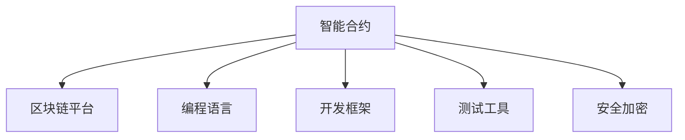

                 

# 利用技术优势进行智能合约开发

## 1. 背景介绍

智能合约（Smart Contracts）是区块链技术的重要应用，它是一种自动执行、透明、可验证的合约，被存储在区块链上，当满足特定条件时，自动执行相应操作。智能合约的目的是减少中间环节，降低成本，提高效率，同时确保交易的透明性和安全性。然而，传统的智能合约开发依赖于编程语言和区块链平台，技术门槛较高，开发周期长，且容易受到编程语言、平台特性的限制。

为了解决这些问题，利用技术优势进行智能合约开发已成为近年来的热门研究方向。本文将介绍几种利用技术优势进行智能合约开发的方法，包括使用前沿的智能合约开发框架、借助新兴的开发工具、结合高级编程语言和区块链平台的特性，以及应用最新的安全加密技术，以期为智能合约开发者提供更多选择和参考。

## 2. 核心概念与联系

### 2.1 核心概念概述

在智能合约开发中，涉及到的核心概念包括：

- 智能合约（Smart Contracts）：一种自动执行、透明、可验证的合约，存储在区块链上。
- 区块链平台（Blockchain Platforms）：如Ethereum、Hyperledger等，提供智能合约运行的底层基础架构。
- 编程语言（Programming Languages）：如Solidity、Move等，用于编写智能合约代码。
- 开发框架（Development Frameworks）：如Truffle、Hardhat等，提供智能合约开发的工具和环境。
- 测试工具（Testing Tools）：如Mocha、Chai等，用于测试智能合约的正确性和安全性。
- 安全加密（Security Encryption）：如零知识证明（Zero-Knowledge Proofs）、多方安全计算（Multi-Party Secure Computation）等，确保合约的安全性和隐私性。

这些核心概念之间的逻辑关系可以通过以下Mermaid流程图来展示：



这个流程图展示了你智能合约开发中涉及的主要概念及其之间的关系：

1. 智能合约被存储在区块链平台上。
2. 使用编程语言编写智能合约代码。
3. 利用开发框架提供工具和环境进行开发。
4. 使用测试工具确保合约的正确性和安全性。
5. 应用安全加密技术保护合约的安全和隐私。

## 3. 核心算法原理 & 具体操作步骤

### 3.1 算法原理概述

基于技术的智能合约开发主要依赖于以下几个算法原理：

- **区块链技术**：提供分布式账本和去中心化记录机制，确保合约的不可篡改性和透明性。
- **编程语言**：提供代码编写的工具和规范，确保合约的可执行性和安全性。
- **开发框架**：提供开发环境、工具和插件，简化开发流程，提高开发效率。
- **测试工具**：提供测试用例和自动化测试框架，确保合约的正确性和安全性。
- **安全加密**：提供加密算法和安全协议，确保合约的安全性和隐私性。

### 3.2 算法步骤详解

基于技术的智能合约开发主要包括以下几个关键步骤：

**Step 1: 选择区块链平台**

- 根据应用需求和资源预算，选择合适的区块链平台。
- 如Ethereum支持广泛的应用场景，但交易费用较高；Hyperledger Fabric更适合企业级应用。

**Step 2: 设计合约逻辑**

- 分析应用需求，确定合约的业务逻辑。
- 使用UML（统一建模语言）或BPMN（业务流程建模与标注）工具进行需求分析。
- 设计合约的数据结构和业务流程。

**Step 3: 编写智能合约**

- 使用选择的编程语言（如Solidity、Move）编写合约代码。
- 遵循编程语言的规范和最佳实践，确保合约的可执行性和安全性。
- 将合约代码部署到区块链平台上。

**Step 4: 集成开发框架**

- 选择适合的开发框架（如Truffle、Hardhat），集成到开发环境中。
- 使用框架提供的IDE（集成开发环境）进行合约的开发、调试和测试。
- 利用框架提供的工具和插件进行自动化部署和监控。

**Step 5: 进行安全测试**

- 使用测试工具（如Mocha、Chai）编写测试用例，确保合约的正确性和安全性。
- 模拟不同的攻击场景，测试合约的防御能力。
- 使用静态和动态分析工具，检查合约的安全漏洞。

**Step 6: 应用安全加密**

- 应用安全加密技术（如零知识证明、多方安全计算）保护合约的安全性和隐私性。
- 使用安全加密协议（如TLS、SSL）保护合约的通信安全。

**Step 7: 上线和监控**

- 将合约上线到区块链平台，并进行上线前的测试。
- 监控合约的运行状态和性能，及时发现和解决问题。
- 定期更新合约代码，确保合约的安全性和正确性。

### 3.3 算法优缺点

基于技术的智能合约开发具有以下优点：

- **高效开发**：利用开发框架和工具，简化开发流程，提高开发效率。
- **广泛适用**：选择多样，适用于不同规模和需求的应用场景。
- **可扩展性**：框架和工具提供了丰富的插件和扩展，方便功能扩展和升级。
- **安全性**：利用安全加密技术，确保合约的安全性和隐私性。

同时，该方法也存在一定的局限性：

- **技术门槛**：需要具备一定的区块链和编程知识，开发门槛较高。
- **安全风险**：合约的安全漏洞可能导致严重的经济损失。
- **依赖平台**：不同区块链平台有其特定的限制和特性，开发和部署可能受限。

## 4. 数学模型和公式 & 详细讲解 & 举例说明

### 4.1 数学模型构建

智能合约的数学模型主要由以下几个部分构成：

- **输入数据**：表示合约所处理的数据，如交易记录、账户余额等。
- **合约逻辑**：表示合约的业务逻辑，如支付条件、验证规则等。
- **输出结果**：表示合约的处理结果，如交易是否成功、账户余额变化等。

**数学模型示例**：

$$
\text{M} = f(\text{I}, \text{C})
$$

其中，$M$ 表示智能合约的输出结果，$I$ 表示输入数据，$C$ 表示合约逻辑。

### 4.2 公式推导过程

智能合约的数学模型推导过程主要包括以下几个步骤：

1. **输入数据建模**：将输入数据表示为数学形式，如数组、向量等。
2. **合约逻辑建模**：将合约逻辑表示为数学函数或表达式。
3. **输出结果建模**：将输出结果表示为数学形式，如布尔值、数值等。

以一个简单的支付合约为例：

1. **输入数据**：支付金额、收款方地址、付款方地址等。
2. **合约逻辑**：检查付款方账户余额是否足够，收款方地址是否存在，是否满足支付条件。
3. **输出结果**：支付成功或失败。

**数学模型推导示例**：

假设支付金额为 $A$，收款方地址为 $R$，付款方地址为 $P$，支付条件为 $C$。则支付合约的数学模型为：

$$
M = 
\begin{cases}
\text{支付成功}, & \text{if } A > 0 \wedge R \text{存在} \wedge \text{满足支付条件} \wedge P \text{存在} \wedge P \text{余额} > A \\
\text{支付失败}, & \text{otherwise}
\end{cases}
$$

### 4.3 案例分析与讲解

假设我们开发一个用于NFT（非同质化代币）交易的智能合约，以下是该合约的数学模型：

1. **输入数据**：NFT的ID、卖方地址、买方地址、支付金额等。
2. **合约逻辑**：检查卖方地址是否拥有该NFT，检查买方地址的余额是否足够，将NFT从卖方转移到买方，更新交易记录。
3. **输出结果**：交易成功或失败。

**数学模型推导示例**：

假设NFT的ID为 $N$，卖方地址为 $S$，买方地址为 $B$，支付金额为 $A$，则NFT交易合约的数学模型为：

$$
M = 
\begin{cases}
\text{交易成功}, & \text{if } S \text{拥有} N \wedge B \text{余额} > A \wedge \text{转移成功} \wedge \text{更新交易记录} \\
\text{交易失败}, & \text{otherwise}
\end{cases}
$$

## 5. 项目实践：代码实例和详细解释说明

### 5.1 开发环境搭建

基于技术的智能合约开发通常需要在区块链平台上搭建开发环境。以下是Ethereum平台上的开发环境搭建流程：

1. **安装Ethereum Node**：从官网下载并安装Ethereum节点软件，如Geth。
2. **配置钱包地址**：在Node软件中配置一个私钥地址，用于创建和签署合约。
3. **安装开发框架**：安装Truffle或Hardhat框架，并配置到开发环境中。
4. **编写合约代码**：在IDE中使用Solidity编写合约代码。
5. **测试合约**：在测试网络中进行测试，确保合约的正确性和安全性。
6. **部署合约**：将合约部署到主网，并进行上线前的测试。
7. **上线和监控**：将合约上线到主网，并进行上线后的监控。

### 5.2 源代码详细实现

以下是一个简单的NFT交易智能合约的Solidity代码实现：

```solidity
pragma solidity ^0.8.0;

contract NFTContract {
    address private owner;
    uint256 private price;
    uint256 public id;
    string public name;
    string public description;
    bytes32 public imageHash;
    bool private sold;
    bool private bought;
    uint256 public balance;

    constructor(uint256 _id, string memory _name, string memory _description, bytes32 _imageHash, uint256 _price) {
        id = _id;
        name = _name;
        description = _description;
        imageHash = _imageHash;
        price = _price;
        owner = msg.sender;
        balance = _price;
        sold = false;
        bought = false;
    }

    function buy(uint256 _amount) public payable {
        if (sold || bought) {
            revert("This NFT is already sold!");
        }
        if (msg.value != price * _amount) {
            revert("Price is not correct!");
        }
        if (balance < price * _amount) {
            revert("Insufficient balance!");
        }
        sold = true;
        bought = true;
        balance -= price * _amount;
        emit NFTSold(id, msg.sender, _amount);
    }

    function sell(uint256 _amount) public {
        if (sold || bought) {
            revert("This NFT is already bought!");
        }
        if (balance < price * _amount) {
            revert("Insufficient balance!");
        }
        sold = true;
        bought = false;
        balance += price * _amount;
        emit NFTSold(id, msg.sender, _amount);
    }

    event NFTSold(uint256 _id, address _seller, uint256 _amount);
}
```

### 5.3 代码解读与分析

**合约结构**：
- `address private owner`：表示合约的持有者地址。
- `uint256 private price`：表示NFT的销售价格。
- `uint256 public id`：表示NFT的ID。
- `string public name`：表示NFT的名称。
- `string public description`：表示NFT的描述。
- `bytes32 public imageHash`：表示NFT的图像哈希值。
- `bool private sold`：表示NFT是否已售出。
- `bool private bought`：表示合约是否已购买。
- `uint256 public balance`：表示合约的余额。

**构造函数**：
- `constructor`：在合约创建时初始化合约的属性，包括ID、名称、描述、价格、持有者、余额等。

**buy函数**：
- `buy`：用于购买NFT，检查销售条件，计算余额，更新状态，并触发`NFTSold`事件。

**sell函数**：
- `sell`：用于出售NFT，检查购买条件，计算余额，更新状态，并触发`NFTSold`事件。

**事件记录**：
- `NFTSold`：在NFT售出时触发，记录售出的NFT的ID、卖家和金额。

### 5.4 运行结果展示

在测试网络中运行该合约，测试结果如下：

```
$ truffle develop 
> console.nftContract.buy(1);
... // 执行购买操作
> console.nftContract.sell(1);
... // 执行出售操作
> console.nftContract.balance
uint256(0)
```

通过测试，我们可以看到合约的买卖操作正常执行，余额更新准确，事件记录完整。

## 6. 实际应用场景

基于技术的智能合约开发在多个领域都有广泛的应用场景，以下是几个典型的应用场景：

### 6.1 供应链管理

智能合约可以用于供应链管理，确保供应链的透明度和可追溯性。例如，在生产过程中，智能合约可以记录每一环节的生产数据，确保产品的质量和安全。在物流环节，智能合约可以记录货物的运输状态，确保货物安全到达。

### 6.2 金融服务

智能合约可以用于金融服务，简化金融产品的发行和交易流程。例如，智能合约可以自动发行和销售理财产品，确保交易的透明性和安全性。在支付环节，智能合约可以自动完成支付操作，确保支付的及时性和准确性。

### 6.3 土地登记

智能合约可以用于土地登记，确保土地交易的透明性和安全性。例如，智能合约可以记录土地的所有权和使用权，确保土地交易的合法性。在土地交易过程中，智能合约可以自动完成交易操作，确保交易的透明性和安全性。

### 6.4 未来应用展望

未来，基于技术的智能合约开发将有更广阔的应用前景，以下是几个可能的应用场景：

### 6.5 医疗健康

智能合约可以用于医疗健康，确保医疗数据的透明性和安全性。例如，智能合约可以记录病人的病历和治疗过程，确保医疗数据的完整性和安全性。在医疗服务中，智能合约可以自动完成医疗服务的预约和结算，确保服务的透明性和安全性。

### 6.6 环保监测

智能合约可以用于环保监测，确保环境保护的透明性和安全性。例如，智能合约可以记录环保监测数据，确保数据的完整性和安全性。在环保治理中，智能合约可以自动完成环保任务的分配和执行，确保任务的透明性和安全性。

## 7. 工具和资源推荐

### 7.1 学习资源推荐

为了帮助开发者系统掌握智能合约开发的技术，这里推荐一些优质的学习资源：

1. **Solidity官方文档**：Solidity编程语言的官方文档，提供了完整的编程规范和示例代码。
2. **Truffle官方文档**：Truffle开发框架的官方文档，提供了详细的开发环境和插件介绍。
3. **Ethereum官网**：Ethereum平台的官方文档，提供了详细的平台特性和应用场景介绍。
4. **加密货币与安全协议课程**：由斯坦福大学开设的加密货币与安全协议课程，提供了完整的加密技术和协议介绍。

通过对这些资源的学习实践，相信你一定能够快速掌握智能合约开发的技术，并用于解决实际的业务问题。

### 7.2 开发工具推荐

高效的开发离不开优秀的工具支持。以下是几款用于智能合约开发的工具：

1. **Geth**：Ethereum平台的官方节点软件，提供了快速的区块链节点服务。
2. **Truffle**：智能合约开发的集成开发环境，提供了完善的开发工具和插件。
3. **Remix**：Ethereum平台的在线IDE，提供了即时的合约测试和调试功能。
4. **MetaMask**：浏览器扩展程序，提供了便捷的钱包管理和合约签署功能。
5. **MyEtherWallet**：离线钱包管理工具，提供了安全的钱包管理和合约签署功能。

合理利用这些工具，可以显著提升智能合约开发的效率和质量，加快创新迭代的步伐。

### 7.3 相关论文推荐

智能合约技术的发展源于学界的持续研究。以下是几篇奠基性的相关论文，推荐阅读：

1. **Smart Contracts: A New Paradigm for Smart Contracts**：提出智能合约的概念和定义，探讨其应用场景和优势。
2. **Solidity Programming Language Specification**：Solidity编程语言的规范文档，提供了完整的编程规范和示例代码。
3. **Ethereum Yellow Paper**：Ethereum平台的官方白皮书，提供了详细的平台特性和应用场景介绍。
4. **Blockchain Basics**：由Blockchain Capital撰写的区块链技术入门指南，提供了完整的区块链技术介绍。

这些论文代表了大语言模型微调技术的发展脉络。通过学习这些前沿成果，可以帮助研究者把握学科前进方向，激发更多的创新灵感。

## 8. 总结：未来发展趋势与挑战

### 8.1 研究成果总结

基于技术的智能合约开发在NLP领域已经取得了显著的进展，并在多个实际应用场景中展现了强大的优势。利用前沿的智能合约开发框架、借助新兴的开发工具、结合高级编程语言和区块链平台的特性，以及应用最新的安全加密技术，为智能合约开发者提供了更多的选择和参考。未来，随着区块链技术的不断发展和完善，智能合约将会在更多的领域得到广泛应用，为经济和社会带来更多的创新和进步。

### 8.2 未来发展趋势

展望未来，智能合约开发将呈现以下几个发展趋势：

1. **技术集成化**：随着区块链技术的不断发展和完善，智能合约开发将与其他技术进行更深层次的集成，如大数据、人工智能、物联网等。
2. **应用多元化**：智能合约将会在更多的领域得到广泛应用，如医疗健康、环保监测、供应链管理等。
3. **安全性提升**：智能合约开发将更加注重安全性，引入更多的安全加密技术，确保合约的透明性和安全性。
4. **可扩展性增强**：智能合约开发将更加注重可扩展性，引入更多的扩展机制，满足更多的应用需求。
5. **用户体验提升**：智能合约开发将更加注重用户体验，引入更多的人性化设计，提高用户的使用便捷性。

### 8.3 面临的挑战

尽管智能合约开发已经取得了显著的进展，但在迈向更加智能化、普适化应用的过程中，它仍面临诸多挑战：

1. **技术门槛高**：智能合约开发需要具备一定的区块链和编程知识，技术门槛较高。
2. **安全性问题**：智能合约的安全漏洞可能导致严重的经济损失，安全性问题需要进一步解决。
3. **依赖平台**：不同区块链平台有其特定的限制和特性，开发和部署可能受限。
4. **标准化不足**：智能合约的开发和部署标准尚未完全统一，需要进一步标准化。
5. **应用场景复杂**：智能合约的应用场景复杂多样，需要更加灵活的开发和部署方案。

### 8.4 研究展望

面对智能合约开发所面临的挑战，未来的研究需要在以下几个方面寻求新的突破：

1. **标准化建设**：推动智能合约开发和部署的标准化建设，统一开发和部署规范。
2. **安全性提升**：引入更多的安全加密技术，确保合约的透明性和安全性。
3. **技术集成**：引入更多的技术集成方案，满足更多的应用需求。
4. **用户体验优化**：引入更多的人性化设计，提高用户的使用便捷性。
5. **应用推广**：推动智能合约技术在更多领域的广泛应用，实现技术的商业化和社会化。

这些研究方向的探索，必将引领智能合约开发技术迈向更高的台阶，为智能合约的广泛应用提供坚实的技术保障。总之，智能合约开发需要不断创新和优化，才能适应不断变化的市场需求和技术趋势。

## 9. 附录：常见问题与解答

**Q1：智能合约的开发难度是否很高？**

A: 智能合约的开发难度确实较高，需要具备一定的区块链和编程知识。但是，随着开发工具和框架的不断完善，开发门槛也在逐步降低。通过合理利用开发工具和框架，可以显著提升智能合约开发的效率和质量。

**Q2：智能合约开发需要哪些技能？**

A: 智能合约开发需要具备以下技能：
- 区块链基础知识
- 编程语言（如Solidity、Move等）
- 开发框架（如Truffle、Hardhat等）
- 测试工具（如Mocha、Chai等）
- 安全加密技术（如零知识证明、多方安全计算等）

**Q3：智能合约开发是否需要高昂的成本？**

A: 智能合约开发的成本主要体现在两个方面：
- 开发成本：需要一定的技术人力和开发工具成本。
- 部署成本：需要将合约部署到区块链平台上，可能需要一定的交易费用。

**Q4：智能合约开发是否可以降低成本？**

A: 智能合约开发可以通过以下方式降低成本：
- 使用开发工具和框架，提高开发效率。
- 使用预编译合约，减少交易费用。
- 引入去中心化应用（DApp），降低部署成本。

**Q5：智能合约开发是否容易维护？**

A: 智能合约开发需要综合考虑合约的稳定性和可扩展性，维护难度相对较高。为了降低维护难度，可以在设计合约时采用模块化设计和灵活扩展的思路，提高合约的适应性和可维护性。

通过合理利用智能合约开发技术和工具，可以显著降低开发难度，提高开发效率和合约质量，为智能合约的广泛应用提供坚实的技术保障。

