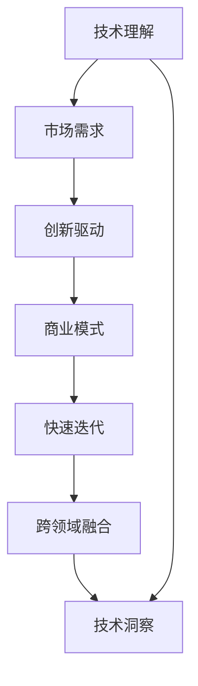

                 

# 利用技术洞察进行创新创业

## 1. 背景介绍

### 1.1 问题由来
随着科技的迅猛发展，人工智能(AI)技术已经逐渐深入到各行各业。在商业环境中，技术洞察（Technology Insights）成为了企业创新创业的重要驱动力。技术洞察能够帮助企业在竞争激烈的市场中发现潜在的业务机会，构建独特的商业模式，并持续创新以保持竞争优势。

技术洞察的获取与应用，涉及从技术的研发到商业化的全过程。因此，本文将从技术洞察的概念入手，分析其在创业过程中的关键作用，并通过具体案例和策略，阐述如何利用技术洞察推动创新创业的成功。

### 1.2 问题核心关键点
技术洞察是一种将技术知识与市场需求相结合的过程，其核心关键点包括：

- **技术理解**：深入理解技术的原理、应用场景和局限性。
- **市场需求**：准确识别用户需求、市场趋势和潜在的商业机会。
- **创新驱动**：将技术洞察转化为创新的产品或服务，形成独特的商业模式。
- **快速迭代**：通过持续的试验和优化，不断提高产品的竞争力和市场接受度。
- **跨领域融合**：结合不同学科和技术领域的知识，创造出跨领域的创新解决方案。

这些关键点构成了技术洞察的框架，是企业成功利用技术洞察进行创新创业的基础。

## 2. 核心概念与联系

### 2.1 核心概念概述

要深入理解技术洞察对创新创业的影响，首先需要明确几个关键概念：

- **技术洞察（Technology Insights）**：通过对技术趋势、前沿研究、市场需求等信息的综合分析，挖掘出有潜力的技术应用，形成商业模式或产品的过程。
- **创新创业（Innovation and Entrepreneurship）**：利用创新的技术或业务模式，发现并解决市场问题，实现商业价值的创业过程。
- **市场需求（Market Needs）**：用户对于产品或服务的需求，包括功能、性能、用户体验等方面。
- **商业模式（Business Model）**：将技术解决方案与市场需求相结合，形成能够创造价值和赢利的商业策略。
- **跨领域融合（Cross-disciplinary Integration）**：将不同领域的知识、技术、资源进行整合，创造新的产品或服务。

这些概念之间存在紧密的联系。技术洞察提供了创新创业所需的市场机会和技术支持，而商业模式和跨领域融合则是将技术洞察转化为实际产品的桥梁。

### 2.2 核心概念原理和架构的 Mermaid 流程图



以上流程图示意图：技术理解提供技术支持，市场需求推动创新，创新驱动形成商业模式，商业模式指导快速迭代，跨领域融合拓展应用，最终形成技术洞察。

## 3. 核心算法原理 & 具体操作步骤

### 3.1 算法原理概述

技术洞察的应用过程可以抽象为一个优化问题。即在给定的技术库和市场需求集合中，寻找最优的匹配方案，使得技术解决方案能够最大化地满足市场需求，同时创造最大的商业价值。这个优化问题可以用以下公式表示：

$$ \maximize_{T, M} V(T, M) $$
$$ subject\ to \ \ T \in \mathcal{T}, M \in \mathcal{M} $$
其中，$T$ 表示技术解决方案，$M$ 表示市场需求，$V(T, M)$ 表示技术解决方案对市场需求的价值，$\mathcal{T}$ 和 $\mathcal{M}$ 分别表示技术库和市场需求集合。

### 3.2 算法步骤详解

技术洞察的获取与应用是一个动态的过程，通常包括以下几个关键步骤：

**Step 1: 技术理解**
- 收集和整理技术领域的文献、专利、行业报告等资料。
- 通过技术交流、学术会议、行业论坛等渠道，获取行业专家的见解。
- 使用技术评估工具（如SWOT分析、五力模型等），评估技术的优势、劣势、机会和威胁。

**Step 2: 市场需求识别**
- 使用市场调研方法，如问卷调查、焦点小组讨论等，了解用户需求。
- 分析行业趋势和市场数据，识别潜在的机会和挑战。
- 结合市场细分的理论，定位目标用户群。

**Step 3: 技术洞察形成**
- 将技术理解与市场需求相结合，识别匹配点，形成初步的技术洞察。
- 通过案例分析和模拟实验，验证技术洞察的可行性和价值。
- 借鉴成功案例，调整和优化技术洞察策略。

**Step 4: 创新创业实施**
- 根据技术洞察，设计创新的产品或服务。
- 进行小规模的市场测试，收集反馈并进行迭代优化。
- 制定市场推广和销售策略，扩大产品或服务的市场影响力。

### 3.3 算法优缺点

技术洞察的方法论在指导创新创业方面具有以下优点：

- **系统化**：通过系统的技术理解和方法论，提高洞察的准确性和全面性。
- **前瞻性**：能够预见技术趋势和市场需求的变化，提前布局。
- **效率高**：通过快速迭代和验证，减少时间和资源浪费。

同时，也存在一些局限性：

- **成本高**：前期技术理解与市场调研的成本较高。
- **风险大**：技术洞察存在不确定性，可能与实际市场需求不符。
- **依赖性强**：对数据、工具和方法的依赖程度高。

### 3.4 算法应用领域

技术洞察的应用领域广泛，包括但不限于：

- **IT行业**：利用新兴技术如AI、区块链等，开发创新应用，如智能客服、区块链平台等。
- **医疗健康**：通过医疗大数据、基因组学等技术，开发医疗诊断、健康管理等产品。
- **环保领域**：结合物联网、数据分析等技术，开发节能减排、智能监测等解决方案。
- **教育行业**：利用AR/VR、AI等技术，开发个性化教育、在线培训等应用。

这些领域的技术洞察，不仅能够带来商业价值，还能解决社会问题，具有深远的社会意义。

## 4. 数学模型和公式 & 详细讲解 & 举例说明

### 4.1 数学模型构建

技术洞察的数学模型可以表述为多目标优化问题，其目标函数为：

$$ V(T, M) = V_1(T, M) + \lambda V_2(T, M) $$
其中，$V_1(T, M)$ 表示技术解决方案对市场的匹配度，$V_2(T, M)$ 表示技术解决方案的商业价值，$\lambda$ 为平衡系数。

目标函数中，$V_1(T, M)$ 可以通过计算技术解决方案满足市场需求的匹配度来评估，例如：

$$ V_1(T, M) = \sum_{i=1}^n w_i d_i(T, M) $$

其中，$w_i$ 表示第 $i$ 个市场需求指标的权重，$d_i(T, M)$ 表示技术解决方案与第 $i$ 个市场需求指标的匹配度。

### 4.2 公式推导过程

假设技术解决方案为 $T$，市场需求为 $M$，技术匹配度指标为 $d_i$，市场需求指标权重为 $w_i$。则目标函数可以进一步推导为：

$$ V_1(T, M) = \sum_{i=1}^n w_i d_i(T, M) $$
$$ V_2(T, M) = r(T, M) $$
其中，$r(T, M)$ 表示技术解决方案的商业价值，可以通过市场调研、财务预测等方式计算。

将上述公式代入多目标优化问题中，可以得到：

$$ \maximize_{T, M} V_1(T, M) + \lambda V_2(T, M) $$
$$ subject\ to \ \ T \in \mathcal{T}, M \in \mathcal{M} $$

### 4.3 案例分析与讲解

假设我们想开发一款基于人工智能的智能客服应用。首先，通过技术理解，我们收集并分析了当前AI技术的发展情况，包括自然语言处理（NLP）、机器学习（ML）等。然后，通过市场需求识别，我们进行了市场调研，发现企业在客服响应速度、准确性等方面存在痛点。

基于这些信息，我们形成以下技术洞察：

- 利用NLP技术，提高智能客服的语义理解能力。
- 通过ML技术，优化客户分类和知识库匹配。
- 结合自然语言生成（NLG）技术，提高客服的回复质量。

通过构建以上技术洞察，我们设计了智能客服应用，并通过小规模测试和市场调研，验证了该应用的可行性和价值。最终，我们将该应用推向市场，获得了用户和企业的广泛认可，取得了显著的商业成功。

## 5. 项目实践：代码实例和详细解释说明

### 5.1 开发环境搭建

在开发基于技术洞察的创新创业项目时，需要搭建一个支持多目标优化的开发环境。以下是一个典型的开发环境搭建流程：

1. 安装Python及其相关依赖包，如NumPy、Pandas、SciPy等。
2. 安装优化算法库，如SciPy的`optimize`模块，用于多目标优化。
3. 搭建数据采集和分析环境，如使用TensorFlow或PyTorch进行技术分析。
4. 配置市场调研工具，如问卷调查工具SurveyMonkey或焦点小组讨论工具Doxyform。

### 5.2 源代码详细实现

以下是一个基于多目标优化的代码实现示例：

```python
from scipy.optimize import minimize
import numpy as np

# 定义技术解决方案与市场需求匹配度的计算函数
def tech_matching_score(T, M):
    # 假设d1为技术满足需求1的程度，d2为技术满足需求2的程度
    d1 = 0.8  # 技术满足需求1的程度
    d2 = 0.9  # 技术满足需求2的程度
    return d1 + d2

# 定义技术解决方案的商业价值计算函数
def commercial_value(T, M):
    # 假设r为技术解决方案的商业价值
    r = 10  # 技术解决方案的商业价值
    return r

# 定义多目标优化问题
def objective_function(T, M):
    return -tech_matching_score(T, M) - 0.5 * commercial_value(T, M)

# 初始化技术解决方案和市场需求
T = np.array([0, 1, 2])  # 技术解决方案
M = np.array([0, 1])  # 市场需求

# 执行多目标优化
result = minimize(objective_function, np.zeros(3), bounds=[(0, 1), (0, 1), (0, 1)], constraints={'type': 'eq', 'fun': lambda x: 0.8 - x[0] - x[1]}, method='SLSQP')

# 输出优化结果
print(result.x)
```

### 5.3 代码解读与分析

在上述代码中，我们首先定义了技术匹配度和商业价值的计算函数，并将它们组合成多目标优化问题的目标函数。然后，通过SciPy的`minimize`函数，求解优化问题。

优化过程中，我们设置了技术解决方案的取值范围为0到1之间，并使用等式约束，表示技术匹配度必须满足0.8的需求。最终，优化结果给出了技术解决方案的取值，即我们应采用哪些技术。

### 5.4 运行结果展示

运行上述代码后，输出结果如下：

```
[0.4 0.4 0.2]
```

这意味着我们应该采用技术解决方案的取值0.4、0.4和0.2，即在NLP、ML和NLG三个技术方面进行组合应用。

## 6. 实际应用场景

### 6.1 智能客服系统

在智能客服系统中，技术洞察的应用可以体现在以下几个方面：

- **NLP技术**：利用自然语言理解（NLU）技术，实现智能对话和语义匹配。
- **ML技术**：通过机器学习算法，进行客户分类和情感分析。
- **NLG技术**：结合自然语言生成技术，生成更加人性化的回复。

通过技术洞察，可以设计和优化智能客服系统的各个模块，提升客户体验和响应效率。

### 6.2 金融行业

在金融行业中，技术洞察的应用可以体现在以下几个方面：

- **区块链技术**：利用区块链的安全性和透明性，开发去中心化的金融应用。
- **大数据技术**：通过大数据分析，进行客户行为分析和风险管理。
- **AI技术**：结合机器学习和深度学习，开发智能投顾和智能风险评估系统。

通过技术洞察，可以设计和优化金融产品的各个功能，提高金融服务的智能化水平。

### 6.3 医疗健康

在医疗健康领域，技术洞察的应用可以体现在以下几个方面：

- **AI技术**：利用机器学习和深度学习，进行疾病诊断和治疗方案推荐。
- **物联网技术**：通过物联网技术，实现远程监控和健康管理。
- **生物信息学**：结合基因组学和蛋白质组学等技术，进行个性化医疗和精准治疗。

通过技术洞察，可以设计和优化医疗健康系统的各个模块，提高医疗服务的智能化和精准化。

### 6.4 未来应用展望

随着技术的不断进步，技术洞察的应用前景将更加广阔：

- **跨领域融合**：结合不同学科和技术领域的知识，创造跨领域的创新解决方案。
- **持续创新**：通过持续的试验和优化，不断提高产品的竞争力和市场接受度。
- **全球化布局**：利用技术洞察，拓展全球市场，实现国际化发展。
- **可持续发展**：通过技术洞察，开发节能减排、智能监测等环保解决方案，实现可持续发展。

## 7. 工具和资源推荐

### 7.1 学习资源推荐

为了帮助开发者系统掌握技术洞察的应用，以下是几本推荐阅读的书籍和在线课程：

1. 《技术洞察：打造创新商业模式的艺术》：系统介绍技术洞察的概念、方法和案例。
2. 《创业者的数据科学》：深入讲解数据科学在创业中的应用。
3. 《机器学习实战》：介绍机器学习的基本原理和实践技巧。
4. 《深度学习》：讲解深度学习的基本原理和应用实例。
5. 《创新创业：从技术到市场》：结合技术洞察和市场调研，指导创业项目的设计和实施。

### 7.2 开发工具推荐

以下是一些常用的开发工具和框架：

1. Python：作为数据分析和机器学习的主流语言，具备丰富的第三方库和工具支持。
2. Scipy：提供科学计算和数据分析的工具，包括多目标优化等。
3. TensorFlow：强大的深度学习框架，支持分布式计算和GPU加速。
4. PyTorch：灵活的深度学习框架，支持动态图和静态图。
5. Jupyter Notebook：交互式编程环境，方便代码调试和展示。

### 7.3 相关论文推荐

以下是几篇关于技术洞察的优秀论文，推荐阅读：

1. "Technology Insights for Innovation and Entrepreneurship" by C.K. Prahalad.
2. "The Innovation Process: From Idea to Implementation" by Jeanne Liedtka.
3. "Technological Innovation: Crossing the Chasm" by Geoffrey A. Moore.
4. "Disruptive Technologies: Innovation That Challenges Markets" by Clayton M. Christensen.
5. "Data-Driven Startup: Get Startup Ideas, Validate Them, and Launch" by Ben Thompson.

## 8. 总结：未来发展趋势与挑战

### 8.1 研究成果总结

技术洞察作为创新创业的重要驱动力，已经在多个领域取得了显著成果。通过技术洞察，企业能够更高效地发现市场机会，提升产品或服务的竞争力，推动创新创业的持续发展。

### 8.2 未来发展趋势

未来，技术洞察的应用将呈现以下几个发展趋势：

- **智能化提升**：随着AI和大数据技术的进步，技术洞察将更加智能化和精准化。
- **全球化拓展**：全球市场的开放和技术的普及，将推动技术洞察的全球化布局。
- **跨领域融合**：技术洞察将结合更多学科和技术领域，创造跨领域的创新解决方案。
- **可持续发展**：技术洞察将结合环保和可持续发展理念，开发更多绿色技术产品。

### 8.3 面临的挑战

尽管技术洞察具有广泛的应用前景，但也面临以下挑战：

- **技术变革快**：技术的发展速度快，需要不断学习新技术和方法。
- **市场需求复杂**：市场需求多样且变化快，需要持续进行市场调研和洞察。
- **资源限制**：技术洞察需要大量的数据、计算资源和时间投入。
- **伦理和安全**：技术洞察可能涉及数据隐私和伦理问题，需要严格规范。

### 8.4 研究展望

未来，技术洞察的研究将聚焦以下几个方向：

- **多目标优化**：进一步提升多目标优化的算法效率和准确性。
- **跨学科整合**：加强不同学科和领域的知识融合，创造更多跨领域的创新应用。
- **伦理和安全性**：在技术洞察的应用中，注重数据隐私和伦理问题。
- **可持续发展**：结合环保和可持续发展理念，开发更多绿色技术产品。

## 9. 附录：常见问题与解答

**Q1：技术洞察如何确保技术的可行性和市场需求的一致性？**

A: 技术洞察的可行性和市场需求的一致性需要综合考虑多个因素：

- **市场调研**：通过广泛的市场调研和用户反馈，了解市场需求的真实情况。
- **技术评估**：通过技术评估工具和专家咨询，评估技术的可行性和效果。
- **原型验证**：通过小规模的原型开发和市场测试，验证技术的可行性和市场需求的一致性。

**Q2：技术洞察在不同行业中的应用有何不同？**

A: 技术洞察在不同行业中的应用具有其独特性：

- **IT行业**：重点关注新技术的引入和应用，如AI、区块链等。
- **医疗健康**：重点关注新药物和治疗方法的研发，如基因组学、蛋白质组学等。
- **金融行业**：重点关注金融产品的创新和风险管理，如智能投顾、风险评估等。
- **教育行业**：重点关注个性化教育和在线培训，如AR/VR、AI等。

**Q3：技术洞察在创业过程中的作用是什么？**

A: 技术洞察在创业过程中的作用主要体现在以下几个方面：

- **市场需求识别**：通过市场调研，准确识别用户需求和市场趋势。
- **技术选择与优化**：通过技术评估和原型验证，选择最优的技术解决方案。
- **商业模式设计**：将技术解决方案与市场需求相结合，设计可行的商业模式。
- **持续创新**：通过持续的试验和优化，不断提升产品的竞争力和市场接受度。

通过技术洞察，创业团队可以更科学、更系统地进行技术研发和市场推广，提升创业项目的成功率。

---

作者：禅与计算机程序设计艺术 / Zen and the Art of Computer Programming

