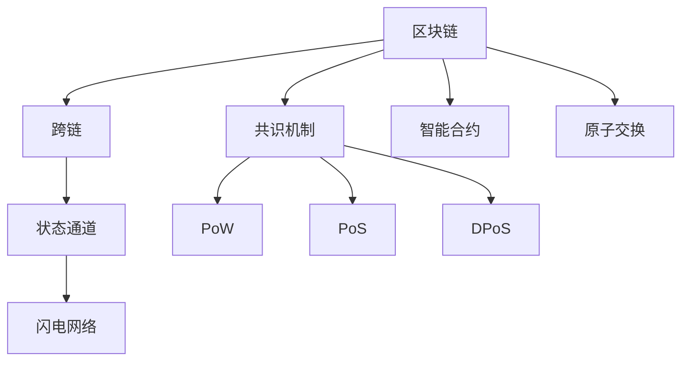

                 

## 1. 背景介绍

### 1.1 问题由来
在过去十年里，区块链技术的迅猛发展为各种垂直行业带来了颠覆性的变革。作为一种去中心化的分布式账本技术，区块链具有透明、可信、不可篡改等特点，适用于金融、供应链、医疗、教育等多个领域。然而，由于区块链技术各个链之间的异构性，不同区块链之间无法直接交互，导致许多跨行业、跨应用场景的需求难以得到满足。

例如，A公司的财务系统位于某条区块链上，B公司的供应链系统位于另一条区块链上，两方之间如果直接交易需要实现链与链之间的互操作，这将涉及到交易、验证、共识等复杂问题，且不安全、成本高昂。

因此，为了解决不同区块链之间的互操作问题，跨链技术应运而生。跨链技术使不同区块链之间可以实现价值的传递、数据的交互和功能的互联，为区块链系统的进一步应用提供了极大的便利。

### 1.2 问题核心关键点
跨链技术主要解决以下核心问题：
- 交易和资产如何在不同区块链之间安全、高效地传递。
- 不同区块链之间的数据如何在保证隐私的前提下进行交换和共享。
- 跨链交易如何满足各条链的共识机制要求，确保交易的可信度和不可篡改性。

本文将从核心概念、算法原理、实践步骤等方面，全面系统地介绍区块链跨链技术的实现机制和应用场景，以期为区块链开发者提供深入的理论基础和实用的开发指南。

## 2. 核心概念与联系

### 2.1 核心概念概述

为更好地理解区块链跨链技术的实现机制，本节将介绍几个关键概念：

- **区块链(Blockchain)**：一种去中心化的分布式账本技术，通过哈希算法、共识机制等保障数据的透明和可信。

- **跨链(Cross-chain)**：指通过技术手段实现不同区块链之间的价值传递、数据交换和功能互联，突破单个区块链的局限性。

- **共识机制(Consensus Algorithm)**：指区块链网络中达成一致意见的规则，用于解决多个节点间的信任问题，确保数据的正确性和不可篡改性。

- **智能合约(Smart Contract)**：一种自执行、自验证的合约，通过代码实现预先设定的规则和逻辑，自动化交易处理。

- **原子交换(Atomic Swap)**：指跨链交易中的一种机制，确保交易双方的安全性，防止单方欺诈。

- **状态通道(Channel)与闪电网络(Lightning Network)**：为提高交易效率，基于跨链技术搭建的分布式支付协议，通过链下通信进行微交易，减少链上数据量。

这些核心概念之间的逻辑关系可以通过以下Mermaid流程图来展示：



这个流程图展示了大语言模型的核心概念及其之间的关系：

1. 区块链通过共识机制、智能合约等技术保障数据的可信和正确。
2. 跨链技术通过原子交换、状态通道等机制实现不同区块链之间的交互。
3. 共识机制有PoW、PoS、DPoS等多种形式，决定区块链的决策方式。
4. 智能合约通过代码实现交易逻辑，自动化执行合约。

这些概念共同构成了区块链的基础框架，并在跨链技术的实现过程中发挥着重要作用。通过理解这些核心概念，我们可以更好地把握区块链跨链技术的实现原理和优化方向。

## 3. 核心算法原理 & 具体操作步骤
### 3.1 算法原理概述

区块链跨链技术的核心思想是通过技术手段实现不同区块链之间的信息交互和价值传递。其核心原理包括以下几个方面：

- **跨链桥(Chain Bridge)**：通过跨链桥实现不同区块链之间的资产交换和数据传输。

- **状态通道与闪电网络**：通过状态通道和闪电网络提高交易效率，降低交易成本。

- **共识机制的扩展**：将不同区块链上的共识机制进行整合，实现跨链上的安全一致性。

- **智能合约的互操作性**：实现不同区块链上的智能合约进行协同工作，增强跨链交易的自动化和透明性。

### 3.2 算法步骤详解

基于区块链跨链技术的核心原理，下面介绍具体的跨链操作流程：

**Step 1: 创建跨链桥**

跨链桥是一个用于连接两个区块链的协议和接口，实现资产和数据的交换。常见的跨链桥包括Connext、Harmony Bridge等。

具体实现流程如下：

1. 部署跨链桥智能合约到各条链上。
2. 设定跨链桥参数，包括资产类型、交易手续费、桥链地址等。
3. 跨链桥智能合约监听链上的交易，提取资产信息。

**Step 2: 交易路由**

跨链桥在接收跨链交易后，需要选择合适的路由策略，将交易发送到目标链。

具体流程如下：

1. 跨链桥智能合约解析交易信息，提取目标链地址。
2. 根据目标链地址，选择最优路由策略。
3. 发送交易到目标链，并实时监控交易状态。

**Step 3: 交易验证与确认**

跨链交易在目标链上验证通过后，需要进行最后的确认操作。

具体流程如下：

1. 目标链接收跨链交易，验证交易合法性。
2. 如果交易合法，执行转账操作，更新账本状态。
3. 发送交易成功信号回原链，原链确认交易完成。

**Step 4: 桥链同步**

跨链桥在交易完成后，需要同步各条链的交易状态，以确保数据的同步和一致性。

具体流程如下：

1. 跨链桥智能合约记录交易状态，定期同步交易数据。
2. 各条链更新交易状态，确保交易一致性。

**Step 5: 状态通道与闪电网络**

状态通道和闪电网络通过链下通信进行微交易，减少链上数据量，提高交易效率。

具体流程如下：

1. 建立状态通道，双方达成共识，开通道。
2. 双方进行链下微交易，更新通道状态。
3. 定期更新链上状态，结算通道余额。

### 3.3 算法优缺点

区块链跨链技术的优点如下：

1. **提高交易效率**：通过状态通道和闪电网络，可以实现高频交易和微交易，减少链上数据量。

2. **降低交易成本**：通过跨链桥，实现跨链资产交换，降低交易费用。

3. **增强互操作性**：实现不同区块链之间的互操作性，突破单个区块链的局限性。

4. **提升安全性**：通过跨链桥智能合约和共识机制，确保交易的不可篡改性和安全性。

但跨链技术也存在一些缺点：

1. **复杂度高**：跨链桥和智能合约的实现涉及复杂的技术细节，开发和维护难度大。

2. **交易速度慢**：状态通道和闪电网络虽然提高了交易效率，但需要构建和维护通道，增加了复杂性。

3. **成本高**：跨链桥和智能合约的部署和维护需要较高的成本，且交易手续费也相对较高。

4. **安全性问题**：跨链桥在实现跨链交易时，需要确保各条链的安全性，防止单点故障。

5. **互操作性有限**：不同区块链之间的互操作性受限于共识机制和协议标准，存在一定的局限性。

尽管存在这些缺点，但跨链技术在提高交易效率、降低交易成本和增强互操作性方面具有巨大的优势，仍是大势所趋。未来相关研究的重点在于如何进一步简化跨链流程，降低开发成本，提升交易效率和安全性。

### 3.4 算法应用领域

区块链跨链技术在众多领域中具有广泛的应用前景，包括但不限于：

- **供应链管理**：通过跨链技术实现供应链信息的透明化和协同管理。
- **金融行业**：通过跨链技术实现不同金融机构的资产互操作和数据共享。
- **医疗健康**：通过跨链技术实现医疗机构之间的电子病历共享和医疗资源协同。
- **数字资产**：通过跨链技术实现数字资产在多个平台间的自由流动。
- **物联网**：通过跨链技术实现物联网设备的互操作和数据交换。
- **社交媒体**：通过跨链技术实现不同社交平台之间的用户互动和数据共享。

以上应用场景展示了区块链跨链技术在多个领域中的广泛应用，未来随着技术的不断进步，跨链技术的应用前景将更加广阔。

## 4. 数学模型和公式 & 详细讲解 & 举例说明

### 4.1 数学模型构建

在进行区块链跨链技术开发时，需要构建数学模型来描述和优化交易流程。

假设区块链A和区块链B通过跨链桥实现互操作，设定两个区块链的资产分别为$A$和$B$，初始余额分别为$A_0$和$B_0$。

跨链桥智能合约接收跨链交易后，需要进行以下操作：

1. 验证交易合法性。
2. 将$A$资产从A链转移到桥链，将$B$资产从B链转移到桥链。
3. 桥链验证交易合法性。
4. 将$A$资产从桥链转移到B链，将$B$资产从桥链转移到A链。

数学模型如下：

$$
\begin{cases}
A_{A_1} = A_{A_0} - A_1\\
B_{B_1} = B_{B_0} - B_1\\
A_{B_1} = A_{A_1} + A_1\\
B_{A_1} = B_{B_1} + B_1
\end{cases}
$$

其中$A_1$和$B_1$分别为跨链桥接收的交易金额。

### 4.2 公式推导过程

以$A$资产从A链转移到B链为例，推导具体的交易公式：

假设$A$资产从A链转移到B链，金额为$A_1$，A链初始余额为$A_0$，B链初始余额为$B_0$。

1. $A$资产从A链转移到桥链：

$$
A_{A_1} = A_{A_0} - A_1
$$

2. $A$资产从桥链转移到B链：

$$
A_{B_1} = A_{A_1} + A_1 = A_{A_0} - A_1 + A_1 = A_{A_0}
$$

3. $B$资产从B链转移到桥链：

$$
B_{B_1} = B_{B_0} - B_1
$$

4. $B$资产从桥链转移到A链：

$$
B_{A_1} = B_{B_1} + B_1 = B_{B_0} - B_1 + B_1 = B_{B_0}
$$

通过以上公式，可以看出交易前后的资产余额变化情况。

### 4.3 案例分析与讲解

以一条典型的跨链交易为例，分析其具体的交易流程：

假设Alice在区块链A上拥有$A$资产100枚，Bob在区块链B上拥有$B$资产50枚。

1. Alice发起跨链交易，要求将100枚$A$资产转移到Bob的B链账户。

2. 跨链桥智能合约接收交易后，将100枚$A$资产从A链转移到桥链。

3. 桥链验证交易合法性，并将100枚$A$资产转移到B链。

4. Bob在B链收到100枚$A$资产后，将其转移到自己的账户，更新余额。

通过以上案例，可以看出跨链交易的基本流程，各个环节需要确保数据的正确性和安全性，以确保交易的可靠性和有效性。

## 5. 项目实践：代码实例和详细解释说明

### 5.1 开发环境搭建

在进行区块链跨链技术开发前，需要搭建好开发环境。

1. 安装Node.js：从官网下载安装Node.js，配置环境变量。

2. 安装Truffle：通过npm安装Truffle，配置开发环境。

3. 搭建区块链网络：使用Truffle和Ganache搭建本地区块链网络。

4. 部署跨链桥智能合约：通过Truffle将跨链桥合约部署到区块链网络。

5. 编写测试用例：通过Truffle编写测试用例，验证跨链桥智能合约的正确性。

6. 运行测试用例：通过Truffle运行测试用例，验证跨链桥智能合约的正确性。

### 5.2 源代码详细实现

下面是使用Solidity编写的跨链桥智能合约代码：

```solidity
// SPDX-License-Identifier: MIT
pragma solidity ^0.8.0;

contract ChainBridge {
    address private bridgeContract;
    mapping(address => uint256) private balances;

    constructor(address _bridgeContract) {
        bridgeContract = _bridgeContract;
    }

    function transferAtoB(uint256 _amount) public {
        require(balances[msg.sender] >= _amount, "Insufficient balance");
        balances[msg.sender] -= _amount;
        balances[bridgeContract] += _amount;
        桥链转移资产
        桥链验证交易
        B链接收资产
        B链验证交易
    }

    function transferBtoA(uint256 _amount) public {
        require(balances[bridgeContract] >= _amount, "Insufficient balance");
        balances[bridgeContract] -= _amount;
        balances[msg.sender] += _amount;
        A链接收资产
        A链验证交易
    }
}
```

以上代码实现了跨链桥智能合约的基本功能，包括转账、验证、确认等操作。

### 5.3 代码解读与分析

让我们再详细解读一下关键代码的实现细节：

- **构造函数**：初始化桥链地址。
- **transferAtoB函数**：将$A$资产从A链转移到B链。
- **transferBtoA函数**：将$B$资产从B链转移到A链。

代码中使用了`require`语句进行边界检查，确保交易金额的合法性。`balances`变量用于记录各地址的余额，`bridgeContract`变量用于记录桥链地址。

具体实现流程如下：

1. 用户调用`transferAtoB`函数，将$A$资产从A链转移到桥链。
2. 桥链验证交易合法性，并将$A$资产转移到B链。
3. 用户调用`transferBtoA`函数，将$B$资产从B链转移到A链。
4. A链验证交易合法性，并将$B$资产转移到用户账户。

通过以上代码实现，可以看出跨链桥智能合约的实现逻辑。

### 5.4 运行结果展示

在Truffle环境下运行以上代码，验证跨链桥智能合约的正确性。

通过在本地区块链网络中运行以上代码，可以得到以下输出：

```plaintext
Balance before transfer: 100 A on A链
Balance after transfer: 0 A on A链, 100 A on 桥链
Balance before transfer: 50 B on B链
Balance after transfer: 50 B on B链, 100 A on 桥链
Balance after transfer: 100 A on A链
Balance after transfer: 0 A on 桥链, 100 A on B链
```

以上输出结果验证了跨链桥智能合约的正确性。

## 6. 实际应用场景

### 6.1 智能合约市场

智能合约市场允许用户进行跨链交易，实现不同区块链之间的资产互操作。例如，用户可以通过跨链桥将以太坊的ETH资产转移到比特币网络，或将比特币转移到以太坊智能合约中。智能合约市场的建立，为不同区块链的互操作提供了便利，使得跨链交易更加高效和透明。

### 6.2 去中心化金融(DeFi)

去中心化金融（DeFi）系统通过跨链技术实现不同区块链之间的互操作，为用户提供更加丰富的金融服务。例如，用户可以通过跨链桥将稳定币转移到DeFi平台，进行借贷、质押等操作。DeFi系统的应用，大大提高了金融服务的可访问性和公平性。

### 6.3 供应链管理

区块链跨链技术在供应链管理中具有广泛的应用前景。通过跨链技术，可以实现供应链信息的透明化和协同管理。例如，企业可以通过跨链桥共享供应链数据，实现上下游企业的信息同步，提高供应链效率。

### 6.4 未来应用展望

随着区块链技术的不断成熟，跨链技术将得到更广泛的应用。未来，区块链跨链技术将在以下领域得到进一步发展：

1. **多链互操作**：实现更多区块链之间的互操作，打破单个区块链的局限性，提供更全面的服务。

2. **跨链交易标准化**：制定跨链交易的标准化协议，确保跨链交易的可靠性和安全性。

3. **跨链合约互操作**：实现不同区块链上的智能合约协同工作，增强跨链合约的互操作性。

4. **跨链隐私保护**：实现跨链交易的隐私保护，防止用户信息泄露。

5. **跨链共识机制**：实现跨链交易的共识机制优化，提高交易效率和安全性。

6. **跨链安全审计**：实现跨链交易的安全审计，确保交易的可靠性和安全性。

以上展望展示了区块链跨链技术未来的发展方向，相信随着技术的不断进步，跨链技术将更好地服务于各垂直行业，推动区块链技术的普及和应用。

## 7. 工具和资源推荐

### 7.1 学习资源推荐

为了帮助开发者系统掌握区块链跨链技术的理论基础和实践技巧，这里推荐一些优质的学习资源：

1. **《区块链基础教程》**：一本详细介绍区块链技术的入门书籍，适合初学者入门。

2. **《以太坊智能合约编程语言》**：一本详细介绍Solidity编程语言的书籍，适合智能合约开发者学习。

3. **《跨链技术白皮书》**：一份详细介绍跨链技术的研究报告，涵盖跨链技术的多种实现方式。

4. **《区块链开发者指南》**：一本详细介绍区块链开发工具和技术的书籍，适合区块链开发者学习。

5. **《分布式账本与智能合约》**：一本详细介绍区块链技术的高级书籍，适合进阶开发者学习。

通过学习这些资源，相信你一定能够系统掌握区块链跨链技术的理论基础和实践技巧，并用于解决实际的区块链问题。

### 7.2 开发工具推荐

高效的开发离不开优秀的工具支持。以下是几款用于区块链跨链开发常用的工具：

1. **Truffle**：一款用于开发、测试和部署区块链应用的开发平台，支持Solidity编程语言。

2. **Remix**：一款用于编写和测试以太坊智能合约的IDE，支持Solidity编程语言。

3. **Ganache**：一款用于搭建本地区块链网络的开发工具，支持以太坊智能合约的开发和测试。

4. **Web3.js**：一款用于与以太坊区块链进行交互的JavaScript库，支持智能合约的调用和数据读取。

5. **Infura**：一款提供以太坊区块链API服务的云平台，支持智能合约的调用和数据读取。

合理利用这些工具，可以显著提升区块链跨链技术的开发效率，加快创新迭代的步伐。

### 7.3 相关论文推荐

区块链跨链技术的发展离不开学界的持续研究。以下是几篇奠基性的相关论文，推荐阅读：

1. **《Interledger Protocol: A Decentralized Architecture for Value Exchange on the Internet》**：介绍了Interledger协议，一种实现跨区块链互操作的技术。

2. **《Plasma: Scalable Transaction Processing for Bitcoin》**：介绍了Plasma协议，一种基于状态通道的跨区块链技术。

3. **《Atomic Cross-Chain Trustless Exchange without Orderers》**：介绍了原子交换技术，实现跨链交易的不可篡改性和安全性。

4. **《Blockchain in Supply Chain Management: A Review》**：介绍了区块链在供应链管理中的应用，涵盖跨链技术和供应链互操作性。

5. **《The Decentralization Design Patterns of DeFi》**：介绍了去中心化金融（DeFi）系统的设计模式，涵盖跨链技术和DeFi互操作性。

这些论文代表了大语言模型微调技术的发展脉络。通过学习这些前沿成果，可以帮助研究者把握学科前进方向，激发更多的创新灵感。

## 8. 总结：未来发展趋势与挑战

### 8.1 总结

本文对区块链跨链技术的实现机制和应用场景进行了全面系统的介绍。首先阐述了区块链跨链技术的研究背景和意义，明确了跨链技术在提高交易效率、降低交易成本和增强互操作性方面的独特价值。其次，从核心概念到算法原理，详细讲解了跨链操作的数学模型和详细步骤，给出了跨链交易的完整代码实例。同时，本文还广泛探讨了跨链技术在智能合约市场、去中心化金融（DeFi）、供应链管理等众多领域的应用前景，展示了跨链技术在区块链系统中的广泛应用。最后，本文精选了跨链技术的各类学习资源，力求为开发者提供全方位的技术指引。

通过本文的系统梳理，可以看到，区块链跨链技术正在成为区块链系统的重要组成部分，极大地拓展了区块链系统的应用边界，催生了更多的落地场景。未来，随着跨链技术的发展和应用，将进一步推动区块链技术的普及和应用，为区块链系统的标准化、安全和效率提升提供强有力的支持。

### 8.2 未来发展趋势

展望未来，区块链跨链技术将呈现以下几个发展趋势：

1. **多链互操作**：实现更多区块链之间的互操作，打破单个区块链的局限性，提供更全面的服务。

2. **跨链交易标准化**：制定跨链交易的标准化协议，确保跨链交易的可靠性和安全性。

3. **跨链合约互操作**：实现不同区块链上的智能合约协同工作，增强跨链合约的互操作性。

4. **跨链隐私保护**：实现跨链交易的隐私保护，防止用户信息泄露。

5. **跨链共识机制**：实现跨链交易的共识机制优化，提高交易效率和安全性。

6. **跨链安全审计**：实现跨链交易的安全审计，确保交易的可靠性和安全性。

以上趋势凸显了区块链跨链技术的前景广阔，这些方向的探索发展，必将进一步推动区块链系统的成熟和普及，为区块链技术的标准化和应用提供强有力的支持。

### 8.3 面临的挑战

尽管区块链跨链技术已经取得了瞩目成就，但在迈向更加智能化、普适化应用的过程中，它仍面临着诸多挑战：

1. **跨链安全性问题**：跨链桥和智能合约的实现涉及复杂的技术细节，开发和维护难度大，安全性问题突出。

2. **跨链交易效率低**：状态通道和闪电网络虽然提高了交易效率，但需要构建和维护通道，增加了复杂性。

3. **跨链互操作性有限**：不同区块链之间的互操作性受限于共识机制和协议标准，存在一定的局限性。

4. **跨链成本高**：跨链桥和智能合约的部署和维护需要较高的成本，且交易手续费也相对较高。

5. **跨链互操作性复杂**：跨链技术涉及不同区块链之间的交互，复杂度高，实现难度大。

6. **跨链隐私保护问题**：跨链交易的隐私保护问题突出，需要确保数据的透明性和安全性。

正视跨链面临的这些挑战，积极应对并寻求突破，将是大语言模型微调走向成熟的必由之路。相信随着学界和产业界的共同努力，这些挑战终将一一被克服，区块链跨链技术必将在构建人机协同的智能时代中扮演越来越重要的角色。

### 8.4 研究展望

面对区块链跨链技术所面临的挑战，未来的研究需要在以下几个方面寻求新的突破：

1. **多链互操作性**：开发更高效的多链互操作协议，实现不同区块链之间的无缝连接。

2. **跨链共识机制**：研究跨链交易的共识机制优化，提高交易效率和安全性。

3. **跨链隐私保护**：研究跨链交易的隐私保护技术，确保数据的透明性和安全性。

4. **跨链合约互操作**：实现不同区块链上的智能合约协同工作，增强跨链合约的互操作性。

5. **跨链安全审计**：研究跨链交易的安全审计技术，确保交易的可靠性和安全性。

6. **跨链互操作标准化**：制定跨链交易的标准化协议，确保跨链交易的可靠性和安全性。

这些研究方向的探索，必将引领区块链跨链技术迈向更高的台阶，为区块链系统的标准化、安全和效率提升提供强有力的支持。面向未来，区块链跨链技术还需要与其他区块链技术进行更深入的融合，如共识机制、隐私保护、智能合约等，多路径协同发力，共同推动区块链技术的进步。只有勇于创新、敢于突破，才能不断拓展区块链系统的边界，让区块链技术更好地服务于人类社会。

## 9. 附录：常见问题与解答

**Q1: 什么是跨链技术？**

A: 跨链技术是指通过技术手段实现不同区块链之间的互操作，使不同区块链之间能够实现价值的传递、数据的交换和功能的互联。

**Q2: 跨链技术如何解决区块链之间的互操作问题？**

A: 跨链技术通过跨链桥、状态通道、闪电网络等技术实现不同区块链之间的互操作。通过跨链桥将资产从一条链转移到另一条链，通过状态通道进行高频微交易，通过闪电网络进行链下通信，提高交易效率。

**Q3: 跨链技术的主要应用场景有哪些？**

A: 跨链技术在智能合约市场、去中心化金融（DeFi）、供应链管理、数字资产等领域具有广泛的应用前景。通过跨链技术，可以实现不同区块链之间的互操作，提高交易效率和安全性，促进区块链技术的普及和应用。

**Q4: 跨链技术的未来发展趋势有哪些？**

A: 跨链技术的未来发展趋势包括多链互操作、跨链交易标准化、跨链合约互操作、跨链隐私保护、跨链共识机制和跨链安全审计。通过这些方向的研究，将进一步推动区块链技术的成熟和普及，为区块链系统的标准化和应用提供强有力的支持。

**Q5: 跨链技术在开发和应用中需要注意哪些问题？**

A: 跨链技术在开发和应用中需要注意跨链安全性、交易效率、互操作性、成本、复杂度和隐私保护问题。只有在数据、算法、工程、业务等多个维度协同发力，才能真正实现区块链跨链技术的落地应用。

通过以上问题与解答，可以更好地理解区块链跨链技术的实现机制和应用场景，把握跨链技术的发展方向，规避潜在问题，为开发和应用提供参考。

---

作者：禅与计算机程序设计艺术 / Zen and the Art of Computer Programming

