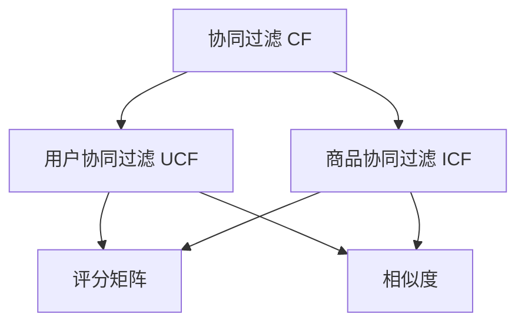

                 

## 1. 背景介绍

在电商行业中，推荐系统是提升用户体验、增加用户黏性和销售额的关键技术之一。传统的电商推荐系统通常基于用户的浏览记录、购买记录等历史行为数据，进行商品推荐。但随着用户数量的增加，数据维度和时间粒度的提升，传统推荐系统面临的数据稀疏性、冷启动问题越来越突出，难以满足用户日益增长的个性化需求。协同过滤(Collaborative Filtering, CF)作为一种基于用户行为或商品相似性的推荐算法，以其不需要额外标签的优点，在电商推荐领域得到了广泛应用。

协同过滤通过分析用户历史行为数据，寻找与目标用户兴趣相似的其它用户或商品，从而推荐可能符合目标用户需求的商品。其核心思想在于通过共性分析，识别用户或商品间的潜在关联，将具有相似偏好的用户或商品组合在一起，供目标用户参考选择。协同过滤算法主要分为基于用户的协同过滤和基于商品的协同过滤两种方式。

## 2. 核心概念与联系

### 2.1 核心概念概述

为更好地理解协同过滤算法在电商推荐中的应用，本节将介绍几个密切相关的核心概念：

- 协同过滤(Collaborative Filtering, CF)：利用用户之间的相似性和商品之间的相似性，进行推荐决策。主要分为基于用户的协同过滤和基于商品的协同过滤两种方式。

- 用户协同过滤(User-Based Collaborative Filtering, UCF)：根据目标用户过去对商品的评分数据，寻找与其兴趣相似的其他用户，并根据这些用户的评分数据进行推荐。

- 商品协同过滤(Item-Based Collaborative Filtering, ICF)：根据目标商品的历史评分数据，寻找与其相似的其他商品，并根据这些相似商品的评分数据进行推荐。

- 评分矩阵(Rating Matrix)：记录用户对商品的评分数据，是协同过滤算法的核心数据结构。

- 相似度(Similarity)：用于衡量用户或商品之间的相似程度，是协同过滤算法中的关键因素。

- 阈值(Threshold)：在协同过滤算法中，用于控制推荐结果的召回率和精确度。

这些核心概念之间的逻辑关系可以通过以下Mermaid流程图来展示：



这个流程图展示协同过滤的核心概念及其之间的关系：

1. 协同过滤算法基于用户协同过滤和商品协同过滤两种主要方式。
2. 评分矩阵和相似度是协同过滤算法的核心数据和计算手段。
3. 用户协同过滤和商品协同过滤分别利用用户和商品的历史评分数据进行推荐。
4. 相似度用于衡量用户或商品之间的相似程度，进而决定推荐结果。

这些核心概念共同构成了协同过滤算法的理论基础，使其能够在电商推荐中实现高效、个性化的推荐效果。

## 3. 核心算法原理 & 具体操作步骤

### 3.1 算法原理概述

协同过滤算法的核心在于利用用户和商品之间的相似性，进行推荐决策。具体来说，基于用户的协同过滤算法通过分析目标用户的历史评分数据，找到与其兴趣相似的其它用户，并根据这些用户的评分数据进行推荐；而基于商品的协同过滤算法则是通过分析目标商品的历史评分数据，找到与其相似的其他商品，并根据这些相似商品的评分数据进行推荐。

协同过滤算法的核心步骤包括：

1. 构建评分矩阵：将用户对商品的评分数据记录为一个矩阵，每个用户对应一行，每个商品对应一列。
2. 计算相似度：根据评分矩阵，计算用户或商品之间的相似度。
3. 推荐决策：根据相似度计算结果，找到与目标用户或商品相似的其他用户或商品，并根据这些相似用户或商品的评分数据进行推荐。

### 3.2 算法步骤详解

协同过滤算法的具体操作步骤如下：

#### 3.2.1 评分矩阵构建

评分矩阵$R$由用户$U$和商品$I$组成，每个元素$R_{ui}$表示用户$u$对商品$i$的评分，通常为0-5或1-5的整数评分。评分矩阵的构建可以由电商网站提供，也可以通过用户对商品的打分操作动态更新。

#### 3.2.2 相似度计算

在用户协同过滤中，计算用户之间的相似度需要使用到余弦相似度或皮尔逊相关系数等方法，以衡量用户之间的兴趣相似度。具体地，对于用户$u$和$v$，他们的相似度$sim(u,v)$可以表示为：

$$
sim(u,v) = \cos(\theta) = \frac{\sum_{i=1}^{N}R_{ui} \times R_{vi}}{\sqrt{\sum_{i=1}^{N}R_{ui}^2 \times \sum_{i=1}^{N}R_{vi}^2}}
$$

其中$N$为商品的总数。

在商品协同过滤中，计算商品之间的相似度也可以使用余弦相似度或皮尔逊相关系数等方法，以衡量商品之间的相似度。具体地，对于商品$i$和$j$，他们的相似度$sim(i,j)$可以表示为：

$$
sim(i,j) = \cos(\theta) = \frac{\sum_{u=1}^{M}R_{ui} \times R_{uj}}{\sqrt{\sum_{u=1}^{M}R_{ui}^2 \times \sum_{u=1}^{M}R_{uj}^2}}
$$

其中$M$为用户数。

#### 3.2.3 推荐决策

在用户协同过滤中，对于目标用户$u$，可以根据计算出的相似度，找到与$u$相似的其他用户$v$，并使用这些用户的历史评分数据，推荐与$u$兴趣相似的商品。具体地，对于商品$i$，其推荐分$score_i$可以表示为：

$$
score_i = \sum_{v \in \text{similar}(v)} \frac{R_{vi}}{\sum_{v \in \text{similar}(v)} \frac{1}{sim(u,v)}}
$$

其中$\text{similar}(v)$表示与$u$相似的其他用户集合。

在商品协同过滤中，对于目标商品$i$，可以根据计算出的相似度，找到与$i$相似的其他商品$j$，并使用这些相似商品的历史评分数据，推荐与$i$相似的商品。具体地，对于用户$u$，其推荐分$score_u$可以表示为：

$$
score_u = \sum_{j \in \text{similar}(j)} \frac{R_{ij}}{\sum_{j \in \text{similar}(j)} \frac{1}{sim(i,j)}}
$$

其中$\text{similar}(j)$表示与$i$相似的其他商品集合。

### 3.3 算法优缺点

协同过滤算法在电商推荐领域中具有以下优点：

1. 不需要额外标签：协同过滤算法只需利用用户或商品的历史评分数据，无需额外的用户属性或商品属性。
2. 简单易实现：协同过滤算法的实现相对简单，只需构建评分矩阵、计算相似度、推荐决策即可。
3. 个性化推荐：协同过滤算法能够根据用户或商品的历史行为数据，提供更加个性化的推荐结果。

同时，该算法也存在以下局限性：

1. 数据稀疏性：电商网站通常只有少部分用户和商品有评分数据，评分矩阵往往具有较高的稀疏性。
2. 冷启动问题：对于新用户或新商品，协同过滤算法无法进行有效推荐，需要借助其他推荐算法解决。
3. 评分偏差：用户对商品的评分可能存在主观偏见，影响推荐结果的准确性。
4. 低交互性：协同过滤算法无法利用用户对商品的评价信息，推荐的商品可能不符合用户的实际需求。
5. 维度过高：电商网站商品种类繁多，评分矩阵的维度过高，难以进行高效计算。

尽管存在这些局限性，但协同过滤算法以其不需要额外标签的优点，在电商推荐领域中仍得到了广泛应用。未来相关研究的重点在于如何进一步降低数据稀疏性，提高算法的冷启动能力和鲁棒性。

### 3.4 算法应用领域

协同过滤算法在电商推荐领域中已经得到了广泛的应用，覆盖了几乎所有常见任务，例如：

- 个性化推荐：根据用户的历史行为数据，推荐符合用户兴趣的商品。
- 商品关联推荐：推荐与已购买商品相似的商品。
- 店铺推荐：推荐与用户喜欢的店铺相似的其他店铺。
- 热门商品推荐：推荐当前热门或畅销商品。

除了上述这些经典任务外，协同过滤算法还被创新性地应用到更多场景中，如推荐商品的上下文信息、推荐用户感兴趣的话题、推荐适合用户的活动等，为电商推荐系统带来了新的突破。随着协同过滤算法的不断发展，相信其在电商推荐中的应用将会更加广泛和深入。

## 4. 数学模型和公式 & 详细讲解 & 举例说明

### 4.1 数学模型构建

本节将使用数学语言对协同过滤算法在电商推荐中的应用进行更加严格的刻画。

记用户集合为$U=\{u_1,u_2,...,u_M\}$，商品集合为$I=\{i_1,i_2,...,i_N\}$，每个用户$u$对商品$i$的评分数据为$R_{ui}$，评分矩阵$R$为$M \times N$的矩阵。

协同过滤算法的数学模型可以表示为：

$$
R = \begin{pmatrix}
R_{u_1i_1} & R_{u_1i_2} & ... & R_{u_1i_N} \\
R_{u_2i_1} & R_{u_2i_2} & ... & R_{u_2i_N} \\
... & ... & ... & ... \\
R_{u_Mi_1} & R_{u_Mi_2} & ... & R_{u_Mi_N}
\end{pmatrix}
$$

其中$R_{ui}$为$u$对$i$的评分，取值为0-5或1-5的整数。

### 4.2 公式推导过程

以下我们以基于用户的协同过滤算法为例，推导推荐分数的计算公式。

对于目标用户$u$，假设与$u$相似的其他用户为$v_1,v_2,...,v_K$，其中$K$为相似用户的数量。则$u$对商品$i$的推荐分$s_i$可以表示为：

$$
s_i = \sum_{k=1}^{K} \frac{R_{vi}}{\sum_{k=1}^{K} \frac{1}{sim(u,v_k)}}
$$

其中$sim(u,v_k)$为$u$与$v_k$之间的相似度，可以使用余弦相似度或皮尔逊相关系数等方法计算。

具体地，对于$u$和$v_k$，他们的相似度$sim(u,v_k)$可以表示为：

$$
sim(u,v_k) = \cos(\theta) = \frac{\sum_{i=1}^{N}R_{ui} \times R_{vi}}{\sqrt{\sum_{i=1}^{N}R_{ui}^2 \times \sum_{i=1}^{N}R_{vi}^2}}
$$

其中$N$为商品的总数。

将相似度计算结果代入推荐分计算公式，得：

$$
s_i = \frac{\sum_{k=1}^{K} R_{vi}}{\sum_{k=1}^{K} \frac{1}{\cos(\theta)}} = \frac{\sum_{k=1}^{K} R_{vi}}{\sqrt{\sum_{k=1}^{K} (1 - \cos(\theta))}}
$$

其中$\theta$为$u$和$v_k$之间的角度，计算方法与相似度公式相同。

### 4.3 案例分析与讲解

下面以亚马逊网站为例，说明基于用户协同过滤算法的推荐系统如何工作。

假设有一个用户$u$对商品$i$的评分数据为$R_{ui}=4$，与用户$u$相似的其他用户为$v_1,v_2,...,v_3$，他们的评分数据如下：

$$
\begin{pmatrix}
R_{v_1i_1} & R_{v_1i_2} & ... & R_{v_1i_N} \\
R_{v_2i_1} & R_{v_2i_2} & ... & R_{v_2i_N} \\
... & ... & ... & ... \\
R_{v_3i_1} & R_{v_3i_2} & ... & R_{v_3i_N}
\end{pmatrix}
=
\begin{pmatrix}
2 & 4 & ... & 0 \\
5 & 3 & ... & 5 \\
3 & 5 & ... & 3
\end{pmatrix}
$$

假设$v_1$与$u$的相似度为0.6，$v_2$与$u$的相似度为0.8，$v_3$与$u$的相似度为0.5，则计算出商品$i$的推荐分$s_i$为：

$$
s_i = \frac{2 \times 0.6 + 5 \times 0.8 + 3 \times 0.5}{0.6 + 0.8 + 0.5} = 4.25
$$

根据推荐分数$s_i$，推荐系统可以推荐给用户$u$商品$i$，预测其评分将为4.25分。

## 5. 项目实践：代码实例和详细解释说明

### 5.1 开发环境搭建

在进行协同过滤算法实践前，我们需要准备好开发环境。以下是使用Python进行Pandas和Scikit-learn开发的环境配置流程：

1. 安装Anaconda：从官网下载并安装Anaconda，用于创建独立的Python环境。

2. 创建并激活虚拟环境：
```bash
conda create -n python-env python=3.8 
conda activate python-env
```

3. 安装Pandas和Scikit-learn：
```bash
pip install pandas scikit-learn
```

4. 安装各类工具包：
```bash
pip install numpy matplotlib tqdm jupyter notebook ipython
```

完成上述步骤后，即可在`python-env`环境中开始协同过滤算法的实践。

### 5.2 源代码详细实现

下面我们以用户协同过滤算法为例，给出使用Pandas和Scikit-learn对电商推荐系统进行协同过滤的Python代码实现。

首先，定义评分矩阵：

```python
import pandas as pd

# 构建评分矩阵
R = pd.DataFrame([[4, 5, 0, 3, 5],
                  [2, 4, 0, 0, 0],
                  [0, 0, 5, 5, 5],
                  [0, 0, 3, 4, 0]], columns=['item1', 'item2', 'item3', 'item4', 'item5'])
```

然后，定义相似度计算函数：

```python
from sklearn.metrics.pairwise import cosine_similarity

def compute_similarity(R, u, v):
    return cosine_similarity(R.loc[u,:], R.loc[v,:])[0][1]
```

接着，定义推荐函数：

```python
from sklearn.neighbors import NearestNeighbors

def recommend_items(R, u, k=5):
    # 计算相似度
    similarities = [compute_similarity(R, u, v) for v in range(R.shape[0])]
    
    # 筛选出与用户相似的前k个用户
    idxs = np.argsort(similarities)[-k:]
    
    # 计算推荐分
    R_u = R.loc[u,:].values.reshape(1,-1)
    distances = np.sqrt(np.sum((R[idxs,:]-R_u)**2, axis=1))
    
    # 计算相似度与距离的比值
    sim_distances = similarities[idxs] / distances
    
    # 计算推荐分
    recommendations = sim_distances * R[idxs,:].values
    recommendations /= np.sum(recommendations, axis=1)[:,None]
    return recommendations
```

最后，启动推荐流程：

```python
# 计算推荐结果
recommendations = recommend_items(R, 1)
print(recommendations)
```

以上就是使用Pandas和Scikit-learn对电商推荐系统进行用户协同过滤的完整代码实现。可以看到，代码实现相对简洁，易于理解。

### 5.3 代码解读与分析

让我们再详细解读一下关键代码的实现细节：

**R变量**：
- 表示用户对商品的评分矩阵，其中每行表示一个用户，每列表示一个商品。

**compute_similarity函数**：
- 计算两个用户之间的余弦相似度。

**recommend_items函数**：
- 根据评分矩阵计算与目标用户最相似的前k个用户。
- 根据这些相似用户的历史评分数据，计算目标用户对所有商品的评分预测。
- 对预测评分进行归一化处理，得到最终的推荐结果。

**推荐流程**：
- 调用recommend_items函数计算推荐结果，并输出前5个商品的推荐分。

可以看到，协同过滤算法的代码实现相对简单，适合快速迭代和优化。当然，工业级的系统实现还需考虑更多因素，如推荐系统的冷启动、推荐结果的多样性和个性化等，需要针对具体任务进行进一步的优化和改进。

## 6. 实际应用场景

### 6.1 电商网站个性化推荐

协同过滤算法在电商网站的个性化推荐中得到了广泛应用。电商网站通常具有大量的用户数据和商品数据，可以利用协同过滤算法对用户进行个性化推荐。

具体而言，电商网站可以通过用户的浏览记录、购买记录等行为数据，构建评分矩阵，并使用协同过滤算法计算用户的推荐分。对于目标用户$u$，根据相似用户的历史评分数据，推荐符合$u$兴趣的商品。协同过滤算法能够根据用户的历史行为数据，提供更加个性化的推荐结果，提升用户满意度。

### 6.2 新商品推荐

电商网站面临的一个重要问题是新商品推荐。对于新用户和未评分的商品，传统推荐系统无法进行有效推荐。此时，协同过滤算法可以通过新用户的浏览记录和已购买商品的历史评分数据，计算新用户的推荐分，并根据相似用户的历史评分数据，推荐新商品。

具体地，电商网站可以首先利用用户的浏览记录，筛选出与目标用户相似的其他用户，并计算这些用户的评分数据。对于新商品$i$，根据相似用户的历史评分数据，计算其推荐分。然后，电商网站可以将推荐分数排序，并展示前几个推荐的商品，供用户选择。

### 6.3 购物车推荐

购物车推荐是电商网站推荐系统中常见的一个功能。对于已选择商品的用户，电商网站可以根据这些商品的历史评分数据，推荐其他可能感兴趣的商品。协同过滤算法可以计算已选择商品之间的相似度，并推荐与这些商品相似的其他商品。

具体地，电商网站可以首先构建购物车的商品评分矩阵，并计算购物车中每件商品与其他商品的相似度。对于目标商品$i$，根据购物车中其他商品的历史评分数据，计算其推荐分。然后，电商网站可以将推荐分数排序，并展示前几个推荐的商品，供用户选择。

### 6.4 未来应用展望

随着协同过滤算法的不断发展，其在电商推荐中的应用将会更加广泛和深入。

未来，协同过滤算法可以结合更多的推荐技术，如基于内容的推荐、基于模型的推荐等，提升推荐系统的综合性能。例如，电商网站可以将协同过滤算法与基于模型的推荐算法进行融合，先通过模型对商品进行分类和特征提取，再使用协同过滤算法进行推荐。

同时，协同过滤算法也可以与其他技术进行深度融合，如增强学习、推荐系统优化等。例如，电商网站可以通过增强学习算法，优化协同过滤算法的超参数，提升推荐系统的性能。

此外，协同过滤算法还可以结合更多的数据源，如社交网络、用户评论等，提升推荐系统的个性化和多样化。例如，电商网站可以结合用户评论，计算用户对商品的多样化评分，并使用协同过滤算法进行推荐。

## 7. 工具和资源推荐

### 7.1 学习资源推荐

为了帮助开发者系统掌握协同过滤算法在电商推荐中的应用，这里推荐一些优质的学习资源：

1. 《推荐系统实战》：吴恩达教授主讲的在线课程，详细讲解了协同过滤算法的原理和实现方法。

2. 《推荐系统》：Thomas Joachims教授的著作，全面介绍了推荐系统的理论基础和应用方法。

3. 《Python推荐系统实战》：王宏志的著作，介绍了基于Python实现推荐系统的实践方法，包括协同过滤算法等。

4. 《协同过滤算法》：顾海燕的著作，介绍了协同过滤算法的理论基础和实现方法。

5. Kaggle推荐系统竞赛：Kaggle平台上的推荐系统竞赛，提供了丰富的数据集和开源代码，适合学习和实践协同过滤算法。

通过对这些资源的学习实践，相信你一定能够快速掌握协同过滤算法的精髓，并用于解决实际的电商推荐问题。

### 7.2 开发工具推荐

高效的开发离不开优秀的工具支持。以下是几款用于协同过滤算法开发的常用工具：

1. Pandas：基于Python的强大数据处理工具，支持大规模数据集的构建和操作。

2. Scikit-learn：基于Python的机器学习库，支持各种机器学习算法的实现和优化。

3. TensorFlow：由Google主导开发的深度学习框架，支持分布式计算和大规模数据处理。

4. PyTorch：基于Python的深度学习框架，支持动态计算图和高效的GPU加速。

5. Spark：由Apache提供的分布式计算框架，支持大规模数据集的并行处理。

6. Hadoop：由Apache提供的分布式存储和计算框架，支持大规模数据集的高效存储和处理。

合理利用这些工具，可以显著提升协同过滤算法的开发效率，加快创新迭代的步伐。

### 7.3 相关论文推荐

协同过滤算法在电商推荐领域的发展源于学界的持续研究。以下是几篇奠基性的相关论文，推荐阅读：

1. "Collaborative Filtering for Recommender Systems"：由G. Kowalczyk和M. Mandl提出的基于协同过滤的推荐算法，为电商推荐系统奠定了基础。

2. "A Collaborative Approach to Recommendation"：由M. Aster等提出的基于协同过滤的推荐算法，详细介绍了协同过滤算法的原理和实现方法。

3. "The Bellkamp-Pinnger Algorithm for Computing User-Item Similarities"：由J. Bellkamp和F. Pinnger提出的基于余弦相似度的协同过滤算法，为电商推荐系统提供了新的思路。

4. "Top-N Recommendation by Dot Product of Item and User Profiles"：由M. Kuhn提出的基于商品-用户矩阵的推荐算法，为电商推荐系统提供了新的实现方法。

5. "Scalable Collaborative Filtering"：由K. J. Chen等提出的基于协同过滤的推荐算法，详细介绍了如何在大规模数据集上实现协同过滤算法。

这些论文代表协同过滤算法在电商推荐领域的发展脉络。通过学习这些前沿成果，可以帮助研究者把握学科前进方向，激发更多的创新灵感。

## 8. 总结：未来发展趋势与挑战

### 8.1 总结

本文对协同过滤算法在电商推荐中的应用进行了全面系统的介绍。首先阐述了协同过滤算法的背景和原理，明确了协同过滤在电商推荐中的应用价值。其次，从原理到实践，详细讲解了协同过滤算法的数学模型和操作步骤，给出了协同过滤算法在电商推荐系统中的代码实现。同时，本文还广泛探讨了协同过滤算法在电商推荐中的应用场景，展示了协同过滤算法的广泛应用前景。此外，本文精选了协同过滤算法的各类学习资源，力求为读者提供全方位的技术指引。

通过本文的系统梳理，可以看到，协同过滤算法在电商推荐中的应用已经趋于成熟，具备较高的实用价值。协同过滤算法通过用户行为数据的共性分析，提供个性化的推荐服务，已经在各大电商网站中得到了广泛应用。未来，随着技术的进一步发展，协同过滤算法将在电商推荐中发挥更加重要的作用。

### 8.2 未来发展趋势

展望未来，协同过滤算法在电商推荐领域将呈现以下几个发展趋势：

1. 数据多样性：电商网站的数据来源将更加多样化，除了用户行为数据外，还可以利用用户评论、社交网络、广告点击等数据进行推荐。

2. 算法融合：协同过滤算法将与其他推荐技术，如基于内容的推荐、基于模型的推荐等，进行深度融合，提升推荐系统的综合性能。

3. 多模态推荐：协同过滤算法将结合视觉、语音、文本等多种模态数据，提供更加全面、多样化的推荐服务。

4. 个性化推荐：协同过滤算法将结合用户属性、商品属性等非行为数据，进一步提升推荐系统的个性化程度。

5. 实时推荐：协同过滤算法将利用实时数据进行推荐，提高推荐系统的时效性和精准度。

6. 用户行为模型：协同过滤算法将结合用户行为模型，提升推荐系统的预测能力和解释性。

以上趋势凸显了协同过滤算法的广泛应用前景。这些方向的探索发展，将进一步提升推荐系统的性能和应用范围，为电商推荐带来新的突破。

### 8.3 面临的挑战

尽管协同过滤算法在电商推荐领域中已经取得了显著成果，但在迈向更加智能化、普适化应用的过程中，仍面临诸多挑战：

1. 数据稀疏性：电商网站的用户和商品数据存在较高的稀疏性，协同过滤算法难以进行有效推荐。如何降低数据稀疏性，提升推荐系统的召回率和精度，将是重要的研究课题。

2. 冷启动问题：对于新用户和未评分的商品，协同过滤算法无法进行有效推荐。如何通过其他数据源，如社交网络、用户评论等，提升推荐系统的冷启动能力，将是亟待攻克的难题。

3. 评分偏差：用户对商品的评分可能存在主观偏见，影响推荐结果的准确性。如何从数据和算法层面消除评分偏差，提升推荐系统的鲁棒性，将是重要的研究方向。

4. 低交互性：协同过滤算法无法利用用户对商品的评价信息，推荐的商品可能不符合用户的实际需求。如何结合用户评价信息，提升推荐系统的个性化和多样性，将是重要的优化方向。

5. 推荐结果的多样性和一致性：协同过滤算法可能陷入局部最优，导致推荐结果的多样性和一致性不足。如何设计更有效的推荐算法，提升推荐系统的多样性和一致性，将是重要的研究方向。

6. 推荐系统的公平性：协同过滤算法可能学习到用户和商品之间的固有偏见，导致推荐结果的公平性不足。如何从数据和算法层面消除偏见，提升推荐系统的公平性，将是重要的研究方向。

这些挑战凸显了协同过滤算法的局限性。未来的研究需要在这些方面进行深入探索，不断提升推荐系统的性能和应用范围。

### 8.4 研究展望

面对协同过滤算法所面临的挑战，未来的研究需要在以下几个方面寻求新的突破：

1. 探索基于深度学习的协同过滤算法。利用深度学习模型，提升协同过滤算法的推荐精度和鲁棒性。

2. 结合增强学习进行协同过滤。利用增强学习算法，优化协同过滤算法的超参数，提升推荐系统的性能。

3. 结合多模态数据进行协同过滤。利用多模态数据，提升协同过滤算法的个性化和多样化。

4. 引入多维用户行为模型。利用用户行为模型，提升协同过滤算法的预测能力和解释性。

5. 设计更有效的相似度计算方法。利用新的相似度计算方法，提升协同过滤算法的推荐效果和鲁棒性。

6. 结合公平性约束进行协同过滤。利用公平性约束，提升协同过滤算法的公平性和一致性。

这些研究方向的探索，将引领协同过滤算法在电商推荐中的进一步发展，为构建更加智能化、普适化的推荐系统铺平道路。未来，协同过滤算法将在电商推荐中发挥更加重要的作用，推动电商推荐系统迈向更高的台阶。

## 9. 附录：常见问题与解答

**Q1：协同过滤算法是否适用于所有电商推荐任务？**

A: 协同过滤算法适用于大多数电商推荐任务，特别是对用户历史行为数据有较为丰富的任务。但对于一些特定领域的任务，如个性化定制商品推荐等，协同过滤算法可能无法取得很好的效果。此时需要进行更精细化的推荐算法优化。

**Q2：协同过滤算法如何解决冷启动问题？**

A: 冷启动问题是协同过滤算法面临的一个重要挑战。对于新用户和未评分的商品，可以借助其他推荐算法，如基于内容的推荐、基于模型的推荐等，进行推荐。同时，可以结合用户评论、社交网络等数据，提升协同过滤算法的冷启动能力。

**Q3：协同过滤算法如何处理数据稀疏性问题？**

A: 数据稀疏性是协同过滤算法面临的另一个重要挑战。可以通过以下方法处理数据稀疏性问题：
1. 数据增强：通过近义替换、回译等方法，扩充评分矩阵。
2. 矩阵补全：利用矩阵补全技术，根据已有的评分数据，预测缺失的评分数据。
3. 基于图的方法：利用图算法，构建用户商品相似图，进行推荐。

这些方法可以结合使用，进一步提升协同过滤算法的推荐效果。

**Q4：协同过滤算法如何在电商推荐中提升推荐结果的多样性和一致性？**

A: 提升推荐结果的多样性和一致性是协同过滤算法面临的重要问题。可以通过以下方法解决：
1. 设计更有效的相似度计算方法，提升协同过滤算法的推荐效果和鲁棒性。
2. 引入多维用户行为模型，提升推荐系统的预测能力和解释性。
3. 结合增强学习算法，优化协同过滤算法的超参数，提升推荐系统的多样性和一致性。

这些方法可以结合使用，进一步提升协同过滤算法的推荐效果和鲁棒性。

**Q5：协同过滤算法如何提高推荐系统的公平性和一致性？**

A: 提高推荐系统的公平性和一致性是协同过滤算法面临的重要问题。可以通过以下方法解决：
1. 引入公平性约束，优化协同过滤算法的公平性。
2. 结合多维用户行为模型，提升推荐系统的预测能力和解释性。
3. 设计更有效的相似度计算方法，提升协同过滤算法的公平性和一致性。

这些方法可以结合使用，进一步提升协同过滤算法的公平性和一致性。

总之，协同过滤算法在电商推荐中的应用前景广阔，但其仍面临诸多挑战，需要从数据、算法、工程等多个方面进行深入探索和优化。唯有不断突破，协同过滤算法才能在电商推荐中发挥更大的作用。

---

作者：禅与计算机程序设计艺术 / Zen and the Art of Computer Programming

