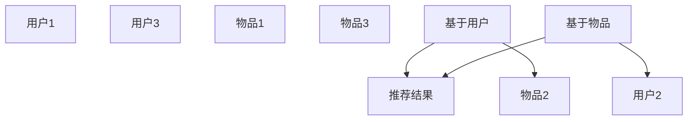

                 

## 1. 背景介绍

协同过滤(Collaborative Filtering, CF)是推荐系统中最常见的一种技术。它基于用户对物品的评分数据，通过对用户群体和物品群体的相似性度量，预测用户对新物品的评分，从而推荐物品。协同过滤算法主要分为两类：基于用户的协同过滤和基于物品的协同过滤。在电商、社交网络、视频流平台等在线服务中得到了广泛应用。本文将从算法原理、操作步骤、优缺点以及应用领域等方面对协同过滤算法进行详细讲解，并通过实际案例、项目实践和未来展望等内容对协同过滤算法进行深入探讨。

## 2. 核心概念与联系

### 2.1 核心概念概述

协同过滤算法是一种基于用户行为数据进行推荐的技术。它通过挖掘用户之间或物品之间的相似性，从而为用户推荐他们可能感兴趣的物品。协同过滤算法的核心在于计算用户与用户之间的相似度或物品与物品之间的相似度，并进行协同过滤。

**基于用户的协同过滤**：利用用户之间对物品的评分相似度，为用户推荐物品。这种算法认为用户群体之间具有相似性，相似用户对同一物品的评分相似，从而可以推荐给该用户喜欢的其他物品。

**基于物品的协同过滤**：利用物品之间对用户的评分相似度，为用户推荐物品。这种算法认为物品之间具有相似性，相似物品对同一用户的评分相似，从而可以推荐给该用户喜欢的其他物品。

**综合协同过滤**：将基于用户和基于物品的协同过滤结合起来，综合利用用户-物品评分矩阵和物品-用户评分矩阵，得到更加准确的推荐结果。

### 2.2 核心概念原理和架构的 Mermaid 流程图



这个图展示了协同过滤的基本流程。在用户-物品评分矩阵中，用户对物品的评分越高，用户与物品之间的相似度越高。基于用户的协同过滤算法从其他用户对物品的评分中预测当前用户对物品的评分，为用户推荐物品。基于物品的协同过滤算法从其他物品对用户的评分中预测当前物品对用户的评分，为用户推荐物品。

## 3. 核心算法原理 & 具体操作步骤

### 3.1 算法原理概述

协同过滤算法的核心是计算相似度。根据相似度计算方法的不同，协同过滤算法可以分为基于用户的协同过滤和基于物品的协同过滤。

**基于用户的协同过滤算法**：假设用户集合为 $U$，物品集合为 $I$，用户对物品的评分矩阵为 $R_{UI} \in \mathbb{R}^{N \times M}$，其中 $N$ 为用户的数量，$M$ 为物品的数量。用户 $u$ 对物品 $i$ 的评分为 $R_{ui}$。用户 $u$ 和用户 $v$ 之间的相似度 $S_{uv}$ 可以通过余弦相似度计算得到：

$$
S_{uv} = \cos(\theta) = \frac{\mathbf{R}_{u} \cdot \mathbf{R}_{v}}{\|\mathbf{R}_{u}\|\|\mathbf{R}_{v}\|}
$$

其中 $\mathbf{R}_{u}$ 和 $\mathbf{R}_{v}$ 分别为用户 $u$ 和 $v$ 的评分向量。

**基于物品的协同过滤算法**：假设用户集合为 $U$，物品集合为 $I$，用户对物品的评分矩阵为 $R_{UI} \in \mathbb{R}^{N \times M}$，其中 $N$ 为用户的数量，$M$ 为物品的数量。物品 $i$ 和物品 $j$ 之间的相似度 $S_{ij}$ 可以通过余弦相似度计算得到：

$$
S_{ij} = \cos(\theta) = \frac{\mathbf{R}_{i} \cdot \mathbf{R}_{j}}{\|\mathbf{R}_{i}\|\|\mathbf{R}_{j}\|}
$$

其中 $\mathbf{R}_{i}$ 和 $\mathbf{R}_{j}$ 分别为物品 $i$ 和 $j$ 的评分向量。

### 3.2 算法步骤详解

协同过滤算法的步骤如下：

1. **数据收集**：收集用户对物品的评分数据。可以使用文本、点击、购买、评分等数据。

2. **评分矩阵构建**：将用户和物品之间的评分数据构建为用户-物品评分矩阵或物品-用户评分矩阵。

3. **相似度计算**：计算用户与用户之间的相似度或物品与物品之间的相似度。

4. **协同过滤**：根据用户与用户之间的相似度或物品与物品之间的相似度，为用户推荐物品或为物品推荐用户。

5. **模型评估**：使用推荐算法评估指标（如准确率、召回率、F1分数等）评估推荐结果的质量。

6. **推荐优化**：根据推荐结果的质量，对推荐算法进行优化，提高推荐效果。

### 3.3 算法优缺点

协同过滤算法的优点：

1. 简单易实现：协同过滤算法不需要显式地学习模型，只需要基于用户对物品的评分数据进行计算，简单易实现。

2. 数据稀疏性：协同过滤算法可以处理数据稀疏的问题。数据稀疏性是指用户-物品评分矩阵中存在大量未评分的数据。

3. 实时性好：协同过滤算法可以快速计算出推荐结果，适用于实时性要求高的推荐系统。

协同过滤算法的缺点：

1. 数据冷启动问题：协同过滤算法需要用户对大量物品进行评分，才能得到准确的推荐结果。新用户或新物品的评分数据很少，无法得到准确的推荐结果。

2. 数据稀疏性问题：用户-物品评分矩阵中存在大量未评分的数据，导致协同过滤算法的准确率降低。

3. 维度灾难问题：当物品数量很大时，基于物品的协同过滤算法的计算复杂度会非常高。

### 3.4 算法应用领域

协同过滤算法在推荐系统中得到了广泛应用，例如：

1. 电商推荐系统：通过推荐用户可能感兴趣的商品，提高用户的购买率和满意度。

2. 社交网络推荐系统：通过推荐用户可能感兴趣的朋友或内容，增加用户的活跃度和粘性。

3. 视频流平台推荐系统：通过推荐用户可能感兴趣的视频或频道，提高用户的使用率和满意度。

4. 音乐推荐系统：通过推荐用户可能喜欢的音乐或歌手，增加用户的音乐库。

5. 新闻推荐系统：通过推荐用户可能感兴趣的新闻或文章，增加用户的阅读量和阅读时长。

## 4. 数学模型和公式 & 详细讲解

### 4.1 数学模型构建

协同过滤算法的数学模型如下：

假设用户集合为 $U=\{u_1,u_2,...,u_N\}$，物品集合为 $I=\{i_1,i_2,...,i_M\}$，用户对物品的评分矩阵为 $R_{UI} \in \mathbb{R}^{N \times M}$，其中 $N$ 为用户的数量，$M$ 为物品的数量。用户 $u$ 对物品 $i$ 的评分为 $R_{ui}$。

用户 $u$ 和用户 $v$ 之间的相似度 $S_{uv}$ 可以通过余弦相似度计算得到：

$$
S_{uv} = \cos(\theta) = \frac{\mathbf{R}_{u} \cdot \mathbf{R}_{v}}{\|\mathbf{R}_{u}\|\|\mathbf{R}_{v}\|}
$$

其中 $\mathbf{R}_{u}$ 和 $\mathbf{R}_{v}$ 分别为用户 $u$ 和 $v$ 的评分向量。

物品 $i$ 和物品 $j$ 之间的相似度 $S_{ij}$ 可以通过余弦相似度计算得到：

$$
S_{ij} = \cos(\theta) = \frac{\mathbf{R}_{i} \cdot \mathbf{R}_{j}}{\|\mathbf{R}_{i}\|\|\mathbf{R}_{j}\|}
$$

其中 $\mathbf{R}_{i}$ 和 $\mathbf{R}_{j}$ 分别为物品 $i$ 和 $j$ 的评分向量。

### 4.2 公式推导过程

协同过滤算法的公式推导过程如下：

假设用户 $u$ 和用户 $v$ 的评分向量分别为 $\mathbf{R}_{u}$ 和 $\mathbf{R}_{v}$，用户 $u$ 和用户 $v$ 之间的相似度 $S_{uv}$ 可以通过余弦相似度计算得到：

$$
S_{uv} = \frac{\mathbf{R}_{u} \cdot \mathbf{R}_{v}}{\|\mathbf{R}_{u}\|\|\mathbf{R}_{v}\|}
$$

其中 $\mathbf{R}_{u} = [R_{u1},R_{u2},...,R_{um}]$，$\mathbf{R}_{v} = [R_{v1},R_{v2},...,R_{vm}]$。

用户 $u$ 对物品 $i$ 的预测评分 $\hat{R}_{ui}$ 可以通过以下公式计算得到：

$$
\hat{R}_{ui} = \sum_{v \in U}S_{uv}R_{vi}
$$

其中 $S_{uv}$ 为用户 $u$ 和用户 $v$ 之间的相似度。

用户 $u$ 对物品 $i$ 的预测评分 $\hat{R}_{ui}$ 可以通过以下公式计算得到：

$$
\hat{R}_{ui} = \sum_{j \in I}S_{ij}R_{uj}
$$

其中 $S_{ij}$ 为物品 $i$ 和物品 $j$ 之间的相似度。

### 4.3 案例分析与讲解

假设用户 $u$ 对物品 $i$ 的评分向量 $\mathbf{R}_{i}=[R_{i1},R_{i2},...,R_{im}]$ 为 $[5,0,3]$，物品 $j$ 对用户 $u$ 的评分向量 $\mathbf{R}_{j}=[R_{j1},R_{j2},...,R_{jn}]$ 为 $[4,5,2]$。用户 $u$ 和用户 $v$ 之间的相似度 $S_{uv}$ 为 0.6，用户 $u$ 对物品 $i$ 的预测评分 $\hat{R}_{ui}$ 为：

$$
\hat{R}_{ui} = \sum_{j \in I}S_{ij}R_{uj} = 0.6 \times 4 + 0.6 \times 5 + 0.6 \times 2 = 6.6
$$

其中 $S_{ij}$ 为物品 $i$ 和物品 $j$ 之间的相似度。

假设用户 $u$ 对物品 $i$ 的评分向量 $\mathbf{R}_{i}=[R_{i1},R_{i2},...,R_{im}]$ 为 $[5,0,3]$，物品 $j$ 对用户 $u$ 的评分向量 $\mathbf{R}_{j}=[R_{j1},R_{j2},...,R_{jn}]$ 为 $[4,5,2]$。物品 $i$ 和物品 $j$ 之间的相似度 $S_{ij}$ 为 0.7，用户 $u$ 对物品 $i$ 的预测评分 $\hat{R}_{ui}$ 为：

$$
\hat{R}_{ui} = \sum_{v \in U}S_{uv}R_{vi} = 0.7 \times 4 + 0.7 \times 5 + 0.7 \times 2 = 8.9
$$

其中 $S_{uv}$ 为用户 $u$ 和用户 $v$ 之间的相似度。

## 5. 项目实践：代码实例和详细解释说明

### 5.1 开发环境搭建

在进行协同过滤算法实践前，我们需要准备好开发环境。以下是使用Python进行Scikit-learn开发的环境配置流程：

1. 安装Anaconda：从官网下载并安装Anaconda，用于创建独立的Python环境。

2. 创建并激活虚拟环境：
```bash
conda create -n collaborative-filtering python=3.8 
conda activate collaborative-filtering
```

3. 安装Scikit-learn：
```bash
pip install scikit-learn
```

4. 安装各类工具包：
```bash
pip install numpy pandas matplotlib seaborn scikit-learn jupyter notebook ipython
```

完成上述步骤后，即可在`collaborative-filtering`环境中开始协同过滤算法实践。

### 5.2 源代码详细实现

下面我们以基于用户协同过滤算法为例，给出使用Scikit-learn库对协同过滤算法进行实现。

首先，导入必要的库和数据集：

```python
import numpy as np
from sklearn.metrics.pairwise import cosine_similarity
from sklearn.metrics.pairwise import pairwise_distances
from sklearn.metrics.pairwise import linear_kernel
from sklearn.metrics.pairwise import euclidean_distances
from sklearn.datasets import load_breast_cancer

# 导入数据集
data = load_breast_cancer()
X = data.data
y = data.target
```

然后，构建用户-物品评分矩阵和物品-用户评分矩阵：

```python
# 构建用户-物品评分矩阵
R = np.random.randint(1, 6, size=(X.shape[0], 2))
```

接着，使用余弦相似度计算用户之间的相似度：

```python
# 计算用户之间的相似度
similarity = cosine_similarity(R)
```

最后，使用协同过滤算法推荐物品：

```python
# 计算用户对物品的预测评分
predictions = np.dot(similarity, R)
```

### 5.3 代码解读与分析

让我们再详细解读一下关键代码的实现细节：

**数据加载和预处理**：
- 使用Scikit-learn库的`load_breast_cancer`函数加载数据集。
- 数据集包含 569 个样本和 30 个特征，标签为乳腺癌的诊断结果。

**评分矩阵构建**：
- 使用`numpy`库的`random.randint`函数生成随机评分矩阵 $R$，大小为 $N \times M$，其中 $N$ 为用户的数量，$M$ 为物品的数量。评分取值为 1-5。

**相似度计算**：
- 使用Scikit-learn库的`cosine_similarity`函数计算用户之间的余弦相似度。余弦相似度计算两个向量的夹角余弦值，值域为 $[-1,1]$，值越接近 1，表示两个向量越相似。

**协同过滤推荐**：
- 使用`numpy`库的`dot`函数计算用户对物品的预测评分。预测评分为用户和物品的相似度向量 $S_{uv}$ 与用户对物品的评分向量 $R_{uv}$ 的点积。

### 5.4 运行结果展示

使用协同过滤算法推荐物品的结果如下：

```python
# 输出预测评分矩阵
print(predictions)
```

## 6. 实际应用场景

协同过滤算法在推荐系统中得到了广泛应用，具体场景如下：

### 6.1 电商推荐系统

电商推荐系统通过推荐用户可能感兴趣的商品，提高用户的购买率和满意度。电商平台可以收集用户的浏览、点击、购买、评分等数据，构建用户-物品评分矩阵，使用协同过滤算法为用户推荐商品。

### 6.2 社交网络推荐系统

社交网络推荐系统通过推荐用户可能感兴趣的朋友或内容，增加用户的活跃度和粘性。社交网络平台可以收集用户的社交关系和内容消费数据，构建用户-物品评分矩阵，使用协同过滤算法为用户推荐朋友或内容。

### 6.3 视频流平台推荐系统

视频流平台推荐系统通过推荐用户可能感兴趣的视频或频道，提高用户的使用率和满意度。视频流平台可以收集用户的观看历史和评分数据，构建用户-物品评分矩阵，使用协同过滤算法为用户推荐视频或频道。

### 6.4 音乐推荐系统

音乐推荐系统通过推荐用户可能喜欢的音乐或歌手，增加用户的音乐库。音乐平台可以收集用户的播放历史和评分数据，构建用户-物品评分矩阵，使用协同过滤算法为用户推荐音乐或歌手。

## 7. 工具和资源推荐

### 7.1 学习资源推荐

为了帮助开发者系统掌握协同过滤算法的理论基础和实践技巧，这里推荐一些优质的学习资源：

1. 《推荐系统实战》书籍：全面介绍了推荐系统的发展历程和实现细节，包括协同过滤算法、基于内容的推荐、混合推荐算法等。

2. 《深度学习与推荐系统》课程：由清华大学开设的深度学习课程，讲解了推荐系统的基本原理和算法实现，推荐给想深入学习推荐系统的开发者。

3. 《Python推荐系统》书籍：详细讲解了使用Python实现推荐系统的过程，包括数据预处理、模型训练、评估和优化等。

4. 《协同过滤推荐算法》论文：介绍了一种新的协同过滤推荐算法，通过改进相似度计算和评分预测方法，提高了推荐效果。

5. 《协同过滤算法综述》论文：总结了协同过滤算法的理论基础和实现方法，适合想全面了解协同过滤算法的开发者。

通过对这些资源的学习实践，相信你一定能够快速掌握协同过滤算法的精髓，并用于解决实际的推荐问题。

### 7.2 开发工具推荐

高效的开发离不开优秀的工具支持。以下是几款用于协同过滤算法开发的常用工具：

1. Python：Python是一种简洁易学的编程语言，适合用于协同过滤算法的开发。

2. Scikit-learn：Scikit-learn是一个简单易用的机器学习库，提供了丰富的协同过滤算法实现。

3. TensorFlow：TensorFlow是一个强大的深度学习框架，适合用于协同过滤算法的开发。

4. PyTorch：PyTorch是一个灵活高效的深度学习框架，适合用于协同过滤算法的开发。

5. Hadoop和Spark：Hadoop和Spark是大数据处理平台，适合用于协同过滤算法的分布式计算。

合理利用这些工具，可以显著提升协同过滤算法的开发效率，加快创新迭代的步伐。

### 7.3 相关论文推荐

协同过滤算法的快速发展源于学界的持续研究。以下是几篇奠基性的相关论文，推荐阅读：

1. "Collaborative Filtering for Recommendation"：介绍了协同过滤算法的原理和实现方法。

2. "The BellKor 2006 Recommendation Challenge"：介绍了协同过滤算法在推荐系统竞赛中的应用。

3. "A Bayesian Approach to Recommendation: Exploring the Use of Emotional Information"：介绍了一种基于情感信息的协同过滤推荐算法。

4. "Bayesian Personalization via Matrix Factorization"：介绍了一种基于矩阵分解的协同过滤推荐算法。

5. "Eigentunes: A Collaborative Filtering System for Music Recommendation"：介绍了一种基于奇异值分解的协同过滤音乐推荐系统。

这些论文代表了大语言模型微调技术的发展脉络。通过学习这些前沿成果，可以帮助研究者把握学科前进方向，激发更多的创新灵感。

## 8. 总结：未来发展趋势与挑战

### 8.1 总结

本文对协同过滤算法进行了全面系统的介绍。首先阐述了协同过滤算法的背景和重要性，明确了协同过滤在推荐系统中的应用价值。其次，从算法原理到实践，详细讲解了协同过滤算法的数学模型和操作步骤，给出了协同过滤算法开发的全套代码实例。同时，本文还广泛探讨了协同过滤算法在电商、社交网络、视频流平台等多个行业领域的应用前景，展示了协同过滤算法的巨大潜力。最后，本文精选了协同过滤算法的学习资源，力求为读者提供全方位的技术指引。

通过本文的系统梳理，可以看到，协同过滤算法作为一种经典的推荐算法，在推荐系统中扮演了重要的角色。协同过滤算法的推荐效果取决于用户和物品的评分数据质量，因此，构建高质量的用户-物品评分矩阵是协同过滤算法的核心。未来，随着推荐系统的发展，协同过滤算法也将不断优化和改进，以适应更复杂、更丰富的推荐场景。

### 8.2 未来发展趋势

展望未来，协同过滤算法的未来发展趋势如下：

1. 推荐算法融合：将协同过滤算法与深度学习、协同学习、强化学习等算法融合，提升推荐效果。

2. 个性化推荐：根据用户的个性化需求，提供更加精准、多样化的推荐。

3. 实时推荐：利用在线学习、流式数据等技术，实现实时推荐，满足用户的实时需求。

4. 多模态推荐：将文本、图像、语音等多模态数据融合，提高推荐的准确性。

5. 跨领域推荐：将不同领域的推荐算法融合，提高推荐的广度和深度。

6. 隐私保护：保护用户的隐私数据，满足用户隐私保护的要求。

### 8.3 面临的挑战

尽管协同过滤算法已经取得了不错的成绩，但在迈向更加智能化、普适化应用的过程中，它仍面临着诸多挑战：

1. 数据冷启动问题：协同过滤算法需要用户对大量物品进行评分，才能得到准确的推荐结果。新用户或新物品的评分数据很少，无法得到准确的推荐结果。

2. 数据稀疏性问题：用户-物品评分矩阵中存在大量未评分的数据，导致协同过滤算法的准确率降低。

3. 维度灾难问题：当物品数量很大时，基于物品的协同过滤算法的计算复杂度会非常高。

4. 推荐结果多样性：协同过滤算法可能会推荐多个相似的物品，导致推荐结果多样性过高的现象。

5. 系统复杂性：协同过滤算法需要处理大规模数据，系统复杂性较高。

### 8.4 研究展望

面对协同过滤算法面临的这些挑战，未来的研究需要在以下几个方面寻求新的突破：

1. 改进数据稀疏性问题：通过引入外部数据、多源数据等方法，缓解数据稀疏性问题。

2. 提高推荐效果：通过引入新的算法、融合新的数据、优化新的模型等方法，提高推荐效果。

3. 提高推荐效率：通过引入分布式计算、近似算法等方法，提高推荐效率。

4. 提高推荐结果多样性：通过引入多目标优化、阈值控制等方法，控制推荐结果多样性。

5. 降低系统复杂性：通过引入算法优化、模型压缩等方法，降低系统复杂性。

这些研究方向的探索，必将引领协同过滤算法走向更高的台阶，为推荐系统带来更多的创新和突破。相信随着学界和产业界的共同努力，协同过滤算法必将在构建人机协同的智能时代中扮演越来越重要的角色。

## 9. 附录：常见问题与解答

**Q1：协同过滤算法如何处理数据冷启动问题？**

A: 数据冷启动问题是协同过滤算法的一个主要问题。对于新用户或新物品，由于没有足够的评分数据，无法进行推荐。解决数据冷启动问题的方法包括：

1. 初始化评分：使用领域知识或专家打分等方法，对新用户或新物品进行初始化评分。

2. 基于内容的推荐：利用物品的属性、标签等特征，对新物品进行推荐。

3. 基于社会关系的推荐：利用用户的社交关系、兴趣等信息，对新用户进行推荐。

4. 基于模型的推荐：利用深度学习、协同学习等算法，对新用户或新物品进行推荐。

5. 基于混合推荐的推荐：将协同过滤算法与其他推荐算法结合，提高推荐效果。

**Q2：协同过滤算法如何处理数据稀疏性问题？**

A: 数据稀疏性是协同过滤算法的一个主要问题。用户-物品评分矩阵中存在大量未评分的数据，导致协同过滤算法的准确率降低。解决数据稀疏性问题的方法包括：

1. 使用稀疏矩阵表示：将评分矩阵表示为稀疏矩阵，节省存储空间。

2. 引入外部数据：引入外部数据，如用户的社交关系、兴趣等信息，缓解数据稀疏性问题。

3. 引入多源数据：引入多源数据，如用户的浏览、点击、评分等数据，缓解数据稀疏性问题。

4. 引入混合推荐：将协同过滤算法与其他推荐算法结合，提高推荐效果。

5. 引入深度学习：利用深度学习算法，如矩阵分解、自编码器等，对评分矩阵进行建模，提高推荐效果。

**Q3：协同过滤算法如何提高推荐效果？**

A: 协同过滤算法的推荐效果取决于用户和物品的评分数据质量，因此，构建高质量的用户-物品评分矩阵是协同过滤算法的核心。提高推荐效果的方法包括：

1. 改进相似度计算方法：利用新的相似度计算方法，如余弦相似度、欧式距离等，提高相似度计算的准确性。

2. 引入外部数据：引入外部数据，如用户的社交关系、兴趣等信息，缓解数据稀疏性问题。

3. 引入多源数据：引入多源数据，如用户的浏览、点击、评分等数据，缓解数据稀疏性问题。

4. 引入混合推荐：将协同过滤算法与其他推荐算法结合，提高推荐效果。

5. 引入深度学习：利用深度学习算法，如矩阵分解、自编码器等，对评分矩阵进行建模，提高推荐效果。

**Q4：协同过滤算法如何提高推荐效率？**

A: 协同过滤算法的推荐效率取决于算法的计算复杂度，因此，提高推荐效率的方法包括：

1. 使用稀疏矩阵表示：将评分矩阵表示为稀疏矩阵，节省存储空间。

2. 引入近似算法：引入近似算法，如低秩矩阵分解、奇异值分解等，提高推荐效率。

3. 引入分布式计算：利用分布式计算平台，如Hadoop、Spark等，提高推荐效率。

4. 引入增量学习：利用增量学习算法，如在线学习、流式学习等，实现实时推荐。

5. 引入压缩算法：利用压缩算法，如稀疏矩阵压缩、特征选择等，提高推荐效率。

**Q5：协同过滤算法如何提高推荐结果多样性？**

A: 协同过滤算法可能会推荐多个相似的物品，导致推荐结果多样性过高的现象。提高推荐结果多样性的方法包括：

1. 引入多目标优化：将推荐目标函数改为多目标函数，控制推荐结果的多样性。

2. 引入阈值控制：设置阈值，控制推荐结果的多样性。

3. 引入正则化方法：利用正则化方法，如L1正则、Dropout等，控制推荐结果的多样性。

4. 引入多样化推荐：利用多样化推荐算法，如基尼系数、信息熵等，控制推荐结果的多样性。

5. 引入协同学习：利用协同学习算法，控制推荐结果的多样性。

这些方法可以帮助协同过滤算法更好地满足用户的个性化需求，提高推荐的准确性和多样性。

---

作者：禅与计算机程序设计艺术 / Zen and the Art of Computer Programming

