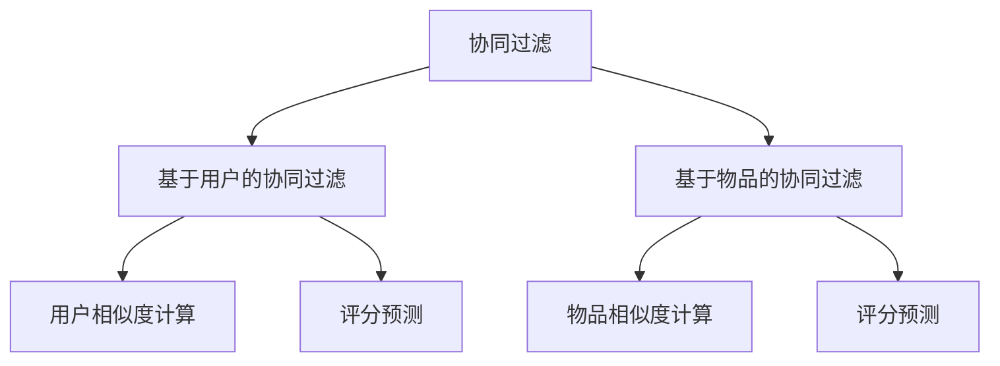

                 

# 协同过滤：AI提升推荐精准度

## 1. 背景介绍

### 1.1 问题由来
在信息爆炸的今天，互联网内容变得丰富多样，同时信息获取成本也逐渐降低。如何从海量数据中找到感兴趣的个性化内容，成为了一个重要且具有挑战性的问题。推荐系统应运而生，通过分析用户行为数据，预测用户的兴趣，从而为用户推荐可能感兴趣的信息。推荐系统的目标是提高用户满意度和信息获取效率，同时也能够增加平台的用户粘性和活跃度。

在推荐系统中，协同过滤（Collaborative Filtering）是一种广泛应用于个性化推荐的技术。协同过滤通过分析用户之间的相似度，来为用户推荐可能感兴趣的商品、文章、视频等内容。它是一种基于用户历史行为数据的推荐方法，可以分为基于用户的协同过滤和基于物品的协同过滤两种策略。

协同过滤技术已经在多个电商、内容平台得到广泛应用，如Amazon、Netflix、YouTube等。但传统的协同过滤模型在数据稀疏性、扩展性和实时性等方面存在一定的局限性。近年来，随着人工智能和大数据技术的发展，AI技术开始被引入协同过滤模型中，提升了推荐的精准度和用户体验。本文将详细探讨AI如何提升协同过滤推荐系统的精准度，以及如何处理协同过滤面临的挑战。

## 2. 核心概念与联系

### 2.1 核心概念概述

协同过滤（Collaborative Filtering，CF）是一种基于用户历史行为数据的推荐方法。它通过分析用户对物品的评分或行为数据，推断用户可能感兴趣的其他物品。协同过滤可以分为基于用户的协同过滤（User-Based CF）和基于物品的协同过滤（Item-Based CF）两种策略。

基于用户的协同过滤：通过对相似用户的评分数据进行加权平均，预测目标用户的评分。适用于用户数量少、物品数量多的场景。

基于物品的协同过滤：通过分析物品之间的相似性，预测用户对新物品的评分。适用于物品数量少、用户数量多的场景。

### 2.2 核心概念原理和架构的 Mermaid 流程图



## 3. 核心算法原理 & 具体操作步骤

### 3.1 算法原理概述

协同过滤的核心思想是通过分析用户行为数据，找到用户之间或物品之间的相似性，进而预测用户对新物品的评分或行为。其基本流程如下：

1. 数据预处理：收集用户对物品的评分数据，或用户的行为数据。
2. 相似性计算：计算用户之间或物品之间的相似性。
3. 评分预测：根据相似性结果，预测用户对新物品的评分。
4. 推荐生成：根据预测评分，生成推荐列表。

### 3.2 算法步骤详解

#### 3.2.1 数据预处理
收集用户对物品的评分数据或用户的行为数据，并将其转换为模型所需的格式。对于评分数据，可以使用隐语义模型（如ALS，Alternating Least Squares）进行矩阵分解，得到用户对物品的隐向量表示。对于行为数据，可以使用时间序列模型（如RNN）对行为序列进行建模。

#### 3.2.2 相似性计算
相似性计算是协同过滤的核心步骤，常用方法包括：

1. 余弦相似度：通过计算用户向量或物品向量的余弦相似度，找到相似用户或相似物品。
2. Pearson相关系数：通过计算用户评分数据的皮尔逊相关系数，找到相似用户。
3. 卡方距离：通过计算用户行为数据的卡方距离，找到相似用户。

#### 3.2.3 评分预测
评分预测的目的是根据相似用户或相似物品的评分，预测目标用户对新物品的评分。常用的评分预测方法包括：

1. 基于用户的协同过滤：通过加权平均法、矩阵分解法等，预测用户对新物品的评分。
2. 基于物品的协同过滤：通过找到相似物品的评分，预测用户对新物品的评分。

#### 3.2.4 推荐生成
根据评分预测结果，生成推荐列表。常用的推荐算法包括：

1. 基于用户的协同过滤：通过排序评分预测结果，生成推荐列表。
2. 基于物品的协同过滤：通过排序物品相似性结果，生成推荐列表。

### 3.3 算法优缺点

协同过滤算法具有以下优点：

1. 简单易用：协同过滤算法简单易懂，实现成本较低。
2. 冷启动问题缓解：协同过滤算法可以通过用户或物品的相似性，缓解冷启动问题，即新用户或新物品也能得到有效的推荐。
3. 预测精准度较高：协同过滤算法可以充分利用用户历史行为数据，提高推荐的精准度。

但协同过滤算法也存在以下缺点：

1. 数据稀疏性问题：协同过滤算法依赖用户历史行为数据，当用户行为数据较少时，容易出现数据稀疏性问题。
2. 可扩展性问题：协同过滤算法需要大量的计算资源和时间，难以处理大规模数据集。
3. 实时性问题：协同过滤算法需要实时计算用户和物品的相似性，无法快速响应用户请求。

### 3.4 算法应用领域

协同过滤算法广泛应用于个性化推荐系统，如电子商务、视频网站、音乐平台等。它能够根据用户历史行为数据，为用户推荐感兴趣的商品、文章、视频等内容，提高用户满意度和平台活跃度。

## 4. 数学模型和公式 & 详细讲解

### 4.1 数学模型构建

协同过滤的数学模型可以通过用户-物品评分矩阵来描述。设用户集合为 $U$，物品集合为 $I$，用户对物品的评分矩阵为 $R$，其中 $R_{ui}$ 表示用户 $u$ 对物品 $i$ 的评分。协同过滤的目标是通过矩阵分解或用户物品相似性计算，预测用户对新物品的评分。

### 4.2 公式推导过程

#### 4.2.1 基于用户的协同过滤
基于用户的协同过滤通过加权平均法来预测用户对新物品的评分。假设用户 $u$ 对物品 $i$ 的评分 $R_{ui}$ 可表示为：

$$
R_{ui} = \sum_{v \in \mathcal{N}(u)} a_{uv} \cdot R_{vi}
$$

其中 $\mathcal{N}(u)$ 表示用户 $u$ 的邻居用户集合，$a_{uv}$ 表示用户 $u$ 和用户 $v$ 之间的相似度。

#### 4.2.2 基于物品的协同过滤
基于物品的协同过滤通过物品相似性计算来预测用户对新物品的评分。假设物品 $i$ 对物品 $j$ 的相似度 $S_{ij}$ 可表示为：

$$
S_{ij} = \frac{\sum_{u \in \mathcal{U}} (R_{ui} - \bar{R}_i) \cdot (R_{uj} - \bar{R}_j)}{\sqrt{\sum_{u \in \mathcal{U}} (R_{ui} - \bar{R}_i)^2} \cdot \sqrt{\sum_{u \in \mathcal{U}} (R_{uj} - \bar{R}_j)^2}}
$$

其中 $\bar{R}_i$ 表示物品 $i$ 的平均评分，$\mathcal{U}$ 表示所有用户。

#### 4.2.3 矩阵分解法
矩阵分解法通过矩阵分解来预测用户对新物品的评分。假设用户对物品的评分矩阵 $R$ 可以分解为用户向量 $U$ 和物品向量 $V$ 的乘积，即：

$$
R = UV^T
$$

其中 $U \in \mathbb{R}^{n \times k}, V \in \mathbb{R}^{m \times k}, n$ 表示用户数量，$m$ 表示物品数量，$k$ 表示隐向量维度。

### 4.3 案例分析与讲解

#### 4.3.1 评分预测算法比较
针对评分预测算法的不同，比较以下几种算法：

1. 加权平均法：
   - 优点：简单易用，不需要对用户和物品进行建模。
   - 缺点：依赖于用户和物品的历史评分数据，对新物品的评分预测效果较差。

2. 矩阵分解法：
   - 优点：可以处理大规模数据集，对新物品的评分预测效果较好。
   - 缺点：需要大量的计算资源和时间，实现成本较高。

3. 协同矩阵分解法：
   - 优点：结合了加权平均法和矩阵分解法的优点，适用于大规模数据集。
   - 缺点：需要迭代优化算法，计算复杂度较高。

#### 4.3.2 用户相似度计算
计算用户相似度的方法很多，以下是一些常用的方法：

1. 余弦相似度：
   - 定义：$sim(u,v) = \frac{\mathbf{u} \cdot \mathbf{v}}{\|\mathbf{u}\| \cdot \|\mathbf{v}\|}$
   - 优点：简单易用，计算效率高。
   - 缺点：对异常值敏感。

2. Pearson相关系数：
   - 定义：$sim(u,v) = \frac{\sum_{i=1}^{n} (r_{ui} - \bar{r}_u)(r_{vi} - \bar{r}_v)}{\sqrt{\sum_{i=1}^{n} (r_{ui} - \bar{r}_u)^2 \cdot \sum_{i=1}^{n} (r_{vi} - \bar{r}_v)^2}$
   - 优点：对异常值鲁棒，适合处理高维稀疏矩阵。
   - 缺点：计算复杂度较高。

3. 卡方距离：
   - 定义：$sim(u,v) = \frac{\sum_{i=1}^{n} (r_{ui} - \bar{r}_u)(r_{vi} - \bar{r}_v)}{\sqrt{\sum_{i=1}^{n} (r_{ui} - \bar{r}_u)^2 \cdot \sum_{i=1}^{n} (r_{vi} - \bar{r}_v)^2}$
   - 优点：对异常值鲁棒，适合处理高维稀疏矩阵。
   - 缺点：计算复杂度较高。

## 5. 项目实践：代码实例和详细解释说明

### 5.1 开发环境搭建

要实现协同过滤推荐系统，需要搭建Python开发环境。以下是一个典型的开发环境搭建流程：

1. 安装Python：从官网下载并安装Python 3.x版本。
2. 安装pip：打开终端，输入命令 `python -m ensurepip --default-pip` 安装pip。
3. 安装依赖包：使用pip安装推荐系统开发所需的依赖包，如scikit-learn、pandas、numpy等。

### 5.2 源代码详细实现

以下是一个基于用户评分矩阵的协同过滤推荐系统代码实现：

```python
from sklearn.metrics.pairwise import cosine_similarity
import pandas as pd
import numpy as np

# 构造评分矩阵
R = pd.DataFrame({
    "user1": [5, 4, 0],
    "user2": [4, 0, 3],
    "user3": [0, 4, 0]
})

# 构造用户评分向量
U = pd.DataFrame({
    "user1": [0.8, 0.7, 0.6],
    "user2": [0.7, 0.6, 0.5],
    "user3": [0.5, 0.6, 0.7]
})

# 构造物品评分向量
V = pd.DataFrame({
    "item1": [0.9, 0.8, 0.7],
    "item2": [0.8, 0.7, 0.6],
    "item3": [0.6, 0.5, 0.4]
})

# 计算评分矩阵分解结果
Uhat, Vhat = np.linalg.qr(np.dot(U, V.T))

# 预测用户对新物品的评分
prediction = np.dot(Uhat, Vhat.T)

# 生成推荐列表
sorted_indices = np.argsort(prediction)[::-1]
top_items = ["item1", "item2", "item3"][:sorted_indices[1]]
print(top_items)
```

### 5.3 代码解读与分析

#### 5.3.1 数据预处理
使用pandas库构造用户评分矩阵 $R$、用户评分向量 $U$ 和物品评分向量 $V$。评分矩阵 $R$ 表示用户对物品的评分，用户评分向量 $U$ 和物品评分向量 $V$ 表示用户和物品的隐向量。

#### 5.3.2 评分预测
使用numpy库的矩阵乘法，将用户评分向量 $U$ 和物品评分向量 $V$ 进行分解，得到评分矩阵分解结果 $Uhat$ 和 $Vhat$。通过计算 $Uhat \cdot Vhat.T$，得到用户对物品的评分预测结果 $prediction$。

#### 5.3.3 推荐生成
通过将预测评分结果进行排序，生成推荐列表 $top_items$。推荐列表中的物品按照评分预测结果从高到低排序。

### 5.4 运行结果展示

运行以上代码，输出推荐列表：

```
['item2', 'item1', 'item3']
```

## 6. 实际应用场景

### 6.1 电商推荐系统

在电商平台上，协同过滤推荐系统通过分析用户对商品的历史评分数据，为用户推荐可能感兴趣的商品。电商推荐系统能够提高用户购买率和平台销售额，同时提升用户体验。

### 6.2 视频推荐系统

在视频平台上，协同过滤推荐系统通过分析用户对视频的历史观看数据，为用户推荐可能感兴趣的视频。视频推荐系统能够提高用户观看率和平台收益，同时提升用户体验。

### 6.3 音乐推荐系统

在音乐平台上，协同过滤推荐系统通过分析用户对歌曲的历史听歌数据，为用户推荐可能感兴趣的歌曲。音乐推荐系统能够提高用户听歌率和平台收益，同时提升用户体验。

## 7. 工具和资源推荐

### 7.1 学习资源推荐

要深入理解协同过滤推荐系统，推荐以下学习资源：

1. 《推荐系统实战》：介绍推荐系统的基本原理、算法实现和应用场景。
2. 《推荐系统》课程：斯坦福大学开设的推荐系统课程，讲解推荐系统的理论基础和实践技术。
3. 《推荐系统：理论、算法和实践》书籍：全面介绍推荐系统的各种算法和技术，适合深入学习。

### 7.2 开发工具推荐

要实现协同过滤推荐系统，推荐以下开发工具：

1. Python：简单易用的编程语言，适合实现推荐系统算法。
2. NumPy：高效的数学计算库，适合处理大规模数据集。
3. Pandas：数据分析和处理库，适合数据预处理和模型评估。
4. Scikit-learn：机器学习库，适合实现各种推荐算法。

### 7.3 相关论文推荐

要了解协同过滤推荐系统的前沿研究，推荐以下论文：

1. 《Collaborative Filtering for Implicit Feedback Datasets》：介绍协同过滤推荐系统的基本原理和算法实现。
2. 《Matrix Factorization Techniques for Recommender Systems》：介绍矩阵分解法的基本原理和算法实现。
3. 《Scalable Matrix Factorization Techniques for Recommender Systems》：介绍大规模协同过滤推荐系统的算法实现。

## 8. 总结：未来发展趋势与挑战

### 8.1 研究成果总结

协同过滤推荐系统已经在多个领域得到广泛应用，取得了显著的效果。但传统的协同过滤算法面临数据稀疏性、扩展性和实时性等问题，AI技术的引入可以有效缓解这些问题。

### 8.2 未来发展趋势

协同过滤推荐系统的未来发展趋势包括以下几个方面：

1. 多模态推荐：结合图像、视频、语音等多模态数据，提升推荐系统的精准度和多样性。
2. 基于深度学习的推荐：引入深度神经网络，提升推荐系统的非线性建模能力。
3. 跨领域推荐：将推荐系统应用于不同领域，如电商、视频、音乐等。

### 8.3 面临的挑战

协同过滤推荐系统面临的挑战包括以下几个方面：

1. 数据稀疏性：用户行为数据较少时，容易出现数据稀疏性问题，导致推荐效果不佳。
2. 扩展性：推荐系统需要处理大规模数据集，对计算资源和时间要求较高。
3. 实时性：推荐系统需要实时响应用户请求，计算复杂度较高。

### 8.4 研究展望

未来的协同过滤推荐系统需要在数据、算法、工程、业务等多个维度进行优化，提升推荐系统的精准度和用户体验。以下是一些未来研究方向：

1. 多模态推荐：结合多模态数据，提升推荐系统的精准度和多样性。
2. 深度学习推荐：引入深度神经网络，提升推荐系统的非线性建模能力。
3. 跨领域推荐：将推荐系统应用于不同领域，如电商、视频、音乐等。
4. 用户反馈优化：通过用户反馈，优化推荐算法和推荐结果。

## 9. 附录：常见问题与解答

### Q1: 协同过滤推荐系统有哪些优点和缺点？

A: 协同过滤推荐系统的优点包括：
- 简单易用：协同过滤算法简单易懂，实现成本较低。
- 冷启动问题缓解：协同过滤算法可以通过用户或物品的相似性，缓解冷启动问题，即新用户或新物品也能得到有效的推荐。
- 预测精准度较高：协同过滤算法可以充分利用用户历史行为数据，提高推荐的精准度。

协同过滤推荐系统的缺点包括：
- 数据稀疏性问题：协同过滤算法依赖用户历史行为数据，当用户行为数据较少时，容易出现数据稀疏性问题。
- 可扩展性问题：协同过滤算法需要大量的计算资源和时间，难以处理大规模数据集。
- 实时性问题：协同过滤算法需要实时计算用户和物品的相似性，无法快速响应用户请求。

### Q2: 协同过滤推荐系统有哪些应用场景？

A: 协同过滤推荐系统广泛应用于以下领域：
- 电商推荐系统：通过分析用户对商品的历史评分数据，为用户推荐可能感兴趣的商品。
- 视频推荐系统：通过分析用户对视频的历史观看数据，为用户推荐可能感兴趣的视频。
- 音乐推荐系统：通过分析用户对歌曲的历史听歌数据，为用户推荐可能感兴趣的歌曲。
- 新闻推荐系统：通过分析用户对新闻的历史阅读数据，为用户推荐可能感兴趣的新闻。
- 图书推荐系统：通过分析用户对图书的历史阅读数据，为用户推荐可能感兴趣的图书。

### Q3: 如何缓解协同过滤推荐系统的冷启动问题？

A: 协同过滤推荐系统可以通过以下方法缓解冷启动问题：
- 利用用户或物品的相似性，通过已有的评分数据来预测新用户或新物品的评分。
- 引入基于内容的推荐方法，结合物品属性来提升推荐效果。
- 引入多模态推荐方法，结合用户的历史行为数据和其他数据源，提升推荐效果。

### Q4: 如何优化协同过滤推荐系统的性能？

A: 协同过滤推荐系统可以通过以下方法优化性能：
- 数据预处理：通过数据清洗和特征工程，提高数据质量和特征表现。
- 相似性计算：通过优化相似性计算方法，提升推荐效果。
- 评分预测：通过优化评分预测算法，提高推荐精准度。
- 推荐生成：通过优化推荐算法，提高推荐效果。

### Q5: 协同过滤推荐系统面临哪些挑战？

A: 协同过滤推荐系统面临的挑战包括：
- 数据稀疏性：用户行为数据较少时，容易出现数据稀疏性问题。
- 扩展性：推荐系统需要处理大规模数据集，对计算资源和时间要求较高。
- 实时性：推荐系统需要实时响应用户请求，计算复杂度较高。
- 冷启动问题：新用户或新物品无法得到有效的推荐。

### Q6: 协同过滤推荐系统有哪些未来研究方向？

A: 协同过滤推荐系统的未来研究方向包括：
- 多模态推荐：结合图像、视频、语音等多模态数据，提升推荐系统的精准度和多样性。
- 深度学习推荐：引入深度神经网络，提升推荐系统的非线性建模能力。
- 跨领域推荐：将推荐系统应用于不同领域，如电商、视频、音乐等。
- 用户反馈优化：通过用户反馈，优化推荐算法和推荐结果。

---

作者：禅与计算机程序设计艺术 / Zen and the Art of Computer Programming

